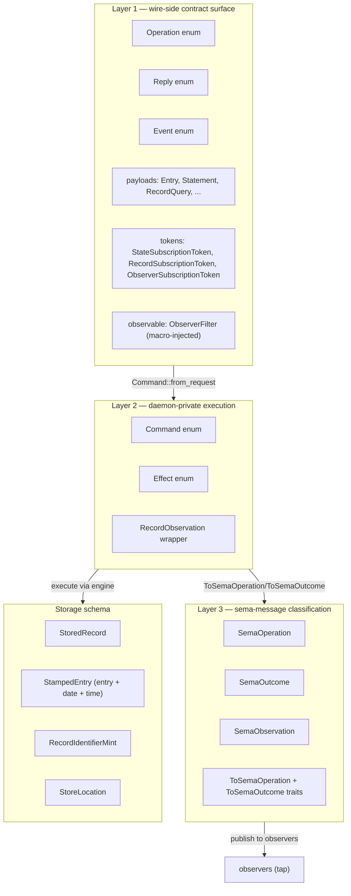
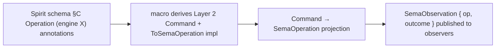
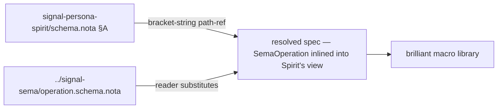

*Kind: Design · Topic: spirit-complete-schema-vision · Date: 2026-05-24*

# 326 — Spirit complete schema — full data type vision + namespace structure

**Status:** extends `/322 §1`'s partial schema with a complete data
type audit; covers the full runtime + messaging system Spirit
needs (Layer 1 wire surface + Layer 2 Command/Effect + Layer 3
sema-message bridge + storage schema). Resolves the psyche's
question: does `/322 §1` give us a working Spirit? **Not by
itself** — `/322` covers the wire surface only. This report adds
the missing layers + namespace structure design.

## §1 The data type inventory — what Spirit actually needs

### §1.1 Three layers + storage



### §1.2 Complete type list — what /322 §1 has + what's missing

Verified against deployed code in `signal-persona-spirit/src/lib.rs`, `persona-spirit/src/observation.rs`, `persona-spirit/src/store.rs`, `signal-sema/src/`:

**Layer 1 wire types (in /322 §1):**
- `Operation` (5 verbs + 2 macro-injected: State, Record, Observe, Watch, Unwatch + Tap, Untap)
- `Reply` (10 variants)
- `Event` (2 variants)
- `Kind`, `ObservationMode`, `Presence`, `UnimplementedReason` (4 leaf enums)
- `Magnitude` (cross-schema from signal-sema)
- 11 newtypes: `Topic`, `Summary`, `Context`, `Quote`, `StatementText`, `RecordIdentifier`, `QuestionIdentifier`, `QuestionText`, `FocusArea`, `StateSubscriptionToken`, `RecordSubscriptionToken`
- 8 composites: `Entry`, `Statement`, `RecordQuery`, `RecordSubscription`, `RecordSummary`, `RecordProvenance`, `TopicCount`, `State`, `QuestionSummary`
- 3 root payloads: `Observation`, `Subscription`, `SubscriptionToken`
- 9 reply payloads: `RecordAccepted`, `StateObserved`, `RecordsObserved`, `RecordProvenancesObserved`, `TopicsObserved`, `QuestionsObserved`, `SubscriptionOpened`, `SubscriptionRetracted`, `RequestUnimplemented`
- 2 event payloads: `StateChanged`, `RecordCaptured`
- 1 stream-snapshot: `SubscriptionSnapshot`

**Missing from /322 §1 (gaps):**

| Type | Where used | Source |
|---|---|---|
| `Date` | `RecordProvenance` field | `signal-persona-spirit/src/lib.rs` |
| `Time` | `RecordProvenance` field | `signal-persona-spirit/src/lib.rs` |
| `ObserverFilter` | observable block macro-injection | macro-emitted |
| `ObserverSubscriptionOpened` | macro-injected reply variant | macro-emitted |
| `ObserverSubscriptionToken` | macro-injected token type | macro-emitted |
| `RecordObservation` | Layer 2 Command wrapper | `signal-persona-spirit/src/lib.rs` |
| `OperationReceived` | observable event payload (operation tag) | `signal-persona-spirit/src/lib.rs` |
| `EffectEmitted` | observable event payload (sema obs) | `signal-persona-spirit/src/lib.rs` |

**Layer 2 types (NOT in /322 §1; derived from `(engine X)` annotations per intent 405):**
- `Command` enum (12 variants) — macro-emitted from Operation + engine annotations
- `Effect` enum (10 variants) — macro-emitted from Reply
- `ToSemaOperation` impl on Command — macro-emitted from engine annotations
- `ToSemaOutcome` impl on Effect — macro-emitted from engine annotations + outcome convention

**Layer 3 sema types (referenced cross-schema from signal-sema):**
- `SemaOperation` (6 variants: Assert/Mutate/Retract/Match/Subscribe/Validate)
- `SemaOutcome` (similar set)
- `SemaObservation` (operation + outcome composition)
- `Magnitude` (referenced separately for Entry's certainty field)

**Storage types (NOT in /322 §1; daemon-private but schema-declarable per the brilliant macro library intent):**
- `StoredRecord` (rkyv-archived; identifier + StampedEntry)
- `StampedEntry` (rkyv-archived; Entry + Date + Time — daemon-stamped wall clock)
- `RecordIdentifierMint` (monotonic counter)
- `StoreLocation` (path wrapper)

### §1.3 What "complete" means

A complete Spirit schema declares EVERY type that:
1. Crosses the wire (Layer 1)
2. Sits in daemon-private execution flow (Layer 2)
3. Persists to disk (storage)
4. Bridges to the sema-message namespace (Layer 3 references)

Plus a few special markers:
- `Date` / `Time` — built-in primitives the schema knows about
- Cross-schema references (`Magnitude` from `signal-sema`, sema-message vocabulary from `signal-sema`)

## §2 The complete Spirit schema in NOTA

### §2.1 With explicit namespace structure (recommended shape)

```nota
;; signal-persona-spirit/schema.nota — Spirit complete schema
;;
;; Structured in three sections:
;;   §A · primitives + cross-schema references
;;   §B · type namespace (every type Spirit declares)
;;   §C · channel surface (Operation / Reply / Event referencing §B)
;;
;; Type names referenced from §C resolve in §B. Cross-schema names
;; resolve via the path-refs in §A.

[
  ;; ────────── §A · primitives + cross-schema references ──────────

  (Magnitude [../signal-sema/magnitude.schema.nota])
  (SemaOperation [../signal-sema/operation.schema.nota])
  (SemaOutcome [../signal-sema/outcome.schema.nota])
  (SemaObservation [../signal-sema/observation.schema.nota])

  ;; ────────── §B · type namespace ──────────

  ;; Leaf enums (workspace vocabulary)
  (Kind Decision Principle Correction Clarification Constraint)
  (ObservationMode SummaryOnly WithProvenance)
  (Presence Active Absent)
  (UnimplementedReason NotBuiltYet IntegrationNotLanded)

  ;; Newtypes (single-variant data enums over primitives)
  (Topic (Topic String))
  (Summary (Summary String))
  (Context (Context String))
  (Quote (Quote String))
  (StatementText (StatementText String))
  (FocusArea (FocusArea String))
  (RecordIdentifier (RecordIdentifier u64))
  (QuestionIdentifier (QuestionIdentifier String))
  (QuestionText (QuestionText String))
  (StateSubscriptionToken (StateSubscriptionToken u64))
  (RecordSubscriptionToken (RecordSubscriptionToken u64))

  ;; Composite struct-shaped enums (single-variant, multi-field)
  (Entry (Entry Topic Kind Summary Context Magnitude Quote))
  (Statement (Statement StatementText))
  (RecordQuery (RecordQuery [Option Topic] [Option Kind] ObservationMode))
  (RecordSubscription (RecordSubscription [Option Topic] ObservationMode))
  (RecordSummary (RecordSummary RecordIdentifier Topic Kind Summary Magnitude))
  (RecordProvenance (RecordProvenance RecordSummary Context Date Time Quote))
  (TopicCount (TopicCount Topic u64))
  (State (State Presence [Option FocusArea]))
  (QuestionSummary (QuestionSummary QuestionIdentifier QuestionText))

  ;; Layer 2 daemon-private wrappers
  (RecordObservation (RecordObservation RecordQuery))

  ;; Payload roots (multi-variant — what Operations carry)
  (Observation
    State
    (Records RecordQuery)
    Topics
    Questions)
  (Subscription
    State
    (Records RecordSubscription))
  (SubscriptionToken
    (State StateSubscriptionToken)
    (Records RecordSubscriptionToken))

  ;; Storage types (daemon-private redb-archived)
  (StoredRecord (StoredRecord RecordIdentifier StampedEntry))
  (StampedEntry (StampedEntry Entry Date Time))
  (RecordIdentifierMint (RecordIdentifierMint u64))

  ;; Reply payloads
  (RecordAccepted (RecordAccepted RecordIdentifier))
  (StateObserved (StateObserved State))
  (RecordsObserved (RecordsObserved [Vec RecordSummary]))
  (RecordProvenancesObserved (RecordProvenancesObserved [Vec RecordProvenance]))
  (TopicsObserved (TopicsObserved [Vec TopicCount]))
  (QuestionsObserved (QuestionsObserved [Vec QuestionSummary]))
  (SubscriptionOpened (SubscriptionOpened SubscriptionToken SubscriptionSnapshot))
  (SubscriptionRetracted (SubscriptionRetracted SubscriptionToken))
  (RequestUnimplemented (RequestUnimplemented UnimplementedReason))
  (SubscriptionSnapshot
    (State State)
    (Records [Vec RecordSummary]))

  ;; Event payloads (streaming)
  (StateChanged (StateChanged State))
  (RecordCaptured (RecordCaptured RecordSummary))

  ;; Observable-block payloads (macro-injected via the channel observable clause)
  (OperationReceived (OperationReceived OperationKind))
  (EffectEmitted (EffectEmitted SemaObservation))

  ;; ────────── §C · channel surface ──────────

  (Operation
    (State (Statement (engine assert)))
    (Record (Entry (engine assert)))
    (Observe (Observation (engine match)))
    (Watch (Subscription (engine subscribe)))
    (Unwatch (SubscriptionToken (engine retract))))

  (Reply
    (RecordAccepted RecordAccepted)
    (StateObserved StateObserved)
    (RecordsObserved RecordsObserved)
    (RecordProvenancesObserved RecordProvenancesObserved)
    (TopicsObserved TopicsObserved)
    (QuestionsObserved QuestionsObserved)
    (SubscriptionOpened SubscriptionOpened)
    (SubscriptionRetracted SubscriptionRetracted)
    (RequestUnimplemented RequestUnimplemented))

  (Event
    (StateChanged (StateChanged belongs DomainStream))
    (RecordCaptured (RecordCaptured belongs DomainStream)))

  (Observable
    (filter default)
    (operation_event OperationReceived)
    (effect_event EffectEmitted))
]
```

~75 lines NOTA. Adds 4 cross-schema refs + 3 storage types + 2 observable-block payloads + the explicit `Observable` declaration over /322 §1. Replaces the ~700 LoC of hand-written contract + daemon-private + storage code that Spirit currently has across `signal-persona-spirit/src/lib.rs` + `persona-spirit/src/observation.rs` + `persona-spirit/src/store.rs`.

### §2.2 What the macro derives from this schema

| Output | Derived from |
|---|---|
| Layer 1 wire types (Operation/Reply/Event + payloads + tokens + newtypes + leaves) | §B + §C declarations |
| NOTA + rkyv codecs for every Layer 1 type | §B + §C |
| Frame aliases + ShortHeader projection (LogVariant per channel) | §C Operation variants |
| `Command` enum + `from_request` impl | §C `(engine X)` annotations + Operation variants |
| `Effect` enum + `from_reply` impl + `into_reply` impl | §C Reply variants + outcome convention |
| `ToSemaOperation for Command` impl | §C `(engine X)` annotations |
| `ToSemaOutcome for Effect` impl | §C Reply + outcome convention |
| `OperationDispatch` trait + dispatcher (header byte 0 → handler routing) | §C Operation variants per intent 407 |
| `VersionProjection<v010::T, v011::T>` for changed types | schema diff (when `next_schema` declared) |
| `StoredRecord` + `StampedEntry` rkyv archives + redb table descriptors | §B storage type declarations |
| `OperationReceived` + `EffectEmitted` observable event payloads | §C Observable declaration |

The macro covers everything except:
- Actor topology (Kameo planes)
- Authorization checks
- Domain logic (e.g., Spirit's `ClassifyStatement` classifier)

Those stay hand-written in `persona-spirit/src/actors/` + `persona-spirit/src/daemon.rs`.

## §3 Namespace structure — why sectional

### §3.1 Three options considered

The psyche's question: where do type names get DEFINED in the schema? Three options:

| Option | Shape | Note |
|---|---|---|
| (A) flat vector | one vector mixing all declarations | /322 §1 form; works but lacks visual structure |
| (B) sectional vector | one vector with `;;` comment headers splitting concerns | §2.1 form above; recommended |
| (C) map-of-namespace | `{TypeName Definition}` map | clean for the namespace but inconsistent with NOTA's positional vector form elsewhere |

### §3.2 Recommendation — sectional vector (Option B)

The schema is a single NOTA vector with three sections delimited by NOTA-comments (`;;`):
- §A · primitives + cross-schema references (4 entries)
- §B · type namespace (all type declarations; ~26 entries)
- §C · channel surface (Operation + Reply + Event + Observable; 4 entries)

Why sectional vector over map:
- Maps in NOTA are `{key value}` for runtime data with `String`-like keys; a SCHEMA declaration is structural, not runtime data.
- Vector order matters: types referenced from §C resolve in §B (positional discipline).
- `;;` comment headers cost nothing and dramatically improve agent readability.
- Multi-file split per intent 395's path-refs stays an orthogonal mechanism — sections in one file is the in-file structure; cross-file splits use path-refs.

### §3.3 The `(SemaOperation [...])` cross-schema reference

§A's cross-schema refs are bracket-string path-refs per intent 395:
```nota
(SemaOperation [../signal-sema/operation.schema.nota])
```

The reader substitutes the resolved declaration from the referenced file. Spirit's schema then uses `SemaOperation` as if it were declared locally, even though it lives in `signal-sema/operation.schema.nota`.

This is how the sema-message namespace appears in Spirit's schema: Spirit DECLARES that it consumes `SemaOperation` + `SemaOutcome` + `SemaObservation` + `Magnitude` from `signal-sema`. The actual definitions live in `signal-sema`'s schema file. The brilliant macro library resolves and uses them.

### §3.4 Open question — separate file per type? per section?

The path-refs in §A pull in cross-schema types. Could Spirit's §B type declarations also live in separate files? Two reasonable shapes:

| Shape | Pros | Cons |
|---|---|---|
| All in `schema.nota` | one file = one view of Spirit's surface | grows large for complex channels |
| Split: `channel.nota` + `types.nota` + `storage.nota` | matches the sectional structure | three files to keep in sync |

**Lean: all in `schema.nota` for the MVP**. ~75 lines is readable. Split if a channel grows past ~150 lines. Per `/164 §4.4`'s convention: schemas live at `<repo>/schema.nota` at repo root by default.

## §4 The sema-message namespace bridge

### §4.1 How the schema encodes the bridge



The `(engine assert)` / `(engine match)` / `(engine subscribe)` / `(engine retract)` annotations in §C's Operation declaration are the schema's encoding of the sema-message bridge. Each operation variant gets mapped to one of the six `SemaOperation` classes (Assert/Mutate/Retract/Match/Subscribe/Validate). The macro emits:

- `Command::AssertEntry(Entry)` from `(Record (Entry (engine assert)))` — variant name = `Assert<PayloadTypeName>`; the `assert` annotation drives both the name and the `ToSemaOperation` arm.
- `impl ToSemaOperation for Command { Self::AssertEntry(_) => SemaOperation::Assert, ... }` — derived from the engine annotation.
- `Effect::RecordAccepted(RecordAccepted)` from `(Reply (RecordAccepted RecordAccepted))` — outcome convention names the Effect variant after the Reply.
- `impl ToSemaOutcome for Effect { Self::RecordAccepted(_) => SemaOutcome::Asserted, ... }` — derived from the verb chosen via §C's `(engine X)` annotation on the matching Operation.

### §4.2 Why the sema-message namespace is universal

`SemaObservation` is one type defined ONCE in `signal-sema`; every component's macro-emitted `Effect` projects into it. An observer subscribing to a workspace-wide sema-observation stream sees uniform classification across Spirit + Mind + Router + etc. — independent of any specific component's domain vocabulary.

The sema-message namespace is what makes:
- Cross-component logging (`persona-introspect` consumes any component's sema stream)
- Tap-anywhere observability (any sema observation can be tapped by any observer)
- Upgrade-mechanism propagation (the upgrade daemon can subscribe to sema events workspace-wide to coordinate cutovers)
- Audit + debug pipelines (same vocabulary every component uses)

All possible. The macro turns one `(engine X)` annotation per Operation variant into the full bridge.

## §5 Storage schema

### §5.1 `StampedEntry` and `StoredRecord`

```nota
(StoredRecord (StoredRecord RecordIdentifier StampedEntry))
(StampedEntry (StampedEntry Entry Date Time))
```

`StoredRecord` is what lives in the redb table; `StampedEntry` wraps an `Entry` with the daemon's wall-clock stamp (`Date` + `Time` — the daemon stamps these, not the client).

### §5.2 Macro emits redb table descriptors

From the storage type declarations + the channel surface, the macro can emit:

```rust
// Macro-emitted from §B storage declarations:
pub const RECORDS_TABLE: TableName = TableName::new("records");
pub fn records_descriptor() -> TableDescriptor<StoredRecord> { ... }

// Macro-emitted from §C Reply payloads pointing at storage types:
impl Engine {
    pub fn open_spirit(location: &StoreLocation) -> Result<SpiritStore> {
        let mut engine = Engine::open(EngineOpen::new(location.as_path(), SPIRIT_SCHEMA_VERSION))?;
        let records = engine.register_table(records_descriptor())?;
        Ok(SpiritStore { engine, records })
    }
}
```

The `SPIRIT_SCHEMA_VERSION` const is derived from the schema's identity (a Blake3 hash of the resolved spec per `/279`); on first cutover the v0.1.0 → v0.1.1 schema change bumps the version.

### §5.3 The contract-version stamp (per `/317-3 + spirit 366`)

The schema's identity becomes the daemon's `ContractVersion`:

```rust
// Macro-emitted from the schema (Blake3 of resolved spec):
pub const SPIRIT_CONTRACT_VERSION: ContractVersion = ContractVersion::new([/* 32-byte hash */]);

impl Projected for StampedEntry {
    const CONTRACT_VERSION: ContractVersion = SPIRIT_CONTRACT_VERSION;
    fn component() -> ComponentName { ComponentName::new("persona-spirit") }
}
```

When the schema changes (v0.1.0 → v0.1.1), the hash changes, the `Projected::CONTRACT_VERSION` const updates, and the handover protocol per `/323 §10` validates that current and next daemons see compatible (or migration-bridged) hashes.

## §6 What changes from `/322 §1`

| Concern | /322 §1 | /326 §2.1 |
|---|---|---|
| Wire-side types | yes | yes |
| Cross-schema references | one (`Magnitude`) | four (Magnitude + SemaOperation + SemaOutcome + SemaObservation) |
| Layer 2 (Command/Effect) | implicit (macro-emitted post-hoc) | explicit via `(engine X)` annotations + schema-derivable |
| Layer 3 (sema bridge) | not surfaced | declared via cross-schema refs in §A |
| Storage types | not in schema | `StoredRecord`, `StampedEntry`, `RecordIdentifierMint` in §B |
| Observable block | implicit | explicit `(Observable …)` in §C |
| Date / Time primitives | implicit | explicit (built-in primitives the schema references) |
| Macro-injected types (`ObserverFilter`, etc.) | implicit | implicit (still macro-injected from `Observable` clause) |
| Sectional structure | flat vector | §A primitives / §B namespace / §C channel surface |
| File size | ~50 lines | ~75 lines |
| Hand-written code reduction | ~89% of `signal-persona-spirit/src/lib.rs` | ~95% of `signal-persona-spirit/src/lib.rs` + `persona-spirit/src/observation.rs` + most of `persona-spirit/src/store.rs` |

The bigger win: `/326`'s schema lets the macro derive Layer 2 + storage too. Hand-written code shrinks from ~700 LoC across three files to maybe ~150 LoC (the classifier domain logic + actor topology + auth checks).

## §7 What stays implicit / convention-based

The schema doesn't declare:
- Actor topology (`SpiritRoot`, `IngressPhase`, `DispatchPhase`, classifier plane, clock plane, etc.) — hand-written Kameo actor graph
- Authorization checks — what `Caller` classes can call what operations (post-`primary-5k6n` lands the `IngressContext` ARCH section)
- Performance tuning — table indexing, batch sizes, subscription delivery strategy
- Daemon-internal lifecycle — socket binding, supervision tree
- The classifier logic for `ClassifyStatement` (Spirit's domain-specific intelligence)
- redb-internal options (page size, sync mode, etc.)

The schema is the COMPLETE WIRE + STORAGE + LOWERING SPECIFICATION; runtime details stay code.

## §8 Open psyche questions

### §8.1 Sectional headers vs separate files

§3.4: keep sectional structure in one `schema.nota` (current lean) OR split into `types.nota` + `channel.nota` + `storage.nota`? Lean: one file for MVP; split if Spirit's schema grows past ~150 lines.

### §8.2 Storage type macro emission depth

§5.2: should the macro emit FULL `Engine::open_spirit` setup (table registration, schema-version stamping) OR just the type descriptors + leave `open_spirit` hand-written? Lean: emit the descriptors + the table-registration helpers; let the daemon's `open_spirit` consume them + add its own auth/configuration.

### §8.3 Observable block macro injection vs explicit declaration

§B+§C: should the `Observable` declaration sit in §C as explicit (current /326 form) or stay macro-injected when the channel is a persona component (per /322's implicit handling)? Lean: **explicit declaration in §C** — the schema is the complete spec; everything visible.

### §8.4 Engine annotation for non-engine-bound operations

`Tap` / `Untap` operations don't route through the sema-engine (they route through the `ObserverSet` runtime). What `(engine X)` annotation do they carry? Lean: `(engine subscribe)` / `(engine retract)` — they semantically open + close subscriptions even though the data plane differs from sema-engine subscribes. The macro's dispatcher routes engine-bound vs observable-bound separately based on the variant payload type.

## §9 The path-ref namespace mechanism — cross-schema references



The schema reader (per `/320 §3.1.A`) resolves path-refs sandboxed to:
- Sibling files in the same crate's schema directory
- Cargo-dep crates' exported schemas via the symbolic-ref form (`signal-sema:Magnitude`)

The macro never sees paths — the resolved spec is fully inline by the time it processes. Cycles are errors. Cross-schema references are the schema language's namespace import mechanism.

## §10 See also

- `reports/designer/322-spirit-mvp-positional-schema-worked-example.md`
  — `§1` partial schema this report extends to complete coverage
- `reports/designer/324-migration-mvp-spirit-handover-re-specification.md`
  — current canonical state; this report adds Layer 2 + storage + sema-bridge
- `reports/designer/323-mvp-scope-expansion-per-operator-directive.md`
  — scope including dispatch + projection (the macro emits these from the complete schema)
- `reports/second-designer/163-signal-sema-interaction-and-spirit-architecture-2026-05-24.md`
  — three-layer model (Layer 1 contract / Layer 2 component / Layer 3 sema) this report's schema unifies
- `reports/second-designer/164-nota-schema-language-vector-of-root-verb-enums-2026-05-24.md`
  — schema-language v3 grammar this report uses
- `signal-persona-spirit/src/lib.rs` (~468 LoC today; this schema replaces ~95%)
- `persona-spirit/src/observation.rs` (~158 LoC today; macro-emitted from schema)
- `persona-spirit/src/store.rs` (~700 LoC; ~50% schema-derived)
- `signal-sema/src/operation.rs`, `outcome.rs` — Layer 3 universal vocabulary
- Spirit records 388-408 + `/166 §2` catalog
