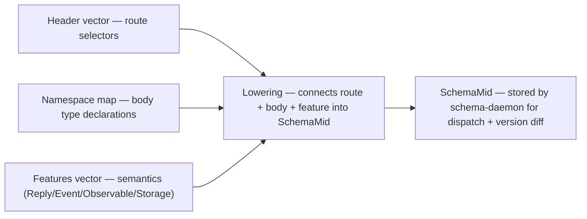

*Kind: Design · Topic: spirit-complete-schema-vision · Date: 2026-05-24*

# 326 — Spirit complete schema — header/body/feature separation

**Status:** v11 — absorbs operator/174's architectural separation. Three layers cleanly separated: **route** (header vector — pure dispatch selectors), **body** (namespace map — type definitions + payloads), **feature** (features vector — semantics beyond body typing). Form 2 header entries are route-selectors-only; body shapes live in the namespace; lowering connects them. Container-type fix from v10 preserved. Import-shape correction from v9 preserved. Closes several open questions per /174's recommendations.

## §1 The three-layer architecture



Per operator/174 §"Better Separation":

| Layer | Authored location | Purpose |
|---|---|---|
| **Route** | header vector (Positions 1-3) | fast dispatch + actor routing |
| **Body** | namespace map (Position 4) | type definitions + nested payloads |
| **Feature** | features vector (Position 5) | semantics beyond body typing — streams, events, observability, storage |

**Critical rule:** the header carries route selectors ONLY. It does NOT carry payload syntax. Body type information lives in the namespace under the same NAME as the route root; lowering connects them.

## §2 The complete Spirit schema — v11

Spirit's actual MVP (all-Form-1, no Watch sub-endpoints):

```nota
{
  Magnitude (ImportAll ../signal-sema/magnitude.schema)
  SemaSet (Import ../signal-sema/operation.schema [SemaOperation SemaOutcome SemaObservation])
}

[
  (State Statement)
  (Record Entry)
  (Observe Observation)
  (Watch Subscription)
  (Unwatch SubscriptionToken)
]

[]

[]

{
  Kind [Decision Principle Correction Clarification Constraint]
  ObservationMode [SummaryOnly WithProvenance]
  Presence [Active Absent]
  UnimplementedReason [NotBuiltYet IntegrationNotLanded]

  Topic (String)
  Summary (String)
  Context (String)
  Quote (String)
  StatementText (String)
  FocusArea (String)
  RecordIdentifier (u64)
  QuestionIdentifier (String)
  QuestionText (String)
  StateSubscriptionToken (u64)
  RecordSubscriptionToken (u64)

  Entry (Topic Kind Summary Context Magnitude Quote)
  Statement (StatementText)
  RecordQuery ((Option Topic) (Option Kind) ObservationMode)
  RecordSubscription ((Option Topic) ObservationMode)
  RecordSummary (RecordIdentifier Topic Kind Summary Magnitude)
  RecordProvenance (RecordSummary Context Date Time Quote)
  TopicCount (Topic u64)
  State (Presence (Option FocusArea))
  QuestionSummary (QuestionIdentifier QuestionText)

  RecordObservation (RecordQuery)

  Observation [State (Records RecordQuery) Topics Questions]
  Subscription [State (Records RecordSubscription)]
  SubscriptionToken [(State StateSubscriptionToken) (Records RecordSubscriptionToken)]

  StoredRecord (RecordIdentifier StampedEntry)
  StampedEntry (Entry Date Time)
  RecordIdentifierMint (u64)

  RecordAccepted (RecordIdentifier)
  StateObserved (State)
  RecordsObserved ((Vec RecordSummary))
  RecordProvenancesObserved ((Vec RecordProvenance))
  TopicsObserved ((Vec TopicCount))
  QuestionsObserved ((Vec QuestionSummary))
  SubscriptionOpened (SubscriptionToken SubscriptionSnapshot)
  SubscriptionRetracted (SubscriptionToken)
  RequestUnimplemented (UnimplementedReason)
  SubscriptionSnapshot [(State State) (Records (Vec RecordSummary))]

  StateChanged (State)
  RecordCaptured (RecordSummary)

  OperationReceived (OperationKind)
  EffectEmitted (SemaObservation)
}

[
  (Reply
    RecordAccepted
    StateObserved
    RecordsObserved
    RecordProvenancesObserved
    TopicsObserved
    QuestionsObserved
    SubscriptionOpened
    SubscriptionRetracted
    RequestUnimplemented)

  (Event (belongs DomainStream)
    StateChanged
    RecordCaptured)

  (Observable
    (filter default)
    (operation_event OperationReceived)
    (effect_event EffectEmitted))
]
```

## §3 The header/body separation — Form 2 illustrated

If Spirit later splits Watch into multiple endpoints (State/Records/Questions), the route + body separation looks like:

**Header (Position 1) — pure route selectors:**

```nota
[
  (State Statement)
  (Record Entry)
  (Observe Observation)
  (Watch [State Records Questions])
  (Unwatch [State Records Questions])
]
```

**Namespace (Position 4) — body type declarations with same name:**

```nota
{
  ;; ... other types ...

  Watch [
    (State StateSubscription)
    (Records RecordSubscription)
    (Questions QuestionSubscription)
  ]

  Unwatch [
    (State StateSubscriptionToken)
    (Records RecordSubscriptionToken)
    (Questions QuestionSubscriptionToken)
  ]

  StateSubscription (ObservationMode)
  RecordSubscription ((Option Topic) (Option Kind) ObservationMode)
  QuestionSubscription (ObservationMode)
  ;; tokens analogous
}
```

The header's `Watch [State Records Questions]` is route-selectors only — three nested unit-variant selectors with no payload syntax. The namespace's `Watch` enum is the body shape — `(State StateSubscription) (Records RecordSubscription) (Questions QuestionSubscription)` carrying the actual payload types per route.

**The intentional name sharing** is the architectural seam: header `Watch` and namespace `Watch` are DIFFERENT objects in the parser but CONNECTED at lowering time. The route + body share a name; the lowerer constructs `(Route ordinary 3 Watch (Some 0 State) StateSubscription)` etc. per operator/174's SchemaMid form.

**Why this matters:** per operator/174 §"Header Critique", the BAD alternative `(Watch [(State StateSubscription) (Records RecordSubscription)])` duplicates body information in the header field — makes it both route table and body declaration, ugly when imports + collision checks + generated names land. The good form keeps these jobs clean and lets the lowerer connect them.

## §4 The lowered SchemaMid — what the schema-daemon stores

Per operator/174 §"Lowered Mid Representation":

```nota
(SchemaMid
  spirit
  [
    (ImportBinding Magnitude ../signal-sema/magnitude.schema All)
    (ImportBinding SemaSet ../signal-sema/operation.schema [SemaOperation SemaOutcome SemaObservation])
  ]
  [
    (Route ordinary 0 State None Statement)
    (Route ordinary 1 Record None Entry)
    (Route ordinary 2 Observe None Observation)
    (Route ordinary 3 Watch None Subscription)
    (Route ordinary 4 Unwatch None SubscriptionToken)
  ]
  [
    (Type spirit::Entry (Struct [Topic Kind Summary Context Magnitude Quote]))
    (Type spirit::Kind (Enum [Decision Principle Correction Clarification Constraint]))
    (Type signal-sema::Magnitude (Imported ../signal-sema/magnitude.schema Magnitude))
    ;; ... etc per Spirit's namespace ...
  ])
```

For the Form 2 Watch case:

```nota
(Route ordinary 3 Watch (Some 0 State) StateSubscription)
(Route ordinary 3 Watch (Some 1 Records) RecordSubscription)
(Route ordinary 3 Watch (Some 2 Questions) QuestionSubscription)
```

Each Route entry: `(Route leg root_slot root_name endpoint body_type)`. Leg distinguishes ordinary/owner/sema; root_slot is the byte-0 discriminator; endpoint is `None` for Form 1 or `(Some slot endpoint_name)` for Form 2; body_type is the fully-qualified type reference.

The SchemaMid form is the schema-daemon's durable object — stored in the daemon's database, diffable for version migration, queryable by short-header for dispatch lookup. The authored `.schema` files are human-facing sugar; the SchemaMid is the machine-explicit form.

## §5 Import rules — collision is an error

Per operator/174 §"Collision Rule": imports resolve into the local namespace directly. Duplicate identifiers (whether import-import collision or import-local-decl collision) are SCHEMA ERRORS.

```nota
;; BAD — duplicate imported identifier SemaOperation
{
  SemaA (Import ../signal-sema/operation.schema [SemaOperation])
  SemaB (Import ../other/sema.schema [SemaOperation])
}
;; Error: duplicate imported identifier: SemaOperation from SemaA and SemaB
```

The map key (`SemaA`, `SemaB`) is a PROVENANCE LABEL only — not a namespace prefix. Imported names enter the local namespace flat. Future `ImportAs` mechanism (for explicit rename on collision) is deferred until a real collision arises.

```nota
;; FUTURE only when needed
SemaA (ImportAs ../signal-sema/operation.schema [(SemaOperation OperationClass)])
```

## §6 What changes from v10

| Concern | v10 | v11 |
|---|---|---|
| Form 2 nested-depth | recursive data-carrying allowed (blurs route + body) | RESOLVED — route-selectors-only at nested level per operator/174; body lives in namespace |
| Header/body separation | implicit | explicit three-layer architecture (Route / Body / Feature) per operator/174 §"Better Separation" |
| Name sharing across layers | not documented | EXPLICIT — header `Watch` and namespace `Watch` are different parser objects connected at lowering; intentional name reuse is the architectural seam |
| Import collision rule | not specified | EXPLICIT — duplicate identifier is a schema error; map key is provenance label only; `ImportAs` deferred |
| SchemaMid form | sketched in v8 §4 | concrete `(Route leg root_slot root_name endpoint body_type)` shape from operator/174 |
| Container types `(Vec X)` `(Option X)` | landed in v10 | unchanged |
| Import variants `(Import …)` `(ImportAll …)` | landed in v9 | unchanged |
| Six-position file shape | unchanged from v8/v9/v10 | unchanged |

## §7 Open questions closed by v11

| Question | Resolution |
|---|---|
| Form 2 nested depth — data-carrying allowed? | NO. Route-selectors-only at nested level per operator/174's recommendation. Body shapes live in namespace. |
| Where Reply + Event live | Position 5 features vector (confirmed by operator/174) |
| Storage in namespace vs feature | namespace for types + feature for metadata (operator/174's three-layer separation suggests storage METADATA goes to feature; storage TYPES stay in namespace) |
| Empty header `[]` | always `[]` for unused legs (operator/174 confirms) |
| Import collision behavior | ERROR (was open; operator/174 specifies) |
| Import map key meaning | provenance label only, not namespace prefix (operator/174 specifies) |
| SchemaMid concrete shape | `(SchemaMid component [imports] [routes] [types])` per operator/174 |

## §8 Open questions still standing

| Question | Lean | Status |
|---|---|---|
| Parser support for no-outer-parens | `.schema` parser as superset of nota-codec | open |
| File naming `<component>/<component>.schema` | lean yes | open |
| Engine annotations location | convention for MVP; explicit Position 6 post-MVP if needed | open |
| `EnumIdentifier` NOTA derived type implementation | `#[derive(NotaEnumIdentifier)]` in nota-derive | open |
| Variant auto-promotion rule | bare name → namespace lookup; if matches → data-carrying | open |
| UID structure | `component::namespace::type` | open |
| Library location | `nota-schema/` peer to `nota-codec` (or in nota repo) | open |
| Field-name override syntax | `(field-name type)` post-MVP | open |

## §9 Implementation order per operator/174 §"Implementation Order I Would Use"

Concrete steps the macro library operator should take:

1. Parse import directives exactly per v9/v10: `ImportAll(Path)` and `Import(Path, Vec<EnumIdentifier>)`. Base schema type declaration: `(Import Path (Vec EnumIdentifier))` (container-type parens per v10).
2. Add import collision diagnostics (per `§5`).
3. Add Form 2 header parsing for `(Root [Endpoint…])` — pure route selectors at nested level.
4. Lower Form 1 + Form 2 into one `SchemaMid` route table (per `§4`).
5. Keep endpoint body resolution OUT of the header parser; resolve via namespace lookup during lowering.
6. Emit the 64-bit short-header table from `SchemaMid`, not from the raw authored schema.
7. Add round-trip tests: authored schema → `SchemaMid` → generated dispatch table.

This is what `primary-ezqx.1` operator implements against. Better than my abstract spec — operator/174 named the concrete passes.

## §10 What this report supersedes

`/326-v11` SUPERSEDES `/326-v10`. This commit deletes `/326-v10` per `skills/reporting.md` v-suffix rule.

## §11 See also

- `reports/designer/322-spirit-mvp-positional-schema-worked-example.md`
- `reports/designer/324-migration-mvp-spirit-handover-re-specification.md`
- `reports/designer/323-mvp-scope-expansion-per-operator-directive.md`
- `reports/designer/320-mvp-schema-language-pilot-unblock.md`
- `reports/second-designer/164-nota-schema-language-vector-of-root-verb-enums-2026-05-24.md`
- `reports/second-designer/169-schema-file-shape-corrections-post-326-v3-2026-05-24.md`
- **`reports/operator/174-schema-import-header-design-critique-2026-05-24.md`** — the substance v11 absorbs (header/body/feature separation; import collision rule; SchemaMid shape; implementation order; spirit 481-485)
- `reports/operator/173-schema-header-namespace-and-import-example-2026-05-24.md` — earlier operator parallel substance
- `signal-persona-spirit/src/lib.rs`
- `signal-sema/src/operation.rs` + `outcome.rs`
- `nota/example.nota`
- `nota-codec/tests/*`
- `skills/nota-design.md`
- Spirit records 388-485 (487-489 + 481-485 captured by operator/174)
