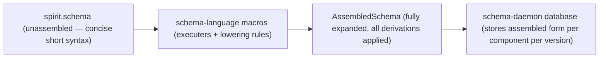
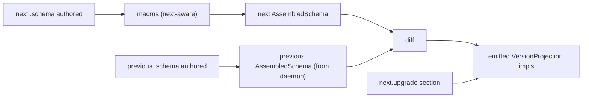

*Kind: Design · Topic: spirit-complete-schema-vision · Date: 2026-05-24*

# 326 — Spirit complete schema — AssembledSchema + macro-as-language + upgrade section

**Status:** v12 — absorbs psyche directives on three new substantive points: (1) rename `SchemaMid` → **AssembledSchema** (more accurate; unambiguous; "schema mid" was unclear). (2) Schemas are themselves a **macro type pattern** — each specialized macro defines a custom schema language; the workspace can have multiple macros for different domain-specific schemas (data components, messages, tables, entry types). (3) Upgrade annotations live in the **NEXT schema** (the version receiving messages from the previous); cover diff-inferable standard cases + explicit annotations for ambiguous transforms + un-migratable rejection messages.

## §1 Three-layer architecture — recap from v11

Route / Body / Feature separation per operator/174. Header carries route selectors only; namespace carries body type declarations; features vector carries observability + streams + storage + upgrade semantics. Lowering connects all three into the AssembledSchema.

## §2 AssembledSchema — the lowered form

**Rename per psyche directive:** `SchemaMid` → `AssembledSchema`. The authored `.schema` file is the **UNASSEMBLED SCHEMA** — concise short syntax, the user-facing design surface. The AssembledSchema is the lowered fully-expanded machine-explicit object the schema-daemon stores.

The authored form's relationship to the assembled form:
- Unassembled is the **header** of the schema — shows architecture + basics + self-descriptive identifiers; full picture requires pulling dependencies.
- Assembled is the long-format **fully resolved** version — all imports inlined, all references resolved, all derivations applied.



Per operator/174's Route form, an AssembledSchema entry reads:

```nota
(Route ordinary 0 State None Statement)
(Route ordinary 3 Watch (Some 0 State) StateSubscription)
```

with leg + root-slot + root-name + optional-endpoint + body-type.

## §3 Schemas ARE macros — a pattern for custom languages

Per psyche: "we have basically defined the bedrock for a new type of structured language declaration with schema. So we can actually have all of this in a macro type. So it's an internal schema type. That's how we do all the lowering into the mid schema. And we can have more than one, obviously we're going to have different variants, macro variants, but they basically will, that's how you're able to create these syntaxes."

The schema language we've been designing is **ONE INSTANCE OF A PATTERN**. The pattern:

1. Define a macro that parses an authored format (NOTA-shaped, short syntax with positional records + maps + enum-shaped vectors).
2. The macro has lowering rules — each authored-form position dispatches to a handler that emits intermediate representation entries.
3. The macro assembles the IR into a fully-explicit object (the AssembledSchema or its analog for other languages).
4. Code emission consumes the assembled object.

Different specialized macros can produce different custom languages — all sharing the pattern but with their own authored syntax + lowering rules + assembled-object shape. Use cases:

| Custom language | Purpose |
|---|---|
| Schema language (this `.schema`) | wire contracts + types + body shapes + dispatch routes |
| Component topology | cluster + daemon + socket-graph for deploy |
| Agent capability | per-agent capability set + permission boundaries |
| Database table layout | redb tables + indices + access patterns |
| Workflow language | declarative orchestration of agent + component interactions |

Each gets its own `.X.schema` extension (or analog), its own macro library, its own assembled form. The pattern provides:
- Concise authored syntax (short, positional, agent-readable)
- Recursive lowering executer (Shen-inspired mid-compilation)
- Assembled-form storage (machine-explicit, diff-able, queryable)
- Code generation from assembled form (typed Rust output)

This is the LIBRARY POTENTIAL the schema-language pattern unlocks. Per spirit 408: NOTA notation deserves its own library; per this pattern: ALL THESE custom languages share the same library backbone.

## §4 The Spirit schema — unchanged from v11

```nota
{
  Magnitude (ImportAll ../signal-sema/magnitude.schema)
  SemaSet (Import ../signal-sema/operation.schema [SemaOperation SemaOutcome SemaObservation])
}

[
  (State Statement)
  (Record Entry)
  (Observe Observation)
  (Watch Subscription)
  (Unwatch SubscriptionToken)
]

[]

[]

{
  Kind [Decision Principle Correction Clarification Constraint]
  ObservationMode [SummaryOnly WithProvenance]
  Presence [Active Absent]
  UnimplementedReason [NotBuiltYet IntegrationNotLanded]

  Topic (String)
  Summary (String)
  Context (String)
  Quote (String)
  StatementText (String)
  FocusArea (String)
  RecordIdentifier (u64)
  QuestionIdentifier (String)
  QuestionText (String)
  StateSubscriptionToken (u64)
  RecordSubscriptionToken (u64)

  Entry (Topic Kind Summary Context Magnitude Quote)
  Statement (StatementText)
  RecordQuery ((Option Topic) (Option Kind) ObservationMode)
  RecordSubscription ((Option Topic) ObservationMode)
  RecordSummary (RecordIdentifier Topic Kind Summary Magnitude)
  RecordProvenance (RecordSummary Context Date Time Quote)
  TopicCount (Topic u64)
  State (Presence (Option FocusArea))
  QuestionSummary (QuestionIdentifier QuestionText)

  RecordObservation (RecordQuery)

  Observation [State (Records RecordQuery) Topics Questions]
  Subscription [State (Records RecordSubscription)]
  SubscriptionToken [(State StateSubscriptionToken) (Records RecordSubscriptionToken)]

  StoredRecord (RecordIdentifier StampedEntry)
  StampedEntry (Entry Date Time)
  RecordIdentifierMint (u64)

  RecordAccepted (RecordIdentifier)
  StateObserved (State)
  RecordsObserved ((Vec RecordSummary))
  RecordProvenancesObserved ((Vec RecordProvenance))
  TopicsObserved ((Vec TopicCount))
  QuestionsObserved ((Vec QuestionSummary))
  SubscriptionOpened (SubscriptionToken SubscriptionSnapshot)
  SubscriptionRetracted (SubscriptionToken)
  RequestUnimplemented (UnimplementedReason)
  SubscriptionSnapshot [(State State) (Records (Vec RecordSummary))]

  StateChanged (State)
  RecordCaptured (RecordSummary)

  OperationReceived (OperationKind)
  EffectEmitted (SemaObservation)
}

[
  (Reply
    RecordAccepted
    StateObserved
    RecordsObserved
    RecordProvenancesObserved
    TopicsObserved
    QuestionsObserved
    SubscriptionOpened
    SubscriptionRetracted
    RequestUnimplemented)

  (Event (belongs DomainStream)
    StateChanged
    RecordCaptured)

  (Observable
    (filter default)
    (operation_event OperationReceived)
    (effect_event EffectEmitted))
]
```

This is Spirit v0.1.1 with no upgrade annotations because Spirit's v0.1.1 is the bootstrap (no previous version to migrate from). When v0.1.2 lands, IT will carry the upgrade section describing migration from v0.1.1.

## §5 The upgrade section — annotations in the NEXT schema

Per psyche: "It's really the next version that upgrades... So it's really from the last that we compile the upgrade path. Not from the last, I mean the next has the upgrade path from the last."

The upgrade section lives in the NEXT version's schema file. It describes how to migrate FROM the previous version's data shapes. The macro is aware of the NEXT schema's relationship to the previous; the diff between the two assembled forms drives upgrade emission.

### §5.1 Where the upgrade section sits

Extends the schema file to a 7th positional field OR (lean) lives as a variant inside the existing Position 5 features vector:

```nota
;; Position 5 features — adds (Upgrade …) variant for the upgrade annotations
[
  (Reply
    RecordAccepted
    StateObserved
    ;; ...
  )

  (Event (belongs DomainStream)
    StateChanged
    RecordCaptured)

  (Observable
    (filter default)
    (operation_event OperationReceived)
    (effect_event EffectEmitted))

  (Upgrade (FromVersion v0.1.1)
    (Migrate Magnitude)                       ;; widened; needs trait impl per inference rule
    (Migrate Entry)                           ;; field certainty changed type; needs impl
    (RenamedFrom Statement Utterance)         ;; Statement was Utterance previously
    (Drop FocusArea)                          ;; field FocusArea was dropped; explicit
    (Custom RecordProvenance SpiritRecordProvenanceUpgrade)  ;; custom impl needed
  )
]
```

Lean: the `(Upgrade …)` feature variant. Six positional fields stay; upgrade is just another feature kind.

### §5.2 Upgrade annotation forms

| Form | Meaning |
|---|---|
| `(Migrate Type)` | Type's shape changed; macro infers diff + emits standard transform if possible; otherwise compiler error pointing at the type for explicit annotation or impl |
| `(RenamedFrom OldName)` | Type was named differently in previous version; macro applies the rename when reading old data |
| `(Drop FieldName)` | Field was dropped; explicit declaration of breaking change; previous data with this field has it silently discarded during migration |
| `(Custom Type ImplName)` | Complex transformation requires a hand-written `From<Old> for New` impl named `ImplName`; macro wires it into the projection |
| `(Untranslatable Type)` | Type cannot be migrated; messages of this type get rejected per `§7` |

### §5.3 Standard inference (no annotation needed)

The macro reads previous + next assembled schemas and INFERS standard transforms:
- Adding a new field with a default → standard (no annotation needed)
- Adding a new variant (additive) → standard
- Type unchanged → Identity projection (no annotation)
- Pure rename (handled by `RenamedFrom`)

Anything else needs annotation. The macro errors with a clear diagnostic at compile-time naming the type that can't be inferred + suggesting which annotation form to use.

## §6 Diff-driven upgrade emission



The macro reads BOTH schemas at the next version's compile time. The diff identifies type changes; the upgrade section provides annotations for ambiguous cases. From these the macro emits `impl VersionProjection<Prev::T, Next::T>` for every type — standard inferences are macro-generated, custom impls call the hand-written `From` per `(Custom …)` annotation.

Per `/317-3 §3.2` (already in code per operator landings): the projection trait lives in `version-projection`; the macro emits impls of it.

## §7 Un-migratable rejection messages

Per psyche: "your message was not kept in the old database or your message could not be entered in the new database."

When a type or message can't migrate (declared `(Untranslatable …)` OR encountered as unhandled diff that needs annotation), the handover/upgrade flow returns one of these typed rejections:

```nota
;; Sema-message namespace addition (universal across components):
UpgradeRejection [
  (NotKeptOldDatabase Reason)   ;; sender side: message rejected at old daemon; explained why
  (NotEnteredNewDatabase Reason) ;; receiver side: message rejected at new daemon; explained why
]
Reason (String)
```

The rejection is a typed enum carrying a Reason string. The sender sees one of these in the reply; they know explicitly what went wrong.

### §7.1 Where rejection types live

In `signal-sema` (universal sema-message vocabulary, imported by every component via the existing cross-schema mechanism). New addition to signal-sema's namespace; available to every component's reply types.

For Spirit, when an `UpgradeRejection` arrives, the daemon emits `(RequestUnimplemented (UpgradeRejection …))` OR a dedicated `(UpgradeFailed UpgradeRejection)` reply variant. The schema-daemon's upgrade orchestration knows to deliver these typed rejections to the sender's session.

## §8 What changes from v11

| Concern | v11 | v12 |
|---|---|---|
| Naming `SchemaMid` | introduced from operator/174 | RENAMED to `AssembledSchema` per psyche directive — more accurate, unambiguous |
| Schema-language framing | one schema language | NEW §3 — schemas are an INSTANCE OF a pattern; different specialized macros define different custom languages (data components, messages, tables, entries, workflows) |
| Library potential | hinted | EXPLICIT — the macro pattern is the workspace's universal way to specify any data shape; nota repo library + per-language macro extensions |
| Upgrade section | not in schema | NEW §5 — `(Upgrade (FromVersion X) (Migrate …) (RenamedFrom …) (Drop …) (Custom …) (Untranslatable …))` feature variant; lives in the NEXT version's schema |
| Diff-driven upgrade emission | hinted in v11 §4 | EXPLICIT §6 — macro reads previous + next assembled schemas; standard inferences emit automatically; annotations cover ambiguous cases |
| Un-migratable rejection messages | not in schema | NEW §7 — `UpgradeRejection [(NotKeptOldDatabase Reason) (NotEnteredNewDatabase Reason)]` in signal-sema; typed feedback to sender |
| Authored vs assembled relationship | hinted | EXPLICIT §2 — authored = header (concise, self-descriptive); assembled = long-format (fully resolved, machine-explicit) |
| Spirit schema content | unchanged from v11 | unchanged (v0.1.1 has no upgrade section as it's the bootstrap) |

## §9 Open questions still standing

| Question | Lean | Status |
|---|---|---|
| Parser support for no-outer-parens | `.schema` parser as superset of nota-codec | open |
| File naming `<component>/<component>.schema` | lean yes | open |
| Engine annotations location | convention for MVP | open |
| `EnumIdentifier` NOTA derived type | `#[derive(NotaEnumIdentifier)]` | open |
| Variant auto-promotion rule | bare name → namespace lookup | open |
| UID structure | `component::namespace::type` | open |
| Library location | `nota-schema/` peer to `nota-codec` | open |
| Field-name override syntax | `(field-name type)` post-MVP | open |
| **NEW: Upgrade section position** | Position 5 feature variant `(Upgrade …)` (lean) OR new Position 6 | open |
| **NEW: Standard inference rules** | additive (new field with default), additive (new variant), pure rename via `RenamedFrom`; everything else needs annotation | open |
| **NEW: `UpgradeRejection` location in signal-sema** | new entry in signal-sema namespace; importable per-component | open |
| **NEW: Multi-version chain** | upgrade section is single-hop (FromVersion X); N+2 chains compose at handover time per `/317-3 §6` | open |

## §10 What carries forward from operator/174 + v11

- Three-layer Route/Body/Feature separation
- Form 2 nested = route-selectors-only
- Import collision = schema error; map key = provenance label only
- Six-position file shape (no outer parens; `.schema` extension)
- Container types use parens `(Vec X)` `(Option X)`
- Two import variants `(Import Path [Vec EnumIdentifier])` + `(ImportAll Path)`
- Implementation order per operator/174 §"Implementation Order I Would Use"

## §11 What this report supersedes

`/326-v12` SUPERSEDES `/326-v11`. This commit deletes `/326-v11` per `skills/reporting.md` v-suffix rule.

## §12 See also

- `reports/designer/322-spirit-mvp-positional-schema-worked-example.md`
- `reports/designer/324-migration-mvp-spirit-handover-re-specification.md`
- `reports/designer/323-mvp-scope-expansion-per-operator-directive.md`
- `reports/designer/317-sema-upgrade-and-macro-convergence-audit/3-next-as-dependency-design.md` — next-as-dep design (now in code per operator landings)
- `reports/second-designer/164-nota-schema-language-vector-of-root-verb-enums-2026-05-24.md`
- `reports/second-designer/169-schema-file-shape-corrections-post-326-v3-2026-05-24.md`
- **`reports/operator/174-schema-import-header-design-critique-2026-05-24.md`** — header/body/feature separation; collision rule; implementation order; AssembledSchema (originally SchemaMid) form
- `reports/operator/173-schema-header-namespace-and-import-example-2026-05-24.md` — earlier operator parallel substance
- `signal-persona-spirit/src/lib.rs`
- `signal-sema/src/operation.rs` + `outcome.rs` (UpgradeRejection per §7 lands here)
- `version-projection/src/projection.rs` — `VersionProjection` trait the upgrade section drives emission of
- `upgrade/src/` — upgrade triad daemon (operator's /318 Wave-4 landing) consumes the AssembledSchema for cross-version coordination
- `nota/example.nota`
- `nota-codec/tests/*`
- `skills/nota-design.md`
- Spirit records 388-489 (487-489 + 481-485 captured by operator/173-174; upgrade-section + AssembledSchema rename + macro-as-language pattern from psyche 2026-05-24 this turn)
