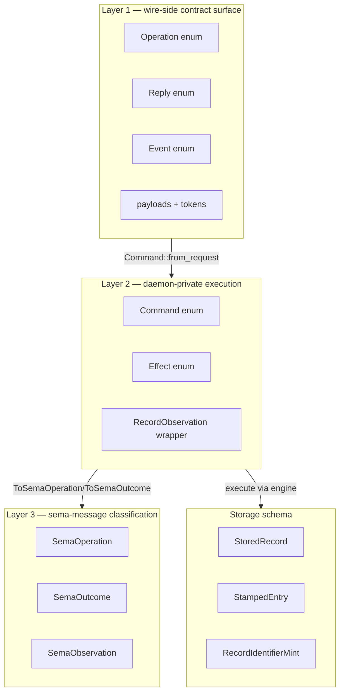
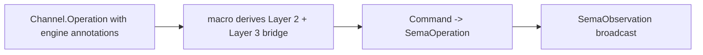

*Kind: Design · Topic: spirit-complete-schema-vision · Date: 2026-05-24*

# 326 — Spirit complete schema — full data type vision + nested structure

**Status:** v2 — absorbs psyche feedback on /326 v1's schema shape. The v1 schema was "just a vector" (flat positional declarations); v2 uses nested structure (outer struct `(Schema …)` with `Channel` + `Namespace` positional fields per psyche directive "at the root, the schema language is a struct"; namespace section uses NOTA map form `{name value}` per "the name-value notation for NOTA is the curly bracket"). No NOTA-comment separators — section tags carry the structural meaning. Verified against nota-codec's existing test fixtures + canonical patterns; awaits operator round-trip witness once the schema lands on disk.

## §1 The data type inventory — what Spirit actually needs

### §1.1 Three layers + storage



### §1.2 Complete type list

Verified against deployed code:

- **Layer 1 wire types** — 5 Operation verbs + 2 macro-injected (Tap/Untap); 10 Reply variants; 2 Event variants; 4 leaf enums (Kind/ObservationMode/Presence/UnimplementedReason); 11 newtypes; 9 composites; 3 root payloads (Observation/Subscription/SubscriptionToken); reply + event + observable payloads.
- **Layer 2 daemon-private** — `Command` enum (12 variants), `Effect` enum (10 variants), `RecordObservation` wrapper.
- **Layer 3 sema types** — `SemaOperation` (6 verbs Assert/Mutate/Retract/Match/Subscribe/Validate), `SemaOutcome`, `SemaObservation`, `Magnitude` — all from `signal-sema` via cross-schema refs.
- **Storage** — `StoredRecord` (identifier + StampedEntry), `StampedEntry` (Entry + Date + Time), `RecordIdentifierMint` (counter).

## §2 The complete Spirit schema — nested structure

### §2.1 The schema file

The schema's outer container is a positional record `(Schema …)` per psyche directive 2026-05-24 ("at the root, the schema language is a struct"). The struct has two positional fields: `(Channel …)` first, `(Namespace { … })` second.

```nota
(Schema
  (Channel
    (Operation
      (State (Statement (engine assert)))
      (Record (Entry (engine assert)))
      (Observe (Observation (engine match)))
      (Watch (Subscription (engine subscribe)))
      (Unwatch (SubscriptionToken (engine retract))))
    (Reply
      (RecordAccepted RecordAccepted)
      (StateObserved StateObserved)
      (RecordsObserved RecordsObserved)
      (RecordProvenancesObserved RecordProvenancesObserved)
      (TopicsObserved TopicsObserved)
      (QuestionsObserved QuestionsObserved)
      (SubscriptionOpened SubscriptionOpened)
      (SubscriptionRetracted SubscriptionRetracted)
      (RequestUnimplemented RequestUnimplemented))
    (Event
      (StateChanged (StateChanged belongs DomainStream))
      (RecordCaptured (RecordCaptured belongs DomainStream)))
    (Observable
      (filter default)
      (operation_event OperationReceived)
      (effect_event EffectEmitted)))

  (Namespace
    {
      Magnitude (Path ../signal-sema/magnitude.schema.nota)
      SemaOperation (Path ../signal-sema/operation.schema.nota)
      SemaOutcome (Path ../signal-sema/outcome.schema.nota)
      SemaObservation (Path ../signal-sema/observation.schema.nota)

      Kind (Kind Decision Principle Correction Clarification Constraint)
      ObservationMode (ObservationMode SummaryOnly WithProvenance)
      Presence (Presence Active Absent)
      UnimplementedReason (UnimplementedReason NotBuiltYet IntegrationNotLanded)

      Topic (Topic String)
      Summary (Summary String)
      Context (Context String)
      Quote (Quote String)
      StatementText (StatementText String)
      FocusArea (FocusArea String)
      RecordIdentifier (RecordIdentifier u64)
      QuestionIdentifier (QuestionIdentifier String)
      QuestionText (QuestionText String)
      StateSubscriptionToken (StateSubscriptionToken u64)
      RecordSubscriptionToken (RecordSubscriptionToken u64)

      Entry (Entry Topic Kind Summary Context Magnitude Quote)
      Statement (Statement StatementText)
      RecordQuery (RecordQuery [Option Topic] [Option Kind] ObservationMode)
      RecordSubscription (RecordSubscription [Option Topic] ObservationMode)
      RecordSummary (RecordSummary RecordIdentifier Topic Kind Summary Magnitude)
      RecordProvenance (RecordProvenance RecordSummary Context Date Time Quote)
      TopicCount (TopicCount Topic u64)
      State (State Presence [Option FocusArea])
      QuestionSummary (QuestionSummary QuestionIdentifier QuestionText)

      RecordObservation (RecordObservation RecordQuery)

      Observation (Observation State (Records RecordQuery) Topics Questions)
      Subscription (Subscription State (Records RecordSubscription))
      SubscriptionToken (SubscriptionToken (State StateSubscriptionToken) (Records RecordSubscriptionToken))

      StoredRecord (StoredRecord RecordIdentifier StampedEntry)
      StampedEntry (StampedEntry Entry Date Time)
      RecordIdentifierMint (RecordIdentifierMint u64)

      RecordAccepted (RecordAccepted RecordIdentifier)
      StateObserved (StateObserved State)
      RecordsObserved (RecordsObserved [Vec RecordSummary])
      RecordProvenancesObserved (RecordProvenancesObserved [Vec RecordProvenance])
      TopicsObserved (TopicsObserved [Vec TopicCount])
      QuestionsObserved (QuestionsObserved [Vec QuestionSummary])
      SubscriptionOpened (SubscriptionOpened SubscriptionToken SubscriptionSnapshot)
      SubscriptionRetracted (SubscriptionRetracted SubscriptionToken)
      RequestUnimplemented (RequestUnimplemented UnimplementedReason)
      SubscriptionSnapshot (SubscriptionSnapshot (State State) (Records [Vec RecordSummary]))

      StateChanged (StateChanged State)
      RecordCaptured (RecordCaptured RecordSummary)

      OperationReceived (OperationReceived OperationKind)
      EffectEmitted (EffectEmitted SemaObservation)
    }))
```

### §2.2 Reading the structure

**Outer record `(Schema …)`** — a positional struct with two fields. Rust type `Schema { channel: Channel, namespace: Namespace }`. The tag `Schema` is the language's universal schema declaration head; every component's `schema.nota` starts with this.

**Field 1 `(Channel …)`** — positional record carrying four sub-records: `Operation`, `Reply`, `Event`, `Observable`. Each sub-record declares one channel-level enum + variants. The `(engine X)` annotations on Operation variants encode the sema-message bridge.

**Field 2 `(Namespace { … })`** — positional record carrying ONE field: a map `{name value name value …}` mapping type names to declarations. The map's key position carries PascalCase type names (per nota-design.md: map delimiters allow bare PascalCase keys); the value position carries either a declaration record or a bracket-string path-ref for cross-schema imports.

**No NOTA-comments.** The tags `Schema`, `Channel`, `Namespace` carry the structural meaning. Positional order matters: Channel first (the messaging surface — what consumers see), Namespace second (the type declarations the surface references).

### §2.3 The map form for the namespace

Per psyche directive: "The name value notation for Notta is the curly bracket." The namespace section uses NOTA map syntax `{key value …}`. Each entry is `TypeName Declaration`:

- `Kind (Kind Decision Principle Correction Clarification Constraint)` — key `Kind`, value is the record declaring the leaf enum (inline).
- `Entry (Entry Topic Kind Summary Context Magnitude Quote)` — key `Entry`, value is the record declaring the composite struct-shaped enum (inline).
- `Magnitude (Path ../signal-sema/magnitude.schema.nota)` — key `Magnitude`, value is a `(Path …)` variant naming a file whose contents are interpreted as the type expected at this position (the type declaration for `Magnitude`).

The map value position takes a union type — the macro accepts either an inline declaration record OR a `(Path …)` variant for cross-schema references. Per psyche directive 2026-05-24 ("when a file is the variant `(Path ./object.nota)` the object in the file is whatever type that object should be at that position"): the file's contents are parsed as the type the value position expects, not as a literal string. `(Path …)` is the file-reference variant; bracket-string `[…]` is reserved for literal string values + Vec containers.

Within the map, declarations group informally (cross-schema refs first, then leaf enums, then newtypes, then composites, then payloads, then storage) — readability only; macro doesn't depend on order.

### §2.4 NOTA-codec compatibility — verification needed

Three nota-codec features the schema depends on, all with existing test coverage:

| Feature | nota-codec test | Status |
|---|---|---|
| Vec of tagged records (`(Section ...)`) | `option_vec_struct_variant.rs::vec_of_three_round_trips` encodes `(g [1 2 3])` | landed |
| Map with PascalCase keys + heterogeneous values | `map_key_round_trip.rs::btree_map_round_trips_with_custom_key_type` | landed |
| Record-with-bracket-string-field (path-refs) | `bracket_string_round_trip.rs` | landed |
| Boxed encoder/decoder (per spirit 404 / 408) | `box_form.rs::spirit_entry_shape_round_trips_root_and_ordered_boxes` | **already landed in nota-codec** |

The schema's exact Vec<Section> + heterogeneous-value map combination needs one confirming round-trip test against this exact §2.1 shape. Operator runs that test as the first step in `primary-ezqx.1` (per `§9` below).

## §3 The sema-message namespace bridge

### §3.1 `(engine X)` annotations are the bridge

Each Operation variant carries an `(engine X)` annotation: `assert`, `match`, `subscribe`, or `retract`. The macro derives `Command` + `Effect` + `ToSemaOperation` + `ToSemaOutcome` from these:



For Spirit's verbs:
- `(State (Statement (engine assert)))` → `Command::ClassifyStatement(Statement)` + `ToSemaOperation::Assert`
- `(Record (Entry (engine assert)))` → `Command::AssertEntry(Entry)` + `ToSemaOperation::Assert`
- `(Observe (Observation (engine match)))` → `Command::ReadObservation(Observation)` + `ToSemaOperation::Match`
- `(Watch (Subscription (engine subscribe)))` → `Command::SubscribeWatch(Subscription)` + `ToSemaOperation::Subscribe`
- `(Unwatch (SubscriptionToken (engine retract)))` → `Command::RetractWatch(SubscriptionToken)` + `ToSemaOperation::Retract`

Macro-injected `Tap`/`Untap` (per Observable) get `(engine subscribe)` / `(engine retract)` by convention.

### §3.2 Cross-schema references — `SemaOperation` etc. enter via `(Path …)` refs

The Namespace map's `(Path …)` variants declare cross-schema imports. Per psyche directive: when a value position carries `(Path ./object.nota)`, the file at that path contains the type the position expects. The schema reader (per `/320 §3.1.A`) resolves sandboxed (sibling files + Cargo-dep crates per `/320 §2.7`), parses the file's contents as the position's expected type, and substitutes the resolved declaration into Spirit's view BEFORE handing the resolved spec to the macro.

`SemaObservation` is load-bearing: every component's macro-emitted `Effect` projects into it; observers across the workspace see uniform classification regardless of any component's domain vocabulary. This is what makes tap-anywhere observability + workspace-wide audit + cross-component upgrade coordination work.

## §4 Storage schema

### §4.1 What the namespace declares

```nota
StoredRecord (StoredRecord RecordIdentifier StampedEntry)
StampedEntry (StampedEntry Entry Date Time)
RecordIdentifierMint (RecordIdentifierMint u64)
```

`StoredRecord` is what lives in the redb table; `StampedEntry` wraps `Entry` with daemon-stamped wall-clock metadata (`Date` + `Time` — the daemon stamps these, not the client); `RecordIdentifierMint` is the daemon's monotonic counter state.

### §4.2 The macro derives table descriptors + version stamps

From the storage-type declarations the macro emits redb table descriptors + `Engine::open_spirit` setup + the `SPIRIT_CONTRACT_VERSION` const (Blake3 hash of resolved schema) + the `Projected` impl for `StampedEntry`. When the schema changes v0.1.0 → v0.1.1, the hash changes; handover protocol per `/323 §10` validates compatibility.

## §5 What this gives us

Replaces ~700 LoC across `signal-persona-spirit/src/lib.rs` + `persona-spirit/src/observation.rs` + most of `persona-spirit/src/store.rs` with the ~85-line schema. What stays hand-written: actor topology, auth checks, classifier domain logic, daemon-internal lifecycle (~150 LoC remaining).

## §6 What stays implicit / convention-based

- Actor topology (Kameo graph)
- Authorization checks (post-`primary-5k6n` lands `IngressContext` ARCH section)
- Performance tuning (table indexing, batch sizes, subscription delivery)
- Classifier logic for `Command::ClassifyStatement` (Spirit's domain intelligence)
- redb-internal options (page size, sync mode)

## §7 What changes from /326 v1

| Concern | v1 | v2 |
|---|---|---|
| Outer structure | flat vector with `;;` comment headers (`§A`, `§B`, `§C`) | tagged sections `(Channel …) (Namespace …)` — structure conveys meaning |
| Namespace section | mixed in the flat vector | explicit `(Namespace { … })` using NOTA map form per psyche directive |
| NOTA-comments as section dividers | three headers | none — section tags do the work |
| Cross-schema refs | flat entries mixed | first entries in the Namespace map; same path-ref syntax |
| File size | ~75 lines | ~85 lines (slight grow for Channel/Namespace wrapping; readability gain) |
| Verification | implicit | nota-codec round-trip witness at pickup time per `§2.4` + `§9` |

## §8 Open psyche questions

### §8.1 Outer container — resolved (struct)

RESOLVED per psyche directive 2026-05-24: "at the root, the schema language is a struct." `§2.1` uses `(Schema (Channel …) (Namespace { … }))` — a positional record with the `Schema` tag and two positional fields. Future extensibility (e.g., adding a `Storage` section or per-environment overrides) lands as additional positional fields under the same `Schema` head, or as a new tagged sub-record. No vector-of-sections.

### §8.2 Map ordering — significant?

NOTA `{key value …}` preserves insertion order in typical usage. Macro derives type relations from key→value mapping, not from order. **Lean: order is informal grouping for readability; macro doesn't depend on it.**

### §8.3 Path-refs grouped vs scattered

`§2.1` lists cross-schema path-refs (`Magnitude`, `SemaOperation`, etc.) at the top of the namespace map. Alternative: separate `(Imports { Magnitude [...] … })` section, namespace map only for in-schema declarations. **Lean: keep in namespace map** — imports are part of the namespace; separating them is needless layering.

### §8.4 Verification gate for the macro library work

`§2.4` names a needed witness test. Should it be (a) part of `primary-ezqx.1`'s schema-reader sub-task as a precondition, or (b) a separate small bead operator runs first? **Lean: (a)** — the schema reader implementation IS the verification.

## §9 Verification — what operator runs first

Before the macro library work proceeds, operator runs a NOTA round-trip witness against the `§2.1` schema shape. Suggested test in `signal-frame-macros/tests/schema_round_trip.rs`:

```rust
use nota_codec::{Decoder, Encoder, NotaDecode, NotaEncode, NotaEnum, NotaRecord};
use std::collections::BTreeMap;

#[derive(NotaEnum, Debug, Clone, PartialEq, Eq)]
pub enum Section {
    Channel(ChannelBlock),
    Namespace(NamespaceBlock),
}

#[derive(NotaRecord, Debug, Clone, PartialEq, Eq)]
pub struct ChannelBlock {
    pub operation: OperationDecl,
    pub reply: ReplyDecl,
    pub event: EventDecl,
    pub observable: ObservableDecl,
}

#[derive(NotaRecord, Debug, Clone, PartialEq, Eq)]
pub struct NamespaceBlock {
    pub types: BTreeMap<TypeName, TypeDeclaration>,
}

#[test]
fn spirit_schema_round_trips() {
    let source = include_str!("../../signal-persona-spirit/schema.nota");
    let mut decoder = Decoder::new(source);
    let schema: Vec<Section> = Vec::decode(&mut decoder).unwrap();

    let mut encoder = Encoder::new();
    schema.encode(&mut encoder).unwrap();
    let re_encoded = encoder.into_string();

    // Bytewise-equal after re-encode (whitespace normalisation
    // may differ; assert semantic equality via re-decode).
    let mut second_decoder = Decoder::new(&re_encoded);
    let re_decoded: Vec<Section> = Vec::decode(&mut second_decoder).unwrap();
    assert_eq!(schema, re_decoded);
}
```

If the parser rejects the `Vec<Section>` with heterogeneous-value map (e.g., generic-decoder limitations), the fallback is the positional-record-of-sections form `(Schema (Channel …) (Namespace …))` where Namespace's inner uses a positional-record-of-pairs instead of a NOTA map.

## §10 What this report supersedes

- `/326-v2` SUPERSEDES `/326`. This commit deletes `/326` per `skills/reporting.md` v-suffix rule.
- The `§2` schema shape supersedes `/322 §1`'s wire-only schema. `/322` retains canonical reference role for the worked-example end-to-end Record walk; its `§1` schema is now a partial subset of `§2.1` here.

## §11 See also

- `reports/designer/322-spirit-mvp-positional-schema-worked-example.md` — Spirit MVP worked-example walk (`§1` wire-only schema; this report's `§2.1` is the complete version)
- `reports/designer/324-migration-mvp-spirit-handover-re-specification.md` — current canonical state of the MVP migration + handover work
- `reports/designer/323-mvp-scope-expansion-per-operator-directive.md` — dispatch + projection + box-form integration
- `reports/designer/320-mvp-schema-language-pilot-unblock.md` — closed-decision markers (`§2`); rest STATUS-BANNERed
- `reports/second-designer/164-nota-schema-language-vector-of-root-verb-enums-2026-05-24.md` — schema-language v3 grammar
- `reports/second-designer/163-signal-sema-interaction-and-spirit-architecture-2026-05-24.md` — three-layer model
- `reports/second-designer/166-self-audit-2026-05-24.md` — intents 405-408 ratify schema-derived MVP direction
- `signal-persona-spirit/src/lib.rs` — current hand-written contract (~468 LoC; schema replaces ~95%)
- `persona-spirit/src/observation.rs` — Layer 2 (~158 LoC; macro-emitted)
- `persona-spirit/src/store.rs` — storage (~700 LoC; ~50% schema-derived)
- `signal-sema/src/operation.rs` + `outcome.rs` — Layer 3 universal vocabulary (cross-schema refs in `§2.1`)
- `nota/example.nota` — canonical NOTA reference (vec-of-tagged-records pattern)
- `skills/nota-design.md` — map-key + bracket-string rules
- `nota-codec/tests/option_vec_struct_variant.rs` — `(g [1 2 3])` pattern verified
- `nota-codec/tests/map_key_round_trip.rs` — PascalCase map-key verified
- `nota-codec/tests/box_form.rs` — `BoxedNotaEncoder` + `BoxedNotaDecoder` ALREADY landed
- Spirit records 388-408
