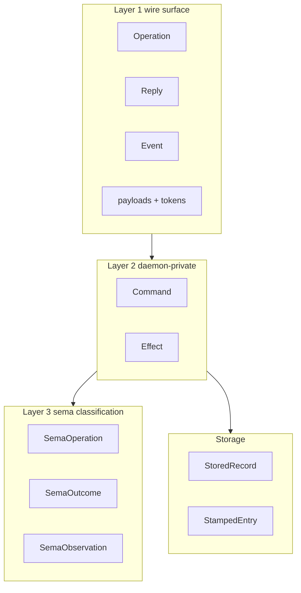
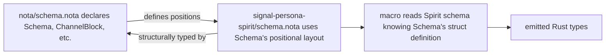

*Kind: Design · Topic: spirit-complete-schema-vision · Date: 2026-05-24*

# 326 — Spirit complete schema — full data type vision + schema-for-a-schema

**Status:** v3 — absorbs psyche feedback on /326-v2's tag redundancy. NOTA is positional: a schema FILE is a struct; position determines what each field is; the `Schema`/`Channel`/`Namespace` tags are unnecessary because position already says what each field means. The schema language defines ITSELF via a recursive base schema (the "schema-for-a-schema") in `nota/schema.nota` — self-describing in its own namespace. Spirit's schema then is just `(<channel-struct> <namespace-map>)` — two positional fields, no tags.

## §1 The data type inventory — what Spirit actually needs

Three layers + storage, verified against deployed code:

**Layer 1 wire types** — 5 Operation verbs + 2 macro-injected; 10 Reply variants; 2 Event variants; 4 leaf enums; 11 newtypes; 9 composites; 3 root payloads (`Observation`, `Subscription`, `SubscriptionToken`); reply + event + observable payloads.

**Layer 2 daemon-private** — `Command` (12 variants), `Effect` (10 variants), `RecordObservation` wrapper. Derived by macro from `(engine X)` annotations.

**Layer 3 sema types** — `SemaOperation`, `SemaOutcome`, `SemaObservation`, `Magnitude` — all from `signal-sema` via `(Path …)` refs.

**Storage** — `StoredRecord`, `StampedEntry`, `RecordIdentifierMint`. Macro derives redb table descriptors + Blake3 contract-version hash.



## §2 The complete Spirit schema — positional

### §2.1 The schema file

```nota
(
  (
    (Operation
      (State (Statement (engine assert)))
      (Record (Entry (engine assert)))
      (Observe (Observation (engine match)))
      (Watch (Subscription (engine subscribe)))
      (Unwatch (SubscriptionToken (engine retract))))
    (Reply
      (RecordAccepted RecordAccepted)
      (StateObserved StateObserved)
      (RecordsObserved RecordsObserved)
      (RecordProvenancesObserved RecordProvenancesObserved)
      (TopicsObserved TopicsObserved)
      (QuestionsObserved QuestionsObserved)
      (SubscriptionOpened SubscriptionOpened)
      (SubscriptionRetracted SubscriptionRetracted)
      (RequestUnimplemented RequestUnimplemented))
    (Event
      (StateChanged (StateChanged belongs DomainStream))
      (RecordCaptured (RecordCaptured belongs DomainStream)))
    (Observable
      (filter default)
      (operation_event OperationReceived)
      (effect_event EffectEmitted)))
  {
    Magnitude (Path ../signal-sema/magnitude.schema.nota)
    SemaOperation (Path ../signal-sema/operation.schema.nota)
    SemaOutcome (Path ../signal-sema/outcome.schema.nota)
    SemaObservation (Path ../signal-sema/observation.schema.nota)

    Kind (Kind Decision Principle Correction Clarification Constraint)
    ObservationMode (ObservationMode SummaryOnly WithProvenance)
    Presence (Presence Active Absent)
    UnimplementedReason (UnimplementedReason NotBuiltYet IntegrationNotLanded)

    Topic (Topic String)
    Summary (Summary String)
    Context (Context String)
    Quote (Quote String)
    StatementText (StatementText String)
    FocusArea (FocusArea String)
    RecordIdentifier (RecordIdentifier u64)
    QuestionIdentifier (QuestionIdentifier String)
    QuestionText (QuestionText String)
    StateSubscriptionToken (StateSubscriptionToken u64)
    RecordSubscriptionToken (RecordSubscriptionToken u64)

    Entry (Entry Topic Kind Summary Context Magnitude Quote)
    Statement (Statement StatementText)
    RecordQuery (RecordQuery [Option Topic] [Option Kind] ObservationMode)
    RecordSubscription (RecordSubscription [Option Topic] ObservationMode)
    RecordSummary (RecordSummary RecordIdentifier Topic Kind Summary Magnitude)
    RecordProvenance (RecordProvenance RecordSummary Context Date Time Quote)
    TopicCount (TopicCount Topic u64)
    State (State Presence [Option FocusArea])
    QuestionSummary (QuestionSummary QuestionIdentifier QuestionText)

    RecordObservation (RecordObservation RecordQuery)

    Observation (Observation State (Records RecordQuery) Topics Questions)
    Subscription (Subscription State (Records RecordSubscription))
    SubscriptionToken (SubscriptionToken (State StateSubscriptionToken) (Records RecordSubscriptionToken))

    StoredRecord (StoredRecord RecordIdentifier StampedEntry)
    StampedEntry (StampedEntry Entry Date Time)
    RecordIdentifierMint (RecordIdentifierMint u64)

    RecordAccepted (RecordAccepted RecordIdentifier)
    StateObserved (StateObserved State)
    RecordsObserved (RecordsObserved [Vec RecordSummary])
    RecordProvenancesObserved (RecordProvenancesObserved [Vec RecordProvenance])
    TopicsObserved (TopicsObserved [Vec TopicCount])
    QuestionsObserved (QuestionsObserved [Vec QuestionSummary])
    SubscriptionOpened (SubscriptionOpened SubscriptionToken SubscriptionSnapshot)
    SubscriptionRetracted (SubscriptionRetracted SubscriptionToken)
    RequestUnimplemented (RequestUnimplemented UnimplementedReason)
    SubscriptionSnapshot (SubscriptionSnapshot (State State) (Records [Vec RecordSummary]))

    StateChanged (StateChanged State)
    RecordCaptured (RecordCaptured RecordSummary)

    OperationReceived (OperationReceived OperationKind)
    EffectEmitted (EffectEmitted SemaObservation)
  }
)
```

### §2.2 Reading the structure positionally

**Outer record `(…)`** — a `Schema` struct (its type is declared in the base schema-for-a-schema per `§3`). Two positional fields, no tag inside the outer parens.

**Field 0 — inner record `(…)`** — the channel block. Four positional sub-fields, no enclosing tag. By position:
- Sub-field 0 = `(Operation …)` — Operation enum declaration. `Operation` is the enum's own name (used at the head of the declaration), not a field-name label.
- Sub-field 1 = `(Reply …)` — Reply enum declaration.
- Sub-field 2 = `(Event …)` — Event enum declaration.
- Sub-field 3 = `(Observable …)` — Observable block declaration.

**Field 1 — map `{…}`** — the namespace. Keys are PascalCase type names; values are either:
- An inline declaration record (e.g., `(Kind Decision Principle …)` for a leaf enum, `(Entry Topic Kind …)` for a composite struct).
- A `(Path …)` variant naming a file whose contents are parsed as the type the position expects (cross-schema reference; per psyche 2026-05-24 path-ref clarification).

The map is the recursive namespace: any type declared here can reference any other type declared here (or imported via `(Path …)`).

### §2.3 No NOTA-comments, no redundant tags

The schema file carries NO `;;` comments — section semantics come from POSITION + the schema-for-a-schema's struct definition. The previous v2's `Schema` / `Channel` / `Namespace` tags are removed: position tells us what each field is. The enum-declaration heads INSIDE field 0 (`Operation` / `Reply` / `Event` / `Observable`) are the enums' own names, not field labels — kept because they're part of the enum declaration itself, used by the macro when emitting Rust types.

## §3 The schema-for-a-schema — the recursive bootstrap

### §3.1 Why a schema language needs its own schema

If schema files are positional structs, the parser needs to know what each position is. That knowledge lives in the schema-for-a-schema — a NOTA file (e.g., `nota/schema.nota`) declaring the `Schema` struct's positional layout, plus all the sub-types it references (`ChannelBlock`, `OperationDecl`, `Declaration`, `Path`, etc.).

The schema-for-a-schema is itself a schema file in NOTA. It uses its own struct to define its struct. Self-describing in its own namespace.

### §3.2 Sketch of `nota/schema.nota`

```nota
(
  ()
  {
    Schema (Schema ChannelBlock NamespaceMap)

    ChannelBlock (ChannelBlock OperationDecl ReplyDecl EventDecl ObservableDecl)

    OperationDecl
      (OperationDecl Identifier [Vec OperationVariant])
    OperationVariant
      (OperationVariant Identifier PayloadRef EngineAnnotation)

    ReplyDecl
      (ReplyDecl Identifier [Vec ReplyVariant])
    ReplyVariant
      (ReplyVariant Identifier Identifier)

    EventDecl
      (EventDecl Identifier [Vec EventVariant])
    EventVariant
      (EventVariant Identifier Identifier StreamRef)

    ObservableDecl
      (ObservableDecl FilterMode OperationEventRef EffectEventRef)

    NamespaceMap (NamespaceMap [Map Identifier Declaration])

    Declaration
      (Inline TaggedRecord)
      (Cross Path)

    TaggedRecord (TaggedRecord Identifier [Vec FieldOrVariant])

    FieldOrVariant
      (Field Identifier)
      (Variant Identifier [Option PayloadRef])

    PayloadRef
      (PayloadRef Identifier)

    EngineAnnotation
      (Assert)
      (Mutate)
      (Retract)
      (Match)
      (Subscribe)
      (Validate)

    FilterMode
      (Default)
      (Custom Identifier)

    StreamRef (StreamRef Identifier)

    Identifier (Identifier String)
  }
)
```

This file IS a schema file (outer is the Schema struct: empty channel block + a namespace map). The namespace declares the schema-language's own types — `Schema`, `ChannelBlock`, `OperationDecl`, etc. — using its own primitives + recursive references.

The empty channel block `()` says "this is a library, not a component" — `nota/schema.nota` doesn't have a wire-side messaging surface; it just declares vocabulary.

### §3.3 The recursive bootstrap chain



When the macro reads `signal-persona-spirit/schema.nota`, it knows:
- The outer `(…)` is a `Schema` struct.
- Field 0 is a `ChannelBlock`.
- Inside ChannelBlock, field 0 is an `OperationDecl`, etc.
- Field 1 is a `NamespaceMap`.
- Map values are `Declaration` union (`Inline` or `Cross`).

The macro doesn't need the file to repeat `Schema` / `ChannelBlock` / `NamespaceMap` tags because position + the base schema's type definitions disambiguate.

### §3.4 Where the base schema lives

Lean: `nota/schema.nota` at the nota repo root. The nota repo already houses `nota-codec` (the inline codec) + the in-tree `BoxedNotaEncoder` (per `nota-codec/tests/box_form.rs` already landed); adding the base schema is consistent with the repo's role as the workspace's NOTA substrate. Every component's schema file path-refs back to `nota/schema.nota` either implicitly (the parser knows) or explicitly via `(Path …)` import.

## §4 The sema-message namespace bridge

### §4.1 `(engine X)` annotations on Operation variants

Each Operation variant carries an `(engine X)` annotation: `assert`, `match`, `subscribe`, or `retract`. The macro derives Layer 2 (Command + Effect) + Layer 3 bridge (ToSemaOperation + ToSemaOutcome) from these annotations + the Reply variants.

For Spirit:
- `(State (Statement (engine assert)))` → `Command::ClassifyStatement(Statement)` + `SemaOperation::Assert`
- `(Record (Entry (engine assert)))` → `Command::AssertEntry(Entry)` + `SemaOperation::Assert`
- `(Observe (Observation (engine match)))` → `Command::ReadObservation(Observation)` + `SemaOperation::Match`
- `(Watch (Subscription (engine subscribe)))` → `Command::SubscribeWatch(Subscription)` + `SemaOperation::Subscribe`
- `(Unwatch (SubscriptionToken (engine retract)))` → `Command::RetractWatch(SubscriptionToken)` + `SemaOperation::Retract`

Macro-injected `Tap`/`Untap` (per `Observable`) get `(engine subscribe)` / `(engine retract)` by convention.

### §4.2 Cross-schema references via `(Path …)`

The namespace map's `(Path …)` variants declare cross-schema imports. Per psyche directive: file content at the path is parsed as the type the value position expects, not as a literal string. The schema reader resolves sandboxed (sibling files + Cargo-dep crates) and substitutes the resolved declaration into Spirit's view before the macro processes.

`SemaObservation` is the load-bearing cross-schema reference: every component's macro-emitted `Effect` projects into it; observers across the workspace see uniform classification regardless of any component's domain vocabulary.

## §5 Storage schema

`StoredRecord` is what lives in the redb table; `StampedEntry` wraps `Entry` with daemon-stamped wall-clock metadata; `RecordIdentifierMint` is the monotonic counter state. From these the macro emits redb table descriptors + `Engine::open_spirit` setup + `SPIRIT_CONTRACT_VERSION` const (Blake3 of resolved schema) + `Projected` impl for `StampedEntry`. When the schema changes v0.1.0 → v0.1.1, the hash changes; handover protocol per `/323 §10` validates compatibility.

## §6 What this gives us

The macro derives all of:
- Layer 1 wire types + NOTA + rkyv codecs (from namespace declarations + channel block)
- Frame aliases + `ShortHeader` projection (from channel.Operation variants)
- `Command` + `Effect` enums + `from_request`/`into_reply` impls (from `(engine X)` annotations)
- `ToSemaOperation` + `ToSemaOutcome` impls (from `(engine X)` + outcome convention)
- `OperationDispatch` trait + dispatcher (from channel.Operation variants per `/323 §3.1`)
- `VersionProjection<v010::T, v011::T>` for changed types (from schema diff when `next_schema` declared)
- `StoredRecord` + `StampedEntry` rkyv archives + redb table descriptors (from namespace storage declarations)
- `OperationReceived` + `EffectEmitted` observable event payloads (from channel.Observable)
- `SPIRIT_CONTRACT_VERSION` Blake3 hash + `Projected` impl (from resolved-schema identity)

Replaces ~700 LoC across `signal-persona-spirit/src/lib.rs` + `persona-spirit/src/observation.rs` + most of `persona-spirit/src/store.rs`. Hand-written remains: actor topology, auth checks, classifier domain logic, daemon-internal lifecycle (~150 LoC).

## §7 What changes from v2

| Concern | v2 | v3 |
|---|---|---|
| Outer container | `(Schema (Channel …) (Namespace …))` — tagged outer struct | `((…) {…})` — anonymous positional record with no `Schema` tag |
| Inner sections | `(Channel (Operation …) (Reply …) …)` — tagged sections | `((Operation …) (Reply …) …)` — positional record with no `Channel` tag |
| Namespace map | `(Namespace { … })` — tagged wrapper | `{ … }` — bare map at field 1, no `Namespace` tag |
| Tags inside the channel block | `Operation`, `Reply`, `Event`, `Observable` (kept as enum-declaration heads) | unchanged — these ARE the enums' own names, used by the macro to emit Rust enum names |
| Tags inside the namespace map | type names as map keys | unchanged — type names are the names being declared |
| Schema-for-a-schema | not addressed | NEW §3 — base schema in `nota/schema.nota` defines `Schema`/`ChannelBlock`/`Declaration`/`Path`/etc. as a recursive self-describing namespace |
| Comment separators | none (already removed in v2) | unchanged |
| Verification step | round-trip test | unchanged + adds verification that base schema parses + bootstraps |

## §8 Open psyche questions

### §8.1 Where does the schema-for-a-schema live?

Lean: `nota/schema.nota` at the nota repo root. Alternative: a dedicated `schema/` repo if the schema language grows beyond the nota substrate.

### §8.2 Empty channel block representation

For library-like schemas (e.g., `signal-sema/magnitude.schema.nota` that only declares one type and has no messaging surface), field 0 is empty. Two shapes:
- (a) Empty record `()` — explicit but parses as zero-field struct.
- (b) Reserved `()` slot stays empty; macro recognises as "library schema".

Lean: (a) — `()` is the natural NOTA empty record, parses cleanly.

### §8.3 How does the parser know `nota/schema.nota` itself?

A bootstrap problem: the parser needs to know `Schema`'s shape before it can parse any schema file, including `nota/schema.nota` itself. Two answers:
- (a) `Schema`'s shape is HARDCODED in the parser (the parser knows: outer is `(channel_block namespace_map)`).
- (b) `nota/schema.nota`'s OWN content uses a minimal shape the parser pre-loads from a bytecode-baked binary.

Lean: (a) — hardcode Schema's shape in the parser as a 2-field positional record; the parser bootstraps from this. The namespace map's CONTENTS then describe sub-types recursively, but Schema's top-level shape is the fixed point.

### §8.4 Path-ref scope — same crate only, or cross-crate?

`§2.1` shows `(Path ../signal-sema/magnitude.schema.nota)` — a relative path crossing crate boundaries. The path resolver must handle:
- Same-crate sibling files (`./magnitude.schema.nota`).
- Cargo-dep crates (`../signal-sema/magnitude.schema.nota` resolves through workspace structure).
- Forbidden: absolute paths, `../../` escaping the workspace, system paths.

Lean: sandboxed per `/320 §2.7`. Cargo dep graph resolution + workspace-root anchoring; no arbitrary filesystem traversal.

## §9 Verification gates

Before the macro library work proceeds (per `primary-ezqx.1`), operator runs three witnesses:

1. **Base schema parse** — `nota/schema.nota` parses as a Schema struct (channel block empty + namespace map non-empty); round-trip preserves shape.
2. **Spirit schema parse** — `signal-persona-spirit/schema.nota` parses as a Schema struct against the base schema's type definitions; the namespace map's `(Path …)` refs resolve sandboxed.
3. **Cross-schema resolution** — Spirit's `(Path ../signal-sema/magnitude.schema.nota)` resolves to a Declaration whose Rust emission matches the deployed `signal_sema::Magnitude` enum.

If any witness fails, the macro library work pauses until the schema-language design adjusts.

## §10 What this report supersedes

`/326-v3` SUPERSEDES `/326-v2`. This commit deletes `/326-v2` per `skills/reporting.md` v-suffix rule. `/322` retains canonical reference for the Spirit worked-example end-to-end Record walk; `§2.1` here is the complete-schema upgrade of `/322 §1`'s wire-only subset.

## §11 See also

- `reports/designer/322-spirit-mvp-positional-schema-worked-example.md` — Spirit MVP worked-example walk
- `reports/designer/324-migration-mvp-spirit-handover-re-specification.md` — current canonical migration + handover state
- `reports/designer/323-mvp-scope-expansion-per-operator-directive.md` — dispatch + projection + box-form integration
- `reports/designer/320-mvp-schema-language-pilot-unblock.md` — closed-decision markers (`§2`); rest STATUS-BANNERed
- `reports/second-designer/164-nota-schema-language-vector-of-root-verb-enums-2026-05-24.md` — schema-language v3 grammar
- `reports/second-designer/163-signal-sema-interaction-and-spirit-architecture-2026-05-24.md` — three-layer model
- `reports/second-designer/166-self-audit-2026-05-24.md` — intents 405-408 ratify schema-derived MVP direction
- `signal-persona-spirit/src/lib.rs` — current hand-written contract (~468 LoC; schema replaces ~95%)
- `persona-spirit/src/observation.rs` — Layer 2 (~158 LoC; macro-emitted)
- `persona-spirit/src/store.rs` — storage (~700 LoC; ~50% schema-derived)
- `signal-sema/src/operation.rs` + `outcome.rs` — Layer 3 universal vocabulary
- `nota/example.nota` — canonical NOTA reference
- `nota/schema.nota` — base schema-for-a-schema (per `§3.2` sketch; needs operator landing)
- `skills/nota-design.md` — positional record + map-key + bracket-string + Path-primitive rules
- `nota-codec/tests/option_vec_struct_variant.rs`, `map_key_round_trip.rs`, `bracket_string_round_trip.rs`, `box_form.rs` — verified fixtures
- Spirit records 388-408
