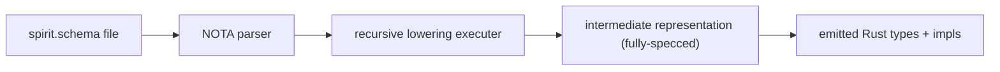
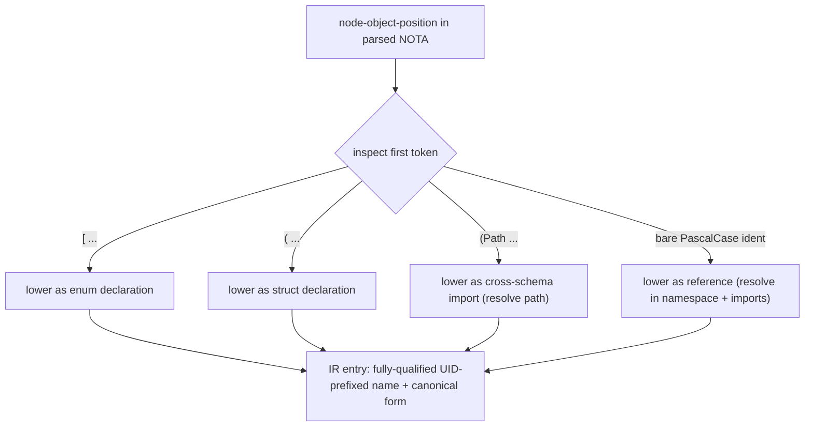

*Kind: Design · Topic: spirit-complete-schema-vision · Date: 2026-05-24*

# 326 — Spirit complete schema — short syntax + lowering executer + universal namespace

**Status:** v6 — absorbs psyche's deep dive on the schema language's underlying mechanism. The schema is **short syntax that lowers into a fully-specced intermediate representation** via a recursive executer engine (Shen-inspired mid-compilation). Each `.schema` file is read as one big struct whose root is implicitly named after the component (Spirit's root enum is `Spirit`). Type references resolve to a **universal namespace** at lowering time where every type gets a UID-prefixed fully-qualified name — no collisions across the workspace. Four value forms (vector, parens, bare-ident reference, Path-import). The schema-language pattern itself is library-shaped for creating custom languages.

## §1 The two-layer view — short syntax + lowered IR



The `.schema` file is HUMAN-FACING short syntax. The macro's job is the **executer** that walks each node-object-position in the parsed NOTA tree, dispatches by shape to a lowering rule, and assembles a fully-specced intermediate representation (IR). The IR has every type fully named, every reference resolved, every implicit detail explicit. The macro then emits Rust code from the IR.

This is mid-compilation in the Shen sense — assembly happens between parsing and code generation. Paths resolve during assembly. References get UID-prefixed names. Short forms expand to canonical declarations.

## §2 The Spirit schema — `signal-persona-spirit/spirit.schema`

```nota
[
  (State (Statement (engine assert)))
  (Record (Entry (engine assert)))
  (Observe (Observation (engine match)))
  (Watch (Subscription (engine subscribe)))
  (Unwatch (SubscriptionToken (engine retract)))
]

[]

[]

{
  Magnitude (Path ../signal-sema/magnitude.schema)
  SemaOperation (Path ../signal-sema/operation.schema)
  SemaOutcome (Path ../signal-sema/outcome.schema)
  SemaObservation (Path ../signal-sema/observation.schema)
}

{
  Kind [Decision Principle Correction Clarification Constraint]
  ObservationMode [SummaryOnly WithProvenance]
  Presence [Active Absent]
  UnimplementedReason [NotBuiltYet IntegrationNotLanded]

  Topic (String)
  Summary (String)
  Context (String)
  Quote (String)
  StatementText (String)
  FocusArea (String)
  RecordIdentifier (u64)
  QuestionIdentifier (String)
  QuestionText (String)
  StateSubscriptionToken (u64)
  RecordSubscriptionToken (u64)

  Entry (Topic Kind Summary Context Magnitude Quote)
  Statement (StatementText)
  RecordQuery ([Option Topic] [Option Kind] ObservationMode)
  RecordSubscription ([Option Topic] ObservationMode)
  RecordSummary (RecordIdentifier Topic Kind Summary Magnitude)
  RecordProvenance (RecordSummary Context Date Time Quote)
  TopicCount (Topic u64)
  State (Presence [Option FocusArea])
  QuestionSummary (QuestionIdentifier QuestionText)

  RecordObservation (RecordQuery)

  Observation [State (Records RecordQuery) Topics Questions]
  Subscription [State (Records RecordSubscription)]
  SubscriptionToken [(State StateSubscriptionToken) (Records RecordSubscriptionToken)]

  StoredRecord (RecordIdentifier StampedEntry)
  StampedEntry (Entry Date Time)
  RecordIdentifierMint (u64)

  RecordAccepted (RecordIdentifier)
  StateObserved (State)
  RecordsObserved ([Vec RecordSummary])
  RecordProvenancesObserved ([Vec RecordProvenance])
  TopicsObserved ([Vec TopicCount])
  QuestionsObserved ([Vec QuestionSummary])
  SubscriptionOpened (SubscriptionToken SubscriptionSnapshot)
  SubscriptionRetracted (SubscriptionToken)
  RequestUnimplemented (UnimplementedReason)
  SubscriptionSnapshot [(State State) (Records [Vec RecordSummary])]

  StateChanged (State)
  RecordCaptured (RecordSummary)

  OperationReceived (OperationKind)
  EffectEmitted (SemaObservation)
}

[
  (Reply
    RecordAccepted
    StateObserved
    RecordsObserved
    RecordProvenancesObserved
    TopicsObserved
    QuestionsObserved
    SubscriptionOpened
    SubscriptionRetracted
    RequestUnimplemented)

  (Event (belongs DomainStream)
    StateChanged
    RecordCaptured)

  (Observable
    (filter default)
    (operation_event OperationReceived)
    (effect_event EffectEmitted))
]
```

## §3 The four namespace value forms

The executer dispatches by inspecting the first token at each node-object-position:

| First token | Value form | Meaning | Example |
|---|---|---|---|
| `[` | vector | enum: elements are variants (unit bare-token OR data-carrying `(Name Payload)`) | `Kind [Decision Principle Correction Clarification Constraint]` |
| `(` then `Path` | Path variant | cross-schema import | `Magnitude (Path ../signal-sema/magnitude.schema)` |
| `(` then anything else | parens | struct with N positional fields (key is implicit tag; newtype is N=1 case) | `Topic (String)`, `Entry (Topic Kind Summary Context Magnitude Quote)` |
| bare PascalCase ident | reference | this declaration aliases an existing namespace entry (or imported type) | `WorkspaceTopic Topic` (WorkspaceTopic resolves to Topic) |

The fourth form (bare ident = reference/alias) is new from the psyche reasoning. The executer looks up the identifier in the namespace + assembled imports; the IR carries the resolved fully-qualified type. Rare for MVP (Spirit doesn't use any aliases) but the form exists for re-exports, renames, and synonym chains.

## §4 The recursive lowering executer

### §4.1 What the executer does

For each node-object-position the executer encounters:



### §4.2 Lowering rules in detail

**`[variants...]` — enum lowering:**
- Each element is a variant.
- Bare PascalCase token = unit variant.
- `(Name Payload)` = data-carrying variant with named payload.
- `(Name [variants...])` = data-carrying variant whose payload is an inline anonymous enum.
- Recursively lower each variant's payload.
- IR result: `EnumDecl { name: <key>, variants: [...] }`.

**`(field_types...)` — struct lowering:**
- Each element is a field's TYPE (a namespace ref or container constructor).
- Field NAME derived by convention (per §5).
- N=1 case = newtype (single-field struct around the inner type).
- Recursively lower each field's type.
- IR result: `StructDecl { name: <key>, fields: [(field_name, field_type), ...] }`.

**`(Path resolved-path)` — import lowering:**
- Read the referenced `.schema` file.
- Parse it (recursively running the executer on its contents).
- Pick the named type from the resolved file's namespace.
- IR result: `Import { local_name: <key>, source_uid: <full-qualified-name-from-source> }`.

**Bare PascalCase ident — reference lowering:**
- Look up the identifier in the current namespace + imports.
- Resolve to the IR entry already produced for that name.
- IR result: `Alias { local_name: <key>, target_uid: <fully-qualified-name-of-target> }`.

### §4.3 Recursive parsing + namespace assembly

The executer runs over the WHOLE file in one pass:
- Field 0 (signal header) — vector of operation variants; each variant payload resolves via lookups into Field 4 (namespace).
- Fields 1, 2 — owner-signal, sema headers; same shape.
- Field 3 (imports) — each Path resolves; the resolved type gets a UID-prefix from its source schema; added to the assembled namespace.
- Field 4 (namespace) — each declaration lowers per the rules above; values can reference earlier or later entries (the assembler does a two-pass: first declarations, then resolve cross-references).
- Field 5 (optional features) — Reply, Event, Observable, Storage etc.; same dispatch rules per node.

The output is a single IR tree the macro emits Rust code from.

### §4.4 Shen-inspired framing

The schema's recursive lowering is **mid-compilation** in the Shen-inspired sense. Shen's language stack defines its own syntax via type-checked compile-time logic; the schema language does the same — short forms compile to canonical declarations via the executer, and the executer is itself describable in the schema's own meta-language (per §6 below).

The lowering is a custom language. The library that implements the executer + the lowering rules can be reused for other domain-specific schemas — the schema-language for SignalSpirit, for cluster topology, for agent capabilities, etc. Each gets its own `.schema` files + the same executer pattern.

## §5 Field naming convention

When the executer lowers `(Topic Kind Summary Context Magnitude Quote)` as a struct under namespace key `Entry`, it emits Rust:

```rust
pub struct Entry {
    pub topic: Topic,         // type name lowercased
    pub kind: Kind,
    pub summary: Summary,
    pub context: Context,
    pub magnitude: Magnitude,  // see §5.1 below
    pub quote: Quote,
}
```

Default rule: **field name = type name lowercased**. Works because the workspace's newtype convention is that each named type has ONE meaning per field, and the type-name maps cleanly to a single-word field.

### §5.1 Field-name overrides (post-MVP)

Spirit's actual Entry struct has `certainty: Magnitude`, not `magnitude: Magnitude` — because in Spirit's domain `Magnitude` semantically denotes a certainty, not the bare magnitude concept. This is a SEMANTIC override.

Per /322 §3.4: MVP uses the default (type-name lowercased); explicit `(field-name type)` override syntax comes post-MVP when a contract has multiple fields of the same type OR a domain-specific field name matters.

For MVP, Spirit's emitted struct may temporarily have `magnitude: Magnitude` instead of `certainty: Magnitude` — domain prose adjusts, or operator inlines a hand-written override per the post-MVP extension.

## §6 The root enum named after the component

The schema is conceptually **one big enum whose name is the component** — for Spirit, the root enum is `Spirit`. Each thing declared (Operation variants, Reply variants, namespace types) is a variant or sub-declaration of this root.

The file doesn't NAME `Spirit` explicitly — the file's location (`signal-persona-spirit/spirit.schema`) and the component-name convention give the executer the root name. The IR carries `Spirit` as the root namespace's prefix; every type emitted gets UID-prefixed by `Spirit::` (or wider) at IR time.

This is what makes the universal namespace work (§7 below).

## §7 Universal namespace + UID-prefixed naming

### §7.1 Why prefix at all

The workspace has many components — Spirit, Mind, Router, Message, etc. Each declares types in its own schema. Some types are universal (Magnitude, SemaOperation from signal-sema); some are component-specific (Entry, StampedEntry are Spirit-local). When the executer assembles the IR, every type gets a fully-qualified name in a workspace-wide namespace — so two components can declare `Entry` independently without collision.

### §7.2 The UID structure

```
spirit::namespace::entry
spirit::namespace::stored_record
signal_sema::magnitude
signal_sema::sema_operation
mind::namespace::thought
```

Component-name prefix + namespace section + type-name. Cross-schema imports retain the SOURCE component's prefix when resolved into Spirit's view — so Spirit's `Magnitude` import IR entry reads `signal_sema::magnitude`, not `spirit::magnitude`.

### §7.3 At Rust emission time

The macro emits Rust types using the unprefixed local name (`pub struct Entry`, `pub enum Magnitude`) — the Rust module structure provides the prefix. The IR-time UID is for IDENTITY (which type is this, anywhere in the workspace), not for Rust path emission.

### §7.4 The collision-free property

Every IR entry has a unique UID. Two components defining `Entry` (Spirit's Entry vs Mind's Entry) get `spirit::namespace::entry` vs `mind::namespace::entry` — distinct UIDs. Cross-component references must use the import mechanism to bring a type into the local namespace — never bare-name from another component.

Result: the schema-language is collision-free + self-documenting (every name has full provenance at IR time).

## §8 Self-documenting + library potential

### §8.1 Self-documenting

When verbs + objects align in the schema, the file reads logically:
- `(Record (Entry (engine assert)))` reads as: "Record operation, payload Entry, engine action assert"
- `Entry (Topic Kind Summary Context Magnitude Quote)` reads as: "Entry is a struct with these positional fields"
- `Magnitude (Path ../signal-sema/magnitude.schema)` reads as: "Magnitude comes from this other schema file"

Even before knowing the executer rules, an agent reading the schema gets the design. Correctness check by READING — the schema's structure carries the meaning.

### §8.2 Library for custom languages

The pattern — short syntax + executer-based lowering to IR + code emission — is reusable. The library implementing the executer + the lowering rules + the IR emission could become a separate crate (per spirit 408's "notation deserves its own library"). Future schemas (cluster topology, agent capabilities, deploy graph) could use the same machinery with their own lowering rules.

For MVP, this library lives co-located with `nota` (per `primary-l6pc`'s nota-box landing pattern — nota-codec already has the BoxedNotaEncoder; a `nota-schema` peer library would house the executer + lowering rules + IR types).

## §9 What changes from v5

| Concern | v5 | v6 |
|---|---|---|
| Value forms count | 3 (vector / parens / Path) | 4 (added bare-ident reference for aliases) |
| Lowering concept | implicit | explicit §4 — recursive executer engine; Shen-inspired mid-compilation |
| Field naming convention | implicit | explicit §5 — type-name lowercased; overrides post-MVP |
| Root namespace | implicit | explicit §6 — component-name is the root enum (Spirit) |
| Universal-namespace UID | not addressed | explicit §7 — every type gets a fully-qualified UID for collision-free identity |
| Library framing | hinted | explicit §8.2 — schema-language is a library pattern for custom languages |
| Schema file shape | unchanged from v4/v5 | unchanged (6 positional fields, no outer parens, `.schema` extension) |
| Namespace map syntax | three forms | four forms (alias added) |
| Reply variant convention | bare-token = variant name + payload type both = X | unchanged |

## §10 Standing open structural questions

Still standing from v4 §8 + v5 §6.1 — these don't shift with v6:

- **v4 §8.1** Parser support for no-outer-parens (lean: `.schema` parser as superset of nota-codec)
- **v4 §8.2** Schema struct field count (6 is working hypothesis)
- **v4 §8.3** Where Reply + Event live (currently Field 5 optional features)
- **v4 §8.4** Storage in namespace vs as feature (currently namespace)
- **v4 §8.5** Owner-signal header placeholder when empty (`[]` always)
- **v4 §8.6** File naming `<component>/<component>.schema`
- **v5 §6.1** struct-vs-Path disambiguation (lean: `Path` is reserved tag)

Plus the new ones from v6:

- **§5.1** Field-name overrides — post-MVP `(field-name type)` syntax confirmed?
- **§7.2** UID structure — `component::namespace::type` (current lean) or something else?
- **§8.2** Library location — `nota-schema/` peer to `nota-codec`?

## §11 What this report supersedes

`/326-v6` SUPERSEDES `/326-v5`. This commit deletes `/326-v5` per `skills/reporting.md` v-suffix rule. The Spirit schema content in §2 is unchanged from v5 (the structural correction landed there); v6 adds the executer/lowering/UID/field-naming context that explains HOW the schema becomes Rust.

## §12 See also

- `reports/designer/322-spirit-mvp-positional-schema-worked-example.md` — Spirit MVP worked-example walk
- `reports/designer/324-migration-mvp-spirit-handover-re-specification.md` — current canonical migration + handover state
- `reports/designer/323-mvp-scope-expansion-per-operator-directive.md` — dispatch + projection + box-form
- `reports/designer/320-mvp-schema-language-pilot-unblock.md` — closed-decision markers (`§2`); rest STATUS-BANNERed
- `reports/second-designer/164-nota-schema-language-vector-of-root-verb-enums-2026-05-24.md` — schema-language v3 grammar
- `signal-persona-spirit/src/lib.rs` — current hand-written contract
- `persona-spirit/src/observation.rs` — Layer 2 hand-written
- `persona-spirit/src/store.rs` — storage hand-written
- `signal-sema/src/operation.rs` + `outcome.rs` — Layer 3 universal vocabulary
- `nota/example.nota` — canonical NOTA reference
- `nota-codec/tests/option_vec_struct_variant.rs`, `map_key_round_trip.rs`, `bracket_string_round_trip.rs`, `box_form.rs` — verified fixtures
- `skills/nota-design.md` — positional record + map-key + bracket-string + Path-primitive rules
- Shen language (S-H-E-N) — mid-compilation pattern that inspired §4.4
- Spirit records 388-408
