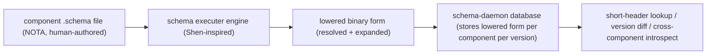

*Kind: Design · Topic: spirit-complete-schema-vision · Date: 2026-05-24*

# 326 — Spirit complete schema — header sub-enums + selective imports + deeper example

**Status:** v8 — absorbs psyche correction on header variant payload form. Parenthesized header variants take TWO shapes: `(State Statement)` for single-payload data-carrying OR `(State [Statement Proposal Retraction])` for sub-enum with multiple sub-variants. Selective imports gain an **all-or-some** option for naming which types to pull. New §4 names the schema-daemon's role as keeper of the lowered/expanded form for version translation. Iteration 8; structural skeleton stable since v4.

## §1 The two header-variant payload forms

Each parenthesized header variant `(EnumIdentifier <payload>)` can be:

**Form 1 — Single payload type (data-carrying variant):**
```nota
(State Statement)
```
Variant `State` carries one payload of type `Statement` (resolved via the namespace).

**Form 2 — Sub-enum (multiple sub-variants):**
```nota
(State [Statement Proposal Retraction])
```
Variant `State` carries a sub-enum with three sub-variants. Wire-side, byte 0 = State's root discriminator; byte 1 = sub-variant discriminator within State's sub-namespace. Each sub-variant follows the same rules recursively: bare PascalCase = unit; parenthesized = data-carrying.

### §1.1 Why two forms

Form 1 is the simple case: one operation, one payload type. Most Spirit operations today fit this.

Form 2 is needed when an operation's root variant has multiple sub-actions sharing dispatch but with distinct payload shapes. The 64-bit short header structure (1 root + 7 sub-enums per spirit 388-389) supports this directly — root byte selects the variant, sub-bytes select within. A `Watch` variant could carry `[State Records ObservationStream]` sub-enum representing different watch targets, each with its own payload structure.

The psyche rule: **a parenthesized variant needs Form 2 only if there's more than one sub-variant** — otherwise Form 1 is simpler and the sub-namespace adds no value.

### §1.2 Recursive resolution

Whenever the parser encounters a header position (or a sub-position inside Form 2's bracket), it applies the same rule:
- Bare PascalCase = unit variant
- `(Name Payload)` = data-carrying variant (Form 1 or 2 depending on payload shape)
- `[variants]` = sub-enum (recurse)

Recursive all the way to leaves. This is what the psyche means by "schema enum namespace node" — every position can be one of these shapes.

## §2 Selective imports — the all-or-some option

The imports map (Field 0) takes a NEW value form for selective imports:

```nota
{
  Magnitude (Path ../signal-sema/magnitude.schema)
  SemaSet (Path ../signal-sema/operation.schema [SemaOperation SemaOutcome SemaObservation])
}
```

Two value shapes:

| Form | Meaning |
|---|---|
| `(Path ./file.schema)` | import EVERYTHING from the file under the local name (Magnitude case) |
| `(Path ./file.schema [Name1 Name2 …])` | import ONLY the named types from the file (SemaSet case — selective) |

The second field of the `(Path …)` record is OPTIONAL — when omitted, default is **all**; when present, restricts to the named types. The psyche called this an "all-or-some" type (default all; specifying some restricts; distinct from Option's some-or-none semantics).

### §2.1 The `AllOrSome` derived NOTA type

```nota
;; In the base schema's namespace:
AllOrSome [
  All
  (Some [Vec EnumIdentifier])
]
```

A new tagged enum `AllOrSome { All, Some(Vec<EnumIdentifier>) }`. Distinct from `Option<Vec<EnumIdentifier>>` which would mean "none-or-some" (default none); `AllOrSome` defaults to All. Encoded compactly in NOTA — omitting the second field of `(Path …)` is shorthand for `All`; specifying `[N1 N2]` desugars to `(Some [N1 N2])`.

### §2.2 Local name vs import set

When importing multiple types from one file, the map's KEY is a LOCAL GROUP NAME (`SemaSet`), and the imported types appear in scope under their original names (`SemaOperation`, `SemaOutcome`, `SemaObservation`). The local key serves as the import label for tooling + provenance; the imported names go directly into the local namespace for reference in body declarations.

This keeps concerns separate per psyche directive — Spirit only imports the sema-message types it actually uses, not the whole signal-sema namespace.

## §3 Deeper Spirit example

```nota
{
  Magnitude (Path ../signal-sema/magnitude.schema)
  SemaSet (Path ../signal-sema/operation.schema [SemaOperation SemaOutcome SemaObservation])
}

[
  (State Statement)
  (Record Entry)
  (Observe Observation)
  (Watch Subscription)
  (Unwatch SubscriptionToken)
]

[]

[]

{
  Kind [Decision Principle Correction Clarification Constraint]
  ObservationMode [SummaryOnly WithProvenance]
  Presence [Active Absent]
  UnimplementedReason [NotBuiltYet IntegrationNotLanded]

  Topic (String)
  Summary (String)
  Context (String)
  Quote (String)
  StatementText (String)
  FocusArea (String)
  RecordIdentifier (u64)
  QuestionIdentifier (String)
  QuestionText (String)
  StateSubscriptionToken (u64)
  RecordSubscriptionToken (u64)

  Entry (Topic Kind Summary Context Magnitude Quote)
  Statement (StatementText)
  RecordQuery ([Option Topic] [Option Kind] ObservationMode)
  RecordSubscription ([Option Topic] ObservationMode)
  RecordSummary (RecordIdentifier Topic Kind Summary Magnitude)
  RecordProvenance (RecordSummary Context Date Time Quote)
  TopicCount (Topic u64)
  State (Presence [Option FocusArea])
  QuestionSummary (QuestionIdentifier QuestionText)

  RecordObservation (RecordQuery)

  Observation [State (Records RecordQuery) Topics Questions]
  Subscription [State (Records RecordSubscription)]
  SubscriptionToken [(State StateSubscriptionToken) (Records RecordSubscriptionToken)]

  StoredRecord (RecordIdentifier StampedEntry)
  StampedEntry (Entry Date Time)
  RecordIdentifierMint (u64)

  RecordAccepted (RecordIdentifier)
  StateObserved (State)
  RecordsObserved ([Vec RecordSummary])
  RecordProvenancesObserved ([Vec RecordProvenance])
  TopicsObserved ([Vec TopicCount])
  QuestionsObserved ([Vec QuestionSummary])
  SubscriptionOpened (SubscriptionToken SubscriptionSnapshot)
  SubscriptionRetracted (SubscriptionToken)
  RequestUnimplemented (UnimplementedReason)
  SubscriptionSnapshot [(State State) (Records [Vec RecordSummary])]

  StateChanged (State)
  RecordCaptured (RecordSummary)

  OperationReceived (OperationKind)
  EffectEmitted (SemaObservation)
}

[
  (Reply
    RecordAccepted
    StateObserved
    RecordsObserved
    RecordProvenancesObserved
    TopicsObserved
    QuestionsObserved
    SubscriptionOpened
    SubscriptionRetracted
    RequestUnimplemented)

  (Event (belongs DomainStream)
    StateChanged
    RecordCaptured)

  (Observable
    (filter default)
    (operation_event OperationReceived)
    (effect_event EffectEmitted))
]
```

### §3.1 Notes on this example

- **Field 0 (imports)** — `Magnitude` imports the whole magnitude.schema (default all); `SemaSet` selectively imports three named types from signal-sema's operation.schema. The local key `SemaSet` is the group label; the names `SemaOperation`/`SemaOutcome`/`SemaObservation` become directly referenceable in the namespace.
- **Field 1 (signal header)** — every variant uses Form 1 (single-payload data-carrying) because Spirit's operations each have one payload type. If Spirit later needed `(Watch [State Records ObservationStream])` to dispatch among three watch flavors at byte 1, Form 2 would apply there.
- **Fields 2-3 (owner-signal, sema headers)** — empty for Spirit MVP per /326-v7.
- **Field 4 (namespace)** — same v5/v6/v7 form: `[…]` for enums, `(…)` for structs, `(Path …)` for imports (rare in body), bare ident for aliases.
- **Field 5 (optional features)** — Reply uses bare-token convention (each Reply variant carries one field of its same-named namespace type); Event uses `belongs` annotation; Observable declares the observation block.

### §3.2 A hypothetical multi-sub-variant case

If Spirit gained a future `(Watch [State Records ObservationStream])` operation where Watch could target State (subscribe to psyche-presence), Records (subscribe to record-stream), OR ObservationStream (subscribe to a derived observation), the header would read:

```nota
[
  (State Statement)
  (Record Entry)
  (Observe Observation)
  (Watch [State Records ObservationStream])
  (Unwatch SubscriptionToken)
]
```

Wire-side: byte 0 = `Watch` discriminator; byte 1 = sub-variant (`State`/`Records`/`ObservationStream`). Each sub-variant can itself be a unit or data-carrying enum-namespace-node.

Per psyche: data-carrying variants with sub-enums make sense ONLY when there's more than one sub-variant. `(Watch [State])` with a single sub-variant collapses to `(Watch State)` Form 1.

## §4 The schema daemon stores the lowered form

Per psyche: "The lowered version, like mid, we should emit that midterm. You can store it, it gets stored. We can store that in the database. That's what the schemas are for the schema daemon, which is going to be able to translate between versions and do a lot of useful things with schemas. So and then it can be looked at in like a fully expanded version, if you will. With like the full namespace expanded for that whole schema to like be defined all the way to the last library it loaded and the objects it imported."

This connects to spirit records 397-400 (schema component). The schema-daemon (per spirit 397) holds the LOWERED (mid-compilation) form of every schema — the fully-expanded version where:
- All `(Path …)` imports are resolved + their referenced declarations inlined
- All aliases are resolved to their target types
- All `AllOrSome` choices applied (selective imports filter the namespace)
- Every type carries its full UID per spirit 398

The lowered form is what the schema-daemon stores in its database. Use cases:
- **Version translation:** given v0.1.0 and v0.1.1 lowered forms, compute the diff + derive `VersionProjection`.
- **Lookup-by-short-header:** decoder reads short header bytes, asks schema-daemon "what type does this header pattern correspond to?", gets the lowered type declaration back.
- **Cross-component vocabulary:** introspect any component's full schema without parsing its source file.
- **Fully-expanded reading:** an agent can ask the schema-daemon for Spirit's fully-expanded schema (all imports resolved inline) to read the whole structure without chasing path-refs.

The lowered form is binary (per spirit 398) for efficiency; the source `.schema` files are human-authored NOTA.



## §5 What changes from v7

| Concern | v7 | v8 |
|---|---|---|
| Header variant payload form | only Form 1 `(VerbName PayloadType)` — single payload | adds Form 2 `(VerbName [sub-variants])` — sub-enum with multiple sub-variants per psyche 64-bit-header structure |
| Sub-variant rule | implicit | explicit: a sub-enum needs more than one sub-variant; single-sub-variant collapses to Form 1 |
| Import value form | `(Path file)` only | adds `(Path file [Name1 Name2 …])` for selective imports per psyche |
| New NOTA derived type | `EnumIdentifier` (v7) | adds `AllOrSome` for the import selection (default all; some restricts) |
| Schema daemon role | hinted | explicit §4 — daemon stores lowered binary form for version translation, header lookup, cross-component introspect |
| Spirit's actual header | unchanged (all Form 1) | unchanged (Form 2 illustrated as hypothetical Watch sub-enum case in §3.2) |
| File shape (6 positional fields) | unchanged | unchanged |

## §6 Standing open structural questions

All from v4-v7 plus v8's additions:

| Question | Lean | Status |
|---|---|---|
| Parser support for no-outer-parens | `.schema` parser as superset of nota-codec | open |
| Schema struct field count (6) | meta + signal + owner + sema + namespace + optional | open |
| Where Reply + Event live | Field 5 optional features | open |
| Storage in namespace vs feature | namespace | open |
| Empty header `[]` for unused legs | always `[]` | open |
| File naming `<component>/<component>.schema` | lean yes | open |
| Struct-vs-Path disambiguation | `Path` reserved tag | open |
| Field-name override syntax | `(field-name type)` post-MVP | open |
| UID structure | `component::namespace::type` | open |
| Library location | `nota-schema/` peer to `nota-codec` | open |
| Engine annotations location | convention for MVP; explicit Position 6 post-MVP | open |
| `EnumIdentifier` implementation | `#[derive(NotaEnumIdentifier)]` in nota-derive | open |
| Variant auto-promotion rule | bare name → namespace lookup → data-carrying or unit | open |
| **NEW: Form 1 vs Form 2 trigger** | sub-enum required only when >1 sub-variant; single collapses to Form 1 | open |
| **NEW: `AllOrSome` derived type implementation** | new tagged enum in base schema; default All; selective via Some | open |
| **NEW: Schema daemon stores lowered form** | per spirit 397-400; daemon role in version translation + header lookup | open |

## §7 What this report supersedes

`/326-v8` SUPERSEDES `/326-v7`. This commit deletes `/326-v7` per `skills/reporting.md` v-suffix rule.

## §8 See also

- `reports/designer/322-spirit-mvp-positional-schema-worked-example.md` — Spirit MVP worked-example walk
- `reports/designer/324-migration-mvp-spirit-handover-re-specification.md` — current canonical migration + handover state
- `reports/designer/323-mvp-scope-expansion-per-operator-directive.md` — dispatch + projection + box-form
- `reports/designer/320-mvp-schema-language-pilot-unblock.md` — closed-decision markers
- `reports/second-designer/164-nota-schema-language-vector-of-root-verb-enums-2026-05-24.md` — schema-language v3 grammar
- `reports/second-designer/169-schema-file-shape-corrections-post-326-v3-2026-05-24.md` — parallel structural corrections (anchors intents 433-437)
- `signal-persona-spirit/src/lib.rs` — current hand-written contract
- `signal-sema/src/operation.rs` + `outcome.rs` — Layer 3 universal vocabulary
- `nota/example.nota` — canonical NOTA reference
- `nota-codec/tests/*` — verified fixtures (map, bracket-string, box-form landed)
- `skills/nota-design.md` — positional record + map-key + bracket-string + Path-primitive rules
- Spirit records 388-437 (schema daemon 397-400; header structure 388-389; structural corrections per /169)
