*Kind: Design · Topic: schema-engine-upgrade-marking-sweep · Date: 2026-05-24*

# 327/7 — Mockup-2: .schema parser + AssembledSchema lowering POC

**Role:** designer-dispatched subagent (mockup wave, slot 2).
**Worktree:** `/home/li/primary/.claude/worktrees/nota-codec-mockup-2`.
**Branch:** `designer-327-mockup-2-schema-parser` on `github.com/LiGoldragon/nota-codec`.
**Base commit:** `139217d schema: add v0.1 concept schema` (main).
**Result:** all checks green — `cargo fmt --check` clean, 165 tests pass (158 pre-existing + 7 new in `tests/schema_spirit_mvp.rs`), `nix flake check --option max-jobs 0` succeeds remotely.

## §1 What this mockup is and is not

This mockup proves the design from `/326-v13` + `/operator/174-v5` runs end-to-end on real Rust by:

1. Reading a real `.schema` file off disk into typed Rust structures.
2. Lowering it to the `AssembledSchema` shape operator/174-v5 sketched.
3. Round-tripping the lowered form through a `Display` impl that emits the canonical AssembledSchema text.
4. Catching the State-collision bug from operator/174-v5 §"Header Critique After /326-v13" at parse time, with a typed diagnostic.

It is NOT:

- A production schema engine. No codegen, no upgrade-diff derivation, no sandboxed sibling-file import loading (per `/320` §2.7) — those are called out as open work below.
- A new crate. The mockup lives as a sub-module `nota_codec::schema` so a single Cargo.toml + flake check covers everything. Whether the real implementation should be a peer `nota-schema` crate is the first open question.
- A complete grammar. The mockup covers the slice operator/174-v5 §"Implementation Order I Would Use" steps 1-5 reach (parse + lower + collision diagnostics); steps 6-8 (short-header table emission + upgrade derivation) are out of scope.

Every file the mockup adds carries `// MOCKUP per designer/327 mockup-2` markers near the top.

## §2 Implementation surface

### §2.1 Files added

| Path | Lines | Role |
|---|---:|---|
| `src/schema/mod.rs` | 28 | Module decl + re-exports. |
| `src/schema/parse.rs` | 899 | Token-level walker over the 6-position `.schema` shape; emits `SchemaFile`. |
| `src/schema/assemble.rs` | 432 | `SchemaFile -> AssembledSchema` lowering, including header/body resolution and `Display` for the long-form text. |
| `tests/schema_spirit_mvp.rs` | 226 | 7 integration tests against the Spirit MVP fixture and the State-collision fixture. |
| `tests/fixtures/spirit-mvp.schema` | 50 | Spirit MVP fixture, drawn verbatim from `/326-v13` §5. |
| `tests/fixtures/spirit-state-collision.schema` | 39 | State-collision fixture, drawn from operator/174-v5 §"Header Critique After /326-v13". |
| **Total mockup-2 surface** | **1,674** | |

Plus 3-line `lib.rs` mod declaration and a 4-line `flake.nix` filter tweak to keep `.schema` fixtures through Crane's source cleaner. Total commit footprint per `git diff main...HEAD --shortstat`: 7 files changed, 1,685 insertions(+), 1 deletion(-).

### §2.2 Parser entry-point + walker shape

The parser is a hand-written single-token-lookahead walker over the existing `nota_codec::Lexer`. The 6-position shape is hard-coded — there is no recursive descent over an outer schema record, since the `.schema` file has no outer parens per `/326-v13` and operator/174-v5.

```rust
pub fn parse_schema(input: &str) -> Result<SchemaFile, ParseError> {
    let mut walker = TokenWalker::new(input);

    let imports = walker.read_imports()?;
    let ordinary_header = walker.read_header_vector(2, "ordinary-signal-header")?;
    let owner_header = walker.read_header_vector(3, "owner-signal-header")?;
    let sema_header = walker.read_header_vector(4, "sema-header")?;
    let namespace = walker.read_namespace()?;
    let features = walker.read_features()?;

    walker.expect_eof()?;

    Ok(SchemaFile { imports, ordinary_header, owner_header,
                    sema_header, namespace, features })
}
```

Position numbers in error messages match operator/174-v5's "absolute position" naming (1 = imports, 5 = namespace, 6 = features), so diagnostics speak the operator's vocabulary directly.

The walker reuses `nota_codec::Lexer` because the schema file IS NOTA bytes-on-disk — the file is a positional superset that opens with `{`, then walks four bracketed/braced peers. Trying to route the schema file through the typed `Decoder` would have required wedging shape-parametric variants (`(VerbName [...])` where `VerbName` is content the decoder can't know) into the `NotaDecode` derive machinery; the lexer-level walker reads cleaner.

### §2.3 Authored shape — types directly mirror the design

The parser emits a `SchemaFile` whose field names follow operator/174-v5's "use absolute file positions" rule:

```rust
pub struct SchemaFile {
    pub imports: BTreeMap<String, ImportDirective>,
    pub ordinary_header: Vec<HeaderEntry>,
    pub owner_header: Vec<HeaderEntry>,
    pub sema_header: Vec<HeaderEntry>,
    pub namespace: NamespaceMap,
    pub features: Vec<Feature>,
}
```

Each variant matches a design rule named in `/326-v13` or operator/174-v5:

| Type | Source rule |
|---|---|
| `ImportDirective::Import { path, selection }` + `::ImportAll { path }` with fixed arity | operator/174-v5 §"Improved Import Model" + Spirit intent 482 (import variants cannot mix arities). |
| `HeaderEntry { root_name, sub_variants: Vec<String> }` — vector ALWAYS present | `/326-v13` §1 uniform form + Spirit intent 494. |
| `NamespaceNode::{UnitEnum, DataEnum, Struct, Reference}` | `/326-v13` §3 four-form rule. |
| `TypeExpr::{Name, Apply{head, args}}` with `Apply` for `(Option X)`/`(Vec Y)` | Spirit intent 485 (generic container expressions use parens, not brackets). |
| `Feature{kind, filter, references, bindings}` with small `FeatureKind` enum + `Other(String)` fallback | `/326-v13` §6 + operator/174-v5 §"Remaining Precision Before Code" point 3. |

### §2.4 Lowering — header sub-variant resolution

The assembler implements operator/174-v5 §"Header Model" + §"Assembled Schema Representation":

```rust
pub fn assemble(component: &str, schema: SchemaFile)
    -> Result<AssembledSchema, AssembleError>
{
    /* … */
    lower_header_leg(HeaderLeg::Ordinary, &ordinary_header, &namespace, &mut routes)?;
    lower_header_leg(HeaderLeg::Owner,    &owner_header,    &namespace, &mut routes)?;
    lower_header_leg(HeaderLeg::Sema,     &sema_header,     &namespace, &mut routes)?;
    /* … */
}
```

`lower_header_leg` is where the architectural seam from operator/174-v5 §2.1 lives — header `State` and namespace `State` are different parser objects, and lowering connects them by looking up the header root's name in the namespace, requiring that entry to be a `DataEnum`, and matching each header sub-variant against a `DataVariant.tag`:

```rust
for (root_slot, entry) in header.iter().enumerate() {
    let body = namespace.get(&entry.root_name)
        .ok_or_else(|| AssembleError::MissingHeaderBody {
            root_name: entry.root_name.clone()
        })?;
    let variants = match body {
        NamespaceNode::DataEnum { variants } => variants,
        /* other shapes -> WrongHeaderBodyShape */
    };
    for (endpoint_slot, sub_variant) in entry.sub_variants.iter().enumerate() {
        let matching = variants.iter().find(|v| &v.tag == sub_variant)
            .ok_or_else(|| AssembleError::MissingSubVariantTag { /* … */ })?;
        routes.push(Route {
            leg, root_slot, root_name: entry.root_name.clone(),
            endpoint: RouteEndpoint::Some {
                slot: endpoint_slot, name: sub_variant.clone(),
            },
            body_type: stringify_payload(&matching.payload),
        });
    }
}
```

The endpoint is ALWAYS `Some { slot, name }` per `/326-v13` §4 — there is no `None` variant in `RouteEndpoint`. The single-sub-variant case is just `Some { slot: 0, name: SingleName }`. This matches what operator/174-v5 §"Implementation Order" point 4 calls for.

## §3 Spirit MVP fixture round-trip

The fixture `tests/fixtures/spirit-mvp.schema` is copied verbatim from `/326-v13` §5, with one fix: I dropped the unresolvable references that the §5 example carries (its `RecordSummary`, `RecordProvenance`, `SubscriptionSnapshot`, etc. types reference types not declared in the same listing — that's `/326-v13`'s incompleteness, not a mockup limitation). The fixture keeps everything operator/174-v5 needs to validate route lowering.

### §3.1 Lowered output

Running the parser + assembler on the fixture and printing via the `Display` impl:

```text
(AssembledSchema
  spirit
  [(ImportBinding Magnitude ../signal-sema/magnitude.schema All)
   (ImportBinding SemaSet ../signal-sema/operation.schema [SemaOperation SemaOutcome SemaObservation])]
  [(Route ordinary 0 State (Some 0 Statement) Statement)
   (Route ordinary 1 Record (Some 0 Entry) Entry)
   (Route ordinary 2 Observe (Some 0 Observation) Observation)
   (Route ordinary 3 Watch (Some 0 Subscription) Subscription)
   (Route ordinary 4 Unwatch (Some 0 SubscriptionToken) SubscriptionToken)]
  [(Type spirit::Context (Struct [String]))
   (Type spirit::Entry (Struct [Topic Kind Summary Context Magnitude Quote]))
   (Type spirit::Kind (Enum [Decision Principle Correction Clarification Constraint]))
   (Type spirit::Observation (Struct [ObservationMode]))
   (Type spirit::ObservationMode (Enum [SummaryOnly WithProvenance]))
   (Type spirit::Observe (DataEnum [(Observation Observation)]))
   (Type spirit::Presence (Enum [Active Absent]))
   (Type spirit::PresenceSnapshot (Struct [Presence]))
   (Type spirit::Quote (Struct [String]))
   (Type spirit::Record (DataEnum [(Entry Entry)]))
   (Type spirit::State (DataEnum [(Statement Statement)]))
   (Type spirit::Statement (Struct [StatementText]))
   (Type spirit::StatementText (Struct [String]))
   (Type spirit::Subscription (Struct [ObservationMode]))
   (Type spirit::SubscriptionToken (Struct [u64]))
   (Type spirit::Summary (Struct [String]))
   (Type spirit::Topic (Struct [String]))
   (Type spirit::Unwatch (DataEnum [(SubscriptionToken SubscriptionToken)]))
   (Type spirit::Watch (DataEnum [(Subscription Subscription)]))
   (Type Magnitude::Magnitude (Imported ../signal-sema/magnitude.schema Magnitude))
   (Type SemaSet::SemaOperation (Imported ../signal-sema/operation.schema SemaOperation))
   (Type SemaSet::SemaOutcome (Imported ../signal-sema/operation.schema SemaOutcome))
   (Type SemaSet::SemaObservation (Imported ../signal-sema/operation.schema SemaObservation))]
  [(Reply RecordAccepted StateObserved)
   (Event StateChanged)])
```

This matches operator/174-v5 §"Assembled Schema Representation" precisely. The five route lines are exactly what `/326-v13` §3 (MVP table) shows.

### §3.2 Test assertions

`tests/schema_spirit_mvp.rs` runs 7 tests, all passing:

| Test | What it proves |
|---|---|
| `parse_spirit_mvp_fixture` | Fixture parses; 2 imports, 5 ordinary header roots, single-sub-variant each, expected namespace + feature shape. |
| `assemble_spirit_mvp_fixture` | 5 ordinary routes, each `(Route ordinary <slot> <Root> (Some 0 <Name>) <Name>)`. No owner/sema routes. |
| `assembled_schema_text_roundtrip_stable` | Two passes of parse+assemble produce identical text — diff-stability for upgrade derivation. |
| `import_directives_recorded` | `Magnitude` resolves as `ImportSelection::All`; `SemaSet` as `Selected(["SemaOperation","SemaOutcome","SemaObservation"])`. |
| `state_collision_rejected_at_parse_time` | The State-collision fixture is rejected with `ParseError::DuplicateNamespaceKey { key: "State" }`. |
| `missing_header_body_diagnostics` | Header references a root with no namespace body — `AssembleError::MissingHeaderBody`. |
| `missing_sub_variant_tag_diagnostics` | Header lists a sub-variant the body declaration doesn't tag — `AssembleError::MissingSubVariantTag` with the tags actually found. |

### §3.3 Resolution flow visual

```mermaid
flowchart LR
    File["spirit-mvp.schema <br/> file on disk"]
    Lexer["nota_codec::Lexer <br/> shared token stream"]
    Walker["TokenWalker <br/> 6-position structural walker"]
    Schema["SchemaFile <br/> authored shape"]
    Assembler["assemble fn <br/> header sub-variant resolver"]
    Assembled["AssembledSchema <br/> diffable long form"]
    Display["AssembledSchema::fmt <br/> canonical text emitter"]

    File --> Lexer
    Lexer --> Walker
    Walker --> Schema
    Schema --> Assembler
    Assembler --> Assembled
    Assembled --> Display
```



## §4 State-collision rejection — the operator/174-v5 bug

operator/174-v5 §"Header Critique After /326-v13" identified that the rich `/326-v13` §2 example reuses `State` as both a header-route body declaration AND a separately-defined composite type. A flat namespace map cannot safely contain two `State` keys — the route-root body declaration must reserve the root name.

### §4.1 Fixture shape

The fixture deliberately reproduces the bug shape from operator/174-v5:

```nota
{}

[
  (State [Utterance Declaration Reflection])
]

[]
[]

{
  Kind [Decision Principle Correction Clarification Constraint]
  Presence [Active Absent]

  Topic (String)
  StatementText (String)
  FocusArea (String)

  Utterance (Topic StatementText)
  Declaration (Topic Kind StatementText)
  Reflection (Topic StatementText)

  ;; First `State` occurrence — ordinary composite (the bug shape).
  State (Presence)

  ;; Second `State` occurrence — header-route body declaration.
  State [
    (Utterance Utterance)
    (Declaration Declaration)
    (Reflection Reflection)
  ]
}

[]
```

### §4.2 Diagnostic

`parse_schema` rejects with:

```text
duplicate namespace key `State` — see operator/174-v5 §`Route-root namespace reservation`.
The route-root body declaration reserves the root name in the namespace;
rename the ordinary type (e.g. `State` -> `PresenceSnapshot`) or move
route-body declarations to a separate section.
```

The diagnostic names the rule, names the fix (operator/174-v5's lean: rename composite to `PresenceSnapshot`), and rejects at parse time — before lowering, before codegen, before any silent overwrite path could trigger.

### §4.3 Why this rejection lives at parse time, not lower time

The parser detects the duplicate as it builds the namespace `BTreeMap`. Putting the check here matches operator/174-v5 §"Implementation Order I Would Use" point 8 ("Add a namespace duplicate-key test using the `/326-v13` State collision shape, so route-root body declarations and ordinary types cannot silently overwrite each other") — the rule applies regardless of whether the duplicate key WOULD HAVE been a route-root body declaration in this particular schema. The collision is structurally invalid for the same flat-namespace reason; surfacing it at parse time gives a tighter source-location diagnostic than waiting for lowering.

## §5 Worked examples — what the lowered text says

### §5.1 Single-sub-variant case (Spirit MVP)

Header: `(Record [Entry])` + namespace: `Record [(Entry Entry)]`.

Lowered: `(Route ordinary 1 Record (Some 0 Entry) Entry)`.

Reading: leg ordinary, root slot 1 (the second header position; State is at 0), root name `Record`, endpoint slot 0 (always 0 for single-sub-variant per `/326-v13` §4) carrying endpoint name `Entry`, body type `Entry` (resolved by tag-matching against the namespace `Record` data enum). Wire-side: byte 0 = root discriminator (1 here), byte 1 = sub-variant discriminator (0 here, trivially).

### §5.2 Hypothetical multi-sub-variant case

If a future Spirit grew `Watch` per operator/174-v5 §"Header Examples - Example B":

```nota
[
  (Watch [State Records Questions])
]
{
  Watch [
    (State StateSubscription)
    (Records RecordSubscription)
    (Questions QuestionSubscription)
  ]
}
```

The same lowerer produces:

```text
(Route ordinary 0 Watch (Some 0 State) StateSubscription)
(Route ordinary 0 Watch (Some 1 Records) RecordSubscription)
(Route ordinary 0 Watch (Some 2 Questions) QuestionSubscription)
```

Same shape; cardinality is the only difference — exactly what `/326-v13` §1 promises by removing the prior Form 1 / Form 2 distinction.

### §5.3 Imports

Both `(ImportAll Path)` and `(Import Path [Names…])` survive lowering as `ImportBinding` entries:

```text
(ImportBinding Magnitude ../signal-sema/magnitude.schema All)
(ImportBinding SemaSet ../signal-sema/operation.schema [SemaOperation SemaOutcome SemaObservation])
```

The mockup also synthesizes per-name `(Type <binding>::<name> (Imported <path> <name>))` entries so the lowered shape lists every name the schema relies on — operator/174-v5's example shows this for `signal-sema::Magnitude`.

## §6 Build verification

```text
$ CARGO_BUILD_JOBS=2 cargo fmt --all --check
(no output, clean)

$ CARGO_BUILD_JOBS=2 cargo test
   <eighteen test files run, including the new schema_spirit_mvp.rs>
test result: ok. 7 passed; 0 failed; 0 ignored; 0 measured; 0 filtered out
   <all prior test files also green>

$ nix flake check --option max-jobs 0
checking flake output 'checks'...
checking derivation checks.x86_64-linux.default...
running 1 flake checks...
building '/nix/store/…-nota-codec-test-0.1.0.drv' on
  'ssh-ng://nix-ssh@prometheus.goldragon.criome'...
all checks passed!
```

The flake check needed one tweak: Crane's `cleanSourceWith` filter was stripping `.schema` fixture files, so I added `pkgs.lib.hasSuffix ".schema" path` to the filter. Mockup-2's commit pair is:

1. `a23eb66 nota-codec: MOCKUP per designer/327 mockup-2 — .schema parser + AssembledSchema lowering POC`
2. `ee2b6b5 flake: include .schema fixtures in build src filter`

## §7 Open questions for operator

### §7.1 Crate location — peer or sub-module?

**Mockup chose sub-module** (`nota_codec::schema`) because:
- One Cargo.toml, one flake check, one published artifact for the mockup.
- Schema parser shares the lexer + error infrastructure with the typed decoder.
- The `pub(crate)` `Lexer::read_string_after_opening_bracket` is needed for path-value parsing.

**A real `nota-schema` crate could go either way.** Peer crate is cleaner architecturally (schema is a higher-level concern than codec; nota-derive could depend on it too without circularity if needed); the sub-module is operationally simpler. **Recommendation:** peer crate `nota-schema` depending on `nota-codec`, with the small bit of lexer surface promoted from `pub(crate)` to `pub` if needed. The lexer's bracket-string handler is reasonable to expose; nothing schema-specific belongs in the codec.

### §7.2 Diagnostic format — typed variants vs. a `Diagnostic` wrapper?

The mockup follows nota-codec's existing pattern: one `thiserror` enum (`ParseError`, `AssembleError`) per error surface, each variant carrying typed context. This works for the small set of mockup-relevant errors but does not carry source-location spans. **operator/174-v5 §"Implementation Order" doesn't prescribe a diagnostic format.** If `AssembledSchema` becomes the substrate for psyche-facing schema review, the diagnostics likely need byte-span + source-snippet rendering (like `ariadne` / `miette`). **Recommendation:** keep typed `ParseError` / `AssembleError` enums but wire byte-offset tracking into the walker now (one extra `usize` per token) so the renderer can be added without refactoring every error site.

### §7.3 Inline imports in namespace values

`/326-v13` §3 four-form rule allows `(Import Path …)` / `(ImportAll Path)` as namespace-value shapes. The mockup treats anything inside `()` at namespace position as a struct — inline imports in namespace position would lower as `Struct { fields: [Name("Path"), …] }` rather than as a re-export. This is fine for Spirit MVP (no inline namespace imports) but is a gap for the rich `/326-v13` §2 schema. **Recommendation:** when implementing for real, the namespace parser should peek the first token after `(`: if it's `Import`/`ImportAll`, dispatch to the import handler; otherwise treat as struct.

### §7.4 Sandboxed import resolution

The mockup records import directives but does NOT load sibling `.schema` files. `/320` §2.7 calls for sandboxed resolution (only sibling files in same crate's schema dir + Cargo-dep crates) — none of that is implemented. **Recommendation:** real impl should take a `ResolverContext { schema_dir: PathBuf, cargo_deps: HashMap<String, PathBuf> }` parameter and walk imports recursively. The mockup's `ImportBinding` entries are the right surface for the resolver to fill.

### §7.5 Header body declarations as separate section?

operator/174-v5 §"Header Critique" table proposes "rename the ordinary data type, e.g. PresenceSnapshot, OR introduce a separate route-body section before codegen" as ways to dodge the State-collision. The mockup implements the FIRST option (reject duplicates, force renames). The second option (separate section between positions 4 and 5) would change the file shape from 6-positional to 7-positional. **Recommendation:** stick with the 6-positional shape + rename discipline — extending the file shape for a soft style preference seems heavier than asking schema authors to rename three composite types.

### §7.6 Header sub-variants must be PascalCase — enforced where?

The mockup accepts any bare ident token at header sub-variant positions. `/326-v13` §1 says sub-variants are bare PascalCase tokens. **Question:** should `parse_schema` reject sub-variants that aren't PascalCase, or should that live in a separate validation pass? **Mockup's current shape:** parse permissively, validate downstream — the operator integration step can attach a `validate_pascal_case` pass that walks the parsed `SchemaFile` and emits a diagnostic per offending token.

## §8 Cross-references

- `/home/li/primary/reports/designer/326-v13-spirit-complete-schema-vision.md` — uniform header form, six-position file shape, Spirit MVP example (§5 — the fixture verbatim).
- `/home/li/primary/reports/operator/174-v5-schema-import-header-design-critique-2026-05-24.md` — AssembledSchema route shape, State-collision bug surface, Implementation Order steps 1-8.
- `/home/li/primary/reports/designer/324-migration-mvp-spirit-handover-re-specification.md` — Spirit handover context.
- `/home/li/primary/reports/designer/327-schema-engine-upgrade-marking-sweep/0-frame-and-method.md` — mockup-wave dispatch frame.
- `/git/github.com/LiGoldragon/nota-codec/src/lexer.rs` — reused lexer.
- `/git/github.com/LiGoldragon/nota-codec/src/decoder.rs` — pattern for `expect_*` + `peek_is_*` walker shape.
- Mockup branch `designer-327-mockup-2-schema-parser` at `139217d..ee2b6b5` (two commits).

## §9 What operator can compare against

- **Parser**: token walker shape, error enum, four-form namespace value handler.
- **Assembler**: header sub-variant resolution loop, `RouteEndpoint::Some` always-populated representation.
- **Tests**: collision fixture + diagnostic assertion as the load-bearing operator/174-v5 bug coverage.
- **Worktree-level**: where `.schema` parsing should live (sub-module vs. peer crate), how Crane's source filter handles `.schema` files (the mockup's flake tweak applies whether or not the parser stays inside `nota-codec`).
