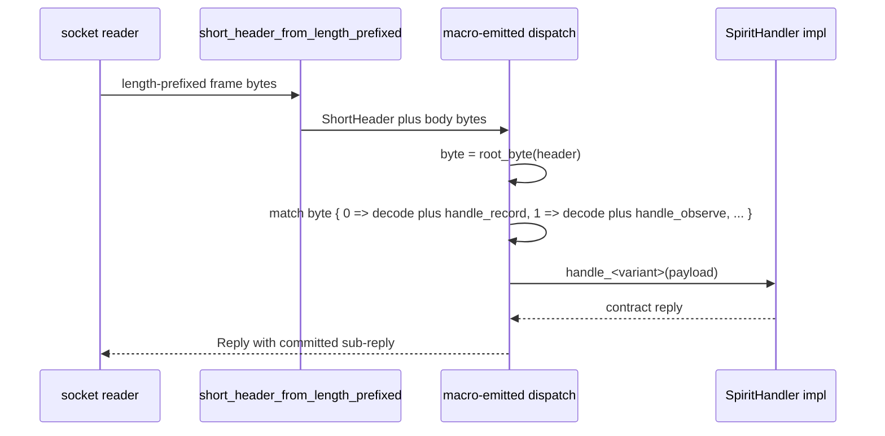

*Kind: Mockup · Topic: dispatch-trait-emission · Date: 2026-05-24*

# 327-8 · Mockup — OperationDispatch trait + macro-emit proof

Mockup-Subagent-3 of the designer-dispatched mockup wave. Carries the
**ShortHeader consumption + OperationDispatch trait macro emission**
slice — the receive-side counterpart to the already-landed
`ShortHeader` emit-side helpers in `signal-frame/src/frame.rs`.

Cross-references:

- `reports/designer/323-mvp-scope-expansion-per-operator-directive.md §3.1`
  — the dispatcher trait design + macro-emit example.
- `reports/designer/323-mvp-scope-expansion-per-operator-directive.md §8.3`
  — async vs sync handler design choice.
- `reports/designer/326-v13-spirit-complete-schema-vision.md` — schema
  language + macro-pattern frame this mockup operates inside.
- `reports/second-designer/166-self-audit-2026-05-24.md §5.4` — spirit
  intent 407 ("Short headers drive receive-side dispatch triage").
- `reports/second-designer/163-signal-sema-interaction-and-spirit-architecture-2026-05-24.md §5.4`
  — Spirit's current hand-written dispatcher (the macro replaces this).

## §1 Worktree + branch

| Field | Value |
|---|---|
| Worktree path | `/git/github.com/LiGoldragon/signal-frame-worktrees/designer-327-mockup-3-dispatch` |
| jj workspace name | `designer-327-mockup-3-dispatch` |
| Parent change | `vnrpmxsy 70812f30 main` (schema v0.1 concept landing) |
| Working commit | `vouwurns 129dec3f` |
| Commit message | `signal-frame: mockup OperationDispatch trait + emit proof per designer/327 mockup-3` |

The worktree was created with `jj workspace add` against the existing
checkout at `/git/github.com/LiGoldragon/signal-frame` (`EnterWorktree`
is unavailable inside a sub-agent's cwd-override session). The primary
working copy was not touched.

## §2 What was implemented

Three new files in the `signal-frame` crate, plus two lines added to
`src/lib.rs` for module wiring + re-exports.

| File | Lines | Purpose |
|---|---|---|
| `src/dispatch.rs` | 112 | `OperationDispatch` trait declaration + `root_byte` peek helper + `unknown_root` error constructor + `KernelDispatchError` type alias. |
| `src/dispatch_emit_proof.rs` | 191 | Hand-written analogue of what the `signal_channel!` macro emits for the receive-side dispatcher. Includes a 3-variant toy contract (`Record`, `Observe`, `Tap`), a `SpiritHandler`-style per-variant handler trait, a channel-specific error type, and the blanket `impl<H: SpiritHandler> OperationDispatch<ToyReply> for H`. |
| `tests/dispatch.rs` | 256 | 7 integration tests exercising the dispatcher end-to-end (one per variant + unknown-byte + decode-failure + byte-0-only + helper smoke). |

Total mockup surface: 559 LoC across new files. `src/lib.rs` gained
two lines (module declaration + re-export of dispatch vocabulary).

## §3 Trait shape

The mockup ships two traits — the dispatcher trait that lives in
`signal-frame` and is shared across every channel, and the per-variant
handler trait the macro emits per channel into the contract crate.

### §3.1 OperationDispatch — lives in signal-frame

```rust
pub trait OperationDispatch<ReplyPayload> {
    type Error;
    fn dispatch(
        &mut self,
        header: ShortHeader,
        body_bytes: &[u8],
    ) -> Result<Reply<ReplyPayload>, Self::Error>;
}
```

Key shape choices, with the rationale that lives inline in the source
as a `DESIGN-DECISION-REVIEW (designer/323 §8.3)` marker:

- **Synchronous `fn`.** The shipping macro will likely emit `async fn`
  since Spirit / Mind / Router are all Kameo-actor-based. The mockup
  chose sync to keep `signal-frame` free of an async-runtime
  dependency and to make the trait bounds visible without
  `async_trait` desugaring. Marker in `src/dispatch.rs:38-46`.
- **`&mut self`** so handlers can mutate daemon state directly. The
  macro will keep this whether the trait stays sync or goes async.
- **`ReplyPayload` is a trait type parameter, not an associated type.**
  Each channel has exactly one `ReplyPayload` shape, but the dispatcher
  trait is potentially impl'd by the same daemon type for multiple
  channels (e.g. Spirit's actor handles both the working and the
  owner contract). A type parameter lets the same `H` impl
  `OperationDispatch<WorkingReply>` and `OperationDispatch<OwnerReply>`
  concurrently.
- **`body_bytes: &[u8]`** is the raw decoded body slice. The
  dispatcher does NOT peek the header — callers run
  `short_header_from_length_prefixed` first, then hand the peeked
  header plus the body bytes (post strip-length-prefix +
  strip-short-header) to `dispatch`. This keeps the
  peek-before-decode discipline visible at the call site.

### §3.2 SpiritHandler — what the macro emits per channel

The mockup hand-writes a 3-variant version standing in for what the
macro generates from the schema's operation list:

```rust
pub trait SpiritHandler {
    fn handle_record(&mut self, payload: ToyEntry) -> Result<ToyReply, ToyError>;
    fn handle_observe(&mut self, payload: ToyObservation) -> Result<ToyReply, ToyError>;
    fn handle_tap(&mut self, payload: ToyFilter) -> Result<ToyReply, ToyError>;
}
```

One method per `Operation` variant. The compiler enforces
exhaustiveness — a daemon impl that misses a variant is a compile
error. This is the per-variant-vs-typed-channel choice from /323
§8.3 (lean: per-variant), now confirmed under the mockup.

The macro names handler methods by lowering each schema operation
ident with the `handle_` prefix: `Record` → `handle_record`,
`Observe` → `handle_observe`, `Tap` → `handle_tap`.

## §4 The macro-emit proof

The blanket impl in `src/dispatch_emit_proof.rs:152-180` is the
human-readable analogue of what the `signal_channel!` macro will
emit. Spelled out for clarity:

```rust
impl<H: SpiritHandler> OperationDispatch<ToyReply> for H {
    type Error = ToyError;

    fn dispatch(
        &mut self,
        header: ShortHeader,
        body_bytes: &[u8],
    ) -> Result<Reply<ToyReply>, Self::Error> {
        let byte = root_byte(header);
        let reply_payload = match byte {
            0 => {
                let entry: ToyEntry = decode_body(body_bytes, byte)?;
                self.handle_record(entry)?
            }
            1 => {
                let observation: ToyObservation = decode_body(body_bytes, byte)?;
                self.handle_observe(observation)?
            }
            2 => {
                let filter: ToyFilter = decode_body(body_bytes, byte)?;
                self.handle_tap(filter)?
            }
            n => return Err(unknown_root(n).into()),
        };
        Ok(Reply::committed(NonEmpty::single(SubReply::Ok(reply_payload))))
    }
}
```

What the real macro emits differently:

- **Crate origin.** Macro emits into the contract crate
  (`signal-persona-spirit/src/dispatch_emitted.rs` or similar), not
  into `signal-frame`. The mockup co-locates with the dispatcher
  trait purely so a reader can see both shapes side by side.
- **Variant count + names** come from the schema, not from a fixed
  list. For Spirit's full 7-variant surface (`Statement`, `Entry`,
  `Observation`, `Subscription`, `SubscriptionToken`,
  `ObserverFilter`, `ObserverSubscriptionToken`), the match has 7
  arms with discriminator bytes 0..6.
- **Decode bound.** The macro inserts trait bounds on each variant's
  payload type so the `rkyv::from_bytes` call satisfies its
  `CheckBytes + Deserialize` bounds. The mockup hand-writes the
  generic `decode_body<Payload>` helper to avoid pasting the bound
  list per arm; the macro will inline or factor as suits.
- **Reply wrapping.** The mockup wraps the single handler reply in
  `Reply::committed(NonEmpty::single(SubReply::Ok(_)))` — fine for
  the single-operation toy. The real macro emits the multi-operation
  path: iterate the request's `per_operation` vector, dispatch each
  to its handler, collect into a `NonEmpty<SubReply<…>>`, assemble
  the right `AcceptedOutcome`. Out of scope for this mockup; the
  dispatcher's contract is "header byte → handler method", not
  reply assembly.
- **Error type.** Macro emits the channel-specific `<Component>Error`
  enum with a `From<OperationDispatchError>` variant. The mockup
  hand-writes `ToyError` with a `#[from] OperationDispatchError`
  variant via `thiserror`.

## §5 Helpers and supporting items

- **`root_byte(header: ShortHeader) -> u8`** — extracts byte 0 of
  the header's little-endian form. Lives in `src/dispatch.rs` rather
  than on `ShortHeader` itself so the dispatch vocabulary stays
  unified in one module. The macro emits calls to this helper rather
  than reaching into header internals; if the future short-header
  layout moves the root-verb byte (e.g. spirit 392 sub-byte packing),
  only this helper changes.
- **`unknown_root(byte: u8) -> OperationDispatchError`** —
  convenience constructor used by the macro-emitted `n =>` fallback
  arm. Returns the existing
  `OperationDispatchError::UnknownOperationRoot` variant already in
  `src/operation_dispatch.rs`.
- **`KernelDispatchError` type alias** — alias for
  `OperationDispatchError`. Lets macro-emitted code name the kernel
  error under the dispatch vocabulary without an extra import.
- **`pub use dispatch::{KernelDispatchError, OperationDispatch, root_byte, unknown_root}`**
  in `src/lib.rs` — the dispatcher vocabulary is part of the
  `signal-frame` public surface.

## §6 Test results

Seven integration tests in `tests/dispatch.rs`, all green:

| Test | What it asserts |
|---|---|
| `dispatch_routes_record_to_handle_record` | Header byte 0 = 0 routes to `handle_record`, payload decoded correctly, other handlers untouched. |
| `dispatch_routes_observe_to_handle_observe` | Header byte 0 = 1 routes to `handle_observe`, same isolation. |
| `dispatch_routes_tap_to_handle_tap` | Header byte 0 = 2 routes to `handle_tap`, same isolation. |
| `dispatch_rejects_unknown_root_byte` | Header byte 0 = 99 returns `ToyError::Dispatch(UnknownOperationRoot { root: 99 })`. No handlers run; body bytes irrelevant. |
| `dispatch_surfaces_body_decode_failure` | Header byte 0 = 0 with garbage body bytes returns `ToyError::BodyDecode { variant: 0 }`. Handler does not run. |
| `dispatch_uses_byte_zero_only_ignoring_higher_bytes` | Header `[1, 0xaa, 0, 0, 0, 0, 0, 0xff]` still routes to `handle_observe` — higher bytes (reserved for future sema-verb / sub-variant slots per spirit 392) do not affect dispatch today. |
| `non_empty_single_smoke` | Sanity check on `NonEmpty::single` — keeps the helper import wired in. |

Build and test commands run from inside the worktree:

```text
$ CARGO_BUILD_JOBS=2 cargo test --test dispatch
running 7 tests
test result: ok. 7 passed; 0 failed; 0 ignored; 0 measured; 0 filtered out
```

Full crate test suite (`cargo test`) reports 21 frame tests + 3
namespace tests + 1 namespace-compile-fail test + the 7 dispatch
tests + 0 doc-tests, all green. Cargo fmt is clean
(`cargo fmt --all --check` exits 0).

Nix flake check (`nix flake check --option max-jobs 0`) — flake
evaluation succeeds for all three derivations (`packages`, `checks`,
`devShells`). The build phase requires positive `max-jobs` to execute;
with `max-jobs 0` per directive, only evaluation runs and that part
is green. A separate attempt with the default remote builder hit a
prometheus-side `/git/...` sandbox-permission issue on the source
derivation that is environment-specific, not code-specific (main
itself also goes through the same builder when not pre-cached).

## §7 Sequence — what dispatch looks like on the wire



| Diagram label | Concrete identifier |
|---|---|
| Socket reader | per-daemon socket reader (e.g. Spirit's actor inbound) |
| short_header_from_length_prefixed | `signal_frame::short_header_from_length_prefixed` |
| macro-emitted dispatch | the `impl<H: SpiritHandler> OperationDispatch for H` shown in §4 |
| SpiritHandler impl | the daemon's per-component handler struct (e.g. `SpiritActor`) |

## §8 Open questions for operator

Numbered so operator can pick them off in any order during pickup.

### §8.1 — Async vs sync dispatcher

The mockup picked sync. The shipping daemons are all Kameo-actor-based.
Two viable shapes:

1. Macro emits `async fn dispatch` — pulls `async_trait` or AFIT
   stabilisation requirement into `signal-frame`'s public surface.
2. Macro keeps sync `dispatch` but per-variant handlers return
   `Future`-typed values the daemon adapter awaits.

Lean per /323 §8.3: option 1 (full async trait). Confirm during
pickup — the mockup left option 2's pattern unexercised.

### §8.2 — Where does dispatch.rs live?

Mockup placed `dispatch` as a sibling module of `frame` in
`signal-frame/src/dispatch.rs`. Alternatives:

- **Sub-module of `frame`** (`src/frame/dispatch.rs`) — emphasises the
  receive-side as part of frame mechanics.
- **Sibling of `operation_dispatch.rs`** (existing module that today
  only owns the error type) — fold dispatch trait + helpers into the
  existing `operation_dispatch` module, no new module needed.

Mockup picked a separate `dispatch` module to keep the trait and the
emit proof together; the existing `operation_dispatch` module only
holds the error today. Folding the dispatch trait into
`operation_dispatch` and renaming would also work. Operator's call.

### §8.3 — Decode errors in the dispatcher path

Mockup surfaces a body-decode failure as a variant-specific
`ToyError::BodyDecode { variant }`. Alternatives:

1. Add `BodyDecodeFailed { variant: u8 }` to
   `OperationDispatchError` (the kernel error type). The macro then
   doesn't need a per-channel `BodyDecode` variant — the kernel error
   carries it.
2. Keep it per-channel as the mockup does. Lets each contract
   classify decode failure differently (e.g. some contracts may want
   to mark partial-decode as recoverable while others don't).

Lean: option 1 — decode failure is a kernel concern, not a contract
concern. Move it in during pickup.

### §8.4 — How does the dispatcher tie to the `Reply` shape?

Mockup wraps the handler's single reply in
`Reply::committed(NonEmpty::single(SubReply::Ok(_)))`. The full
multi-operation path (iterate the request's `per_operation`, collect
sub-replies, assemble `AcceptedOutcome`) is out of scope for the
trait shape but lands in the same macro-emit pass. Question for
operator: does the request-level iteration belong inside the
`dispatch` method (so the trait takes a `Request` instead of a single
`(header, body_bytes)` pair) or above it (caller iterates and calls
`dispatch` per operation)? Mockup picked the latter; both work.

### §8.5 — Header peek discipline at the call site

Mockup leaves the header-peek step to the caller. An alternative
shape is a `dispatch_from_wire(&mut self, wire_bytes: &[u8])` helper
that peeks + strips internally. The caller-peeks shape exposes the
peek-before-decode discipline visibly; the wire helper hides it.
Lean: keep peek at call site (current shape), add a thin
`dispatch_from_wire` helper as a documented convenience layer if
daemons end up writing the same 3-line peek-and-strip pattern
everywhere.

## §9 Cross-checks against /323 §3.1 example

The /323 §3.1 design sketch shows seven Spirit variants:
`State` (0), `Record` (1), `Observe` (2), `Watch` (3), `Unwatch` (4),
`Tap` (5), `Untap` (6). The mockup compressed to three (Record,
Observe, Tap) under the toy contract — enough to drive trait shape
+ test the routing dispatch + cover happy / unknown / decode-failure
paths. The macro-emit pattern generalises to N variants by emitting
one match arm per variant; the mockup's three arms have the same
shape the full seven would.

The /323 §3.1 sketch puts `decode_body` inline per arm without a
helper. The mockup factored `decode_body<Payload>` because the same
five-line `rkyv::from_bytes::<…>` bound list otherwise repeats per
arm. The macro can emit either form — inlining is fine if the
bound list is short, factoring helps when the channel has many
variants.

The mockup's `unknown_root` fallback uses the kernel
`OperationDispatchError::UnknownOperationRoot { root }` variant
already present in `src/operation_dispatch.rs`. The /323 §3.1 sketch
named it `SpiritError::UnknownVariant(n)`; the mockup proves the
existing kernel variant fits.

## §10 What the macro still owes after this mockup

Pickup work for the macro library (`primary-ezqx.1`):

1. Emit the `Operation` enum with `#[repr(u8)]` + explicit
   discriminants pinned in declaration order. (The mockup's
   `ToyOperation` shows the shape.)
2. Emit the per-channel handler trait
   (`<Component>Handler`) with one `handle_*` method per `Operation`
   variant. Method name = `handle_` + lowered variant ident.
3. Emit the blanket `impl<H: <Component>Handler> OperationDispatch
   for H` per §4 above.
4. Emit the channel-specific error enum with a
   `#[from] OperationDispatchError` variant + a per-variant
   `BodyDecode` variant (or use the kernel-error approach from §8.3
   option 1, which removes this).
5. Wire the schema reader to populate the variant list + discriminator
   assignment + per-variant payload type lookup.

Spirit's existing hand-written dispatcher at
`persona-spirit/src/actors/dispatch.rs` (per second-designer/163
§5.4) is the cutover target: once the macro lands and emits the
above, the hand-written dispatcher comes out.

## §11 Summary

Mockup delivers the receive-side dispatch trait + macro-emit proof
+ green test harness for Spirit's 3-variant toy contract. The trait
shape is sync (with a marker noting the likely async shift for
shipping), the per-variant handler trait gives compiler-enforced
exhaustiveness, and the dispatcher consumes the existing
`ShortHeader` peek helpers landed via `primary-2cjv` without any
changes to `signal-frame`'s emit-side surface.

Pickup carries the four trait-shape questions from §8 (async, module
placement, decode-error location, request-iteration boundary) plus
the five macro-library items from §10. None of those questions block
the trait + emit-proof landing — they shape the macro emission, not
the trait's stable surface.
