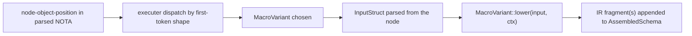
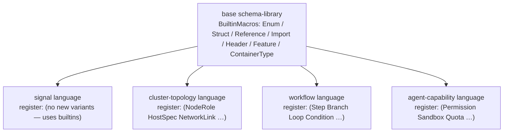

*Kind: Design · Topic: schema-macro-component-extensibility · Date: 2026-05-24*

# 329 — Schema macro-component extensibility — InputStruct-per-variant pattern

**Status:** designer-lane design pass. Per psyche question on reusable components for AssembledSchema lowering: each macro-schema-variant at a node-definition point IS a data-carrying enum variant; the data IS its input struct; the input struct declares what shape that macro takes. This pattern makes the lowering executer extensible — new macros plug in by declaring an InputStruct + adding a variant + impl-ing the lowering trait. The same pattern serves the universal "schemas as macro pattern" framing from `/326-v13 §3` for custom domain-specific languages.

## §1 The pattern in one sentence

A **MacroVariant** is a data-carrying enum variant whose payload IS its input struct. The schema's lowering executer dispatches each node-object-position to the matching MacroVariant by inspecting the node's shape; the executer hands the parsed input struct to the variant's lowering function which emits IR fragments. New MacroVariants plug in without touching the executer.



## §2 Built-in MacroVariant types in the schema language

The base schema (`nota/spirit.schema` per `/326-v13 §3`) declares the closed set of built-in macro variants:

```nota
MacroVariant [
  (Enum EnumInput)
  (Struct StructInput)
  (Reference ReferenceInput)
  (Import ImportInput)
  (Header HeaderInput)
  (Feature FeatureInput)
  (ContainerType ContainerTypeInput)
]
```

Each variant is data-carrying. The payload type names the InputStruct that declares the variant's input shape. Standard NOTA enum-declaration form.

### §2.1 Per-variant trigger — what the executer looks for

| Variant | Trigger pattern at node-position | InputStruct |
|---|---|---|
| `Enum` | `[var1 var2 …]` — vector of bare PascalCase or `(Name Payload)` records | `EnumInput` |
| `Struct` | `(field_type1 field_type2 …)` — parens with type-refs inside, no reserved tag | `StructInput` |
| `Reference` | bare PascalCase identifier alone | `ReferenceInput` |
| `Import` | `(Import Path […])` or `(ImportAll Path)` — reserved tag at parens head | `ImportInput` |
| `Header` | `(VerbName [sub-variants])` — parens at header-vector position, with bracket payload | `HeaderInput` |
| `Feature` | `(FeatureKind …)` — parens at features-vector position; `FeatureKind ∈ {Reply, Event, Observable, Storage, Upgrade}` | `FeatureInput` |
| `ContainerType` | `(Vec X)` or `(Option X)` or `(Map K V)` — parens with reserved container constructor tag | `ContainerTypeInput` |

The executer's dispatch is a single function that walks the parsed NOTA tree + matches against these trigger patterns. Each match invokes the corresponding variant's lower.

## §3 InputStruct per variant — declared in base namespace

Each MacroVariant's InputStruct is declared in the same base schema's namespace:

```nota
EnumInput ((Vec EnumVariantNode))

EnumVariantNode [
  (Unit EnumIdentifier)
  (DataCarrying EnumIdentifier PayloadRef)
  (SubEnum EnumIdentifier (Vec EnumVariantNode))
]

StructInput ((Vec FieldTypeRef))

FieldTypeRef [
  (Direct EnumIdentifier)
  (Container ContainerTypeInput)
]

ReferenceInput (EnumIdentifier)

ImportInput [
  (Selective Path (Vec EnumIdentifier))
  (All Path)
]

HeaderInput (EnumIdentifier (Vec HeaderSubVariant))

HeaderSubVariant [
  (UnitRoute EnumIdentifier)
  (DataCarryingRoute EnumIdentifier PayloadRef)
]

FeatureInput [
  (Reply (Vec EnumIdentifier))
  (Event StreamRef (Vec EnumIdentifier))
  (Observable FilterMode EnumIdentifier EnumIdentifier)
  (Storage (Vec StorageDecl))
  (Upgrade VersionRef (Vec UpgradeDirective))
]

ContainerTypeInput [
  (Vec EnumIdentifier)
  (Option EnumIdentifier)
  (Map EnumIdentifier EnumIdentifier)
]

PayloadRef (EnumIdentifier)
StreamRef (EnumIdentifier)
FilterMode [Default (Custom EnumIdentifier)]
VersionRef (String)
StorageDecl (EnumIdentifier (Vec FieldTypeRef))
UpgradeDirective [
  (Migrate EnumIdentifier)
  (RenamedFrom EnumIdentifier)
  (Drop EnumIdentifier)
  (Custom EnumIdentifier EnumIdentifier)
  (Untranslatable EnumIdentifier)
]
```

Per `/326-v13`'s namespace rules:
- `[…]` value = enum declaration (multi-variant)
- `(…)` value = struct (positional fields)
- `(Vec X)` and `(Option X)` = container types in field positions (per /326-v10)
- The map key is the type's name; values follow the four-form rule

**Critical:** the InputStruct declarations themselves use the schema language's own constructs. This is the self-describing property from `/326-v13 §3` — the base schema bootstraps using its own forms.

## §4 The `SchemaMacro` trait — Rust-side surface

In the macro library implementation, each MacroVariant maps to a Rust trait impl:

```rust
pub trait SchemaMacro {
    type Input;
    type Output;
    type Error;

    fn trigger_pattern(node: &NotaNode) -> bool;
    fn parse_input(node: &NotaNode) -> Result<Self::Input, Self::Error>;
    fn lower(input: Self::Input, ctx: &mut LoweringContext) -> Result<Self::Output, Self::Error>;
}
```

`LoweringContext` carries the in-progress AssembledSchema + the namespace under construction + import resolution state.

`Self::Output` is one or more IR fragments — typically `Vec<AssembledSchemaEntry>` per operator/174's lowered form (`Route` entries, `Type` entries, `Import` entries, etc.).

### §4.1 Per-variant impl sketches

```rust
pub struct EnumMacro;
impl SchemaMacro for EnumMacro {
    type Input = EnumInput;
    type Output = Vec<AssembledSchemaEntry>;
    type Error = MacroError;

    fn trigger_pattern(node: &NotaNode) -> bool {
        matches!(node, NotaNode::Vector(_))  // [...] at namespace-value position
    }

    fn parse_input(node: &NotaNode) -> Result<Self::Input, Self::Error> {
        // walk the vector + parse each element as EnumVariantNode
    }

    fn lower(input: Self::Input, ctx: &mut LoweringContext) -> Result<Self::Output, Self::Error> {
        // emit one Type entry naming this enum + its variants
        Ok(vec![AssembledSchemaEntry::Type {
            name: ctx.current_type_name(),
            shape: TypeShape::Enum(input.variants),
        }])
    }
}

pub struct HeaderMacro;
impl SchemaMacro for HeaderMacro { /* … */ }

pub struct ImportMacro;
impl SchemaMacro for ImportMacro { /* … */ }
```

The lowering executer is a dispatcher that holds a list of `Box<dyn SchemaMacro>` implementations and iterates them per node-object-position, calling `trigger_pattern` to find the match then invoking parse + lower.

## §5 Adding a new macro variant — extensibility worked example

Suppose we want to add a `(Validate ValidationInput)` macro variant — declares a runtime validation rule that applies to a type.

**Step 1: Declare the InputStruct in your schema's namespace:**

```nota
ValidationInput [
  (Range NumericMin NumericMax)
  (Length EnumIdentifier u32 u32)
  (Pattern EnumIdentifier String)
]

NumericMin (i64)
NumericMax (i64)
```

**Step 2: Add the new variant to your local MacroVariant union (or use a separate macro registry):**

```nota
MyMacroVariant [
  ;; … inherit all built-in variants from base ImportAll …
  (Validate ValidationInput)
]
```

**Step 3: Implement `SchemaMacro` for `ValidateMacro`** in your crate's Rust code:

```rust
pub struct ValidateMacro;
impl SchemaMacro for ValidateMacro {
    type Input = ValidationInput;
    type Output = Vec<AssembledSchemaEntry>;
    type Error = MacroError;

    fn trigger_pattern(node: &NotaNode) -> bool {
        matches!(node, NotaNode::Record(head, _) if head == "Validate")
    }

    fn parse_input(node: &NotaNode) -> Result<Self::Input, Self::Error> { /* … */ }

    fn lower(input: Self::Input, ctx: &mut LoweringContext) -> Result<Self::Output, Self::Error> {
        // emit a Validation entry into AssembledSchema
        Ok(vec![AssembledSchemaEntry::Validation { /* … */ }])
    }
}
```

**Step 4: Register the new macro with the executer:**

```rust
let mut executer = SchemaExecuter::new();
executer.register(BuiltinMacros::all());     // standard library
executer.register(ValidateMacro);            // your extension
```

**Result:** any `.schema` file using `(Validate (Range 0 100))` at a node-object-position now lowers through your custom macro. No executer changes needed. The base schema and the rest of the lowering pipeline are untouched.

## §6 Reusability across custom schema languages

Per `/326-v13 §3`'s "schemas as macro pattern": different specialized macros define different domain-specific languages. The extensibility from `§5` is how each custom language is built:



Each custom language:
1. Inherits the base BuiltinMacros (handles `(Enum …)`, `(Struct …)`, etc. uniformly)
2. Registers its own MacroVariants for domain-specific concepts
3. Reuses the same SchemaExecuter + LoweringContext + AssembledSchema shape
4. Gets the same diff-driven upgrade emission for free (per `/326-v12 §5-§6`)

The macro library (`primary-ezqx.1`) implements:
- `SchemaExecuter` runtime
- `BuiltinMacros` for the standard variants
- `LoweringContext` + `AssembledSchema` shape
- The `nota-codec` integration for parsing

Each downstream consumer just adds domain-specific MacroVariants. The pattern is genuinely a library.

## §7 What this gives us

| Property | How |
|---|---|
| **Closed schema-language is open at the edges** | base provides 7 BuiltinMacros; new MacroVariants register at the executer |
| **Each macro is independently testable** | `SchemaMacro` impl is a pure function `(input, ctx) -> output` |
| **Lowering executer stays simple** | dispatch loop + trigger-pattern matching; no special cases per variant |
| **Diff-driven upgrade emission works uniformly** | every variant produces AssembledSchemaEntry's; diff is per-entry |
| **Cross-language tooling reusable** | schema-daemon (per `/326-v13 §4`) stores AssembledSchema regardless of source language |
| **Macro library evolution is additive** | adding a new BuiltinMacro is a new impl + a new entry in `BuiltinMacros::all()` |
| **Custom language development is incremental** | start with base + add MacroVariants as domain concepts crystallize |

## §8 Per-position dispatch — where each MacroVariant fires

The executer dispatches per SCHEMA-POSITION; different positions accept different MacroVariant sets:

| Schema position | Allowed MacroVariants |
|---|---|
| Position 0 (imports map values) | `Import` only |
| Positions 1-3 (header vectors) | `Header` only (each element of the vector is a Header invocation) |
| Position 4 (namespace map values) | `Enum`, `Struct`, `Reference`, `Import` |
| Position 5 (features vector) | `Feature` only (each element is a Feature invocation) |
| Field-type positions inside Struct | `Reference`, `ContainerType` |
| Variant-payload positions inside Enum | `Reference`, `ContainerType` |

The executer knows the POSITION it's parsing + filters the allowed MacroVariants accordingly. A user trying `(Validate …)` at the imports-map position would fail with a positional-type error (Validate isn't an allowed Import-position variant).

### §8.1 Why positional filtering matters

Without positional filtering, every MacroVariant would be valid at every position — chaos. With it:
- Schemas are self-validating at the syntactic level
- Errors are diagnosable + locale-able to specific positions
- Custom languages declare WHICH positions accept their new MacroVariants

The positional-allowed-set itself can be declared in the base schema:

```nota
PositionalAllowedSets ([Map SchemaPosition (Vec MacroVariantTag)])

SchemaPosition [
  ImportsMap
  HeaderVector
  NamespaceMap
  FeaturesVector
  StructFieldType
  EnumVariantPayload
]

MacroVariantTag [Enum Struct Reference Import Header Feature ContainerType Validate]
```

Custom language extensions add their tags to the allowed-set per the positions they're valid at.

## §9 The bootstrap question — built-in vs user-defined

**Built-in MacroVariants are HARDCODED in the executer's Rust code** because the base schema's own declarations USE THEM. Schema-for-a-schema parses itself with the built-in macros; can't parse without them.

User-defined MacroVariants are registered AT RUNTIME (or at macro-library-construction-time) into the executer's registry. The executer's dispatch checks built-ins first, then user-registered.

The boundary:
- Built-in = needed to parse the base schema = hardcoded Rust impl + bootstrap-baked-in
- User-defined = added on top = registered + dispatched dynamically

This is the same bootstrap question from `/326-v3 §8.3` (how does the parser know Schema's shape?) — hardcode the entry point + everything else flows recursively. Same answer: hardcode the smallest necessary set + extend from there.

## §10 Open questions

### §10.1 Macro variant registration scope

Two options:
- (a) Per-`.schema`-file registration — each file lists which custom MacroVariants it uses; executer only loads those
- (b) Workspace-global registration — all custom MacroVariants always loaded

Lean: **(a)** per-file — keeps each schema self-contained + avoids namespace pollution across components. Operator confirms or picks.

### §10.2 Input struct location — base schema or extension schema?

When a custom language adds a MacroVariant, its InputStruct can live in:
- (a) The custom language's own schema file
- (b) A separate "macro-input" schema file inherited from base

Lean: **(a)** — InputStruct lives with the MacroVariant declaration. Keeps the extension self-contained.

### §10.3 Versioning of MacroVariant sets

If a custom language ships v1 with 5 MacroVariants + v2 with 7, how do schemas authored against v1 keep working under v2? Standard answer: additive (v2 adds; never removes); schema-files don't care about MacroVariant set version because they only use what they reference. But: if v2 RENAMES a variant — schema-file diff needs to know.

This connects to `/326-v12 §5` upgrade section + the diff-driven projection emission. MacroVariant rename = `RenamedFrom` annotation in the variant set's own schema.

### §10.4 Cross-language MacroVariant borrowing

Can a workflow-language schema USE a signal-language MacroVariant (e.g., import `Reference` semantics from signal)? The import mechanism (`(Import …)` MacroVariant) already supports this — selectively import named MacroVariants from another language's schema. Reusability without duplication.

## §11 See also

- `reports/designer/326-v13-spirit-complete-schema-vision.md` — schema-as-macro-pattern framing this report extends
- `reports/designer/326-v12-spirit-complete-schema-vision.md` — AssembledSchema + upgrade section + diff-driven emission
- `reports/operator/174-v5-schema-import-header-design-critique-2026-05-24.md` — AssembledSchema entry shape (Route, Type, Import); operator's lowering rules
- `reports/designer/323-mvp-scope-expansion-per-operator-directive.md` — dispatch trait emission (one specific MacroVariant family)
- `reports/designer/322-spirit-mvp-positional-schema-worked-example.md` — Spirit MVP using only built-in MacroVariants
- `reports/designer/327-schema-engine-upgrade-marking-sweep/` — workspace marking sweep; each component eventually consumes the executer + BuiltinMacros + (optionally) registers its own variants
- `nota/example.nota`, `nota-codec/tests/*` — NOTA parsing substrate
- `signal-frame/src/frame.rs` — ShortHeader (the header-dispatch surface a Header MacroVariant emits routes against)
- Spirit records 388-489 — the design corpus underlying the schema language
