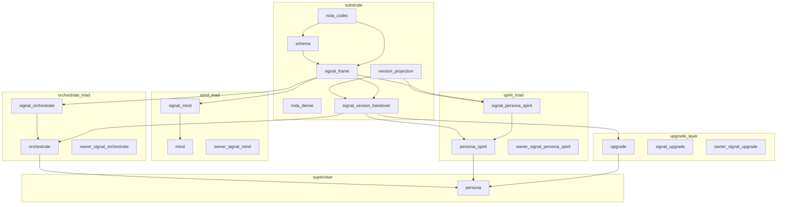
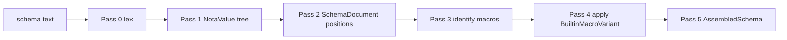
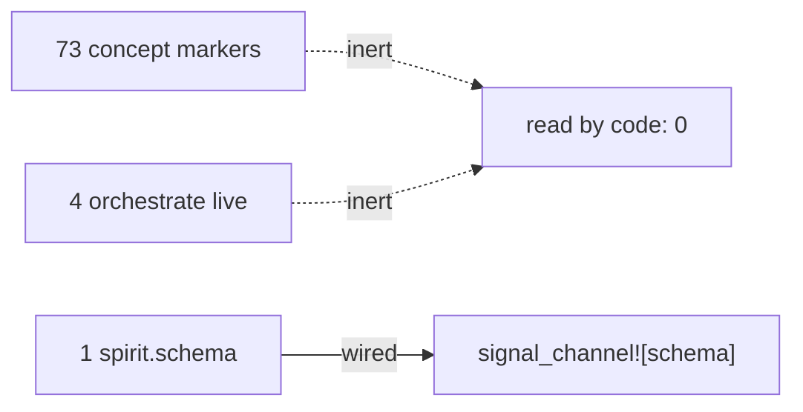
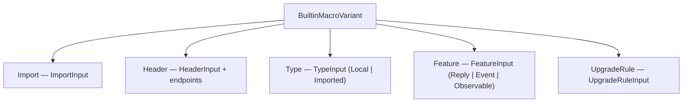
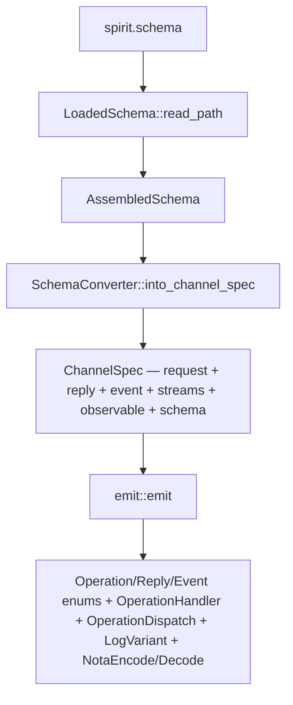
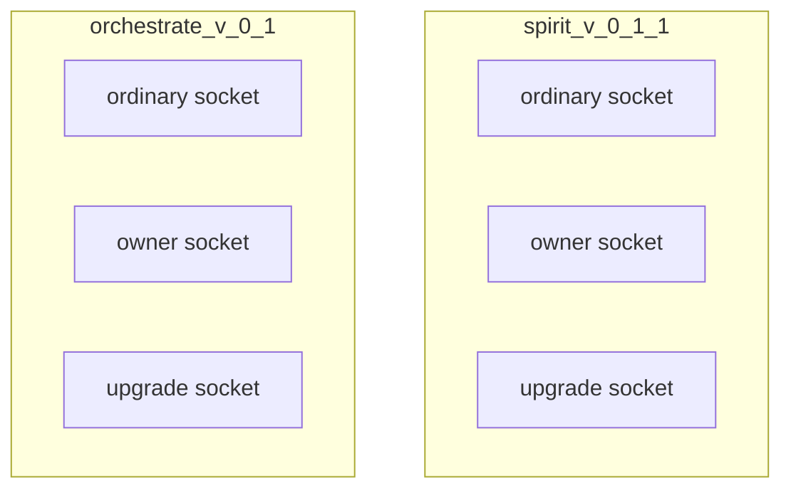
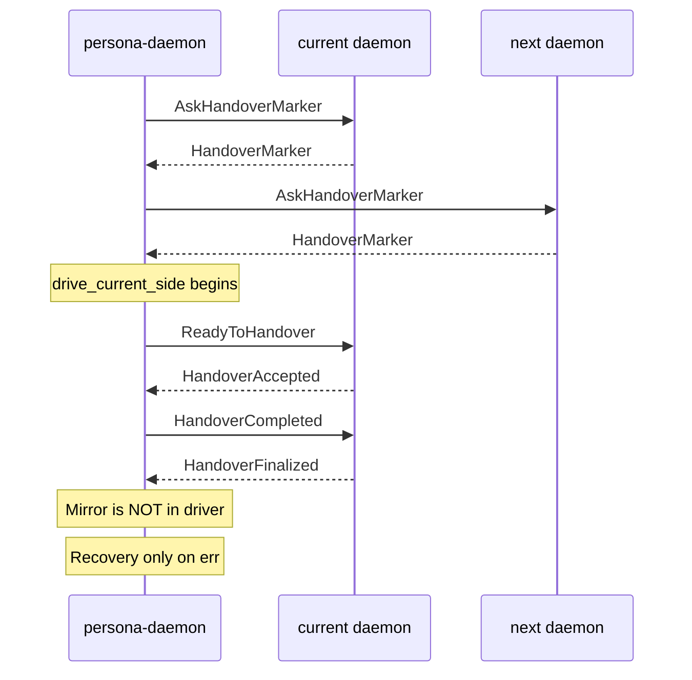
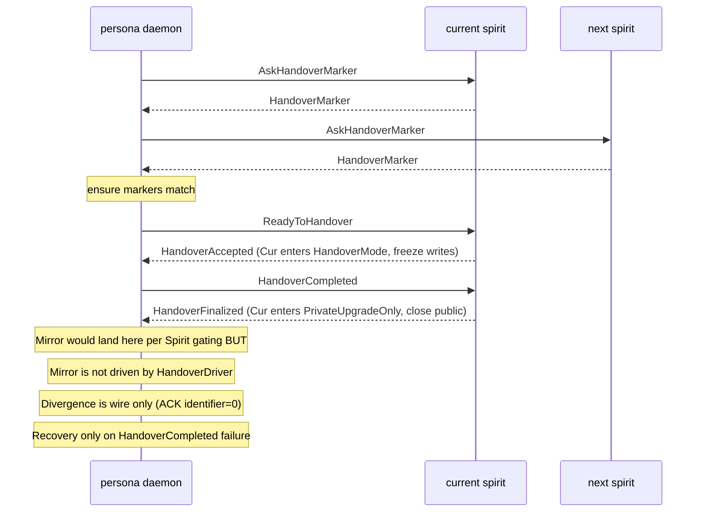
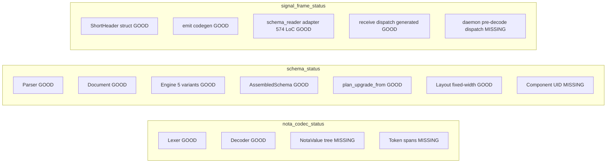
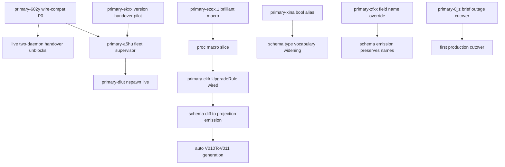

*Kind: Audit · Topic: per-component + per-layer implementation state with mermaid diagrams · Date: 2026-05-25 · Lane: designer (subagent B of meta-report 335)*

# 335.2 · Implementation state with visuals

## §1 Headline

Eleven layers walked across six components plus six substrate crates.
Code-read findings (not report-trust) — every status line below cites
a file path + line range. The picture vs /332 + /176 + /333-v2:

- **Two daemons (`persona-spirit`, `orchestrate`) bind three sockets**
  and both implement the AskHandoverMarker / ReadyToHandover /
  HandoverCompleted ceremony with state-machine semantics. Mirror,
  Divergence, Recovery semantics diverge BETWEEN them — Spirit's Mirror
  requires `PrivateUpgradeOnly` (post-completion); Orchestrate's accepts
  in `Active` AND `Ready` (rejects only Complete). This is the §4.1
  inconsistency `/333-v2` named, materialised in two different daemons.

- **Divergence remains semantically inert in both daemons.**
  Persona-spirit `actors/root.rs:361-368` and orchestrate `service.rs:195-200`
  both ACK with `divergence_identifier: 0` and no state transition. The
  `/333-v2 §4.2` finding generalises beyond Spirit.

- **The production live-cutover driver does not exist.**
  `upgrade-daemon` binary is a placeholder (`upgrade/src/bin/upgrade-daemon.rs:1-9`
  + `placeholder.rs:34-41`) that returns `NotBuiltYet`. The live
  HandoverDriver library exists (`upgrade/src/handover.rs:417-525`) but
  does NOT call Mirror — only Marker → Ready → Complete (+ Recovery
  on failure). It's used in tests, not production.

- **`persona-daemon` supervisor IS real** (not a stub as /333-v2 §6
  partly implied for SOMETHING-named-persona-daemon). The repo
  `/git/github.com/LiGoldragon/persona/` ships a daemon with
  EngineSupervisor (`src/supervisor.rs:30-65`), spawn launcher
  (`src/direct_process.rs`), readiness verification, three-harness
  topologies — and live tests of `AttemptHandover` driving real
  v0.1.0 + v0.1.1 spirit daemons (`persona/TESTS.md:168-179` includes
  `constraint_persona_daemon_owner_socket_drives_real_spirit_upgrade_socket`,
  `constraint_persona_daemon_handover_uses_real_spirit_daemon_binaries`,
  `constraint_persona_daemon_recovers_real_spirit_after_completion_failure`).
  The supervision authority moved OUT of `persona/src/upgrade.rs` to the
  `upgrade` crate (per the compatibility shim at lines 1-12).

- **Selector flip is declarative Nix** —
  `criomosHome.personaSpirit.currentDefault` in
  `CriomOS-home/modules/home/profiles/min/spirit.nix:148-152`. Switching
  versions today means a `home-manager switch`, not a supervisor-driven
  live cutover. The persona-daemon CAN drive AttemptHandover, but the
  active-version PERSISTENCE (which version `spirit` unsuffixed runs)
  is Nix-config-owned in production.

## §2 Layer status — what's wired, typed, hand-written, missing

### §2.1 Component dependency graph (the upgrade stack)

### §2.2 Schema-engine pipeline — pass-by-pass status

Per-pass status table (status legend: WIRED / TYPED-ONLY / HAND-WRITTEN /
MISSING — applied to schema-derivation only; canonical handwritten path
runs every contract).

| Pass | Status | Source citation |
|---|---|---|
| 0 lex | WIRED | `nota-codec/src/lexer.rs` exports `Lexer::next_token`; consumed by `schema/src/parser.rs:18-22` via `Decoder::new(input)` |
| 1 NotaValue tree | MISSING (in nota-codec); HAND-WRITTEN (in schema) | `nota-codec/src/lib.rs` exports only `Decoder` (line 20). No `NotaValue` enum exists. `schema/src/parser.rs:9-501` builds positions directly on top of streaming `Decoder` — bypasses a tree by design |
| 2 structural positions | WIRED | `schema/src/parser.rs:26-42` `parse_schema` reads six positional sections (imports, ordinary header, owner header, sema header, namespace, features) |
| 3 macro identification | WIRED (no separate pass) | `schema/src/document.rs:92-150` `assemble()` walks the parsed schema and dispatches each section to a `BuiltinMacroVariant` — identification is positional in parse, not separate |
| 4 macro application | WIRED | `schema/src/engine.rs:24-44` `BuiltinMacroVariant::lower()` dispatches to `ImportMacro/HeaderMacro/TypeMacro/FeatureMacro/UpgradeRuleMacro` — 5 variants confirmed |
| 5 assemble | WIRED | `schema/src/engine.rs:194-223` `LoweringContext::finish()` builds `AssembledSchema`; layout-after-assemble + component UID minting are NOT done |

### §2.3 Schema authoring — `.schema` file census

| Class | Count | Read by code? | Citation |
|---|---|---|---|
| `.concept.schema` markers | 73 | NO | `find /git/.../LiGoldragon -maxdepth 3 -name '*.concept.schema'` |
| orchestrate live (`v0-1`, `v0-1-1`, `types-v0-1`, `storage-v0-1`) | 4 | NO | `orchestrate/schema/*.schema` exist; `grep -rn 'orchestrate-v0-1' orchestrate/src/` returns empty |
| spirit live | 1 | YES | `signal-persona-spirit/spirit.schema` consumed via `signal-persona-spirit/src/lib.rs:435` `signal_channel!([schema])` |

### §2.4 BuiltinMacroVariant enum — the 5 variants

Per `schema/src/engine.rs:6-22` — exactly 5 variants, with cursor points
`ImportMapValue / HeaderRoot / NamespaceValue / FeatureItem / UpgradeRule`.

The /334 v1 claim of "3 missing variants (NewtypeDefinition / FieldType /
UpgradeRule)" is wrong. `UpgradeRuleInput` exists (line 21-22 + lines
171-184). Newtype folds into `TypeInput::Local` with `DeclarationBody::Newtype`
(parser.rs:148-157). FieldType isn't a top-level variant by design — field
types are leaves inside the type expression tree (`expression.rs`).

### §2.5 Brilliant macro library — what `signal_channel!([schema])` emits

`signal-frame/macros/src/schema_reader.rs:23-89` reads the schema and
synthesises a ChannelSpec. The actual codegen is `emit::emit` which is
shared with the hand-written `signal_channel! { … }` form. The trigger
that selects the schema path is at `lib.rs:56-66`: if the macro input
starts with `[`, call `schema_reader::read_default_schema()`.

Only ONE crate uses the `[schema]` form. Six crates use the hand-written
form (cited):

| Crate | Form | Line |
|---|---|---|
| `signal-persona-spirit` | `[schema]` | `src/lib.rs:435` |
| `owner-signal-persona-spirit` | hand-written | `src/lib.rs:104` |
| `signal-version-handover` | hand-written | `src/lib.rs:179` |
| `owner-signal-version-handover` | hand-written | `src/lib.rs:198` |
| `signal-orchestrate` | hand-written | `src/lib.rs:1085` |
| `owner-signal-orchestrate` | hand-written | `src/lib.rs:155` |
| `signal-mind` | hand-written | `src/lib.rs:893` |

### §2.6 ShortHeader — outbound wired, receive-side post-decode

ShortHeader type lives in `signal-frame/src/frame.rs:10-42`. Encoding:
`encode_frame_archive` (line 204-213) writes the 8-byte little-endian
prefix BEFORE the rkyv-archived body, length-prefixed. This is outbound
WIRED.

Receive side: `short_header_from_archive` exists (`frame.rs:191-198`).
The generated `kind_from_short_header` is emitted into every channel
(`signal-frame/macros/src/emit.rs:723-741`). The generated
`dispatch(short_header, operation)` triages by header BEFORE delegating
to the operation handler (`emit.rs:441-462`).

But the daemons use it as a POST-decode consistency check, not a
PRE-decode triage:

- `persona-spirit/src/daemon.rs:366-400` — `request_from_frame` decodes
  the full body first, THEN `validate_request_header` compares the
  ShortHeader's byte-0 to the decoded operation's `kind()`. Mismatch
  errors as `OperationDispatchError::HeaderOperationMismatch`.

This is what /176 §1 named — receive dispatch is generated and tested,
not on the daemon's pre-decode triage path.

### §2.7 Three-socket topology — wired both daemons

| Daemon | Three sockets bound? | Citation |
|---|---|---|
| `persona-spirit` (v0.1.0, v0.1.0.1, v0.1.1) | YES | `persona-spirit/src/daemon.rs:138-145, 642-647` |
| `orchestrate` (v0.1) | YES | `orchestrate/src/daemon.rs:28-30, 52-54, 86-98` |
| `mind` | NOT YET | `mind/src/main.rs` does not bind an upgrade socket; only ordinary |
| `upgrade-daemon` | NO | placeholder binary; returns `NotBuiltYet` per `placeholder.rs:34-41` |

### §2.8 Handover ceremony — operation-by-operation

Per-operation state (status legend: WIRED with semantics / WIRED-no-semantics
/ MISSING):

| Operation | Spirit handler | Orchestrate handler | Driver calls it? |
|---|---|---|---|
| `AskHandoverMarker` | WIRED (`root.rs:228-236`) | WIRED (`service.rs:212-216`) | YES (`upgrade/handover.rs:443-451`) |
| `ReadyToHandover` | WIRED with state→`HandoverMode` (`root.rs:237-271`) | WIRED with state→`Ready` (`service.rs:218-244`) | YES (`handover.rs:454-459`) |
| `HandoverCompleted` | WIRED with state→`PrivateUpgradeOnly` + close public sockets (`root.rs:272-310` + `daemon.rs:1422,1436-1438`) | WIRED with state→`Complete` (`service.rs:246-271`) | YES (`handover.rs:461-481`) |
| `Mirror` | WIRED requires `PrivateUpgradeOnly` (`root.rs:311-360`) | WIRED allows Active+Ready, rejects Complete (`service.rs:273-303`) | NO — driver does NOT send Mirror |
| `Divergence` | WIRED-no-semantics, returns `divergence_identifier: 0` (`root.rs:361-368`) | WIRED-no-semantics same (`service.rs:195-200`) | NO |
| `RecoverFromFailure` | WIRED with state→`Active` from HandoverMode, NO-OP from Active (`root.rs:369-384`) — Note: Active returns recovered=true unconditionally, which Spirit v0.1.0.1 returns false unconditionally per `/333-v2 §4.3` | WIRED with same shape (`service.rs:305-318`) | YES on completion failure (`handover.rs:469-479`) |

Key inconsistency: **Spirit and Orchestrate disagree on which state
accepts Mirror.** Spirit: only `PrivateUpgradeOnly` (post-Completion).
Orchestrate: Active or Ready (any non-Complete). Per `/333-v2 §4.1`,
the design narrative places Mirror BETWEEN Marker and ReadyToHandover —
orchestrate's relaxed gating is closer to the narrative; Spirit's strict
gating is closer to "Mirror is post-cutover state replication". One of
them must change.

### §2.9 Version projection — hand-written, no schema-diff

`signal-persona-spirit/src/migration.rs` carries `V010ToV011` (lines
120-206) as the hand-written projection. The same module declares the
`v010` types as a fresh rkyv-derived submodule (lines 8-118) — six
hand-written `From` impls inside, plus 6 `VersionProjection<X,X>`
infallible identity impls.

The schema crate has the data model for projection
(`schema/src/upgrade.rs:75-101` — `Projection` enum with Identity /
Standard / Annotated / Added / Renamed / Dropped / Untranslatable
variants), and `AssembledSchema::plan_upgrade_from` (`assembled.rs:66-125`)
DOES compute a plan from two assembled schemas. But this PLAN never
emits Rust code — there's no proc_macro that walks the plan and emits
a generated `V010ToV011` impl. Tests at `schema/tests/document.rs:337-460`
exercise plan_upgrade_from on fixtures.

### §2.10 Migration driver — in-process sandbox, no production live-cutover

The working driver is `upgrade-spirit-sandbox-test` (`upgrade/src/bin/upgrade-spirit-sandbox-test.rs:1-100`):
copies a source db → migrates → counts records. Witnessed via
`(SandboxUpgradeSucceeded …)` print. Cited per `/333 §13` matrix as
"in-process".

The HandoverDriver library (`upgrade/src/handover.rs:417-525`) drives
LIVE sockets between two daemons. Used in: `upgrade/tests/handover_driver.rs`
and `persona-spirit/tests/daemon.rs` (lines 692, 803, 880, 958, 1078,
1128, 1177, 1251, 1278, 1315, 1382, 1409 reference handover ops).

The `upgrade-daemon` BINARY is placeholder — `placeholder.rs:34-41`
returns `RequestUnimplemented(NotBuiltYet)`. So the operator slice
"production live-cutover driver" maps to: implement `upgrade-daemon`
binary that spawns + drives + handles Mirror + Recovery for an
arbitrary triad. Not done.

### §2.11 Supervisor (persona-daemon) — real, drives spirit handover

The supervisor IS real. `persona/src/supervisor.rs:30-65` defines
`EngineSupervisor` with launcher (`direct_process.rs`), readiness
verification (`readiness.rs`, `supervision_readiness.rs`), and store
event recording (`manager_store.rs`).

`/git/github.com/LiGoldragon/persona/TESTS.md:168-179` documents real
live tests including:
- `constraint_persona_daemon_owner_socket_drives_real_spirit_upgrade_socket`
  — sends `AttemptHandover` over derived owner socket, drives REAL
  Spirit upgrade boundaries (HandoverAccepted + HandoverFinalized)
- `constraint_persona_daemon_handover_uses_real_spirit_daemon_binaries`
  — starts real `persona-daemon` + two real `persona-spirit-daemon`
  binaries, proves `ActiveVersionChanged` plus active-version snapshot
- `constraint_persona_daemon_recovers_real_spirit_after_completion_failure`
  — forces v0.1.0 active, injects failure, proves `RecoverFromFailure`

So `primary-a5hu` (persona-daemon supervisor) status is **NOT a stub** —
the 408-LoC nspawn-test stub in `/333-v2 §6.1` was for a different
purpose (testing without depending on the production supervisor's
unrelated launch + readiness machinery). Production supervisor is
real; what's missing is **multi-component orchestration** (the
supervisor today targets ONE component per AttemptHandover —
generalising to drive Spirit + Orchestrate + Mind + … as a fleet
is the open work).

### §2.12 Selector flip — Nix-declarative, not supervisor-driven

`/git/github.com/LiGoldragon/CriomOS-home/modules/home/profiles/min/spirit.nix:141-173`
exposes `criomosHome.personaSpirit.currentDefault` (enum of
`availableVersions`). The unsuffixed `spirit` command is symlinked
through `defaultCommandLine` (lines 116-119) to the selected version's
wrapper. Switching versions = edit Nix module + `home-manager switch`.

The supervisor records `ActiveVersionChanged` (per the test above) and
persists it in `manager.redb`, but that persistence is supervisor-side
state — NOT what `spirit` (the CLI) reaches. Two separate "current
version" concepts exist:
- **Nix/home-manager** active version → which binary `spirit` runs
- **persona-daemon manager.redb** active version → which socket the
  supervisor routes peer traffic to

Reconciling these two is the open question. `/331` brief-outage MVP
plans to use Nix-flip; the eventual live cutover plans supervisor-driven
selector — these are different futures of the same selector.

## §3 Per-component implementation maturity matrix (heat map)

Legend: G = wired-and-tested; Y = wired-but-partial-or-typed-only;
R = missing or no-semantics.

| Layer | Spirit | Orchestrate | Mind | Persona-engine (supervisor) | Schema | Signal-frame | Upgrade | Version-handover |
|---|---|---|---|---|---|---|---|---|
| `.schema` consumed | G | R (lives, unread) | R | – | G (self-tests) | – | R | R |
| `signal_channel!([schema])` | G | R | R | – | – | – | – | R |
| ShortHeader outbound | G | G | Y | – | – | G | – | G |
| ShortHeader receive-side dispatch | Y (post-decode) | Y | R | – | – | Y (generated, not used) | – | Y |
| Three-socket topology | G | G | R (no upgrade socket) | G (engineering side) | – | – | R (placeholder) | – |
| Handover Marker | G | G | R | G (drives) | – | – | G (driver) | G (contract) |
| Handover Ready+Complete | G | G | R | G (drives) | – | – | G | G |
| Handover Mirror | Y (post-completion only) | Y (Active+Ready) | R | R (driver doesn't call) | – | – | R | G (typed) |
| Handover Divergence | R (ACK only) | R (ACK only) | R | R | – | – | R | G (typed) |
| Handover Recovery | Y (state transition, partial) | Y | R | G (drives on failure) | – | – | G | G (typed) |
| Version projection | Y (hand-written V010ToV011) | R | R | – | Y (planned, not emitted) | – | Y (hand-written) | – |
| Migration driver | G (sandbox) | R | R | G (per-component handover) | – | – | Y (library; binary stubbed) | – |
| Supervisor multi-component fleet | – | – | – | R (single-component today) | – | – | – | – |
| Selector flip live | – | – | – | Y (records, doesn't enforce) | – | – | – | – |

## §4 The current ceremony sequence (corrected for actual code)

## §5 Substrate crates — concrete status

Cited:
- `nota-codec/src/lib.rs:7-25` — exports list (no NotaValue, no spans).
- `schema/src/lib.rs:19-39` — public surface includes Projection, UpgradePlan, Layout (layout BUILT but no per-record component UID minted).
- `signal-frame/macros/src/schema_reader.rs:23-590` — 590 LoC adapter on main (matches /334-v2's 574 figure within commit-drift).
- `signal-frame/macros/src/emit.rs:441-462, 723-741` — receive dispatch is generated; daemon callsites under §2.6 don't use it.

## §6 What blocks what (dependency graph for the open beads)

The P0 is `primary-602y` because every other live-cutover bead depends
on cross-version frames being parseable. The brief-outage cutover
(`primary-0jjz`) is unblocked because it's sequential — stop v0.1.0,
migrate, start v0.1.1, no cross-version socket exchange.

## §7 Test coverage of the operations claimed wired

Run the per-operation test census against `persona-spirit/tests/daemon.rs`:

| Operation tested | Test function pattern | Approximate line |
|---|---|---|
| Three-socket binding | `persona_spirit_daemon_serves_*` | `daemon.rs:351-393, 681` |
| AskHandoverMarker | `daemon.rs:692, 803, 880, 958, 1078, 1177, 1278, 1315, 1409` | (9 sites) |
| ReadyToHandover (success + reject) | `daemon.rs:1078-1135` area | |
| HandoverCompleted (success + reject) | `daemon.rs:1177-1230` area | |
| Mirror payload accept | `daemon.rs:1251, 1382` | |
| RecoverFromFailure | `daemon.rs:1128, 1409+` | |

Orchestrate `tests/daemon_cli.rs:28-264, 367` exercises the same
operation set plus a MirrorPayload constructor at line 264. The
Mirror gating disagreement (§2.8) is therefore TESTABLE — Spirit's
test passes Mirror only post-Completion; orchestrate's tests pass
Mirror in non-Complete states. Both pass; the contracts diverge.

## §8 The big rocks

In rank order by leverage:

1. **Rebuild v0.1.0.1 against current signal-frame.** `primary-602y`,
   P0. Without this, no LIVE two-daemon handover works because the
   ShortHeader prefix mismatch fails decode (`/333-v2 §2`). Half-day
   slice. Re-tag as `v0.1.0.2`. Once landed, every other live-handover
   test goes from "synth wire-types" to "real signal-frame".

2. **Decide Mirror gating contract.** Spirit + Orchestrate disagree
   today (§2.8). The DRIVER doesn't currently send Mirror at all —
   so the contract choice is freer than it looks. If Mirror is
   post-completion state replication, Spirit is correct + Orchestrate
   needs to add the post-Complete check. If Mirror is pre-cutover
   in-memory transfer (orchestrate's use case for lane claims), Spirit
   needs to accept Mirror in `HandoverMode` (during the freeze window).
   Psyche call needed.

3. **Implement `upgrade-daemon` binary.** Today it's a placeholder.
   Production live-cutover needs a daemon that the system can invoke
   over its single argument (NOTA) to drive a specific Target through
   the full ceremony. The HandoverDriver library is ready; wiring it
   to a daemon binary is mostly NOTA-input parsing + socket lifecycle.

4. **Decide live-selector mechanism.** The Nix-config selector and the
   persona-daemon manager.redb selector are two different "active
   version" sources. Production today uses Nix. Live cutover wants
   supervisor-driven. Reconcile by either (a) supervisor writes the
   Nix-managed `currentDefault` (Nix-out-of-band; not idiomatic), or
   (b) the unsuffixed `spirit` command reaches a supervisor socket
   first and the supervisor picks the version. Each has consequences.

5. **Land Divergence + Recovery semantics across both daemons.** Today
   both daemons ACK with `identifier: 0` and no state machine update
   for Divergence. Recovery has a minimal state transition but no
   inter-version invariant check. Until these have meaningful
   semantics, mid-cutover crashes leave the system in an unrecoverable
   state.

## §9 References

- Schema engine: `schema/src/engine.rs:1-281`, `schema/src/document.rs:92-150`,
  `schema/src/parser.rs:1-545`, `schema/src/assembled.rs:1-317`,
  `schema/src/upgrade.rs:1-106`, `schema/src/layout.rs:1-187`,
  `schema/src/lib.rs:1-39`, `schema/src/reader.rs:1-132`.
- Signal-frame: `signal-frame/src/frame.rs:1-305`,
  `signal-frame/macros/src/schema_reader.rs:1-590`,
  `signal-frame/macros/src/emit.rs:425-465, 720-745`,
  `signal-frame/macros/src/lib.rs:50-71`.
- Persona-spirit triad: `persona-spirit/src/daemon.rs:138-145, 360-400,
  1400-1554`, `persona-spirit/src/actors/root.rs:85-100, 221-400`,
  `signal-persona-spirit/src/lib.rs:435`,
  `signal-persona-spirit/src/migration.rs:1-207`,
  `signal-persona-spirit/spirit.schema:1-95`.
- Orchestrate triad: `orchestrate/src/daemon.rs:25-100`,
  `orchestrate/src/service.rs:180-323`,
  `orchestrate/src/handover.rs:1-188`,
  `signal-orchestrate/src/lib.rs:1085+` (signal_channel hand-written).
- Upgrade triad: `upgrade/src/catalogue.rs:148-217`,
  `upgrade/src/handover.rs:1-525`, `upgrade/src/placeholder.rs:1-50`,
  `upgrade/src/bin/upgrade-daemon.rs:1-9`,
  `upgrade/src/bin/upgrade-spirit-sandbox-test.rs:1-100`,
  `upgrade/src/migrations/persona_spirit/version_0_1_0_to_0_1_1.rs:1-460`.
- Signal-version-handover contract: `signal-version-handover/src/lib.rs:1-200`.
- Supervisor: `persona/src/supervisor.rs:30-110`,
  `persona/src/upgrade.rs:1-12` (compat re-export shim),
  `persona/TESTS.md:168-179` (live handover tests).
- Selector flip: `CriomOS-home/modules/home/profiles/min/spirit.nix:40-173`.
- Tests: `persona-spirit/tests/daemon.rs:351-1410+` (handover operation
  coverage), `orchestrate/tests/daemon_cli.rs:28-367` (orchestrate
  handover coverage), `schema/tests/document.rs:337-460`
  (plan_upgrade_from coverage), `schema/tests/reader.rs:1-103`,
  `schema/tests/fixtures/schema-e2e/*.schema` (5 fixtures including
  spirit-v0-1 + spirit-v0-1-1).
- Companion reports: `/333`, `/333-v2`, `/334-v2`, `/332`,
  operator `/176/5`, operator `/178`.
- Cargo.lock evidence: `persona-spirit/Cargo.lock` pins
  `signal-frame#bf233f7236847494b7b98f9d39457e6c702158cb` (post-ShortHeader);
  v0.1.0.1 tag at commit `e7a1b184` (pre-ShortHeader signal-frame).
