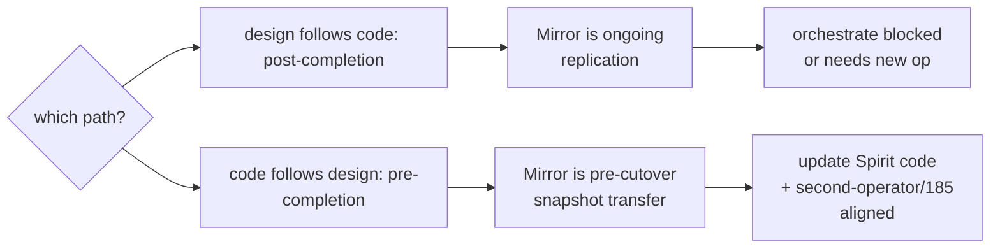

*Kind: Catalog · Topic: load-bearing problems with proposed solutions, current code, open psyche questions · Date: 2026-05-25 · Lane: designer (meta-report subagent C)*

# 335.3 · Problems / solutions / open questions

This file is the per-problem catalog for meta-report 335. Each entry shows symptom, the components touched, real current code (file path + line numbers), the proposed solution per the surfacing report or bead, the open psyche question(s), and a leverage rating. Multi-path choices get a small mermaid.

The reading set was reports `/333`, `/333-v2`, `/334-v2`, `/332`, operator `/176`, operator `/178`, second-operator `/185`, plus the open bead list (`bd list --status open --limit 0 --flat`). All file paths shown are absolute, never `/nix/store/HASH`.

## Problem 1 — Wire incompatibility between v0.1.0.1 and v0.1.1

**Symptom**. The two deployed `persona-spirit` daemon versions cannot exchange handover frames. v0.1.1's frame parser interprets v0.1.0.1's body bytes as the 8-byte `ShortHeader` prefix and then fails to decode the rest as the expected operation. The end-to-end Prometheus ceremony test only completed because the test driver hand-vendored v0.1.0.1-compatible wire types (`wire-types-v0101/`, 208 LoC) to bypass the upstream `signal_channel!([schema])` macro entirely (`/333-v2` §§2-3).

**Affected components / layers**. `persona-spirit` v0.1.0.1 (tag `v0.1.0.1`, commit `e7a1b184`), `signal-frame` (commits `653773b7` pre-ShortHeader vs `1493c59f` post-ShortHeader), the live two-daemon handover ceremony.

**Current code snippet** (the ShortHeader that v0.1.0.1 lacks):
```rust
// /git/github.com/LiGoldragon/signal-frame/src/frame.rs:10-39
pub const SHORT_HEADER_BYTE_COUNT: usize = 8;

// `u32 length` -> little-endian `ShortHeader` bytes -> archived frame body.
pub struct ShortHeader(u64);

impl ShortHeader {
    pub const fn to_le_bytes(self) -> [u8; SHORT_HEADER_BYTE_COUNT] { /* ... */ }
    pub const fn from_le_bytes(bytes: [u8; SHORT_HEADER_BYTE_COUNT]) -> Self { /* ... */ }
}
```
Built v0.1.1 prepends 8 bytes per outbound frame; built v0.1.0.1 does not — neither side bridges the gap.

**Proposed solution**. Bead `primary-602y` (P0): rebuild v0.1.0.1 retrofit against current signal-frame `1493c59f`. The body codec is unchanged so handler code compiles without modification. Re-tag (likely `v0.1.0.2`); re-pin `CriomOS-home`'s v0.1.0 deployment slot.

**Bead(s)**. `primary-602y` (open, P0).

**Open psyche questions**. None substantive — the fix is mechanical. Open psyche micro-decision: tag name (`v0.1.0.2` vs `v0.1.0.1-frame`). The bead description names `v0.1.0.2` as the lean.

**Leverage assessment**. HIGH. Unblocks every cross-version handover; without it, the live two-daemon ceremony in `/333` §8 cannot run. The brief-outage cutover (`/331`, `primary-0jjz`) still works because it's sequential — but every other upgrade plan depends on cross-version wire compat.

## Problem 2 — Mirror phase ordering: design says pre-completion, daemon says post-completion

**Symptom**. The design narrative in `/333` §8 + the sequence diagram in `/333` §6 place `Mirror` between `AskHandoverMarker`/`ReadyToHandover` (BEFORE readiness). The actual daemon code only accepts Mirror in `HandoverState::PrivateUpgradeOnly` (AFTER `HandoverCompleted`). The ceremony test confirmed: sending Mirror before Completion is rejected with `HandoverRejectionReason::NotReady` (`/333-v2` §4.1, witness `(PhaseMirrorRejectedAsExpected ... reason=NotReady)`).

**Affected components / layers**. `persona-spirit/src/actors/root.rs` Mirror handler, `signal-version-handover` Mirror semantics, the design contract in `/333` + second-designer `/175`.

**Current code snippet** (gating is daemon-side, not protocol-side):
```rust
// /git/github.com/LiGoldragon/persona-spirit/src/actors/root.rs:311-323
signal_version_handover::Operation::Mirror(payload) => {
    if !matches!(self.handover, HandoverState::PrivateUpgradeOnly) {
        Self::handover_rejected(
            payload.component,
            signal_version_handover::HandoverRejectionReason::NotReady,
        )
    } else if payload.target_version != crate::store::spirit_contract_version()
        || payload.kind.as_str() != MIRROR_KIND_STAMPED_ENTRY
    {
        Self::handover_rejected(
            payload.component,
            signal_version_handover::HandoverRejectionReason::SchemaMismatch,
        )
    } else { /* accept Mirror, decode payload, store entry */ }
}
```

**Proposed solution**. `/333-v2` §4.1 names two paths:
- (a) Update the design narrative to match the code — Mirror is post-completion, used for ongoing replication during the post-cutover drain window.
- (b) Update the code to match the design — let Mirror be accepted in `HandoverMode` state (before completion). This matches `orchestrate`'s need to transfer in-flight lane claims BEFORE the cutover instant.

Design lean: (b). The orchestrate use case (lane claims) needs pre-cutover Mirror.

**Bead(s)**. Not yet filed pending psyche direction.

**Open psyche questions**.
1. Which direction? — (a) design follows code, or (b) code follows design? `/333-v2` leans (b) for orchestrate's sake.
2. If (b): what state transition should Mirror trigger? Does receiving Mirror in `HandoverMode` advance to `PrivateUpgradeOnly`, or does it stay in `HandoverMode` until explicit `HandoverCompleted`?
3. Does Spirit's empty-payload Mirror change anything? (Spirit has no in-memory critical state, so the question only matters for orchestrate / future stateful components.)

**Leverage assessment**. MEDIUM. The Spirit cutover doesn't need it (empty Mirror payload). Orchestrate DOES need it (the second-operator/185 work landed `MirrorSnapshot` carrying StoredClaim + LaneRegistration as pre-cutover snapshot). Without resolution, orchestrate cutover is blocked.

**Decision tree**:


## Problem 3 — Divergence has wire round-trip but no semantics

**Symptom**. The `Divergence` operation round-trips: daemon ACKs with `DivergenceAcknowledged identifier=0`. No state transition. No abort logic. No supervisor notification. The "abort path" `/333` §8 named doesn't exist beyond the ACK (`/333-v2` §4.2).

**Affected components / layers**. `persona-spirit/src/actors/root.rs` Divergence handler, the supervisor's safety-net path.

**Current code snippet** (the entire Divergence handler today):
```rust
// /git/github.com/LiGoldragon/persona-spirit/src/actors/root.rs:361-368
signal_version_handover::Operation::Divergence(payload) => {
    signal_version_handover::Reply::DivergenceAcknowledged(
        signal_version_handover::DivergenceAcknowledgement {
            component: payload.component,
            divergence_identifier: 0,
        },
    )
}
```
The handler is six lines. It does nothing beyond reply construction.

**Proposed solution**. `/333-v2` §4.2 names: (a) transition `HandoverState` to `HandoverAborted` (new variant) on receiving Divergence; (b) optionally notify the supervisor via the upgrade socket reply; (c) keep serving public sockets if it's the old daemon (return to `Serving`), or exit cleanly if it's the new daemon.

**Bead(s)**. Not yet filed — `/333-v2` §7 item 3 lists as "operator bead candidate pending psyche direction".

**Open psyche questions**.
1. Should Divergence be a `HandoverAborted` terminal state, or a recoverable state?
2. Is `divergence_identifier=0` a placeholder, or does it carry a real semantic value once aborts have identifiers?
3. Does the OLD daemon resume serving public sockets on Divergence, or does it shut down? `/333-v2` leans "resume", but the daemon needs an explicit recovery state.

**Leverage assessment**. MEDIUM. Wire-only is technical debt that surfaces only when something actually diverges. The full ceremony test never triggered a real divergence; the probe just verified wire-level round-trip.

## Problem 4 — Recovery has wire round-trip + partial behaviour, but no orchestration

**Symptom**. `RecoverFromFailure` round-trips. v0.1.0.1 always returns `recovered=false`. v0.1.1 has a partial state transition (`HandoverMode → Active`) but no supervisor coordination, no public-socket reopening flow (`/333-v2` §4.3, witness `(RecoveryCompleted ... recovered=false)`).

**Affected components / layers**. `persona-spirit/src/actors/root.rs` Recovery handler, supervisor's mid-cutover-crash safety net.

**Current code snippet** (the current Recovery handler):
```rust
// /git/github.com/LiGoldragon/persona-spirit/src/actors/root.rs:369-384
signal_version_handover::Operation::RecoverFromFailure(request) => {
    let recovered = match self.handover {
        HandoverState::Active => true,
        HandoverState::HandoverMode { .. } => {
            self.handover = HandoverState::Active;
            true
        }
        HandoverState::PrivateUpgradeOnly => false,
    };
    signal_version_handover::Reply::RecoveryCompleted(
        signal_version_handover::RecoveryResult {
            component: request.component,
            recovered,
        },
    )
}
```
The handler transitions HandoverMode → Active but never re-opens public sockets, never notifies supervisor.

**Proposed solution**. Same shape as Divergence (`/333-v2` §4.3): expand the state machine with explicit recovery paths, coordinate with supervisor via upgrade socket reply, re-open public sockets on the old-daemon side.

**Bead(s)**. Not yet filed (same status as Divergence).

**Open psyche questions**.
1. From `PrivateUpgradeOnly`, can the daemon ever recover? Today it returns `false` — does that mean "no recovery from this state" or "recovery is the new daemon's job"?
2. Should Recovery be split into supervisor-initiated (mid-cutover crash) vs daemon-initiated (self-detected failure)?
3. Public-socket reopening — is that the daemon's job on Recovery, or the supervisor's job?

**Leverage assessment**. MEDIUM. Same shape as Problem 3.

## Problem 5 — `nota-codec` lacks `NotaValue` tree-parser + per-token spans

**Symptom**. `nota-codec` exposes only a streaming `Decoder` (good for fixed-shape signals) and a `Lexer` returning `Token` without byte offsets. Every NOTA consumer that needs structured data (schema, sema records, intent records, lock files) has to build its own tree-on-top-of-stream + position tracking. The multi-pass subagent built ~200 LoC of tree-parser + ~80 LoC of position tracking ON TOP of the existing lexer (`/334-v2` §3.2, §4 Q4).

**Affected components / layers**. `nota-codec/src/lexer.rs`, `nota-codec/src/lib.rs`, downstream NOTA-reading clients (schema crate's parser.rs, sema-engine, intent log, etc.).

**Current code snippet** (no span, no NotaValue):
```rust
// /git/github.com/LiGoldragon/nota-codec/src/lexer.rs:23-58
pub enum Token {
    LParen, RParen, LBracket, RBracket, LBrace, RBrace, Colon,
    Int(i128),
    UInt(u128),
    Float(f64),
    Str(String),
    Bytes(Vec<u8>),
    DateLiteral { year: u16, month: u8, day: u8 },
    TimeLiteral { hour: u8, minute: u8, second: u8 },
    Ident(String),
}
```
A grep for `NotaValue\|parse_str\|parse_stream` in `nota-codec/src/lib.rs` returns zero matches — confirmed missing.

**Proposed solution**. `/334-v2` §8 item 1: expose `nota_codec::NotaValue` enum + `parse_str(text) -> NotaValue` (or `parse_stream(tokens) -> NotaValue`) + `Lexer::next_token_with_span`. ~200-300 LoC + tests. Every NOTA-reading client benefits.

**Bead(s)**. Not yet filed as a discrete bead. Tracked under spirit record 549 (multi-pass NOTA-first decision).

**Open psyche questions** (per `/334-v2` §7):
1. Should `nota-codec` expose `NotaValue` tree or stay streaming-only? Lean: add tree as separate module, keep streaming decoder.
2. Should `Lexer::next_token_with_span` replace `next_token` or coexist? Lean: replace.
3. Should the schema crate's `parser.rs` get rewritten to use the multi-pass module, or merged as alternative entry? Lean: rewrite to single canonical reader.

**Leverage assessment**. HIGH. Foundation work — every other NOTA consumer benefits. Without it, the schema crate's 545-LoC `parser.rs` duplicates work that belongs in `nota-codec`. Also blocks self-hosting meta-schema (`/334` §5).

## Problem 6 — `signal-frame-macros` parallel parser deviation (largely closed on main, mockups remain)

**Symptom**. The 1700-LoC parallel parser `/334` flagged as a major remedy is mostly already an adapter on `main`. The 574-LoC `schema_reader.rs` adapter delegates to the `schema` crate (`schema::LoadedSchema::read_path`). The 1732-LoC mockup branch (`designer-327-mockup-3-dispatch`) still uses retired `(Path …)` forms but is mockup-only — gets garbage-collected with the mockup (`/334-v2` §4 Q7, §5).

**Affected components / layers**. `signal-frame/macros/src/schema_reader.rs` (main, the adapter), `signal-frame-worktrees/designer-327-mockup-3-dispatch/macros/src/schema_reader.rs` (the mockup with retired forms).

**Current code snippet** (the adapter, not a parallel parser):
```rust
// /git/github.com/LiGoldragon/signal-frame/macros/src/schema_reader.rs:23-34
pub(crate) fn read_default_schema() -> syn::Result<ChannelSpec> {
    let manifest = std::env::var("CARGO_MANIFEST_DIR").map_err(|error| {
        syn::Error::new(
            Span::call_site(),
            format!("cannot read CARGO_MANIFEST_DIR for schema file: {error}"),
        )
    })?;
    let root = PathBuf::from(manifest);
    let path = default_schema_path(&root);
    let loaded = LoadedSchema::read_path(&path).map_err(|error| schema_error(&path, error))?;
    SchemaConverter::new(&loaded).into_channel_spec()
}
```
This delegates to `schema::LoadedSchema::read_path` — not a separate parser. Total file is 590 LoC.

**Proposed solution**. `/334-v2` §5 item 2: once `nota-codec::NotaValue` exists, collapse `schema/src/parser.rs` (545 LoC) onto the multi-pass module (~200 LoC). The adapter stays; only the upstream `schema` crate's internal parser gets refactored.

**Bead(s)**. Not yet filed as discrete bead. Implicit in spirit record 549.

**Open psyche questions**. Whether to delete the mockup branches outright vs let them naturally GC — mostly mechanical.

**Leverage assessment**. LOW (now). The fear in `/334` §6 was unwarranted — main is fine. Only the mockup branches carry the deviation and they're being GC'd.

## Problem 7 — Schema-derived migration not implemented; hand-written V010ToV011 still load-bearing

**Symptom**. Spirit's v0.1.0 → v0.1.1 migration is hand-written: `historical` mod (rkyv reproduction of v0.1.0 types) + `current_shape` mod with explicit `From` impls (`/332` §5). `MigrationCatalogue::prototype()` hardcodes a vector of one migration module. Zero code reads `.schema` files for migration logic.

**Affected components / layers**. `upgrade/src/catalogue.rs`, `upgrade/src/migrations/persona_spirit/version_0_1_0_to_0_1_1.rs`, `signal-version-handover/src/lib.rs` (all hand-written records).

**Current code snippet** (hand-written `From` chain):
```rust
// /git/github.com/LiGoldragon/upgrade/src/migrations/persona_spirit/version_0_1_0_to_0_1_1.rs:278-313
impl From<historical::Entry> for Entry {
    fn from(entry: historical::Entry) -> Self {
        let source = v010::Entry {
            topic: v010::Topic::new(entry.topic.as_str()),
            kind: v010::Kind::from(entry.kind),
            summary: v010::Summary::new(entry.summary.as_str()),
            context: v010::Context::new(entry.context.as_str()),
            certainty: v010::Certainty::from(entry.certainty),
            quote: v010::Quote::new(entry.quote.as_str()),
        };
        <V010ToV011 as VersionProjection<v010::Entry, Entry>>::project(source)
            .expect("Spirit v0.1.0 entry projection to v0.1.1 is total")
    }
}

impl From<historical::Kind> for v010::Kind {
    fn from(kind: historical::Kind) -> Self {
        match kind {
            historical::Kind::Decision => Self::Decision,
            historical::Kind::Principle => Self::Principle,
            historical::Kind::Correction => Self::Correction,
            historical::Kind::Clarification => Self::Clarification,
            historical::Kind::Constraint => Self::Constraint,
        }
    }
}
```
Six `From` impls per Spirit's domain types. Each contract that ever has a v0.1 → v0.2 upgrade will repeat this cost.

**Proposed solution**. `/332` §8 item 2 + operator `/176` §"Highest-Value Next Work" item 2:
1. Land `UpgradeRule` as `BuiltinSchemaMacro` variant — DONE (bead `primary-cklr` closed, schema commit `be6860fb`).
2. Schema-diff-driven `VersionProjection` generation — NOT IMPLEMENTED. The schema engine needs to diff `v0.1.0.schema` vs `v0.1.1.schema` and emit identity projections + named conversions.

**Bead(s)**. `primary-cklr` (closed, schema model landed); the projection-emission gap has no discrete bead yet — folded under epic `primary-ezqx.1` (MVP schema-language pilot).

**Open psyche questions**.
1. Does the schema engine emit the `historical` mod from the OLD schema, or expect users to keep older schemas around as separate crates?
2. How are named conversions (`Certainty → Magnitude`) specified in the schema language? Inline upgrade-rule directive, or separate `.upgrade.schema` file?
3. Is the projection generation in-band with `signal_channel!([schema])` or a separate `schema_upgrade!` macro?

**Leverage assessment**. HIGH. Every future component upgrade either pays the hand-written cost OR depends on this landing.

## Problem 8 — Brilliant macro library `proc_macro` doesn't emit storage descriptors or VersionProjection

**Symptom**. The schema crate is a runtime library that assembles `AssembledSchema` (`/332` §3). It is NOT a `proc_macro` that takes a `.schema` and emits Rust code. The `signal_channel!([schema])` macro emits Operation/Reply/Event enums + dispatch trait + LogVariant + codecs. It does NOT emit storage descriptors or VersionProjection impls. Grep `signal-frame/macros/src/emit.rs` for `VersionProjection` returns zero matches.

**Affected components / layers**. `schema` crate (library only, not proc_macro), `signal-frame/macros` (proc_macro but limited variant coverage), every future schema-derived storage / migration use case.

**Current code snippet** (what emit.rs DOES emit — channel structure, no storage/projection):
```rust
// /git/github.com/LiGoldragon/signal-frame/macros/src/emit.rs:725-730
pub fn kind_from_short_header(
    short_header: ::signal_frame::ShortHeader,
) -> Option<RequestKind> {
    match short_header.to_le_bytes()[0] {
        // ... per-variant byte mapping ...
    }
}
```
The emission covers ChannelSpec → Operation/Reply enums + LogVariant + ShortHeader projection — not storage, not migration.

**Proposed solution**. `/332` §8 item 3 + `/176` §"Highest-Value Next Work" item 3: wire the `schema` crate as a `proc_macro` that emits (a) storage descriptors (table definitions, key/value types), (b) VersionProjection impls from schema-diff. Operator territory; multi-day work. Tracked under epic `primary-ezqx.1`.

**Bead(s)**. `primary-ezqx.1` (open, P1).

**Open psyche questions**.
1. Does the proc_macro live in `schema-macros` (new crate) or extend `signal-frame/macros`?
2. Storage descriptors emit redb table definitions? Other backends? Or just typed accessors?
3. Should the storage-descriptor emission be opt-in via a schema-side directive (e.g., `(Storage ...)` macro variant) or implicit per type?

**Leverage assessment**. HIGH. This is the gate from "schema is a library" to "schema is a code generator". Once landed, the 75+ concept schemas can all become live.

## Problem 9 — Receive-side ShortHeader dispatch is post-decode validation, not pre-decode triage

**Symptom**. The daemon DOES use ShortHeader, but as POST-decode VALIDATION (compare expected byte 0 to actual operation kind after decoding the full body). Operator `/176` §"Highest-Value Next Work" item 1 names the gap: PRE-decode TRIAGE — peek the header, classify the root, call generated dispatch before decoding the full body.

**Affected components / layers**. `persona-spirit/src/daemon.rs:382-400`, `signal-frame/macros/src/emit.rs:725-730`, the daemon ingress path.

**Current code snippet** (post-decode validation):
```rust
// /git/github.com/LiGoldragon/persona-spirit/src/daemon.rs:380-400
fn validate_request_header(
    &self,
    short_header: ShortHeader,
    request: &signal_frame::Request<WorkingOperation>,
) -> Result<()> {
    let expected = short_header.to_le_bytes()[0];
    let expected_kind =
        WorkingOperation::kind_from_short_header(short_header).ok_or_else(|| {
            Error::signal_frame(OperationDispatchError::UnknownOperationRoot { root: expected })
        })?;
    let actual_kind = request.payloads().head().kind();
    if actual_kind != expected_kind {
        return Err(Error::signal_frame(
            OperationDispatchError::HeaderOperationMismatch {
                expected,
                actual: actual_kind as u8,
            },
        ));
    }
    Ok(())
}
```
The body is already decoded (`request.payloads().head().kind()`) before the header is checked. The "peek-then-decode" path doesn't exist.

**Proposed solution**. `/176` §"Highest-Value Next Work" item 1: a shared signal-frame server/ingress helper that peeks the ShortHeader before body decode, classifies the root, calls generated dispatch.

**Bead(s)**. Implicit in `primary-3cl1` (frame_micro projection emit) + `primary-bann` (tap point on accept) which both touch the ingress path.

**Open psyche questions**.
1. Does the pre-decode triage live in `signal-frame` (shared) or per-daemon (each component implements)?
2. Should triage make routing decisions (e.g., route different roots to different actor pools) or just early-reject unknown roots?

**Leverage assessment**. MEDIUM. The current post-decode validation works but doesn't realize the ShortHeader's design value (cheap early classification). Becomes high-leverage once defense-in-depth socket validation (`primary-9dce`) or per-section actor routing (`primary-muu2`) lands.

## Problem 10 — `owner-signal-persona-spirit` still hand-written; not schema-derived

**Symptom**. The ordinary `signal-persona-spirit` consumes `spirit.schema` via `signal_channel!([schema])`. The owner contract `owner-signal-persona-spirit` is still a hand-written `signal_channel!` body — operations declared inline, no schema file consumed (`/176` §"Coverage Matrix").

**Affected components / layers**. `owner-signal-persona-spirit/src/lib.rs`, `owner-signal-persona-spirit/schema/owner-signal-persona-spirit.concept.schema` (an inert marker).

**Current code snippet** (hand-written signal_channel for owner):
```rust
// /git/github.com/LiGoldragon/owner-signal-persona-spirit/src/lib.rs:104-119
signal_channel! {
    channel Owner {
        operation Start(Start),
        operation Drain(Drain),
        operation Reload(BootstrapPolicy),
        operation Register(Registration),
        operation Retire(Retirement),
    }
    reply Reply {
        Started(Started),
        DrainedAndStopped(DrainedAndStopped),
        BootstrapPolicyReloaded(BootstrapPolicyReloaded),
        IdentityRegistered(IdentityRegistered),
        IdentityRetired(IdentityRetired),
        RequestUnimplemented(RequestUnimplemented),
    }
```
Five operations declared by hand. Compare the ordinary signal at `signal-persona-spirit/src/lib.rs:435` which is just `signal_channel!([schema])`.

**Proposed solution**. Replicate the spirit-ordinary pilot pattern for the owner contract: author `owner-spirit.schema` (concept schema becomes live), invoke `signal_channel!([schema])`. The schema-engine handles owner contracts the same as ordinary contracts — no new variant needed (the existing Header/Type/Feature variants cover the shape).

**Bead(s)**. Not yet filed as a discrete bead. Implicit under `primary-ekxx` (signal-version-handover second pilot) — pilot promotion pattern repeats for owner.

**Open psyche questions**.
1. Is owner-signal promotion the next pilot after `signal-version-handover`, or does another contract come first?
2. Does owner-signal have a distinct schema syntax (Leg::Owner vs Leg::Ordinary already in `schema::Leg`) or share?

**Leverage assessment**. MEDIUM. The 75 concept schemas need this pattern proven on multiple contracts. Owner-spirit is a small, well-bounded second pilot.

## Problem 11 — Production persona-daemon supervisor doesn't exist; only stub exists in test

**Symptom**. The 408-LoC `persona-daemon-stub` built INSIDE the ceremony test forks v0.1.0.1 + v0.1.1 daemons, waits for sockets, drives the full happy-path ceremony, reaps children (`/333-v2` §6 item 1). Production has nothing of the kind. `persona/src/supervisor.rs` (the `EngineSupervisor`) is the closest, but it doesn't do dual-version fork + selector-flip.

**Affected components / layers**. `persona/src/supervisor.rs`, `persona/src/manager.rs`, the production cutover surface, `CriomOS-home/modules/home/profiles/min/spirit.nix` (the current manual selector).

**Current code snippet** (current EngineSupervisor — supervises ONE component lifecycle, not dual-version cutover):
```rust
// /git/github.com/LiGoldragon/persona/src/supervisor.rs:30-68 (abbreviated)
pub struct EngineSupervisor {
    /* ... */
}

impl EngineSupervisor {
    pub fn new(input: EngineSupervisorInput) -> Self { /* ... */ }

    pub fn start(input: EngineSupervisorInput) -> ActorRef<Self> { /* ... */ }

    // Single-component prepare + supervise; no dual-version awareness
    pub fn prepare_layout(/* ... */) -> Result<PrototypeSupervisionReport, EngineSupervisorFailure>
}
```
The closest production code does single-component lifecycle. The dual-version-fork + drive-ceremony logic from the stub doesn't exist in production.

**Proposed solution**. Bead `primary-a5hu` (epic) → sub-beads `primary-a5hu.2` (supervision + lifecycle) + `primary-a5hu.3` (upgrade orchestration: HandoverDriver, active-version selector, recovery). The stub's choreography IS the concrete spec (`/333-v2` §6 item 1).

**Bead(s)**. `primary-a5hu` (open epic), `primary-a5hu.2`, `primary-a5hu.3`, `primary-nobf` (= a5hu.2), `primary-q98d` (= a5hu.3).

**Open psyche questions**.
1. Does `persona-daemon` supervise multiple components (Spirit + orchestrate + others) from one process, or one-supervisor-per-component?
2. Where does the active-version selector live — in `persona-daemon`'s redb, or in a shared location?
3. Selector-flip ordering: does selector flip BEFORE or AFTER `HandoverCompleted`?

**Leverage assessment**. HIGH. Without a production persona-daemon, every component upgrade requires manual home-manager intervention. Selector-flip is the missing keystone — see Problem 12.

## Problem 12 — Selector flip is manual via `currentDefault`; supervisor-driven flip doesn't exist

**Symptom**. The active version selector is `criomosHome.personaSpirit.currentDefault` in Nix. Flipping it requires editing `CriomOS-home`, rebuilding, activating via `lojix-cli`. There is no API for `persona-daemon` (or supervisor) to flip the selector in-process.

**Affected components / layers**. `CriomOS-home/modules/home/profiles/min/spirit.nix`, the deployment activation path.

**Current code snippet** (the manual selector):
```nix
# /git/github.com/LiGoldragon/CriomOS-home/modules/home/profiles/min/spirit.nix:108-119
deployments = genAttrs deployedVersions makeDeployment;

selectedDeployment =
  if builtins.elem currentDefault deployedVersions then
    deployments.${currentDefault}
  else
    throw "criomosHome.personaSpirit.currentDefault must be listed in deployedVersions";

defaultCommandLine = pkgs.runCommand "spirit-current-${sanitizeVersion currentDefault}" { } ''
  mkdir -p "$out/bin"
  ln -s "${selectedDeployment.commandLineWrapper}/bin/${selectedDeployment.wrapperName}" "$out/bin/spirit"
'';
```
`currentDefault` is set in user configuration (default `"v0.1.0"`); flipping it is a Nix-rebuild, not a runtime operation.

**Proposed solution**. Per spirit records 208/209/210 (cited in `primary-a5hu`): selector lives in `persona-daemon`'s manager redb; `persona-daemon` flips after `HandoverCompleted`; `CriomOS-home` only redeploys when persona-daemon itself updates. The brief-outage cutover plan (`primary-0jjz` / `/331`) is the MVP form — flip via systemctl restart sequence, no in-process flip needed yet.

**Bead(s)**. `primary-a5hu.3`, `primary-q98d`, `primary-0jjz` (brief-outage cutover).

**Open psyche questions**.
1. Where exactly does the active-version selector store live? Bead description says "persona engine's redb" but the exact table/key isn't specified.
2. Does the supervisor write the selector eagerly (during prepare) or lazily (post-completion)?
3. What's the rollback path — supervisor reverts the selector if next daemon fails?

**Leverage assessment**. HIGH. Tied to Problem 11. The current manual selector is fine for the FIRST cutover (`primary-0jjz`); every subsequent cutover needs the in-process flip.

## Problem 13 — `(field-name TypeExpression)` schema override syntax (CLOSED, but discipline note remains)

**Symptom** (historical). The schema parser auto-derived field names from type names, producing `handover_rejection_reason: HandoverRejectionReason` (carries full ancestry). Violated the ESSENCE.md naming rule. Spirit had hard-coded per-field overrides at `emit.rs:680-695`.

**Status**. Bead `primary-zfxx` CLOSED 2026-05-25 (schema commit `ddf71ce7`). Parser now accepts `(fieldName Type)` overrides; records carry `Field` entries with optional `FieldName`.

**Current code snippet** (the override path now in parser):
```rust
// /git/github.com/LiGoldragon/schema/src/parser.rs:206-219
fn parse_named_or_container_field(&mut self) -> Result<Field> {
    self.expect_record_start("field")?;
    let head = self.read_field_or_container_head()?;
    if is_container_head(&head) {
        let expression = self.parse_container_expression_after_head(&head)?;
        self.expect_record_end("field")?;
        return Ok(Field::inferred(expression));
    }

    let name = FieldName::new(head)?;
    let expression = self.parse_type_expression()?;
    self.expect_record_end("field")?;
    Ok(Field::named(name, expression))
}
```

**Bead(s)**. `primary-zfxx` (closed).

**Open psyche questions**. None — closed. But discipline note: every new schema author must now USE the override syntax to avoid ancestry-carrying field names. Concept schema reviewers should flag this.

**Leverage assessment**. HIGH (historical) — without the fix, every new schema-derived contract had to choose between hand-renaming fields (violates ancestry rule) OR keeping hand-written types (defeats the pilot).

## Problem 14 — `bool` alias for `Boolean` (CLOSED)

**Symptom** (historical). Schema parser accepted `Boolean` as primitive but rejected `bool`. Lowering emitted `bool` as Rust type — spelling mismatch broke round-trip.

**Status**. Bead `primary-xina` CLOSED 2026-05-25 (schema commit `ddf71ce7`). Parser primitive table accepts `bool` as alias.

**Current code snippet** (the fix):
```rust
// /git/github.com/LiGoldragon/schema/src/parser.rs:518
"Boolean" | "bool" => Primitive::Boolean,
```

**Bead(s)**. `primary-xina` (closed).

**Open psyche questions**. None — closed.

**Leverage assessment**. LOW (historical) — 15-minute fix, P0 because every new schema author hit it once.

## Problem 15 — Schema-diff-driven `UpgradeRule` lowering: model landed, emission missing

**Symptom**. `UpgradeRule` exists as `BuiltinMacroVariant` and `NodeDefinitionPoint::UpgradeRule` in `schema/src/engine.rs`. But there is no proc_macro that consumes `UpgradeRule` entries from `AssembledSchema` and emits `From`-chain projection Rust code (Problem 7's gap).

**Affected components / layers**. `schema/src/engine.rs` (variant landed), `schema/src/upgrade.rs` (lowerer landed), `signal-frame/macros/src/emit.rs` (no emission consumer).

**Current code snippet** (UpgradeRule variant landed):
```rust
// /git/github.com/LiGoldragon/schema/src/engine.rs:6-44
#[derive(Clone, Copy, Debug, PartialEq, Eq, Hash)]
pub enum NodeDefinitionPoint {
    ImportMapValue,
    HeaderRoot,
    NamespaceValue,
    FeatureItem,
    UpgradeRule,
}

#[derive(Clone, Debug, PartialEq, Eq)]
pub enum BuiltinMacroVariant {
    Import(ImportInput),
    Header(HeaderInput),
    Type(TypeInput),
    Feature(FeatureInput),
    UpgradeRule(UpgradeRuleInput),
}

impl BuiltinMacroVariant {
    pub fn lower(self, context: &mut LoweringContext) -> Result<()> {
        match self {
            Self::Import(input) => ImportMacro.lower(input, context),
            Self::Header(input) => HeaderMacro.lower(input, context),
            Self::Type(input) => TypeMacro.lower(input, context),
            Self::Feature(input) => FeatureMacro.lower(input, context),
            Self::UpgradeRule(input) => UpgradeRuleMacro.lower(input, context),
        }
    }
}
```
The model is complete. No `signal-frame/macros/src/emit.rs` consumer emits `From` impls from `AssembledFragment::UpgradeRule`. Grep for `UpgradeRule` in emit.rs returns zero matches.

**Proposed solution**. `/332` §8 item 2 said "extend BuiltinMacroVariant + add UpgradeInput + lowerer that pushes AssembledFragment::UpgradeRule entries" — DONE. The next step is wiring a proc_macro consumer for `UpgradeRule` AssembledFragment entries that emits the From impls (Problem 7's `schema-diff-driven migration` work).

**Bead(s)**. `primary-cklr` (closed — model only), `primary-ezqx.1` (open — emission consumer).

**Open psyche questions**. Captured under Problem 7.

**Leverage assessment**. MEDIUM. The model is necessary but not sufficient; the emission consumer is the load-bearing missing piece.

## Problem 16 — Intent log retire/supersede operation not in deployed Spirit wire shape

**Symptom**. The Spirit ordinary signal (`spirit.schema`) exposes `State`, `Record`, `Observe`, `Watch`, `Unwatch` operations. It does NOT expose `Retire` or `Supersede` for intent records. The intent-maintenance discipline (`skills/intent-maintenance.md`:144-145) names supersession as "a typed relation (`Supersedes` linking two `Authorial<Kind>` memories); Spirit records retire in favor of …" — but the wire shape has no operation for it.

**Affected components / layers**. `signal-persona-spirit/spirit.schema`, `persona-spirit/src/actors/root.rs` (operation dispatch), Spirit CLI surface.

**Current code snippet** (Spirit ordinary operations from schema — no Retire/Supersede):
```nota
# /git/github.com/LiGoldragon/signal-persona-spirit/spirit.schema:6-12
[
  (State [Statement])
  (Record [Entry])
  (Observe [Observation])
  (Watch [Subscription])
  (Unwatch [SubscriptionToken])
]
```
Five operations. `Retire`/`Supersede` are absent.

**Note**. `Retire` DOES exist on `owner-signal-persona-spirit` — but it retires an `Identity` (a registered owner identity name), not an intent record. That's a different concept entirely. The `persona-spirit/schema/persona-spirit.concept.schema` does mention `Retire [Retirement]` and `Retirement (Text)` and `Status [Concept Active Retired]` — but the concept schema is inert (no code reads it).

**Proposed solution**. Add `(Retire [Retirement])` (or `(Supersede [Supersession])`) operation to `spirit.schema` ordinary header. Author the Retirement / Supersession types as records carrying `(target RecordIdentifier)` + optional `(replacement RecordIdentifier)`. Spirit's store gains a status column or a Retired/Superseded relation. The `signal_channel!([schema])` macro generates the new variant automatically; the daemon's operation dispatch gains a new arm.

**Bead(s)**. Not yet filed. Forward-prompt rule says I cannot capture intent through Spirit — but this needs psyche to confirm scope before filing.

**Open psyche questions**.
1. Is Retire DESTRUCTIVE (the record vanishes from `Observe` results) or just RE-LABELED (still observable, with status `Retired`)? Spirit's persona-spirit.concept.schema lines suggest re-labeled.
2. Is Supersede a separate operation from Retire, or is supersession a Retire-with-replacement? The concept schema doesn't distinguish; intent-maintenance.md uses "typed relation (`Supersedes`)" suggesting separate.
3. Does Retire/Supersede emit an Event (similar to `RecordCaptured`) so subscribers see the change?
4. Authority — is Retire on the ordinary signal (author-only by content) or owner signal (admin-tagged)?

**Leverage assessment**. MEDIUM. The agent intent-log workflow (`skills/intent-log.md`) needs this to actually MAINTAIN intent over time — currently records are append-only. Without retire/supersede, the intent log accumulates indefinitely (Problem visible in long-running sessions). Bead/feature priority depends on user-visible pain.

## §Final — Top 5 problems by leverage

Ranked by "which problem's solution unblocks the most other work":

1. **Problem 1 — Wire incompatibility v0.1.0.1 ↔ v0.1.1** (`primary-602y` P0). Mechanical fix; unblocks EVERY cross-version handover plan. No other problem can land its full value without this. The bead-description's "half-day operator slice" rates this as cheap-high-value.

2. **Problem 5 — `nota-codec` lacks NotaValue tree + spans**. Foundation work; every NOTA-reading client benefits. Unblocks schema-engine refactor (Problem 6 collapses cleanly), self-hosting meta-schema, intent-log consumption, sema record decode. Most "schema reader is messier than it should be" friction traces here.

3. **Problem 8 — Brilliant macro library proc_macro for storage / VersionProjection** (`primary-ezqx.1`). Gates the 75 concept schemas from "inert markers" to "live wire shapes". Once it lands, schema-derived migration (Problem 7) follows mechanically and every contract promotion (Problems 10, owner-signal etc.) gets cheap.

4. **Problem 11 — Persona-daemon supervisor** (`primary-a5hu` epic). The 408-LoC stub IS the concrete spec. Without production supervisor, every upgrade requires manual home-manager intervention. Unblocks Problem 12 (selector-flip) automatically — same surface.

5. **Problem 7 — Schema-derived migration / VersionProjection from schema-diff**. Tied to Problem 8 but distinct: even with the proc_macro infrastructure, the schema-diff lowering logic is its own design problem (which fields are identity vs renamed vs converted; how named conversions are specified in the schema language; whether the older schema lives in the same repo or separately).

Honourable mention: **Problem 2 — Mirror phase ordering** has medium leverage because it's load-bearing for orchestrate but not for Spirit (Spirit has empty Mirror). The decision is small but blocks second-operator/185's full landing.

## §Open psyche questions consolidated (deduplicated)

Across all 16 problems, the open psyche questions cluster:

### Architecture decisions

1. **Mirror phase ordering** (Problem 2): pre-completion (design) or post-completion (code)?
2. **Divergence semantics** (Problem 3): what state does Divergence land in? Is `divergence_identifier=0` a placeholder?
3. **Recovery from PrivateUpgradeOnly** (Problem 4): impossible, or new-daemon-driven?
4. **Recovery split** (Problem 4): supervisor-initiated vs daemon-initiated?
5. **Pre-decode ShortHeader triage location** (Problem 9): shared in signal-frame, or per-daemon?
6. **Pre-decode triage scope** (Problem 9): routing decisions, or early-reject only?

### Schema engine + macro

7. **NotaValue tree vs streaming** (Problem 5): tree as separate module, or unify?
8. **Lexer span: replace vs coexist** (Problem 5): rename `next_token` → `next_token_with_span`?
9. **schema/parser.rs rewrite vs alternative entry** (Problem 5): single canonical reader or two paths?
10. **proc_macro home** (Problem 8): new `schema-macros` crate or extend `signal-frame/macros`?
11. **Storage descriptor target** (Problem 8): redb tables, other backends, or just typed accessors?
12. **Storage opt-in** (Problem 8): explicit `(Storage ...)` schema directive, or implicit per type?

### Migration / upgrade

13. **Historical schema location** (Problem 7): emit `historical` mod from old schema, or expect users to keep older schemas as separate crates?
14. **Named conversion spec** (Problem 7): inline upgrade-rule directive, or separate `.upgrade.schema` file?
15. **Projection emission entry point** (Problem 7): in-band with `signal_channel!([schema])` or separate `schema_upgrade!` macro?

### Persona-daemon / supervisor

16. **Multi-component supervisor** (Problem 11): one process or one-per-component?
17. **Active-version selector home** (Problem 11): persona-daemon redb, or shared location?
18. **Selector-flip ordering** (Problem 11): before or after `HandoverCompleted`?
19. **Selector table/key spec** (Problem 12): specific redb shape not yet specified.
20. **Selector write eagerness** (Problem 12): eager during prepare, or lazy post-completion?
21. **Rollback path** (Problem 12): supervisor reverts selector on next-daemon failure?

### Contract promotion

22. **Next pilot ordering** (Problem 10): owner-spirit, signal-version-handover, orchestrate, or some other?
23. **Owner-leg schema distinct from ordinary** (Problem 10): `Leg::Owner` already exists in `schema::Leg` — does owner contract need separate schema-syntax conventions?

### Intent log

24. **Retire vs Re-label** (Problem 16): destructive removal or status-change?
25. **Retire vs Supersede separation** (Problem 16): one operation with replacement, or two operations?
26. **Retire emits Event** (Problem 16): subscribers see the change?
27. **Retire authority** (Problem 16): ordinary (author-only) or owner (admin)?

Twenty-seven open psyche questions across architecture, schema, migration, supervisor, contracts, and intent-log surfaces. The clusters suggest the most fertile psyche-prompt would be one architectural session covering Mirror/Divergence/Recovery semantics (Problems 2-4, six questions) and one covering supervisor + selector (Problems 11-12, six questions).

## §References

- `/home/li/primary/reports/designer/333-upgrade-mechanism-full-design-explained.md` — design vision
- `/home/li/primary/reports/designer/333-v2-upgrade-mechanism-corrections-from-real-world-test.md` — wire-compat + semantic gaps from ceremony test
- `/home/li/primary/reports/designer/334-multi-pass-nota-first-schema-reader.md` — original schema reader design
- `/home/li/primary/reports/designer/334-v2-multi-pass-nota-first-schema-reader.md` — schema reader corrections
- `/home/li/primary/reports/designer/332-schema-macro-coverage-audit.md` — coverage gaps audit
- `/home/li/primary/reports/operator/176-schema-macro-upgrade-integration-audit/5-overview.md` — operator's matching audit
- `/home/li/primary/reports/operator/178-primary-wdl6-spirit-v0-1-0-protocol-build-2026-05-25.md` — v0.1.0.1 retrofit landing
- `/home/li/primary/reports/second-operator/185-orchestrate-mirror-handover-implementation-2026-05-25.md` — orchestrate Mirror landing
- `/git/github.com/LiGoldragon/persona-spirit/src/actors/root.rs:88-388` — handover state machine + Mirror/Divergence/Recovery handlers
- `/git/github.com/LiGoldragon/persona-spirit/src/daemon.rs:365-400` — ShortHeader post-decode validation
- `/git/github.com/LiGoldragon/signal-frame/src/frame.rs:10-217` — ShortHeader definitions
- `/git/github.com/LiGoldragon/signal-frame/macros/src/schema_reader.rs:1-89` — 590-LoC adapter (not 1700 LoC)
- `/git/github.com/LiGoldragon/schema/src/engine.rs:6-44` — 5-variant BuiltinMacroVariant + 5 NodeDefinitionPoint
- `/git/github.com/LiGoldragon/schema/src/parser.rs:206-219` — field-name override (closed `primary-zfxx`)
- `/git/github.com/LiGoldragon/schema/src/parser.rs:518` — bool alias (closed `primary-xina`)
- `/git/github.com/LiGoldragon/nota-codec/src/lexer.rs:23-58` — Token enum, no span
- `/git/github.com/LiGoldragon/upgrade/src/catalogue.rs:158-162` — hardcoded `MigrationCatalogue::prototype()`
- `/git/github.com/LiGoldragon/upgrade/src/migrations/persona_spirit/version_0_1_0_to_0_1_1.rs:278-313` — hand-written V010ToV011 From chain
- `/git/github.com/LiGoldragon/CriomOS-home/modules/home/profiles/min/spirit.nix:108-152` — manual `currentDefault` selector
- `/git/github.com/LiGoldragon/owner-signal-persona-spirit/src/lib.rs:104-119` — hand-written owner signal_channel
- `/git/github.com/LiGoldragon/signal-persona-spirit/spirit.schema:6-12` — Spirit ordinary operations (no Retire/Supersede)
- `/git/github.com/LiGoldragon/persona/src/supervisor.rs:30-68` — current single-component EngineSupervisor
- Open beads: `primary-602y` (P0 wire-compat), `primary-a5hu` (epic supervisor), `primary-a5hu.2`, `primary-a5hu.3`, `primary-nobf`, `primary-q98d`, `primary-ezqx.1` (schema proc_macro), `primary-0jjz` (brief-outage cutover), `primary-ekxx` (signal-version-handover pilot)
- Closed beads referenced: `primary-zfxx` (field-name override), `primary-xina` (bool alias), `primary-cklr` (UpgradeRule variant model)
