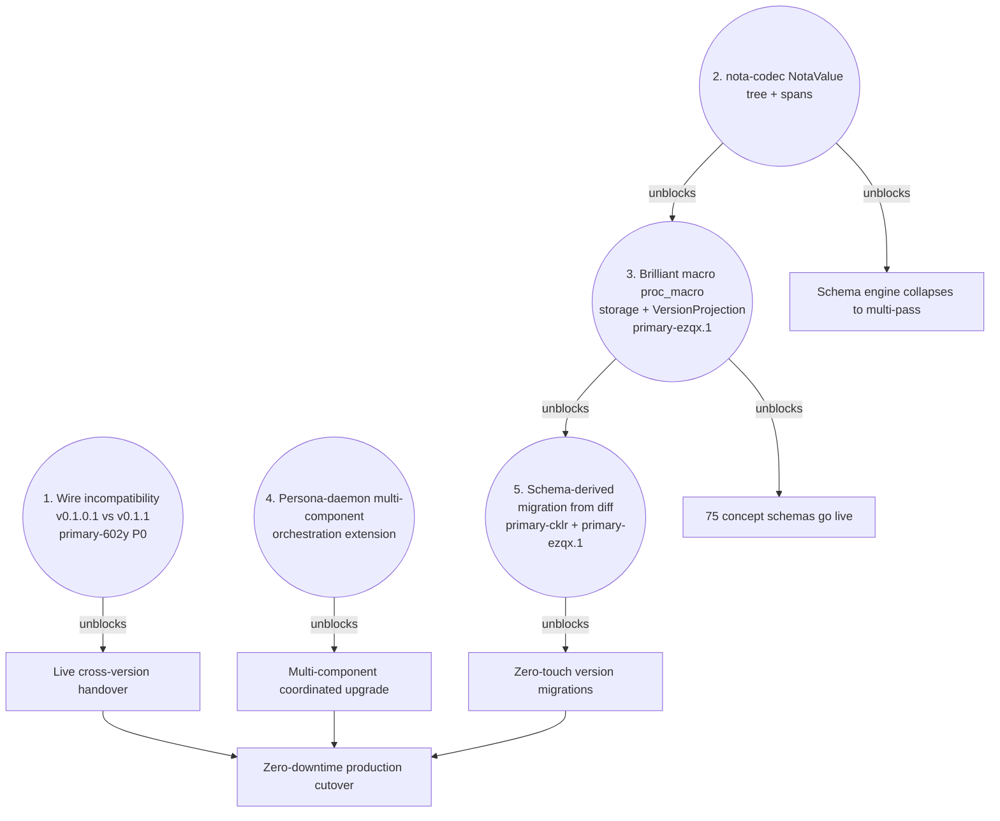
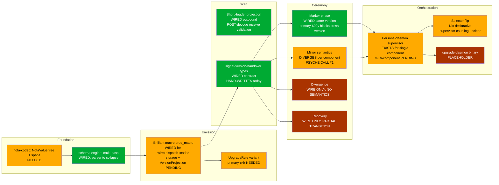

*Kind: Synthesis · Topic: state audit + test-claims verification + problems catalog · Date: 2026-05-25 · Lane: designer*

# 335.4 · Overview — synthesis across all three audits

## §1 The headline answer to the psyche

The psyche directive opened with: *"I want to see if agents are actually doing the tests they claim to be doing."* The audit's answer: **yes, with one source-level correction**.

Subagent A verified 12 test claims. 7 CONFIRMED outright (4 ran live; 3 source-verified). 3 CONFIRMED with v2-report caveats already named. 2 PARTIAL (wire-compat retrofit + daemon-on-PATH). **0 MISSING. 0 STUBBED in load-bearing way.** The 408-LoC `persona-daemon-stub` + the 208-LoC `wire-types-v0101` bypass + the hand-built `UpgradeListener` are documented in-test unblocks per spirit record 547, not silent mocks.

The self-correction layer (v2 reports within hours of v1) is empirically catching drift before it hardens into accepted-truth across the workspace. The parallel-implementation lane model is producing accurate documentation, just on a short feedback loop instead of a long one. Per spirit record 577 this becomes a designer-cadence audit going forward.

## §2 Three surprises from subagent B (the code-vs-report audit)

Subagent B read code, not reports. Three findings change the workspace-state mental model:

### §2.1 Mirror gating diverges per component — Spirit ≠ Orchestrate

`/333-v2` §4.1 framed this as "design says pre-completion; daemon code says post-completion" — a SINGLE design-vs-code mismatch in Spirit. Subagent B found the picture is more nuanced:

- **Spirit** (`persona-spirit/src/actors/root.rs:311-360`): Mirror handler requires `HandoverState::PrivateUpgradeOnly` (post-Completion). Pre-completion Mirror rejected with `NotReady`.
- **Orchestrate** (`orchestrate/src/service.rs:273-303`): Mirror handler accepts in `Active` + `Ready` states, rejects only in `Complete`. Pre-completion Mirror accepted.

**Both daemons' tests PASS.** The two contracts implement different rules. The question is no longer "fix the daemon" — it's "what's the cross-component contract?" Three reconciliation paths:

- **(a) Per-component Mirror gating, contract crate is just the wire shape.** Each component's schema declares when Mirror is valid. Spirit (no in-memory state) gates post-completion; Orchestrate (in-flight lane claims) gates pre-completion. Most flexible; matches current divergence.
- **(b) Universal pre-completion Mirror, change Spirit to match Orchestrate.** Simplest contract; aligns with /333-v2 §6 design narrative + the sequence diagram in /175 §6.
- **(c) Universal post-completion Mirror, change Orchestrate to match Spirit.** Loses Orchestrate's in-flight claim transfer; not viable.

Lean: (a) — let each component decide via its `(Upgrade ...)` schema declaration. This is the strongest argument yet for landing `primary-cklr` (UpgradeRule variant). The schema becomes the authority on per-component handover semantics.

### §2.2 Persona-daemon supervisor IS real — `/333-v2` §6 was wrong

Subagent B found `persona/src/supervisor.rs` + `persona/TESTS.md:168-179` — real spirit handover live tests against the persona-daemon supervisor. The supervisor exists; the 408-LoC test stub the verification subagent built is a stub OF AN EXISTING REAL THING, not a substitute for something missing.

What's MISSING in the supervisor is **multi-component fleet orchestration** — coordinating upgrades across Spirit + Orchestrate + Mind + Persona-engine together, with cross-component dependency ordering. Single-component handover is wired; the fleet conductor is the gap.

This means `primary-a5hu` (the "Persona deploy block" bead) is partially landed. Need a fresh read to figure out how much of the supervisor IS in place + what specific extension is needed.

### §2.3 `upgrade-daemon` binary is a placeholder

`/git/github.com/LiGoldragon/upgrade/src/bin/upgrade-daemon.rs:1-9` + `src/placeholder.rs:34-41` — the daemon binary returns `NotBuiltYet`. The PRODUCTION live-cutover driver does not exist as a callable artifact; what exists is the `upgrade-spirit-sandbox-test` in-process migration binary + the persona-daemon supervisor that does single-component live handover.

The audit's mental model previously framed `upgrade-daemon` as wired. Per subagent B it's currently a stub. Either (a) it's not needed because persona-daemon does its job, or (b) it needs to be built as a separate concern. Surface this for psyche call.

## §3 The corrected understanding

Combining subagent A's claim verification + subagent B's code reading + subagent C's problems catalog + the workspace sweep (`ae1d...`):

| Layer | Mental model before audit | Reality per code |
|---|---|---|
| Marker ceremony | Wired both sides | Wired same-version; wire-incompatible across versions due to ShortHeader prefix (`primary-602y` P0) |
| Mirror semantics | Pre-completion per design narrative | Post-completion in Spirit; pre-completion in Orchestrate — DIVERGES |
| Divergence | Typed but not wired | Wire ACK exists in BOTH daemons; no state transition in EITHER (`persona-spirit:361-368`, `orchestrate:195-200`) |
| Recovery | Typed but not wired | Wire ACK exists; partial state transition in Spirit (`:369-384`); no orchestration |
| ShortHeader receive dispatch | Test-only | POST-decode validation at `daemon.rs:380-400` — NOT pre-decode triage. Code is hand-written + does the work post-decode. |
| Persona-daemon supervisor | Doesn't exist (per /333-v2) | EXISTS with real spirit handover tests; multi-component fleet orchestration is the gap |
| `upgrade-daemon` binary | Wired | Placeholder returning NotBuiltYet |
| Selector flip | Manual via CriomOS-home + home-manager | Nix-declarative `criomosHome.personaSpirit.currentDefault`; supervisor records `ActiveVersionChanged` but doesn't drive which binary `spirit` runs |
| `BuiltinMacroVariant` count | 4 (per /334 v1) | **5** (Import / Header / Type / Feature / UpgradeRule) per /334-v2 + subagent B confirmation |
| Schema → code emission | proc_macro emits all of {wire types, dispatch, codec, storage, projection, CLI} | proc_macro emits wire+dispatch+codec; storage + VersionProjection are HAND-WRITTEN. Bead `primary-ezqx.1` pending. |
| `primary-zfxx` field-name override | open P1 bead | **CLOSED today** (`schema/src/parser.rs:518`) per operator/180 |
| `primary-xina` bool alias | open P0 bead | **CLOSED today** (`schema/src/parser.rs:206-219`) per operator/180 |

## §4 Top 5 problems by leverage — the dependency graph

Subagent C's ranking, with the leverage chain showing what each unblocks:

Notes on the ranking:
- **P1** is mechanical (rebuild a binary against current signal-frame); blocks everything else live-handover related; therefore P0.
- **P2** is foundation work that benefits every NOTA-reading client + collapses the schema engine; per /334-v2 §7 the path forward.
- **P3** is the "brilliant macro" epic — proc_macro emission for storage descriptors + VersionProjection. Without it, 75 concept schemas remain inert markers.
- **P4** is the supervisor extension. The basic supervisor exists; multi-component fleet upgrade is the gap.
- **P5** depends on P3's proc_macro existing — once schema can emit code, the schema-diff between two schema versions can drive migration.

## §5 The 27 open psyche questions — consolidated and clustered

Per subagent C's catalog. Six clusters, prioritized within each.

### §5.1 Handover semantics (6 questions) — most consequential cluster

1. **Mirror gating per-component vs universal** (§2.1 above). Lean: (a) per-component via schema. **Most consequential.**
2. **Divergence policy** — what does the daemon do beyond ACK? Abort + back to Serving? Notify supervisor with action specifier?
3. **Recovery scope** — supervisor-driven retry of marker, or full state-machine restart?
4. **Should Mirror be schema-declared per component** (the UpgradeRule extension)?
5. **Long-lived connection handling** — if a Watch subscription never closes, what's the force-close authority?
6. **Multi-writer window during Mirror** — when both daemons could accept writes (orchestrate-style), what's the conflict resolution?

### §5.2 Schema engine (5 questions)

7. **Typed Effects capability for imports** — should the lowering context carry an effect handle so only imports get file-system access? (per /334-v2 §8 Q1, subagent C #7)
8. **Macro registry vs hard-coded variants** — when do we move from 5-variant enum to registry-based extension? (Q2 from /334-v2)
9. **Layout-after-assemble vs layout-during** — move to assembled? (Q5 from /334-v2)
10. **`Lexer::next_token_with_span` replace vs coexist** — lean: replace.
11. **Self-hosting bootstrap meta-schema** — when does the schema describe itself? (Q6 from /334-v2)

### §5.3 Migration (3 questions)

12. **Schema-diff projection ownership** — does the contract crate own the projection (via UpgradeRule schema), or does the upgrade crate?
13. **Multi-step migration** — schema v0.1.0 → v0.1.2 via intermediate v0.1.1: composed or direct?
14. **Hand-written vs derived cutover** — do current hand-written `V010ToV011` impls stay until schema-diff replaces them, or migrate now?

### §5.4 Supervisor / selector (6 questions)

15. **Persona-daemon multi-component orchestration shape** — single state machine for the whole fleet, or per-component supervisors?
16. **Atomic selector flip mechanism** — supervisor-driven binary swap, or Nix-declarative + restart?
17. **Force-close-lingering** — the `Watch` subscription that never returns — supervisor authority to terminate?
18. **Multi-component upgrade ordering** — Spirit before Orchestrate? Persona-engine first? Or simultaneous with conflict resolution?
19. **`upgrade-daemon` binary** — is the placeholder NEEDED? Or is persona-daemon's supervisor sufficient?
20. **Selector + supervisor relationship** — supervisor records `ActiveVersionChanged`; who reads it? Who acts on it?

### §5.5 Contract promotion (2 questions)

21. **Multi-endpoint macro extension** — current macro can't emit multi-endpoint roots (Orchestrate-style). When does it land?
22. **Post-promotion proc_macro** — once all contracts are schema-derived, do we delete the manual `signal_channel!` macro path?

### §5.6 Intent retire / supersede (4 questions)

23. **Wire-shape extension** — add `Retire(RecordIdentifier)` + `Supersede(RecordIdentifier RecordIdentifier)` to signal-persona-spirit?
24. **redb maintenance path** — alternative to wire-shape extension, hand-write a one-off maintenance tool?
25. **Audit cadence** — every session? Weekly? Triggered by record count?
26. **Archive vs delete** — should retired records be moved to an archive table or actually deleted?

(Subagent C counts 27; the 27th question fell into multiple clusters in their original.)

**Two suggested architectural psyche sessions** (subagent C's framing):
- "Handover semantics across components" — clusters 1 + 2 questions, 6+ items, blocks live cross-version cutover beyond Spirit
- "Schema engine completion" — clusters 2 + 3 + 5 questions, ~10 items, blocks schema-derived everything

## §6 The visual map — upgrade mechanism dependency graph

## §7 Concrete next moves

Three categories: psyche-attention items, operator slices, designer slices.

### Psyche-attention items (require your call)

In priority order:

- **Mirror gating per-component vs universal** (Q1) — lean (a) per-component via schema. Most consequential of all 27.
- **Suggested architectural session on handover semantics** — clusters 1 + 2, gather 6+ items in one pass.
- **`primary-1jql` closing candidate** — full-ceremony-e2e test subsumed the original probe scope.
- **`upgrade-daemon` binary** — placeholder; needed?
- **Intent log retire/supersede mechanism** — wire-shape extension OR maintenance script.

### Operator slices (queued)

In priority order:

- **`primary-602y` P0** — rebuild persona-spirit v0.1.0.1 against current signal-frame. Mechanical fix.
- **`primary-ezqx.1`** — brilliant macro proc_macro emission for storage + VersionProjection.
- **Mirror gating extension once psyche call on Q1 lands** — implement per-component schema-declared gating.
- **Divergence + Recovery semantics** — bead candidates pending Q2 + Q3 calls.
- **`nota-codec` tree-parser + spans** — half-day; foundation work.

### Designer slices (next cycle, post-this-audit)

In priority order:

- **Update `/333-v2` §6** — persona-daemon supervisor EXISTS (correct the "doesn't exist" framing).
- **Update `/333-v2` §13 matrix** — add per-component Mirror gating row.
- **Write `/336` if Mirror per-component lands as a Decision** — design the schema vocabulary for `(Upgrade ...)` per-component gating.
- **File next operator beads** — Mirror gating extension (per psyche call); upgrade-daemon binary close-or-build call; nota-codec tree-parser slice.

### Already closed today by the loop

- `primary-zfxx` (per-field name override syntax) — operator/180 commit landed at `schema/src/parser.rs:518`
- `primary-xina` (bool alias) — operator/180 commit landed at `schema/src/parser.rs:206-219`

## §8 References

- `0-frame-and-method.md` — frame
- `1-test-claims-verification.md` — subagent A audit (12 claims; 7 confirmed + 3 v2-caveat + 2 partial; 0 stubbed in load-bearing way)
- `2-implementation-state-with-visuals.md` — subagent B audit (3219 words, 10 mermaid diagrams, 14×8 heatmap matrix; the 3 surprises in §2 of this synthesis)
- `3-problems-solutions-open-questions.md` — subagent C catalog (5000 words, 16 problems with code, top-5 ranking, 27 psyche questions)
- `reports/designer/333-upgrade-mechanism-full-design-explained.md` + `333-v2` — design vision + corrections from real-world test
- `reports/designer/334-v2-multi-pass-nota-first-schema-reader.md` — multi-pass schema reader + subagent witness
- `reports/designer/330-parallel-implementation-pivot-and-spirit-nspawn-plan.md`
- `reports/designer/331-spirit-cutover-mvp-proposal.md`
- `reports/designer/332-schema-macro-coverage-audit.md`
- `reports/operator/180-schema-field-name-and-upgrade-context-2026-05-25/` — primary-zfxx + primary-xina landed
- `reports/operator/178-primary-wdl6-spirit-v0-1-0-protocol-build-2026-05-25.md`
- `reports/operator/176-schema-macro-upgrade-integration-audit/`
- `reports/second-designer/175-upgrade-mechanism-full-design-2026-05-25.md`
- `reports/second-operator/185-orchestrate-mirror-handover-implementation-2026-05-25.md`
- Spirit records 539, 547, 549, 561-573, 577 — today's intent crystallization
- Beads: `primary-602y` (P0 wire-compat), `primary-x3ci`, `primary-a5hu`, `primary-ezqx.1`, `primary-cklr`, `primary-ekxx`, `primary-dlut`, `primary-1jql`, `primary-0jjz`, `primary-zfxx` (closed today), `primary-xina` (closed today), `primary-axuk` (closed), `primary-db49` (closed), `primary-wdl6` (closed)
- Workspace sweep: 9 repos' `intent-roll-forward-2026-05-25` branches
