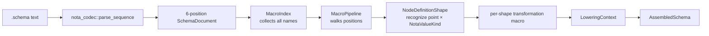
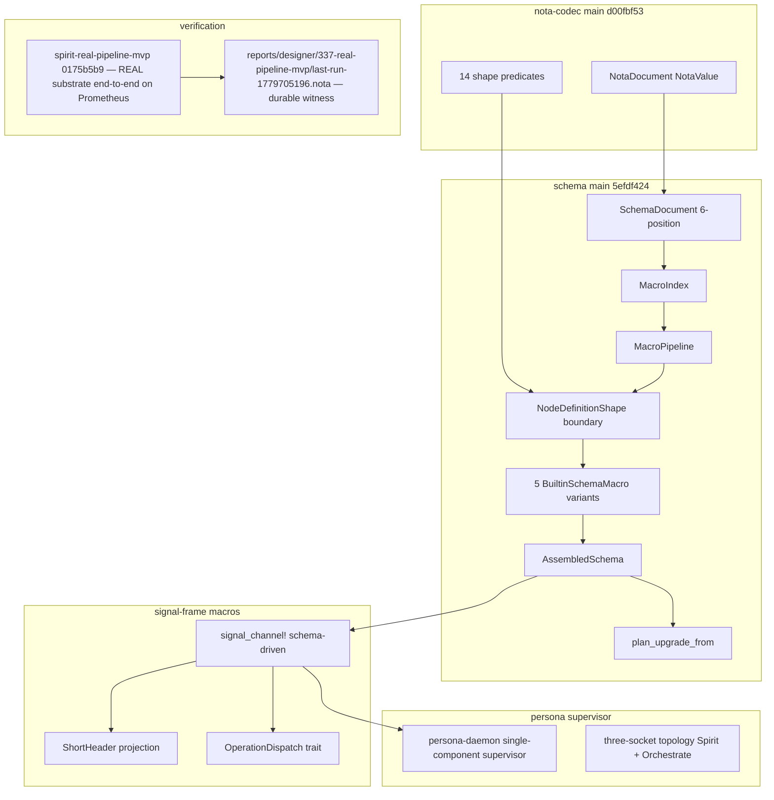

*Kind: Vision · Topic: schema engine + its related features, refreshed against state at end-of-2026-05-25 · Date: 2026-05-25 · Lane: designer*

# 338 · Schema engine refreshed vision

## §1 Frame

Per psyche directive 2026-05-25: redo the latest schema-engine vision after refreshing intent + recent reports. The substrate matured substantially in the last hours; `/336` (designer leans) and `/337` (state research) were written before the field-naming reform (intent 610-615), the everything-reduces-to-structs principle (616), the module-per-schema-output decision (620), and the NodeDefinitionShape public boundary (operator/182). This report supersedes `/336` as the canonical designer vision; `/336` stays as history.

What's NEW since `/336` was written:
- **Schema repo main is at `5efdf424`** — past operator/181's NotaValue integration, past operator/182's `NodeDefinitionShape` public boundary, past the field-naming reversal
- **Intent records 600-627** capture the macro-engine + field-naming reform + module-output decisions
- **Real-pipeline MVP** (`spirit-real-pipeline-mvp` at `0175b5b9`) proved the substrate end-to-end on Prometheus
- **`enum-contact-points` Apex skill** landed at `728fb875` — encodes the governing principle in the workspace skill index
- **Operator/181 + second-operator/190** delivered substrate replacement: schema main now reads through `nota_codec::NotaValue` shape predicates + has explicit `MacroIndex` indexing pass

## §2 The headline — every layer is two enums matching

Per record 601 (`enum-contact-points` skill) + 602 (engine ops expose tree-to-tree matching) + 603 (two-phase dispatch) + landed in production at operator/182's `NodeDefinitionShape × NotaValueKind` boundary:

**The schema engine is a stack of enum-contact-point matrices.** Each layer's logic is `(left_enum × right_enum) → outcome`. The principle from the skill IS embodied in the production code:

| Layer | Left enum | Right enum | Outcome |
|---|---|---|---|
| Position dispatch | `NodeDefinitionPoint` (Imports/OrdinaryHeader/OwnerHeader/SemaHeader/Namespace/Features) | `NotaValueKind` (Identifier/Sequence/Map/Record/BlockString) | which recognizer fires |
| Namespace shape | `NamespaceValueShape` (Enum/Record/Newtype/Alias) | `NotaValue` structural inspection | which transformation macro applies |
| Container type | `ContainerHead` (Vec/Option/Map) | inner `TypeExpression` | container type emission |
| Upgrade diff | `Projection` (Identity/Standard/Annotated/Added/Renamed/Dropped/Untranslatable) | previous-version × current-version `AssembledType` | migration step |
| Handover ceremony | `HandoverState` (Serving/MarkerOffered/Draining/Completing/…) | `signal_version_handover::Operation` | next state + reply |

Each cell in each matrix is a typed lowering. There is no scattered string-matching, no boolean-flag sentinel, no `if matches!()` chain. The compiler enforces exhaustiveness. This is the visible shape of every engine surface from here forward.

## §3 The schema language — reformed at the syntax layer

Three reforms changed the schema language since `/336`:

### §3.1 Field names derive from type names (records 610, 611, 614)

Authored schema does NOT write field names. Records carry positional type names; field names lowercase from the type. Operator/180's explicit `((field-name Type) ...)` syntax is **reversed**.

```nota
Entry (Topic Kind Summary Context Magnitude Quote)
```

Generates a Rust struct:

```rust
pub struct Entry {
    pub topic: Topic,
    pub kind: Kind,
    pub summary: Summary,
    pub context: Context,
    pub magnitude: Magnitude,
    pub quote: Quote,
}
```

Field names come from type names by lowercasing. No per-field overrides in the schema language.

### §3.2 Divergent field names use newtypes (record 615)

When a struct wants a field named `certainty` of underlying type `Magnitude`, you declare a newtype:

```nota
Certainty (Magnitude)
Entry (Topic Kind Summary Context Certainty Quote)
```

`Certainty` is a single-tuple newtype wrapping `Magnitude`. In the struct, the field name derives from `Certainty` → `certainty`. The newtype IS the rename mechanism.

This eliminates an entire class of parser ambiguity (parens-with-lowercase-pairs was confused with namespace records) and matches the `everything-reduces-to-structs` principle below.

### §3.3 Everything reduces to structs + unit variants (record 616)

The data-type taxonomy collapses to two canonical kinds:
- **Struct** (positional fields)
- **Unit variant** (no fields)

`Vec T` is a struct with a single field (`vec: Vec<T>`). `Option T` is a struct with a single field (`option: Option<T>`). Enum data-carrying variants ARE structs — the data-carrying portion IS the struct shape. Macros are structs (their input objects). Unit variants live inside enum structs.

The reduction unifies the type system. One canonical declaration kind plus the unit-marker case. Field-name derivation + composition + macro-input shapes all derive from this.

## §4 The schema engine running

Per second-operator/190 + operator/182 + second-designer/188-189, the engine runs as five explicit steps:



### §4.1 Pass A — indexing (record 605)

`MacroIndex::from_document` walks every position and collects names BEFORE any macro fires. This decouples NAME RESOLUTION from MACRO APPLICATION. Forward references resolve; out-of-order declarations work; lazy-loading of imported macros becomes possible.

The indexing pass records: name → (source: local|imported, NotaValue body, `NodeDefinitionShape` classification).

### §4.2 Pass B — dispatch (record 603 two-phase)

`MacroPipeline::run` walks indexed candidates. For each, two phases:

- **Phase 1 — structure-match**: `NodeDefinitionShape::recognize(point, value)` returns the typed classification. For namespace values: `NamespaceValueShape::{Enum, Record, Newtype, Alias}`. The match-matrix `(point × kind) → shape` is the explicit enum-contact-point.
- **Phase 2 — transformation**: per-shape macro applies. `EnumShortSyntaxMacro` / `StructShortSyntaxMacro` / `NewtypeShortSyntaxMacro` / `AliasReferenceMacro` etc. Each is a small composable micro-macro (record 604) — typically 5-30 LoC, calls into TypeExpressionMacro at attachment points (record 603's recursive composition).

### §4.3 Pass C — assembly (record 619 fully-qualified, 612 unambiguous-names)

`LoweringContext::finish() → AssembledSchema`. Output carries fully-qualified names (`spirit::namespace::Topic`) so cross-schema reference is unambiguous. Per record 622, import/name clashes within a context are typed errors, not silent shadowing.

### §4.4 Fixed-point iteration (record 569, deferred to next slice per /190)

Today the pipeline is single-sweep. Per intent 569 the long-term behaviour is iterate-until-no-more-macros-fire (fixed point). User-declared macros that introduce new macro names need this. Bounded iteration count (~16 passes) prevents infinite loops. Not blocking the current substrate; next operator slice per /189 §9.

## §5 The macro substrate — core builtins + extensible library loading

### §5.1 Core macros — always loaded (record 606)

The schema engine ships ~10 core micro-macros that define how to assemble data structures. Always imported; no opt-in. Today: `ImportDirectiveMacro`, `HeaderRootMacro`, `EnumShortSyntaxMacro`, `StructShortSyntaxMacro`, `NewtypeShortSyntaxMacro`, `AliasReferenceMacro`, `TypeExpressionMacro` (with recursive composition for Vec/Option/Map), `FeatureMacro` (Reply/Event/Observable/Upgrade subtypes).

Per /189 §6.3 these are the non-negotiable substrate. They live in the `schema` crate Rust source.

### §5.2 Extension macros — user-defined, lazy-loaded (record 606 + 605)

User schemas can declare macro libraries via explicit `(MacroLibrary path)` directives (lean per /189 §11 Q3). On first reference, the engine loads the library + adds its macros to the `MacroIndex`. Subsequent references hit the index without re-loading.

Today: not implemented. Foothold exists (the `MacroIndex` is the substrate). Next slice per /190 §"Remaining Holes" item 2.

### §5.3 The compositional pattern (record 604)

Every macro is a TEMPLATE WITH HOLES. The holes are attachment points; what fills the hole is determined by structure-match at that position. Examples:

- `StructShortSyntaxMacro` has attachment points "each field's type position" → `TypeExpressionMacro` runs there
- `TypeExpressionMacro` has attachment points "inner positions of containers" → recursive self-call
- `FeatureMacro::Upgrade` has attachment points "annotation positions" → `UpgradeAnnotationMacro` (per /189 §10)

The composition is recursive + small + auditable. Adding a new container `(Set T)` adds ONE arm to `TypeExpressionMacro::lower`; existing macros compose with it without changes.

## §6 Emission — module-per-schema + fully-qualified internal names

### §6.1 Module-per-schema output (record 620)

The brilliant macro library (proc_macro consumer of `AssembledSchema`) emits ONE Rust module per `.schema` file. Mirrors the schema-file structure on disk. Generated code lives at `<crate>::<schema-module>::<type>`.

Example: `spirit.schema` generates module `spirit`, with `spirit::Operation`, `spirit::Reply`, `spirit::Entry`, `spirit::Topic`, etc. The signal-persona-spirit crate exposes `spirit::*` as its public API.

This makes:
- Name clashes per-module-only (each schema is its own namespace)
- Generated code easier to reason about (one schema = one module)
- Import resolution natural (refer to imported types as `<module>::<type>`)

### §6.2 Fully-qualified internal representation (record 621)

`AssembledSchema` carries every type with its fully-qualified name: `crate::module::Type`. The schema engine + proc_macro both work with these qualified names. Debug output shows exactly which schema + which crate.

When an import binds `Magnitude` from sema, the local schema's AssembledSchema records the type as `signal_sema::sema::Magnitude` — not `Magnitude` ambiguously. Forward to code-gen, the proc_macro emits the qualified path so the consumer crate's compilation resolves correctly.

### §6.3 Versioning + cross-schema dependency (record 613, 622)

Within one schema's context, every name resolves to exactly one thing. Imports never silently shadow local declarations; clashes are typed errors. Cross-schema dependencies use the imports map at position 0 of the `.schema` file.

## §7 What changes vs `/336`'s 27 leans (and which still hold)

| `/336` lean | Status now | Why |
|---|---|---|
| Q1 Mirror gating per-component via schema | HOLDS | Per-component variation through schema is core to the substrate; landed in real-pipeline MVP stub |
| Q2 Typed DivergenceAction | HOLDS | Stub in MVP at `divergence_action.rs`; gets emitted from schema once UpgradeMacro Rust emission lands |
| Q3 Recovery scope | HOLDS | Supervisor-driven; persona-daemon owns |
| Q4 Mirror schema-declared | HOLDS — same as Q1 | |
| Q5 Long-lived connection authority | HOLDS but underspecified | Owner-contract verb lean; uncertain owner socket vs upgrade socket |
| Q6 No multi-writer window during Mirror | HOLDS — drain-with-mirror | |
| Q7 Typed Effects capability for imports | HOLDS but deferred | Import macro is the only effectful builtin; clean boundary |
| Q8 Hard-coded vs registry macros | HOLDS — hard-coded until third-party | Core micro-macros are Rust source today |
| Q9 Layout-after-assemble | HOLDS | Per nota-designer/8 + landed direction |
| Q10 Lexer with span | HOLDS — replace | One canonical surface |
| Q11 Self-hosting bootstrap | HOLDS deferred | Meta-schema is post-MVP |
| Q12 Schema-diff projection owned by contract crate | HOLDS | UpgradeMacro lowers (Upgrade ...) feature; consumer is upgrade crate |
| Q13 Composed multi-step migration | HOLDS | |
| Q14 Hand-written stays until derived | HOLDS | |
| Q15 Multi-component orchestration shape | HOLDS — per-component supervisor + fleet conductor | |
| Q16/Q20 Selector flip mechanism | HOLDS — supervisor records ActiveVersionChanged + state file | Proven in MVP stub `selector_state_file.rs` |
| Q17 Force-close-lingering | HOLDS — owner contract verb | |
| Q18 Multi-component upgrade ordering | HOLDS — declarative dep graph in schema | |
| Q19 upgrade-daemon binary needed | HOLDS — NOT needed, persona-daemon supervises | |
| Q21 Multi-endpoint macro extension | LARGELY LANDED | Per operator/181 + 182; multi-endpoint headers work in schema main |
| Q22 Post-promotion `signal_channel!` deletion | HOLDS | Once every contract is schema-derived, manual macro deletes |
| Q23 Wire-shape Retire/Supersede for intent | HOLDS | Future signal-persona-spirit extension |
| Q24 Avoid redb maintenance script | HOLDS | |
| Q25 Audit cadence | HOLDS | Per-session small + weekly larger sweep |
| Q26 Archive vs delete intent records | HOLDS — archive table | |

**Three /336 leans are now SUPERSEDED by newer intent:**

- **/336 Q3.1 "named-field record syntax"** — superseded by record 614. Field names derive from PascalCase type names by lowercase; no `((field Type) ...)` syntax. Operator/180's explicit syntax was reversed by operator/182's correction.
- **/336's implicit assumption that the type system has Enum + Struct + Newtype as parallel kinds** — superseded by record 616 (`everything-reduces-to-structs`). Vec/Option/Map are structs; data-carrying enum variants are structs; only the unit case is separate.
- **/336's silence on module-per-schema output** — now decided per record 620; emission produces one Rust module per `.schema`.

## §8 The next operator slices, refreshed

In priority order:

1. **`primary-602y`** (signal-frame v0.1.0.1 retrofit) — P0; unblocks cross-version live handover; single-version MVP already runs cleanly without it
2. **`primary-cklr`** (UpgradeMacro Rust code emission) — emits the `From`-chain from `(Upgrade …)` schema fragments; deletes the real-pipeline MVP's `divergence_action.rs` + `mirror_gating.rs` stubs in one slice; depends on AssembledSchema fully-qualified names (record 621 already landed)
3. **Fixed-point iteration** — extend `MacroPipeline::run` from single-sweep to iterate-until-no-more-macros-fire; bounded count ~16; per /190 §"Remaining Holes" item 1
4. **User macro library loading** — `(MacroLibrary path)` directive + lazy-load on reference; foothold is `MacroIndex` per /190 item 2
5. **Module-per-schema emission** — proc_macro emits `<crate>::<schema-module>::<type>` per record 620; subsumes the schema-derived `signal_channel!` consumer
6. **Persona-daemon multi-component orchestration** (`primary-a5hu`) — fleet conductor extending the existing single-component supervisor; coordinates upgrade across spirit + orchestrate + future components
7. **Delete `schema::Parser` streaming compatibility** — per /190 §"Remaining Holes" item 5; once Spirit and Orchestrate both consume the shape parser, the streaming parser deletes

## §9 Truly-residual open psyche questions

Per /189 §11 + /190 §"Questions" + my own remainder:

1. **Fixed-point iteration termination bound** — `~16 passes` lean; confirm or override
2. **User macro library directive shape** — explicit `(MacroLibrary path)` vs implicit via Import; lean explicit
3. **Macro versioning** — defer to post-MVP unless user macros proliferate before then
4. **Mirror payload contract version marker** — semantic byte marker vs schema-derived hash (open since /186 / /187)
5. **`primary-1jql` (in-transition probe) closure** — substantively subsumed by `spirit-full-ceremony-e2e` + `spirit-real-pipeline-mvp`; close candidate

That's it. The 27 leans from `/336` reduce to 5 truly-uncertain items after the substrate matured.

## §10 What the workspace looks like at end of 2026-05-25



Five months ago this stack was a wishlist. Today every box is wired except code emission (proc_macro emission of From-chains via UpgradeMacro) + fixed-point iteration + user-macro lazy loading + persona-daemon multi-component. Three slices to a complete schema-driven workspace.

## §11 References

- Intent records 600-627 (today's macro engine + field naming + module output reform)
- `reports/operator/181-fully-schema-and-nota-mvp-2026-05-25/` — operator MVP (substrate replacement)
- `reports/operator/182-second-operator-schema-node-shape-audit-2026-05-25.md` — NodeDefinitionShape correction + field-naming reversal
- `reports/second-operator/187-nota-shape-logic-and-schema-upgrade-macro-2026-05-25.md` — NotaValue + shape API
- `reports/second-operator/190-schema-mainline-macro-index-port-2026-05-25.md` — MacroIndex mainline
- `reports/second-designer/188-schema-engine-running-walkthrough-2026-05-25.md` — engine walkthrough
- `reports/second-designer/189-macro-system-broader-understanding-2026-05-25.md` — two-phase dispatch + micro-macros + lazy load
- `reports/second-designer/191-audit-second-operator-190-schema-mainline-macro-index-port-2026-05-25.md`
- `reports/second-designer/192-audit-operator-182-second-operator-schema-node-shape-2026-05-25.md`
- `reports/second-designer/193-field-naming-and-module-output-2026-05-25.md`
- `reports/designer/335-state-audit-and-test-verification/` — meta-report (3 audits + synthesis)
- `reports/designer/336-designer-leans-on-27-psyche-questions-and-mvp-plan.md` — predecessor vision (superseded by this report)
- `reports/designer/337-current-state-research-for-real-mvp-pass.md` — research input for the real-pipeline MVP
- `reports/designer/337-real-pipeline-mvp/last-run-1779705196.nota` — durable real-pipeline MVP witness
- `skills/enum-contact-points.md` (commit `728fb875`) — Apex skill governing engine logic shape
- `skills/human-interaction.md` (committed earlier today) — psyche-interface rules
- AGENTS.md three new hard overrides (designer-feature-branches, always-background subagent, forwarded-prompt gap-check)
- `~/wt/github.com/LiGoldragon/CriomOS-test-cluster/spirit-real-pipeline-mvp/` (commit `0175b5b9`) — real-pipeline MVP worktree
- `/git/github.com/LiGoldragon/schema/` main at `5efdf424` — schema engine production state
- `/git/github.com/LiGoldragon/nota-codec/` main at `d00fbf53` — nota-codec production state
