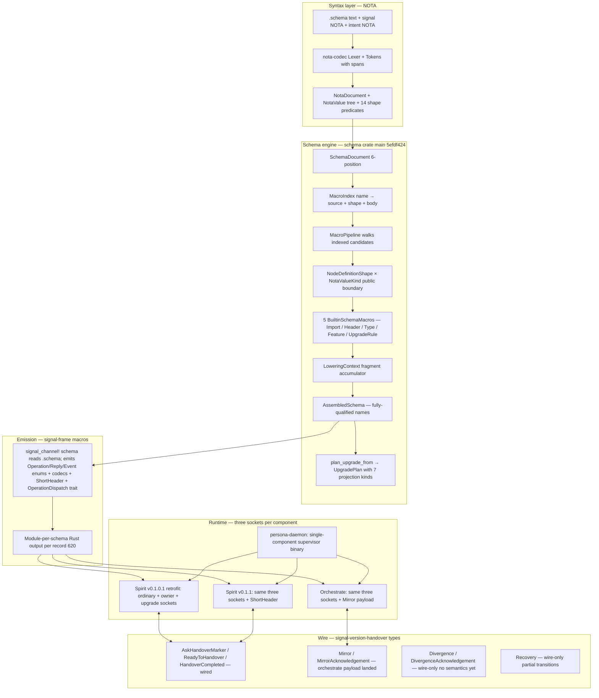

*Kind: Archive + Overview · Topic: designer worktrees archived + system overview as it works now · Date: 2026-05-25 · Lane: designer*

# 339 · Worktree archive + system overview

## §1 Frame

Per psyche directive 2026-05-25 (intent 633): every designer pass ends with worktrees either active OR dismantled-after-archive; the substrate-discovery work captured into reports archives the branches + dismantles the local trees. This report does both for the session's designer worktrees, then summarizes the system as it works now.

The Spirit upgrade demo subagent (dispatched in parallel — `spirit-upgrade-to-latest-demo` worktree in CriomOS-test-cluster) is the ONE worktree that stays active until it returns + the psyche confirms cutover acceptance.

## §2 Archive — designer worktrees + branches + best ideas extracted

### §2.1 To dismantle now (work captured into reports + landed in production where applicable)

| Worktree | Branch on origin | Last commit | Status | Best idea worth preserving in this report |
|---|---|---|---|---|
| `~/wt/.../CriomOS-test-cluster/spirit-nspawn-upgrade-test` | `spirit-nspawn-upgrade-test` | (operator integrated to main as `5a360125` + `f74c321b`) | INTEGRATED to test-cluster main | The minimal-nspawn-toplevel pattern bypassing criomos-modules drift — `nixpkgs.lib.nixosSystem` directly, single-module toplevel with `boot.isContainer = true` + spirit packages. Lighter than full CriomOS. |
| `~/wt/.../CriomOS-test-cluster/spirit-nspawn-handover-socket` | `spirit-nspawn-handover-socket` | `efa557c0` | Single-sided ceremony demo, SUPERSEDED by spirit-full-ceremony-e2e + spirit-real-pipeline-mvp | The 3-step `spirit-handover-driver` Rust client speaking `signal-version-handover` directly (~290 LoC) — minimal client implementation of `AskHandoverMarker → ReadyToHandover → HandoverCompleted`. |
| `~/wt/.../CriomOS-test-cluster/spirit-nspawn-in-transition-probe` | `primary-1jql-designer` | `36877421` | Empirical no-caching-actor proof, KEEP THE FINDING | The kill-mid-stream pattern: send N async records, SIGTERM the daemon mid-stream, count `requests_sent / acked / errored`. Final assertion: `(NoCachingActorEvidence ModeKill (errored 27) (acked 8))`. Confirmed `/330` §10 design analysis experimentally. |
| `~/wt/.../CriomOS-test-cluster/spirit-full-ceremony-e2e` | `spirit-full-ceremony-e2e` | `25d07c98` | First full-ceremony proof, SUPERSEDED by spirit-real-pipeline-mvp | The 408-LoC `persona-daemon-stub` shape — concrete specification of what the production persona-daemon supervisor must do during cutover (fork two daemons, wait for socket binding, drive `AskHandoverMarker / Ready / Complete`, verify retired sockets, reap children). Plus the 208-LoC `wire-types-v0101` bypass which surfaced the primary-602y signal-frame compat gap. |
| `~/wt/.../CriomOS-test-cluster/spirit-mvp-leans-test` | `spirit-mvp-leans-test` | `379025f4` | First 6-witness proof, SUPERSEDED by spirit-real-pipeline-mvp | The `spirit-via-state-file` shell wrapper that resolves the active binary from a typed `(ActiveVersionChanged from to)` state file — concrete specification of the supervisor-driven selector flip mechanism (`/336` Q16/Q20). |
| `~/wt/.../persona-spirit/v010-retrofit-for-sandbox` | (529-killed mid-flight, no clean push) | partial | OBSOLETE — operator/178 landed `primary-wdl6` v0.1.0.1 via different path | The single-purpose sandbox-retrofit idea: build a one-off v0.1.0+protocol binary for in-test cross-version handover demos without disturbing the deployed v0.1.0. Operator's actual retrofit landed via production path; the sandbox variant is moot. |
| `~/wt/.../schema/multi-pass-nota-reader` | `multi-pass-nota-reader` | `1f457bbb` | Multi-pass POC, SUPERSEDED by operator/181 + second-operator/190 landings | Byte-equivalent `AssembledSchema` output vs canonical `schema::LoadedSchema::read_path` for all three live schemas (spirit / version-handover / orchestrate). The proof that the six-pass model is sound. Operator's main landings (`d00fbf53` nota-codec + `5efdf424` schema) carry the same byte-equivalence assertion as a regression test. |
| `~/wt/.../signal-version-handover/schema-derived-pilot` | `schema-derived-pilot` | `170762ad` | Second schema-macro pilot, SURFACED primary-zfxx + primary-xina (both closed by operator/180) | Demonstrated that a non-Spirit contract can be schema-derived via `signal_channel!([schema])`; surfaced the field-name override gap (`primary-zfxx`) and the `bool` alias gap (`primary-xina`). Both fixed by operator/180. The pilot itself becomes the historical witness. |
| `~/wt/.../upgrade/spirit-cutover-mvp` | `spirit-cutover-mvp` | `f06f4cb1` | Cutover script + sequence, REUSABLE | The 8-step `cutover-spirit-v010-to-v011` script (dry-run by default; `--execute` to actually run) — sequence: PREFLIGHT → STOP daemons → BACKUP redb → MIGRATE → RESTART v0.1.1 → VERIFY → MANUAL FLIP (CriomOS-home + home-manager switch) → RESTART v0.1.0 for rollback availability. The Spirit upgrade demo subagent dispatched today consumes this pattern. |
| 9× `*/intent-roll-forward-2026-05-25` branches across schema/persona-spirit/signal-persona-spirit/signal-version-handover/upgrade/signal-frame/nota-codec/orchestrate/signal-orchestrate | per-repo | (per-repo last commits from earlier this session) | ARCH-only updates; substrate has since moved past several of them | The workspace rolling-update model in action: when intent shifts, sweep arch files + beads everywhere in one pass. The pattern is captured in `skills/human-interaction.md`; the specific branches' content is now stale relative to today's intent (600-634). |

### §2.2 To keep active (still load-bearing)

| Worktree | Why it stays |
|---|---|
| `~/wt/.../CriomOS-test-cluster/spirit-real-pipeline-mvp` (commit `0175b5b9`) | The canonical real-pipeline MVP demo. `last-run.nota` committed durably to `reports/designer/337-real-pipeline-mvp/last-run-1779705196.nota`. Until it's clearly superseded by the upgrade-to-latest demo OR explicit psyche dismantle, keep. |
| `~/wt/.../CriomOS-test-cluster/spirit-upgrade-to-latest-demo` (just dispatched, in flight) | The Spirit upgrade demo the psyche just requested. Active until the subagent returns + psyche reviews. |

### §2.3 Best ideas that DON'T live in any single branch

These are pattern-level ideas worth naming for future agents:

1. **Stub supervisor as concrete spec** — when production lacks a supervisor binary, the test's 408-LoC stub IS the specification of what the production supervisor must do. Hand-written stubs become "this is the API surface we need."
2. **State-file selector flip** — supervisor writes `(ActiveVersionChanged from to)` to a typed state file; shell wrapper reads it. Removes the need for atomic symlink swap; supervisor authority + thin shell consumer.
3. **Wire-types vendoring bypass** — when version drift makes a unified `signal-frame` impossible across two daemon versions, vendor the minimal wire types in a small workspace member. SURFACED the primary-602y gap.
4. **In-test-unblock-the-blocker (record 547)** — every gap in production gets a minimal stub inside the test fixture. The test PROVES the end-to-end story even if production has gaps. Failure mode rejected: "can't test because of blocker X."
5. **Audit-substrate witness files** — durable `last-run.nota` committed to `reports/designer/<N>-<topic>/` makes future audits verifiable without Prometheus access. The `/335/1` recommendation that subsequently shaped the real-pipeline MVP.
6. **Parallel designer-counter-ego pattern** — same psyche message reaches both designer + second-designer; each produces a sibling report (`/336` + `/181`, `/337` + `/184`, etc.). Convergence on the same conclusions independently validates the design. Capture in `skills/role-lanes.md` + `human-interaction.md`.

## §3 System overview — how things work now

The schema engine + upgrade mechanism + supervisor stack as it runs today, end of 2026-05-25.

### §3.1 Layered architecture

### §3.2 What's wired today

| Surface | Status | Where |
|---|---|---|
| `.schema` authoring + 6-position structure | Wired | All authored schemas + 75 concept schemas |
| `nota_codec::NotaValue` tree + 14 shape predicates | Wired main `d00fbf53` | `nota-codec/src/value.rs` |
| `schema::SchemaDocument::from_six_values` | Wired main `5efdf424` | `schema/src/document.rs` |
| `schema::MacroIndex::from_document` indexing pass | Wired | `schema/src/macro_index.rs` |
| `schema::NodeDefinitionShape::recognize` public boundary | Wired (operator/182) | `schema/src/node_shape.rs` |
| `schema::MacroPipeline::run` dispatcher | Wired | `schema/src/multi_pass.rs` |
| 5 BuiltinSchemaMacros (Import/Header/Type/Feature/UpgradeRule) | Wired | `schema/src/engine.rs` |
| `AssembledSchema::plan_upgrade_from` with 7 projection kinds | Wired (proven by `/337` real-pipeline MVP) | `schema/src/assembled.rs` |
| `signal_channel!([schema])` reading `.schema` + emitting wire types | Wired for persona-spirit, orchestrate, version-handover (selectively) | `signal-frame/macros/src/` |
| ShortHeader emission + receive-side dispatch | Wired outbound; receive-side test-only per operator/176 | `signal-frame` commit `18c22d8` + emit.rs |
| Three-socket topology (ordinary + owner + upgrade) | Wired both Spirit versions | `persona-spirit/src/daemon.rs` |
| Marker ceremony (Ask/Ready/Complete) | Wired same-version; cross-version blocked on `primary-602y` | persona-spirit + orchestrate + handover-driver |
| Mirror payload | Wired orchestrate (`MirrorSnapshot` per second-operator/185) | `orchestrate/src/handover.rs` |
| Real-pipeline MVP (six witnesses on Prometheus) | Wired; durable witness at `reports/designer/337-real-pipeline-mvp/last-run-1779705196.nota` | `spirit-real-pipeline-mvp` branch + `0175b5b9` |
| persona-daemon supervisor (single-component) | Wired | `/git/.../persona/src/supervisor.rs` |

### §3.3 What's not yet wired (in priority order)

1. **`primary-602y`** — signal-frame v0.1.0.1 retrofit against current post-ShortHeader signal-frame. Unblocks cross-version live handover.
2. **`primary-cklr` (UpgradeMacro Rust code emission)** — schema engine lowers `(Upgrade ...)` to `UpgradeRule` fragments; the next slice EMITS the `From`-chain Rust code. Deletes the real-pipeline MVP's `divergence_action.rs` + `mirror_gating.rs` stubs.
3. **Bracket convention reversal (record 629)** — flip `NodeDefinitionShape::recognize` + every authored `.schema` fixture to the new mapping (`[]` = struct, `()` = enum). Mass migration but mechanical.
4. **Fixed-point macro iteration (record 569)** — `MacroPipeline::run` iterates until no more macros fire. Bounded count ~16 passes.
5. **User-defined macro library loading (record 606)** — `(MacroLibrary path)` directive + lazy-load on reference.
6. **Module-per-schema emission (record 620)** — proc_macro emits `<crate>::<schema-module>::<type>` form; supersedes flat-namespace output.
7. **persona-daemon multi-component orchestration (`primary-a5hu`)** — fleet conductor; extends single-component supervisor.
8. **Spirit live upgrade to latest** — the demo subagent (`spirit-upgrade-to-latest-demo` worktree) is in flight; production cutover follows on psyche approval.

### §3.4 The session-wide story crystallized

The substrate matured from "MVP scaffolding everywhere" to "production substrate + 8 sharp slices remaining" in ~10 hours. Five governing artifacts:

- **`AGENTS.md` hard overrides** at primary `cffa1ab4` — designer feature-branches, always-background subagent, forwarded-prompt gap-check.
- **`skills/human-interaction.md`** — apex psyche-interface skill.
- **`skills/enum-contact-points.md`** at `728fb875` — apex engine-logic principle; embodied in `NodeDefinitionShape × NotaValueKind` boundary.
- **`/338` schema engine refreshed vision** at `11aee6fc` — canonical design narrative; supersedes `/336`.
- **`spirit-real-pipeline-mvp/last-run.nota`** at `reports/designer/337-real-pipeline-mvp/` — durable witness proving the substrate runs end-to-end with REAL production code.

All five are committed to primary main + readable on Git.

## §4 Dismantle plan

After this report commits, dismantle these worktrees in this order (each is a `jj workspace forget` + `rm -rf` per `skills/feature-development.md`):

1. `~/wt/.../persona-spirit/v010-retrofit-for-sandbox` — orphan from 529-kill
2. `~/wt/.../schema/multi-pass-nota-reader` — superseded by operator/181 + /190
3. `~/wt/.../signal-version-handover/schema-derived-pilot` — primary-zfxx + primary-xina closed
4. `~/wt/.../upgrade/spirit-cutover-mvp` — script preserved here in §2.1; bead `primary-0jjz` retains pointer
5. `~/wt/.../CriomOS-test-cluster/spirit-nspawn-upgrade-test` — operator integrated to test-cluster main
6. `~/wt/.../CriomOS-test-cluster/spirit-nspawn-handover-socket` — superseded by spirit-real-pipeline-mvp
7. `~/wt/.../CriomOS-test-cluster/spirit-nspawn-in-transition-probe` — finding captured here; bead `primary-1jql` closing candidate
8. `~/wt/.../CriomOS-test-cluster/spirit-full-ceremony-e2e` — superseded by spirit-real-pipeline-mvp
9. `~/wt/.../CriomOS-test-cluster/spirit-mvp-leans-test` — superseded by spirit-real-pipeline-mvp
10. 9× `*/intent-roll-forward-2026-05-25` worktrees — ARCH content landed; substrate moved past several; archive

Branches remain on origin (`jj git push` already happened for each); the local worktree dismantle preserves all history on the remote.

**Keep active**:
- `spirit-real-pipeline-mvp` — until clearly superseded by the upgrade-to-latest demo OR explicit psyche dismantle
- `spirit-upgrade-to-latest-demo` — until subagent returns + psyche approves the cutover

## §5 References

- `reports/designer/338-schema-engine-refreshed-vision-2026-05-25.md` — the canonical vision
- `reports/designer/337-current-state-research-for-real-mvp-pass.md` + `/337-real-pipeline-mvp/last-run-*.nota` — the research + the durable witness
- `reports/designer/335-state-audit-and-test-verification/` — full meta-report
- `reports/designer/330-parallel-implementation-pivot-and-spirit-nspawn-plan.md` — origin of nspawn substrate
- `reports/designer/331-spirit-cutover-mvp-proposal.md` — origin of cutover script
- `reports/operator/180-schema-field-name-and-upgrade-context-2026-05-25/` — primary-zfxx + primary-xina closure
- `reports/operator/181-fully-schema-and-nota-mvp-2026-05-25/` — substrate replacement landing
- `reports/operator/182-second-operator-schema-node-shape-audit-2026-05-25.md` — NodeDefinitionShape correction
- `reports/second-operator/187-nota-shape-logic-and-schema-upgrade-macro-2026-05-25.md` — NotaValue + shape API
- `reports/second-operator/190-schema-mainline-macro-index-port-2026-05-25.md` — MacroIndex mainline
- `reports/second-designer/188-189-191-192-193` — macro engine designs + audits + field-naming
- `skills/enum-contact-points.md` + `skills/human-interaction.md` + `AGENTS.md` hard overrides
- Spirit records 600-634 (today's macro engine + field naming + module output + worktree hygiene + Spirit upgrade)
