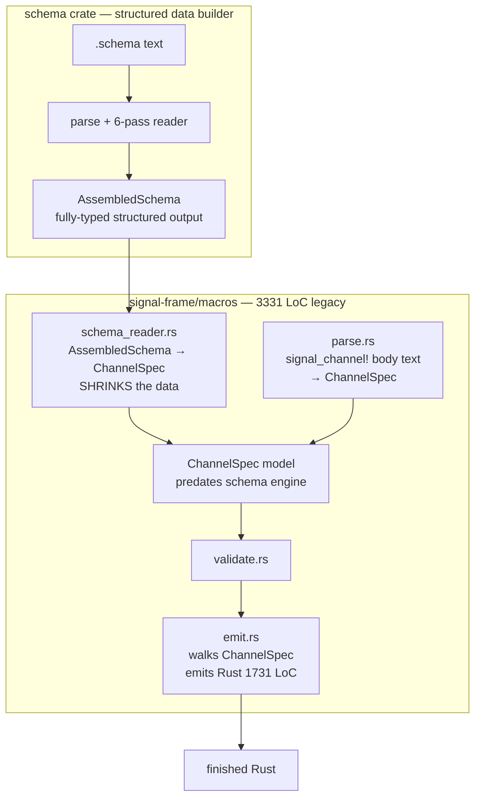
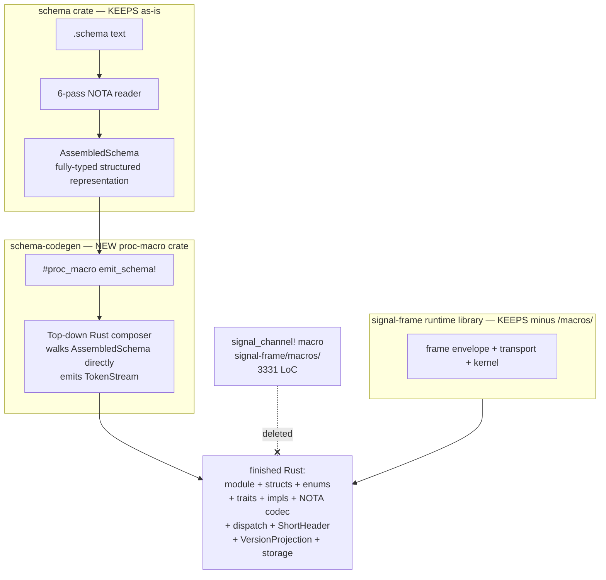

# 340 — schema emission as fresh top-down Rust composer (no legacy signal_channel!)

## Frame

Psyche correction 2026-05-25 (record 639):

> We are not rewiring back into an old implementation, we are redoing
> the entire macro generation because now we have fully structured data
> to fully emit rust from. This is essentially the rust code composer.
> So we are not reusing any old shitty macro system.

This report is the audit + re-implementation review you asked for. The
short answer: yes, every "schema-derived" emission today is still going
through the legacy `signal_channel!` infrastructure as an adapter, and
the `signal-frame/macros/` proc-macro subcrate IS the "brilliant macro
library" that 18+ ARCHITECTURE.md files name. The right architecture is
a fresh `schema-codegen` proc-macro crate that consumes `AssembledSchema`
and emits Rust directly — no `ChannelSpec` intermediary, no legacy
emit.rs, no compatibility window.

## §1 What was actually found

### §1.1 The whole-workspace signal_channel! tally

39 callsites of `signal_channel!` across the workspace. Two forms:

| Form | Count | Example |
|---|---|---|
| `signal_channel!([schema])` (schema-form) | **1** | `signal-persona-spirit/src/lib.rs:435` |
| `signal_channel! { channel X { ... } }` (legacy text) | **38** | every other contract crate |

Only `signal-persona-spirit` has migrated to schema-form. Every other
contract still uses the legacy text form. The schema-form callsite is
the one consuming the work the schema engine has been built for.

### §1.2 The "brilliant macro library" is signal-frame/macros/

The phrase comes from the workspace's own ARCHITECTURE.md files. Sample
quotes from 18+ ARCHITECTURE.md files that all say the same thing:

```
signal-frame/ARCHITECTURE.md:609
  The `macros/` proc-macro subcrate is the brilliant macro library itself.

nota-codec/ARCHITECTURE.md:196
  ... the brilliant macro library (in `signal-frame-macros`) consumes
  that tree to drive code emission.

signal-persona-spirit/ARCHITECTURE.md:129
  The brilliant macro library (`primary-ezqx.1`) reads the schema +
  emits all the wire types + ShortHeader projection + dispatcher +
  VersionProjection + storage descriptors.
```

The "brilliant macro library" is `/git/github.com/LiGoldragon/signal-frame/macros/`.
3331 LoC across 5 files:

| File | LoC | Role |
|---|---|---|
| `emit.rs` | 1731 | Generates the typed payload enums, kind enums, RequestPayload impl, frame aliases, stream witnesses, NOTA codec impls. Walks `ChannelSpec` (legacy model). |
| `schema_reader.rs` | 590 | Converter: `AssembledSchema` → `ChannelSpec`. The downconversion layer. |
| `validate.rs` | 457 | Validates the legacy `ChannelSpec` shape. |
| `parse.rs` | 302 | Parses the legacy `signal_channel! { ... }` body syntax into `ChannelSpec`. |
| `model.rs` | 180 | `ChannelSpec` / `RequestBlockSpec` / `ReplyBlockSpec` / `EventBlockSpec` — the legacy model types. |
| `lib.rs` | 71 | `#[proc_macro] fn signal_channel`, dual-input dispatch. |

### §1.3 The current "schema-driven" path is an adapter

`signal_channel!([schema])` does this:

```rust
// signal-frame/macros/src/lib.rs:50-72
pub fn signal_channel(input: TokenStream) -> TokenStream {
    let spec = if input.to_string().trim_start().starts_with('[') {
        match schema_reader::read_default_schema() {
            Ok(spec) => spec,
            Err(error) => return error.into_compile_error().into(),
        }
    } else {
        match syn::parse::<ChannelSpec>(input) { /* legacy text */ }
    };
    if let Err(error) = validate::validate(&spec) {
        return error.into_compile_error().into();
    }
    emit::emit(&spec).into()
}
```

The `[schema]` branch calls `schema_reader::read_default_schema()` which:

1. Reads `<crate>/<stem>.schema` file via `LoadedSchema::read_path`
2. Builds `AssembledSchema` via the schema crate (the entire macro engine
   we've been building)
3. Constructs a `SchemaConverter` and calls `into_channel_spec()`
4. **Downconverts `AssembledSchema` → `ChannelSpec`** (the legacy model)
5. Returns `ChannelSpec`

Then the SAME `validate + emit` pipeline runs against the downconverted
model. The schema engine's structured output is reduced to the legacy
model BEFORE emission. The emission code never sees `AssembledSchema`;
it walks `ChannelSpec` like it always has.

### §1.4 Information loss in the downconversion

The `into_channel_spec` converter is in `signal-frame/macros/src/schema_reader.rs:71-100`:

```rust
fn into_channel_spec(self) -> syn::Result<ChannelSpec> {
    let name = channel_name_from_manifest();
    let request = self.request_block()?;
    let reply = self.reply_block()?;
    let event = self.event_block()?;
    let streams = self.stream_blocks(&request, event.as_ref())?;
    let request = request_with_open_streams(request, &streams);
    let observable = self.observable_block()?;
    let schema = Some(self.schema_spec()?);

    Ok(ChannelSpec { name, request, reply, event, streams, observable, schema })
}
```

The `request_block()` enforces an MVP constraint that's a direct
information-loss signal:

```rust
// schema_reader.rs:108-114
if !seen_roots.insert(root.clone()) {
    return Err(syn::Error::new(
        Span::call_site(),
        format!("schema macro MVP supports one endpoint per operation root; \
                 `{root}` has multiple endpoints"),
    ));
}
```

The schema CAN represent multi-endpoint operation roots (per record
land in operator/181). The legacy `ChannelSpec` CAN'T. So the converter
errors out instead of expressing the richer shape.

Things `AssembledSchema` carries that `ChannelSpec` does not naturally
hold:

- **Module-per-schema output** (record 620) — `ChannelSpec.name` is one
  identifier; there's no notion of a containing schema module.
- **Fully-qualified internal names** (record 621) — `ChannelSpec` types
  are unqualified `syn::Type`; the qualification is lost at conversion.
- **`Upgrade` feature** (record 596, /189 §10) — `ChannelSpec` has no
  upgrade rule emission path; conversion drops it.
- **Multi-endpoint header roots** — proven by the `seen_roots` guard.
- **Bracket convention reform** (records 628/630) — `ChannelSpec` predates
  this; the legacy parse path can't even ingest the new authored shape.
- **Field-name-derived-from-type-name** (records 614/615/617) — the
  legacy `ChannelSpec` shape has `SchemaField { name, type }` pairs;
  the conversion has to invent names back from the schema.
- **`(MacroLibrary path)` user-macro loading** (records 606 + /338 §5.2)
  — no path into legacy emission.

Every one of these is a load-bearing schema engine feature. Every one is
lost at the `into_channel_spec` boundary.

### §1.5 What's in /338 §6.1 (the "brilliant macro library" note) — and why it's wrong now

/338 §6.1 reads: "The brilliant macro library (proc_macro consumer of
`AssembledSchema`) emits ONE Rust module per `.schema` file." That's
endorsing the CURRENT direction — using `signal_channel!` as the
brilliant macro library, with module wrapping added per record 620.
The /193 report names two implementation paths for the module wrap:

```
reports/second-designer/193 lines 320-322:
  (a) `signal_channel!([schema])` macro EMITS a module wrapper: …
  (b) Multiple per-type modules: macro emits mod operations/types/codecs …
```

Both paths keep `signal_channel!` as the macro entry. Both keep the
3331-LoC legacy infrastructure underneath. **Per record 639 both are
the wrong direction.** The right shape is a FRESH proc_macro that
consumes `AssembledSchema` directly, with `signal_channel!` and its
emit pipeline DELETED, not wrapped.

## §2 The current architecture (wrong)



The schema engine builds `AssembledSchema`; one adapter strips it back
to `ChannelSpec`; the SAME legacy emit pipeline runs.

## §3 The right architecture (proposed)



Three things:

1. **`schema` crate stays exactly where it is.** It's already a clean
   structured-data builder with no codegen entanglement (`src/lib.rs`
   has no `proc-macro = true`, no quote/syn deps in the lib; only in
   the public types).

2. **`schema-codegen` is a NEW proc-macro crate.** It depends on the
   `schema` crate for `AssembledSchema`. Single entry point: a proc-
   macro that takes a NOTA bracket-string path-or-name and emits
   finished Rust. Nothing else.

3. **`signal-frame/macros/` is deleted wholesale.** All 5 source files,
   3331 LoC, gone. The runtime side of `signal-frame` (frame envelope,
   transport, kernel) stays — that's library code, not macro code.

## §4 What `schema-codegen` emits, top-down

For one `.schema` file consumed by one wire-contract crate:

1. **Outer module** — `mod <schema_stem> { ... }` wraps everything
   (record 620).
2. **Namespace structs/enums/newtypes** — every declaration in the
   schema becomes a Rust type. Struct → `pub struct T { fields }`,
   Enum → `pub enum E { variants }`, Newtype → `pub struct N(T)`.
3. **Header-root operation enums** — `pub enum Operation { ... }`
   built from the ordinary-channel header. Multi-endpoint headers
   (record 596) expressed as nested enums or operation-trait dispatch.
4. **Reply enum + conversion impls** — `pub enum Reply { ... }` with
   `From<X> for Reply` for each variant payload.
5. **Event enum** — when `Event` feature is present, generates the
   event enum + stream-relation witnesses.
6. **Observable surface** — when `Observable` feature is present,
   injects standardized `Tap`/`Untap` operations + ObserverStream +
   ObserverSubscriptionOpened reply variant + ObserverSet runtime +
   publish methods (today in `emit::emit_observable_runtime`).
7. **NOTA codec impls** — `NotaRecord`/`NotaEnum` derives on the
   emitted types. Goes through `nota-derive` (per
   `nota-derive/ARCHITECTURE.md:106` integration target).
8. **Operation dispatch trait + impl** — `OperationDispatch` (today
   in `emit::emit_operation_dispatch`).
9. **Request payload impl** — `impl RequestPayload for Operation`
   (today in `emit::emit_request_payload_impl`).
10. **Kind enums** — `RequestKind` / `ReplyKind` / `EventKind` + their
    `kind()` accessor methods (today in `emit_request_kind` etc).
11. **Stream-relation witnesses** — `StreamKind` + stream relation
    impls when the channel is streaming (today in
    `emit_stream_kind_and_witnesses`).
12. **ShortHeader projection** — projection types for compact wire
    encoding (per ARCHITECTURE.md targets).
13. **VersionProjection impls** — `From`-chain for declared upgrades
    (record 596 + /189 §10). Subsumes the planned `UpgradeMacro` from
    /338 §8 item 2 (`primary-cklr`).
14. **Storage descriptors** — when the schema declares storage (redb
    table layouts), emits typed descriptors.
15. **Cross-schema imports** — `use other_module::Type` statements
    derived from the imports section (record 621 qualified names).

Every one of these is a direct walk of `AssembledSchema`. No
intermediate model. No legacy compat. The proc-macro body is a single
function: `fn emit_schema(input: TokenStream) -> TokenStream` that calls
into a `RustComposer` that walks `AssembledSchema` and produces
`proc_macro2::TokenStream` directly via `quote!`.

## §5 Invocation site

Each wire-contract crate (`signal-persona-spirit`,
`signal-orchestrate`, `signal-version-handover`, `signal-router`, …)
replaces its current `signal_channel!` invocation with:

```rust
schema_codegen::emit_schema!([spirit.schema]);
```

Per the NOTA single-argument rule (`skills/component-triad.md`), the
single argument is a NOTA bracket-string holding the schema-file path
or stem. Default-path resolution stays in the macro (uses
`CARGO_MANIFEST_DIR` as today), so most call-sites can omit the path
entirely:

```rust
schema_codegen::emit_schema!();    // looks for <crate-stem>.schema
```

No free-form macro body. No dual input mode. No `[schema]` vs `{ … }`
branch. One shape per call.

## §6 What gets deleted

Hard deletions when the migration completes:

| Path | LoC | Why deleted |
|---|---|---|
| `signal-frame/macros/src/lib.rs` | 71 | macro entry replaced by `schema-codegen` |
| `signal-frame/macros/src/emit.rs` | 1731 | replaced by `schema-codegen` composer |
| `signal-frame/macros/src/schema_reader.rs` | 590 | downconversion no longer exists |
| `signal-frame/macros/src/validate.rs` | 457 | validation is the schema engine's job now |
| `signal-frame/macros/src/parse.rs` | 302 | legacy text syntax gone |
| `signal-frame/macros/src/model.rs` | 180 | `ChannelSpec` deleted |
| `signal-frame/macros/Cargo.toml` | — | crate removed |
| `signal-frame/macros/` whole subdirectory | — | gone |
| **Total deleted** | **3331** | |
| 38 legacy `signal_channel! { ... }` callsites | varies | each becomes a `.schema` file + `emit_schema!()` |
| 1 schema-form `signal_channel!([schema])` callsite | 1 | retargets at `schema_codegen::emit_schema!` |
| `signal-frame/Cargo.toml` macros dependency | 1 line | dropped |

`signal-frame` itself stays — it's still the runtime library for frame
envelope, transport, and kernel. Its `src/lib.rs` (etc.) carry the
non-macro side. The `macros/` subcrate goes; nothing in
`signal-frame/src/` knows about it after the migration.

## §7 Migration order

Hard staging — each step lands a slice that's byte-equivalent or
demonstrably-correct before the next starts.

1. **Stand up `schema-codegen` crate skeleton.**
   - `proc-macro = true`, depends on `schema`, `nota-codec`, `nota-derive`
   - Public macro: `#[proc_macro] emit_schema`
   - Internal `RustComposer` walking `AssembledSchema`
2. **Target signal-persona-spirit's `spirit.schema` first** (the only
   live schema-form callsite). Compare byte-equivalent emitted Rust
   against current `signal_channel!([schema])` output. Integration
   test gate: same wire shape, same NOTA codec, same dispatch.
3. **Port one contract at a time** from legacy text form to
   `.schema` file + `emit_schema!()`. For each:
   - Author `<crate>.schema` (concept files already exist in 18+ crates
     under `<crate>/schema/<crate>.concept.schema` — rename + finalize)
   - Replace `signal_channel! { ... }` body with `emit_schema!()`
   - Verify wire compatibility via the consumer's integration tests
4. **Once the last legacy callsite is gone**, delete
   `signal-frame/macros/` wholesale. Update `signal-frame/Cargo.toml`
   to drop the macros dep. Update workspace `Cargo.toml`.
5. **Update `signal-frame/ARCHITECTURE.md`** + every consumer's
   ARCHITECTURE.md to remove "brilliant macro library is in
   signal-frame-macros" — point at `schema-codegen` instead.

The migration is bounded by the number of contract crates (~38). Each
port is mechanical once `schema-codegen` reaches feature-parity with
the existing `emit::emit` output for the spirit schema.

## §8 Open questions

1. **Crate name + location.** Candidates: `schema-codegen` (descriptive),
   `schema-emit` (short), `schema-macro` (explicit). Location:
   standalone crate vs sibling `proc-macro = true` subcrate inside
   the `schema` repo (`schema/codegen/`). Lean: standalone
   `schema-codegen` crate. Keeps the `schema` crate free of
   proc-macro2/syn deps for non-macro consumers (the upgrade engine
   wants `schema` as a pure library). Same pattern as
   `signal-frame` + `signal-frame-macros` separation today — but the
   new crate is `schema-codegen`, separate from any signal-frame.
2. **Runtime envelope home.** `signal-frame/src/` carries the frame
   envelope, request types, command-line glue today. After
   `/macros/` deletion, is the `signal-frame` name still right? Lean:
   yes, keeps the historical name for the runtime side. Optional
   rename to `frame-runtime` if the user prefers, but introduces
   churn across all consumers.
3. **Concept-stage `.schema` files.** 18+ crates have a
   `<crate>/schema/<crate>.concept.schema` planning artifact. These
   were drafted under the legacy assumption. Each needs a
   conversion sweep to the new bracket convention + field-name-from-
   type-name + module-per-schema discipline before becoming the
   real `.schema` consumed by `emit_schema!`. Lean: handle this in
   the per-crate migration step.
4. **Observable injection.** `emit::augment_with_observable` today
   injects `Tap`/`Untap` operations + observer enum variants when
   the channel declares observable. In `schema-codegen` this should
   be either (a) a `BuiltinSchemaMacro::ObservableFeature` that
   inserts into `AssembledSchema` at engine-time, or (b) a composer
   transform at emit-time. Lean: (a) — keeps emission as a pure
   walk; the schema engine already has macro-injection primitives.
5. **`primary-cklr` (UpgradeMacro emission).** /338 §8 had this as a
   separate operator slice. Now it's subsumed: `schema-codegen`
   walks the `Upgrade` feature and emits the `From`-chain itself.
   No separate `UpgradeMacro` crate. The real-pipeline MVP's
   `divergence_action.rs` + `mirror_gating.rs` stubs delete when
   `schema-codegen` reaches Upgrade-feature emission, same as
   /338's plan — just one composer instead of two.
6. **Validation responsibility.** Today `validate.rs` (457 LoC) checks
   `ChannelSpec` shape. In the new architecture, the SCHEMA ENGINE
   is the validator — `NodeDefinitionShape::recognize` + the macro
   pipeline produce typed errors at engine time. `schema-codegen`
   gets an already-valid `AssembledSchema`; no separate validation
   pass. Net: 457 LoC of validation moves to schema engine code
   (where it's already partly landed in `node_shape.rs` +
   `multi_pass.rs`).

## §9 What this means for /338 and the priority list

/338 §6.1 needs updating: "The brilliant macro library …" was implicitly
endorsing `signal-frame/macros/` as the consumer. Replace with the
`schema-codegen` framing.

/338 §7 Q22 ("Post-promotion `signal_channel!` deletion | HOLDS | Once
every contract is schema-derived, manual macro deletes") was correct
in direction but understated. **Deletion of `signal_channel!` is now
the architectural plan, not an end-state janitorial action.** The
right framing: `schema-codegen` REPLACES the brilliant macro library;
`signal_channel!` and `signal-frame/macros/` are deleted as the
replacement lands.

/338 §8 (priority list of next operator slices) updates:

| Old #2 | `primary-cklr` (UpgradeMacro Rust code emission) | → subsumed by schema-codegen's Upgrade-feature emission |
| NEW #1 | **Stand up `schema-codegen` crate** | proc-macro entry + RustComposer skeleton + spirit.schema parity |
| NEW #2 | **Port signal-persona-spirit to `emit_schema!`** | byte-equivalent test gate |
| NEW #3 | **Port the next 5 highest-value contracts** | establishes the migration cadence |
| Old #1 | `primary-602y` (signal-frame v0.1.0.1 retrofit) | STILL P0 — unrelated; cross-version handover blocker |
| Old #3-7 | fixed-point iter, user macros, module-per-schema emission, persona-daemon, delete streaming parser | unchanged; schema-codegen lands the emission slice |

/338 §10 mermaid label "signal_channel! schema-driven" → "schema_codegen
emits Rust top-down". The whole `emission[signal-frame macros]`
subgraph collapses to `emission[schema-codegen]`.

## §10 Concrete first commit shape

For the operator slice that lands `schema-codegen`:

```
schema-codegen/
  Cargo.toml          # proc-macro = true; depends on schema, nota-codec, nota-derive, syn, quote, proc-macro2
  src/
    lib.rs            # #[proc_macro] emit_schema entry + dispatch
    composer.rs       # RustComposer struct walking AssembledSchema
    module.rs         # mod <stem> { ... } wrapper emission
    types.rs          # struct/enum/newtype emission
    operations.rs     # request/reply/event enum + dispatch trait
    features.rs       # Observable injection + Upgrade emission + Event stream emission
    codecs.rs         # NotaRecord/NotaEnum derive emission
    qualified.rs      # cross-schema import resolution → use stmts
    error.rs          # composer-level errors (rare; engine already validated)
```

~1500-2000 LoC total target. About half the size of the deleted
`signal-frame/macros/` because there's no legacy parse, no legacy
validate, no downconversion adapter — just structured walk + emit.

## §11 Key paths

- `/git/github.com/LiGoldragon/schema/src/lib.rs` — schema crate public API; `AssembledSchema` is the input.
- `/git/github.com/LiGoldragon/signal-frame/macros/src/lib.rs:50-72` — current proc-macro entry; the dual-input dispatch to delete.
- `/git/github.com/LiGoldragon/signal-frame/macros/src/schema_reader.rs:71-100` — the `AssembledSchema → ChannelSpec` downconversion adapter.
- `/git/github.com/LiGoldragon/signal-frame/macros/src/emit.rs:19-73` — the legacy emit function structure (~15 sub-emits); maps 1-to-1 to `schema-codegen` components.
- `/git/github.com/LiGoldragon/signal-persona-spirit/src/lib.rs:435` — the only live schema-form callsite; the first migration target.
- `/git/github.com/LiGoldragon/signal-persona-spirit/spirit.schema` — the live schema; reference input.
- 18+ `/git/github.com/LiGoldragon/<crate>/schema/<crate>.concept.schema` — concept files needing migration sweep.

## §12 References

- Record 639 — psyche correction: schema-derived emission is a fresh
  top-down Rust composer; no legacy macro reuse
- Record 636 — meta-principle: psyche design decisions apply globally
- Records 628 / 630 — bracket convention reversal
- Records 614 / 615 / 617 — field name derivation from type names
- Records 620 / 621 — module-per-schema + fully-qualified names
- Record 606 — core vs extension macros
- /338 — schema engine refreshed vision (this report supersedes §6 +
  parts of §8 + §10's emission subgraph)
- /193 — module-output planning (proposed staying inside
  `signal_channel!`; superseded by this report)
- /188 — running-walkthrough (mermaid says `signal_channel! macro
  emits wire types`; superseded)
- /189 — macro system broader understanding (the macro engine design
  is unchanged; emission target changes)
- `signal-frame/ARCHITECTURE.md:596-609` — current self-description as
  brilliant macro library; needs rewrite
- `nota-codec/ARCHITECTURE.md:192-196` — current schema-reader-home
  description; needs rewrite
- `nota-derive/ARCHITECTURE.md:102-106` — derive integration; stays as
  emission target
