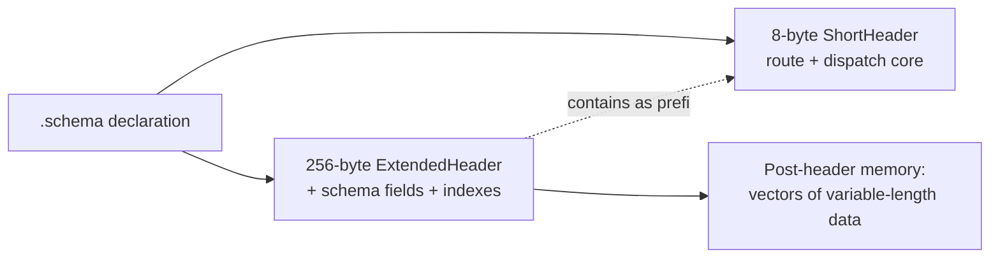
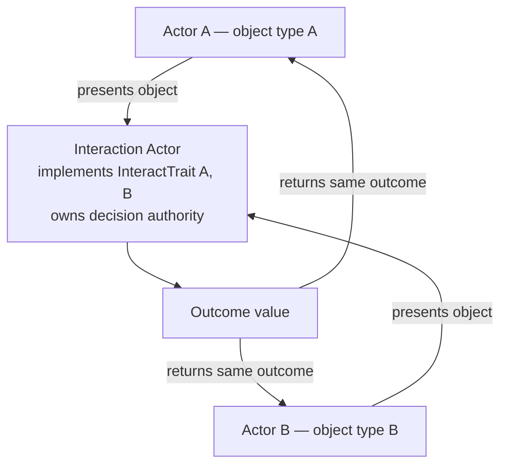
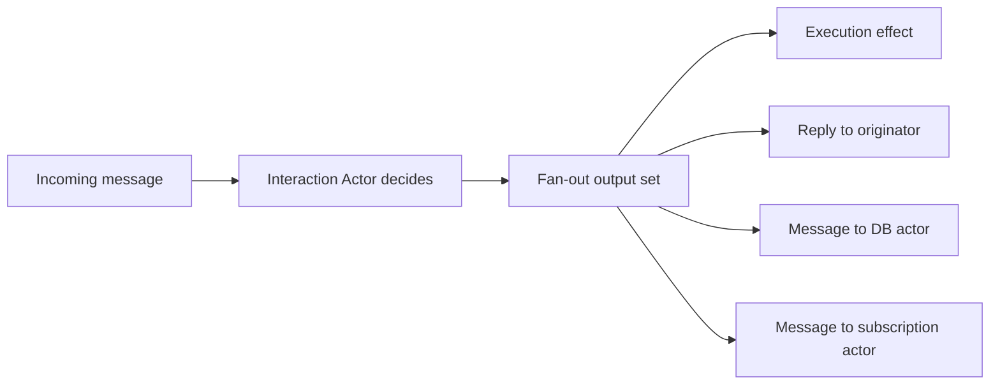
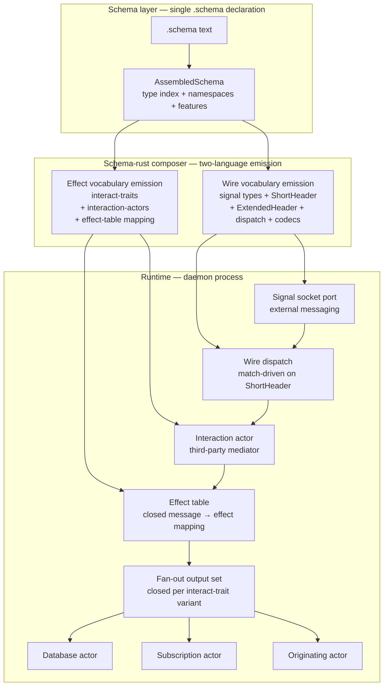

# 341 — schema crystallization: how the .schema declaration formalizes the architecture that was already emerging

## Frame

Psyche reflection 2026-05-25, captured as nine intent records (656-664).

The schema declaration is not a new architecture. It is the load-bearing precipitation of what the workspace was already structurally moving toward — instinctively in earlier ASCII sketches, practically through the components-with-databases detour, now formally in the `.schema` substrate. This report does the research: traces where each crystallized principle came from, names what is newly formalized vs reframed, and shows the synthesized architecture that emerges when the seven principles compose.

Psyche quote (record 656): *"this schema approach redefines or more like crystallizes the architecture around the schema declaration, which was already instinctively trying to emerge in ASCII in my previous works before this more practical approach first approach, which took me to creating components with databases. And now I am seeing this schema need again to create a stable, well, it is a self-describing code documentation."*

The "redefines or more like crystallizes" framing matters. The schema IS the architecture. It does not produce the architecture as output; it does not document the architecture from outside; it does not orchestrate the architecture as a side concern. The architecture LIVES inside `.schema` files. Code emission, wire format, documentation, dispatch tables — all are different projections of the same canonical schema data.

## §1 The trajectory — three phases

### Phase 1 — ASCII sketches (intuitive emergence)

Earlier designer reports (/320s and earlier) carried ASCII-form architectures: mermaid graphs with named actor topology, hand-drawn dispatch matrices, sketches of mediator roles. The structural shape was forming intuitively. The reports articulated relationships between actors, named contact points, drew fan-out arrows. But the substrate underneath was implicit; the documents WERE the architecture in a loose sense.

### Phase 2 — Components + databases (practical maturation)

The workspace then moved through a practical journey: persona-spirit, persona-orchestrate, signal-frame, signal-version-handover — each a concrete daemon with a redb-backed engine, a signal contract, three-socket topology. Wire formats coalesced (8-byte ShortHeader + extended frames). Internal actor patterns emerged (the supervisor + working actors + storage actor topology). Migration machinery materialized (mirror + divergence + recovery).

This phase produced WORKING SUBSTRATE but the architecture was scattered across:
- Hand-written `signal_channel!` macros (the wire side)
- Hand-written internal actor types (the effect side)
- Hand-written redb table schemas (the storage side)
- Hand-written dispatch matchers (the routing side)

Each was correct in isolation. None named the underlying single source.

### Phase 3 — Schema crystallization (current)

The schema engine work (records 600-664 + reports /336, /338, /340, /184) brought into focus the realization: the four hand-written surfaces above are FOUR PROJECTIONS of ONE canonical declaration. The `.schema` file IS the declaration; emission is the projection. The architecture LIVES IN the schema; the runtime is what the schema describes.

Record 656 names this directly: *"Schema is not a NEW architecture, it is the load-bearing precipitation of what the workspace was already structurally moving toward."*

## §2 The seven crystallized principles, traced

### §2.1 Schema as self-describing code + wire + docs (record 656)

**Crystallized statement:** One `.schema` file simultaneously serves as (a) code source (via `emit_schema!`), (b) wire format declaration (ShortHeader + extended-header projections), (c) self-describing architectural documentation. The schema IS the architecture; it does not produce the architecture as output.

**Seed in the workspace:** Every recent `.schema`-derived emission already produced wire types + dispatch traits + codecs. The third role (self-describing documentation) was implicit — agents read the `.schema` to understand the contract.

**Newly named:** The THREE simultaneous roles. Schema is not "primarily" any of them; it is all three at once. The format is intentionally self-describing — a fresh agent or human reading `spirit.schema` learns the architecture without needing a separate ARCHITECTURE.md.

**Implementation foothold:** `schema-rust` composer + `emit_schema!` proc-macro (live on signal-frame main as of today). Plus per record 657 the extended-header projection.

### §2.2 Extensible header pattern (record 657)

**Crystallized statement:** Current 8-byte (64-bit) header is the BASE; longer headers (256-byte / 512-byte / variable) are EXTENSIONS that CONTAIN the 8-byte form as prefix. Always parseable by code expecting only 8 bytes. Vectors of payload data live AFTER the header as memory arrays; the header carries length + type-of-vector indexes pointing at them. Most message structure fits in schema-defined header positions.

**Seed in the workspace:** signal-frame's existing 8-byte `ShortHeader` projection. Already operates as a fixed-shape prefix for the full frame. Already schema-derived (per the schema-rust composer's emission of `route_for_short_header`).

**Newly named:** The EXTENSION SEMANTICS. Future header forms are NOT replacements; they are prefix-preserving extensions. A 256-byte header begins with the same 8 bytes the current parser reads. Schema declares which fields fit in 8 bytes vs which need extended positions. Header growth is by extension, not by versioned wire-shape changes.

The post-header memory layout is also newly explicit: vectors as memory arrays after the message; header indexes (length + type-of-vector) point into them. This matches but formalizes existing rkyv-archived value behavior in the workspace.

**Implementation foothold:** `schema-rust` composer needs to emit BOTH `ShortHeader` (8-byte) and `ExtendedHeader` (256-byte / variable) projections from the same schema declaration. Single `.schema` file, multiple header projections.

### §2.3 Deep tree with type index (record 658)

**Crystallized statement:** Schema-defined type trees are normally 6-7 LAYERS DEEP (enum-of-struct-of-enum-of-struct-of-enum-of-struct etc). The same types are referenced in multiple places throughout the tree via a flat TYPE INDEX. Deep nesting is the normal shape; flat is the exception. Recursive walks handle arbitrary depth.

**Seed in the workspace:** `AssembledSchema` already supports type cross-references via fully-qualified names (records 619, 621). `qualified_name_for` projects local and imported types. The multi-pass NOTA reader + macro pipeline already compose recursively (per /338 §4.3 fixed-point iteration + record 603 two-phase dispatch with recursive composition).

**Newly named:** That 6-7 layer depth is NORMAL, not a smell. Architecture documents and code reviews should not push for "flatter schemas" or "shallow trees" — depth is the natural consequence of the schema engine's recursive composition. The TYPE INDEX as the canonical cross-reference resolution mechanism: same type referenced in many places resolves to ONE canonical declaration via the index.

**Implementation foothold:** `AssembledSchema::qualified_name_for` + `TypeExpressionMacro` recursive walk. The type index lives in `AssembledSchema`'s `local_types` + `imported_types` maps. Cross-reference resolution flows through these.

### §2.4 Two languages — internal effect + external wire (record 659)

**Crystallized statement:** Every component has TWO schema-derived vocabularies: (a) internal EFFECT language for actions inside the engine — how the daemon's internal actors operate on each other and on storage; (b) external WIRE language for messaging outside the engine — signal contracts, the typed wire protocol. Both derived from the same `.schema` file but emit to different surfaces.

**Seed in the workspace:** signal-frame distinguishes signal/effect at the architectural level (signal = wire; effect = local). persona-daemon, persona-spirit, persona-orchestrate all have internal actor types defined alongside their wire contracts. The split exists at the code level today.

**Newly named:** As TWO LANGUAGES with separate vocabularies, separate emission surfaces, separate ergonomics — but ONE `.schema` declaration. Wire vocabulary speaks to OTHER components via signal sockets (signal-frame envelope + ShortHeader + dispatch). Effect vocabulary speaks to internal actors within the same daemon (the engine's actor mediator surface).

The wire vocabulary is what `emit_schema!` currently produces. The effect vocabulary is the new emission surface the schema-rust composer must extend to cover.

**Implementation foothold:** `schema-rust` composer extension. /340 §4's 15-item emit inventory grows to ~21 items (see §5.1 below). Effect vocabulary lives in the schema's namespace section but emits as internal-actor message types rather than wire-payload types. New schema declarations may need an `(EffectVocabulary ...)` section parallel to the existing wire-vocabulary surface, or the existing namespace section can carry both with an `internal` / `external` tag per type.

### §2.5 Interact-trait + interaction-actor mediation (record 660)

**Crystallized statement:** Internal interactions between object types flow through an INTERACT TRAIT (Rust trait formalizing the contact point). When two object types need to interact, they pass through a third actor — an INTERACTION ACTOR — that decides the outcome and returns it to BOTH parties. Authority is delegated to a third-party mediator; no bilateral decisions; no trickery between paired actors; the mediator's decision is structurally final.

**Seed in the workspace:** Two seeds:

- `skills/enum-contact-points.md` — already articulated the principle of NAMED CONTACT POINTS where two type-trees meet, with deterministic mapping. The interact-trait is the formalization of this as a Rust trait at the contact point.
- `persona-daemon` supervisor + the third upgrade-socket in persona-spirit's three-socket topology — already implements the mediator pattern at the upgrade-handover layer. Ordinary actors don't decide bilateral cutover; the supervisor (third party) decides.

**Newly named:** Mediation as a STRUCTURAL pattern, not a policy / convention. The interact-trait + the interaction-actor are the canonical PAIR. The interact-trait IS the Rust trait at the contact point; the interaction-actor IS the runtime mediator that calls into the trait. Together they make the mediation pattern enforceable at the type level — you cannot accidentally write bilateral coordination because there is no trait surface for it.

**Implementation foothold:** New patterns. The schema-rust composer extends to emit:
- The `InteractTrait<A, B>` Rust trait per contact point declared in the schema
- The `<X>InteractionActor` mediator struct that owns the decision authority

Both flow from the schema's effect-vocabulary section (per §2.4).

### §2.6 Effect-table match-driven dispatch (record 661)

**Crystallized statement:** Schema declares an EFFECT TABLE: closed mapping from message types to effect types, with possible replies declared per message. Dispatch is match-driven through the interact-trait contact point: incoming message → mapped effect → mapped reply. No ad-hoc dispatch logic, no string-matched routing, no boolean-flag soup. Match always; map always; never compute when you can match.

**Seed in the workspace:** `skills/enum-contact-points.md` already established that engine logic is enum-vs-enum cross-product matching. Existing closed-enum dispatch lives across signal-frame's request kind dispatch, persona-spirit's operation dispatch, signal-version-handover's state dispatch. All match-driven.

**Newly named:** As the EFFECT TABLE. The schema CARRIES the table explicitly — each message variant in the wire vocabulary maps to a specific effect variant in the effect vocabulary, with the set of possible replies declared inline. Dispatch is THEN a structural match on the table; no runtime computation chooses the effect.

**Implementation foothold:** The schema's effect-vocabulary section (per §2.4) carries the table. Each wire-vocabulary variant references its mapped effect-vocabulary variant + the set of reply variants it can produce. Schema-rust composer emits the table as either a closed `match` block or as `impl InteractTrait` per pair (latter is the natural Rust shape per §2.5).

The "match always; map always; never compute when you can match" rule generalizes beyond dispatch to all engine logic. If you find yourself writing computation (string parsing, runtime type checks, dynamic field lookup), the schema's effect table is missing an entry — add it to the schema rather than computing it.

### §2.7 Actor fan-out execution (record 662)

**Crystallized statement:** Actor execution produces FAN-OUT outputs. When an interaction-actor decides an outcome, it emits multiple things in parallel: execution effects + responses returned to the originating actors + additional messages dispatched to other actors (typical: send a mutation message to the database actor, send a notification message to the subscription actor, return a reply to the requester — all from one interaction-actor decision). Single-input-multiple-output is the normal shape.

**Seed in the workspace:** `persona-daemon` supervisor + `persona-spirit` three-socket topology already operate in fan-out. The signal subscription mechanism is fan-out by construction (one event → N subscribers). The upgrade-handover ceremony is fan-out (mirror payload + state transition + reply, all from one operation).

**Newly named:** That SIMO (single-input-multiple-output) is the NORMAL shape, not the exceptional case. Actor architecture should default to fan-out. Per interact-trait variant, the SET OF POSSIBLE OUTPUTS is fixed and closed — schema declares it. Closed set, multiple outputs.

**Implementation foothold:** Schema-rust composer emits the fan-out outputs as a closed enum or struct per interact-trait variant. The interaction-actor's decision method returns this set; the runtime fan-out plumbing dispatches each element to its target.

## §3 What is newly named vs reframed

Of the seven principles, FOUR introduce genuinely new architectural names:

| Principle | New names |
|---|---|
| §2.1 Schema crystallized | Schema-as-architecture (vs schema-as-tool) |
| §2.2 Extensible header | "Extension semantics" (8-byte prefix preserved) |
| §2.5 Mediation | `InteractTrait`, `InteractionActor` |
| §2.6 Effect-table | "Effect table" as a noun for the closed mapping |

THREE acknowledge / formalize existing structure under new framing:

| Principle | Reframed term |
|---|---|
| §2.3 Deep tree | "Type index" (existed, now named); 6-7 layers normalized |
| §2.4 Two languages | "Effect vocabulary" + "Wire vocabulary" as the two surfaces |
| §2.7 Fan-out | SIMO as canonical, not exceptional |

The four newly-named patterns will need skill files (see §5.2). The three reframed patterns can attach to existing skill files (see §5.3).

## §4 The synthesized architecture

When the seven principles compose, this is the runtime shape of a single component:

Two emission paths, two languages, one schema declaration. The interaction actor sits at the architectural center — it owns the mediation authority; the effect table is its dispatch matrix; the fan-out output set is what it produces.

This is the synthesis. The substrate already exists in fragmentary form across signal-frame + persona-* + schema + nota-* repos. Crystallization names the fragments and makes the relationships explicit.

## §5 What this means for active substrate

### §5.1 schema-rust composer scope — expands from 15 → 21 items

/340 §4 listed 15 things `schema-rust` must emit (wire-vocabulary side). Per records 656-664, six more are added on the effect-vocabulary side:

| Item | Description | Side |
|---|---|---|
| 16 | Internal effect-language vocabulary types (internal actor message types, not wire types) | Effect |
| 17 | `InteractTrait<A, B>` Rust traits per contact point | Effect |
| 18 | `<X>InteractionActor` mediator structs + authority scaffolding | Effect |
| 19 | Effect-table dispatch — closed mapping from message variant → effect variant + reply set | Effect |
| 20 | Fan-out output sets — closed enum per interact-trait variant declaring all outputs | Effect |
| 21 | `ExtendedHeader` projection (256-byte / 512-byte / variable) alongside existing 8-byte ShortHeader, with the prefix-preservation invariant | Wire |

The composer's 570 current LoC will grow significantly. Implementation order: ShortHeader stability proven first (current state — landed); ExtendedHeader projection added next (likely operator slice); then effect-vocabulary emission (the bigger half).

### §5.2 New skill files needed

Four new skills to write, one per newly-named pattern:

| Skill | Topic | Tier |
|---|---|---|
| `skills/schema-as-architecture.md` | Schema as crystallized self-describing architecture (records 656) | Apex |
| `skills/extensible-header.md` | Extension semantics for wire headers (record 657) | Topic |
| `skills/interact-trait.md` | Rust-trait formalization at contact points (record 660) | Apex |
| `skills/interaction-actor.md` | Third-party mediator runtime (record 660) | Apex |
| `skills/effect-table.md` | Match-driven dispatch from closed mapping (record 661) | Apex |

These probably consolidate to one Apex skill `skills/schema-crystallized-architecture.md` that holds all seven principles in one place + four/five Topic skills that drill into specific mechanisms.

### §5.3 Existing skills to update

| Skill | What changes |
|---|---|
| `skills/enum-contact-points.md` | Add cross-reference to `interact-trait` as the Rust formalization of the principle; the contact point IS the interact-trait |
| `skills/actor-systems.md` | Add the interaction-actor pattern as the canonical mediation shape; fan-out as the normal output pattern |
| `skills/component-triad.md` | Reframe daemon side around effect vocabulary; clarify that CLI = thin signal client (wire vocabulary), daemon = wire dispatch + effect engine (both vocabularies) |
| `skills/nota-design.md` | Add the schema-as-architecture context — NOTA records express schema, schema IS architecture |
| `skills/skills.nota` | Add entries for the new skills above |

### §5.4 AGENTS.md hard overrides — possible additions

Candidates for new hard overrides (subject to user review):

- "Schema is the architecture, not a tool that produces it" — frames every schema-touching task as architectural work, not codegen plumbing
- "Internal interactions go through the interaction-actor mediator" — forbids bilateral actor coordination
- "Effect tables are closed at the schema; never extend dispatch surfaces at runtime"
- "Wire headers extend by prefix-preservation; never replace the 8-byte form"

These would harden the principles into per-keystroke discipline.

### §5.5 The conversion-of-heresy sweep (record 664)

Background subagent dispatched (audit-only, no rewrites yet) with the spec at `/tmp/heresy-inventory-spec.md`. Returns a markdown inventory categorized by which principle each flagged passage violates. The user reviews the inventory; designer proposes specific rewrites; subsequent sweeps execute the rewrites as per-repo feature branches.

The inventory scope:
- Workspace agent contract (AGENTS.md / ESSENCE.md / INTENT.md)
- Workspace skills (`skills/*.md`)
- Per-repo agent contracts + architecture + intent + skill files
- Recent designer + operator reports (last 30 each)

Out of scope:
- Build artifacts (`/target/`), historical worktrees, beads
- Legacy `intent/*.nota` files (append-only history)
- Spirit records (already canonical, cannot be heretical)

## §6 Why this report exists

Psyche framing in record 663: *"Put this down in the architecture of how we write code and then the intent. And I created a whole report on this and how this is the new revolutionary way everywhere."*

This report IS that report. It crystallizes the seven principles in one canonical statement. Skill files, ARCHITECTURE.md updates, and conversion sweeps all flow downstream from this document. The intent records (656-664) are the authority; this report is the synthesis; the skills and sweeps are the implementation.

## §7 What comes next (immediate)

1. **Heresy inventory** (in flight, background subagent) — returns categorized list of contradicting passages
2. **Skill consolidation** — write `skills/schema-crystallized-architecture.md` (Apex) holding all seven principles + the cross-references to existing skills
3. **Per-mechanism skill drills** — write the four/five Topic skills naming the new patterns
4. **AGENTS.md hard overrides** — add the proposed entries (subject to user review)
5. **schema-rust composer extension** — operator slice expanding the composer from 15 → 21 emission items (most importantly: ExtendedHeader projection, interact-trait emission, effect-table emission, fan-out output sets)
6. **Existing skill updates** — patch enum-contact-points + actor-systems + component-triad + nota-design with the crystallized framing
7. **ARCHITECTURE.md sweep follow-on** — once inventory returns, dispatch parallel rewrite subagents per principle violation cluster

## §8 References

- Intent records 656-664 — the seven crystallized principles (this turn's nine captures including the load-bearing + heresy-sweep records)
- `/336` — predecessor designer vision (superseded by /338)
- `/338` — schema engine refreshed vision (updated 2026-05-25 with schema-rust + emit_schema! naming)
- `/340` — schema emission no-legacy review (this morning's audit; 15-item emit inventory)
- `/184` — operator schema macro old-emitter audit (composer library structure)
- `skills/enum-contact-points.md` — pre-crystallization seed for interact-trait
- `skills/actor-systems.md` — pre-crystallization seed for interaction-actor mediation
- `skills/component-triad.md` — pre-crystallization seed for two-language split
- `skills/nota-design.md` — pre-crystallization seed for schema-as-self-describing
- `ESSENCE.md` / `AGENTS.md` / `INTENT.md` — workspace contract
- `/tmp/heresy-inventory-spec.md` — the inventory sweep's authoritative spec (in flight)
- `/git/github.com/LiGoldragon/signal-frame/schema-rust/src/lib.rs` — composer library (570 LoC as of e4e1581c; expanding)
- `/git/github.com/LiGoldragon/signal-frame/macros/src/schema_entry.rs` — `emit_schema!` proc-macro entry (live)
