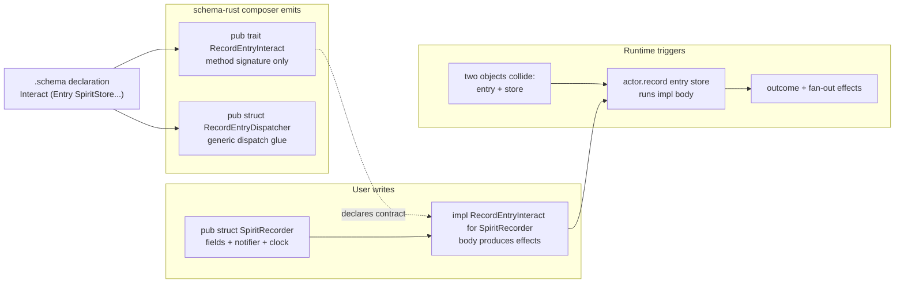

# 342 — Interact-trait pattern, in code

*Designer report responding to psyche clarification 2026-05-25 (record 665) refining the interact-trait/interaction-actor pattern from record 660 + /341 §2.5.*

## Frame

Psyche clarification (record 665):

> some of these might actually be implemented in just in traits, right? So it is not like we have to emit necessarily a full implementation for everything, it is just that then these traits have to be defined. That is how we produce effects is through implementing these interaction traits between the interaction objects, basically, which will then trigger. So when these two objects meet to interact, then they will trigger that interaction agent, which is where the implementation is.

Yes — this makes sense. The model has THREE layers:

1. **Schema emits the TRAIT DEFINITION** — the contract surface, not a full impl. This is `schema-rust`'s job.
2. **User writes the IMPL on the interaction-actor type** — the body where effects are produced. This is human (or hand-with-LLM) code.
3. **Runtime DISPATCHES to the actor** when two objects collide at the contact point — this is the daemon's wiring.

`/341 §2.5` originally implied schema-rust might emit actor scaffolding too. This clarification narrows the emission scope: schema-rust emits **just the trait + the dispatcher glue**. The actor and its impl are user code. Effects are produced INSIDE the impl, not generated by schema.

## §1 What schema emits (the trait + the dispatcher glue)

`.schema` declares the interaction:

```nota
Interact [Entry SpiritStore RecordOperation] [
  outcome [RecordSummary]
  effects [StoreInsert NotifyObservers ReplyToCaller]
]
```

`schema-rust` composer emits the trait:

```rust
pub trait RecordEntryInteract {
    fn record(
        &self,
        entry: Entry,
        store: &SpiritStore,
    ) -> RecordSummary;
}
```

That is it for the trait emission. No body. No actor struct. No effect generation. Schema-rust emits the contract surface and stops.

Schema-rust also emits the dispatcher glue — the code that ROUTES from the two colliding object types to the actor:

```rust
pub struct RecordEntryDispatcher;

impl RecordEntryDispatcher {
    pub fn dispatch<Actor: RecordEntryInteract>(
        actor: &Actor,
        entry: Entry,
        store: &SpiritStore,
    ) -> RecordSummary {
        actor.record(entry, store)
    }
}
```

This is the schema-rust composer's emission scope for the interact-trait pattern: trait + dispatcher. ~10 lines per interaction declared in the schema.

## §2 What user writes (the interaction-actor impl)

The user (or operator) writes the interaction-actor type and its impl. The body of the impl is WHERE EFFECTS HAPPEN:

```rust
pub struct SpiritRecorder {
    notifier: ObserverSet,
    clock: Clock,
}

impl RecordEntryInteract for SpiritRecorder {
    fn record(
        &self,
        entry: Entry,
        store: &SpiritStore,
    ) -> RecordSummary {
        let stamped = StampedEntry {
            entry,
            date: self.clock.today(),
            time: self.clock.now(),
        };
        let summary = store.insert(stamped);
        self.notifier.notify(&summary);
        summary
    }
}
```

The impl body produces THREE effects in fan-out (per /341 §2.7):
- stamps the entry with date/time (computed effect)
- writes to the store (storage effect — `store.insert`)
- notifies observers (subscription effect — `self.notifier.notify`)

All hand-written. Schema generated the trait that DECLARES this method must exist and what its signature is. The impl IS the policy + the effects.

## §3 How runtime triggers (two objects meet → actor fires)

When two objects collide at the contact point (an `Entry` arrives + the `SpiritStore` is the target), the daemon dispatches to the actor:

```rust
async fn handle_record_signal(
    entry: Entry,
    recorder: &SpiritRecorder,
    store: &SpiritStore,
) -> Reply {
    let summary = RecordEntryDispatcher::dispatch(recorder, entry, store);
    Reply::RecordAccepted(summary)
}
```

Or even more directly, since the trait method is just a Rust method call:

```rust
let summary = recorder.record(entry, &store);
let reply = Reply::RecordAccepted(summary);
```

The DISPATCHER is the schema-emitted scaffolding that makes the wiring explicit; the actual call is just a trait method invocation. When the two objects "meet" — `entry` and `&store` are passed in — the actor's impl runs.

## §4 The model end-to-end



Three layers, one schema declaration, ~10 lines of emitted Rust per interaction, the rest is user code that fills the trait.

## §5 What this means for /341 §5.1 emit inventory

`/341 §5.1` listed the schema-rust composer expanding 15 → 21 emission items. The clarification narrows item 17:

| Before (/341) | After (record 665) |
|---|---|
| 17. `InteractTrait<A, B>` Rust traits per contact point | **17. INTERACT TRAIT — just the trait definition (method signature; no body)** |
| 18. `<X>InteractionActor` mediator structs + authority scaffolding | **18. DISPATCHER GLUE — generic dispatch struct routing to any `Actor: InteractTrait` impl (NOT the actor itself; the actor is user-written)** |

The actor struct + the impl body live outside schema-rust. They are operator/designer code, not composer output.

This shrinks the composer scope significantly. ~10 lines per interaction is the budget for trait+dispatcher emission. Effect production is in user code at the impl site.

## §6 Why this is consistent with `skills/enum-contact-points.md`

The existing `enum-contact-points.md` Apex skill names the SAME pattern at a higher level: "engine logic is enum-vs-enum cross-product matching; name the contact point — nested match or trait."

Per the skill's §4 example, the dispatch trait IS the contact point. The new record 665 clarification just makes this load-bearing: **the schema emits the trait at the contact point; the actor implements it; the effects are in the impl**.

`enum-contact-points.md` already shows this shape in examples 3-4 (heresy-inventory flagged them as needing `signal_channel!` → `emit_schema!` reframing — that's the surface-rename, not a model change).

## §7 What about the effects table from /341 §2.6?

Per record 661 (effect-table match-driven dispatch), the schema declares a closed mapping from message → effect → reply. The clarification doesn't change this:

- Schema emits the EFFECT enum (closed)
- Schema emits the trait that returns the effect (closed signature)
- User's impl body decides which effect arm to return based on policy

```rust
pub enum RecordOutcome {
    Accepted(RecordSummary),
    Rejected(RejectionReason),
}

pub trait RecordEntryInteract {
    fn record(&self, entry: Entry, store: &SpiritStore) -> RecordOutcome;
    //                                                     ^^^^^^^^^^^^^
    //                                                     closed effect-table return type
}

impl RecordEntryInteract for SpiritRecorder {
    fn record(&self, entry: Entry, store: &SpiritStore) -> RecordOutcome {
        if entry.size > MAX_SIZE {
            return RecordOutcome::Rejected(RejectionReason::TooLarge);
        }
        let stamped = StampedEntry { entry, date: self.clock.today(), time: self.clock.now() };
        let summary = store.insert(stamped);
        self.notifier.notify(&summary);
        RecordOutcome::Accepted(summary)
    }
}
```

The effect table is closed at the schema layer (the `RecordOutcome` enum); the impl body picks which arm to return. Match-driven dispatch happens at the CALL SITE of the trait:

```rust
match recorder.record(entry, &store) {
    RecordOutcome::Accepted(summary) => Reply::RecordAccepted(summary),
    RecordOutcome::Rejected(reason) => Reply::RecordRejected(reason),
}
```

Schema-rust emits the match-site dispatcher too (so the daemon's signal-handler does not hand-write the match):

```rust
pub fn dispatch_record_reply(outcome: RecordOutcome) -> Reply {
    match outcome {
        RecordOutcome::Accepted(s) => Reply::RecordAccepted(s),
        RecordOutcome::Rejected(r) => Reply::RecordRejected(r),
    }
}
```

This is the "match always; map always; never compute when you can match" principle from record 661 — schema closes the effect table, user picks the arm, schema closes the reply mapping.

## §8 Composite shape — full request handler

Putting it all together for a single signal entry-point:

```rust
async fn handle_record_request(
    entry: Entry,
    recorder: &SpiritRecorder,
    store: &SpiritStore,
) -> Reply {
    let outcome = recorder.record(entry, store);
    dispatch_record_reply(outcome)
}
```

Two lines of daemon code. The trait + dispatcher are schema-emitted. The actor is user-written. The handler just composes them. This is what the schema crystallization buys: **dispatch is trivial because the schema closes both ends**.

## §9 References

- Record 660 — original interact-trait + interaction-actor mediation principle
- Record 665 — clarification: traits are the primary emission surface, impls are user-written
- Record 661 — effect-table match-driven dispatch
- `/341 §2.5` — interact-trait pattern (updated by /342 §5)
- `/341 §5.1` — composer emit inventory (item 17 narrowed by /342 §5)
- `skills/enum-contact-points.md` — Apex skill naming the contact-point-as-trait pattern; gets a cross-reference + minor reframe per /341 §5.3
- `/git/github.com/LiGoldragon/signal-frame/schema-rust/src/lib.rs` — current composer; will need the trait-emission codepath added (~10 LoC per interaction declared)
