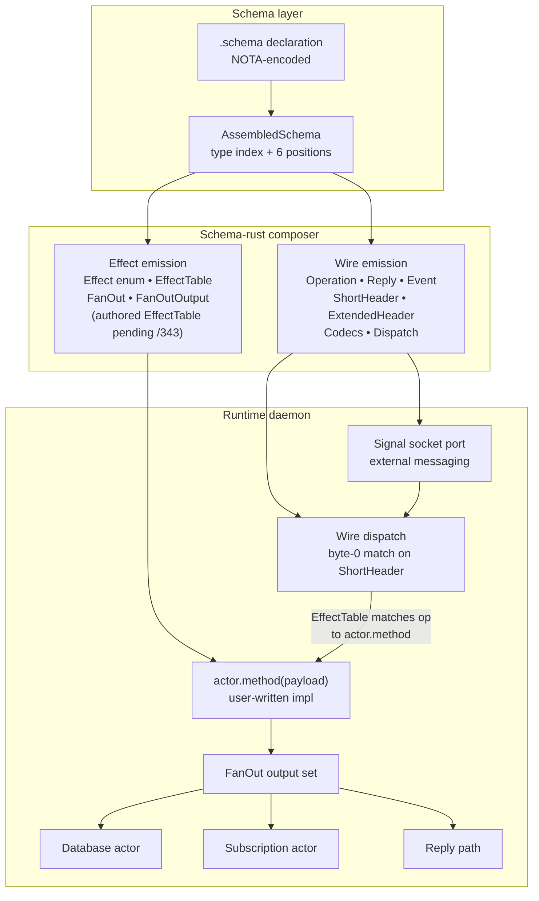

# 344 — the design, explained back

*A presentation of the architecture we built this session. Reads as slides — one idea per section, progressive depth.*

---

## Slide 1 — The thesis

**Schema IS the architecture.**

Not a tool that produces the architecture. Not documentation around the architecture. Not codegen bolted on the side. The `.schema` file IS the load-bearing declaration; everything else is a projection of it.

```
       .schema declaration
              │
   ┌──────────┼──────────────┐
   ▼          ▼              ▼
  code     wire format    documentation
  (Rust)   (ShortHeader   (the .schema
           + Extended)     IS the doc)
```

One declaration. Multiple simultaneous projections. Per record 656.

---

## Slide 2 — The trajectory

We didn't invent this — it was emerging instinctively.

**Phase 1** (Aski language work — per record 667 correction; STT had mistranscribed "Aski" as "ASCII"): the structural patterns first emerged in `aski-core` — parse-tree contract types (body / domain / expression / module / pattern / primitive / program / statement / trait / type) and the askic↔veric↔semac triad (compiler / verifier / semantics). `vscode-aski` editor tooling. Deep typed trees, closed variants, recursive composition, syntax-verification-semantics separation — all established there before the workspace's component-with-databases phase.

**Phase 2** (substrate maturation): persona-spirit, persona-orchestrate, signal-frame, signal-version-handover. Hand-written `signal_channel!`, hand-written internal actors, hand-written redb tables. Four parallel surfaces, all correct, none unified.

**Phase 3** (crystallization): The realization that those four hand-written surfaces are FOUR PROJECTIONS of one canonical declaration. The `.schema` file holds the canonical form; emission produces the projections.

Per record 656: *"the schema approach ... crystallizes the architecture ... was already instinctively trying to emerge in ASCII"*.

---

## Slide 3 — One declaration, multiple projections

The schema crate's `AssembledSchema` is the structured form. From it, the `schema-rust` composer projects:

| Projection | Surface | Status |
|---|---|---|
| Rust types (structs / enums / newtypes) | code | ✓ live |
| Wire codecs (NOTA + rkyv) | code | ✓ live |
| Dispatch traits | code | ✓ live |
| ShortHeader (8-byte) | wire | ✓ live |
| ExtendedHeader (256-byte) | wire | ✓ scaffold landed |
| Operation enum + Reply enum + Event enum | code + wire | ✓ live |
| `From` chains for cross-version upgrades | code | pending (subsumes `primary-cklr`) |
| Effect enum + EffectTable + FanOut | code | scaffold; awaiting authored EffectTable |
| Storage descriptors (redb tables) | code | future slice |

Schema-rust does NOT emit:
- Actor logic (methods are user code; the schema declares signatures, the user writes bodies)
- Daemon supervision (persona-daemon is its own substrate)
- Storage policy (the descriptor is schema; the implementation is user code)

Live in production today via `emit_schema!` proc-macro at `signal-frame/macros/src/schema_entry.rs`. Composer library at `signal-frame/schema-rust/src/lib.rs` (~570 LoC, no `proc-macro = true`, unit-testable in isolation).

---

## Slide 4 — Two languages from one schema

Every component has TWO schema-derived vocabularies from the SAME `.schema` file:

```
                  .schema declaration
                         │
              ┌──────────┴──────────┐
              ▼                     ▼
     WIRE VOCABULARY          EFFECT VOCABULARY
   (external messaging       (internal actor
    via signal sockets)       methods + storage)
              │                     │
       Operation/Reply/Event   Effect/EffectTable/
       ShortHeader/Dispatch    FanOut/FanOutOutput
```

**Wire vocabulary** speaks to OTHER components via signal sockets — the signal-frame envelope, ShortHeader, dispatch. This is what `signal_channel!` always emitted.

**Effect vocabulary** speaks to internal actors within the SAME daemon — what message to send to the storage actor, what to publish on the subscription set, what to return as a reply. This is new — operator/185 scaffolded the runtime types; /343 designs the authored schema syntax.

Two languages, one file. Per record 659.

---

## Slide 5 — Extension semantics for headers

Headers grow by EXTENSION, not by replacement.

```
ShortHeader (8 bytes — current production):
┌──────┬──────┬──────┬──────┬──────┬──────┬──────┬──────┐
│ byte │ byte │ byte │ byte │ byte │ byte │ byte │ byte │
│  0   │  1   │  2   │  3   │  4   │  5   │  6   │  7   │
│ root │ sub  │ sub  │ sub  │ sub  │ sub  │ sub  │ sub  │
│ verb │ var  │ var  │ var  │ var  │ var  │ var  │ var  │
└──────┴──────┴──────┴──────┴──────┴──────┴──────┴──────┘

ExtendedHeader (256 bytes — operator/185 scaffold):
┌────────────────────────────┬─────────────────────────┐
│   [bytes 0..8 = ShortHeader  ] │  bytes 8..256: extended │
│   prefix-preserved verbatim    │  schema-declared fields │
└────────────────────────────┴─────────────────────────┘
                                          │
                                          ▼
                          ┌───────────────────────────┐
                          │ post-header memory arrays │
                          │ vectors of variable-length│
                          │ data; header indexes into │
                          │ them                      │
                          └───────────────────────────┘
```

**Key invariant**: byte 0 stays at byte 0 across ALL header extensions. A parser expecting just 8 bytes still works correctly on a 256-byte ExtendedHeader. Per record 657.

Operator/185 landed the ExtendedHeader scaffold with `route_for_extended_header` delegating through the preserved prefix. Test: `emit_schema_generates_prefix_preserving_extended_header_projection` ✓.

---

## Slide 6 — Deep trees + type index

Schema-defined type trees are normally 6-7 layers deep. Enum-of-struct-of-enum-of-struct etc.

```
Operation                              <- enum (3 variants)
  ├── State                            <- struct payload
  │     └── StateEndpoint              <- enum (2 variants)
  │           ├── Statement            <- struct payload
  │           │     └── String         <- newtype struct
  │           └── Declaration          <- struct payload
  │                 └── DeclarationKind <- enum (4 variants)
  │                       └── ...      <- ~3-4 more layers
  ├── Record                           <- struct payload
  │     └── Entry                      <- struct (6 fields)
  │           ├── Topic                <- newtype String
  │           ├── Kind                 <- enum (5 variants)
  │           ├── Summary              <- newtype String
  │           ├── Context              <- newtype String
  │           ├── Magnitude            <- enum (3 variants)
  │           └── Quote                <- newtype String
  └── Observe                          <- struct payload
        └── ...                        <- 6-7 layers
```

Same types appear in many places (e.g. `String` is referenced 7 times above). The **type index** in `AssembledSchema` is a flat namespace that every reference resolves into. One canonical declaration per name; arbitrary depth of nesting.

Per record 658: deep is normal. Don't push for flat schemas. Don't duplicate types inline. Recursive walks handle arbitrary depth without per-layer special-casing.

---

## Slide 7 — Methods are interactions

(The retraction story.)

Mid-session I over-elaborated: proposed an `InteractTrait` Rust trait layer formalizing object-pair interactions, plus an `InteractionActor` marker trait for mediator types. Designed three slides of architecture around this (records 660 + 665; /341 §2.5; /342 entirety; /343 §5).

You retracted it (record 666): *"retract the 'interact' trait idea, it doesnt work actually, methods are interractions, I dont know why I went on about this now"*.

Right call. The simpler model:

```
            Effect arrives
                  │
                  ▼
       ┌─────────────────────┐
       │  actor.method(...)   │   <- this IS the interaction.
       │  hand-written impl   │      No trait wrapper above it.
       └─────────────────────┘
                  │
                  ▼
              FanOut
        (the returns; closed
         per the schema)
```

**What we kept** (5 of 7 crystallized principles): schema-as-architecture, extension semantics, deep trees + type index, two languages, effect-table match-driven dispatch, actor fan-out execution.

**What we dropped**: `InteractTrait` + `InteractionActor` as a special Rust trait formalization; mediator-as-architectural-pattern (mediator survives as just "an actor with methods").

Operator/185 emitted `Interact<Input>` + `InteractionActor<Input>` traits in `schema-rust` — those are unnecessary scaffolding now, pending unwind.

---

## Slide 8 — Closed dispatch: match always, never compute

The schema closes both sides of dispatch:

```
incoming Operation                 outgoing Reply
       │                                 ▲
       │                                 │
       ▼                                 │
  EffectTable                       reply-dispatch
  (closed mapping                   (closed mapping
   schema-declared)                  schema-declared)
       │                                 │
       ▼                                 │
   actor.method(payload)  ────────►  FanOut
   (user-written impl)              (closed output set
                                     schema-declared)
```

At every step:
- Schema declares the closed type
- Runtime MATCHES against it (no string parsing, no boolean flags, no HashMap<String, _>)
- The only computation is the policy decision INSIDE the actor's method body

Per record 661: *"Match always; map always; never compute when you can match."*

The `FanOut` output set carries multiple things in parallel — a database mutation, a subscription notification, a reply to the caller, possibly an event to broadcast. SIMO (single-input-multiple-output) is the normal shape per record 662.

---

## Slide 9 — The synthesized architecture



One schema declaration → two emission paths → runtime composes the projections into a working daemon.

The wire-side path is FULLY LIVE today (operator/185). The effect-side path has the runtime scaffold but awaits authored schema syntax (/343 pending implementation).

---

## Slide 10 — State of play

**Live in production main today** (commit-ID-trackable):
- `signal-frame/schema-rust/` composer library
- `signal-frame/macros/src/schema_entry.rs` — `emit_schema!` proc-macro entry
- `signal-frame/macros/Cargo.toml` description: "Proc-macro front door for emit_schema! plus migration-only legacy_signal_channel!"
- `signal-persona-spirit` migrated to schema-form (`signal_channel!([schema])` at lib.rs:435)
- ExtendedHeader scaffold + 5 emit_schema integration tests + 1 schema-rust unit test all passing
- CI gate in flake.nix: *"emit_schema/schema-rust path must not use the legacy ChannelSpec emitter"*
- 28 docs-rename branches pushed across affected repos (schema-rust + emit_schema! rename sweep)
- 17 intent records captured this session (650-666 + earlier 642-649)

**Designed, awaiting implementation**:
- Authored EffectTable + FanOutTargets feature variants in schema crate (/343)
- 38 contract crate migrations from legacy text-form `signal_channel! { ... }` to `emit_schema!()`
- Operator/185 unwind of the `Interact` + `InteractionActor` trait scaffolding (post-retraction)
- Heresy inventory rewrites (designer-assistant/101 — 125-130 flagged passages across ~50 files; 80-90% mechanical-sweep candidate)
- `signal-frame/macros/` wholesale deletion (waits for last legacy migration)
- Existing skill files (`enum-contact-points`, `component-triad`, `subscription-lifecycle`) + signal-frame/ARCH §1-5 follow-on edits

**Pending design**:
- EffectTable row shape: 2-column `(<Op> <Effect>)` vs 4-column `(<Op> <Actor> <Method> <Effect>)`
- Method-tag enums: schema-declared closed enums vs derived from FanOutTargets usage
- Storage descriptors (redb tables): separate `(StorageDescriptor ...)` feature for future slice
- Possible new Apex skill `skills/schema-crystallized-architecture.md` consolidating the 5 surviving principles
- AGENTS.md hard overrides for the surviving principles (subject to review)

---

## Slide 11 — Five surviving principles (the bumper sticker)

1. **Schema IS the architecture** (record 656). One declaration, many projections, self-describing.
2. **Headers extend by prefix preservation** (record 657). 8-byte ShortHeader fits inside 256-byte ExtendedHeader; byte 0 always stays at byte 0.
3. **Deep trees + flat type index** (record 658). 6-7 layers normal; one canonical declaration per name; recursive walks handle depth.
4. **Two languages from one schema** (record 659). Wire vocabulary (external messaging) + effect vocabulary (internal actor methods + storage).
5. **Closed dispatch with fan-out outputs** (records 661 + 662). EffectTable closes operation → actor method mapping; FanOut closes the output set; SIMO is normal.

Five principles. Built on a substrate that already works (`emit_schema!` is live). Subsumes the previous "brilliant macro library" framing entirely. Replaces ~3331 LoC of legacy `signal-frame/macros/` with ~570 LoC of `schema-rust` composer + a 5-line proc-macro shell.

---

## Slide 12 — What you'd do next

Pick one (or batch):

**A. Notify operator about /185 unwind.** Write a follow-up brief: which traits to remove, which tests change, what survives. Pointer to record 666.

**B. Lock the EffectTable row shape.** 2-column or 4-column. Update /343 §3 + §6 for internal consistency.

**C. Trigger the heresy rewrite sweep.** Mechanical sweep on the 3 sentence templates (~80% mechanical) + supersession notes on historical reports + targeted skill-file edits. Use designer-assistant/101 as the worklist.

**D. Write the consolidating Apex skill** `skills/schema-crystallized-architecture.md` holding the 5 surviving principles in one canonical place.

**E. Migrate signal-orchestrate to `emit_schema!`** as the second real contract crate (first was signal-persona-spirit). Byte-equivalent integration test against the current legacy emission.

**F. Land the schema-language extension for EffectTable + FanOutTargets** in the schema crate (the next operator slice consuming /343).

All independently movable.

---

## References

- `/336` — predecessor designer vision (superseded by /338)
- `/338` — schema engine refreshed vision (updated 2026-05-25 with schema-rust + emit_schema! naming)
- `/340` — schema emission no-legacy review
- `/341` — schema crystallization (the 7 principles; §2.5 RETRACTED, §5.1 items 17-18 struck)
- `/342` — interact-trait code walkthrough (ENTIRELY RETRACTED per record 666)
- `/343` — schema syntax for the effect side (EffectTable + FanOutTargets; §5 revised post-retraction)
- `/184` — operator schema macro old-emitter audit
- `/185` — operator schema crystallization implementation
- `designer-assistant/101` — heresy inventory
- Spirit records 642-649 (the seven crystallized principles, captured) + 650 (heresy sweep decision) + 656-664 (re-captured / load-bearing iterations) + 665 (retracted trait scope) + 666 (retraction of interact-trait)
- `signal-frame/schema-rust/src/lib.rs` — live composer
- `signal-frame/macros/src/schema_entry.rs` — live `emit_schema!` proc-macro
