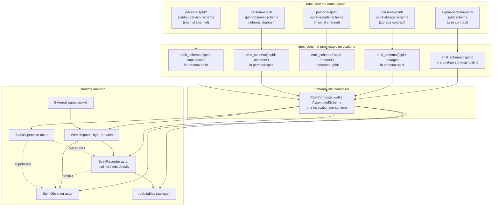

# 345 — Schemas as channel-contracts: refreshed architecture

*The fresh-night's-sleep synthesis. Integrates records 668-672 + the context-refresh findings at designer-assistant/102. Supersedes /341 §2.4-2.5, /343 §1-4, and the implicit single-schema-per-crate assumption running through /338 §6 + /340 + /184.*

## Frame

Psyche realization 2026-05-25 mid-session, captured as records 668-672 (then /102 surveyed the workspace through that lens):

> *"this warrants creating a schema so that I can inspect it easily ... external meaning also a database is external because it becomes state ... internal schemas too, it means we can change those, it doesn't break the database, it doesn't break the wire format ... all of the major actors get a schema for the type of messages ... the contract is a channel ... each contract gets a schema part ... we always write from the point of view of next ..."*

The retracted "interact trait" idea (records 660 + 665 + 666) was the wrong shape for the right intuition. The right shape is what THIS report names: schemas warrant per channel; contract IS channel; each channel-contract gets its own .schema file; multi-schema per crate; next/main/previous as the canonical version vocabulary.

This report is the canonical statement. /341 stays as the seven-principles synthesis but its §2.4-2.5 are now refined/superseded; /343 needs a v2 that pushes the EffectTable out of the wire schema into its own internal-channel schema. /102 is the working artifact that surfaced the refresh.

## §1 The intuition the interact-trait was reaching for

Record 666 retracted `InteractTrait` + `InteractionActor` as Rust abstractions ("methods are interactions"). Record 668 names what was actually being reached for:

> When the psyche describes a major part of the system, **that description IS a warrant** to create a schema for that part. The schema is the substrate for inspecting + interacting with that part of the system — author-facing, agent-facing, version-control-facing, runtime-facing.

The InteractTrait was trying to formalize the warrant as a Rust trait. The warrant IS NOT a Rust trait — it's a schema. The .schema file IS the surface the psyche interacts with. Code, runtime, docs, and verifier all flow from it.

Two consequences:

1. **No special Rust trait above methods.** Per record 666 — methods are interactions at runtime. Holds.
2. **Schemas warrant per channel.** Per record 668 — when something deserves to be named + inspected, it warrants a schema. New principle.

## §2 Contract = channel; schemas warrant per channel

The fundamental identity (record 668): **a contract IS a channel**. They are the same thing, spelled differently.

- The repository contract IS a channel
- The wire contract IS a channel
- The storage contract IS a channel
- Each internal-actor-message-vocabulary IS a channel

Schemas describe channels. **One channel = one contract = one schema.**

Where prior architecture had "one .schema file per component crate" (implicit assumption running through /338 §6.1, /340, /343), the new architecture has **one .schema file per channel-contract** — multiple per crate where the crate has multiple channels.

## §3 The three schema categories — per record 669

```
                          .schema declaration
                                  │
            ┌─────────────────────┼──────────────────────┐
            ▼                     ▼                      ▼
       EXTERNAL WIRE        EXTERNAL STORAGE         INTERNAL
       schemas              schemas                  CHANNEL
                                                    schemas
            │                     │                      │
            │                     │                      │
   wire contracts to      database/file state    actor message
   other components       surviving process       vocabularies
   via signal sockets     exit                    sharing process
                                                  memory
            │                     │                      │
   "external because     "external because        "internal because
    it crosses the        it survives runtime"     it lives in
    process boundary"                              process memory"
```

Refines record 659's "two languages (wire vs effect)" — that framing collapsed external into wire-only and internal into effect-only. The actual taxonomy is three categories: wire-external, storage-external, internal-channels.

Both external categories share the property "external to daemon runtime"; both internal categories share the property "lives in process memory". The line between external and internal is the **process boundary** + the **lifetime crossover** (storage lives past process exit, so it's external even when "on the same machine").

## §4 Schema locations follow contract source-of-truth — per record 670

| Category | Repo location | Why |
|---|---|---|
| Wire schema | `signal-<component>/<contract-name>.schema` | Wire affects compilation across MULTIPLE components; signal repo IS the cross-component boundary; Rust must see one canonical source |
| Storage schema | `<component>/<contract-name>.schema` (daemon repo) | Daemon and database operate together; database state is daemon-owned; same compilation unit |
| Internal channel schema | `<component>/<contract-name>.schema` (daemon repo) | Internal actors live inside daemon's process; same compilation unit as daemon |

**Multi-schema per crate is the new normal.** A crate might have:
- One wire schema (if it's a `signal-*` crate)
- One storage schema (if it's a daemon)
- N internal-channel schemas (one per major internal actor, if it's a daemon)

Worked example — `persona-spirit`:

```
signal-persona-spirit/
  spirit.schema              ← wire contract (the channel to spirit clients)
  owner-spirit.schema        ← wire contract (the owner channel)
  
persona-spirit/
  spirit-storage.schema      ← storage contract (redb tables)
  spirit-upgrade-log.schema  ← storage contract (upgrade ceremony log)
  spirit-recorder.schema     ← internal channel (recorder actor's messages)
  spirit-observer.schema     ← internal channel (observer actor's messages)
  spirit-supervisor.schema   ← internal channel (supervisor's messages)
```

Each is its own contract. Each is its own .schema. Each is its own AssembledSchema. Each is its own `emit_schema!()` invocation. Each emits its own Rust module.

## §5 The next/main/previous vocabulary — per record 672

**Authors always write from the point of view of NEXT.** Whatever is being written IS the next version.

- **NEXT** = the in-progress version being authored (author's perspective is ALWAYS next)
- **MAIN** = the current published baseline (imported as comparison point)
- **PREVIOUS** or **LAST** = the prior version (previous day, last message format, previous schema revision)

Development model:

```
    NEXT (in-flight authoring)
       │
       │   imports + compares against ↓
       ▼
    MAIN (published baseline)
       │
       │   was once next; now main
       ▼
    PREVIOUS / LAST (the prior iteration)
```

**Build optimization implication**: when `main == next` at the same revision, nothing has changed → no upgrade path needed → version-projection From-chain machinery can be elided → potentially smaller binary. When `main != next`, the upgrade machinery (UpgradeMacro per /338 §8 `primary-cklr`) emits the From-chain projecting main → next.

**Workspace-wide vocabulary discipline**: replace "historical" / "v0.1.0" / "old" with **previous** or **last** in author-facing contexts. The `mod historical` / `mod current_shape` migration-module pattern in `skills/spirit-cli.md` should be reframed as `mod previous` / `mod next` (or similar) — the canonical word-choice is previous/main/next.

**This also explains the extension-semantics-for-headers principle (record 657)**: the 8-byte ShortHeader prefix preservation IS this development model applied at the wire layer. Byte 0 of NEXT preserves byte 0 of MAIN. The prefix is what makes main importable INTO next. Same model, different layer.

## §6 The seven principles, refreshed

| # | Principle | Status |
|---|---|---|
| 1 | Schema IS the architecture (rec 656) | SURVIVES — strengthened by §2: schemas warrant per channel |
| 2 | Extensible header (rec 657) | SURVIVES — and now read as §5's vocabulary at the wire layer |
| 3 | Deep tree + type index (rec 658) | SURVIVES — unchanged |
| 4 | ~~Two languages (wire vs effect)~~ (rec 659) | **REFINED** — three categories (§3) |
| 5 | ~~Interact-trait + interaction-actor~~ (rec 660 + 665) | **RETRACTED** (rec 666) — superseded by §1 + §2 |
| 6 | Effect-table match-driven dispatch (rec 661) | SURVIVES — at the runtime level; moves to per-internal-channel-schema declaration (§8) |
| 7 | Actor fan-out execution (rec 662) | SURVIVES — at the runtime level |

Plus two new principles entering canonical status:

| # | Principle | Origin |
|---|---|---|
| 8 | Schemas warrant per channel; contract = channel (rec 668) | This refresh |
| 9 | Three schema categories (wire / storage / internal) (rec 669) | Refines rec 659 |

And one new discipline:

| # | Discipline | Origin |
|---|---|---|
| 10 | Authors write from NEXT; main is imported; previous/last is the prior (rec 672) | This refresh |

Net count: 6 enduring principles (1, 2, 3, 6, 7, 8) + 1 refined principle (9 refining 4) + 1 retracted (5) + 1 discipline (10) = **7 active principles + 1 vocabulary discipline**.

## §7 The synthesized architecture



Five schemas, five `emit_schema!` invocations, one composer, one daemon. Wire schemas in the signal-* crate; storage + internal schemas in the daemon crate. The runtime composes the projections into a working actor topology.

## §8 Where /343 went wrong — and how to fix it

/343 designed `EffectTable` + `FanOutTargets` as feature variants OF THE WIRE SCHEMA (positioned alongside Reply, Event, Observable in the features section of `spirit.schema`). That was the single-schema-per-component assumption showing up at the design layer.

**Per /102 + record 668**: the effect-table belongs in its OWN internal-channel schema (e.g., `spirit-recorder.schema`), not in the wire schema. Each internal channel has its own contract; the contract declares its own effect-table + fan-out outputs.

Corrected example — `spirit-recorder.schema`:

```nota
;; namespace section
RecordEffect [Entry Timestamp]
StoreInsertMessage [Entry]
NotifyMessage [RecordSummary]

;; features section
[
  (EffectTable [
    (HandleRecord RecordEffect)
  ])
  (FanOutTargets [
    (RecordEffect [
      (Store SpiritStore Insert)
      (Notify ObserverSet Publish)
      (Reply RecordAccepted)
    ])
  ])
]
```

Where `HandleRecord` is the recorder's INTERNAL message variant (declared in the recorder schema's own namespace section), `SpiritStore` is the storage actor (declared in `spirit-storage.schema`'s namespace), and `ObserverSet` is the observer actor (declared in `spirit-observer.schema`'s namespace).

The wire `spirit.schema` doesn't carry the effect-table at all. The daemon hand-writes the routing:

```rust
// persona-spirit/src/lib.rs — minimal daemon glue
async fn handle_wire_record(payload: RecordPayload, recorder: &SpiritRecorder) -> Reply {
    let fanout = recorder.handle_record(RecordEffect::from(payload));
    // dispatch fan-out outputs via the schema-emitted dispatcher
    dispatch_fanout(fanout).await
}
```

The wire schema doesn't know about the recorder. The recorder schema doesn't know about the wire. They COMPOSE at the daemon's lib.rs through hand-written glue. **Separation of concerns by schema boundary.**

`/343` will get a v2 (or supersession + replacement) implementing this corrected layout. Probably `/346` or numbered later.

## §9 The aski-core lineage

The structural patterns crystallized here emerged FIRST in your `aski-core` work (per record 667 correction — STT had mistranscribed "aski" as "ASCII" in record 656). Aski-core formalized a programming language's parse tree as a typed rkyv contract shared across the **askic ↔ veric ↔ semac** triad (compiler / verifier / semantics).

The schema-as-channel-contract architecture is the SECOND iteration of those insights, applied at the workspace-component domain instead of at the programming-language domain:

| Aski (programming language domain) | Schema (component workspace domain) |
|---|---|
| Parse-tree types in `aski-core/core/*.core` | Channel-contract types in `<crate>/<contract>.schema` |
| askic↔veric↔semac triad sharing one contract crate | wire-schema↔storage-schema↔internal-schemas sharing one architectural lens |
| Closed variants per syntactic category | Closed variants per operation root |
| Deep typed tree of parse nodes | Deep typed tree of operation/effect/storage nodes |
| Recursive composition of expressions | Recursive composition of types (TypeExpressionMacro) |
| Syntax-verification-semantics separation | Wire-storage-internal separation (§3) |

The 12 `aski-core/core/*.core` parse-tree primitives (body / domain / expr / module / origin / param / pattern / primitive / program / statement / trait / type) map structurally to the schema engine's `Declaration / Engine / Field / Payload / Variant / TypeExpression / Header / Feature / Upgrade / ImportDirective / Namespace / NodeDefinitionShape` primitives. Different domain; same structural insight.

## §10 What survives / what's superseded / what needs reframing — per /102

The context-refresh subagent at `/102` did the heavy lifting. Headline counts:

| Bucket | Count | What's there |
|---|---|---|
| Survives unchanged | ~38 passages | aski-core trio, ESSENCE/INTENT intent layer, /341's 5 surviving principles, /344's bumper-sticker slide, /185's runtime substrate, language-design NOTA discipline, actor-systems actor discipline, architectural-truth-tests witness discipline, contract-repo layering + versioning |
| Superseded | ~14 passages | /342 entire body (already retracted), /341 §2.5 + §5.1 items 17-18 (already retracted inline), /341 §5.2 entries for `interact-trait.md` + `interaction-actor.md` skills (DO NOT WRITE THESE — superseded by §1), /343 residual `<Operation>Interact` references in §1/§4/§7, single-schema-per-crate assumption running through /338 §6 + /340 §3-7 + /184 §"Correct Replacement Shape" + /185 §"Generated Shape" location, enum-contact-points §3-4 |
| Needs reframing | ~22 passages | component-triad triad-shape (extends with daemon-side storage + internal schemas), contract-repo "what goes in a contract repo" (multi-schema per crate), subscription-lifecycle kernel grammar (NOTA `.schema` shape, not `signal_channel!` text), /338 §6 module-per-schema output (now multi-module per crate via multi-schema), /343 §1-4 entire effect-table design (moves to internal-channel schema) |
| Freshly load-bearing | ~10 passages | /341 §2.1 schema-as-architecture, /185 "What I Discovered" paragraph (single highest-leverage; surfaced the location question 670 answers), /343 §1-4 pressure (forced the question that 668-670 answered), /344 Slide 1, component-triad Vocabulary, contract-repo Layered pattern (already multi-channel structurally), language-design §0 NOTA-as-substrate |

Key /102 observations worth surfacing:

1. **The single-schema-per-crate assumption is mostly IMPLICIT** — runs through ~12 files but is rarely stated. Lifting it is mostly nomenclature + convention work (`<crate>/<contract-name>.schema`), not deep rewriting.
2. **"Two languages" framing appears 6+ times** — needs **refinement notes**, not supersession, since three-category is the child of two-category. /341 §2.4 + /344 Slide 4 keep their substance; just add the three-category extension.
3. **The /101 heresy inventory is still valid** — only P4 (two languages) framings need downgrading from supersession to refinement.
4. **`aski-core/core/*.core` is the structural ancestor of record 668** — the "warrants from need-to-interact" framing has direct lineage in how Aski organized its parse-tree primitives.
5. **The triad is NOT contradicted** — both signal-* repos remain channel-schemas under the new framing. The triad shape EXTENDS without breaking; AGENTS.md hard override on the triad just needs one subordinate clause acknowledging daemon-side schemas.

## §11 Next-action sequence (priority order)

Per /102's recommendations, refined:

1. **/345 synthesis** ← THIS REPORT (done)
2. **/341 cross-reference** — add §"refresh" section pointing to /345 + record 668 + record 672; mark §2.4 as "refined" (not retracted)
3. **AGENTS.md hard-override extension** — extend the component-triad override with the subordinate clause "daemon-side gets multiple schemas (storage + internal channels)"; integrate the next/main/previous vocabulary as a new override
4. **`skills/component-triad.md` Vocabulary section** — add multi-schema-per-crate framing + the three-category taxonomy
5. **`skills/contract-repo.md` multi-schema** — formalize "what goes in a contract repo" as wire-channel-schemas (plural); contract repo can hold N schemas per channel
6. **`skills/subscription-lifecycle.md` reframe** — replace `signal_channel!` text grammar references with NOTA `.schema` channel-contract framing
7. **Operator slice — multi-schema loading** — extend `emit_schema!()` proc-macro to accept explicit contract-name parameter or path; lift the single-CARGO_PKG_NAME-stem assumption in `signal-frame/macros/src/schema_entry.rs`
8. **First storage schema example** — draft `persona-spirit/spirit-storage.schema` showing the redb table layout as schema declarations
9. **First internal-channel schema example** — draft `persona-spirit/spirit-recorder.schema` showing the recorder actor's message vocabulary + effect-table + fan-out (the corrected /343 design)
10. **/343 v2 or /346** — replace /343's wire-schema effect-table-feature design with the per-internal-channel-schema design (§8 above)
11. **Continue /101 heresy sweep** — execute the previously-queued rewrite sweep with the refined scope: P4 framings downgraded to refinement-flags; P1-P3 unchanged; the brilliant-macro-library template substitution is still the largest mechanical sweep
12. **DEFER: `skills/interact-trait.md` + `skills/interaction-actor.md`** — DO NOT WRITE these; retracted per record 666; replaced by /345 §1 + §2

Independently movable. Most are designer slices; #7 is operator territory; #8-9 can be either depending on appetite.

## §12 References

- Spirit records 656-672 — this session's load-bearing captures (the seven crystallized principles + clarifications + retractions + the channel-contract reframing + the next/main/previous vocabulary)
- Authority reports: `/341` (5 surviving + 2 retracted of 7 principles); `/344` (the presentation); `/340` (composer architecture); `/184` (operator composer model); `/185` (runtime substrate landing)
- Supersession targets: `/342` (entirely retracted; preserved historically); `/341 §2.5` + `§5.1 17-18` (already retracted inline); `/343 §1-4` (effect-table design needs v2 per §8); the single-schema-per-crate implicit assumption across `/338 §6` + `/340 §3-7` + `/184 §"Correct Replacement Shape"` + `/185 §"Generated Shape" location`
- Refresh artifact: `designer-assistant/102-context-refresh-schema-as-channel-2026-05-25.md` (commit 249d2a30) — the subagent's inventory under the new lens
- Heresy inventory: `designer-assistant/101-heresy-inventory-2026-05-25.md` — still valid; P4 framings move from "supersede" to "refinement"
- aski-core lineage: `/git/github.com/LiGoldragon/aski-core/core/*.core` (12 parse-tree primitives — the structural ancestor)
- Live substrate: `signal-frame/schema-rust/src/lib.rs` (composer); `signal-frame/macros/src/schema_entry.rs` (`emit_schema!` proc-macro); `signal-persona-spirit/spirit.schema` (the first migrated wire contract)
