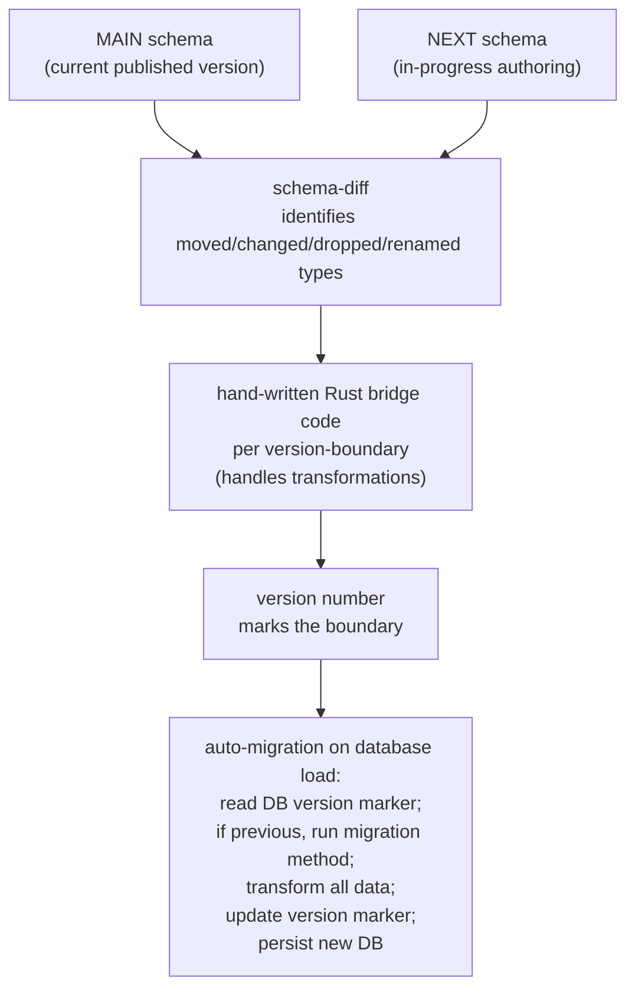
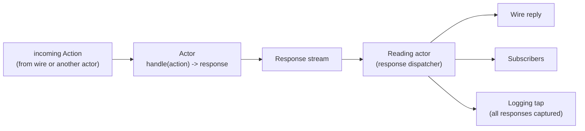

# 346 — Actor schemas + the upgrade mechanism

*Written down per psyche directive 2026-05-25 ("write this all down"). Captured as intent records 693-696. Sits downstream of /345 (schemas-as-channel-contracts refresh) and applies the channel-contract framing concretely to internal actors + the database upgrade flow.*

## §1 Every actor has a schema

Every actor in a daemon has its own schema — a channel-contract per record 668. Same machinery as the wire schema, same machinery as the storage schema, same machinery as the CLI schema. The "actor schema" is just another instance of the universal schema mechanism applied per-actor.

What an actor schema declares (two enums + a universal variant):

```nota
;; spirit-recorder.schema (the recorder actor's schema)

;; namespace section — types the actor traffics in
RecorderAction (RecordEntry ObserveRecorder GetStatus)
RecorderResponse (RecordAccepted RecorderObserved StatusReturned Unknown)

RecordEntry [Entry]
ObserveRecorder [QueryFilter]
GetStatus []

RecordAccepted [RecordSummary]
RecorderObserved [Vec RecordSummary]
StatusReturned [RecorderStatus]
Unknown [String]
```

Two structural commitments:

1. **ACTION enum** — the closed set of things this actor can do when called.
2. **RESPONSE enum** — the closed set of things this actor can say back, with a universal `Unknown` variant carrying the unrecognized-request string. Every actor knows how to say "I don't know what you're asking for".

The universal `Unknown` is the actor's safety floor. No matter what arrives, the actor has a structurally-valid response.

## §2 The engine is Rust; the structure is schema

Hand-written Rust is ONLY the engine logic — the decision-making bodies inside actor methods. Everything STRUCTURAL emits from the schema:

- NOTA-encoded form (for text reading/writing)
- rkyv binary form (for storage + wire)
- Rust data type definitions (struct, enum, newtype)
- Field accessors, codec impls, dispatch traits

The engine code consumes schema-emitted types and writes only logic. It doesn't reinvent data structures. This is the load-bearing boundary per record 694: **structure is schema; logic is Rust**.

Concretely:

```rust
// hand-written engine logic for the recorder actor
impl SpiritRecorder {
    pub fn handle(&self, action: RecorderAction) -> RecorderResponse {
        match action {
            RecorderAction::RecordEntry(entry) => {
                let stamped = StampedEntry::stamp_now(entry);
                match self.store.insert(stamped) {
                    Ok(summary) => RecorderResponse::RecordAccepted(summary),
                    Err(error) => RecorderResponse::Unknown(error.to_string()),
                }
            }
            RecorderAction::ObserveRecorder(filter) => {
                let records = self.store.query(filter);
                RecorderResponse::RecorderObserved(records)
            }
            RecorderAction::GetStatus(_) => {
                RecorderResponse::StatusReturned(self.status())
            }
        }
    }
}
```

The `match` is exhaustive (closed enum). The action types, response types, and codecs are schema-emitted. The body is logic.

## §3 rkyv: one binary, two homes — per record 695

The rkyv binary encoding is the SINGLE byte layout that lives in BOTH:

- **The database** (sema body at rest in redb)
- **The wire** (signal movement between clients over sockets)

Same bytes, two homes. NOTA is the text-readable projection emitted at CLI read time or for human inspection. The same `AssembledSchema` reads both contexts; the same encoded form survives storage and transport.

```
                          rkyv binary encoding
                                  │
              ┌───────────────────┴───────────────────┐
              ▼                                       ▼
          sema (body)                            signal (movement)
          stored in DB                           transit on socket
          (state surviving                       (channel between
           process exit)                          clients)
              │                                       │
              └─────────────┬─────────────────────────┘
                            ▼
                     NOTA text projection
                  (CLI read; human inspection;
                   .schema documentation)
```

Closes the schema-signal-sema trio (record 692) at the byte-encoding layer:
- **Schema** specifies (record 656)
- **Signal** moves (record 692; rkyv binary on wire)
- **Sema** holds (record 692; rkyv binary in DB)

One specification, one encoding, two homes, with NOTA as the text projection on top.

## §4 The upgrade mechanism — per record 696

Schema changes between versions. The mechanism:



Six concrete steps:

1. **Schema changes between versions** — author edits `<crate>/<contract>.schema` while writing NEXT; MAIN stays at the published baseline (per record 672 vocabulary)
2. **schema-diff identifies what's different** — what types are added, dropped, renamed, structurally changed; the diff machine consumes both AssembledSchemas and produces a typed diff
3. **Hand-written Rust bridge code per version-boundary** — for each MAIN → NEXT transition where data types moved, the developer writes the bridge (the From-impl, the field-mapper, the value-converter); the schema-diff identifies WHICH bridges need authoring
4. **Version number marks the boundary** — semantic versioning; the version-marker in the database is what tells the daemon which schema the persisted data was written under
5. **The new daemon is recompiled with the PREVIOUS schema also available** — so the migration code can see both shapes (current and previous); the `mod previous` / `mod next` Rust idiom (per the renamed `mod historical` / `mod current_shape` pattern from `skills/spirit-cli.md`)
6. **Auto-migration on database load** — the daemon's startup reads the DB's version marker; if it's the previous version, the migration method runs once, transforms all data to the next shape, updates the version marker, persists. New database. Change successful.

This is the **database-side upgrade story**. The wire-side upgrade (cross-version live handover; UpgradeMacro emission per /338 §8 `primary-cklr` + /343) is the complementary mechanism for in-flight messages. Both flow from the same schema diff; both consume the same bridge code patterns.

Assembled schemas can potentially be stored alongside the data to enable efficient diff later — if we serialize the AssembledSchema next to the data it described, comparing "what shape was this written in" vs "what shape do I read it as" is a direct AssembledSchema comparison, no inference needed.

## §5 The reading-actor runtime pattern

The user named this concretely: it's a mailing system. We define the mail of every actor with the spec.

Within a daemon:
- Each actor receives ACTIONS in its mailbox
- Each actor produces RESPONSES into a response stream
- A **reading actor** (response dispatcher) handles outbound — dispatching to wire reply, to subscribers, to logging
- Optional message-queue integration for asynchrony
- **Auto-tap to a logging facility** — the reading actor automatically forks every response into a log stream; all messages are capturable; nothing is invisible



The reading actor is itself an actor — with its own schema declaring its own action + response set. It's not a special hard-coded primitive; it's the same channel-contract pattern applied to the dispatch role.

## §6 The next/main/previous mapping for upgrades

Per record 672 vocabulary applied to the upgrade flow:

| Concept | What it is |
|---|---|
| **NEXT** | The schema being authored; the new daemon under compilation |
| **MAIN** | The published baseline; the schema the existing database was written under; the deployed daemon currently running |
| **PREVIOUS** / **LAST** | (in the bridge module) the prior shape that the migration code reads; equivalent to MAIN at the moment of compilation |

In the daemon source:
- `mod next` — current crate types (the new shape, what the new daemon writes)
- `mod previous` — the locally-redefined prior shape (what existing data was written as)
- The bridge — `From<previous::Entry> for next::Entry` impls per type that moved

Replaces the older `mod historical` / `mod current_shape` naming from `skills/spirit-cli.md` per record 672. Same pattern; canonical word-choice.

The version marker on disk says "this DB was written under MAIN". Daemon at NEXT runs the bridge to convert MAIN-shape bytes into NEXT-shape bytes, then writes the version marker forward.

When `main == next` at the same revision (no schema changes), the bridge code can be elided — smaller binary, no migration machinery compiled in. Build-time check: if AssembledSchema diff is empty, skip emitting the bridge module entirely.

## §7 Integration with prior work

| Prior framing | Now |
|---|---|
| /341 §2.1 schema-as-architecture | Strengthened — every actor's schema IS its part of the architecture |
| /341 §2.7 fan-out execution | Survives — actor's response is the fan-out output (closed enum) |
| /343 effect-table design | Corrected per /345 §8 — effect-table goes in the actor's OWN schema (this is the recorder's actor schema) |
| /345 §3 three categories | Internal channel schemas are exactly these actor schemas |
| /345 §7 multi-schema layout | Now concrete — each major actor's schema lives in `<daemon-crate>/<actor-name>.schema` |
| /338 §8 primary-cklr UpgradeMacro | DB-side migration story (§4 above) complements the wire-side version-projection that primary-cklr addresses |
| `skills/spirit-cli.md` historical/current-shape | Renamed previous/next per record 672 |
| skills/enum-contact-points.md | Holds — actor.handle(action) is the contact point between the inbound channel and the response channel; the action enum and response enum meet at the match block |

## §8 Implementation footholds

What the schema-rust composer needs (extends /340 §4 + /341 §5.1 inventory, post-retraction):

| Item | Description | Status |
|---|---|---|
| 1-15 | Wire-side emissions (existing) | LIVE |
| 16 | Actor schema's ACTION + RESPONSE enums per-actor | NEEDS authored EffectTable replacement (/345 §8) |
| 17 | Universal `Unknown` response variant injected into every actor schema's RESPONSE enum | NEW — a builtin macro variant per record 693 |
| 18 | rkyv codec for sema-storage uses | LIVE (signal-frame's existing rkyv path) |
| 19 | DB version marker emission + auto-migration scaffolding per record 696 | NEW |
| 20 | Schema-diff machinery (AssembledSchema vs AssembledSchema → typed diff) | NEW |
| 21 | `mod previous` / `mod next` bridge module emission scaffold (the From-impl shapes; bodies hand-written) | NEW — partly subsumed under primary-cklr |
| 22 | Assembled schema serialization (for diff archival alongside data) | FUTURE |

What the daemon side adds:
- Reading-actor runtime + logging tap (one new actor per daemon; could be common-library)
- Mailbox plumbing per actor (if not already in place)
- Auto-migration runner at daemon startup (reads version marker; routes through bridge if previous)

## §9 The universal Unknown response — a builtin macro

Per record 693, every actor schema's RESPONSE enum should carry the `Unknown` variant. Rather than authoring it manually in every schema, the schema engine should inject it via a builtin macro:

```nota
;; what the user authors
RecorderResponse (RecordAccepted RecorderObserved StatusReturned)

;; what the schema engine assembles (universal Unknown injected)
RecorderResponse (RecordAccepted RecorderObserved StatusReturned Unknown)
```

This is parallel to how `signal_channel!`'s existing observable macro injects `Tap`/`Untap` operations. Per /338 §5.1 core macros — `UniversalUnknownMacro` would be one of the ~10 always-loaded core macros. Lives in the schema crate's builtin set.

## §10 Worked example — persona-spirit's recorder

Full path, end to end:

1. Author edits `persona-spirit/spirit-recorder.schema`:
   ```nota
   [
     ;; imports
     [(SpiritStorage spirit-storage)]
     ;; headers (3-position — no wire channel for an internal actor; empty)
     [] [] []
     ;; namespace
     [
       RecorderAction (RecordEntry ObserveRecorder GetStatus)
       RecorderResponse (RecordAccepted RecorderObserved StatusReturned)
       RecordEntry [Entry]
       ObserveRecorder [QueryFilter]
       GetStatus []
       RecordAccepted [RecordSummary]
       RecorderObserved [Vec RecordSummary]
       StatusReturned [RecorderStatus]
     ]
     ;; features
     [(StorageDescriptor SpiritStorage)]
   ]
   ```

2. `persona-spirit/src/lib.rs`:
   ```rust
   schema_rust::emit_schema!("spirit-recorder");
   schema_rust::emit_schema!("spirit-storage");
   // ... other actor schemas
   ```

3. Schema-rust composer emits:
   - `mod spirit_recorder { ... }` containing `RecorderAction`, `RecorderResponse` (with `Unknown` injected), `RecordEntry`, etc.
   - rkyv codec impls on all types
   - NOTA codec impls
   - `From<previous::RecorderAction> for next::RecorderAction` scaffolding (bodies hand-written when next != main)

4. `persona-spirit/src/recorder.rs` (hand-written engine):
   ```rust
   use spirit_recorder::{RecorderAction, RecorderResponse, /* ... */};

   pub struct SpiritRecorder {
       store: SpiritStorage,
   }

   impl SpiritRecorder {
       pub fn handle(&self, action: RecorderAction) -> RecorderResponse {
           match action {
               RecorderAction::RecordEntry(entry) => { /* logic */ }
               RecorderAction::ObserveRecorder(filter) => { /* logic */ }
               RecorderAction::GetStatus(_) => { /* logic */ }
               // Universal Unknown handled by schema-emitted fallback; not in hand-written match
           }
       }
   }
   ```

5. Daemon startup reads version marker; runs migration through `mod previous` bridges if needed; opens database; starts actors; reading actor dispatches responses + logs.

## §11 Next-action sequence

1. **Builtin macro: `UniversalUnknownMacro`** — adds the `Unknown` variant to every RESPONSE-shaped enum declared in an actor schema. Designer work; small. Slot into the ~10 core macros per /338 §5.1.

2. **Schema-diff machinery** — `AssembledSchema::diff(previous: &AssembledSchema) -> TypedDiff`. Designer work + operator landing. Subsumes part of `primary-cklr`.

3. **`mod previous` / `mod next` emission scaffold** — schema-rust composer emits the bridge module structure; bodies hand-written per moved type. Maps to /338 §8 #2 (primary-cklr).

4. **DB version marker + auto-migration runner** — daemon-side library function; runs on startup; reads version marker; routes through bridges. Operator slice.

5. **Reading-actor + logging tap** — common-library actor; one per daemon. Operator/designer joint slice.

6. **First worked example** — write `persona-spirit/spirit-recorder.schema` + the recorder.rs engine; prove the whole chain end-to-end on existing Spirit substrate.

7. **Renaming `mod historical` → `mod previous` everywhere** — per record 672 vocabulary; small mechanical sweep across `skills/spirit-cli.md` + any existing migration modules.

Independently movable. The builtin macro (#1) is the smallest immediate slice; the diff machinery (#2) unlocks the rest.

## §12 References

- Spirit records 693-696 — actor schema + engine-as-Rust + rkyv-one-format + upgrade mechanism (this turn's captures)
- Records 656 + 668-672 + 692 — the prior crystallization context (schema as architecture; schemas warrant per channel; three categories; locations; next/main/previous; schema/signal/sema trio)
- `/345` — schemas-as-channel-contracts refresh (this report is downstream)
- `/341 §2.1` schema-as-architecture (strengthened here)
- `/343 §1-4` — effect-table design (now correctly placed inside actor schemas per /345 §8)
- `/338 §8 primary-cklr` — UpgradeMacro / version-projection emission (now bisected into DB-side §4 + wire-side primary-cklr)
- `skills/spirit-cli.md` substrate-migration discipline — `historical/current-shape` rename to `previous/next` per record 672
- `skills/enum-contact-points.md` — actor's match block is the contact point between action enum and response enum
- `signal-frame/schema-rust/src/lib.rs` — composer (expands per §8)
- `signal-frame/macros/src/schema_entry.rs` — `emit_schema!` proc-macro (needs contract-name parameter per /345 §11)
