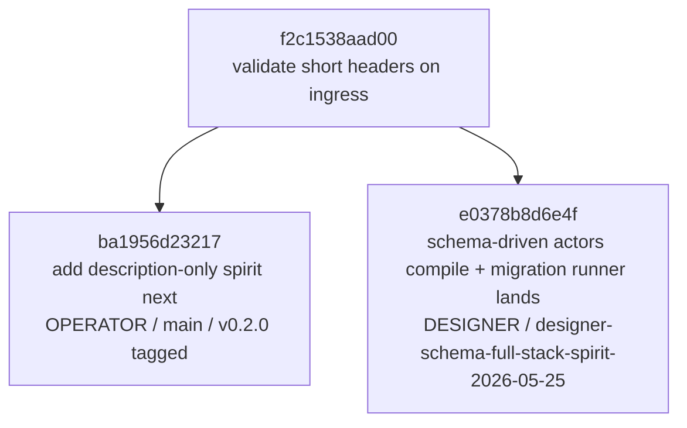

# 347 — Spirit v0.2.0 + schema-driven branch integration

*Designer-side audit + integration of `reports/operator/187-spirit-v0-2-0-side-by-side-deployment-2026-05-25.md` with the schema-driven landing reports `/103` + `/104`. Surfaces the relationship between the two parallel forks of `persona-spirit` and the path for operator integration.*

## §1 Audit of /187 — what operator landed

Spirit v0.2.0 is **live and side-by-side deployed** on `ouranos`:

| Surface | State |
|---|---|
| persona-spirit main | `ba1956d23217` |
| persona-spirit tag | `v0.2.0 → ba1956d23217` |
| CriomOS-home main | `760c1a717506` |
| Service | `persona-spirit-daemon-v0.2.0.service` — active, running |
| Wrapper | `spirit-v0.2.0` available in profile; unversioned `spirit` still resolves to v0.1.0 |
| Database | `/home/li/.local/state/persona-spirit/v0.2.0/persona-spirit.redb` (segregated from production) |
| Sockets | `spirit.sock` + `owner.sock` + `upgrade.sock` (versioned dir) |
| Daemon shape | 9-field positional configuration (3 sockets + 1 db path + 1 magnitude limit + 4 trailing Nones) |

Live behavior validated:
- Record into v0.2.0 DB: `(RecordAccepted 1)` — terse per record 674
- Topic observation: `(TopicsObserved ([(nota 1) (schema 3) (signal 1) (spirit 3) (workspace 1)]))`
- Kind + topic filters return expected subsets
- Description-only records accepted per record 673

Profile shows the **next/main/previous deployment slot pattern**:

```text
spirit            -> spirit-v0.1.0       (production)
spirit-v0.1.0     -> installed           (the MAIN reference)
spirit-v0.1.1     -> installed           (older side-by-side)
spirit-v0.2.0     -> installed           (new substrate; this slice)
spirit-next       -> missing             (placeholder for in-flight authoring)
```

This is the next/main/previous vocabulary (record 672) applied at the deployment-naming layer. `spirit-next` is the empty slot for what's currently being authored on a feature branch.

## §2 The two parallel forks — topology



**Common ancestor**: `f2c1538aad00`. Both branches diverged from this commit.

The schema-driven feature branch (`e0378b8d`) does NOT contain the v0.2.0 work, and `main` does NOT contain the schema-driven work. They are **sibling forks**, not parent-child. Operator integration of the schema-driven branch must rebase / merge against the new v0.2.0 baseline at `ba1956d23217+`.

## §3 What each branch contributes

| Branch | Contribution |
|---|---|
| `main` at `ba1956d23217` (v0.2.0) | Description-only record entries; 9-field daemon configuration shape; upgrade socket wire-side endpoint; CriomOS-home module accepting v0.1.0 / v0.1.1 / v0.2.0; deployment-slot vocabulary in profile naming |
| `designer-schema-full-stack-spirit-2026-05-25` at `e0378b8d` | 6 .schema files (storage / recorder / observer / supervisor / reading-actor / upgrade-log); multi-pass NOTA parsers for EffectTable + FanOutTargets + StorageDescriptor; `finalize_universal_unknowns()` post-pass; schema-rust composer pivot to authored features; SpiritStorageHandle with auto-migration runner; dual emission in signal-persona-spirit |

These contributions are **complementary, not conflicting in concept**. v0.2.0 deployed the operational substrate (sockets, paths, service unit, profile slots, description-only discipline). The schema-driven branch built the schema-driven internal architecture (actor schemas, universal Unknown, storage descriptors, upgrade machinery).

## §4 Conflict surface — what operator will need to resolve

Two branches with different commits on shared files. Probable conflict surface (operator should expect):

| Path | v0.2.0 changes | Schema-driven changes | Resolution discipline |
|---|---|---|---|
| `persona-spirit/src/lib.rs` | Description-only entry handling | `schema_driven` module declared + the actor engine integration | Both stay; description-only handling lives alongside schema-driven actors |
| `persona-spirit/src/main.rs` (or daemon entrypoint) | 9-field configuration parsing | (likely unchanged or minor) | Probably merges cleanly — different concerns |
| `signal-persona-spirit/src/lib.rs` | Description-only operations/replies in signal-channel macro | `emit_schema!()` dual emission for `::spirit::*` namespace | Both stay — dual emission was designed for this |
| Cargo.toml of each crate | Possibly version bumps | Possibly new dependencies | Manual merge |
| `flake.nix` | (no change in v0.2.0 visible from /187) | (possibly schema crate dependency adjustments) | Likely clean |

**The dual-emission compatibility approach** the schema-driven branch took (per /104) was specifically designed for this scenario. Legacy `signal_persona_spirit::Operation` (the v0.1/v0.2 wire) stays at root; schema-driven types land at `signal_persona_spirit::spirit::*`. Downstream consumers migrate incrementally. This means the schema-driven branch should NOT replace the existing v0.2.0 wire surface — it adds the new namespace alongside.

## §5 The 9-field daemon configuration — schema-emission opportunity

From /187 §"Live State":

```text
ExecStart:
/nix/store/.../persona-spirit-daemon/bin/persona-spirit-daemon
("/home/li/.local/state/persona-spirit/v0.2.0/spirit.sock"
 "/home/li/.local/state/persona-spirit/v0.2.0/owner.sock"
 "/home/li/.local/state/persona-spirit/v0.2.0/upgrade.sock"
 "/home/li/.local/state/persona-spirit/v0.2.0/persona-spirit.redb"
 384 None None None None)
```

That's a **9-field NOTA tuple** taken as the daemon's single argument (per the NOTA-only-argument rule, AGENTS.md hard override). The shape:

```
(spirit-socket owner-socket upgrade-socket database-path magnitude-limit
 None None None None)
```

The 5 trailing `None`s are extension points — pre-allocated slots for future configuration fields. This is currently **hand-authored** in the daemon's `main.rs`; the schema-driven approach should emit this configuration shape **from a schema declaration**.

**Action item** (future operator slice, not blocking integration): a `spirit-daemon-config.schema` declaring the configuration record type, with `StorageDescriptor`-equivalent feature for the runtime config layer. The daemon then consumes a schema-emitted `SpiritDaemonConfig` struct rather than positional NOTA-tuple parsing. The 5-Nones extension pattern becomes `Option<Future1>` / `Option<Future2>` / etc., schema-declared.

## §6 The `spirit-next` deployment slot

The CriomOS-home profile reserves a `spirit-next` slot (currently `missing`). Per next/main/previous vocabulary (record 672), this is the **placeholder for in-flight authoring**.

The schema-driven branch (`designer-schema-full-stack-spirit-2026-05-25` at `e0378b8d`) is the candidate to fill that slot. Two paths forward, with different cost profiles:

**Path A — release schema-driven as v0.3.0 once integrated** (preferred):
1. Operator rebases schema-driven branch onto current main (`ba1956d23217+`)
2. Resolves the §4 conflict surface
3. Tags `v0.3.0`
4. Adds `persona-spirit-v0-3-0` input to CriomOS-home
5. Wraps as `spirit-v0.3.0`
6. `spirit-next` remains as the slot for further authoring

**Path B — use `spirit-next` to deploy the schema-driven branch as an unreleased preview**:
1. Add `persona-spirit-next` input to CriomOS-home pointing at the branch ref
2. Wrap as `spirit-next`
3. Provides explicit testing surface for the schema-driven substrate before tagging
4. Closer to the spirit of the `next` slot — actively authored, not yet released

**Recommendation**: Path B for the immediate deployment, then Path A when the schema-driven substrate is ready for tagging. The `spirit-next` slot exists precisely for this in-flight-validation use case; using it as the deployment surface for the designer branch lets the substrate get empirical exposure before the v0.3.0 ceremony.

## §7 Cross-references to update

When operator integrates / when designer writes /105 (the showcase report being authored by subagent `ae5a06...`):

- **`/103` + `/104`** should note v0.2.0 as the production-deployed baseline against which the schema-driven branch's integration will rebase. The reports were written before /187 landed.
- **`/105`** (in flight) — the showcase subagent should be aware that v0.2.0 is the *operational* substrate; the schema-driven branch is the *next-architecture* substrate. The showcase demonstrates the next-architecture; v0.2.0 demonstrates the operational-substrate. Both true simultaneously.
- **`/346` §11 next-action sequence** — add an integration step: "rebase `designer-schema-full-stack-spirit-2026-05-25` onto v0.2.0 main" before any further schema-driven work lands on main.
- **`skills/spirit-cli.md`** — already references `next/previous` vocabulary; should also reference the deployment-slot pattern (`spirit-vX.Y.Z`, `spirit-next`) as the operational manifestation of next/main/previous.

## §8 Action items

Ordered by priority and dependency:

1. **None blocking right now** — the v0.2.0 deployment is live and side-by-side; the schema-driven branch is on origin; both surfaces survive independently. No emergency.
2. **(Operator)** Rebase / merge the schema-driven branch onto main (`ba1956d23217+`). Resolve §4 conflicts. This unblocks any further schema-driven work that wants to share main with the v0.2.0 baseline.
3. **(System-specialist / operator)** Decide between Path A and Path B from §6 — what fills the `spirit-next` slot.
4. **(Designer / future)** A `spirit-daemon-config.schema` to emit the 9-field configuration shape rather than hand-authoring (§5). Not blocking; quality-of-substrate work.
5. **(Designer)** Update `/103` + `/104` with a one-line note pointing at `/187` as the operational baseline + this report as the integration analysis.
6. **(Operator / heresy-sweep)** Migrate `lojix-cli` from quoted-string NOTA to bracket-string per record 690 (/187 §Notes flagged this as a known migration debt).

## §9 What this audit empirically validates

The /187 deployment surfaces give empirical evidence that:

- **The next/main/previous vocabulary (record 672) is OPERATIONALIZED** at the deployment layer, not just at the codebase layer. `spirit` / `spirit-vX.Y.Z` / `spirit-next` is the deployment-naming projection of the same discipline.
- **Description-only record entries work in production** (record 673 honored — terse `(RecordAccepted 1)` reply, no verbatim echo).
- **Bracket-string discipline (record 690) is being applied incrementally** — v0.2.0 spirit CLI uses brackets; lojix-cli is still on quoted strings (migration debt).
- **The single-NOTA-argument rule** is honored by the v0.2.0 daemon (9-field positional tuple as one argument, no flags).
- **Side-by-side versioning works as a deployment pattern** — production stays on v0.1.0; v0.2.0 runs in parallel for testing; this is the deployment-layer analog of the schema-driven branch's dual-emission compatibility (both safe to use simultaneously).

The deployment substrate (v0.2.0) and the schema-driven substrate (e0378b8d) are **convergent in discipline, complementary in scope**. They aren't competing implementations of the same thing; they're parallel investments in different layers (operational deployment vs internal architecture) that need to merge cleanly.

## §10 References

- `/187` — Spirit v0.2.0 side-by-side deployment (operator)
- `/103` — schema-driven full-stack initial landing (designer-assistant)
- `/104` — schema-driven full-stack full implementation (designer-assistant)
- `/105` — empirical showcase (in flight; designer-assistant)
- `/345` — schemas-as-channel-contracts refresh (designer)
- `/346` — actor schemas + upgrade mechanism (designer)
- Records 672 (next/main/previous), 673 (description-only entries), 674 (terse acknowledgments), 690 (bracket strings), 691 (denser intent capture), 692 (schema/signal/sema trio), 693 (universal Unknown), 696 (upgrade mechanism)
- persona-spirit common ancestor `f2c1538aad00` (validate short headers on ingress)
