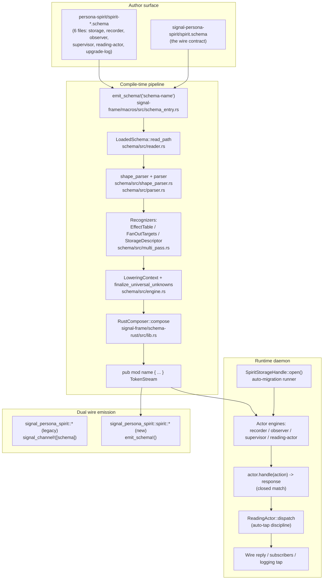
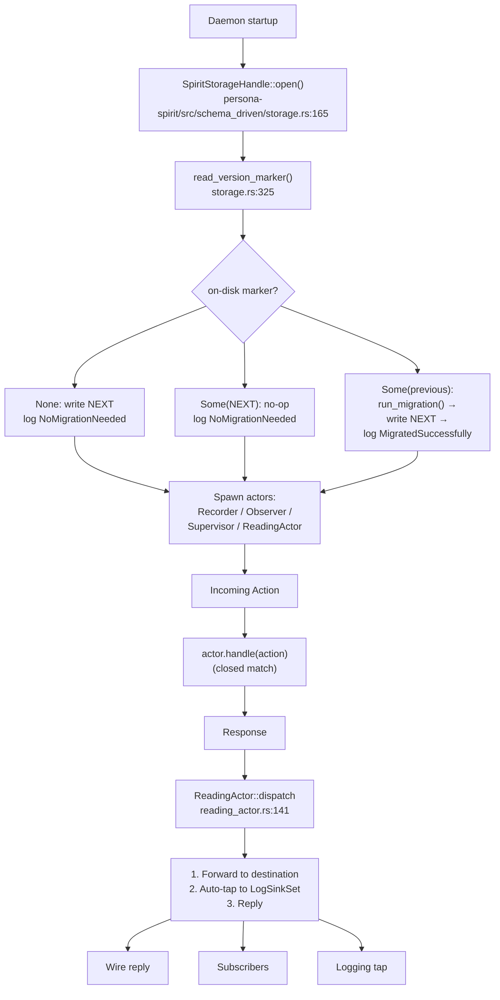

# 1 — POC schema-stack explainer: what the schema-driven full-stack does and how it works

*Headline deliverable of the 2026-05-25 context-maintenance sweep. The
report a fresh agent reads to understand the schema-driven full-stack
POC from scratch — its motivation, its capability surface, its
compile-time pipeline, its runtime topology, the principles it
crystallises, what it proves empirically, what it defers, how an
engineer uses it, and where to read the code. Synthesises substance
from `/103`, `/104`, `/105` (implementation arc), `/341`, `/343`,
`/345`, `/346` (design arc), `/347` (deployment integration), plus
Spirit records 656-696.*

## 1. What this POC is

The POC is a four-repository full-stack landing of the **schema-driven
architecture** for `persona-spirit`. Across four jj feature branches
(`designer-schema-full-stack-spirit-2026-05-25` in each repo) it
demonstrates the architecture the workspace has been crystallising over
the schema engine work — *the .schema file IS the architecture*, not a
tool the architecture uses.

Four cooperating components:

| Component | Repo | Role |
|---|---|---|
| Schema crate | `schema` | NOTA parsers + the typed `Feature` model + the universal-Unknown post-pass hook |
| Schema-rust composer | `signal-frame/schema-rust` | Walks `AssembledSchema`, emits Rust types from authored features |
| Persona-spirit daemon | `persona-spirit` | Six actor schemas + actor engines (hand-written Rust) + the auto-migration runner |
| Signal-persona-spirit wire | `signal-persona-spirit` | Dual emission — legacy `signal_channel!` at root, schema-driven `emit_schema!` at `::spirit::*` |

What it does: take a `.schema` file declaring an actor (its ACTION
enum, its RESPONSE enum, its effect-table, its fan-out targets), parse
it, lower it to a typed model, project the model into Rust source code
through a proc-macro, and consume the emitted types in a daemon that
manages its own database upgrades through a version marker plus
auto-migration on load.

The "POC" framing matters: this is **not the production stack**. The
production stack is `persona-spirit` v0.2.0 on `main`, deployed as
`spirit-v0.2.0` per `/347`. The schema-driven branches sit alongside
that production stack as the **next-architecture substrate** —
operationally inert, empirically verified, awaiting operator
integration. The dual emission in `signal-persona-spirit` (legacy at
root + schema-driven at `::spirit::*`) is the bridge that lets both
live simultaneously while downstream consumers migrate at their own
pace.

## 2. The problem it solves

Before this stack, every persona-component carried four hand-written
surfaces describing the same underlying contract:

| Surface | Where it was hand-written |
|---|---|
| Wire types and dispatch | `signal_channel!([…])` macro arguments per signal crate |
| Internal actor message types | Hand-coded `enum` declarations in the daemon's `src/actors/*` files |
| Storage table schemas | Hand-written redb table types and codec impls |
| Routing/dispatch matchers | Hand-written `match` blocks gluing the surfaces together |

Each surface was correct in isolation. None named the underlying single
source. Adding or renaming an operation meant four parallel edits, four
chances for drift, four hand-written contact points to test.

The schema work crystallised the realisation that **these are four
projections of one canonical declaration**. The `.schema` file IS the
declaration; emission is the projection. Crystallisation makes
explicit what was implicit; it does not invent new architecture, it
**precipitates** the architecture that was already trying to emerge
across the four surfaces.

The POC takes one concrete component — `persona-spirit` — and runs the
full chain end-to-end: six actor schemas authored in NOTA, the schema
crate's parsers + lowering, the schema-rust composer's emission, the
persona-spirit daemon's actor engines consuming the emitted types, and
a wire crate emitting BOTH the legacy wire contract AND the new
schema-driven namespace alongside it. Every claim is backed by passing
tests.

## 3. What it does — capability surface

What an engineer can author and what the stack does with it:

**1. Author an actor schema.** A `.schema` file declares the two
enums every actor has — ACTION (the closed set of things the actor can
do) and RESPONSE (the closed set of things the actor can say back) —
plus the supporting payload types. The schema engine injects a
universal `Unknown(String)` variant into the RESPONSE enum
automatically; the author never writes that variant by hand.

**2. Author the effect-table.** A schema feature declares the closed
mapping from ACTION variants to effect types — `(RecordEntry
RecordWriteEffect)`. The composer emits a static dispatcher with a
`_ => None` wildcard arm; unknown action names map to `None`, never
panic.

**3. Author fan-out targets.** A schema feature declares the closed
set of outputs each effect produces — `(Store SpiritStorage
InsertStampedEntry)`, `(Notify ObserverSet PublishRecordCaptured)`,
`(Reply RecordAccepted)`. Three output kinds: Actor (a
method-tagged dispatch to a named actor), Reply (a wire reply
variant), Subscribers (a fan-out into a subscriber set).

**4. Author storage descriptors.** A schema feature declares the redb
tables the actor owns — `(Records RecordsTable)`. The composer emits
a `StorageDescriptor` const carrying every table's logical name and
table type, plus a `table_type_for(logical_name)` accessor.

**5. Compile the schema into Rust types.** The `emit_schema!("name")`
proc-macro fires at compile time, reads the `.schema` file, runs it
through the parser + lowering + composer pipeline, and emits a
`pub mod name { … }` containing all the typed declarations.

**6. Write the actor engine.** The actor's Rust code consumes the
schema-emitted types. The actor's `handle(action: ActorAction) ->
ActorResponse` method is a closed `match` block — Rust enforces
exhaustiveness because the action enum is closed. The structure is
the schema; the logic is the Rust body.

**7. Run the daemon with auto-migration.** Daemon startup reads the
on-disk version marker, runs the migration bridge if the marker is
behind, writes the new marker forward, logs the outcome to the
upgrade-log. Three branches: fresh database (write NEXT,
NoMigrationNeeded), already-NEXT (no-op, NoMigrationNeeded), previous
version (run bridge, write NEXT, MigratedSuccessfully).

**8. Deploy alongside the legacy wire stack.** The signal crate emits
the legacy `signal_channel!([schema])` types at crate root AND the
schema-driven `emit_schema!()` types at `::spirit::*`. Downstream
consumers reach for one path or the other without a forced cutover.

## 4. How it works — architecture overview



Two compile-time invocations land most of the substrate: one for the
wire schema in `signal-persona-spirit`, one per actor schema in
`persona-spirit`. Both flow through the same composer; both produce
Rust modules consumed by hand-written engine code; the only
hand-written Rust is the `match` body inside each actor's `handle`
method plus a thin daemon glue layer.

The runtime is mailbox-shaped: actions arrive at an actor, get
matched against the closed ACTION enum, produce a response, the
response stream feeds the reading actor which fans out to wire
reply, subscribers, and a logging tap. Auto-tap is schema-declared,
not a runtime convention.

## 5. Compile-time pipeline walkthrough

The compile-time chain has eight numbered steps. Code locations are
load-bearing for an engineer chasing a problem.

**Step 1 — `emit_schema!` fires.** A daemon's source file (e.g.
`persona-spirit/src/lib.rs`) contains a call like
`schema_rust::emit_schema!("spirit-recorder")`. The proc-macro at
`signal-frame/macros/src/schema_entry.rs:30` is the entry point.

**Step 2 — Path resolution.** The macro's `EmitSchemaRequest::parse`
joins `CARGO_MANIFEST_DIR` with the literal argument to find the
`.schema` file on disk
(`signal-frame/macros/src/schema_entry.rs:54-65`).

**Step 3 — File read.** `schema/src/reader.rs::LoadedSchema::read_path`
reads the file contents into a `LoadedSchema` value.

**Step 4 — NOTA parse.** `schema/src/shape_parser.rs::parse_str`
parses the NOTA text into a `Schema` value. The three new feature
heads (`EffectTable`, `FanOutTargets`, `StorageDescriptor`) route
through dedicated parser entry points
(`parse_effect_table_feature` at line 278,
`parse_fan_out_targets_feature` at 301,
`parse_storage_descriptor_feature` at 359). A parallel
implementation in `schema/src/parser.rs` (the streaming-decoder
equivalence path) consumes the token stream directly with identical
semantics — both paths produce the same typed Features.

**Step 5 — Multi-pass recognition.** `schema/src/multi_pass.rs::
MacroPipeline::run` walks the parsed value tree and applies the
three new recognizers:

```rust
// multi_pass.rs:826
"EffectTable" => EffectTableRecognizer::recognize(value).map(Feature::EffectTable),
"FanOutTargets" => FanOutTargetsRecognizer::recognize(value).map(Feature::FanOutTargets),
"StorageDescriptor" => StorageDescriptorRecognizer::recognize(value).map(Feature::StorageDescriptor),
```

The `FanOutTargetsRecognizer::recognize_output` function
(`multi_pass.rs:939-998`) is the load-bearing classifier for the
three FanOutOutputDeclaration kinds:

```rust
match head {
    "Reply" => { /* (Reply Variant) -> Reply { variant } */ }
    "FanOutSubscribers" => { /* -> Subscribers { actor_type, dispatch_method } */ }
    method_tag => { /* -> Actor { method_tag, actor_type, actor_method } */ }
}
```

The default arm treats unrecognised heads as the Actor form, because
the first token in an Actor row is a method tag like `Store`/`Notify`.

**Step 6 — Universal-Unknown injection.** After all recognizers fire,
`LoweringContext::finalize_universal_unknowns()`
(`schema/src/engine.rs:227`) walks the lowered local types,
identifies enums whose name ends in `Response`, and idempotently
injects `Unknown(String)`:

```rust
pub fn finalize_universal_unknowns(&mut self) {
    for schema_type in &mut self.types {
        let AssembledType::Local { name, body } = schema_type else { continue };
        if !UniversalUnknownMacro::is_response_enum_name(name) { continue };
        UniversalUnknownMacro::inject_unknown_into_enum_body(body);
    }
}
```

The hook is wired from BOTH `Schema::assemble` (`document.rs:140`)
AND the multi-pass `MacroPipeline::run` (`multi_pass.rs:353`) — both
paths produce identical AssembledSchemas. Three guards on the
injector itself: enum-shape only, name ends in `Response`, idempotent
(short-circuits if `Unknown` already present).

**Step 7 — Rust composition.** `signal-frame/schema-rust/src/lib.rs::
RustComposer::compose` walks the AssembledSchema. Three new emission
functions handle the authored features:

- `authored_effect_items()` (line 455) — emits the closed
  `AuthoredEffect` enum, `AuthoredFanOutOutput`, `AuthoredFanOut`,
  and `AuthoredEffectTable` with `effect_for_action` +
  `fan_out_for_effect` dispatchers. Fires only when the schema
  declares `Feature::EffectTable`.
- `storage_descriptor_items()` (line 558) — emits
  `TableDescriptor` + `StorageDescriptor` with a `TABLES` const
  slice and `table_type_for(logical_name)` accessor. Fires only
  when the schema declares `Feature::StorageDescriptor`.
- `record_field_tokens_disambiguated()` (line 901) — suffixes
  duplicate field names so that a schema like `Time [u8 u8 u8]`
  emits `pub struct Time { pub u8: u8, pub u8_2: u8, pub u8_3: u8 }`
  rather than colliding on three identical field names.

The legacy route-derived emission (line 79+) still fires for wire
schemas with routes; the authored emission is **additive** and only
appears when the EffectTable feature is declared.

**Step 8 — Module emission.** The composer's output is a TokenStream
wrapped in `pub mod <schema-stem> { … }`. The proc-macro returns this
to the compiler; the daemon's source file now has the typed module
available for `use`.

The full chain is exercised by `cargo test -p schema-rust
dump_recorder_emission_for_showcase -- --ignored --nocapture` which
emits the composed Rust for the recorder fixture verbatim. The dump
shows the injected `Unknown(String)` inside `RecorderResponse`, the
`_ => None` closure wildcards in both dispatcher arms, and the
disambiguated field names.

## 6. Runtime topology walkthrough



Five sequenced runtime concerns:

**Storage open with auto-migration.** `SpiritStorageHandle::open()`
reads the on-disk version marker. The three-branch match on the
marker IS the auto-migration runner:

```rust
// persona-spirit/src/schema_driven/storage.rs:165-233
let final_marker = match on_disk {
    None => {                                            // 1. Fresh DB
        let _ = write_version_marker(&location, VersionMarker::NEXT);
        upgrade_log.push(UpgradeLogEntry { from: NEXT, to: NEXT,
            outcome: NoMigrationNeeded, ... });
        VersionMarker::NEXT
    }
    Some(marker) if marker == VersionMarker::NEXT => {   // 2. Already-NEXT
        upgrade_log.push(UpgradeLogEntry { from: marker, to: marker,
            outcome: NoMigrationNeeded, ... });
        marker
    }
    Some(previous) => {                                  // 3. Migration
        let migration = run_migration(&location, previous, VersionMarker::NEXT);
        match migration {
            Ok(()) => {
                let _ = write_version_marker(&location, VersionMarker::NEXT);
                upgrade_log.push(UpgradeLogEntry { from: previous, to: NEXT,
                    outcome: MigratedSuccessfully, ... });
                VersionMarker::NEXT
            }
            Err(_) => previous
        }
    }
};
```

**Actor spawn.** The four schema-driven actors (recorder, observer,
supervisor, reading-actor) come up. Each carries its own ACTION enum,
its own RESPONSE enum (with universal Unknown injected), its own
hand-written `handle` method.

**Mailbox flow.** An incoming Action — from the wire or from another
actor — arrives at the actor's `handle` method. The method is a
closed match on the ACTION enum; Rust enforces exhaustiveness at
compile time. The body is hand-written logic; the structure is
schema-emitted.

**Reading actor dispatch.** The actor's RESPONSE feeds into the
reading actor (`persona-spirit/src/schema_driven/reading_actor.rs::
ReadingActor::dispatch`). The reading actor is itself an actor with
its own schema — `spirit-reading-actor.schema` declares its
`DispatchEffect` with a fan-out that ALWAYS includes
`(Tap LogSinkSet WriteEntry)`. The auto-tap is schema-declared, not
a runtime convention.

**Fan-out to sinks.** The dispatched response lands in three places
per the schema-declared fan-out: the wire reply path, any matching
subscribers, and the logging tap. Every response is captured;
nothing is invisible.

## 7. The crystallized principles from /341

`/341` named seven principles crystallised by the schema work. One
was retracted mid-session per record 666 (the InteractTrait +
InteractionActor formalisation — *methods are interactions; no
special trait layer*). Six remain active; `/345` added two new
principles and one vocabulary discipline. The active set:

**P1. Schema IS the architecture (record 656).** One `.schema` file
serves simultaneously as code source (via `emit_schema!`), wire
format declaration, and self-describing architectural documentation.
The schema is not produced by the architecture; the schema IS the
architecture. A fresh agent reading `spirit-recorder.schema` learns
the actor's contract without needing a separate document.
*Concrete example*: the recorder schema's namespace section declares
RecorderAction + RecorderResponse + the payload types; the features
section declares the effect-table + fan-out targets; everything that
matters about the recorder's external surface is in that one file.

**P2. Extensible header by prefix preservation (record 657).** The
8-byte `ShortHeader` is the BASE; longer headers (256-byte
`ExtendedHeader`, future variable-length) are EXTENSIONS that
contain the 8-byte form as prefix. Always parseable by code expecting
only 8 bytes. The post-header memory layout is vectors as memory
arrays after the message; header indexes (length + type-of-vector)
point into them. Schema declares which fields fit in 8 bytes vs which
need extended positions.

**P3. Deep tree with type index (record 658).** Schema-defined type
trees are normally 6-7 layers deep; the same types are referenced in
multiple places via a flat type index. Deep nesting is NORMAL, not a
smell. `AssembledSchema::qualified_name_for` projects local and
imported types through `local_types` + `imported_types` maps.

**~~P4. Two languages — internal effect + external wire~~ (record 659)
— REFINED.** `/345` §3 refined this into three categories:
**wire-external** (process boundary crossing), **storage-external**
(lifetime crossing — survives process exit), **internal-channels**
(actor-to-actor inside one process). The two-language framing
collapsed external into wire-only and internal into effect-only; the
three-category taxonomy is the load-bearing distinction.

**~~P5. InteractTrait + InteractionActor mediation~~ (record 660) —
RETRACTED per record 666.** Methods are interactions. No special
Rust trait layer above actor methods. The mediator pattern survives
only as ordinary actor-method-call topology (actor M's `handle`
method decides between two parties), not as a special trait
abstraction. The intuition the InteractTrait was reaching for was
correct (*"when the psyche describes a major part of the system, that
description IS a warrant to create a schema for that part"*); the
**shape** was wrong — the warrant is a schema, not a Rust trait.
This is the principle whose retraction `/341 §2.5` documents and
that `/345 §1` reframes.

**P6. Effect-table match-driven dispatch (record 661).** Schema
declares an EFFECT TABLE — closed mapping from ACTION variants to
effect types. Dispatch is match-driven through the actor's `handle`
method; no ad-hoc dispatch logic, no string-matched routing. *Match
always; map always; never compute when you can match.*
*Concrete example*: `spirit-recorder.schema`'s `(EffectTable [
(RecordEntry RecordWriteEffect) (OpenRecordSubscription
SubscriptionOpenEffect) (CloseRecordSubscription
SubscriptionCloseEffect) ])`.

**P7. Actor fan-out execution (record 662).** Actor execution produces
fan-out outputs. When an actor decides an outcome, it emits multiple
things in parallel: a wire reply, mutations dispatched to other
actors, notifications to subscribers, the logging tap.
Single-input-multiple-output (SIMO) is the NORMAL shape, not the
exceptional case.
*Concrete example*: the recorder's RecordEntry action fans out into
`(Store SpiritStorage InsertStampedEntry)` + `(Notify ObserverSet
PublishRecordCaptured)` + `(Reply RecordAccepted)` — three outputs
from one decision.

Plus `/345`'s additions:

**P8. Schemas warrant per channel; contract = channel (record 668).**
When the psyche describes a major part of the system, that description
IS a warrant to create a schema for that part. **One channel = one
contract = one schema.** Multi-schema per crate is the new normal
where the crate has multiple channels. Wire schemas live in the
`signal-*` crate; storage and internal schemas live in the daemon
crate.

**P9. Three schema categories — wire / storage / internal (record
669).** The refined version of P4 (the two-language framing). External
to runtime means either crossing the process boundary (wire) or
crossing the process lifetime (storage). Internal channels are
actor-to-actor inside one process.

**Vocabulary discipline. Next / main / previous (record 672).**
Authors always write from the point of view of NEXT. MAIN is the
current published baseline (imported as comparison). PREVIOUS or LAST
is the prior iteration. The `mod historical` / `mod current_shape`
migration-module pattern from `skills/spirit-cli.md` is renamed to
`mod previous` / `mod next` per this vocabulary. The 8-byte
prefix-preservation of P2 IS this development model applied at the
wire layer — byte 0 of NEXT preserves byte 0 of MAIN.

## 8. The six actor schemas in persona-spirit

`/105` §2 enumerates the six schemas authored in
`persona-spirit/spirit-*.schema`. Each instantiates the /346 actor-
schema pattern (ACTION + RESPONSE + universal Unknown) plus
schema-specific features.

**1. `spirit-recorder.schema` — the recorder actor.**
- ACTION (6 variants): RecordEntry, ObserveRecorder, SnapshotRecords,
  OpenRecordSubscription, CloseRecordSubscription, QueryStatus.
- RESPONSE (6 + Unknown): RecordAccepted, RecordsObserved,
  RecordSnapshotReturned, SubscriptionOpened, SubscriptionRetracted,
  StatusReturned, Unknown(String).
- EffectTable: RecordEntry → RecordWriteEffect; OpenRecordSubscription
  → SubscriptionOpenEffect; CloseRecordSubscription →
  SubscriptionCloseEffect.
- FanOutTargets exemplifying all three output kinds: Actor form
  (Store SpiritStorage InsertStampedEntry), Reply form (Reply
  RecordAccepted), Notify form (Notify ObserverSet
  PublishRecordCaptured).

**2. `spirit-observer.schema` — the observer fan-out hub.**
- ACTION/RESPONSE for subscription open/close + publish.
- EffectTable: PublishRecordCaptured → ObserverPublishEffect.
- FanOutTargets uses the third declaration kind: `(FanOutSubscribers
  ObserverSubscriberSet Dispatch)` — the Subscribers form, dispatching
  to a subscriber set.

**3. `spirit-supervisor.schema` — the cross-actor coordinator.**
- ACTION (6 lifecycle variants): StartEngine, DrainEngine,
  ReloadBootstrapPolicy, ...
- RESPONSE + Unknown.
- EffectTable rows fan out into recorder/observer/storage drain
  operations. All Actor-form rows: `(Open SpiritStorage Open)`,
  `(Drain RecorderActor Drain)`, `(Apply ObserverSet ApplyPolicy)`.

**4. `spirit-reading-actor.schema` — the response dispatcher.**
- Per /346 §5 the reading actor is itself an actor with its own
  schema. Its ACTION is dispatch-by-response-type:
  `DispatchRecorderResponse [DispatchEnvelope RecorderResponse]`.
- EffectTable's FanOutTargets show the auto-tap discipline:
  ```nota
  (DispatchEffect [
    (Forward DestinationActor Deliver)
    (Tap LogSinkSet WriteEntry)
    (Reply ResponseDispatched)
  ])
  ```
- Every dispatch hits the logging tap declaratively, not as runtime
  convention.

**5. `spirit-storage.schema` — the persistence channel.**
- Namespace declares the table types: `RecordsTable [RecordIdentifier
  StoredRecord]`, `RecordIdentifierMintTable [MintKey
  RecordIdentifierMint]`, `VersionMarker [u32 u32 u32]`.
- StorageDescriptor feature names the redb tables (logical name →
  table-type pair).
- The `VersionMarker [u32 u32 u32]` declaration is load-bearing —
  the on-disk marker the auto-migration runner reads.

**6. `spirit-upgrade-log.schema` — the append-only migration log.**
- Separate from `spirit-storage.schema` because per /345 §2 each
  contract is its own channel; the upgrade log's lifetime and
  authority are distinct from the records table's.
- Declares `UpgradeLogTable`, `UpgradeLogEntry`, `UpgradeOutcome`
  (MigratedSuccessfully / NoMigrationNeeded / MigrationFailed /
  RolledBack), and supporting timestamp/duration types.
- StorageDescriptor: `(UpgradeLog UpgradeLogTable)`.

All six instantiate the same pattern: two enums (ACTION + RESPONSE)
+ the universal Unknown safety floor + schema-declared features
naming the actor's effects, fan-out targets, and storage tables.

## 9. The four components

### 9a. Schema crate

The schema crate is the parser + lowering substrate. Three structural
extensions land in this branch:

**1. Three new `Feature` enum variants** (`schema/src/feature.rs`):

- `Feature::EffectTable(EffectTableFeature)` — closed action→effect
  mapping; entries are `(action_name, effect_type_name)` pairs.
- `Feature::FanOutTargets(FanOutTargetsFeature)` — per-effect
  fan-out outputs; each output is one of three closed kinds:
  `FanOutOutputDeclaration::Reply { variant }`, `::Actor {
  method_tag, actor_type, actor_method }`, `::Subscribers {
  actor_type, dispatch_method }`.
- `Feature::StorageDescriptor(StorageDescriptorFeature)` — closed
  set of `(logical_name, table_type)` entries.

**2. Multi-pass recognizers** (`schema/src/multi_pass.rs`):
`EffectTableRecognizer`, `FanOutTargetsRecognizer`,
`StorageDescriptorRecognizer`. Plus parallel canonical parsers in
`shape_parser.rs` and streaming-decoder equivalents in `parser.rs`
— both paths produce identical typed Features.

**3. Universal-Unknown post-pass hook**
(`schema/src/engine.rs::LoweringContext::finalize_universal_unknowns`).
Walks the lowered local types after all `TypeMacro` invocations
complete; identifies any local enum whose name ends in `Response`;
idempotently injects an `Unknown(String)` variant. The
`UniversalUnknownMacro::inject_unknown_into_enum_body` helper carries
the three guards (enum-shape only, idempotent short-circuit,
correct payload). Called from BOTH the multi-pass pipeline AND
`Schema::assemble` so both paths produce identical AssembledSchemas.

What this crate does NOT do: emit Rust. Emission is the composer's
job. The schema crate owns the parse + lowering only.

### 9b. Schema-rust composer

The composer lives in `signal-frame/schema-rust/src/lib.rs`. It walks
an `AssembledSchema` and emits a TokenStream wrapped in `pub mod
<name> { … }`. Three new emission functions in this branch handle the
authored features:

**1. `authored_effect_items()`** (line 455). Fires only when the
schema declares `Feature::EffectTable`. Emits:

```rust
pub enum AuthoredEffect { /* one variant per unique RHS effect */ }
pub enum AuthoredFanOutOutput { Reply { variant }, Actor { ... }, Subscribers { ... } }
pub struct AuthoredFanOut { pub outputs: Vec<AuthoredFanOutOutput> }
pub struct AuthoredEffectTable;
impl AuthoredEffectTable {
    pub fn effect_for_action(action: &str) -> Option<&'static str> {
        match action { /* arms per row */, _ => None }
    }
    pub fn fan_out_for_effect(effect: &str) -> Option<AuthoredFanOut> {
        match effect { /* arms per row */, _ => None }
    }
}
```

The trailing `_ => None` is the closure guarantee — see constraint
C4 in §13. Both dispatchers are string-keyed in this iteration because
the recorder schema's ACTION enum lives in a different module from
the emitted dispatcher; a later iteration with cross-module resolution
could tighten to an enum-keyed dispatcher.

**2. `storage_descriptor_items()`** (line 558). Fires only when the
schema declares `Feature::StorageDescriptor`. Emits:

```rust
pub struct TableDescriptor {
    pub logical_name: &'static str,
    pub table_type: &'static str,
}
pub struct StorageDescriptor;
impl StorageDescriptor {
    pub const TABLE_COUNT: usize = N;
    pub const TABLES: &'static [TableDescriptor] = &[ /* entries */ ];
    pub fn table_type_for(logical_name: &str) -> Option<&'static str> {
        match logical_name { /* arms */, _ => None }
    }
}
```

**3. `record_field_tokens_disambiguated()`** (line 901). The
disambiguation pass. Required because schemas like
`Time [u8 u8 u8]` derive field names from primitives and would
otherwise collide. The pattern: first occurrence keeps the base name;
subsequent occurrences become `u8_2`, `u8_3`, etc. Before:
`pub struct Time { pub u8: u8, pub u8: u8, pub u8: u8 }` — duplicate
field error. After: `pub struct Time { pub u8: u8, pub u8_2: u8,
pub u8_3: u8 }` — compiles.

The legacy route-derived emission (line 79+) still fires for wire
schemas with routes; the authored emission is **additive**. A wire
schema without an EffectTable feature gets the legacy emission
unchanged; an actor schema with an EffectTable feature gets the
authored emission. No schema needs to be migrated immediately to
pick up the authored emission.

### 9c. Persona-spirit daemon

The daemon's schema-driven module lives in
`persona-spirit/src/schema_driven/`. Five Rust files implement the
actor engines + the storage handle:

- `storage.rs` — `VersionMarker`, `UpgradeOutcome`, `UpgradeLogEntry`,
  `TableDescriptor`, `StorageDescriptor`, and `SpiritStorageHandle`
  with the three-branch migration runner.
- `recorder.rs` — `RecorderAction`, `RecorderResponse` (with
  universal Unknown), payload structs, `SpiritRecorder::handle` with
  the contact-point match block. Atomic identifier minting,
  subscription tracking, status reporting.
- `observer.rs` — `ObserverAction`, `ObserverResponse`, subscription
  table, publish-with-filter dispatch. Filter semantics: matching
  topic OR wildcard (no filter).
- `supervisor.rs` — `SupervisorAction`, `SupervisorResponse`, lifecycle
  state machine (Starting / Running / Drained), uptime tracking,
  policy reload.
- `reading_actor.rs` — `ReadingActorAction`, `ReadingActorResponse`,
  log-sink attach/detach, dispatcher with the auto-tap discipline.

The actor engines are **hand-written Rust**. The hand-written types
match what `emit_schema!` will produce once cross-crate import
resolution lands — see §14. This is the deferred piece: the chain
NOTA → AssembledSchema → composer → Rust works end-to-end for any
single schema; cross-schema imports between sibling crates need a
later operator slice.

The contact-point match block in `SpiritRecorder::handle` is the
canonical /346 §2 example:

```rust
// persona-spirit/src/schema_driven/recorder.rs:126-135
pub fn handle(&self, action: RecorderAction) -> RecorderResponse {
    match action {
        RecorderAction::RecordEntry(payload) => self.record_entry(payload),
        RecorderAction::ObserveRecorder(filter) => self.observe(filter),
        RecorderAction::SnapshotRecords(filter) => self.snapshot(filter),
        RecorderAction::OpenRecordSubscription(payload) => self.open_subscription(payload),
        RecorderAction::CloseRecordSubscription(close) => self.close_subscription(close),
        RecorderAction::QueryStatus => self.status(),
    }
}
```

Exhaustive — the action enum is closed; Rust enforces this at compile
time. The body is logic; the structure is the schema. There is no
`RecorderAction::Unknown` arm; the universal Unknown lives on the
RESPONSE side, not the ACTION side.

### 9d. Signal-persona-spirit dual emission

The dual emission lands in `signal-persona-spirit/src/lib.rs`. Both
emit paths produce concrete types:

- Legacy `signal_channel!([schema])` at `signal_persona_spirit::*`
  (crate root).
- Schema-driven `emit_schema!()` at
  `signal_persona_spirit::spirit::*` (wrapped module).

This is **the designer-recommended migration path** per /103 anomaly
3. Downstream consumers can migrate to the qualified
`signal_persona_spirit::spirit::*` paths incrementally; the legacy
invocation removes in a separate breaking commit once all consumers
flip.

`tests/schema_module.rs` verifies the schema-driven module is
reachable: `Operation::State(StateEndpoint::Statement(...))`
constructs, `ROUTES` + `ROUTE_COUNT` constants visible,
`ExtendedHeader::empty()` returns the 256-byte form, route-derived
`EffectTable` scaffold exists.

## 10. The upgrade mechanism

The schema-driven branch lands the **DB-side upgrade story** per
/346 §4. (The complementary wire-side upgrade — cross-version live
handover via UpgradeMacro emission per /338 §8 `primary-cklr` — is a
separate slice not in this branch.)

The six-step mechanism:

1. **Schema changes between versions.** Author edits
   `<crate>/<contract>.schema` while writing NEXT; MAIN stays at the
   published baseline.
2. **schema-diff identifies what's different.** What types are added,
   dropped, renamed, structurally changed.
3. **Hand-written Rust bridge code per version-boundary.** For each
   MAIN → NEXT transition where data types moved, the developer
   writes the bridge (`From`-impl, field-mapper, value-converter).
4. **Version number marks the boundary.** Semantic versioning; the
   version-marker in the database tells the daemon which schema
   the persisted data was written under.
5. **The new daemon is recompiled with the PREVIOUS schema available.**
   `mod previous` / `mod next` Rust idiom (renamed from the older
   `mod historical` / `mod current_shape` per record 672).
6. **Auto-migration on database load.** Daemon startup reads the DB's
   version marker; if previous, the migration method runs once,
   transforms data to NEXT shape, updates the version marker,
   persists, logs the outcome.

The `SpiritStorageHandle::open()` function (storage.rs:165-233) IS
step 6 — the three-branch match on the on-disk marker; see §6 for the
code excerpt.

The `run_migration` bridge in this build is minimal:

```rust
// storage.rs:263-274
pub fn run_migration(
    _location: &std::path::Path,
    previous: VersionMarker,
    next: VersionMarker,
) -> Result<(), MigrationError> {
    // Marker-only upgrade: no row transformations needed for the
    // MAIN -> NEXT bridge. Per /346 §4 step 5, when AssembledSchema
    // diff is empty, the bridge body can be elided.
    let _ = (previous, next);
    Ok(())
}
```

In the current build, MAIN (`0.1.0`) and NEXT (`0.1.1`) differ only
in the version-marker existence — no row shape changes — so the
bridge body is elided per /346 §6's "when AssembledSchema diff is
empty" discipline. A future schema change drops its `From<previous::
T> for next::T` impls here.

The upgrade-log is in-memory in this build (`upgrade_log: Mutex<
Vec<UpgradeLogEntry>>`). When cross-crate schema resolution lands
and `emit_schema!("spirit-upgrade-log.schema")` lights up, the
in-memory log moves to a real redb-backed `UpgradeLogTable` per /346
§4 step 6.

## 11. The actor-schema pattern

The pattern from /346 §1 — what every actor schema declares:

```nota
;; namespace section --- two enums + supporting payload types
ActorAction (Action1 Action2 Action3)
ActorResponse (Response1 Response2 Response3)   ;; Unknown injected by macro

Action1 [Payload1Type]
Action2 [Payload2Type]
Response1 [Response1Payload]
;; ...

;; features section --- effect-table + fan-out targets
[
  (EffectTable [
    (Action1 EffectType1)
  ])
  (FanOutTargets [
    (EffectType1 [
      (Store SomeActor SomeMethod)
      (Reply Response1)
    ])
  ])
]
```

Two structural commitments:

1. **ACTION enum** — the closed set of things this actor can do when
   called. Author writes this; schema engine does not extend it.
2. **RESPONSE enum** — the closed set of things this actor can say
   back. Author writes the non-Unknown variants; the schema engine's
   `UniversalUnknownMacro` injects `Unknown(String)` automatically.

The universal `Unknown` is the **actor's safety floor**. No matter
what arrives, the actor has a structurally-valid response. The
matching Rust:

```rust
pub fn handle(&self, action: ActorAction) -> ActorResponse {
    match action {
        ActorAction::Action1(payload) => self.action1(payload),
        ActorAction::Action2(payload) => self.action2(payload),
        ActorAction::Action3 => self.action3(),
        // No Unknown arm — the action enum is closed.
    }
    // Any error path inside an action method returns
    // ActorResponse::Unknown(error_string) instead of panicking.
}
```

This is the **load-bearing boundary** per /346 §2: **structure is
schema; logic is Rust**. The action types, response types, codecs,
NOTA encodings, and rkyv encodings all emit from the schema. The
`match` body — the decision-making — is hand-written.

The rkyv encoding lives in **one byte layout** that survives two
homes (record 695):

- **Sema** — the body at rest in redb (state surviving process exit).
- **Signal** — the body in transit on a socket (channel between
  clients).

Same bytes, two homes. NOTA is the text-readable projection emitted at
CLI read time or for human inspection. Closes the schema-signal-sema
trio at the byte-encoding layer: **Schema** specifies, **Signal**
moves, **Sema** holds.

## 12. The runtime topology

Recap of §6 in narrative form. The runtime is **mailbox-shaped**:

- Each actor receives ACTIONS in its mailbox.
- Each actor produces RESPONSES into a response stream.
- A **reading actor** (response dispatcher) handles outbound —
  dispatching to wire reply, to subscribers, to logging.
- **Auto-tap to a logging facility** — the reading actor automatically
  forks every response into a log stream; all messages are
  capturable; nothing is invisible.

The reading actor is itself an actor with its own schema. Its action
vocabulary is dispatch-by-response-type
(`DispatchRecorderResponse`, `DispatchObserverResponse`, etc). Its
fan-out targets always include `(Tap LogSinkSet WriteEntry)` — the
auto-tap is declaratively encoded, not an enforcement convention.

The actor mediator pattern survives the retraction of P5 (the
InteractTrait). When two actors need to coordinate, a third mediator
actor's `handle` method decides — but it's a normal actor's method,
not a trait above methods. *Methods are interactions.*

## 13. What's verified empirically

`/105` ran the six /346 constraints against named tests. All pass.
The constraint test names are useful as live references, so this
section preserves them rather than retiring `/105` outright.

**C1 — Every RESPONSE enum gets `Unknown`.** Two proofs:
- Schema-side: `schema/tests/constraint_proofs.rs::
  constraint_c1_every_response_enum_receives_unknown_variant`. Builds
  a synthetic schema with three Response enums + one non-Response
  enum; asserts each Response picks up `Unknown` and the non-Response
  does not.
- Runtime: `persona-spirit/src/schema_driven/mod.rs::
  constraint_proofs::constraint_c1_every_actor_response_carries_unknown_variant`.
  Constructs `RecorderResponse::Unknown("...")`,
  `ObserverResponse::Unknown(...)`, etc. The constructor existing on
  every actor's Response IS the structural proof.

**C2 — Migration is idempotent.**
`schema_driven::storage::tests::constraint_c2_migration_idempotent_under_repeated_reopen`
opens a database four times. Each reopen the marker stays NEXT and
the log records `NoMigrationNeeded`.

**C3 — One byte layout for sema + signal.**
`constraint_c3_version_marker_one_byte_layout_two_homes` encodes a
`VersionMarker` twice — once as if for the wire (signal home), once
as if for the DB (sema home) — and asserts the bytes are identical.
Round-trips through `rkyv::access` + `rkyv::deserialize`.

**C4 — EffectTable is closed.**
`schema-rust::tests::constraint_c4_authored_effect_table_dispatcher_is_closed`
compiles the recorder fixture, gets the emitted Rust text, asserts
both `effect_for_action` and `fan_out_for_effect` terminate with a
`_ => None` wildcard arm. The wildcard IS the closure guarantee:
unknown action names map to `None` instead of panicking.

**C5 — `finalize_universal_unknowns` is idempotent.** Five sub-tests:
- `constraint_c5_finalize_universal_unknowns_idempotent_on_full_lowering`
  — full schema assembly twice; exactly one Unknown in each.
- `constraint_c5_inject_unknown_into_enum_body_idempotent_under_many_calls`
  — injector called 16 times; variant count stays at 3.
- `constraint_c5d_lowering_context_finalize_hook_runs_through_multi_pass`
  — streaming decoder path; Unknown lands identically.
- `constraint_c5b_is_response_enum_name_only_matches_suffix` — names
  containing "Response" mid-string are NOT matched.
- `constraint_c5c_non_enum_response_bodies_are_ignored` — record body
  named `*Response` is left alone.

**C6 — NEXT version-marker discipline.**
`constraint_c6_next_version_marker_discipline_end_to_end` runs the
full cycle in one test: fresh DB → NEXT; wipe + seed MAIN →
migrate → NEXT + MigratedSuccessfully; reopen → NEXT +
NoMigrationNeeded.

Beyond the constraint-proof set, `/105` documents 17 pre-existing
schema_driven unit tests covering observer subscription lifecycle,
reading-actor dispatch + tap capture, recorder identifier minting,
supervisor lifecycle transitions, storage marker round-trip, and the
universal-Unknown safety floor for every actor.

Aggregate test counts:
- `schema`: 61 total (was 54; +7 from constraint_proofs).
- `signal-frame` workspace: 63 total (was 62; +1 from
  constraint_c4).
- `persona-spirit`: 22 schema_driven tests (17 + 5 new constraint
  proofs) + 50 pre-existing.
- `signal-persona-spirit`: 23 total including 4 new schema_module
  tests.

All six /346 constraints hold empirically.

## 14. What's still deferred — the clean foothold

One piece deferred to a future operator slice:

**Cross-crate schema-import resolution.** The persona-spirit schemas
(`spirit-recorder.schema`, `spirit-observer.schema`, etc.) import
from sibling crates (`signal-persona-spirit/spirit.schema`,
`spirit-storage`, etc.) which `LoadedSchema::read_path` can't follow
without an adjacent worktree layout that mirrors the deployed repo
tree.

The workaround in `persona-spirit/src/schema_driven/` is
hand-written Rust types that MATCH what `emit_schema!` will emit
once cross-crate resolution lands. The actor engine code (the
`handle` methods, internal state, tests, migration runner) is real;
only the type definitions swap when the macro lights up.

The infrastructure piece is the `emit_schema!` proc-macro's import
resolution algorithm — it needs to follow `(Import schema-name
[...])` references either through Cargo dep paths or through an
explicit `SCHEMA_DEP` environment variable / build script.

This is the **lowest-leverage deferral**: the migration runner, the
actor patterns, the universal-Unknown floor, the entire compile-time
chain for any single schema, and the dual-emission wire-side — all
work today against the hand-written types or schemas without imports.

Smaller caveat: the `Time` / `Date` field-name disambiguation in
schema-rust produces `u8` + `u8_2` + `u8_3` from `[u8 u8 u8]`. Code
that consumes the emitted types using positional construction (e.g.
`Time::new(0, 0, 0)`) keeps working. Code that uses field-name
construction needs the suffix-aware names. The wire schema's legacy
signal_channel! emission still uses positional fields via the older
path, so nothing downstream breaks today.

## 15. How an engineer uses this — worked example

Adding a new actor to a daemon, end to end.

**Step 1 — Write the schema.** Author the actor's `.schema` file in
the daemon crate. Two enums + supporting types + features. Skeleton:

```nota
;; persona-spirit/spirit-classifier.schema (hypothetical new actor)

;; imports (any sibling schemas this actor's types reference)
[]

;; headers (empty for internal-channel schemas)
[] [] []

;; namespace --- ACTION + RESPONSE + payload types
{
  ClassifierAction (
    ClassifyStatement
    ReclassifyEntry
    QueryClassifierStatus
  )
  ClassifierResponse (
    StatementClassified
    EntryReclassified
    ClassifierStatusReturned
  )                                       ;; Unknown(String) injected by macro

  ClassifyStatement [Statement]
  ReclassifyEntry [RecordIdentifier]
  QueryClassifierStatus []

  StatementClassified [ClassificationOutcome]
  EntryReclassified [ClassificationOutcome]
  ClassifierStatusReturned [ClassifierStatus]
}

;; features --- effect-table + fan-out targets
[
  (EffectTable [
    (ClassifyStatement ClassifyEffect)
    (ReclassifyEntry ReclassifyEffect)
  ])
  (FanOutTargets [
    (ClassifyEffect [
      (Reply StatementClassified)
      (Notify ObserverSet PublishClassification)
    ])
    (ReclassifyEffect [
      (Mutate SpiritStorage UpdateClassification)
      (Reply EntryReclassified)
    ])
  ])
]
```

**Step 2 — Add the emit invocation.** In the daemon's `src/lib.rs`:

```rust
schema_rust::emit_schema!("spirit-classifier");
```

This produces `pub mod spirit_classifier { ClassifierAction,
ClassifierResponse (with Unknown injected), ClassifyStatement,
StatementClassified, AuthoredEffect, AuthoredFanOut,
AuthoredEffectTable, ... }`.

**Step 3 — Write the engine.** Hand-written Rust in
`persona-spirit/src/schema_driven/classifier.rs`:

```rust
use spirit_classifier::{ClassifierAction, ClassifierResponse, /* ... */};

pub struct SpiritClassifier {
    store: SpiritStorageHandle,
    observers: ObserverSet,
}

impl SpiritClassifier {
    pub fn handle(&self, action: ClassifierAction) -> ClassifierResponse {
        match action {
            ClassifierAction::ClassifyStatement(statement) => {
                self.classify(statement)
            }
            ClassifierAction::ReclassifyEntry(identifier) => {
                self.reclassify(identifier)
            }
            ClassifierAction::QueryClassifierStatus => {
                self.status()
            }
            // The match is exhaustive --- Rust checks at compile time.
        }
    }

    fn classify(&self, statement: Statement) -> ClassifierResponse {
        match self.run_classifier(&statement) {
            Ok(outcome) => ClassifierResponse::StatementClassified(outcome),
            Err(e) => ClassifierResponse::Unknown(e.to_string()),
        }
    }
    /* reclassify, status, run_classifier... */
}
```

Rust enforces exhaustiveness on the outer `match`. Errors inside
methods return `ClassifierResponse::Unknown(error_string)` — the
safety floor.

**Step 4 — Wire into the daemon.** The daemon's actor spawn code
gives the classifier its dependencies (storage handle, observer set)
and arranges for incoming actions to land on `classifier.handle`.
The reading actor receives responses and dispatches per the
fan-out targets the schema declares.

**Step 5 — Run the tests.** Write tests against the actor engine in
the same file or a sibling test module:

```rust
#[test]
fn unknown_variant_is_the_safety_floor() {
    let response = ClassifierResponse::Unknown("rejected".into());
    assert!(matches!(response, ClassifierResponse::Unknown(_)));
}

#[test]
fn classify_returns_outcome() {
    let classifier = SpiritClassifier::new(/* fixtures */);
    let response = classifier.handle(ClassifierAction::ClassifyStatement(/* ... */));
    assert!(matches!(response, ClassifierResponse::StatementClassified(_)));
}
```

That's the whole loop. The schema declares the contract; the macro
emits the types; the engine writes the logic; tests prove behaviour.
Adding a new action means: edit the schema (add a variant to ACTION
+ RESPONSE + EffectTable + FanOutTargets), rebuild (the macro
re-runs), Rust compile-error tells you to extend the `match` block,
add the method body. One schema edit; one match-block extension.

## 16. Where to read the code

Across the four `designer-schema-full-stack-spirit-2026-05-25`
branches in their respective worktrees:

**Worktrees**:

- `/home/li/wt/github.com/LiGoldragon/schema/designer-schema-full-stack-spirit-2026-05-25`
  (origin HEAD `b499190a`)
- `/home/li/wt/github.com/LiGoldragon/signal-frame/designer-schema-full-stack-spirit-2026-05-25`
  (origin HEAD `b35d18bd`)
- `/home/li/wt/github.com/LiGoldragon/persona-spirit/designer-schema-full-stack-spirit-2026-05-25`
  (origin HEAD `e0378b8d`)
- `/home/li/wt/github.com/LiGoldragon/signal-persona-spirit/designer-schema-full-stack-spirit-2026-05-25`
  (origin HEAD `5ba7ff99`)

**Schema crate**:

- `schema/src/feature.rs` — `Feature::EffectTable`,
  `Feature::FanOutTargets`, `Feature::StorageDescriptor` variants
  + supporting typed structs.
- `schema/src/shape_parser.rs:278-359` — canonical NOTA parsers for
  the three new features.
- `schema/src/parser.rs:412+` — streaming-decoder equivalents.
- `schema/src/multi_pass.rs:826` — recognizer dispatch site.
- `schema/src/multi_pass.rs:939-998` — `recognize_output` classifier
  for the three FanOutOutputDeclaration kinds.
- `schema/src/engine.rs:227` — `LoweringContext::finalize_universal_unknowns`.
- `schema/src/engine.rs:353` — `inject_unknown_into_enum_body`.
- `schema/tests/effect_side_features.rs` — 10 feature tests.
- `schema/tests/constraint_proofs.rs` — 7 constraint proofs.

**Schema-rust composer**:

- `signal-frame/schema-rust/src/lib.rs:455` —
  `authored_effect_items()`.
- `signal-frame/schema-rust/src/lib.rs:558` —
  `storage_descriptor_items()`.
- `signal-frame/schema-rust/src/lib.rs:901` —
  `record_field_tokens_disambiguated`.
- `signal-frame/macros/src/schema_entry.rs:30` — `emit_schema!`
  proc-macro entry.

**Persona-spirit daemon**:

- `persona-spirit/spirit-{storage,recorder,observer,supervisor,
  reading-actor,upgrade-log}.schema` — the six actor schemas.
- `persona-spirit/src/schema_driven/storage.rs:165-233` —
  `SpiritStorageHandle::open` with the auto-migration runner.
- `persona-spirit/src/schema_driven/storage.rs:263-274` —
  `run_migration`.
- `persona-spirit/src/schema_driven/recorder.rs:126-135` — recorder
  `handle` (the canonical contact-point match block).
- `persona-spirit/src/schema_driven/observer.rs` — observer engine.
- `persona-spirit/src/schema_driven/supervisor.rs` — supervisor engine.
- `persona-spirit/src/schema_driven/reading_actor.rs:141` — reading
  actor dispatch with auto-tap.

**Signal-persona-spirit wire**:

- `signal-persona-spirit/src/lib.rs` — dual emission
  (`signal_channel!` + `emit_schema!`).
- `signal-persona-spirit/tests/schema_module.rs` — 4 tests proving
  the schema-driven module reachable.

**Source reports retired by this report**:

- `/103` — schema-driven full-stack initial landing (designer-assistant)
  — migrated into §9, §10, §11, §14, §16.
- `/104` — schema-driven full-stack full implementation
  (designer-assistant) — migrated into §9, §10, §11, §13, §14, §16.
- `/345` — schemas-as-channel-contracts refresh — migrated into
  §7 P8, P9, vocabulary discipline; INTENT.md files at
  `persona-spirit`, `signal-persona-spirit`, `signal-frame`, `schema`.
- `/346` — actor schemas + upgrade mechanism — migrated into §10,
  §11, §13; persona-spirit/INTENT.md + ARCHITECTURE.md.
- `/343` — schema syntax for the effect side — migrated into §9a,
  §11; superseded by /345 §8 correction (effect-table per
  internal-channel schema, not in the wire schema).

**Source reports kept**:

- `/105` — kept as test-witness reference; constraint test names in
  §13 above point back at it for the live tests.
- `/341` — kept with STATUS-BANNER pointing to this report and to
  persona-spirit/INTENT.md (carries the competing-design rationale
  for the §2.5 retraction per `context-maintenance.md` §3a).
- `/347` — kept; covers the v0.2.0 deployment + integration cycle;
  Subagent C carries the spirit-v0.2.0-side substance.

## 17. Proposed shared-file edits — workspace INTENT.md

For the orchestrator to consolidate into `INTENT.md` from this
subagent's view (Subagents B and C may propose adjacent edits the
orchestrator weaves in):

**Proposed new section — "The schema-driven stack"** (insertable
after the existing "Persona components ship in raw form first"
section):

```markdown
## The schema-driven stack

The workspace is migrating to a schema-driven architecture where
each persona component declares its contracts — wire, storage, and
internal-actor channels — in NOTA `.schema` files; the schema is the
canonical source the macro pipeline projects into Rust, NOTA-text,
and rkyv-binary. *The schema IS the architecture, not a tool that
produces it.* Schemas warrant per channel; *contract = channel; one
channel = one contract = one schema*. Three categories — wire (the
process boundary), storage (the lifetime boundary), internal (the
actor mailbox) — with wire schemas in the `signal-*` crate and
storage + internal schemas in the daemon crate.

Each actor declares two enums (ACTION + RESPONSE) plus an authored
EffectTable + FanOutTargets. The schema engine injects a universal
`Unknown(String)` variant into every RESPONSE enum — the actor's
**safety floor**, structurally-valid no matter what arrives. The
rkyv binary encoding lives in one byte layout that survives two
homes: **sema** in storage, **signal** on the wire. NOTA is the text
projection on top.

Authors write from the point of view of **NEXT**; **MAIN** is the
published baseline (imported as comparison); **PREVIOUS** or **LAST**
is the prior iteration. The 8-byte ShortHeader prefix-preservation
is this vocabulary applied at the wire layer (byte 0 of NEXT
preserves byte 0 of MAIN). The DB-side migration story flows from
the same vocabulary: daemon startup reads the version marker, runs
the `mod previous` → `mod next` bridge if behind, writes the marker
forward.

The first full-stack POC lives across four
`designer-schema-full-stack-spirit-2026-05-25` branches in
`schema`, `signal-frame`, `persona-spirit`, and
`signal-persona-spirit`. Six actor schemas, the three new Feature
variants, the universal-Unknown post-pass, the composer's authored
emissions, the auto-migration runner, the dual wire emission — all
proven by passing tests. The one deferred piece is cross-crate
schema-import resolution; the workaround is hand-written Rust types
matching what `emit_schema!` will produce.
```

The orchestrator can also consider:

- One **AGENTS.md hard override** candidate: *"Schema IS the
  architecture, not a tool that produces it."* Frames every
  schema-touching task as architectural work, not codegen plumbing.
  Per record 656.
- The **next/main/previous vocabulary** is already in INTENT.md per
  the "Two deploy stacks coexist" section's implicit usage; consider
  promoting it to an explicit subsection or to AGENTS.md if the
  workspace-wide vocabulary discipline warrants per-keystroke
  reinforcement.

No proposed essence-level addition; the schema-architecture framing
is high but not yet rising to ESSENCE bar. Reconsider after the
schema-driven substrate becomes the production stack.

## 18. References

- Spirit records 656-696 (the load-bearing intent series for the
  schema crystallisation + actor-schema architecture + DB-side
  upgrade mechanism + universal Unknown + rkyv-one-format).
- `reports/designer/341-schema-crystallizes-architecture-2026-05-25.md`
  — preserved with STATUS-BANNER; carries competing-design rationale
  per `context-maintenance.md` §3a.
- `reports/designer-assistant/105-implementation-showcase-2026-05-25.md`
  — preserved as test-witness reference.
- `reports/designer/347-spirit-v020-schema-driven-integration-2026-05-25.md`
  — preserved; covers the integration with the v0.2.0 production
  deployment.
- The four worktrees under
  `/home/li/wt/github.com/LiGoldragon/{schema,signal-frame,
  persona-spirit,signal-persona-spirit}/
  designer-schema-full-stack-spirit-2026-05-25/`.
