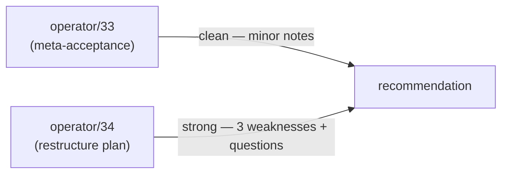

# Critique of operator/33 + operator/34 — restructure plan recommendations

Status: comprehensive critique + recommendations
Author: Claude (designer)

Operator landed two reports in succession:
- `~/primary/reports/operator/33-operator-29-critique-consequences.md`
  — confirmation of designer/32; readiness for code.
- `~/primary/reports/operator/34-sema-signal-nexus-restructure-plan.md`
  — the substantive restructure plan.

Headline evaluation:
- **Operator/33: clean acceptance.** Minor notes only.
- **Operator/34: strong overall, with three weaknesses and
  several open questions worth resolving before any code
  lands.** Recommend: ✅ adopt with §6 clarifications, but
  resolve the questions in §5 first.

I noted my reading-state honestly: I came to both reports
just-in-time via system-reminders.

---

## 0 · TL;DR

| Operator report | Verdict |
|---|---|
| 33 | **Clean acceptance.** No new architecture; correctly identifies design-as-settled. Minor: could have stated specific operational defaults for the two open user decisions. |
| 34 | **Strong overall plan.** 8-repo map is right; extraction-trigger reasoning is sound; risks table is honest. Three weaknesses worth addressing: ambiguous `sema`/`signal-core` boundary; vague step 6; missing migration plan for two real risks (schema-version + nexus daemon). |

Recommendation summary by report section:
- §1 (settled state): ✅ Strong
- §2 (target repo map): ✅ Strong; needs **clarification** on sema-vs-signal-core ownership
- §3 (layer boundaries): ✅ Strong; conservative first cut is right
- §4 (7-step pass): ⚠️ Weak on step 5 (largest work; subdivide) and step 6 (vague)
- §5 (signal-core first): ✅ Strong
- §6 (per-repo changes): ✅ Strong; one gap (signal-forge / signal-arca silence)
- §7 (rules to enforce): ✅ Strong
- §8 (risks): ⚠️ Two missing risks (schema migration, daemon disruption)
- §9 (next-report promise): ✅ Strong

---

## 1 · Operator/33 critique

### Strengths

Operator/33 correctly identifies that the design loop is
closed enough for code. The acceptance table (§1) names the
five settled points cleanly. The grammar-locked statement
(§2) reinforces the Tier 0 + 12-token outcome from
designer/31. The 8-step sequence (§3) is now the concrete
planning basis, with the kernel-extraction trigger placed
correctly (operator/29's sequence with `signal-core` between
nota-codec and the 12-verb scaffold).

### Weaknesses

Mostly meta — operator/33 is an acknowledgment, not new
work. Two minor notes:

1. **Two user decisions still open** (operator/33 §4: approval
   policy timing, module naming). Operator says "current
   default" for each but doesn't commit to specific operational
   defaults (e.g., what does "explicit approval first" look
   like in code? A blocking call? A transactional record?).
   Worth tightening when implementation actually starts.
2. **Skill work parallel** (§5) — operator says
   implementation should "obey [the rules] now" while
   documentation catches up. Right discipline. But the
   designer skill updates (designer/28 §7) haven't landed
   yet. **Designer-actionable; flagged as a gap below.**

### Recommendation: operator/33 stands as written.

---

## 2 · Operator/34 critique — strengths

### a. The repository map is correct

The 8-repo map is right. The split between universal kernel
(`signal-core`), text mechanics (`nota-codec`), text spec
(`nexus`), domain contracts (`signal`, `signal-persona`),
runtime substrate (`sema`), and per-domain stores
(`persona-store`, Criome's store) accurately reflects the
5-layer split agreed in the designer/operator arc.

### b. The extraction-trigger reasoning is correct

§5 names the trigger sharply: *"two domains need the same
spine."* `signal` for Criome, `signal-persona` for Persona.
Leaving the kernel in the existing `signal` would force
`signal-persona` to depend on a Criome-flavored crate —
exactly the boundary confusion `skills/contract-repo.md`
exists to prevent.

### c. The conservative first physical cut (§3)

Putting kernel + frame in one crate (`signal-core`) initially,
with logical layer names kept explicit, is the right
"crystallise from real use" discipline. Per
`skills/contract-repo.md` §"When to lift to a shared crate":
*"don't pre-abstract."*

### d. Risk-and-guardrail table (§8)

Five real risks named, each with a concrete guardrail. The
"beauty test" framing (*"if the dependency graph reads as a
workaround, the boundary is wrong"*) is the right
finishing test.

### e. Per-repo changes are explicit (§6)

For each of nexus, nota-codec, signal, signal-persona, sema —
operator names what changes and what stays. This is the
falsifiable implementation contract.

### f. Promise of follow-up implementation report (§9)

The plan separates *intent* from *record*. The implementation
report will document what actually happened. This matches
`skills/reporting.md` discipline.

---

## 3 · Operator/34 weaknesses

### W1 — `sema` ↔ `signal-core` boundary is fuzzy

Operator/34 §3 names two layers:

- **Sema kernel** — `signal-core` — *"every Sema-speaking
  domain needs the same request/reply spine"*
- **Sema actor/store** — `sema` — *"redb+rkyv storage
  patterns, slots, revisions, table wrappers, version-skew
  records, and actor-facing store mechanics"*

Both touch **slots and revisions**. Where do they actually
live?

My read — and I'd want operator to confirm:
- `signal-core` defines `Slot<T>` and `Revision` as **typed
  wire records** (rkyv-archivable identity types).
- `sema` defines the **runtime mechanics** for slots: how to
  allocate, how to dereference, how to bump revisions on
  CAS-style mutates; redb table wrappers; canonical encoding
  helpers.

So: signal-core has the *schema* of slots and revisions;
sema has the *behavior* around them. The wire types live up;
the runtime behaviors live down.

This is plausibly what operator means. **But operator/34
doesn't say it.** Without explicit ownership, the inevitable
question on the first commit will be: *"does `Slot::next()`
go in signal-core or sema?"* Better to settle now.

**Recommendation:** add a §3.5 to operator/34's plan that
names the slot/revision split: signal-core defines the wire
types; sema defines the allocation and persistence behavior.

### W2 — Step 5 is the largest piece of work, undivided

§4's seven steps are mostly right-sized except step 5:

> 5 — Rebase `signal` and `signal-persona`

Concretely, this requires:
- Drop `signal`'s copies of `Frame`, handshake, auth, version
- Re-import these from `signal-core`
- Update Criome's actors that consumed those types
- Update `signal-persona`'s scaffold (currently has its own
  Frame etc.)
- Re-run all tests
- Update both Cargo.tomls + flake inputs
- Coordinate with system-specialist if Criome's deployment is
  affected

This is several days of work folded into one step. The other
steps land an example file or a new repo or a single import
shim. Step 5 is qualitatively different.

**Recommendation:** subdivide step 5:
- 5a — Rebase `signal` (Criome) on `signal-core`; remove
  duplicated frame/handshake/auth.
- 5b — Rebase `signal-persona` on `signal-core`; replace its
  current scaffold's frame/handshake/auth with imports.
- 5c — Verify Criome's actors and tests still pass under the
  new dependency.

Each sub-step has a smaller blast radius and a discrete
testable outcome.

### W3 — Step 6 ("reorient sema docs/skeleton") is vague

§4 step 6 reads: *"Rewrite `sema` architecture so it is
reusable Sema substrate, not Criome-exclusive prose."*

What does this mean concretely?
- Is the existing `sema` repo's Rust code preserved?
- Is the architecture document being rewritten?
- Is there a code skeleton to scaffold?
- What's the falsifiable end-state — what file(s) exist
  after this step?

The other steps have clear outputs. Step 6 doesn't.

**Recommendation:** sharpen step 6 with concrete deliverables.
Probably:
- 6a — Rewrite `sema/ARCHITECTURE.md` to describe the
  reusable substrate (not Criome-exclusive).
- 6b — Define the public traits / types that `persona-store`
  and Criome's store will both implement / consume.
- 6c — Add a `sema` skeleton crate (or directory) with
  `todo!()` bodies for the substrate API.

### W4 — Two real risks not in the §8 table

The risks table is good but missing two:

**Missing risk: schema-version migration.** When `signal`
rebases on `signal-core`, existing Criome stores have records
archived under the OLD signal schema. Per
`skills/rust-discipline.md` §"Schema discipline", every
persisted store has a schema-version known-slot record,
checked at boot, hard-fail on mismatch. So old stores will
*refuse to start* with the new code. This is correct
behavior — but it requires a planned migration.

**Guardrail:** before step 5a (rebase `signal`), bump the
schema-version constant in signal; document a migration path
for any deployed Criome instance (probably: drop and rebuild,
since this is pre-stable). Same for any deployed
signal-persona scaffold (currently no consumers, so no
migration; document this).

**Missing risk: nexus daemon disruption.** Operator/34 §6
says nexus becomes domain-parameterized: *"text goes in,
typed domain request comes out."* But the current `nexus`
repo has a daemon implementation that's hardcoded to Criome.
The daemon's `Parser` and `Renderer` (per
`nexus/src/parser.rs`) hardcode the Criome verb dispatch.
Making this domain-parameterized is a real refactor.

**Guardrail:** before step 1 (Tier 0 examples), decide what
happens to the existing nexus daemon. Either:
- Keep the daemon Criome-specific for now; the Tier 0
  examples target the *spec*, not the *implementation*.
- Refactor the daemon to be domain-parameterized (substantial
  work, probably warrants its own step in the plan).

I lean toward the first — keep the daemon Criome-specific
until `signal-persona` is fully rebased and Persona has its
own daemon need. Then the parameterization happens once with
both consumers in hand.

### W5 — `signal-forge` and `signal-arca` not addressed

§2's repo map shows `signal` and `signal-persona` as the
domain contracts. But `signal-forge` (criome ↔ forge effect
verbs) is a real existing crate that depends on `signal`.
`signal-arca` is referenced in `signal/ARCHITECTURE.md` as
the writers ↔ arca-daemon leg, though I'm not sure it
exists as a repo yet.

Where do these fit in the new dependency graph?
- `signal-forge` currently depends on `signal`. If `signal`
  rebases on `signal-core`, does `signal-forge` *also* rebase
  on `signal-core`, or stay dependent on `signal`?
- The right answer is probably: `signal-forge` (and any
  `signal-<consumer>` layered crate) depends on
  **both** `signal-core` (for Frame, handshake, universal
  verbs) and `signal` (for the Criome record kinds it
  references in its effect verbs).
- This needs to be in the plan.

**Recommendation:** add `signal-forge` (and any other
existing or planned layered crates) to §2's repo map.
Operator/34 §6's per-repo treatment should also cover
`signal-forge`'s dependency change.

---

## 4 · Recommendations summary

| Section / Aspect | Verdict |
|---|---|
| Operator/33 — design acceptance | ✅ **Strong; adopt as written** |
| Operator/34 §1 settled-state | ✅ Strong |
| Operator/34 §2 target repo map | ✅ Strong; **add `signal-forge`** (and any other layered crate) |
| Operator/34 §3 layer boundaries | ✅ Strong; **add §3.5: slot/revision ownership split** between signal-core and sema |
| Operator/34 §4 step 1 (Tier 0 examples) | ✅ Strong |
| Operator/34 §4 step 2 (nota-codec) | ✅ Strong |
| Operator/34 §4 step 3 (create signal-core) | ✅ Strong |
| Operator/34 §4 step 4 (move kernel surface) | ✅ Strong |
| Operator/34 §4 step 5 (rebase domains) | ⚠️ **Subdivide into 5a/5b/5c** |
| Operator/34 §4 step 6 (sema reorient) | ⚠️ **Sharpen with concrete deliverables (6a/6b/6c)** |
| Operator/34 §4 step 7 (test/commit/push/report) | ✅ Strong |
| Operator/34 §5 signal-core first reasoning | ✅ Strong |
| Operator/34 §6 per-repo changes | ✅ Strong; **add signal-forge subsection** |
| Operator/34 §7 rules to enforce | ✅ Strong |
| Operator/34 §8 risks table | ⚠️ **Add schema-version migration + nexus daemon disruption** |
| Operator/34 §9 next-report promise | ✅ Strong |

Overall: **adopt operator/34 with these five sharpenings.**
None of the sharpenings change the plan's direction; they
fill gaps and reduce risk.

---

## 5 · Open questions for user / operator

These are the questions I'd want answered before any code
lands:

### For the user

1. **Approval-policy default for M0.** Operator/33 §4 and
   operator/34 §7 both keep "explicit approval for every
   proposal" as the default. Confirm: in M0, does
   bind-resolution recovery require human approval every
   time, or do you want a finer-grained mechanism even at
   M0 (e.g., auto-approve when LLM-confidence > 0.95)? The
   designer/28 §4 and operator/29 §5 default is full-human;
   confirm.

2. **Module naming default.** Operator/29 §8 recommended
   *"behavior names in code (`edit`, `read`, `compose`),
   modality names in docs."* Confirm: do you want this, or
   prefer modality names in code too (`cardinal`, `fixed`,
   `mutable`)? Either works; confirm before operator scaffolds.

3. **Schema-version migration.** Criome currently has
   deployed (or test-deployed?) signal-using actors. When
   `signal` rebases on `signal-core`, those actors stop
   working until rebuilt. Is this acceptable (drop-and-rebuild
   is fine pre-stable), or does Criome need a migration path?

4. **Existing `sema` repo state.** Is the existing `sema`
   repo a working codebase or a sketch? What needs to be
   preserved when "reorienting" it (operator/34 step 6)?

5. **`signal-forge` rebase.** `signal-forge` currently
   depends on `signal`. After signal rebases on signal-core,
   should signal-forge also depend on signal-core directly
   (so it gets Frame from the kernel), or continue depending
   only on signal (which re-exports core)? My recommendation
   is *direct dependency on signal-core* + signal for record
   kinds; confirm.

### For the operator

6. **Existing nota-codec @ work.** Operator/34 step 2 says
   *"Validate and finish existing `nota-codec` work around
   `@` and expected-type `PatternField<T>` decoding."* Is
   this already underway? What's the current state? (This
   affects whether step 2 is a few hours of polish or a
   substantial implementation.)

7. **Persona-orchestrate naming freed up.** Designer/14 named
   `persona-orchestrate` for workspace-coordination. Operator
   originally also named the Persona DB-owner
   `persona-orchestrate`, then renamed to `persona-store` per
   audit/15 finding §1. The freed-up name `persona-orchestrate`
   — is it still claimed for the workspace-coordination
   component (designer/14's bead `primary-jwi`)? Or should
   we re-discuss?

8. **Daemon implementation in nexus.** Will the existing
   `nexus` daemon stay Criome-specific in M0, or be
   domain-parameterized in step 1? My recommendation is
   *stay Criome-specific* until signal-persona's daemon need
   is concrete; confirm.

---

## 6 · Suggested final plan (with sharpenings applied)

The eight steps with my recommended modifications:

| # | Step | Output |
|---|---|---|
| 1 | Tier 0 examples in `nexus` | Canonical example file; targets the spec, not the daemon implementation (Q8) |
| 2 | `nota-codec` `@` + PatternField<T> | State of existing work clarified (Q6); final implementation lands |
| 3 | Create `signal-core` repo | Repo with Nix + Rust + AGENTS + skills + ARCHITECTURE skeleton |
| 4 | Move shared frame/kernel surface | `signal-core` has Frame, length-prefix, handshake, version, auth shell, 12-verb scaffold |
| 4.5 | **NEW: Slot/Revision split** | signal-core has wire types; sema has behavior — codified in both repo's ARCHITECTURE.md |
| 5a | Rebase `signal` (Criome) | Drop duplicated frame/handshake/auth; re-import from signal-core; bump schema version |
| 5b | Rebase `signal-persona` | Replace current scaffold's frame/handshake/auth with signal-core imports |
| 5c | Rebase `signal-forge` | Direct dependency on signal-core (per Q5); keep dependency on signal for record kinds |
| 5d | Verify deployed-actor migration | If Criome has deployed actors, document the migration path; drop-and-rebuild for pre-stable |
| 6a | Rewrite `sema/ARCHITECTURE.md` | Reusable substrate framing (not Criome-exclusive) |
| 6b | Define `sema` public traits | Substrate API: redb table wrappers, slot allocation, revision, version-skew |
| 6c | `sema` skeleton with `todo!()` | Falsifiable end-state for step 6 |
| 7 | Test, commit, push, report | Per-repo `nix flake check`, jj commits, pushes, then implementation report |

That's 12 sub-steps mapping the original 7 to a more
fine-grained schedule. Each sub-step has a discrete output;
each can be reviewed independently.

---

## 7 · Skill updates (designer-actionable, currently outstanding)

Per designer/28 §7 + operator/29 §7 + operator/33 §5, the
following skill updates remain on designer's plate. None of
them blocks operator's restructure; they should land in
parallel:

| Skill | Update needed |
|---|---|
| `~/primary/skills/contract-repo.md` | §"PatternField<T> ownership at the field decoder" — operator/13 §2's text-vs-expected-type table |
| `~/primary/skills/contract-repo.md` | §"Examples-first round-trip discipline" — operator/13 §8's mandate |
| `~/primary/skills/contract-repo.md` | §"Kernel extraction trigger" — extract when 2+ domain consumers exist |
| `~/primary/skills/contract-repo.md` | §"Delimiters earn their place" — corollary of report 31 §6 |
| `~/primary/skills/contract-repo.md` or new `skills/llm-resilience.md` | LLM-as-typed-proposals discipline |
| `~/primary/skills/rust-discipline.md` | §"Evolutionary correctness ladder" — string → newtype → enum → typed lattice |

I should open a designer bead for these and land them in
batch when next claiming the skills directory. Operator's
implementation should already obey them; the skill text
catches up.

---

## 8 · Bottom line

**Operator/33: clean acceptance, adopt as written.**

**Operator/34: strong restructure plan, adopt with five
sharpenings:**
1. Add slot/revision split (§3.5).
2. Subdivide step 5 into 5a/5b/5c.
3. Sharpen step 6 with concrete deliverables (6a/6b/6c).
4. Add two missing risks (schema migration, daemon
   disruption) to §8.
5. Address `signal-forge` (and any other layered crate) in
   the repo map and per-repo treatment.

**Eight open questions for the user / operator** (§5) should
be answered before any code lands.

The arc 22 → 32 (designer) + 9 → 34 (operator) closes a
substantial design exploration. The structural design is
settled; the implementation plan is right-sized except for
the five sharpenings above. Once those are addressed, the
next move is mechanical: examples, codec, signal-core,
domain rebase.

---

## 9 · See also

### Reports under critique
- `~/primary/reports/operator/33-operator-29-critique-consequences.md`
- `~/primary/reports/operator/34-sema-signal-nexus-restructure-plan.md`

### Internal arc
- `~/primary/reports/designer/26-twelve-verbs-as-zodiac.md`
  — the design substrate.
- `~/primary/reports/designer/28-operator-13-critique.md`
  — the prior critique that operator/29 + 33 + 34 build on.
- `~/primary/reports/designer/31-curly-brackets-drop-permanently.md`
  — grammar lock; referenced by operator/34 §2.
- `~/primary/reports/designer/32-operator-29-critique.md`
  — the immediately prior critique; operator/33 acknowledges
  it directly.
- `~/primary/reports/operator/29-operator-13-critique-consequences.md`
  — operator's prior implementation report; the 8-step
  sequence operator/34 expands.

### Skills
- `~/primary/skills/contract-repo.md` — kernel extraction
  trigger; layered effect crates.
- `~/primary/skills/rust-discipline.md` §"redb + rkyv" — the
  storage discipline relevant to the slot/revision split.
- `~/primary/skills/rust-discipline.md` §"Schema discipline"
  — the version-skew guard relevant to migration risk.
- `~/primary/skills/reporting.md` — the discipline this
  critique obeys.
- `~/primary/ESSENCE.md` §"Report state truthfully" — I
  hadn't read either operator report before they were
  surfaced in this turn.

---

*End report.*
