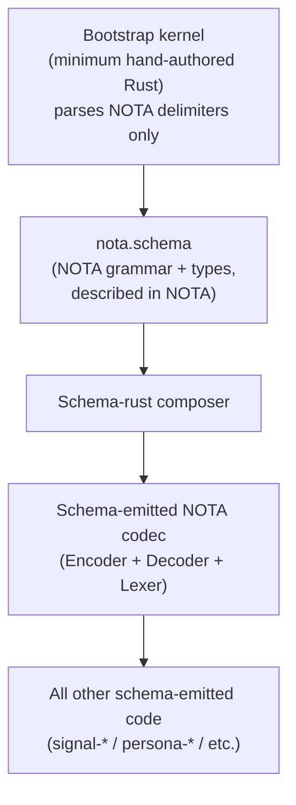

# 353 — Schema-derived NOTA: the new design

*Designer synthesis representing back the psyche directive from 2026-05-26. Pre-implementation: this report establishes the design baseline before any code lands. Intent captured as Spirit records 746-753 (Maximum).*

## §1 Frame

The psyche directive: **take schema all the way back to NOTA itself**. NOTA's own grammar and types are described by a schema (the foundational schema), and everything NOTA-related downstream is schema-derived from that point. The previous schema-crystallization work treated NOTA as fixed input to a schema engine; this re-framing inverts that — schema describes NOTA, and the Rust code that interprets NOTA is itself schema-emitted.

The previous drift cluster (EffectTable / FanOutTargets / StorageDescriptor as authored schema features per records 660-665, 710 — retracted per records 713-715, 730-732) was agents inferring runtime behavior into the schema layer. The new design replaces that scope creep with the cleaner statement: **schema is the interpretation mechanism for a delimiter-based language**; effects and runtime dispatch live in the Rust the schema emits, never in the schema's own user surface.

This is **not** a refinement of the prior POC at `designer-schema-poc-from-v0.3-main-2026-05-26`. It's a different stack starting at the foundation: the codec is schema-derived, not hand-authored Rust under schema-emitted contracts.

## §2 What schema is (the definition)

Per record 747: **schema is a way to interpret the delimiter-based language NOTA into standard typed interfaces.** An interface is the input and output for a type of relationship.

- NOTA carries delimiters (parens, brackets, curly-braces) and tokens (identifiers, literals)
- Schema interprets that delimiter tree as structured I/O for some interaction relationship
- The same NOTA text means different things in different contexts via different schemas applied to it
- Schema turns delimiters into typed I/O contracts; that's the whole mechanism

Per record 748: **NOTA is embedding-safe in any host language whose string syntax uses double quotes**. The bracket-only string discipline (record 698 — strings come from `[text]` / `[|text|]`, never `"..."`) is the carrier mechanism. Schema is the interpretation mechanism at each embedding site. Same payload, different interpretation per context.

## §3 The three-part schema structure (per record 751)

Each schema has a standard three-part structure with the second and third parts being optional (possibly recursively optional):

```
┌─────────────────────────────────────────────────────────────────┐
│ Part 1 — SPECIFYING (imports + exports)                         │
│   { import declarations }                                       │
│   exports / names this schema shares for object reference       │
├─────────────────────────────────────────────────────────────────┤
│ Part 2 — INPUT (optional)                                       │
│   [ operations / queries accepted ]                             │
│   header sub-part (or derived from assembled schema)            │
│   payload sub-parts per operation                               │
├─────────────────────────────────────────────────────────────────┤
│ Part 3 — OUTPUT (optional)                                      │
│   [ responses / replies emitted ]                               │
│   header sub-part (or derived from assembled schema)            │
│   payload sub-parts per response                                │
└─────────────────────────────────────────────────────────────────┘
```

Each of parts 2 and 3 has a special two-part sub-structure where the FIRST sub-part is the **header**. The header can alternatively be derived from the assembled schema (so schemas can omit it when derivation is unambiguous).

The Input/Output split corresponds to the psyche's "two-way" / "solar/lunar" framing from the prior turn (record 726): query vs response, two namespace ranges divided at the variant-numbering layer. Solar = input/query; Lunar = output/response/reflection.

## §4 NOTA is schema-derived (per record 746)

The recursion floor: NOTA's own grammar and types are described by a **`nota.schema`** file. Bootstrap requires a hand-authored kernel — the minimum Rust needed to parse the first schema before any schemas are loaded. Once the kernel loads `nota.schema`, the full NOTA codec emits from that schema.



The bootstrap kernel is a small fixed surface: enough lexer / parser to recognize the three delimiters + identifiers + literals. Everything else — including all the codec ergonomics, the bracket-vs-block decisions, the bare-identifier rules — emits from `nota.schema`.

This makes the discipline complete: nothing NOTA-shaped escapes the schema-derivation rule (per record 746 "all-the-way-back").

## §5 Three NOTA delimiters → three schema sections (per record 737 + 751)

The three NOTA delimiters correspond structurally to the three schema sections:

| Delimiter | Used for | Schema role |
|---|---|---|
| `( )` | Enum / variant declarations | Header forms — operations, response variants |
| `[ ]` | Positional struct field vectors | Body sections — Input/Output declarations; vectors of variants in order |
| `{ }` | Key-value maps | Namespace — user-defined types mapping name → definition |

The namespace section (curly map) is where the schema declares new type names. Each entry: a name (key) maps to a definition (value). Definitions can be enums (parens), structs (brackets), or macro invocations (whose shape determines interpretation per record 753).

The header sub-part of Input/Output sections lists the operations/responses by enum variant order (so the wire encoding matches the schema-declared order).

## §6 Macro extension mechanism (per record 753)

Schema variants can be:

- **Ordinary vectors / enums / structs** — the standard typed surface
- **Macros** — bring their own schema-reading logic

Each macro carries its own parsing engine. Macros use NOTA format but interpret structural **shape**:

- `{ identifier }` — single-identifier curly-bracket: macro reads as a name-only invocation
- `{ key1 type1 key2 type2 ... }` — even-count curly-bracket where key positions resolve to consistent type: macro reads as a map
- Other shape-specific interpretations as new macros enter the core

The schema language is **extensible via macros**: new declaration shapes become available as new macros land in the precompiled core OR in per-schema imports. The macro is the schema's escape hatch from positional-only structure into shape-driven structure.

## §7 The precompiled schema library + schema daemon (per records 749, 750)

The workspace ships a **library of precompiled schemas**:

- **Core namespace** — always implicitly loaded; contains the foundational macros, built-in types, NOTA primitives. Every schema gets the core for free.
- **Per-component schemas** — `signal-persona-spirit.schema`, `nota.schema`, etc. — loaded explicitly via the Specifying part of importing schemas.
- **Precompilation** — schemas live as in-memory namespace tables, not re-parsed at every interpretation site. Compile-once, resolve-many.

The **schema daemon** is the runtime arm:

- Owns the namespace surface + the cache
- Resolves cross-schema references (imports, exports)
- Agents and code emitters query the daemon
- Cached in memory; persistent across sessions where useful

This complements the existing persona daemons: `persona-spirit`, `persona-mind` (when it ships), and now **`persona-schema`** (or whatever the schema daemon is named — discipline says rename when the shape settles).

## §8 The new paradigm (per record 752)

The psyche's framing: this is the engine that turns NOTA into a powerful programming-interface specification language. **A revival of ASKI (the original meaning) — but more defined, more strict, perfectly strict; representing data as it is stored, in order.**

The aesthetic: **struct as a vector** — a series of things of fixed number, each name describing what that part is. Positional, predictable, embedding-safe.

The macro system lets us write specific domain languages for each interaction (between major actors first, eventually all). Each schema is itself a tiny domain-specific language for its interaction surface. Persona-spirit's wire schema IS the spirit interaction DSL. Persona-mind's wire schema (future) IS the mind interaction DSL. Each persona triad ships its own DSL.

## §9 What this design is NOT

Explicit non-claims to prevent the prior drift pattern:

- **NOT a Features section approach** — no `EffectTable`, `FanOutTargets`, `StorageDescriptor` as authored schema content. Per records 713-715, 730-732: schema declares data types only.
- **NOT an effect-emission scheme** — effects/dispatch live in the Rust the schema emits, not in the schema surface itself. The runtime composes effects from the schema's typed I/O; the schema doesn't declare them.
- **NOT a runtime-routing declaration** — channel routing is the daemon's runtime job consuming schema-emitted types; the schema doesn't declare routes.
- **NOT a "fan-out targets" declaration in schema** — subscribers/fan-out is runtime state, not schema content.

The schema describes what data flows in and out, with what types. The runtime composes everything else.

## §10 Concrete prototype plan

The prototype demonstrates feasibility — not full production replacement:

1. **`nota.schema`** — describe NOTA's grammar in NOTA. Tokens, delimiters, literals, identifiers. (Lives in the `nota` repo.)
2. **Bootstrap kernel** — minimum hand-authored Rust to parse the first schema. Read-only on `nota.schema`, then it can hand off to schema-emitted code.
3. **Schema-emitted NOTA codec** — `Encoder`, `Decoder`, `Lexer` emitted from `nota.schema` via the composer. Replaces `nota-codec`'s current hand-authored surface incrementally.
4. **Core namespace library** — a small set of schemas always implicitly loaded; carries the foundational macros and built-in types.
5. **Schema daemon prototype** — minimum surface to resolve and cache schemas. CLI to query namespace contents.
6. **Three-part schema demo** — a small example schema with all three parts (Specifying, Input, Output) showing the per-section structure and the header sub-parts.
7. **Macro shape-interpretation demo** — one or two macro definitions showing curly-bracket-single-identifier, even-count-curly maps, etc.

Branch name across affected repos: `designer-schema-derived-nota-2026-05-26`. Fresh branches, not based on the prior `designer-schema-poc-*` branches (which carry retracted drift).

## §11 Affected repos for the prototype

- `nota` — `nota.schema` lives here
- `nota-codec` — bootstrap kernel + schema-emitted codec replacement
- `schema` — three-part structure support; macro shape-interpretation; namespace handling
- `signal-frame` — composer adjustments for the new three-part shape
- Possibly a new `persona-schema` (the schema daemon) — if it warrants its own crate now, or stays in the schema repo until it does

Existing prior-POC branches (`designer-schema-poc-from-v0.3-main-2026-05-26`) stay as historical reference; the new prototype does not build on them.

## §12 What stays from prior work

- **Universal Unknown injection by macro** (records 693, 731) — behind-the-scenes mechanism survives; it's a macro that schema invokes, not a Features section.
- **The next/main/previous vocabulary** (record 672) — applies to schema versioning too. `nota.schema` will have a NEXT, MAIN, PREVIOUS as it evolves.
- **The bracket-only string discipline** (records 690, 698, 705) — load-bearing; schema relies on it for embedding-safety.
- **The two-way (solar/lunar) Input/Output split at variant-numeric-namespace ranges** (record 726) — formalized in the three-part structure here.
- **Side-by-side deployment** (record 672 deployment-layer applied) — the schema daemon, when it lands, will ship side-by-side like persona-spirit did.

## §13 References

- Spirit records 746-753 — the Maximum-certainty intent for this design
- Spirit records 698, 705 — NOTA bracket-only + embedding-safety (carrier mechanism)
- Spirit records 713-715, 730-732 — the retraction the prior drift forced
- Spirit records 717, 718, 734, 735 — file-ownership + don't-infer disciplines
- `/350` retraction report — the cleanup that preceded this design
- `/352` intent log audit — flagged records for psyche review
- Canonical schema example: `/git/github.com/LiGoldragon/signal-persona-spirit/spirit.schema`
- `/192` operator's prior implementation (read for cross-reference; NOT the foundation for this design)
