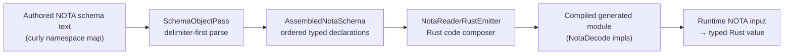
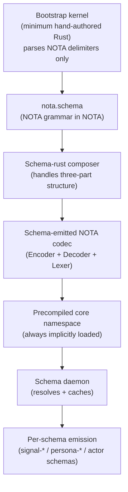
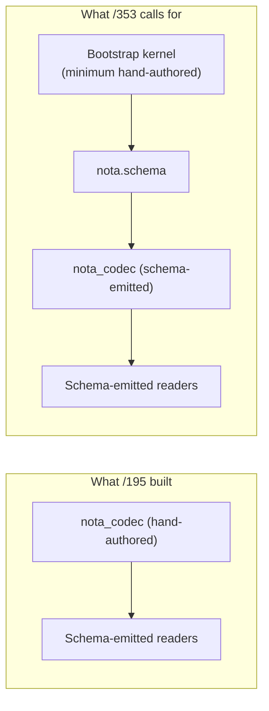
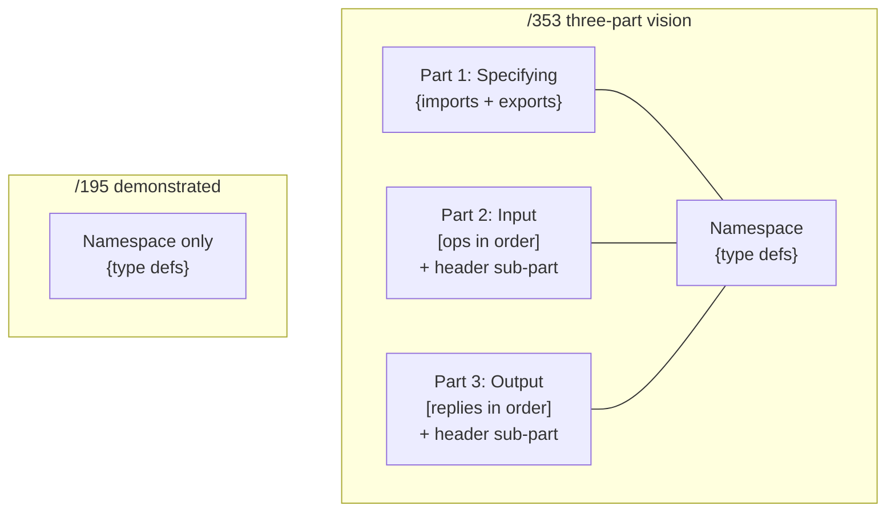

# 355 — Critique of operator/195: schema-driven NOTA reader prototype

*Designer-side critique comparing operator's prototype implementation (/195) against the design vision in /353. Surfaces what /195 accomplishes, where it diverges from the all-the-way-back claim, and the empirical findings worth carrying forward.*

## §1 What /195 set out to do

Operator's prototype implements a minimal slice of schema-driven NOTA reading:



Scope: one namespace map; struct/enum/alias from delimiter shape; emit Rust readers that consume `nota_codec::Decoder`; prove the emitted code decodes real NOTA. Branch: `operator-schema-driven-nota-parser-prototype-2026-05-26` on the schema repo, based on `operator-full-schema-spirit-2026-05-26` at `2498e5b3`.

## §2 What /353 set as the vision



Six discrete deliverables per /353 §10: `nota.schema`; bootstrap kernel; schema-emitted NOTA codec; three-part schema structure (Specifying / Input / Output); macro shape-interpretation; precompiled library + schema daemon (optional).

## §3 Direct comparison

| /353 vision deliverable | /195 implements | Status |
|---|---|---|
| `nota.schema` describes NOTA grammar in NOTA (record 746) | — | **Missing.** /195 schema-derives readers FOR NOTA payloads; nota_codec ITSELF stays hand-authored. The all-the-way-back claim isn't realized. |
| Bootstrap kernel boundary (the recursion floor) | — | **Not addressed.** Because /195 doesn't attempt self-hosting at the NOTA layer, the bootstrap question doesn't come up. |
| Three-part schema (Specifying / Input / Output) (record 751) | Only namespace section (the curly map) | **Partial.** /195 handles the `{ ... }` namespace but not the `[ ... ]` Input/Output sections or the imports/exports of Specifying. |
| Schema-emitted NOTA codec (record 746) | NotaReaderRustEmitter emits *readers*, not the codec itself | **Partial.** /195's emitter consumes nota_codec; doesn't generate it. The composer path described in /353 §4 (kernel hands off to nota.schema-emitted code) isn't taken. |
| Macro shape-interpretation (record 753) | — | **Missing.** All examples are vanilla struct/enum/alias. No `{ identifier }` single-id form; no `{ key1 type1 key2 type2 }` even-count map form; no shape-driven macros. |
| Precompiled library + core namespace (records 749, 750) | — | **Missing.** No implicit core; no namespace pre-loading; emission is per-call. |
| Schema daemon | — | **Missing.** No runtime resolution surface. Acceptable per /353 (marked optional within time budget) but operator didn't reach it. |

## §4 What /195 accomplishes (the strengths)

### §4.1 Working end-to-end pipeline (the load-bearing demonstration)

The prototype proves that schema text → delimiter object tree → ordered assembled tree → emitted Rust → compiled module → runtime decode WORKS. This is the load-bearing existence proof. From the report:

```text
schema text
  -> SchemaObjectPass::parse_text
  -> last curly namespace map
  -> ordered AssembledNotaType declarations
  -> emitted Rust
  -> compiled
  -> runtime decode against real NOTA input
```

That five-stage compile-and-run pipeline establishes the basic feasibility claim of the schema-derived approach. Without this, the whole design rests on speculation; with this, the rest of /353 is incremental rather than uncertain.

### §4.2 Order-preserving assembled tree (a real bug discovered + fixed)

The existing production `AssembledSchema` uses `BTreeMap<Name, AssembledType>`. That sorts types alphabetically, losing authored order. /195's `AssembledNotaSchema` uses `Vec<AssembledNotaType>` to preserve namespace order — exactly what /353 §8's "struct as a vector — series of things of fixed number, each name describing what that part is" demands.

From /195's discovery section:

> "The existing `AssembledSchema` type is not yet the final form for this design. It stores types in a `BTreeMap<Name, AssembledType>`, so it does not preserve authored namespace order. For schema as ordered storage truth, the final assembled form needs an order-preserving surface."

This is an architecture-level finding /353 didn't surface explicitly. Operator hit it empirically; the fix (Vec preserving order) is the right shape. /195 §"Next implementation slice" proposes either migrating `AssembledSchema` to preserve order while keeping lookup indexes, or letting the old form retire as the six-position compatibility surface. Both are reasonable; the migration approach is probably right.

### §4.3 Compiled-fixture test methodology (stronger than spec'd)

/353 spec'd "tests prove the bootstrap is clean: kernel alone compiles; kernel + schema-emitted compiles on top." /195 went further:

```text
generated string == tests/fixtures/generated_nota_reader/expected.rs
and expected.rs is included as Rust code in the integration test
```

The emitter output is BOTH:
- String-compared against a fixture file (catches emission drift), AND
- Compiled as part of the test crate (catches semantic regression), AND
- Used to decode real NOTA input at runtime (catches behavioral regression)

This three-way verification is stronger than what /353 outlined. The pattern is worth carrying forward as a standard test methodology for any schema-emitting composer work.

### §4.4 Reuses nota_codec — no parser fork (discipline kept)

The subagent survey at /195 §2 recommended "reuse `nota_codec::parse_sequence`, `NotaValue`, and `nota_codec::Decoder`; do not write a new NOTA parser." Operator honored this. The emitted readers depend on existing nota_codec primitives; no parallel parser was created. This is the right discipline for incremental work — but note: it also means /195 is downstream of nota_codec, not a replacement, which is the source of §3's "all-the-way-back missing" assessment.

### §4.5 Empirical positional-discipline enforcement

The emitted reader rejects labeled-field NOTA with `nota_codec::Error::LabeledFieldShape`. From /195:

```text
Rejects:  (Entry (topics [schema]) (kind Decision))
With:     nota_codec::Error::LabeledFieldShape
```

This is the AGENTS.md hard override ("NOTA records are positional, not labeled") enforced at the type-decode level, not just the documentation level. Proves the rule survives codegen.

### §4.6 No drift backsliding

/195 §2 lists what the subagent was told to avoid: "do not build on the retracted authored `Feature::EffectTable`, `FanOutTargets`, or `StorageDescriptor` surface." The prototype honors this. The emitted Rust contains no `Feature::*` references; the schema input has no Features section. Tests explicitly assert this. Discipline held.

## §5 Where /195 falls short of /353 (the gaps)

### §5.1 NOTA-itself-is-schema-derived — the all-the-way-back claim is unmet

Record 746 (Maximum): *"NOTA itself is schema-derived. NOTA's own grammar and types are described by a schema (the foundational schema). Everything NOTA-related is schema-derived from that point downward; the schema generates the Rust code that interprets NOTA."*

/195 schema-derives **readers FOR NOTA payloads** — Topic, Entry, Kind, etc. It does NOT schema-derive nota_codec itself. The `Decoder`, `Lexer`, `NotaValue`, `parse_sequence` are all hand-authored Rust. The foundational `nota.schema` doesn't exist.

This is the biggest divergence from /353's vision. /195 is downstream of nota_codec; /353 puts nota_codec downstream of `nota.schema` via a bootstrap kernel boundary. The recursion floor (§4 of /353) is not addressed.



This isn't a fatal gap — the prototype's demonstration is still load-bearing — but the all-the-way-back framing remains aspirational rather than empirical. A follow-on slice authoring `nota.schema` + a kernel boundary would close it.

### §5.2 Three-part schema structure is one-part-in-practice

/353 §3 + record 751 specified the three-part schema: Specifying (imports/exports) + Input + Output, each with header sub-parts. /195 demonstrates only the namespace map — which corresponds to a SUB-element of the design, not the whole shape.



The canonical example in `signal-persona-spirit/spirit.schema` HAS all three sections (the spirit.schema has imports, an operations `[ ... ]`, and a Reply `[ ... ]` outputs block). /195 chose to focus on the namespace; the operations and reply sections aren't demonstrated by the prototype's emitter.

A follow-on slice should demonstrate emission for Input + Output sections too — that's where actor-style interaction semantics live (operations accepted; replies emitted), and the universal Unknown injection (record 731) belongs on the Reply enum which is in the Output section.

### §5.3 Macro shape-interpretation absent

Record 753: *"Schema variants can be ordinary vectors OR macros that bring their own schema-reading logic. Macros use NOTA format but customize interpretation by structural SHAPE."*

/195 has no macro mechanism. All `(...)` is enum; all `[...]` is struct; all bare identifier is alias. The shape-driven interpretation (curly-with-single-identifier, even-count-curly maps, etc.) is the schema language's **extension mechanism** per /353 §6 — without it, the schema language is fixed at whatever the composer hard-codes.

This is an acceptable scope cut for a prototype (operator was bounded to the minimum slice), but it's worth surfacing as a load-bearing gap because shape-interpretation is what makes schema *extensible*. Without it, every new authored-form requires a composer change rather than a macro definition.

### §5.4 No precompiled library + no schema daemon

Records 749, 750 (precompiled library; schema daemon). /195 has neither. Schemas are loaded per-test; no implicit core namespace; no daemon to query for cross-schema resolution. This was marked "optional within time budget" in /353 §10 item 7, so the absence is acceptable; flagged here to track that the surface area for the full /353 vision is larger than /195's footprint.

### §5.5 Drift code in schema crate not removed

From /195 §"What this discovered": "the schema crate still contains the old `EffectTable`, `FanOutTargets`, and `StorageDescriptor` code and tests. This prototype does not use them and explicitly tests that emitted reader code does not mention `Feature`, but the old surface still needs removal in a separate cleanup."

Operator's prototype doesn't backslide into the drift; but it also doesn't *remove* the drift code. The retraction at /350 was a documentation/intent-level retraction; the code retraction is queued. /195 §"Next implementation slice" item 2 names this: "Remove authored `Feature` acceptance from schema parsing." This belongs to operator's follow-on slice.

## §6 The compiled-fixture test methodology — worth lifting to a skill

The three-way verification pattern (string-compare + compile + runtime-decode) is genuinely new methodology. Worth surfacing as a standard for ALL composer work:

```text
1. Emit code → string
2. Assert string == fixture file (catches emission drift)
3. Compile fixture file as part of test crate (catches semantic regression)
4. Use compiled module against real input (catches behavioral regression)
```

The fixture file is human-readable Rust that can be reviewed independently of the test running. Drift in the emitter shows up immediately as a fixture diff. Regression in behavior shows up as a test failure. The methodology is self-documenting.

Candidate skill: `skills/composer-fixture-testing.md` (if it doesn't already exist) capturing this discipline. Not creating it now — operator's report has it concretely; the skill can land when the methodology is applied in a second composer.

## §7 What this critique recommends

The next implementation slice — operator's call, surface here for designer-side cross-reference:

1. **Author `nota.schema`** describing NOTA's grammar in NOTA, in the `nota` repo (the spec-only repo). Even if `nota_codec` doesn't immediately consume it, the schema itself is a load-bearing artifact — it makes the all-the-way-back claim concrete.
2. **Define the kernel boundary** in `nota-codec`: minimum hand-authored Rust to read `nota.schema`. Rest of nota_codec emits from `nota.schema` via the composer (the path /195 demonstrated for downstream schemas, applied at the foundation).
3. **Extend `NotaReaderRustEmitter` (or its successor) to handle Input + Output sections** — the operations vector and the reply vector, with the universal Unknown injection on the reply enum (the behind-the-scenes macro, per record 731).
4. **Migrate `AssembledSchema` to preserve order** — /195 §"Next implementation slice" item 1. Either rename or relocate the BTreeMap surface to a lookup-index internal to the canonical ordered tree.
5. **Remove the retracted Feature surface from schema** code — /195 §"Next implementation slice" item 2. Should be a small mechanical change; tests already prove the new path doesn't use it.
6. **Add one macro shape-interpretation example** — pick the simplest: `{ identifier }` single-identifier as a macro invocation. Demonstrates the extensibility mechanism per record 753.

Items 1+2 close the all-the-way-back gap. Item 3 closes the three-part structure gap. Items 4-6 are quality-of-substrate.

## §8 Bottom line

**Accomplishments**: a working schema-driven reader prototype with stronger-than-spec test verification, order-preserving assembled tree (discovers + addresses a real bug), and disciplined non-use of the retracted Features territory. The prototype empirically demonstrates the load-bearing claim of schema-derived emission for actor-style typed payloads.

**Shortcomings vs /353**: the all-the-way-back claim (NOTA itself schema-derived) is unmet; the three-part schema structure is demonstrated only as one-part-in-practice (namespace only); macro shape-interpretation is absent; precompiled library and schema daemon are out of scope (acceptable per /353's "optional"); old drift code is not yet removed (acceptable — separate cleanup slice).

**Net assessment**: /195 is a solid first slice that makes the conservative scope cuts a prototype should make. It validates the design direction without trying to close every gap. The all-the-way-back framing remains aspirational and is the next meaningful slice — both for operator (item 1-3 of §7) and for the design's empirical-claim completeness.

## §9 References

- `/195` operator's prototype report — the subject of this critique
- `/353` designer's schema-derived NOTA design vision — the comparison baseline
- Spirit records 746-753 — the Maximum-certainty intent for the schema-derived design
- Spirit records 713-715, 730-732 — the prior retracted-drift cluster (what NOT to do; /195 honors)
- Spirit records 717, 718, 734, 735 — file-ownership + don't-infer disciplines (referenced for the critique's own restraint)
- Canonical schema reference: `signal-persona-spirit/spirit.schema` — the three-section shape the prototype's emitter would need to honor in full
- Operator's branch: `operator-schema-driven-nota-parser-prototype-2026-05-26` on schema repo
