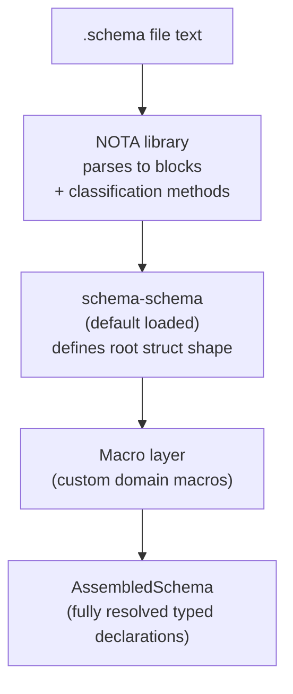

# 357 — NOTA as library, schema as root struct: the refined vision

*Designer's vision synthesis representing back the psyche refinement from 2026-05-26 (intent records 799-807, Maximum except 806 carry-uncertainty Medium). This narrows /353's design in two ways: (a) NOTA's scope is now explicitly "thin library for sense-of-structure" rather than full interpretation engine; (b) schema files are a single root struct (implied by .schema) with positional sub-struct fields, not three peer-level sections.*

## §1 Frame — what's refined from /353

/353 framed schema as the engine that interprets NOTA. That direction stays correct. This refinement narrows WHERE the work happens:

- **NOTA** is a thin library exposing structural query methods on parsed blocks (record 799)
- **Macros / the schema layer** is where interpretation happens (record 803)
- **Schema files** are a struct at the root, with positional sub-fields, not three independent sections (record 805)

The three-part structure from /353 §3 was close — it correctly identified the three substructural elements — but it framed them as peer sections rather than as positional fields of a single root struct. The refined model: the .schema extension IMPLIES the root struct; what authors write is the root struct's fields.

## §2 NOTA's narrowed scope (records 799, 800, 801, 802, 803)

### What NOTA does

NOTA exposes structural queries on parsed blocks. **Block** is the unit; methods on blocks are NOTA's surface:

```rust
impl Block {
    pub fn is_square_bracket(&self) -> bool;
    pub fn is_parenthesis(&self) -> bool;
    pub fn is_brace(&self) -> bool;
    pub fn holds_root_objects(&self) -> usize;
    pub fn root_object_at(&self, n: usize) -> Option<&Block>;

    pub fn qualifies_as_symbol(&self) -> bool;
    pub fn qualifies_as_pascal_case_symbol(&self) -> bool;
    pub fn qualifies_as_camel_case_symbol(&self) -> bool;
    pub fn qualifies_as_string(&self) -> bool;

    pub fn source_span(&self) -> SourceSpan;
}
```

These are **macro primitives**. People build macros that use these methods to walk blocks and apply domain-specific interpretation. NOTA does not interpret meaning beyond delimiter and symbol classification.

### What NOTA does NOT do

- Decide if a token IS a symbol (only whether it qualifies-as one)
- Decide if a PascalCase token is allowed as a type name in some context (type-level decisions live in the macro/schema layer)
- Resolve namespaces
- Apply schema rules
- Emit Rust

### The `qualifies_as` distinction (record 800)

This is load-bearing. Per record 800:

> *"NOTA does not concern itself with deciding whether it's allowed for something to be PascalCase or not."*

A token can `qualifies_as_pascal_case_symbol()` without being a symbol *in any particular interpretation context*. The check is **structural**: the token's character alphabet permits it to be a symbol if a higher layer decides to interpret it that way. Higher layers (macros, schema) own the interpretation decision.

### Default to the higher classification (record 801)

At parse time, NOTA classifies tokens with the HIGHEST classification they qualify for:

- A token matching the qualified-symbol alphabet is a qualified-symbol
- The schema layer can DEMOTE to a string when its type context requires
- Demotion (qualified-symbol → string) is easy
- Promotion (string → qualified-symbol) is hard

So NOTA defaults UP. The schema layer demotes DOWN when needed.

### Inside a vector, everything is qualified-symbol (record 802)

Per record 802 — a structural rule for vector contents:

```nota
[Topics Kind Description Magnitude]
```

Every element of this vector is a qualified-symbol. The vector is therefore an ordered struct type where each element is a field-type-name. Pattern variant for inner structs:

```nota
[[FieldA FieldB] [FieldC FieldD]]
```

Vector-of-vectors-of-qualified-symbols = struct with two inner-struct fields. This pattern resolves at the schema layer; NOTA only classifies the structure.

## §3 Schema as root struct (record 805)

### The structural shape

The `.schema` extension implies a root struct. No explicit root declaration is needed.

```
schema struct  (implied; no source representation)
├── Field 1: imports/exports namespace  (curly-bracket map)
└── Field 2: input/output struct        (square brackets)
    ├── Sub-field: input  (square brackets, optional)
    └── Sub-field: output (square brackets, optional)
```

### Each field's delimiter is its kind

| Delimiter | Kind | Schema role |
|---|---|---|
| `{ }` | map | Imports/exports namespace — keys are imported names, values are import-source declarations |
| `[ ]` | struct | Positional struct field vectors — the input/output struct lives here |
| `( )` | enum / variant | Used WITHIN sections for enum-variant declarations and data-carrying variants |

### Example mapping (using the canonical signal-persona-spirit/spirit.schema)

```nota
{
  Magnitude (ImportAll schemas/signal-sema/magnitude.schema)
  SemaSet (Import schemas/signal-sema/sema.schema [SemaOperation ...])
}

[
  (State (Statement))
  (Record (Entry))
  (Observe (Observation))
  (Watch (Subscription))
  (Unwatch (SubscriptionToken))
]

[]
[]

{
  ;; namespace: user-defined types and their definitions
  ...
}

[
  (Reply RecordAccepted StateObserved ...)
  (Event (belongs DomainStream) StateChanged RecordCaptured)
  (Observable (filter default) (operation_event ...) (effect_event ...))
]
```

Reading this against the refined model:

- `{ Magnitude ... SemaSet ... }` = Field 1 (imports/exports namespace)
- `[ (State ...) ... ]` = Field 2 (input/output struct's INPUT sub-field — operations accepted)
- `[]` `[]` = (currently empty — placeholder header sub-parts; per record 762 can be derived from assembled structure rather than authored)
- `{ ... user-defined types ... }` = inner namespace declarations (user-defined types)
- `[ (Reply ...) (Event ...) (Observable ...) ]` = output projections

The existing canonical example aligns with the refined model — what was framed as "three peer sections" in /353 §3 is more accurately "fields of a root struct" where the first square-bracket struct is the input/output container.

### Optionality (record 805)

The optionality applies to WHICH SUB-FIELDS appear inside the input/output struct, not to having separate top-level sections:

- Both input and output present: square-bracket struct has both sub-fields
- Only input: square-bracket struct has only input
- Only output: square-bracket struct has only output
- Neither (grammar-only schemas like `nota.schema` describing pure types): the input/output struct field is absent or empty

This matches how the prototype at /354 handled it: `nota.schema` has no input/output (grammar-only); `coordinate.schema` has both.

## §4 The default schema-schema (record 804)

Every schema file is read against an implicitly-attached **schema-schema** — the lowest-level macro primitive. The schema-schema defines what schema files look like (the root struct shape from §3).

Conceptually:



The schema-schema is itself a NOTA-formatted definition of the schema language. It's loaded as the default interpretation context. Custom schemas can extend it via the macro layer.

## §5 The schema-schema is core Rust (record 807)

Per record 807: the schema-schema is implemented as core Rust code — the **macro interface**. It's the lowest-level macro primitive. Other macros are built against it.

What this means concretely:

- A `MacroInterface` trait (or similar) is the contract macros implement
- The trait declares what inputs the macro takes + what they're called
- A macro's input type IS its name in the macro (per record 807)
- The schema-schema's Rust code defines this interface; everything else (user-authored macros, the schema files themselves) builds on it

### Macro interface sketch

```rust
pub trait Macro {
    fn name(&self) -> &str;
    fn matches_shape(&self, block: &Block) -> bool;
    fn lower(&self, block: &Block, ctx: &MacroContext) -> Result<AssembledNode, MacroError>;
}

pub struct MacroContext {
    namespace: NamespaceTable,
    parent: Option<Arc<MacroContext>>,
    schema_schema: Arc<SchemaSchema>,
}
```

`matches_shape` uses NOTA's structural-query methods (`is_square_bracket()`, `qualifies_as_symbol()`, etc) to decide if the macro applies. `lower` produces the assembled-node output for the macro's domain.

The schema-schema in Rust is a starter set of macros + the trait + the default-loaded definition. The rest of the workspace builds against this surface.

## §6 The carry-uncertainty: field ordering (record 806)

Open clarification — psyche named two options and didn't lock between them:

**Option A — Define-before-use (let-statement style)**: imports/exports first, then input/output struct. Existing canonical schemas follow this (signal-persona-spirit/spirit.schema starts with imports). Reads as: *"here's the namespace, here are the operations against it."*

**Option B — Function-signature style**: input/output first, then namespace. Reads as: *"here's what I accept and emit, here's the namespace it uses."*

The prototype defaults to Option A pending decision. Decision belongs to psyche; carry-uncertainty per `skills/architecture-editor.md`.

## §7 What this refinement clarifies in the in-flight prototype work

Subagent `aed752c4...` is concurrently creating the three new repos (spirit / signal-spirit / core-signal-spirit) + nota-next branch + block-by-block parsing prototype slice. That work LANDS the structural foundation per /354's prototype + records 774-777.

This refinement (records 799-807) adds the next layer:

1. **NOTA's API surface is narrowed** — the block-method names + `qualifies_as_X` discipline
2. **The promotion-direction rule** at parse time (default to higher classification)
3. **The vector-is-all-qualified-symbol structural rule**
4. **Schema files are a root struct with positional fields**, not three peer sections
5. **The default schema-schema** loaded with every parse
6. **The macro interface** as core Rust

The new prototype subagent (dispatched next) builds these layers on top of `aed752`'s foundation.

## §8 What the prototype subagent should build

Per psyche directive *"show me what you can implement faithfully as you can in either our new repos or in the branch of the old repos that we apparently are agreeing on making new repos now."*

1. **NOTA library surface** — Block type + `qualifies_as_X` methods + `is_X_bracket` methods + `holds_root_objects` / `root_object_at(n)` recursive query. Lives in `nota-next` branch of the existing nota repo OR in the new spirit-related repos depending on what fits (likely `nota-next`).

2. **The schema-schema as core Rust** — the `Macro` trait, `MacroContext`, `SchemaSchema` default. Lives in the schema repo (already has the right name per record 782).

3. **One end-to-end example schema** parsed against the schema-schema, producing AssembledSchema. The existing `coordinate.schema` from /354 is a candidate; or use `spirit.schema` from the new spirit repo (created by aed752).

4. **Constraint tests** pinning each of records 799-807 (intents-as-tests per record 777):
   - `constraint_799_nota_exposes_block_methods` (Block has the named methods)
   - `constraint_800_qualifies_as_not_is` (PascalCase token qualifies_as_symbol but doesn't decide is_type_name)
   - `constraint_801_default_to_higher_classification` (parser defaults to qualified-symbol when alphabet permits)
   - `constraint_802_vector_contents_qualified_symbol` (every element of a vector classifies as qualified-symbol or another block)
   - `constraint_803_nota_delivers_structure_only` (NOTA does not perform schema-level type resolution)
   - `constraint_804_default_schema_schema_loaded` (every schema parse loads the schema-schema implicitly)
   - `constraint_805_root_struct_implied` (schema files parse without an explicit root declaration; the root struct is implied by .schema)
   - `constraint_807_macro_interface_exposed` (Macro trait + MacroContext are public API)

5. **Open carry-uncertainty marker** — note in code/docs where the field-ordering decision (record 806) is pending; default to Option A.

## §9 What this refinement does NOT change

- The all-the-way-back claim (record 746) — NOTA itself is schema-derived; nota.schema describes NOTA's grammar
- The bracket-only string discipline (records 698, 705)
- The retraction of EffectTable / FanOutTargets / StorageDescriptor (records 730-732)
- The file-ownership rule (record 717) — per-scope INTENT.md placement
- The renaming direction (records 765, 767, 780) — new repos spirit / signal-spirit / core-signal-spirit
- The compiled-fixture test methodology surfaced from /195 (carry-forward worth keeping)

## §10 References

- Spirit records 799-807 (this turn's Maximum-certainty intent + carry-uncertainty 806)
- Spirit records 774-777 (the prior turn's block-by-block parsing intent — foundation)
- Spirit records 746-753 (the all-the-way-back direction this refines)
- `/353` — the design vision this refinement narrows
- `/354` — the existing prototype foundation
- `/355` — the critique of operator/195 (compiled-fixture test methodology to honor)
- Canonical schema reference: `signal-persona-spirit/spirit.schema`
- AGENTS.md hard overrides (NOTA bracket-only, methods-on-impl-blocks, etc.)
