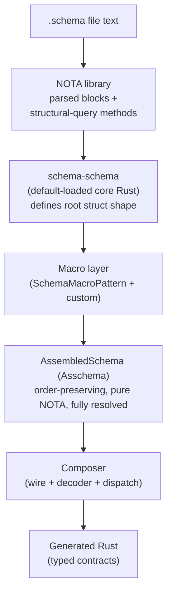

# 359 — Implementation-target design from prototype audit

*Designer-lane subagent audit + synthesis per psyche 2026-05-26 (intent record 810). Walks the recent prototype landscape across operator, designer, and designer-assistant scopes; selects the best parts; produces one concrete implementation-target design that the next operator slice can consume. Newer prototypes are weighted as carrying more recent intent; older branches remain useful evidence (record 810).*

## Frame (per psyche 2026-05-26 directive)

The psyche directive frames this report as "audit the recent prototypes, pick the best parts, distill into one implementation-target design for operators" (record 810). Six independent prototype tracks landed across the last two days:

- The operator chain `/192 → /193 → /194 → /195 → /196 → /197 → /198` — production-adjacent implementation on the `schema` repo with delimiter-first parsing, compiled-fixture testing, and a structural macro-pattern matcher.
- The designer-assistant chain `/354 → /356` — a quarantined prototype crate with a hand-authored bootstrap kernel, three-part schema reader, in-process library, and the block-by-block parser slice that now includes the three new repos (`spirit`, `signal-spirit`, `core-signal-spirit`) and the `nota-next` branch.
- The designer chain `/353 → /355 → /357` — the design vision, the critique of operator/195, and the refined "NOTA-as-library / schema-as-root-struct" narrowing per records 799-807.
- The retraction work `/350` + `/352` — the cleanup that defined what NOT to do (no authored Features section; no EffectTable / FanOutTargets / StorageDescriptor; no agent-drift).

What follows weighs each track against records 730-811 and selects what survives, what to avoid, and what to build next. The synthesis is for operator's consumption; it does not modify prototype branches.

## §1 The prototype landscape — at a glance

Per record 810 weighting: newer prototypes carry more recent intent; older branches stay useful for evidence.

| Report | Branch / location | What it tried | Key finding | Verdict |
|---|---|---|---|---|
| `/192` (op, 2026-05-26) | `operator-full-schema-spirit-2026-05-26` | Full Spirit schema arc via `emit_schema!` with `EffectTable` / `FanOutTargets` / `StorageDescriptor` | Built around what was later retracted (records 730-732) | Mostly superseded; foundational tooling (multi-pass parser) still useful as substrate |
| `/193` (op) | same | `SchemaObjectPass` (delimiter-first object pass) + Spirit v0.3 skill correction | Delimiter-first parsing landed cleanly; v0.3 cutover documented | **KEEP** — `SchemaObjectPass` is the foundational object-shape pass |
| `/194` (op) | (reading) | Operator's reading of the restack direction | Four-layer pipeline named (NOTA object pass → schema interpretation → AssembledSchema → Rust composer) | **KEEP** — names the layer structure |
| `/195` (op) | `operator-schema-driven-nota-parser-prototype-2026-05-26` (`f9b5fdd4`) | Schema-driven NOTA reader emission via compiled fixture | Three-way verification (string-compare + compile + runtime-decode); discovers BTreeMap-order-loss bug | **KEEP** — compiled-fixture test methodology + order-preserving `AssembledNotaSchema` |
| `/196` (op) | same (`27254fc5`) | `SchemaBlockPass` source-block layer with recursive shape predicates | Block layer for macro-recognition; not yet paired with `NotaValue` | **KEEP** — block-pass with source spans + recursive predicates |
| `/197` (op, audit) | (read-only) | Gap-audit of current state | Names 10 gaps incl. stale repo INTENT, executable retracted Feature surface, three-shape coexistence | **KEEP** — load-bearing audit; the anchor for the cleanup slice |
| `/198/4-overview` (op, meta) | `operator-schema-driven-nota-parser-prototype-2026-05-26` (HEAD) | `SchemaMacroPattern` matcher; `QualifiedSymbol`/`SymbolClass` lift to structural layer | Macro-position consumes structural facts before semantic lowering | **KEEP** — macro-pattern matcher composes the structural predicates |
| `/353` (des) | (design vision) | The all-the-way-back design after `/350` retraction | Three-part schema; nota.schema; bootstrap kernel; macro shape-interpretation | **KEEP** — design baseline; sets the vision |
| `/355` (des, critique) | (critique of /195) | Compare /195 against /353's vision | Names what /195 achieves + the all-the-way-back gap | **KEEP** — three-way verification methodology named; carry-forward list |
| `/357` (des, refined) | (design refinement) | Refine /353 per records 799-807: NOTA-as-library, schema-as-root-struct | Block methods + `qualifies_as_X`; schema files are a root struct with positional fields | **KEEP** — narrows /353; load-bearing for the implementation target |
| `/354` (da, proto) | `designer-schema-derived-nota-2026-05-26` (`5d9b0ff`) on `schema` | Quarantined prototype crate: kernel + three-part schema reader + `EmittedCodec` + `MacroEngine` + `Library` + `coordinate.schema` | All-the-way-back demonstrated; bootstrap-kernel boundary proved | **KEEP** — bootstrap kernel design + three-part reader + library API |
| `/356` (da, proto) | `designer-schema-derived-nota-2026-05-26` (`0e04c22`) on `schema` + new repos | `Block` layer with source spans + recursive predicates; new repos `spirit` / `signal-spirit` / `core-signal-spirit` + `nota-next` branch | Block predicates with `holds_root_objects` / `root_object_at(n)` / `reemit`; 12 named constraint tests pinning records 774-777 | **KEEP** — the most recent designer-assistant landing; the new-repo scaffolds + the Block layer |
| `/358` | (in-flight at audit time; check `reports/designer-assistant/`) | (unknown contribution; not yet landed) | — | **Note as in-flight** — operator should check before starting Slice 1 |
| `/350` (des, retraction) | (retraction sweep) | Remove Features-section drift | Establishes the canonical authored schema shape (namespace-as-key-value-map, no Features section) | **KEEP** — defines what to avoid |
| `/106` (da, retracted) | `designer-schema-poc-from-v0.3-main-2026-05-26` (fork-end POC) | Earlier POC with `Feature::EffectTable` / `FanOutTargets` / `StorageDescriptor` | Drifted into authored Features section | **AVOID** — banner-retracted; carries the bad pattern |
| `/107` (da, retracted) | (same branch) | Self-hosting bootstrap with five reply-outcome enums + Features scaffolding | Mixed: enum declarations fine; Features scaffolding drifted | **AVOID** — banner-retracted |
| `/341` (des, banner-retracted) | (design rationale) | Schema crystallization architecture across §2.1-§2.7 | §2.5-§2.7 retracted (effect-table / fan-out / storage-descriptor); §2.1-§2.4 chosen | **KEEP for design rationale** — carries the why-the-other-shape-was-rejected substance |

## §2 What survives (the "best parts")

Per-area selection — naming the specific report's contribution that survives. The implementation target builds from these survivals.

### §2.1 NOTA library surface — from /357 §2 (refined per records 799-803)

The block-method API that NOTA exposes:

- `is_square_bracket() / is_parenthesis() / is_brace()` — delimiter classification
- `holds_root_objects() -> usize`, `root_object_at(n) -> Option<&Block>` — recursive object access
- `qualifies_as_symbol() / qualifies_as_pascal_case_symbol() / qualifies_as_camel_case_symbol() / qualifies_as_string()` — structural classification
- `source_span() -> SourceSpan` — origin tracking

The **qualifies_as** discipline (record 800): NOTA never decides whether a token IS a symbol in some interpretation context; only whether it *qualifies* structurally. Higher layers (macros, schema) own the interpretation decision.

This survives from `/357` and is partially demonstrated by `/356`'s `Block` layer + `/198`'s `QualifiedSymbol`/`SymbolClass` lift.

### §2.2 Block-by-block parsing — from /356 §"Part C" (per records 774-777)

The `Block` enum with source spans, recursive children, and shape predicates, plus the constraint-test discipline. From `/356`:

- `SourceSpan { start: SourcePosition, end: SourcePosition }` with byte_offset + line/column
- `Block { delimiter, span, root_objects, leaf_text, leaf_kind }`
- Methods: `is_parenthesis_block` / `is_square_bracket_block` / `is_brace_block` / `is_leaf` / `holds_single_root_object` / `holds_two_root_objects` / `holds_root_objects` / `root_object_at(n)` / `second_root_object_is_a_square_bracket_object` / `second_root_object_qualifies_as_a_symbol` / `reemit<'src>(&self, source: &'src str) -> &'src str`
- `BlockParser::reemit_concatenated` for assembly = concatenation (record 776)
- 12 named constraint tests pinning records 774-777

Operator `/196`'s `SchemaBlockPass` provides the same shape with slightly different naming; operator `/198`'s lift adds `QualifiedSymbol` and `SymbolClass` to the structural layer. **The composite** is the survival.

### §2.3 Schema-schema as core Rust — from /357 §5 + /354 §"Bootstrap kernel boundary" (per record 807)

The schema-schema is core Rust code — the macro interface that other macros build on. Three concrete elements:

- A `Macro` trait (or similar) with `name() / matches_shape(block) / lower(block, ctx)`
- A `MacroContext { namespace, parent, schema_schema }` runtime
- A default-loaded `SchemaSchema` that defines the root struct shape

The bootstrap kernel boundary from `/354`: minimum hand-authored Rust that reads the foundational schema. `/354` proves this is ~380 LOC; everything that talks about TYPES is downstream of `nota.schema`'s namespace.

### §2.4 Schema as root struct — from /357 §3 (per record 805)

The `.schema` extension implies a root struct; no explicit root declaration. The root struct has positional fields:

| Position | Delimiter | Role |
|---|---|---|
| Field 1 | `{ }` | imports/exports namespace map |
| Field 2 | `[ ]` | input/output struct (optionally with sub-fields per record 805) |

Each field's delimiter is its kind: `{ }` = map; `[ ]` = struct/positional fields; `( )` = enum/variant.

This narrows `/353`'s "three peer sections" framing — the refined model has them as fields of a single root struct (positional).

### §2.5 Composer pivot from route-derived to authored-features — surviving from /341's §2.1-§2.4 (NOT §2.5-§2.7)

The kept principles from the crystallization arc:

- §2.1 — Schema as self-describing code + wire + docs (record 656)
- §2.2 — Extensible header pattern (record 657; refined per record 762: headers derivable from assembled data type structure rather than authored)
- §2.3 — Schema is one canonical declaration; emission is the projection
- §2.4 — Header growth by extension, not by versioned wire-shape changes

The retracted §2.5 (InteractTrait / InteractionActor), §2.6 (effect-table), §2.7 (fan-out execution) are NOT carried forward. The composer's job becomes:

- Read AssembledSchema
- Emit wire types + decoder + dispatch surface from the typed namespace
- Apply behind-the-scenes macros (Universal Unknown, etc.) without requiring authored Features section

### §2.6 Universal Unknown injection by macro — from /353 §12 (per record 731)

Survives as behind-the-scenes macro mechanism. Not an authored schema feature. The composer's macro layer injects Unknown variants on response enums; authored schemas never see this surface.

### §2.7 Compiled-fixture test methodology — from /195 + /355 §6

The three-way verification pattern (worth lifting):

1. Emit code → string
2. Assert string == fixture file (catches emission drift)
3. Compile fixture file as part of test crate (catches semantic regression)
4. Use compiled module against real input (catches behavioral regression)

This is methodology that operator `/195` introduced and `/355` named as worth carrying forward. Apply to all composer work.

### §2.8 Order-preserving assembled tree (`AssembledNotaSchema`) — from /195 §4.2

Operator `/195` discovered the BTreeMap-order-loss bug in production `AssembledSchema` and fixed it with `Vec<AssembledNotaType>`. The order-preservation is **load-bearing for "schema as ordered representation of data as stored"** (record 744). The merged form needs:

- `Vec<AssembledNotaType>` as the canonical ordered storage
- Lookup index (HashMap) layered on top for fast-resolve, NOT as the canonical store
- This survives as the canonical assembled schema artifact (toward record 759's `Asschema`)

### §2.9 `SchemaObjectPass` foundation — from /193

The first-pass reader that:

- Parses any schema file into ordered top-level NOTA values
- Derives the schema namespace prefix from the file stem
- Classifies every root by delimiter (parens / brackets / braces / atom)
- Preserves curly-map entry order
- Exposes identifier vectors before semantic lowering
- Records recursive object paths so later passes can dispatch by position

This is the layer that needs MERGING with `/196`'s `SchemaBlockPass` (per `/197` gap 8). The combined pass produces `source span + block shape + typed value` for each object.

### §2.10 Bootstrap kernel boundary — from /354 §"Bootstrap kernel boundary"

The cut is clean: kernel knows three delimiters, two bracket-string forms, integers / floats / bytes / identifiers, line comments — ~380 LOC. Everything that talks about TYPES (variant tags, struct fields, string eligibility) is downstream of `nota.schema`'s namespace.

### §2.11 Macro shape-interpretation — from /354 §"Macro shape-interpretation demo" + /198 §"src/macro_pattern.rs"

`/354`'s `MacroEngine` classifies node shapes (`SingleIdentifierMap`, `KeyValueMap`, `NamedRecord`, `Vector`, `Unknown`). `/198`'s `SchemaMacroPattern` composes structural predicates (any object, any qualified symbol, exact delimiter block + child patterns, any-count child objects).

The composite: `SchemaMacroPattern` for matching structure; `MacroEngine` for classifying shape categories. Both are needed; both stay.

### §2.12 Schema daemon (deferred) — from /354 §"Schema daemon" (per record 750)

The `Library` API exposes the daemon's contract. Promoting to out-of-process is mechanical — Unix socket + NOTA RPC + the existing `signal-frame` shape. Defer to a follow-up; the in-process `Library` lands first.

## §3 What to avoid (multi-angle anti-patterns)

Per-failure-mode reference to specific reports.

### §3.1 Schema-defines-effects drift — from /350 + records 730-732

Do NOT reintroduce `EffectTable`, `FanOutTargets`, or `StorageDescriptor` as authored schema features. They are runtime dispatch / logic, not data. The reports `/106`, `/107`, and `/192` all built on this surface; `/350` retracted it. Per record 730: "Schema stays in its lane: it declares data types."

### §3.2 Authored Features section — from /350 + record 732

Authored schema files do NOT carry a Features section. The namespace IS the user surface. Universal Unknown injection by macro stays as behind-the-scenes mechanism; no user-visible Features section.

### §3.3 Inferring to close design gaps — from /352 + record 735

When intent on a question is unclear, surface as an open question for the psyche. Do NOT infer to close the loop; that produces fake intent that accumulates as hallucinated records. The retracted §2.5 (InteractTrait), §2.6 (effect-table), §2.7 (fan-out execution) in `/341` are all examples of agent-inferred drift the psyche never authorized.

### §3.4 Bundling work-orders into intent — from /352 + record 538

The implementation-target design IS the work-order substrate. Intent stays load-bearing only. Do NOT capture "implement Slice 1" as a Spirit record.

### §3.5 Cross-repo dependency thrashing — from /192 §"Branch Set" (lesson learned)

`/192` touched 10 repos in one branch. The lesson: prototype slices should stay scoped to ONE or TWO repos until the shape stabilizes. Multi-repo arcs come AFTER the contract surface settles (per record 780).

### §3.6 BTreeMap-order-loss in assembled schema — from /195 §4.2

The production `AssembledSchema` stores types in `BTreeMap<Name, AssembledType>`, sorting alphabetically and losing authored order. This violates "schema as ordered representation of data as stored" (record 744). The fix: `Vec<AssembledNotaType>` as canonical; HashMap as lookup index only.

### §3.7 Single-source-of-truth violations from dual emission — from /192 §"Spirit Signal Repos" (the lesson)

The `signal_channel!` and `emit_schema!` parallel emissions in `/192` violated the "schema IS the architecture" principle (record 656). The composer's job is to produce ALL projections (wire / runtime / storage / docs) from ONE schema; the dual-emission pattern fights this. The implementation target uses ONE assembled schema → multiple projections via the composer.

### §3.8 Quote-string drift in guidance — from /197 §"7"

Production `nota-codec` rejects `"` with `QuoteStringDelimiter`; production code does NOT accept quoted strings. But `repos/nota-codec/INTENT.md` and `skills/nota-design.md` still say the decoder accepts legacy quoted strings as migration input. This guidance drift must be corrected.

### §3.9 Stale repo-local INTENT — from /197 §"1"

`repos/schema/INTENT.md` still says the top-level `.schema` file has six fixed positional fields (imports / ordinary header / owner header / sema header / namespace / features). This contradicts records 730-732, 747-751, 805. Highest-risk documentation gap because agents are told to read repo INTENT.md when editing in a repo.

### §3.10 Three schema shapes coexisting — from /197 §"3"

The schema repo currently has at least three shapes: production six-position, operator reader prototype with one namespace map, designer-assistant five-block. The implementation target needs ONE canonical shape (per `/357`'s root-struct narrowing) and a migration boundary.

## §4 The implementation-target design

Concrete next-action design for operator. Sequenced. Each step names what to build, in which repo, which prior prototype's substance to draw from (with branch + commit), constraint tests required, and explicit non-goals.

### §4.1 Architecture

The target architecture (after restack):

The bootstrap kernel boundary: hand-authored Rust through `NotaLib`; everything from `SchemaSchema` downstream is schema-derived or schema-driven.

The schema daemon (record 750) sits beside `Macros` / `Assembled` — it caches assembled schemas + resolves cross-schema imports. Defer to Slice 7 / 8.

### §4.2 Where each survival goes

| Survival | Source | Target home |
|---|---|---|
| `Block` structural library | `/356` `prototype/src/blocks.rs` + `/198` `src/object_block.rs` + `/196` `src/object_block.rs` | `nota-next` branch (per record 781) |
| `qualifies_as_X` discipline | `/357` §2 + `/198` `QualifiedSymbol`/`SymbolClass` | `nota-next` branch |
| Bootstrap kernel | `/354` `prototype/src/kernel.rs` (~380 LOC) | `nota-next` branch |
| `nota.schema` foundation | `/354` `schema/nota.schema` (in nota repo) | `nota-next` branch (already authored on `designer-schema-derived-nota-2026-05-26` branch of nota repo) |
| `schema-schema` core Rust + `Macro` trait | `/357` §5 (new) + `/354` `prototype/src/schema.rs` | `schema` repo (existing) on a new operator branch |
| `SchemaMacroPattern` matcher | `/198` `src/macro_pattern.rs` | `schema` repo, on the operator branch |
| `AssembledSchema` (Asschema) — order-preserving | `/195` `AssembledNotaSchema` | `schema` repo, replaces production `AssembledSchema` |
| Three-part schema reader (refined as root-struct reader) | `/354` `prototype/src/schema.rs` + `/357` §3 root-struct narrowing | `schema` repo |
| `Library` (in-process precompiled cache) | `/354` `prototype/src/library.rs` | `schema` repo |
| Compiled-fixture test methodology | `/195` `tests/schema_driven_nota_reader.rs` | All composer-emitting tests |
| Composer pivot — emission projections | `/192` learnings + `/341` §2.1-§2.4 | `signal-frame/schema-rust` (existing) |
| `spirit` / `signal-spirit` / `core-signal-spirit` scaffolds | `/356` Part A | Already pushed; daemon implementation Slice 9+ |
| Schema daemon (out-of-process) | `/354` §"Schema daemon (deferred)" | New repo when shape settles (defer) |

### §4.3 Explicit non-goals for the implementation target

- **NO** EffectTable / FanOutTargets / StorageDescriptor as authored schema features (records 730-732)
- **NO** authored Features section in any `.schema` file (record 732)
- **NO** parallel `signal_channel!` emission alongside `emit_schema!` for the new path
- **NO** comments in production `.schema` files (record 419; `/197` §6 noted nota.schema/coordinate.schema as comment-heavy → strip before adoption)
- **NO** quoted-string acceptance anywhere new (record 703; production code already rejects)
- **NO** multi-repo arcs in any single slice (lesson from `/192`)
- **NO** subagent dispatches that open jj editor (record 808; enforce inline `-m` per `skills/jj.md`)

## §5 Repository assignment

Per `/197` audit + `/356` repo creation. Building on what foundation:

### `nota` repo

- **`main` branch**: stays as the current production nota grammar spec; do not disrupt.
- **`nota-next` branch** (created in `/356`; HEAD `45a7543`): home for the schema-derived stack's nota changes. Per record 781.
  - Lands: `Block` structural library (porting from `/356`'s `prototype/src/blocks.rs` + `/198`'s additions); `qualifies_as_X` methods; bootstrap kernel (porting from `/354`'s `prototype/src/kernel.rs`); `nota.schema` (porting from `/354`'s `schema/nota.schema` in nota repo).
  - Eventually replaces main when stable (per `skills/major-break-via-new-repo.md` once written).

### `nota-codec` repo

- **`main`**: stays in service while bootstrap kernel matures on `nota-next`. Operator gates migration on the bootstrap kernel proving full feature parity.
- Architecture doc updates only (per `/354` `nota-codec` slice).

### `schema` repo

- **`main`**: current production schema crate with six-position compatibility shape. Do not disrupt without operator-led migration.
- **`operator-schema-driven-nota-parser-prototype-2026-05-26` branch** (HEAD at the macro-pattern landing per `/198`): designated production-adjacent prototype branch. Per `/197` §10 the next operator slice continues here:
  - Builds on `/196`'s `SchemaBlockPass` + `/198`'s `SchemaMacroPattern`
  - Adds `schema-schema` as core Rust (per `/357` §5)
  - Adds `Macro` trait + `MacroContext` (per `/357` §5)
  - Migrates `AssembledSchema` to order-preserving `Vec<AssembledNotaType>` with HashMap lookup index (per `/197` §9)
  - Removes the retracted Feature surface from authored schema parsing (per `/197` §2)

### `signal-frame` repo

- **`main`**: holds existing `schema-rust` composer.
- Composer adjustments come AFTER schema-side shape stabilizes; do not modify in Slice 1.

### `spirit` / `signal-spirit` / `core-signal-spirit` repos (new, scaffolded per `/356`)

- **`main`**: contract-focused scaffolds. No daemon implementation yet.
- Daemon implementation is Slice 9+ after the new contract surface stabilizes.

### `signal-persona-spirit`, `owner-signal-persona-spirit`, `persona-spirit` (legacy)

- Stay as-is while the new triad scaffolds (per `/356` Part A; record 780 names the side-by-side approach).
- Eventually retire after the new `spirit` daemon proves replacement (operator + system-specialist authority).

## §6 Sequencing

Numbered slices in implementation order. Each carries: prereqs, deliverable, success criterion.

### Slice 1 — Guidance + test cleanup (operator)

**Prereqs**: none beyond reading this report.

**Deliverable**:
- Patch `repos/schema/INTENT.md` to remove the six-position / features framing; replace with the refined root-struct shape per `/357` §3 (record 805). Cite the records.
- Patch `schema/ARCHITECTURE.md` to match the same shape on the operator prototype branch.
- Patch `skills/nota-design.md` and `repos/nota-codec/INTENT.md` to remove the stale "legacy quoted strings accepted" claim (per `/197` §7).
- Convert authored Feature tests into rejection tests (per `/197` §2): tests that previously asserted `Feature::EffectTable` parses now assert it is rejected with a clear error.

**Success criterion**: `cargo test --workspace` green on the operator prototype branch with NO test that exercises the authored Feature surface positively. Repo INTENT.md content matches records 730-732, 747-751, 805.

**Why first**: per `/197` §"Bottom Line" — "the danger is stale guidance and parallel green prototypes preserving old shapes." Fixing the guidance is cheap and unblocks every later slice from operator confusion.

**Touches**: `repos/schema/INTENT.md`, `schema/ARCHITECTURE.md` (operator branch), `skills/nota-design.md`, `repos/nota-codec/INTENT.md`, `schema` tests.

### Slice 2 — `AssembledSchema` becomes order-preserving (operator)

**Prereqs**: Slice 1 (cleanup landed).

**Deliverable**:
- Migrate production `AssembledSchema` from `BTreeMap<Name, AssembledType>` to `Vec<AssembledType>` + `HashMap<Name, usize>` lookup index.
- Bring `/195`'s `AssembledNotaSchema::from_namespace_text` semantics into the production surface.
- Rename or alias toward `Asschema` (per record 759, 769).
- Constraint tests: declare authored namespace order; emit; assert order survives.

**Success criterion**: Schema-driven reader tests still pass; new constraint test `constraint_744_assembled_preserves_authored_order` passes; production `AssembledSchema` callsites compile against the new shape.

**Why second**: Foundation for every later emission; the order-loss is currently a silent correctness bug for "schema as ordered representation of data as stored" (record 744).

**Touches**: `schema/src/...` (production `AssembledSchema`), schema tests.

### Slice 3 — Merge block-pass and object-pass into one tree (operator)

**Prereqs**: Slice 2 (order-preserving `AssembledSchema` landed).

**Deliverable**:
- Merge `/196`'s `SchemaBlockPass` (source spans + recursive predicates) with `/193`'s `SchemaObjectPass` (typed `NotaValue` tree) into a single representation that pairs source span + block shape + typed value for each object.
- Apply `/198`'s `QualifiedSymbol` / `SymbolClass` lift to the merged tree.
- Constraint tests pin: every block carries source span, delimiter kind, qualified-symbol candidate status, typed value access via one method.

**Success criterion**: `cargo test --workspace` green; new constraint test asserts that the same parse tree has both span access (`block.source_span()`) and typed value access (`block.as_value()` or equivalent) without lining up two trees by position.

**Why third**: `/197` §8 + `/198` §"Gaps" identify this as the durable API gap. Macro lowerers can't safely consume two parallel trees indexed by position.

**Touches**: `schema/src/object_pass.rs`, `schema/src/object_block.rs`, `schema/src/nota_reader.rs`.

### Slice 4 — `Block` structural library migrates to `nota-next` (operator)

**Prereqs**: Slice 3 (merged block/value tree settled).

**Deliverable**:
- Port the merged `Block` API into `nota-next` branch of `nota` repo (per record 781).
- Land `qualifies_as_X` methods (per record 800 — `qualifies_as`, not `is`).
- Bootstrap kernel boundary: port `/354`'s `prototype/src/kernel.rs` (~380 LOC) into `nota-next`.
- Strip comments from `nota.schema` per record 419 + `/197` §6 (move prose to README/ARCHITECTURE).
- Constraint tests pinning records 799-803, 786, 787-789.

**Success criterion**: `nota-next` builds + tests green; `nota.schema` parses cleanly through the kernel + block layer; `schema` repo's operator prototype branch can depend on `nota` repo's `nota-next` branch for the structural API (cargo dep update).

**Why fourth**: `/197` §4 + record 781 — block layer belongs in nota proper; the schema repo's current placement was prototype-stage convenience.

**Touches**: `nota-next` branch (new code), `nota.schema` (clean up comments), `schema` repo's operator branch (depend on `nota-next`).

### Slice 5 — Schema-schema as core Rust + `Macro` trait (operator)

**Prereqs**: Slice 4 (Block library available in `nota-next`).

**Deliverable**:
- Implement the `Macro` trait + `MacroContext` + default-loaded `SchemaSchema` per `/357` §5 (record 807).
- Schema-schema declares the root struct shape per `/357` §3 (record 805): Field 1 = `{ }` imports/exports map; Field 2 = `[ ]` input/output struct.
- `MacroContext` carries: namespace table, parent context, schema-schema reference.
- `Macro::matches_shape` uses `Block`'s structural-query methods to decide if the macro applies; `lower` produces the assembled-node output.
- Constraint tests pinning records 803, 804, 805, 807.

**Success criterion**: `cargo test` green; constraint test `constraint_805_root_struct_implied` asserts schema files parse without explicit root declaration; constraint test `constraint_807_macro_interface_exposed` asserts `Macro` trait + `MacroContext` are public API.

**Why fifth**: The macro interface is core Rust (record 807). Without it, all subsequent macro work has nowhere to compose. `/198`'s `SchemaMacroPattern` is the matcher primitive; the `Macro` trait is the dispatch primitive.

**Touches**: `schema` repo operator branch — new `src/macro_interface.rs`, `src/schema_schema.rs`.

### Slice 6 — Three-part schema reader refined as root-struct reader (operator)

**Prereqs**: Slice 5 (`Macro` trait + `SchemaSchema` core Rust landed).

**Deliverable**:
- Port `/354`'s `prototype/src/schema.rs` (three-part reader) into the operator branch, narrowed to read the root struct per `/357` §3 (record 805 — first field is imports/exports map, second field is input/output struct).
- Sub-fields of the input/output struct: input (square brackets, optional), output (square brackets, optional). Per `/357` §3.
- Apply to existing `coordinate.schema` (from `/354`) as the demo schema; produce same assembled output as `/354`.
- Constraint tests pinning record 805 (root struct implied) + record 802 (vector contents qualified-symbol).
- **Carry-uncertainty marker** for field ordering (record 806 — Option A vs Option B): default to Option A (imports/exports first per existing canonical `spirit.schema`); note in code/docs where the decision is pending psyche.

**Success criterion**: `cargo test` green; the assembled output for `coordinate.schema` matches `/354`'s assembled output (3 input ops + 1 output op + 10 namespace types); new tests assert field-ordering carry-uncertainty is documented.

**Why sixth**: This is where the new authored-schema shape lands in production code. After Slice 5, the macro interface is in place; Slice 6 uses it for the schema language's own shape.

**Touches**: `schema` repo operator branch — `src/nota_reader.rs` (extend) or new `src/root_struct_reader.rs`.

### Slice 7 — Composer pivot + universal Unknown injection (operator)

**Prereqs**: Slice 6 (root-struct reader landed).

**Deliverable**:
- `signal-frame/schema-rust/RustComposer` consumes `Asschema` (order-preserving assembled schema) and emits Rust per the refined shape.
- Universal Unknown injection runs as behind-the-scenes macro (per record 731), NOT as an authored Features section.
- Apply compiled-fixture test methodology (per `/195` + `/355` §6): emit → string-compare against fixture → compile → runtime-decode.
- Remove the retracted-Feature emission paths from `schema-rust` (per `/197` §2).
- Generate one Spirit v0.3 reader from `signal-persona-spirit/spirit.schema` and compare against the current hand-written contract behavior.

**Success criterion**: One real Spirit v0.3 reader emits from `.schema`; round-trip tests against the hand-written contract pass; no `Feature::*` references in the emitted Rust; compiled-fixture three-way verification holds.

**Why seventh**: The composer is the projection layer. Schema → Composer → emitted Rust closes the chain for ONE real component (`spirit`). Until this lands, "schema is the architecture" stays aspirational.

**Touches**: `signal-frame/schema-rust/src/lib.rs`, fixture files, integration tests.

### Slice 8 — Library + precompiled core namespace (operator)

**Prereqs**: Slice 7 (composer pivot landed).

**Deliverable**:
- Port `/354`'s `Library` (in-process precompiled cache) into the schema repo: `Library::with_core(nota_schema_source)` + `library.load(name, source)` + `library.resolve(scope, name)`.
- Core fallthrough: when per-component schema doesn't declare a name, resolve against core.
- Constraint tests pinning records 749, 750.

**Success criterion**: `Library` resolves `coordinate.schema`'s reference to `TokenKind` via core fallthrough; loading two schemas with overlapping names is rejected or scoped explicitly.

**Why eighth**: Cross-schema reference resolution is needed before the schema daemon can serve external clients. The in-process `Library` proves the contract.

**Touches**: `schema` repo operator branch — new `src/library.rs`.

### Slice 9 — Schema daemon (out-of-process) — DEFERRED

**Prereqs**: Slices 1-8 landed and stable.

**Deliverable** (when authorized):
- Out-of-process schema daemon with Unix socket + NOTA RPC + signal-frame surface.
- Component triad shape: `schema` (daemon + thin CLI) + `signal-schema` (working signal) + `core-signal-schema` (policy signal).
- Per record 750: agents and code emitters query the daemon to resolve namespace references.

**Why deferred**: The in-process `Library` proves the contract first. Promoting to out-of-process is mechanical once the shape settles. Per `/354` §"Schema daemon (deferred)".

### Slice 10 — `spirit` daemon implementation — DEFERRED

**Prereqs**: Slices 1-7 landed; schema-driven contract surface for `spirit` stable.

**Deliverable** (when authorized):
- Implement the daemon for the new `spirit` repo (currently a contract-focused scaffold per `/356` Part A).
- Side-by-side deployment with legacy `persona-spirit` per record 672.
- Eventual cutover after parity proof.

**Why deferred**: Per record 780, new repos are contract-focused at scaffold time. Daemon implementation comes after contract surface settles.

## §7 Open shape questions for the psyche

Per record 735 don't-infer discipline — surfaced gaps, NOT inferred fills. Each is a question where the prototype made a smallest-reasonable choice, but the psyche may want a different shape.

### §7.1 Field-ordering inside schema root struct (record 806 carry-uncertainty)

Two options named in record 806:
- **Option A — Define-before-use**: imports/exports first, then input/output struct. Existing canonical schemas follow this. Currently default in `/354` + `/356`.
- **Option B — Function-signature style**: input/output first, then namespace.

The psyche has not locked between them. Slice 6 defaults to Option A pending decision. **Decision belongs to psyche.**

### §7.2 Empty-section convention for the root struct (open since /354)

`/354` reads `[]` for empty Input and `[]` for empty Output. `/357` §3 says the input/output struct may have BOTH sub-fields, ONLY input, ONLY output, or NEITHER (grammar-only schemas like `nota.schema`). Which is the canonical shape:

- Mandatory empty `[]` placeholders (current prototype), OR
- Truly absent fields (e.g. just `{ ... }` for a namespace-only schema)?

### §7.3 Kernel's bracket-disambiguation boundary (open since /354)

`/354`'s kernel currently resolves `[token token]` to Vector and lets schema position re-interpret as String when the position demands it. Alternative: emit only `BracketOpen` token and push ALL string-vs-vector decisions to the schema layer.

Which is the canonical cut for the bootstrap kernel?

### §7.4 Block leaf classification — defer to kernel or re-classify by position (open since /356)

The block layer in `/356` carries `leaf_kind: Option<NodeKind>` mirroring the kernel's `NodeKind`. Open: should the block layer carry its OWN classification or defer to the kernel's? Defer to kernel (avoids duplication) vs re-classify by source-position semantics ("a leaf in a Map-key position is always an identifier").

### §7.5 Reassembly separator policy (open since /356)

`reemit_concatenated` in `/356` joins blocks with a single space. Per record 776 "reassembly is concatenation"; literal interpretation has NO separator. Options:
- No separator (strict concatenation)
- Single space (current default)
- Original-source-between-blocks reconstruction

### §7.6 Schema daemon triad shape (open since /354 §"Open questions")

When schema daemon ships (Slice 9 deferred):
- Component triad `schema` (daemon + CLI) + `signal-schema` (working signal) + `core-signal-schema` (policy signal)?
- Or different shape for the schema layer?

The naming convention `schema` (not `persona-schema`) is consistent with the persona-prefix retirement (records 765, 767, 780) — but the psyche has not explicitly named the schema daemon's triad shape.

### §7.7 Bare-identifier eligibility — schema-driven vs universal rule (open since /354)

`/354`'s `EmittedCodec::is_bare_eligible` mixes a universal rule (`None` reserved; PascalCase first char excluded; identifier-class bytes only) with the schema's name set. Open: should the schema declare the universal eligibility rule too (e.g. as a `BareEligible` macro)? Or is the universal rule properly a kernel-level invariant outside any schema?

### §7.8 Variant-payload representation in nota.schema (open since /354)

`/354` authored enum variants as `(Tag Payload)` records inside the enum body (matching `spirit.schema`'s `Observation (State (Records RecordQuery) Topics Questions)`). Is that the preferred shape, or should the variant body use a different convention (e.g. `Tag(Payload)` macro syntax)?

### §7.9 `second_root_object_*` predicate naming (open since /356)

Per record 774: "recursive predicates like `second_root_object_is_a_square_bracket_object` / `second_root_object_qualifies_as_a_symbol`." These are long-explicit method names. Alternative: more compact `nth_root_is_square_bracket(1)` generalisation. Which is canonical?

### §7.10 In-flight `/358` — contribution not yet known

Sibling subagent `ae5a26c9...` was in flight at audit time. The directory `reports/designer-assistant/358-*` was NOT yet landed when this report was being written. If `/358` lands before operator picks up Slice 1, operator should read it and integrate any new survivals/anti-patterns into the slice plan. (Designer subagent surfacing this rather than waiting; psyche may want to direct.)

## §8 References

### Spirit records walked

- **Today's restack flow (730-811)**: 730-732 (retraction of EffectTable/FanOut/StorageDescriptor); 733-736 (intent discipline); 737-739 (delimiter-to-section + macro shape-interpretation); 740-745 (gap-fills from forwarded prompt); 746-753 (the all-the-way-back design); 754-757 (prototype constraints); 758-764 (operator/195 correction + AssembledSchema/Asschema naming + header derivation); 765-768 (persona-prefix retirement + owner→core terminology); 769 (Asschema naming); 770-778 (block-pass + macro recognition + repo authorization); 779-782 (repo creation authorization + nota-next + schema-repo-stays); 783-789 (NOTA as structural library narrowing); 790-796 (schema as root struct); 797-798 (bootstrap core schema in Rust + subagent dispatch authorization); 799-807 (`/357`'s refined vision — NOTA-as-library + qualifies_as + root struct + schema-schema as core Rust); 808 (jj-editor reinforcement); 809-811 (major-architectural-break methodology — feeds the new skill).
- **Earlier load-bearing records**: 419 (no comments in schema files); 656, 657 (schema crystallization principles that survive); 672 (side-by-side deployment); 690, 698, 705 (NOTA bracket-only string discipline); 717 (file-ownership rule); 726 (two-way solar/lunar); 729 (methods-only Rust); 731 (universal Unknown injection by macro); 735 (don't-infer); 736 (audit policy — agents flag, psyche supersedes); 762 (header derivation from assembled data); 763 (root signal shapes begin with input/output enum); 764 (seven root variants).

### Branches referenced (none modified)

- `LiGoldragon/spirit` `main` @ `1d1ba72` — new contract-focused scaffold (per `/356`)
- `LiGoldragon/signal-spirit` `main` @ `8a87870` — ordinary signal contract scaffold (per `/356`)
- `LiGoldragon/core-signal-spirit` `main` @ `bcd2d61` — privileged/control signal contract scaffold (per `/356`)
- `LiGoldragon/nota` `nota-next` @ `45a7543` — branch-start marker (per `/356` Part B; per record 781)
- `LiGoldragon/nota` `designer-schema-derived-nota-2026-05-26` @ `abdd9db` — `/354`'s `nota.schema` authoring
- `LiGoldragon/schema` `designer-schema-derived-nota-2026-05-26` @ `0e04c22` — `/356`'s block-parsing prototype slice
- `LiGoldragon/schema` `operator-schema-driven-nota-parser-prototype-2026-05-26` (HEAD per `/198`) — operator's macro-pattern matcher landing
- `LiGoldragon/schema` `operator-full-schema-spirit-2026-05-26` @ `2498e5b3` — `/192` foundation (mostly superseded by retractions)

### Prior reports

- **Designer**: `/341` (banner-retracted §2.5-§2.7; §2.1-§2.4 carry forward); `/350` (retraction sweep); `/352` (intent log audit); `/353` (design vision); `/355` (critique of /195); `/357` (refined vision per records 799-807).
- **Designer-assistant**: `/106` (banner-retracted POC fork); `/107` (banner-retracted self-hosting bootstrap); `/354` (prototype implementation of /353); `/356` (new repos + block parser).
- **Operator**: `/192` (full-schema Spirit branch — partly superseded); `/193` (`SchemaObjectPass` + Spirit v0.3 skill); `/194` (operator reading of restack); `/195` (compiled-fixture reader emission); `/196` (block pass); `/197` (gap audit — the anchor); `/198/4-overview` (macro-pattern matcher).

### Discipline files

- `AGENTS.md` hard overrides — NOTA bracket-only strings; methods-on-impl-blocks; jj headless inline; designers in worktrees not main; NOTA records positional not labeled.
- `INTENT.md` — workspace intent prose (file-ownership rule per record 717).
- `skills/intent-clarification.md` — when to ask vs infer (record 735 surface, not fill).
- `skills/skill-editor.md` — informed the major-break-via-new-repo skill (separate deliverable).
- `skills/feature-development.md` — feature-branch convention that the new skill complements but does not replace.
- `skills/component-triad.md` — the daemon + working signal + policy signal shape that the new `spirit` repos follow.
