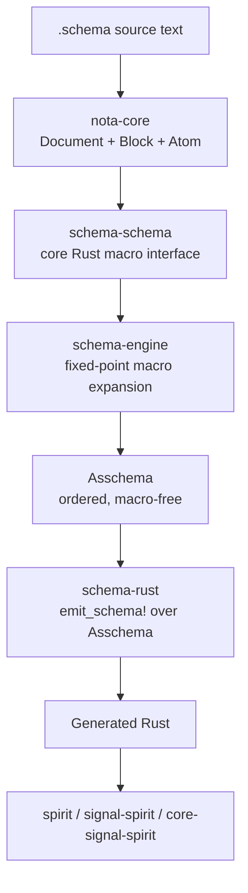

# 360 — Critique of operator/199: NotaCore / schema stack implementation target

*Designer-side critique comparing operator's implementation-target report (/199) against the design vision in /357 and the empirical landings at /358 + /359. Surfaces what /199 contributes that's new, where it diverges from /357, what its biggest gap is, and the synthesis recommendation.*

## §1 What /199 sets out to do



Six-layer architecture, six-phase implementation plan, new repo `nota-core-next` as the clean integration sandbox, first consumer = the three new Spirit repos. Roughly 800 lines covering layer-by-layer design + phased implementation + delete-or-fence list + Nix constraint tests.

## §2 What aligns with /357 (the designer vision)

| Claim | /199 | /357 | Aligned? |
|---|---|---|---|
| NOTA is a thin structural library | Layer 1 (NotaCore) | §2 | ✓ |
| `is_*` factual vs `qualifies_as_*` structural | §"Naming rule" | §2.3 | ✓ |
| Schema is data types only; no Features | §"Prototype parts to delete" | §9 | ✓ |
| Schema-schema is core Rust | Layer 2 | §5 | ✓ |
| Default-loaded schema-schema | §"bootstrapped floor" | §4 | ✓ |
| Order-preserving (no BTreeMap as canonical) | §3 Asschema properties | §8 Asschema reference | ✓ |
| Compiled-fixture test methodology | §"Keep from /195" | (referenced via /355) | ✓ |
| Macros use `MacroPosition` to read shape | §"target trait" | §6 macro shape-interpretation | ✓ |
| File-ownership for INTENT | (implicit) | §1 | ✓ |
| Carry-uncertainty for record 806 | §"Open questions §1" | §6 | ✓ |

Strong alignment on the load-bearing claims. The two reports agree on the substantive shape of the new stack.

## §3 What /199 contributes that /357 does NOT have

Five concrete additions:

### §3.1 The integration-repo strategy (`nota-core-next`)
/199's Layer 0: create a clean integration sandbox repo for the architectural break, with a clear deletion path back to canonical repo names. This aligns with intent record 811 (major-break-via-new-repo methodology) and operationalizes it concretely. /357 didn't propose a specific integration repo; it left the work scattered across `nota-next` branch, the new spirit repos, and the existing `schema`/`signal-frame` worktrees. /199's single integration lane is a cleaner shape.

### §3.2 Layer 4 — Header derivation
/199 §"Layer 4: header derivation" derives the 64-bit short header from `Asschema` rather than authoring it separately. Encodes:
- High-level namespace slot (input/output/core/ordinary)
- Root variant number from enum order or explicit stable numbering
- Nested variant numbers from data-carrying path
- Compile-time enforcement of the seven-data-carrying-root-variants limit per record 764

/357 didn't reach this concrete layer. /199's contribution here is load-bearing — it's the bridge between schema-declared types and wire-level dispatch.

### §3.3 Layer 6 — Schema diff + upgrade traits
/199 §"Layer 6" carries upgrade/downgrade generation as a first-class concern:

```rust
pub trait UpgradeFrom<Previous> { type Error; fn upgrade_from(previous: Previous) -> Result<Self, Self::Error>; }
pub trait DowngradeTo<Previous> { type Error; fn downgrade_to(&self) -> Result<Previous, Self::Error>; }
```

Plus a change-class taxonomy (zero-cost / append-only / projection / destructive / incompatible). NEXT version owns both directions: upgrade old → new + downgrade new → old for handover periods. /357 didn't reach this — it stopped at the schema-emit boundary; /199 carries the discipline through the migration layer too. Recall the prior /346 §4 upgrade-mechanism — /199 brings it into the new stack with traits matched to `Asschema`-diff.

### §3.4 Explicit delete-or-fence list
/199 §"Prototype parts to delete or fence" gives ten concrete items that must be removed from the new substrate. This is operationally precise; /357 implicitly relied on the existing retraction at /350 + records 730-732 but didn't enumerate.

### §3.5 Required Nix + constraint tests via derivations
/199 §"Required Nix and constraint tests" specifies grep-style constraints exposed through Nix derivations rather than ad-hoc shell:
- no `signal_channel!` in generated code
- no authored `EffectTable`, `FanOutTargets`, `StorageDescriptor`
- no `"` string delimiter in canonical NOTA
- no `BTreeMap` as canonical `Asschema` declaration order

That's structural enforcement at the build level. /357 had constraint tests as a discipline; /199 surfaces the explicit grep-prohibitions as Nix-enforced. Stronger.

## §4 Where /199 diverges from /357 (or stops short)

### §4.1 The all-the-way-back claim (record 746) is queued, not foundational

/199 §"Layer 1: NotaCore" describes NotaCore as a hand-authored Rust library that knows about delimiters, source spans, classification candidates, and block predicates. /199 §"Phase 0" plans `schemas/nota.schema` as a foundational schema BUT also `schemas/schema.schema` "once bootstrap permits."

/357 §4 (record 746): *"NOTA itself is schema-derived. NOTA's own grammar and types are described by a schema (the foundational schema). Everything NOTA-related is schema-derived from that point downward."*

/199 cuts this differently. NotaCore stays hand-authored; the schemas are *declarative descriptions for documentation and possibly future emission* but the actual NotaCore Rust is bootstrap. This is the same cut /354 + /358 made — hand-authored kernel boundary + schema-emitted everything else. /199's framing is internally consistent and pragmatic, but it doesn't realize record 746's deepest claim.

**The honest reading**: /199's plan + the empirical work in /358 IS the pragmatic resolution of the all-the-way-back claim. Pure all-the-way-back without a kernel is impossible; the question is where the kernel cuts. /199 cuts at NotaCore (delimiter parsing + classification). /357 implied the cut at "delimiters only" with codec emission from schema. /199's cut is wider — it keeps the codec-decisions in hand-written Rust too. That's a real divergence worth flagging.

### §4.2 Macro extensibility for user-authored macros is shallow

/199 §"Layer 2" describes the schema-schema's built-in macros (root schema / imports-exports / input-output / namespace map / enum / struct / newtype / import / alias) but doesn't dwell on how third-party macros get registered. The `MacroPosition` value carries the role but the public API for adding a new macro outside the built-in set isn't fleshed out.

/357 §6 (record 753): macros bring their own schema-reading logic; the schema language is extensible via macros; new shapes become available as new macros enter the precompiled core OR per-schema imports.

/199 supports this conceptually (the `SchemaMacro` trait is public) but the user-authored macro registration story is sparse. Worth surfacing for the implementation.

### §4.3 The schema daemon is deferred without a clear surface

/199 §"Open question 5": *"Schema daemon timing: keep schema daemon out of the first implementation target. The in-process library/cache proves the compile-time path first. Promote to daemon after Asschema stabilizes."*

That's reasonable, but /357 §7 had the schema daemon as part of the design surface (records 749, 750 — precompiled library + daemon). /199 collapses to "in-process library" with the daemon as future. This is a pragmatic delay rather than a divergence; both reports agree the daemon comes after stabilization.

## §5 Strengths — what /199 gets right

### §5.1 Concrete repo + crate structure
The proposed `nota-core-next/crates/{nota-core, asschema, schema-engine, schema-rust, schema-test-spirit}` layout is concrete enough for operator to build against. No design ambiguity at the structural level.

### §5.2 Six-phase implementation plan
Phase 0 (create integration repo) → Phase 1 (NotaCore) → Phase 2 (schema-schema macros) → Phase 3 (Asschema) → Phase 4 (composer) → Phase 5 (Spirit proof) → Phase 6 (migration back to final repos). Sequenced; each phase's deliverable + tests named. Operator can pick up Phase 0 immediately.

### §5.3 First-consumer choice is right
Targeting the new `spirit`/`signal-spirit`/`core-signal-spirit` triad (just created today) as the first consumer is the natural fit. Production stays on `persona-spirit` etc.; new stack proves itself on the new repos.

### §5.4 The compatibility-adapter discipline
*"Compatibility adapters may exist temporarily, but must be named as compatibility and tested as such."* This is the right operational rule. The old `AssembledSchema` can adapter-bridge into the new `Asschema` without contaminating the new center.

### §5.5 Bringing schema-diff + upgrade into the same target
Including UpgradeFrom/DowngradeTo + change-class taxonomy at the integration-target level (Layer 6) ensures the upgrade discipline doesn't get bolted on after the stack stabilizes. This connects /346's upgrade-mechanism to the new stack at the right time.

## §6 Weaknesses / gaps

### §6.1 The all-the-way-back cut is unstated
/199 doesn't explicitly name that record 746 is being interpreted-as-resolved-pragmatically rather than realized-literally. The all-the-way-back claim survives in the report's section structure (`schemas/nota.schema`) but not in the implementation (NotaCore is hand-authored Rust). A clearer "here's where we cut the recursion floor; here's why" framing would help future agents.

### §6.2 User-macro registration story
See §4.2. /199's `SchemaMacro` trait is public but the registration discipline is implicit. Especially as more domain-specific schemas land (each persona triad ships its own DSL per /353 §8), user-authored macros become load-bearing.

### §6.3 Naming choices
- **`Asschema`** as a name (per /199 §"Layer 3") is a clever pun on AssembledSchema → ASSchema → Asschema, but it lacks established usage. The existing `AssembledSchema` is well-known; `Asschema` saves four characters and adds a pronunciation question. Could go either way; worth psyche input on which sticks.
- **`nota-core-next`** vs alternatives — operator's open question §2 already flags this; psyche to decide.
- **`schema-rust`** vs other composer names — open question §3; flexible.

### §6.4 The Spirit v0.3 capability matching is named but not deeply scoped
/199 §"Phase 5: Spirit proof" lists v0.3 capability targets (record description-only multi-topic intent, daemon-stamped time, terse ack, observe by topic and kind, topic counts, generated readers/writers, short-header dispatch, schema hash, upgrade/downgrade for one schema change). That's a good acceptance criterion list, but the depth of each (especially upgrade/downgrade for ONE controlled change) needs concrete picking.

## §7 The biggest critical question

**Where does the recursion floor live?**

/357 says: minimum hand-authored kernel parses delimiters; everything else (including codec ergonomics + classification rules) emits from `nota.schema`. Kernel boundary is narrow.

/199 says: NotaCore is hand-authored Rust covering delimiters + spans + classification candidates + bracket-string forms. The kernel boundary is broader.

Empirically (per /358) the broader cut is what's been implemented and tested. The narrower cut from /357 was never tested — it remained aspirational.

If the narrower cut (codec-from-schema) is genuinely the design intent, /199 needs an explicit slice for that and an empirical demonstration. If the broader cut is acceptable, /199 is fine as-is but /357 §4's recursion-floor framing should be amended.

**This is the most-impactful synthesis question for psyche review.**

## §8 Synthesis recommendation

Combine /199 + /357 + /358 + /359 like this:

1. **Adopt /199's six-layer architecture + six-phase plan + `nota-core-next` integration repo strategy** as the operational backbone. This is the implementation-target.
2. **Honor /357's narrowed-NOTA-library framing + `qualifies_as_*` discipline** as it survives in /199 Layer 1 (already aligned).
3. **Honor /358's empirical proof + open shape questions** — /199 should reference /358 as the validation that the layers can actually be built.
4. **Honor /359's slice sequencing** — /199's six-phase plan and /359's eight-slice plan map closely; the synthesis would name which is the canonical sequence (/199's phases are coarser; /359's slices are finer).
5. **Resolve the recursion-floor question** (§7 above) via psyche input or explicit deferral. Until then, default to /199's broader cut empirically.
6. **Amend /357 with STATUS-BANNER** pointing at /199 + this critique + the refreshed vision in /361. /357's substance was correct at its moment; the synthesis advances past it.

The composite forms the **latest vision**.

## §9 Recommendation for operator on the implementation target

If operator proceeds on /199's Phase 0 + Phase 1 now:

- Phase 0 (`nota-core-next` creation + scaffold): immediate; mechanical
- Phase 1 (raw NotaCore): port from /358's `block_query.rs` + /354/356's `blocks.rs`; constraint tests for records 770-776 + 799-803
- Validate at Phase 1 end: `qualifies_as_*` discipline holds; ordering preserved; constraint tests green

This delivers a CONCRETE foundation for Phase 2 (schema-schema), which is where /358's `schema_schema.rs` (510 LOC) gets ported and the macro engine implementation begins.

The two open shape questions that block forward progress are:
- Record 806 (field ordering A vs B) — psyche must pick before Phase 2 macro positions are fixed
- Recursion floor cut (§7 above) — psyche should affirm /199's broader cut OR specify the narrower cut as a follow-on slice

Everything else in /199's open-questions list can be carried as carry-uncertainty.

## §10 References

- `/199` — operator's NotaCore / schema-stack implementation target (the subject of this critique)
- `/357` — designer's "NOTA as library, schema as root struct" vision (the prior latest vision)
- `/358` — designer-assistant's NOTA-library + schema-schema prototype (empirical landing; 51/51 tests)
- `/359` — designer-assistant's implementation-target design from prototype audit (parallel to /199)
- `/355` — designer's critique of operator/195 (compiled-fixture test methodology baseline)
- `/350` — schema-feature-drift retraction (what /199 honors)
- Spirit records 746-753 (the all-the-way-back direction + macro extension)
- Spirit records 799-807 (the NOTA-library + root-struct refinement)
- Spirit record 811 (major-break-via-new-repo methodology — /199 operationalizes)
- The compiled-fixture test methodology surfaced from /195
- Canonical schema reference: `signal-persona-spirit/spirit.schema`
- Recent new repos: `LiGoldragon/spirit`, `LiGoldragon/signal-spirit`, `LiGoldragon/core-signal-spirit`
