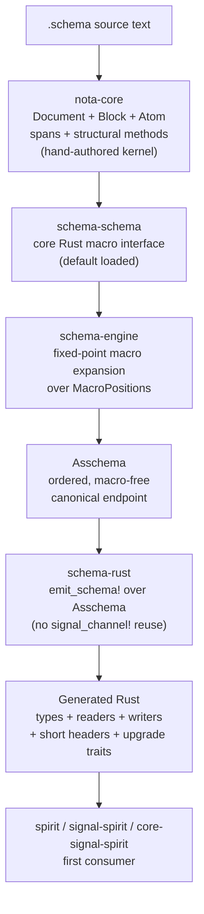

# 361 — Latest vision: the schema-derived NOTA stack (refreshed)

*Designer's latest vision report as of 2026-05-26, end of session. Synthesizes /357 (NOTA as library, schema as root struct) + /199 (operator's six-layer architecture + integration repo) + /358 (empirical NOTA-library + schema-schema prototype; 51/51 tests) + /359 (audit-driven implementation target with eight slices) + /360 (critique of /199). Supersedes /357 as the latest vision; /357 carries the STATUS-BANNER pointing here.*

## §1 What's new since /357

Five concrete advances since the prior vision document:

1. **Empirical landing**: `/358` proved the NOTA-library + schema-schema layers compile and test end-to-end (51/51 tests across kernel + schema + block-parser + schema-schema constraint-proof files). Records 799-807 are no longer aspirational; they're verified.
2. **Operator's parallel architecture**: `/199` (NotaCore / schema-stack implementation target) brings six-layer architecture + Asschema endpoint + header derivation + schema-diff upgrade traits + integration-repo strategy + explicit delete-or-fence list. Operator independently converged on most of the same shape and added concrete layers /357 didn't reach.
3. **New repositories landed**: `LiGoldragon/spirit`, `LiGoldragon/signal-spirit`, `LiGoldragon/core-signal-spirit` are created (per record 765 + 767 + 780). Initial scaffold + INTENT.md fresh per per-repo file ownership (record 717).
4. **New methodology + skill**: `skills/major-break-via-new-repo.md` captures the discipline for using `-next` / `-v2` / longer descriptive suffixes when starting a parallel implementation track for major architectural breaks (record 811).
5. **Discipline reinforcements landed**: `skills/jj.md` got an at-a-glance cheat sheet at the top; `ui.editor = "false"` is on a feature branch awaiting activation (intent 808). Free-function ban (record 712 → 729 in v0.3) is in AGENTS.md hard overrides.

The vision below absorbs all five.

## §2 The schema-derived NOTA stack — at a glance



Six layers; each consumes the one below through typed data, not text macros. The whole stack lives in `nota-core-next` (the integration repo) until stable, then redistributes into final repos. **First consumer is the new Spirit triad**, matching production v0.3 capability before any persona-prefix retirement happens upstream.

## §3 NOTA — narrowed to a thin structural library

Per record 799 (and validated empirically in /358's `block_query.rs`):

NOTA exposes:
- **Block predicates** (factual): `is_square_bracket()`, `is_parenthesis()`, `is_brace()`
- **Object queries**: `holds_root_objects()`, `root_object_at(n)`, `reemit()`
- **Atom classification** (structural, not semantic): `qualifies_as_symbol()`, `qualifies_as_pascal_case_symbol()`, `qualifies_as_camel_case_symbol()`, `qualifies_as_kebab_case_symbol()`, `demote_to_string()`
- **Source spans**: byte offset + line + column

Naming rule (per record 800): `is_*` for factual delimiter/source facts; `qualifies_as_*` for candidate classification. Final semantic claims ("is a type name") are FORBIDDEN in nota-core — they belong to the macro layer.

Defaults to higher classification at parse time (record 801); demotion to string is easy from qualified-symbol; promotion the other way is hard. So parse high.

**Empirical witness**: /358's `block_query.rs` (297 LOC) implements this directly. `Classification` enum defaults to higher rank. 10 constraint tests pin the records 799-807 rules.

## §4 schema-schema as core Rust — and the recursion-floor cut

Per record 807 (and /199 Layer 2; validated empirically in /358's `schema_schema.rs`):

The schema-schema is **hand-authored Rust** implementing the `SchemaMacro` trait:

```rust
pub trait SchemaMacro: Send + Sync {
    type Input;
    type Output;
    fn name(&self) -> MacroName;
    fn matches(&self, object: &Object, position: MacroPosition) -> bool;
    fn parse_input(&self, object: &Object, ctx: &MacroContext) -> Result<Self::Input, MacroError>;
    fn lower(&self, input: Self::Input, ctx: &mut MacroContext) -> Result<Self::Output, MacroError>;
}
```

Plus `MacroContext`, `SchemaSchema::default()` with built-in macros (root schema / imports-exports / input-output / namespace / enum / struct / newtype / import / alias / etc.).

### The recursion-floor cut — explicit

Record 746 said *"NOTA itself is schema-derived"* — the all-the-way-back direction. In practice, the recursion floor lives at `nota-core`'s hand-authored Rust. /357 §4 implied a narrower cut (codec emission from `nota.schema`); /199 + /358 took a wider cut (nota-core stays hand-authored).

**The latest vision adopts the wider cut empirically** while preserving the narrower direction aspirationally:
- **Today**: hand-authored `nota-core` parses delimiters, spans, classifications; this is the kernel
- **`nota.schema` exists** as the declarative description (validated in /354); useful for documentation + future emission
- **`schema.schema` (the schema-schema declared in NOTA)** is queued — lands "once bootstrap permits" per /199 Phase 0
- **The recursion-floor is honest**: pure all-the-way-back without a kernel is impossible. The question is where to cut. We cut wider; we document the cut; we leave the narrower cut as a follow-on slice if it ever proves materially valuable

This is one of the substantive synthesis decisions from /360 §7. **Carry as Medium-certainty if psyche disagrees** — but the wider cut is the empirically tested path.

## §5 Three-section root struct schema

Per record 805 (+ /357 §3 + /199's Phase 2):

A `.schema` file IS a struct at the root — implied by the `.schema` extension; no explicit root declaration is authored. The root struct has fields:

| Field position | Section kind | Delimiter |
|---|---|---|
| 1 | Imports/exports namespace | `{ }` (curly map) |
| 2 | Input/output struct | `[ ]` (positional struct vector) — sub-fields are input + output |
| Inner | Namespace | `{ }` (curly map) — user-defined types |

Empty `[ ]` placeholders carry header sub-parts (or those derive from assembled structure per /199 Layer 4).

**Open carry-uncertainty (record 806)**: field ordering within the root struct — Option A (imports/exports first, let-statement style) vs Option B (input/output first, function-signature style). Current canonical schemas use Option A; prototype defaults to A; final lock pending psyche decision.

## §6 Asschema — the canonical macro-free endpoint

Per /199 Layer 3 (NEW — /357 didn't reach this name):

```rust
pub struct Asschema {
    pub identity: SchemaIdentity,
    pub imports: Vec<ResolvedImport>,
    pub exports: Vec<ExportedName>,
    pub roots: Vec<RootSurface>,
    pub namespace: Vec<TypeDeclaration>,
}

pub enum RootSurface {
    Input(EnumDeclaration),
    Output(EnumDeclaration),
    State(TypeReference),
    Storage(Vec<TableDeclaration>),
}

pub enum TypeDeclaration {
    Struct(StructDeclaration),
    Enum(EnumDeclaration),
    Newtype(NewtypeDeclaration),
    Alias(AliasDeclaration),
    Primitive(PrimitiveDeclaration),
}
```

Properties:
- **Order-preserving** (`Vec`, not `BTreeMap`) — /195's discovered bug; /358 fixed; /199 makes it canonical
- **Pure NOTA-representable** — `.asschema` golden fixtures land in tests
- **All macros resolved** — Asschema contains zero macro nodes by definition
- **Lookup indexes are derived**, never canonical storage
- **Serializable** as `.asschema` for debugging + future schema daemon cache

**Naming open question** (per /360 §6.3): `Asschema` (operator's pun on AssembledSchema → ASSchema → Asschema) vs sticking with `AssembledSchema`. Either works; psyche to decide if it matters.

## §7 Header derivation — Layer 4 (new in /199)

Headers DERIVE from Asschema, not authored separately. The 64-bit short header emits from the ordered enum tree:

- High-level namespace slot: input / output / core / ordinary
- Root variant number: from enum order or explicit stable numbering
- Nested variant numbers: from the data-carrying path
- Enforcement: at most seven data-carrying root variants per component per record 764 (`>7` is component-split pressure)
- Unit variants beyond the data-carrying root set use the wider variant namespace as no-payload endpoints

Test target: generated dispatch must triage a message from the short header BEFORE reading the full body, then prove the full decode lands on the same variant path.

This layer is genuinely new in /199 — /357 didn't reach it. It's load-bearing because it's the bridge between schema-declared types and wire-level cheap dispatch.

## §8 Composer + emit_schema! — over Asschema

Per /199 Layer 5 (+ /354 + /358's emission work):

`emit_schema!` is a **new structured composer over Asschema**. **Hard constraint**: it must NOT call, wrap, or emulate the old text-body `signal_channel!`. The composer is one of /199's explicit Nix-enforced grep-prohibitions (§5 of /360 references this).

Generated output:
- Rust structs, enums, newtypes
- NOTA reader/writer impls from Asschema
- rkyv/archive impls where applicable
- Short-header constants and dispatch tables
- Signal request/reply envelopes
- Sema projection traits where the schema declares a sema turn
- Version-projection traits for main/next upgrade and downgrade (Layer 6)
- Compile-time schema hash
- Test fixtures / debug snapshots of emitted modules

**Test methodology** (carried forward from /195 via /355 §6 to /199): three-way verification — emit → compare to checked-in fixture → compile fixture in test crate → run real decode/encode through fixture. **Every composer feature gets this**.

## §9 Schema diff + upgrade traits — Layer 6 (new in /199)

Upgrade/downgrade derives from diffing Asschema MAIN vs NEXT. Change classes (per /199):

| Change class | Behavior |
|---|---|
| **Zero-cost** | Append unit enum variant within current discriminant width |
| **Append-only** | Append struct field with explicit default or optional wrapper |
| **Projection** | Newtype wrap/unwrap, enum wrap, vector wrap, type rename with annotation |
| **Destructive** | Dropped field/variant, requires explicit discard annotation + migration report |
| **Incompatible** | Reorder without explicit stable numbering, variant reuse, field type mutation without projection — build fails |

Generated traits:

```rust
pub trait UpgradeFrom<Previous> {
    type Error;
    fn upgrade_from(previous: Previous) -> Result<Self, Self::Error>;
}

pub trait DowngradeTo<Previous> {
    type Error;
    fn downgrade_to(&self) -> Result<Previous, Self::Error>;
}
```

NEXT owns BOTH directions — upgrade old → new + downgrade new → old for handover periods (matches /346 §4 + /347 §6 spirit-next slot discipline).

Diff engine emits machine-readable upgrade plan + Rust trait impls. If the diff can't infer safe projection, the schema file MUST carry explicit upgrade annotation OR the build fails.

This layer connects the new stack to the existing /346 upgrade-mechanism cleanly. /357 didn't reach this; /199 carries it.

## §10 Repo strategy — `nota-core-next` integration + new Spirit triad consumer

Per /199 Phase 0 + record 811:

### The integration repo
**`LiGoldragon/nota-core-next`** is the clean integration sandbox for the architectural break. Crate layout:

```text
nota-core-next/
  crates/nota-core/          raw NOTA block parser + structural API
  crates/asschema/           canonical assembled schema data model
  crates/schema-engine/      schema-schema + macro registry + expansion engine
  crates/schema-rust/        emit_schema! composer
  crates/schema-test-spirit/ fixtures proving Spirit contract generation
  schemas/nota.schema        foundational NOTA schema, commentless
  schemas/schema.schema      schema-schema declaration (queued behind bootstrap)
  tests/                     Nix + Rust integration witnesses
```

### Final-repo redistribution (after proof)
- `nota` / `nota-codec` absorb `crates/nota-core`
- `schema` absorbs `crates/asschema` + `crates/schema-engine`
- `signal-frame` or standalone composer repo absorbs `schema-rust`
- `spirit` / `signal-spirit` / `core-signal-spirit` consume the generated contracts

### First-consumer selection
The first generated component proof targets the **new Spirit triad** (created today by aed752c4 subagent):
- `LiGoldragon/spirit` at `1d1ba72` — daemon/runtime component
- `LiGoldragon/signal-spirit` at `8a87870` — ordinary public socket contract
- `LiGoldragon/core-signal-spirit` at `bcd2d61` — privileged/core socket contract

Production `persona-spirit` etc. stay as production + migration reference.

## §11 Open shape questions — consolidated

From /357 + /358 + /359 + /199 + /360, the consolidated open shape questions for psyche review:

| # | Question | Source |
|---|---|---|
| Q1 | Root field ordering — Option A (imports first) vs Option B (input/output first)? | record 806, /357 §6, /199 §"Open §1" |
| Q2 | Recursion floor — affirm broader cut (nota-core hand-authored) OR specify narrower cut (codec-from-nota.schema) as a future slice? | /360 §7 |
| Q3 | Empty-section convention — when input or output is absent, is the placeholder `[]` or absent entirely? | /359 §7.2 |
| Q4 | Kernel bracket-disambiguation — `[text]` as raw-string at nota-core level OR raised to schema context? | /199 §"Open §4" + /359 §7.3 |
| Q5 | Schema daemon triad shape — does it become `persona-schema` / `signal-schema` / `core-signal-schema` eventually? When? | /357 §7, /199 §"Open §5" |
| Q6 | `Asschema` vs `AssembledSchema` naming — keep operator's pun or stick with established? | /360 §6.3 |
| Q7 | Block leaf classification cut — exact set of leaf candidate kinds + tiebreaker rules | /359 §7.4 + /358 §6.4 |
| Q8 | Reassembly separator policy — newline/space/none when re-emitting concatenated blocks? | /359 §7.5 |
| Q9 | Bare-identifier eligibility — exact alphabet + edge cases (numeric prefix, unicode) | /359 §7.7 + /358 §6.5 |
| Q10 | Variant-payload representation — `(Variant Type)` always, or `(Variant)` for unit + `(Variant Type)` for data-carrying, or other? | /359 §7.8 + /358 §6.3 |
| Q11 | Predicate naming convention — `is_X` strict vs `qualifies_as_X` for everything classification-shaped? | /359 §7.9 + /358 confirmed |
| Q12 | InputOutputStructMacro role-awareness — single macro with position-threaded `lower` or two separate macros? | /358 §6.2 |
| Q13 | Macro::lower return shape — single enum vs typed-payload-per-macro? | /358 §6.3 |
| Q14 | Schema-schema's own self-hosting — when does `schema.schema` declared in NOTA replace the hand-authored built-ins? | /358 §6.6 |
| Q15 | User-authored macro registration story — how does third-party code register a new macro for a schema's interpretation? | /360 §6.2 |

**Most impactful (psyche-blocking for Phase 2 of /199's plan)**: Q1 + Q2. Once these lock, Phase 2 macro positions become fixed.

## §12 Empirically demonstrated vs aspirational

| Element | Status | Evidence |
|---|---|---|
| NOTA library surface (`qualifies_as_*`, `is_X_bracket`, classification) | ✅ DEMONSTRATED | /358 prototype, 10 constraint tests pass |
| Schema-schema as core Rust (Macro trait, MacroContext, SchemaSchema) | ✅ DEMONSTRATED | /358 `schema_schema.rs` 510 LOC, end-to-end demo runs |
| Block-by-block parsing with spans | ✅ DEMONSTRATED | /356 `blocks.rs` 264 LOC, 12 constraint tests pass |
| Three-section root struct interpretation | ✅ DEMONSTRATED | /358 `lower_via_macros` positional dispatch |
| Universal Unknown injection | ✅ DEMONSTRATED | /104 (prior, retracted Features but Unknown survives) + /358 |
| Compiled-fixture test methodology | ✅ DEMONSTRATED | /195 + carried forward |
| Order-preserving Asschema (Vec) | ✅ DEMONSTRATED | /195 surfaced bug; /358 fixed |
| nota.schema describing NOTA grammar | ⚪ PARTIAL | /354 has `schema/nota.schema` with 23 bindings but nota-codec stays hand-authored |
| Header derivation from Asschema | 🔵 ASPIRATIONAL | /199 Layer 4 design only; no implementation |
| Schema diff + upgrade traits | 🔵 ASPIRATIONAL | /199 Layer 6 + /346 design; no implementation in new stack |
| Schema daemon | 🔵 DEFERRED | /199 explicitly defers post-stabilization |
| schema.schema declared in NOTA | 🔵 ASPIRATIONAL | Queued behind bootstrap per /199 Phase 0 |
| User-macro registration | 🔵 ASPIRATIONAL | /199 trait public; registration story sparse |

Five layers are empirically tested. Two are partially landed. Six are aspirational/deferred. The implementation target in /199 walks operator through landing the aspirational layers.

## §13 The synthesis — what to do next

For **psyche review**: Q1 + Q2 from §11 (field ordering + recursion floor) before Phase 2 of /199's plan begins.

For **operator**: /199 Phase 0 (create `nota-core-next`) → Phase 1 (port NotaCore from /358 + /356) → wait for Q1 + Q2 lock → Phase 2 onwards.

For **designer (me)**: this report IS the latest vision. Future refinements should layer additively (or supersede with a new STATUS-BANNER) rather than rewriting in place.

For **system-specialist**: activate the `ui.editor = "false"` jj config landed on `designer-jj-editor-false-2026-05-26` branch when convenient. Optionally activate the major-break-via-new-repo skill awareness.

## §14 References

- `/199` — operator's NotaCore / schema-stack implementation target (the primary new source absorbed here)
- `/357` — prior vision (NOTA as library, schema as root struct) — STATUS-BANNERed pointing here
- `/358` — designer-assistant's NOTA-library + schema-schema empirical prototype (51/51 tests)
- `/359` — designer-assistant's implementation-target design from prototype audit (parallel to /199)
- `/360` — designer's critique of /199 (the synthesis bridge)
- `/355` — designer's critique of /195 (compiled-fixture test methodology baseline)
- `/350` — schema-feature-drift retraction (the prior cleanup that enabled this stack)
- `/353` — original schema-derived NOTA design vision (foundation; not yet STATUS-BANNERed because the bracket-only + embedding-safety principles in it remain canonical)
- `/354` — schema-derived NOTA prototype (29/29 tests; nota.schema + bootstrap kernel)
- `/356` — new repos + block-parser prototype (12/12 tests)
- `skills/major-break-via-new-repo.md` — methodology skill (record 811)
- Spirit records: 746-753 (all-the-way-back direction), 799-807 (NOTA-library + root-struct refinement), 765, 767, 780, 811 (repo strategy + naming), 712/729 (free-function ban), 808 (jj editor reinforcement)
- New repos created: `LiGoldragon/spirit`, `LiGoldragon/signal-spirit`, `LiGoldragon/core-signal-spirit` + `nota-next` branch
- Canonical schema reference: `signal-persona-spirit/spirit.schema` (existing; matches the three-section root-struct shape)
- AGENTS.md hard overrides (NOTA bracket-only, methods-on-impl-blocks, jj headless, no subagent without permission except designer protocol, NOTA-only argument language)
