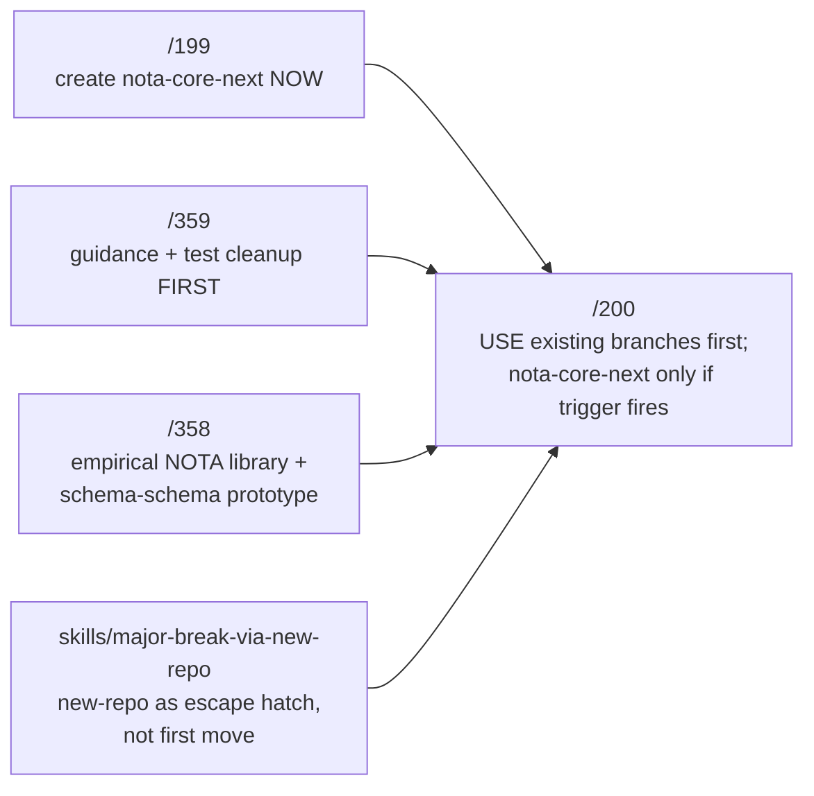

# 362 — Critique of operator/200: vision correction on repo strategy

*Designer-side critique of operator's refreshed vision (/200) which corrects /199's repo strategy. Surfaces what /200 changes, what it preserves, where it converges with /361 (designer's latest vision), and what /361 needs to absorb.*

## §1 What /200 sets out to do

/200 reads `/358` + `/359` + the new `skills/major-break-via-new-repo.md` and corrects `/199`'s repo recommendation. It explicitly does NOT replace /199's layered architecture — only its repo strategy + sequence priority.



## §2 The substantive correction in /200

| Element | /199 said | /200 says | Verdict |
|---|---|---|---|
| Where to land the core work | Create `nota-core-next` integration repo NOW | Use `nota-next` branch + `schema` operator branch FIRST | ✓ correct — /199 over-applied the new-repo methodology |
| First slice | Phase 0 = create integration repo + scaffold | Slice 1 = guidance + rejection-test cleanup | ✓ correct — matches /359's priority signal |
| New `spirit` triad timing | First consumer "now" | First consumer LATER, after composer is real | ✓ correct — the triad scaffolds aren't load-bearing until contracts emit |
| `nota-core-next` repo | Create immediately | DEFER; conditional on trigger | ✓ correct — skill says new repo is escape hatch, not default |

/200's correction is sound. The new-repo skill's trigger (per `skills/major-break-via-new-repo.md`) is "the existing repo's invariants no longer fit and agents cannot develop without cross-contamination." For this work, `nota-next` already exists as the major-break branch for nota and `schema` operator branch already holds the strongest prototype work. Skipping the integration-repo creation saves scaffold ceremony without losing discipline.

## §3 The macros-take-MacroPosition correction

/200 §"Slice 5" surfaces a specific correction to /358's prototype: `lower` should take `MacroPosition`, not just `matches_shape`. From /358's `InputOutputStructMacro::lower` returning input operations even for output positions — that's the symptom.

```rust
// /358 prototype shape
fn matches_shape(&self, block: &Block) -> bool;
fn lower(&self, block: &Block, ctx: &MacroContext) -> Result<AssembledNode, MacroError>;

// /200 corrected shape
fn matches(&self, object: &Object, position: MacroPosition) -> bool;
fn lower(
    &self,
    object: &Object,
    position: MacroPosition,
    context: &mut MacroContext,
) -> Result<MacroOutput, MacroError>;
```

This is empirical drift — the prototype hit it in `/358`'s open shape question §6.2 (`InputOutputStructMacro` doesn't know its own role); /200 makes the fix concrete. The same square-bracket shape needs different lowering depending on whether it's input-vector position or output-vector position, and `lower` must see the position.

## §4 What converges with /361

/200 + /361 agree on:

- Layered architecture (NotaCore + schema-schema + Asschema + composer)
- NOTA as thin structural library; `qualifies_as_*` discipline
- Order-preserving Asschema (no BTreeMap as canonical)
- Schema-schema as core Rust
- `emit_schema!` over Asschema; no `signal_channel!` reuse
- Universal Unknown injection as behind-the-scenes mechanism
- Compiled-fixture test methodology
- New `spirit` triad as eventual consumer (not first implementation home)
- Slice 1 = guidance + test cleanup (highest priority)

The substantive shared shape across operator's /200 + designer's /361 is roughly the same. The differences are:
- Repo strategy (/361 absorbed /199's `nota-core-next` recommendation; /200 reverses)
- Slice granularity (/200 has 7 slices; /359's 8 slices and /361's reference to /359 align)
- Macro `lower` signature (/200 makes the correction explicit; /361 inherited the shape from /358)

## §5 What /361 needs to absorb from /200

Three concrete amendments to /361:

### §5.1 Repo strategy update
`/361` §10 should mark its `nota-core-next` recommendation as **superseded by /200** with a note that:
- The current first-move work lands in `nota-next` branch (nota repo) + `schema` operator branch
- The new `spirit` triad scaffolds wait for composer reality
- `nota-core-next` is a conditional escape hatch IF the trigger fires (stale-guidance contamination)

### §5.2 Macro `lower` signature
`/361` §4 should note that the empirical correction from `/358` open §6.2 is captured: `lower(object, position, ctx)` carries the position. This matches `/200` §"Slice 5".

### §5.3 Slice sequencing reference
`/361` §13 should reference `/200`'s 7-slice sequence (which mostly matches `/359`'s 8 slices) and clarify that Slice 1 = guidance + rejection-test cleanup is the immediate operator work.

## §6 What /361 keeps that /200 doesn't supersede

Per /200 §"It does not supersede report 199's layered model" — and by extension, /361's:

- The six-layer architecture (NotaCore / schema-schema / Asschema / header derivation / composer / schema diff)
- Layer 4 header derivation (/199's contribution; /200 doesn't address)
- Layer 6 schema diff + upgrade traits (/199's contribution; /200 doesn't address)
- Explicit delete-or-fence list
- Nix-enforced grep-prohibitions
- The 15 consolidated open questions in /361 §11 (/200 only surfaces 4)
- The empirical-vs-aspirational status table in /361 §12

These remain canonical.

## §7 Critical synthesis decision: repo strategy

**Adopt /200's repo correction.** The reasons:

1. **Skill compliance**: `skills/major-break-via-new-repo.md` says new repo is escape hatch when invariants no longer fit. For nota, the trigger ALREADY fired earlier — that's why `nota-next` branch exists. Creating `nota-core-next` would be applying the methodology a second time without a fresh trigger.

2. **Existing prototype substance**: `schema/operator-schema-driven-nota-parser-prototype-2026-05-26` + `schema/designer-schema-derived-nota-2026-05-26` + `schema/designer-schema-schema-prototype-2026-05-26` hold the strongest empirical work. Moving them to a new repo would risk losing the test-fixture continuity.

3. **Cleanup-first discipline**: /359's Slice 1 + /200's Slice 1 BOTH name guidance + rejection-test cleanup as the highest-leverage starting move. Doing this in the existing `schema` repo is cheaper than starting fresh in a new repo.

4. **The trigger remains armed**: /200 §"Repo decision" explicitly names the conditions under which `nota-core-next` becomes justified later — if cleanup fails OR old tests can't be converted OR agents keep wiring against old surfaces OR the branch becomes a compatibility fork. Until those fire, existing branches are the faster path.

**Carry the conditional**: /361's §10 should NOT delete the `nota-core-next` recommendation; it should re-shape it as "conditional escape hatch with named trigger" matching /200's framing.

## §8 What's NOT yet resolved across /199 + /200 + /359 + /361

The shape questions in /361 §11 mostly persist. The most-impactful (Q1 + Q2) carry across all four reports:

- **Q1 (record 806 field ordering)**: imports-first vs input/output-first. /199 + /200 + /359 + /361 all default to imports-first; psyche to lock.
- **Q2 (recursion floor cut)**: where the kernel boundary lives. /361 §4 framed the wider cut as empirical reality; /200 doesn't explicitly engage but doesn't contradict.

New questions surfaced by /200:
- **Q16 (macro trait shape)**: typed associated `Input`/`Output` with type erasure vs single `MacroOutput` enum first? /200 §"Open §3".
- **Q17 (schema daemon naming)**: `schema` / `signal-schema` / `core-signal-schema` triad when the daemon lands? /200 §"Open §4".

Both worth adding to /361's consolidated open-questions list.

## §9 Recommendation for operator

The synthesis path forward:

1. **Adopt /200's Slice 1** immediately — patch `repos/schema/INTENT.md`, `schema/ARCHITECTURE.md`, `skills/nota-design.md`, `repos/nota-codec/INTENT.md` off old six-position/Features framing. Flip authored Feature tests to rejection-tests. This is cheap, unblocks everything else, and matches /359's first-slice priority.

2. **Don't create `nota-core-next`** yet — work the existing `schema` operator branch + `nota-next` branch.

3. **Take /358's `MacroContext` + macro infrastructure** but **correct the `lower` signature** per /200 §"Slice 5" — pass `MacroPosition` into `lower`.

4. **Layered architecture from /199/361** (six layers including header derivation + schema diff) stays canonical — implement Slice 1 → Slice 7 against this architecture.

5. **Carry record 806 + the new Q16/Q17** as carry-uncertainty per `skills/architecture-editor.md`.

## §10 What I'll do next

Amend `/361` with three small updates:
- §10 repo strategy: mark `nota-core-next` as conditional-escape-hatch per /200 §"Repo decision"
- §4 macro interface: note the `lower(object, position, ctx)` correction from /200 §"Slice 5"
- §11 open questions: add Q16 (macro trait shape) + Q17 (schema daemon naming)
- §14 references: add /200 + this critique

/361 stays the latest vision; /200's corrections fold in. /357 stays STATUS-BANNERed pointing at /361.

## §11 References

- `/200` — operator's vision correction (the subject of this critique)
- `/199` — operator's prior implementation target (partially superseded by /200)
- `/361` — designer's latest vision (absorbed /199's recommendation; needs the /200 amendments per §5 above)
- `/360` — designer's critique of /199 (the prior critique; /362 is the follow-on)
- `/359` — designer-assistant's audit (Slice 1 = guidance cleanup priority that /200 + /362 align with)
- `/358` — designer-assistant's NOTA library + schema-schema prototype (the empirical evidence /200 corrects)
- `/355` — designer's critique of /195 (compiled-fixture test methodology baseline)
- `skills/major-break-via-new-repo.md` — the discipline /200 honors more carefully than /199
- Spirit record 811 (the methodology /200 applies with restraint) + 806 (field ordering carry-uncertainty)
