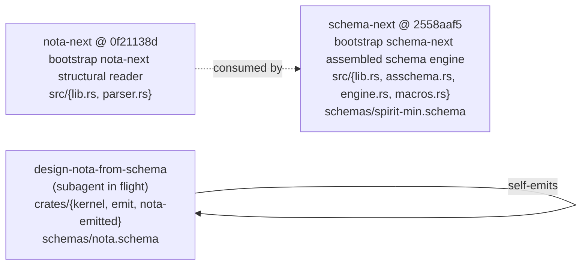

# 364 — Mid-flight code inspection: operator's nota-next/schema-next vs design-nota-from-schema

*Designer's inspection of both implementations while they're still working. Operator's track has `nota-next` + `schema-next` repos with substantive code committed; designer parallel `design-nota-from-schema` has the kernel + emit crates landed. Both are mid-flight; this is what I see in the live source.*

## §1 What's in flight



`schema-rust-next` not yet created (operator's next slice). Both operator repos pushed with substantive code in their first commit — true to the double-implementation strategy's "first main is best-of-prototypes amalgamation, not empty scaffold."

## §2 What interests me — specific code moments

### §2.1 Operator's `SchemaMacro::lower` signature — the /200 correction landed

From `schema-next/src/macros.rs`:

```rust
pub enum MacroPosition {
    RootImports,
    RootSurfaces,
    RootNamespace,
    Surface,
    NamespaceDeclaration,
    StructFields,
    EnumVariants,
}

pub trait SchemaMacro {
    fn name(&self) -> &'static str;
    fn matches(&self, object: &Block, position: MacroPosition) -> bool;
    fn lower(
        &self,
        object: &Block,
        position: MacroPosition,
        context: &mut MacroContext,
    ) -> Result<MacroOutput, SchemaError>;
}
```

This is **exactly** the correction from `/200 §"Slice 5"` I flagged in `/362 §3`. Operator absorbed it: `lower` takes `MacroPosition` too, not just `matches`. Seven position variants are well-named and exhaustive. The position-blindness problem from `/358`'s open §6.2 (`InputOutputStructMacro` returning input ops even at output positions) is structurally impossible with this trait. Solid.

### §2.2 Operator's Asschema — Vec-not-BTreeMap canonical storage

From `schema-next/src/asschema.rs:40-54`:

```rust
pub struct Asschema {
    pub identity: super::SchemaIdentity,
    pub imports: Vec<ImportDeclaration>,
    pub surfaces: Vec<RootSurface>,
    pub namespace: Vec<TypeDeclaration>,
}

impl Asschema {
    pub fn type_named(&self, name: &str) -> Option<&TypeDeclaration> {
        self.namespace
            .iter()
            .find(|declaration| declaration.name().as_str() == name)
    }
}
```

The /195-discovered bug (`AssembledSchema` using `BTreeMap` and losing authored order) is fixed at the canonical level. `Vec` is the storage; `type_named` is a derived linear-scan lookup. Per /199 §"Layer 3" + record 805 + /195's order-preservation requirement. The shape is right.

### §2.3 Designer parallel kernel — explicit RECURSION FLOOR markers

From `crates/kernel/src/lib.rs:1-33`:

```rust
//! kernel — the bootstrap **recursion floor** of design-nota-from-schema.
//!
//! Every line in this crate is hand-authored Rust. NOTHING in this
//! crate emits from the schema; that direction would be circular —
//! the schema cannot be READ before code exists that knows how to
//! recognise NOTA delimiters in bytes.
//!
//! ## What the kernel does
//! - Tokenises a NOTA byte stream into `Token` values with byte spans.
//! - Recognises the three delimiter pairs, bracket strings, line comments,
//!   identifiers, integer + float literals, byte literals.
//! - Parses tokens into a `Node` tree (Record / Vector / Map / leaves).
//!
//! ## What the kernel does NOT do
//! - Does not classify identifiers semantically.
//! - Does not resolve types, variants, or fields.
//! - Does not interpret `[token]` as "string vs single-element vector"
//!   — emits `InlineString` only when content unambiguously excludes
//!   a vector reading; otherwise emits `Vector`.
```

The recursion floor is **literally marked in code documentation** rather than only in design reports. /361 §4 framed the floor abstractly; this crate makes the boundary witness-able by reading. The designer parallel's purpose is exactly this — empirical proof of where the floor is + what it costs to put it there.

### §2.4 Designer parallel emit — deterministic output as constraint test

From `crates/emit/src/lib.rs:38-39`:

```rust
//! The string is deterministic: the same schema input always produces
//! byte-identical output. That property is itself a constraint test
//! (see `tests/emission.rs`).
```

Record 777 (intents-as-constraint-tests) applied empirically. Determinism IS a constraint, not just a niceness — drift in the emitter shows up as test failure. Matches the compiled-fixture methodology from `/195/355 §4.3`.

### §2.5 Both tracks: structured error enums (no string matching at boundaries)

Operator's `schema-next/src/engine.rs`:

```rust
#[derive(Clone, Debug, Eq, PartialEq)]
pub enum SchemaError {
    Nota(String),
    ExpectedRootObjectCount { expected: usize, found: usize },
    ExpectedDelimiter { expected: &'static str },
    ...
}
```

Designer parallel's `kernel/src/lib.rs`:

```rust
#[derive(Debug, Clone, PartialEq, Eq)]
pub enum Error {
    UnclosedDelimiter { opener: char, position: usize },
    UnclosedString { position: usize },
    UnclosedBlockString { position: usize },
    UnexpectedClose { closer: char, position: usize },
    InvalidEscape { position: usize },
    ...
}
```

Both reach for named-variant typed errors with structured payload. Per `skills/rust-discipline.md` + `rust-errors.md` — no `anyhow` at crate boundaries; consumers can match on variant rather than string-grep on `Display`. Convergent discipline.

## §3 What troubles me — specific concerns

### §3.1 `pub` field discipline across both tracks

Operator's `Asschema`:

```rust
pub struct Asschema {
    pub identity: super::SchemaIdentity,
    pub imports: Vec<ImportDeclaration>,
    pub surfaces: Vec<RootSurface>,
    pub namespace: Vec<TypeDeclaration>,
}
```

The fields are `pub`. External code can construct + mutate without going through any method. Per record 712/729 (methods on impl blocks; structure-via-types), this is borderline — the methods-discipline is about FREE FUNCTIONS, not field visibility, so technically not violated. But it does let consumers bypass invariants. If `Asschema` ever gains a "namespace must be unique-by-name" invariant or similar, the `pub namespace: Vec<...>` field lets callers violate it without going through a method.

Same pattern in operator's `SchemaIdentity` (`pub component`, `pub version`) + designer parallel's `Declaration` (`pub name: String`, etc.).

**Not a bug; a future-proofing question**. Worth psyche input or designer convention: do Asschema-like canonical types accept pub fields (current pattern) OR keep fields private + expose construction via builder/method? Current shape is more ergonomic; locked-down shape is more enforced. Carry as a small workspace-convention question.

### §3.2 Designer parallel's `BTreeMap` import — checked; not canonical

From `crates/emit/src/lib.rs:44`:

```rust
use std::collections::BTreeMap;
```

First instinct on seeing this: violation of the order-preservation discipline. Checked usage at line 482:

```rust
pub fn count_by_kind(&self) -> BTreeMap<&'static str, usize> {
    let mut counts: BTreeMap<&'static str, usize> = BTreeMap::new();
    ...
}
```

It's used ONLY as a derived-index lookup in a `count_by_kind` method, returning alphabetical-ordered counts of declarations by variant kind. NOT canonical storage. The order-preservation discipline is intact. **Concern resolved**; flagging here so future readers don't re-raise it.

### §3.3 Operator's `Block::Delimited` is a struct-variant rather than a separately-named struct

From `nota-next/src/parser.rs`:

```rust
pub enum Block {
    Delimited {
        delimiter: Delimiter,
        span: SourceSpan,
        root_objects: Vec<Block>,
    },
    PipeText(PipeText),
    Atom(Atom),
}
```

`Block::Delimited` is anonymous as a type — you can't pass around a `DelimitedBlock` value. Forces variant-matching at every consumption site. Style note, not a bug. If `Delimited` ever grows methods or invariants distinct from `PipeText` / `Atom`, the lack of a named type for that variant becomes friction.

Designer parallel's `Node` (which I'd want to see in detail) likely has the same shape; carry as a small style consideration.

### §3.4 Designer parallel emit reads "5-block top-level sequence" — but the schema is meant to be 3-section root struct

From `crates/emit/src/lib.rs:11-14`:

```rust
//! `Reader` walks the kernel's 5-block top-level sequence and produces
//! a `SchemaModel` — an ordered list of `Declaration`s.
```

Wait — five-block top-level? The latest design (record 805 + /361 §5) is the three-section root struct: imports/exports + input/output struct + namespace. Where do the additional two blocks come from?

Two possibilities:
- Either the design subagent inherited the old five-position layout from `/358`'s prototype without updating
- Or "5-block" is the actual current observed shape (imports + operations + extended-header-1 + extended-header-2 + namespace) and the "three-section" framing was an abstraction

The canonical `signal-persona-spirit/spirit.schema` actually has five top-level blocks (imports map + operations vector + 2 empty `[]` placeholders + namespace map + outputs vector = SIX, or the 4-block depending on what counts). The five-block reading suggests the design subagent is matching the existing canonical schema's surface, which is reasonable. The three-section framing in /361 §5 was a logical-three (Specifying / Input-Output / Namespace) compressed from the physical-five.

**Not a bug** but it's a NAMING tension: code says "5-block top-level"; design docs say "three-section root struct." Worth aligning vocabulary in /361 or the design repo's INTENT.md. Carry as a small documentation-vs-code alignment task.

### §3.5 Operator's macros.rs lifts `nota_next::Block` directly

From `schema-next/src/macros.rs:1`:

```rust
use nota_next::Block;
```

`schema-next` directly depends on `nota-next` for the `Block` type. Cross-repo Cargo dependency. This is the layered architecture working as designed — nota-next exposes the structural API; schema-next consumes it. But it means:

- The two repos must version-evolve in sync until they stabilize
- Cargo.toml in schema-next needs a path or git dependency on nota-next
- Local-development cycle requires both repos checked out

Honestly this is fine + expected; just noting that the cross-repo coupling makes the integration-repo-vs-separate-repos trade-off (/200's §"Repo decision") concrete. Operator's chosen separate-repos path means coordinated evolution; nota-core-next would have made the dependency intra-workspace.

## §4 What's still in flight

The designer parallel subagent (`a4793f8b`) is still working — I see the kernel + emit crates landed; the `nota-emitted` crate (the OUTPUT of emit) is the empirical proof point. Don't have the verdict yet. Subagent will surface in `/363`.

Operator's `schema-rust-next` repo (Rust emission separated from macros) hasn't been created yet — that's operator's next slice per record 819.

Neither track has built a Spirit-triad consumer yet — that's later per /199 Phase 5 + /200 Slice 7.

## §5 Reading the convergence

Both tracks converge on:
- `Block` API with span + delimiter + predicates
- Order-preserving canonical storage (Vec, not BTreeMap)
- Position-aware macro `lower` signature (the /200 correction landed)
- Structured error enums with named variants
- Recursion-floor cut at the kernel level

Both tracks diverge on:
- Operator's recursion floor is implicit (nota-next is the cut; documented in ARCHITECTURE.md but not in code-comment markers); designer parallel's is explicit (RECURSION FLOOR markers in code documentation)
- Operator's first consumer is `schema-next` ON `nota-next`; designer parallel self-emits (`nota-emitted` lands by emission from `nota.schema`)

The CONVERGENCE on shape is the strongest signal so far — both tracks independently arrive at the same data model. The DIVERGENCE on emission target is the load-bearing question — whether `nota-emitted` is feasible determines whether the foundation can move.

## §6 What this inspection doesn't yet show

- Whether the designer parallel's `nota-emitted` actually compiles + works as a partial codec
- Whether operator's `schema-next` engine can run an end-to-end lower from a real `.schema` source
- Whether the schemas in both repos parse against their respective engines

These verdicts land when the subagents complete. This report is a mid-flight inspection — what I see in the code right now, not what tests prove.

## §7 References

- Operator: `LiGoldragon/nota-next` @ `0f21138d` — "bootstrap nota-next structural reader"
- Operator: `LiGoldragon/schema-next` @ `2558aaf5` — "bootstrap schema-next assembled schema engine"
- Designer parallel: `LiGoldragon/design-nota-from-schema` (subagent `a4793f8b` in flight)
- `/199` — operator's NotaCore / schema-stack implementation target
- `/200` — operator's vision correction (Slice 5 macro signature carried into schema-next/macros.rs §2.1)
- `/361` — latest vision (the convergence reference)
- `/362` — critique of /200 (the macro signature correction noted)
- Spirit records 712, 729 (methods-on-impl-blocks), 805 (root-struct shape), 822 (forge content-addressed crates future)
