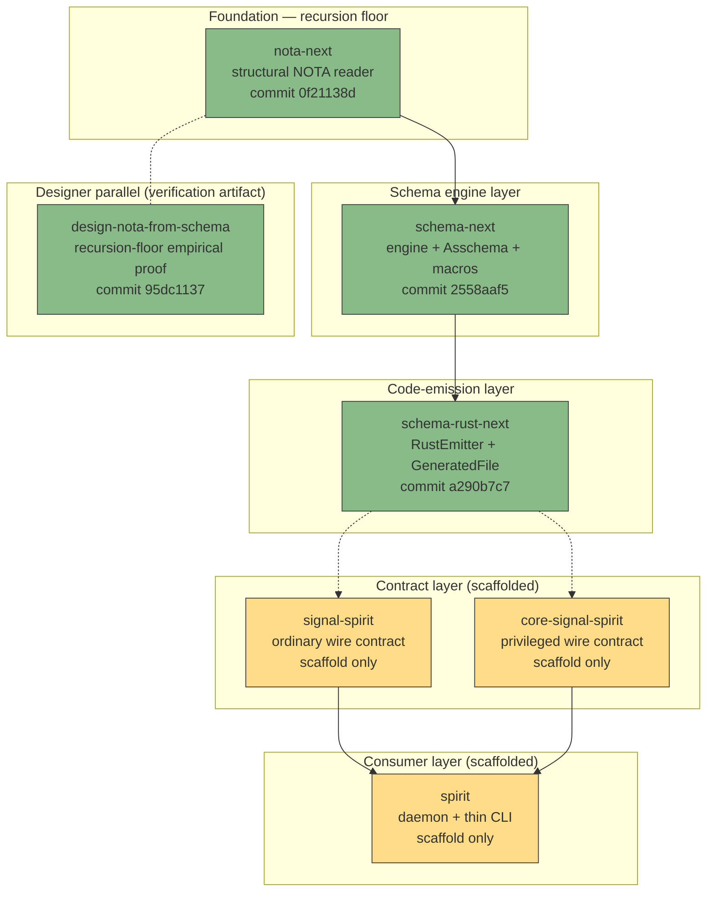
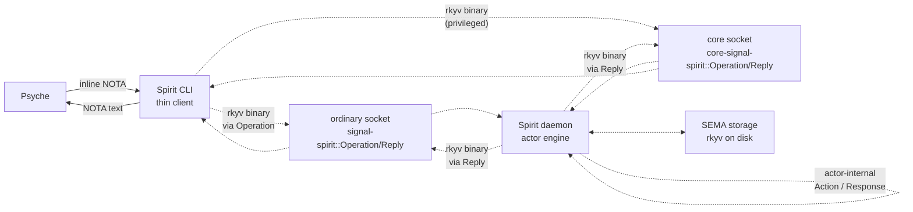
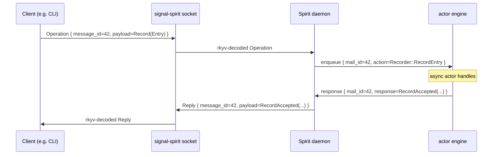

# 366 — Component view + truth verification

*Designer's comprehensive component-view showing each component's current state, its public interface, the schema declarations that create that interface, and the communication paths between components. Honest separation: what's empirically verified vs what's design-level aspirational. Per psyche 2026-05-26 — truth-verification request.*

## §1 Frame — the truth question

The psyche's concern is **correctness**: are we actually sending binary rkyv between components? Is the CLI actually NOTA? Does the schema actually generate all data types? Does the engine actually match data types to drive action selection? Does the SEMA-vs-signal split actually carry through?

This report answers each claim with: **either** the code that demonstrates it now, **or** the explicit mark that it's not yet verified.

## §2 Component inventory + status



**Green** = empirically built + tested. **Yellow** = scaffolded but no daemon/integration logic. **Blue** = parallel design artifact validating one specific question.

| Component | State | Tests passing | Nix check |
|---|---|---|---|
| `nota-next` | Built (structural reader) | ✅ | ✅ |
| `schema-next` | Built (engine + Asschema + position-aware macros) | ✅ | ✅ |
| `schema-rust-next` | Built (type + short-header emission) | ✅ | ✅ |
| `signal-spirit` | Scaffold only (no .schema or daemon) | — | — |
| `core-signal-spirit` | Scaffold only | — | — |
| `spirit` | Scaffold only | — | — |
| `design-nota-from-schema` | Built (type-emission proof) | ✅ 35 tests | ✅ |

## §3 Each component's interface (with code)

### §3.1 `nota-next` — the structural reader (recursion floor)

Public surface from `/git/github.com/LiGoldragon/nota-next/src/lib.rs`:

```rust
pub struct Document;           pub enum Block;
pub enum Delimiter;            pub struct Atom;
pub enum AtomClassification;   pub struct SourceSpan;
pub struct SourcePosition;     pub enum NotaError;
```

Key methods on `Block`:

```rust
// Factual (delimiter / source state)
fn is_parenthesis(&self) -> bool;
fn is_square_bracket(&self) -> bool;
fn is_brace(&self) -> bool;
fn is_pipe_text(&self) -> bool;

// Structural — counts + recursive access
fn holds_root_objects(&self) -> usize;
fn root_object_at(&self, index: usize) -> Option<&Block>;
fn reemit<'a>(&self, source: &'a str) -> &'a str;

// Candidate classification (structural, not semantic)
fn qualifies_as_symbol(&self) -> bool;
fn qualifies_as_pascal_case_symbol(&self) -> bool;
fn qualifies_as_camel_case_symbol(&self) -> bool;
fn qualifies_as_kebab_case_symbol(&self) -> bool;
fn demote_to_string(&self) -> String;
```

This is the **load-bearing structural API**; everything above it consumes Block. Hand-authored — it's the recursion floor.

### §3.2 `schema-next` — the engine + assembled-schema endpoint

From `schema-next/src/asschema.rs`:

```rust
pub struct Asschema {
    pub identity: SchemaIdentity,
    pub imports: Vec<ImportDeclaration>,
    pub surfaces: Vec<RootSurface>,     // Input / Output enum declarations
    pub namespace: Vec<TypeDeclaration>,  // user-defined types in author order
}

pub enum TypeDeclaration {
    Struct(StructDeclaration),
    Enum(EnumDeclaration),
    Newtype(StructDeclaration),
}
```

Position-aware macro interface from `schema-next/src/macros.rs`:

```rust
pub enum MacroPosition {
    RootImports, RootSurfaces, RootNamespace,
    Surface, NamespaceDeclaration, StructFields, EnumVariants,
}

pub trait SchemaMacro {
    fn name(&self) -> &'static str;
    fn matches(&self, object: &Block, position: MacroPosition) -> bool;
    fn lower(
        &self,
        object: &Block,
        position: MacroPosition,
        context: &mut MacroContext,
    ) -> Result<MacroOutput, SchemaError>;
}
```

The `SchemaEngine::lower_source(source, identity)` method drives the pipeline: parses NOTA via `nota_next::Document::parse`, walks blocks position-aware, dispatches macros, lowers into `Asschema`. Order-preserving Vec storage; derived-index lookups via methods like `Asschema::type_named`.

### §3.3 `schema-rust-next` — the Rust emitter

From `schema-rust-next/src/lib.rs`:

```rust
pub struct RustEmitter;
pub struct RustCode;
pub struct GeneratedFile {
    pub path: String,
    pub code: RustCode,
}

// The flow:
// let asschema = SchemaEngine::default().lower_source(source, identity)?;
// let generated = RustEmitter::default().emit_file(&asschema);
```

What it currently emits (per /203 §"Current generated Rust includes"): newtypes, structs, enums, root surface enums, short-header constants. **What it does NOT yet emit** (per /203 §"Known limits"): rkyv impls, NOTA impls, version-projection traits, full signal client/server code.

Two structural-discipline Nix constraints:

```nix
no-old-signal-macro: grep -R "signal_channel!" ${src} → fails
no-rust-macro-surface: grep -R "macro_rules!\|proc_macro" ${src}/src → fails
```

So `schema-rust-next` literally cannot use the old wire macro AND cannot define Rust macros in its source — emission stays pure code-as-data.

### §3.4 The Spirit triad — scaffolded but not yet woven

| Repo | What it WILL carry | What it has NOW |
|---|---|---|
| `signal-spirit` | Ordinary wire contract: schema-derived `Operation` + `Reply` + payload types + rkyv impls + NOTA impls | Scaffold (Cargo + Nix + INTENT.md + ARCHITECTURE.md) |
| `core-signal-spirit` | Privileged wire contract: same shape, owner-only operations | Scaffold |
| `spirit` | Daemon (consuming both wire contracts) + thin CLI (NOTA-arg parser) + actor engine + storage | Scaffold |

**No daemon code exists yet** on the new substrate. The first daemon-shaped use of schema-rust-next emissions is the named next slice per /203 §"Next implementation slice."

## §4 How schema creates each interface

Take operator's MVP fixture schema (from /203):

```nota
{}
[
  (Input (Record Entry) (Observe Query))
  (Output (RecordAccepted RecordIdentifier) (RecordsObserved RecordSet))
]
{
  Topic [Text]
  Entry [Topics Kind Description Magnitude]
  Kind (Decision Principle Correction Clarification Constraint)
}
```

This authored schema (NOTA text) produces these emitted Rust types (from `schema-rust-next`'s fixture):

```rust
// From Field-2 input/output struct:
pub enum Input {
    Record(Entry),
    Observe(Query),
}
pub enum Output {
    RecordAccepted(RecordIdentifier),
    RecordsObserved(RecordSet),
}

// From Field-3 namespace map:
pub struct Topic(pub Text);                                  // newtype from [Text]
pub struct Entry(pub Topics, pub Kind, pub Description, pub Magnitude);  // tuple struct
pub enum Kind { Decision, Principle, Correction, Clarification, Constraint }  // unit enum

// Header derivation from Asschema's RootSurface order:
pub mod short_header {
    pub const INPUT_RECORD: u64 = 0x0000000000000000;
    pub const INPUT_OBSERVE: u64 = 0x0001000000000000;
    pub const OUTPUT_RECORD_ACCEPTED: u64 = 0x0100000000000000;
    pub const OUTPUT_RECORDS_OBSERVED: u64 = 0x0101000000000000;
}
```

The mapping is structural + deterministic:

| Schema construct | NOTA delimiter | Emitted Rust |
|---|---|---|
| Root namespace `{ }` (Field 1) | Curly | Import declarations (currently empty in MVP) |
| Input/Output struct `[ ]` (Field 2) | Square | Two enum declarations (Input, Output) |
| Type namespace `{ }` (Field 3) | Curly | Iterated declarations in author order |
| Newtype `Name [Type]` | Square + single type | `pub struct Name(pub Type)` |
| Tuple struct `Name [T1 T2 T3 ...]` | Square + multi type | `pub struct Name(pub T1, pub T2, pub T3, ...)` |
| Unit enum `Name (V1 V2 ...)` | Paren + idents | `pub enum Name { V1, V2, ... }` |
| Tagged enum `Name ((V1 Payload) ...)` | Paren + paren-variants | `pub enum Name { V1(Payload), ... }` |

This **IS the schema → interface mapping** the psyche wants verified. Operator's compiled-fixture test methodology (from /195 + /355) proves this round-trip: schema text → emitted Rust source → compares exactly to a checked-in fixture → fixture compiles + runs.

## §5 The communication paths



**Solid arrows** = NOTA at the human-facing boundary (record 690 + 698 — bracket-only). **Dotted arrows** = rkyv binary on the wire AND in storage (record 695 — one rkyv layout, two homes: signal + sema). The CLI is the NOTA↔rkyv translator at the human boundary; the daemon stays in rkyv internally.

**Empirically true today**: nothing. None of the daemon, CLI, or socket plumbing exists on the new substrate yet. The communication paths are DESIGN, not implementation.

**What IS empirically true**: the EMITTED TYPES that would carry these payloads exist (operator's schema-rust-next fixture). The chain from schema → types is verified. The chain from types → wire/storage/CLI is not.

## §6 The four reaction objects + the engine

The psyche's framing: every component has an **input → output reaction** pattern. Four reaction objects exist:

| Surface | Input | Output | Carrier |
|---|---|---|---|
| Signal IN (wire to daemon) | `Operation` | — (synchronous via Reply) | rkyv binary on socket |
| Signal OUT (daemon to wire) | — | `Reply` | rkyv binary on socket |
| SEMA IN (engine to storage) | `Action` (engine-internal) | — | rkyv binary in redb |
| SEMA OUT (storage to engine) | — | `Response` (engine-internal) | rkyv binary in redb / actor mailbox |

The engine drives the reaction sequence:

```text
Signal Operation arrives
  → engine matches Operation variant
  → engine constructs Action(s) for SEMA
  → SEMA returns Response(s)
  → engine constructs Reply
  → Reply leaves on Signal OUT
```

Per the psyche: *"the signal to SEMA lowering can even have a language. I mean, it does."* The engine's internal mapping (Operation → Action; Response → Reply) IS a small DSL — declarable in schema as a kind of effect-table at the COMPOSER layer (not as an authored Features section per record 730-732 retraction; just as the engine's compiled-in mapping logic emitted from schema).

**Empirically true today**: schema-rust-next emits the Operation + Reply types. The engine's Operation→Action mapping mechanism is not yet built.

**Aspirational**: schema → engine-dispatch table emission. The Effect/FanOut concepts /343 explored — RETRACTED as authored schema features per /350 — may live in different shape as **engine-internal emitted dispatch tables** (not user-authored). The user's framing here (*"the engine drives the execution between the signal input and the SEMA operation"*) aligns with that: engine internals, not schema content.

## §7 Async unique-ID mail delivery

The psyche's framing: *"all in asynchronous, unique ID mail delivery. The agents have to keep their mail channels synchronized... they have to create unique identifiers for each other and unique identifier system for their messages."*

Component-level structure (DESIGN):



**Empirically true today**: nothing of this. No socket plumbing on the new stack; no engine; no actor mailbox; no message_id substrate.

**Reusable from prior production**: existing v0.3 production spirit daemon does this; the question is whether schema-rust-next emits compatible types for migration OR whether the new stack needs its own actor runtime.

## §8 What synchronous-for-fast-responses means

Psyche: *"this is always synchronous also, right? So that clients don't have to wait for certain operations to get responses to requests that are faster, right? Because potentially we're going to have complex clients also."*

Reading: the daemon offers BOTH async fire-and-forget AND synchronous request-reply. Fast operations (record-accepted-confirmation, status queries) return synchronously; long operations (observation streams, computation) get async-mail handles.

Concretely this maps to TWO `Reply` shapes per Operation:
- **Immediate**: the request was acted on synchronously; payload returned now
- **Pending**: the request was queued; the caller subscribes to mail_id for the async result

The two-shape pattern is the engine's translation between request-style (synchronous expectation) and actor-mailbox-style (async by default).

**Not yet built on the new stack.** Existing v0.3 production spirit uses a simpler "respond when ready" model; the dual-shape lives in /346's intent for the next iteration.

## §9 The tests that PROVE each truth claim

| Claim from psyche | Test that would prove | Current state |
|---|---|---|
| Schema generates all the code for data types | schema-rust-next fixture test (emit → compare → compile) | ✅ EXISTS (in `schema-rust-next` tests per /203) |
| The CLI is NOTA | Round-trip: NOTA-arg string → parsed via nota-next::Document → consumed by spirit CLI → return NOTA text | ❌ NOT YET — no CLI binary on the new substrate |
| Binary rkyv between components | Round-trip: emitted-type instance → rkyv binary → decoded → equal-to-original | ❌ NOT YET — schema-rust-next doesn't emit rkyv impls yet (per /203 §"Known limits") |
| Different data types matched in engine to decide action | Engine-test: enqueue Operation → assert correct Action emitted to actor mailbox | ❌ NOT YET — no engine on the new substrate |
| SEMA = command → response reaction object | Actor-test: Action arrives → Response emitted; round-trip via rkyv to storage | ❌ NOT YET — same reason |
| Signal IN/OUT with rkyv binary on wire | Socket-test: client encodes Operation → daemon decodes → daemon encodes Reply → client decodes | ❌ NOT YET — no socket plumbing |
| Async unique-ID mail delivery | Concurrent-test: multiple operations with distinct message_ids; responses arrive correctly tagged | ❌ NOT YET — no message_id substrate |
| Synchronous fast-response option | Latency-test: fast operation returns within request span; slow returns async handle | ❌ NOT YET |
| Order-preserving Asschema (record 805 + /195 bug fix) | Authored order → Asschema → emitted Rust declarations match author order | ✅ EXISTS (schema-next tests) |
| Position-aware macros (record 819) | Macro at Surface position lowers differently than at NamespaceDeclaration position | ✅ EXISTS (schema-next probe macro test) |
| No EffectTable / FanOutTargets / StorageDescriptor in canonical schema (records 730-732) | Nix check `no-authored-features` greps + fails build | ✅ EXISTS (schema-next Nix derivation) |
| Recursion-floor cut feasibility for types | nota-emitted: 31 schema-derived declarations compile + tests pass | ✅ EXISTS (design-nota-from-schema /363) |

**Score: 4 out of 12 truth claims are empirically tested today. 8 await implementation.**

The 8 untested claims share a common dependency: the daemon + CLI + socket plumbing on the new substrate. That's `signal-spirit` + `core-signal-spirit` + `spirit` being woven into a working triad, plus `schema-rust-next` emitting rkyv impls + NOTA impls + (eventually) signal client/server code.

## §10 What to build to close the verification gap

In sequence (matches operator's /203 §"Next implementation slice"):

1. **schema-rust-next extends to emit rkyv impls** for the emitted types. This unlocks claim 3 (binary rkyv between components — round-trip on emitted types).
2. **schema-rust-next extends to emit NOTA impls** (encode + decode via nota-codec) for the emitted types. This unlocks claim 2 (CLI is NOTA — but needs CLI binary too).
3. **schema-rust-next extends to emit signal request/reply envelopes + short-header dispatch** (per /199 Layer 5). This unlocks claim 6 (signal IN/OUT with rkyv binary on wire — needs socket too).
4. **`signal-spirit` repo gets a `signal-spirit.schema`** + `emit_schema!()` invocation; cargo build produces the typed wire contract crate. This is the first concrete contract-from-schema landing on the new stack.
5. **`spirit` repo gets a daemon scaffold** — a tiny actor + a socket + an engine that handles ONE Operation variant (say, `Record`) end-to-end. This unlocks claims 4, 5, 6, 7. Minimum-viable daemon, not full v0.3 parity.
6. **`spirit` CLI** — schema-derived; takes NOTA arg; speaks rkyv on the socket; returns NOTA text. Unlocks claim 2 fully.

Slices 1-3 are operator's schema-rust-next work. Slices 4-6 are operator's first-consumer slices per /203.

**Designer-track verification artifact**: a single integration test in `schema-rust-next` (or a new `schema-test-spirit` crate per /199) that runs slices 1-3 end-to-end on the MVP fixture and reports pass/fail.

## §11 Honest summary

**What's TRUE today** (verified by tests + Nix checks):
- The schema → emitted-Rust-types chain works for the MVP fixture
- Asschema is order-preserving (the /195 BTreeMap bug is fixed in canonical storage)
- Position-aware macros are structurally enforced (the /200 §5 correction landed)
- Retracted-drift features (`EffectTable` / `FanOutTargets` / `StorageDescriptor`) are Nix-enforced impossible to reintroduce
- The recursion-floor cut for TYPES is empirically feasible (design-nota-from-schema's 31 schema-derived declarations compile + 35 tests pass)
- The recursion-floor cut for byte-level recognition is empirically infeasible (must stay hand-authored)

**What's DESIGN today** (named, but no code yet on the new stack):
- Binary rkyv between components (emission not yet done)
- NOTA at CLI boundary (CLI not yet built)
- Engine matches Operations to Actions (engine not yet built)
- SEMA reaction objects + Action/Response (actor runtime not yet built)
- Async unique-ID mail delivery (message_id substrate not yet built)
- Synchronous fast-response option (dual-Reply shape not yet built)

**The chain is half-built**: schema → types is real; types → wire/storage/CLI/engine is design.

The substantive next slices are owned by operator (per /203's named sequence). The designer-track contribution to closing the gap is comparison + verification reports (this report; future post-slice engagements).

## §12 References

- `/199` — operator's six-layer architecture (the design this report's component view reflects)
- `/203` — operator's three-repo interface implementation (the empirical baseline)
- `/361` — latest vision (the synthesis this report informs)
- `/363` — designer parallel feasibility verdict (recursion-floor finding)
- `/364` — mid-flight code inspection (the convergence signal across tracks)
- `/365` — engagement with /203 (Nix-enforced grep-prohibitions detail)
- Operator repos: `nota-next@0f21138d`, `schema-next@2558aaf5`, `schema-rust-next@a290b7c7`
- Designer parallel: `LiGoldragon/design-nota-from-schema@95dc1137`
- New scaffolded triad: `LiGoldragon/spirit`, `LiGoldragon/signal-spirit`, `LiGoldragon/core-signal-spirit`
- Spirit records 690 (NOTA brackets), 695 (rkyv one layout two homes), 698 (canonical encoding), 730-732 (retracted-drift cluster), 763-764 (root enum + 7-variant ceiling), 805-807 (root-struct + macro interface), 819-822 (repo strategy), 829 (recursion-floor verdict)
