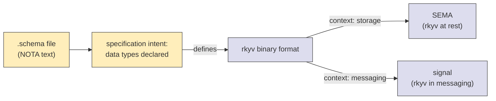

# 367 — NOTA as specification language; schema as CapnProto-superset

*Designer synthesis absorbing psyche 2026-05-26 clarification (intent records 839-844). Sharpens the framing: NOTA is the text representation of the portable rkyv format's specification; schema is a CapnProto-superset specification language with module system + macro system + shape-driven node-type matching. Connects the clarified framing to operator's current implementation (already close) + names what this means for the next slice.*

## §1 The clarified framing

The psyche named four load-bearing things this turn:

1. **NOTA is the specification language for the portable rkyv format.** Same rkyv binary in two contexts — SEMA at-rest in storage; signal in messaging. NOTA is the text view of that one underlying specification.
2. **Specification language is MORE SPECIFIC than Rust** for declaring data. Rust mixes logic with data; NOTA + schema is pure data-spec. That's why a separate specification language exists — same reason CapnProto exists as a separate language from C++.
3. **Schema is a SUPERSET of CapnProto-style declaration** with three additions: module system, macro system, shape-driven node-type matching.
4. **Macros are variants in the same namespace as core types**, not a separate namespace. A `(VariantName ...)` form resolves contextually as either a macro (override) or a scalar/core type (default).

## §2 The view: NOTA as specification ↔ rkyv as runtime



The schema/NOTA pair is the **textual specification**. rkyv is the **binary realization**. SEMA + signal are the **two contexts** where the binary appears.

NOTA isn't the runtime format; it's the **language** for declaring the runtime format. Like CapnProto's `.capnp` files declare types that compile to wire-format encoders/decoders, `.schema` files declare types that compile to rkyv-encoder/decoder + NOTA-text-encoder/decoder + Rust data types.

The "more specific than Rust" framing matters because Rust is general-purpose and noisy:

```rust
// In Rust, this declaration mixes data shape with derive attributes, trait
// implementations, visibility annotations, lifetime parameters, possibly
// generic constraints, validation logic in builder methods, etc:
#[derive(Clone, Debug, PartialEq, Eq, Archive, Serialize, Deserialize)]
#[archive(check_bytes)]
pub struct Entry {
    pub topics: Topics,
    pub kind: Kind,
    pub description: Description,
    pub magnitude: Magnitude,
}
```

```nota
;; In schema, this declaration is JUST the data shape:
Entry [Topics Kind Description Magnitude]
```

Schema strips away everything that isn't data-shape. The derives, trait impls, validation, visibility — those EMIT from schema, they aren't part of the specification. The specification is just the structural truth.

This is why operator's `schema-rust-next` exists: take the structural-truth spec and EMIT the noisy-but-mechanical Rust + rkyv + NOTA codec implementations.

## §3 The three additions over CapnProto

### §3.1 Module system

NOTA + schema has named imports/exports per record 805:

```nota
{
  Magnitude (ImportAll [../signal-sema/magnitude.schema])
  SemaSet (Import [../signal-sema/sema.schema] [SemaOperation SemaOutcome SemaObservation])
}
```

CapnProto has imports too; the schema extension is the module-system framing — explicit per-import declaration as the first root-struct field. /361 §5's three-section root struct is the module-system landing.

### §3.2 Macro system

Per record 753 + this turn's 841-843: schema's macro mechanism lets you extend the type-declaration vocabulary beyond fixed built-ins. A macro is a registered variant that consumes a `(Name ...)` form contextually and produces typed declarations the assembled-schema understands.

This is what CapnProto doesn't have. CapnProto's grammar is closed — types are struct/enum/union/interface, period. Schema's grammar is open via macros — `vec`, `option`, `import`, future user-defined extensions all live in the same namespace.

### §3.3 Shape-driven node-type matching (per records 753 + 842)

At every `(VariantName ...)` form, the engine resolves based on shape:

```text
(Foo)              → no payload, unit form
(Foo Bar)          → single-payload form, payload is `Bar`
(Foo Bar Baz)      → tuple form OR enum-variant-with-multi-payload depending on context
(Foo (Bar Baz))    → nested — `Foo` carries an inner enum/macro
{Foo Bar Baz Qux}  → map form, key/value pairs
```

The engine's `MacroPosition` + the shape + the current namespace decide what `(Foo ...)` means HERE. The same syntactic form means different things in different positions — operator's `MacroPosition` enum encodes the position; the macro `matches()` method encodes the shape match.

## §4 Macros as variants in the same namespace (record 843)

The structural claim:

```text
namespace = {
  vec      → built-in macro: variadic single-type sequence
  option   → built-in macro: zero-or-one wrap
  import   → built-in macro: bring names into scope
  ...
  Topic    → user-declared newtype
  Entry    → user-declared struct
  MyMacro  → user-declared macro (lives next to Topic + vec)
}
```

There is no separate macro-namespace. A user-defined macro lives next to the built-in `vec` and next to the user-declared `Topic`. The engine resolves `(MyMacro ...)` by namespace lookup at the relevant position — same mechanism as `(vec Topic)` or `(Some Magnitude)`.

This means **the schema language can be extended by adding macros to the namespace**, not by changing the grammar. Per operator's `SchemaMacro` trait + `MacroContext` carrying a namespace + parent context, this is structurally available today — just not yet exercised with user-authored macros (Q15 from /361 §11 — user-macro registration story).

## §5 The pipeline lands in single-call Rust emission (record 844 — Medium certainty)

Per the psyche: *"eventually just putting a single macro into like the main lib file or the main binary file of some Rust code, which will then just read the schema files in the repository to create all the schema Rust code, to read and write all of this in NOTA and in SEMA format, binary format."*

The eventual entry-point:

```rust
// crates/<component>/src/lib.rs
schema_rust::emit_all_schemas!();
// → reads every .schema in the crate's schemas/ directory
// → produces all data types + NOTA codec impls + rkyv impls
```

That's a **single macro call** as the only schema-derivation entry point in a downstream crate. Everything else flows from there.

Current operator state: `schema_rust::emit_schema!("<path>")` exists per /354/358; the single-call-for-all-schemas variant is a future ergonomic. Carry as Medium-certainty per psyche's "eventually."

## §6 Where the implementation already aligns

Operator's current stack already realizes the clarified model:

| Clarified concept (record) | Where it lives | State |
|---|---|---|
| NOTA specifies rkyv (839) | `nota-next` parses; `schema-rust-next` emits rkyv impls *(not yet — see /365 §2)* | ⚪ PARTIAL — types emitted; rkyv derives not yet |
| Schema more specific than Rust (840) | `schema-rust-next` strips Rust noise from spec → emits clean derives | ✅ DEMONSTRATED — schema-rust-next emits typed declarations from pure-data .schema |
| CapnProto-superset: module system (841) | `schema-next` parses imports/exports as root struct field 1 | ✅ DEMONSTRATED (MVP fixture has `{}` empty imports; structural slot intact) |
| CapnProto-superset: macro system (841) | `schema-next::SchemaMacro` trait + position-aware `lower` | ✅ DEMONSTRATED — built-in macros registered; third-party registration pending |
| Shape-driven node-type matching (842) | `SchemaMacro::matches(object, position)` + `lower(object, position, ctx)` | ✅ DEMONSTRATED |
| Macros are variants in same namespace as scalars (843) | `MacroContext::namespace` carries both | ⚪ PARTIAL — built-ins registered; user-macro registration not exercised (Q15) |
| Single-macro emission goal (844) | `emit_schema!("<path>")` works today; `emit_all_schemas!()` doesn't yet | 🔵 ASPIRATIONAL |

**5 of 7** clarified concepts are demonstrated. 2 are partial. None contradict operator's track. The clarification deepens the framing rather than changing direction.

## §7 What this means for next slices

Operator's named next slices (per /203 §"Next implementation slice") absorb the clarification cleanly:

1. **rkyv impl emission** — directly serves record 839 (NOTA specifies the rkyv format; emit the rkyv impls so the format is actually produced).
2. **NOTA impl emission** — the other half: emit codec impls so any emitted type can round-trip through both rkyv (binary) and NOTA (text).
3. **Signal envelope + dispatch emission** — operationalizes the signal half of record 839.
4. **Eventually: `emit_all_schemas!()`** macro per record 844 — the single-call entry point.

The clarified framing should land in `nota/INTENT.md` + `schema/INTENT.md` per file-ownership rule (record 717). The substance is per-repo-scope; not workspace-wide.

## §8 What to put where (per file-ownership rule)

| Substance | Right home |
|---|---|
| NOTA specifies rkyv (839) | `nota/INTENT.md` — the language's purpose statement |
| Specification more specific than Rust (840) | `nota/INTENT.md` + `schema/INTENT.md` |
| CapnProto-superset framing (841) | `schema/INTENT.md` — the schema language's identity |
| Shape-driven matching (842) | `schema/INTENT.md` + `repos/schema/ARCHITECTURE.md` |
| Macro-as-variant-in-namespace (843) | `schema/INTENT.md` + the `SchemaMacro` trait's docs |
| Single-macro emission goal (844) | `schema-rust-next/INTENT.md` + `schema/INTENT.md` (cross-reference) |

I won't make these edits now — operator's next-slice work touches the same files; better to land the manifestation alongside the rkyv-emission slice so the docs and the code update in one coherent pass. Designer-side carry-forward: when operator lands rkyv emission, propose this manifestation as part of the same commit set.

## §9 Open shape question deferred to psyche

One thing the clarification doesn't pin: **does `emit_all_schemas!()` (the single-call entry point) re-emit on every build, OR does it read pre-generated `.rs` files committed to the repo?**

Two cuts:
- **(a) Build-time emission**: the macro reads .schema, parses, lowers, emits Rust at compile time. No generated .rs files in the repo. Tight; refresh-on-edit free.
- **(b) Committed generation**: a build script (or manual `cargo emit-schema`) writes generated .rs to disk; commits track them; the macro just `include!`s the generated files. Reproducible; auditable; rebuilds aren't sensitive to schema mtime.

Per /199 §"Phase 0" + record 822 (content-addressed crates via future forge), the long-term trend seems to be (b) plus content-addressing — but the immediate prototype probably wants (a). Worth psyche input when convenient; not blocking; carry as Medium-uncertainty.

## §10 References

- Spirit records 839-844 (this turn's six captures absorbing the clarification)
- Spirit record 695 (rkyv one binary two homes — this report sharpens with the specification framing)
- Spirit record 753 (shape-based macro interpretation — this report sharpens with "node-type matching" naming)
- Spirit record 805 (root struct with imports/exports as field 1)
- Spirit record 807 (schema-schema as core Rust — the host of the SchemaMacro trait)
- `/199` six-layer architecture
- `/203` operator's three-repo interface implementation (the empirical baseline this clarifies)
- `/361` latest vision (this report informs §11 open questions + §12 status)
- `/362` macro position correction
- `/365` engagement with /203 (the Nix-enforced grep-prohibitions)
- `/366` component view + truth verification (the empirical-vs-aspirational table this report's clarification reshapes)
- `signal-persona-spirit/spirit.schema` canonical example
- Operator repos: `nota-next`, `schema-next`, `schema-rust-next`
