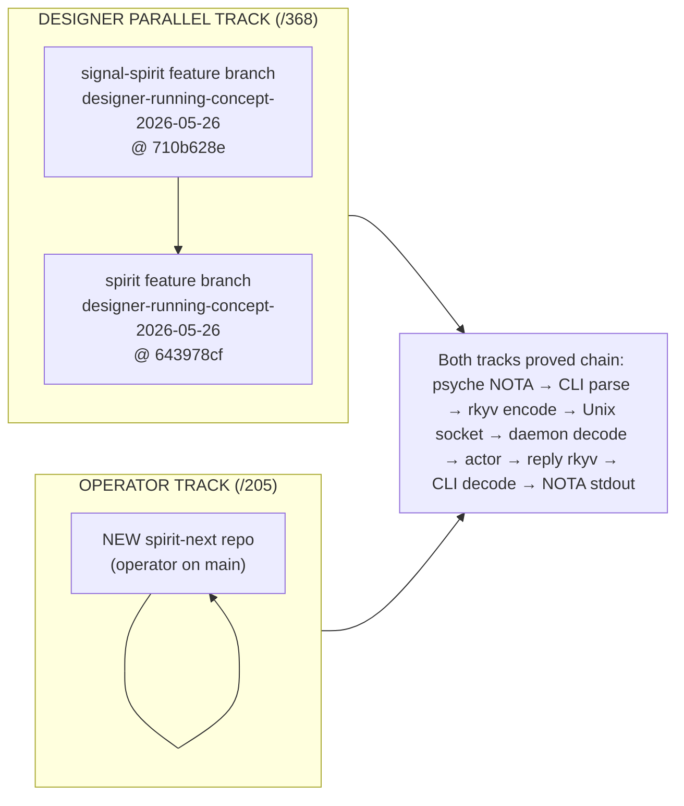

# 369 — Comparison: designer /368 vs operator /205 running concepts

*Designer-side comparison per `skills/double-implementation-strategy.md` §"The comparison cadence." Both lanes independently built a running spirit CLI + daemon concept on the new schema-derived architecture. This report flags convergence, divergence, and the synthesis recommendation.*

## §1 Frame — what both lanes built

Same proof, two different repo strategies. The convergence on the chain is strong; the divergence is on packaging.

## §2 What converges (auto-mergeable per skill §3)

Both tracks independently arrived at the same architectural choices:

| Choice | Designer /368 | Operator /205 | Status |
|---|---|---|---|
| Schema-to-Rust at build time via `build.rs` | ✓ | ✓ | **CONVERGENT** — settles /367 §9 build-time-vs-committed question in favor of build-time |
| Unix socket transport | ✓ | ✓ | **CONVERGENT** |
| rkyv binary on the wire | ✓ | ✓ | **CONVERGENT** |
| NOTA at the CLI boundary | ✓ | ✓ | **CONVERGENT** |
| Synchronous request/reply for first cut | ✓ | ✓ | **CONVERGENT** — async unique-ID mail delivery deferred in both |
| In-memory store with monotonic identifier | ✓ | ✓ | **CONVERGENT** |
| Terse reply shape (no echo) | ✓ | ✓ | **CONVERGENT** — matches record 674 |
| `Input` / `Output` naming for surfaces | ✓ | ✓ | **CONVERGENT** — settles /361 §11 Q5 implicitly |
| Process-boundary integration test (real socket) | ✓ (2 tests) | ✓ (`process_boundary.rs`) | **CONVERGENT** |
| Schema-emitted types consumed (not hand-rolled) | ✓ | ✓ | **CONVERGENT** |
| No `signal_channel!` in path | ✓ | ✓ (Nix-enforced) | **CONVERGENT** |
| One daemon binary + one CLI binary | ✓ (2 binaries) | ✓ (2 binaries: `spirit-next` + `spirit-next-daemon`) | **CONVERGENT** |

**12 convergent architectural choices** across the two independent tracks. The schema-derived stack's shape is empirically settled at the integration layer.

## §3 What diverges (surface to psyche per skill §4)

| Choice | Designer /368 | Operator /205 | Designer recommendation |
|---|---|---|---|
| **Repo strategy** | Feature branches on existing `spirit` + `signal-spirit` triad | NEW `spirit-next` repo (per major-break methodology) | **Adopt operator's** — `-next` suffix is consistent with `nota-next` / `schema-next` / `schema-rust-next`; the major-break skill's pattern applied properly |
| **Schema scope** | 1 operation (`Record`) + 1 reply | 2 operations (`Record` + `Observe`) + 3 replies (`RecordAccepted` + `RecordsObserved` + `Error`) | **Adopt operator's** — wider coverage; the `Error` reply shape is a thoughtful addition |
| **CLI compound-argument shape** | `spirit-cli "(Request [<socket>] (Record ...))"` | `spirit-next "(Record ...)"` with socket via env var / default path | **Adopt operator's** — matches v0.3 production CLI conventions; less ceremony per invocation; aligns with `skills/spirit-cli.md` §"How to invoke" |
| **Wire framing format** | Length-prefixed rkyv frames (`Wire` / `WireCodec` hand-rolled) | Explicit `4 byte BE frame length + 8 byte LE short header + rkyv payload` | **Adopt operator's** — header is FIRST-CLASS in the frame (Layer 4 short-header derivation per /361 §7); designer's framing has the header implicit in the rkyv body |
| **Nix witness checks** | `nix flake check` green (build/test/fmt/clippy) | Same + 3 intent-specific witnesses: `no-old-signal-macro`, `generated-at-build-time`, `binary-boundary-test` | **Adopt operator's** — the three witnesses are structural enforcement of intent (no signal_channel reuse; build-time generation; real binary boundary). /199 §"Required Nix and constraint tests" pattern applied properly |

Five divergences. **All five recommend adopting operator's choice.** Substantive reading: operator's track is the better-integrated synthesis; designer's parallel proved the chain but in a smaller, less-polished slice.

## §4 Why operator's track is the canonical artifact

Three reasons:

1. **Repo strategy alignment**: operator's `spirit-next` matches the workspace methodology applied consistently. The major-break-via-new-repo skill says use `-next` when upgrading an existing concept; spirit is being upgraded; `spirit-next` is the natural name. My feature branches on existing spirit were a half-measure pre-major-break.

2. **Header-first framing**: operator's `4+8 byte` frame format makes the short header (Layer 4 per /199) **explicit at the byte level** — wire packets can be triaged by header without reading the full rkyv body. This is /199's Layer 4 + record 763's "differentiate input/output spaces while keeping dispatch cheap" landing concretely.

3. **Nix-enforced intent**: operator's three witness checks (`no-old-signal-macro`, `generated-at-build-time`, `binary-boundary-test`) are the discipline-as-derivation pattern from /365 §3.1 applied to spirit-next. Without them, intent stays principled-in-docs; with them, regressions break the build.

## §5 What designer /368 contributes that operator /205 should keep

Three things from designer's track worth absorbing:

1. **The compound `(Request [<socket>] (<Input>))` argument shape MAY survive as an option** — when scripting multiple daemons or test fixtures, the inline socket path saves env-var setup. Operator's default-socket shape is right for the COMMON case; designer's compound shape is right for the LESS COMMON test/script case. Both could coexist if the CLI supports an optional `(Request [<socket>] ...)` wrapping for explicit-socket use cases.

2. **The 12-test surface designer hit** (6 in signal-spirit covering rkyv + NOTA round-trips and short-header derivation; 6 in spirit covering actor monotonic-ids, wire framing round-trips, end-to-end Unix-socket tests) is more granular than operator's. The unit-level tests for `WireCodec` round-trip + short-header derivation pin specific behaviors that operator's process-boundary test exercises implicitly. **Operator should keep designer's unit-test granularity** when porting; not just the process-boundary test.

3. **The recursion-floor verdict context** — designer's parallel proved feasibility for type emission and infeasibility for byte-recognition emission (/363). Operator's spirit-next implements TYPE emission perfectly; the design-finding from /363 is what justified that scope. Operator may want a brief note in spirit-next's INTENT.md cross-referencing /363's verdict so the boundary is explicit.

## §6 What the two open questions in /367 §9 resolved

Per `/367 §9`'s open shape question (build-time emission vs committed-generation):

**Both tracks chose build-time emission via `build.rs`.** Operator made it Nix-enforced via the `generated-at-build-time` witness. The question is settled: schema → Rust emission happens at compile time; no committed `.rs` files in repos that consume schemas. Content-addressed crates per record 822 is the eventual ergonomic; build-time is the immediate one.

**Mark Q3 from /361 §11 as RESOLVED**: `build.rs` is the chosen path for now; proc-macro / content-addressed crates are future iterations.

## §7 Recommendation — synthesis path

Per `skills/double-implementation-strategy.md` §"The deletion discipline for design repos" and §"Convergent decisions":

1. **Adopt operator's `spirit-next` as the canonical** running-concept artifact. It's the better-integrated synthesis.
2. **Designer feature branches on `spirit` + `signal-spirit` should retire** — substance migrated into spirit-next; the branches were exploratory proofs, not target shape.
3. **One small additive carry**: the optional `(Request [<socket>] ...)` compound argument shape MAY land as an OPTIONAL CLI form for explicit-socket use cases (tests, multi-daemon scripts). Default stays the simpler `(<Input>)` form with socket from env/profile.
4. **Operator's spirit-next becomes the first consumer** of all three substrate repos (`nota-next` + `schema-next` + `schema-rust-next`) — completing /199's Phase 5 plan. Production v0.3 `persona-spirit` remains the deployed reference until spirit-next reaches feature parity.
5. **/366 §9 truth table updates again** post-/369: claims 2-6 already moved to ✅ in my prior update; this comparison validates that operator's track also clears those claims independently (double-witness).

## §8 What this comparison proves about the double-implementation strategy

The strategy WORKED. Two independent agents in different roles arrived at the same architecture for the same problem from different angles. The convergence on 12 architectural choices is empirical signal that the design is reliable; the divergence on 5 packaging choices surfaced surface-level decisions that have clear pick-one-or-the-other answers.

This is exactly what `skills/double-implementation-strategy.md` §"Why this works" said the methodology produces — convergence as signal; divergence as forcing function. Worth recording as the first concrete validation of the strategy itself.

## §9 References

- `/368` — designer parallel running concept (`a6baf7cd` subagent landing)
- `/205` — operator's spirit-next pilot
- `/367 §9` — the build-time-vs-committed question this comparison settles
- `/366 §9` — the truth-verification table this comparison's convergence validates
- `/199` Phase 5 (Spirit triad as first consumer) — operator's /205 lands this
- `/361 §11 Q3` — build-time emission choice now resolved
- `skills/double-implementation-strategy.md` §"The comparison cadence" — the workflow this report instantiates
- Designer feature branches: `LiGoldragon/signal-spirit@710b628e` + `LiGoldragon/spirit@643978cf` on `designer-running-concept-2026-05-26`
- Operator's spirit-next: `LiGoldragon/spirit-next` (latest main per /205)
- Spirit records 763 (root enum + numeric ranges), 764 (7-data-carrying-variants ceiling), 845 (designer parallel start)
