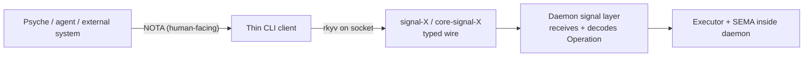
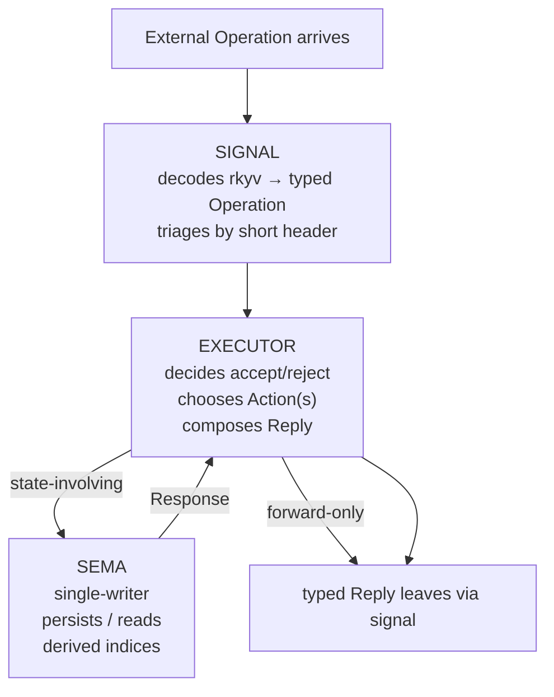
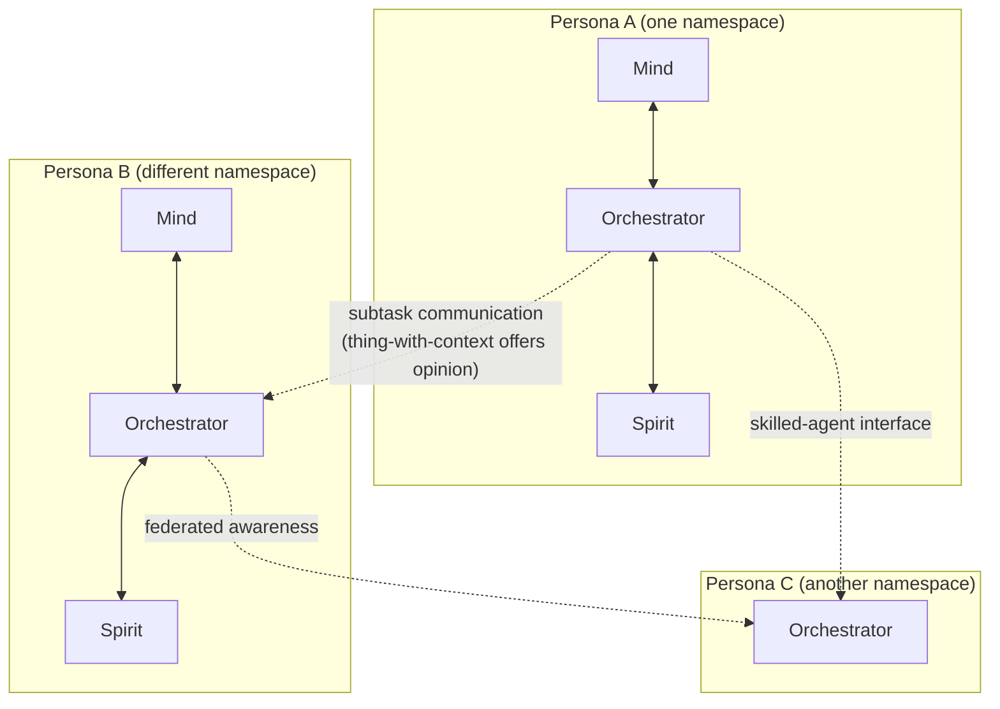

# 371 — Signal / executor / SEMA runtime triad + federation framing

*Designer architecture synthesis absorbing psyche 2026-05-26 (intent records 856-859). The component runtime triad clarifies: **signal + executor + SEMA**. Federation at the core: each persona triad is a federated unit; orchestrators across personas eventually communicate as thing-with-context. Schema/Rust labor split: schema derives objects + traits; Rust writes methods on those objects. Migration to the schema-driven Spirit stack authorized.*

> **Naming superseded by record 964 (Maximum, 2026-05-27).** The runtime
> triad is now **Signal / Nexus / SEMA**: Executor is renamed to **Nexus**,
> and all three planes are schema-driven (with `Signal` / `Nexus` / `Sema`
> as the three schema types). Per record 965, Nexus covers IO, external
> calls, AND all user interfaces (Mencie is implemented as nexus
> schemas). This report's `Executor` terminology is preserved as
> historical record; the canonical runtime-triad framing now lives in
> `reports/designer/392-vision-schema-driven-stack-canonical-2026-05-27.md`
> §"The runtime triad — Signal / Nexus / SEMA" and
> `skills/component-triad.md` §"Runtime triad — Signal / Nexus / SEMA".

## §1 Frame — the refined triad meaning

Two distinct triads coexist in the workspace:

| Triad | Scope | Members |
|---|---|---|
| **Repo triad** (existing) | Packaging — how a component is laid out across repositories | `<component>` + `signal-<component>` + `core-signal-<component>` |
| **Runtime triad** (clarified this turn) | Logic — what happens INSIDE a component daemon | **signal + executor + SEMA** |

The runtime triad is the **logic structure**; the repo triad is the **packaging structure**. They are at different layers. The runtime triad lives inside the `<component>` daemon repo per the repo triad. Per record 856.

## §2 Signal — the reactive external surface

**Signal** is the daemon's reactive perimeter — what the external world sends in. People / agents / messages from outside push into signal; the daemon receives, decodes, and hands off to executor.

Signal's responsibilities:
- Wire-level framing (length + short header + rkyv payload — operator's /205 §"Interface")
- Schema-emitted Operation enum dispatch (the message-as-typed-value contract)
- Connection / socket lifecycle (ordinary vs core/privileged channels)
- Short-header triage BEFORE full body decode (Layer 4; operator's `transport.rs` already lands this)

Signal's NON-responsibilities:
- Decide if an operation is acceptable (executor)
- Touch storage (SEMA)
- Interpret payload semantically (executor)

The signal layer is the daemon's edge — the rest of the component must not touch raw bytes or sockets directly; everything flows through signal into typed values.

## §3 Executor — the internal-decision layer

The executor is the daemon's **central nervous system**. It takes each decoded Operation and decides:

1. **Is this message acceptable?** (Authentication / authorization / structural validity beyond rkyv decoding succeeding)
2. **Does processing need state?** (Some operations are forward-only — a small vlog write, a fan-out emit; others require SEMA involvement)
3. **What's the response?** (Map Operation variant → Action(s) to dispatch → eventual Reply)

Per the psyche framing: *"different decisions that it takes internally before it processes things. So whether a message is accepted as valid at all or is processed at all, and if it's processed, then does it mean it's just a forward in a simple like small vlog of something? Or do we need to involve the state."*

Executor's responsibilities:
- Operation-to-Action lowering (the engine's typed-tree match)
- Authorization / acceptance decisions
- Routing forward-only operations to their handlers without SEMA round-trip
- Dispatching state-involving operations through SEMA
- Composing Reply from Response(s)
- Handling errors at the dispatch layer (typed Error variants in Reply)

Executor's NON-responsibilities:
- Direct socket I/O (signal owns)
- Direct storage I/O (SEMA owns the writes)
- Schema-language interpretation (schema engine; build-time)

In spirit-next today, `engine.rs`'s `handle(input: Input) -> Output` IS the executor entry point. Per `reports/operator/206-...` §"Runtime Reaction": *"engine code should keep the shape visible: Input → state operation → state response → Output."* That visible shape is exactly the executor.

## §4 SEMA — single-writer state

SEMA (semantic / state-at-rest) is the daemon's **persistent memory**. Per the psyche framing: *"the third layer, which is the interface to storage, to things that don't like change on their own, that are changed by the SEMA engine, which has a single writer."*

Key invariant: **single writer**. SEMA is the only path that writes durable state. Concurrent operations queue through SEMA's engine; SEMA serializes writes; readers can be multiple but writers are one.

SEMA's responsibilities:
- redb (or equivalent) read/write of generated archive types
- Daemon-stamped timestamps on records (the daemon is the time-authority)
- Migration on database load (per `reports/designer/346-...` §4 — version marker, mod previous→next bridge)
- Storage-derived indices (topic catalog, identifier mint, etc.)
- Sema-projection traits (per `reports/operator/199-...` Layer 5: where schema declares a sema turn, generated traits give SEMA the typed read/write surface)

SEMA's NON-responsibilities:
- Receiving wire messages (signal)
- Deciding whether to write (executor)
- Schema or NOTA interpretation (already typed values by the time SEMA sees them)

Current `spirit-next` has a `Store` module that's the SEMA layer in MVP shape — in-memory `Vec<(u64, Entry)>` guarded by `Mutex`. Per `/206` P0 #3 the durable-state slice (redb + rkyv-at-rest + daemon-stamped timestamps + migration path) is named as the next mid-term work.

## §5 The runtime triad in flow

Two paths through the executor:
- **State-involving**: executor → SEMA → executor (state changed or queried) → Reply out
- **Forward-only**: executor → Reply out (no SEMA round-trip; pure dispatch / log / fan-out)

Per the psyche: *"is it just a forward in a simple like small vlog of something? Or do we need to involve the state."* — both paths are first-class; the executor decides per-Operation.

## §6 Federation at the core (record 857)

Per the psyche framing: *"this is a federated system at the core, all of this, meaning you know, eventually orchestrators can become aware of agents running on in other personas, in other entirely different namespaces for complete complex AI, personal AI, persona style engine with a mind, an orchestrator, and a spirit component driving the system continually to keep working."*

Federation shape:

Each persona triad (mind + orchestrator + spirit, plus future components) is one federated unit. Orchestrators across personas + namespaces eventually become aware of each other's subtasks. They communicate via **skilled-agent subtasks** — interfacing with another persona is interfacing with a thing-with-context that can offer an opinion on a problem.

The persona abstraction makes federation natural rather than special-cased. *"the thing is, right? It's a thing with context."* Other AIs are queryable opinion sources because each persona carries its own context + perspective; calling a sibling persona is functionally querying-another-mind.

Implication for the signal/executor/SEMA triad: every persona daemon has its own runtime triad; cross-persona communication happens at the signal layer (typed wire envelope identifying the originating persona) + executor layer (deciding what cross-persona requests are accepted + how to route them).

## §7 Schema / Rust labor split (record 858)

Schema and Rust split responsibility cleanly:

| Layer | What it provides | Example |
|---|---|---|
| **Schema** (.schema files) | Data **objects** + **traits** (implied by signal/executor/SEMA interaction) | `Entry [Topic Description]`, `Input (Record (Entry))`, `Output (RecordAccepted (RecordIdentifier))` |
| **Rust (emitted)** | Type declarations + serde/rkyv/NOTA codec impls + dispatch tables + short-header constants | `pub struct Entry(pub Topic, pub Description);`, `impl NotaDecode for Input`, `pub mod short_header { const INPUT_RECORD = ...; }` |
| **Rust (agent-written)** | **Methods** implementing behavior on the schema-emitted objects | `impl Engine { pub fn handle(&self, input: Input) -> Output { match input { ... } } }` |

The agent writes methods AGAINST schema-emitted types. Method names align with schema-emitted type names so the runtime fits together structurally. **Verbs attach to nouns; nouns come from schema.**

This is the unifying claim of records 712 (no free fns outside tests + main), 729 (re-captured in v0.3), 853 (methods on schema-emitted objects sharpening), and 855 (change-loop discipline: edit schema → regenerate → write methods). They're all the same rule from different angles; record 858 names the unifying structure.

## §8 What's authorized for migration (record 859)

The migration to the schema-driven Spirit stack is now the work-direction:

- `spirit-next` consuming `nota-next` + `schema-next` + `schema-rust-next` (operator's track per `reports/operator/205-...`)
- Production v0.3 `persona-spirit` retires when `spirit-next` reaches feature parity
- Operator owns the migration cadence; designer track contributes verification + comparison reports

Concrete sequencing (per `reports/operator/206-...` §"Implementation Gaps" + `reports/designer/370-...` §7):
1. Route/header emission (operator's recommended slice — closes /206 P0 #2 + record 854 partial)
2. Granular unit tests per /206 P1 #7 + /370 §5
3. Vector + Option type references in schema language (/206 P0 #1)
4. Central test substrate per record 852 (/370 §4.1 — decision pending psyche on new-repo vs in-repo)
5. redb durable state with rkyv-at-rest (/206 P0 #3)
6. User-authored macro registration (Q15 — /370 §3)
7. Triad split (spirit + signal-spirit + core-signal-spirit) per /206 P1 #4
8. Layer 6 schema diff + UpgradeFrom/DowngradeTo (/370 §2.1)
9. Async unique-ID mail delivery (claim 7 — runtime-engine concern)

Migration cadence: **incremental on operator main of the new repos** per `skills/double-implementation-strategy.md` §"The operator track." Designer feature branches `designer-running-concept-2026-05-26` on existing spirit + signal-spirit are RETIRED per `reports/designer/369-...` §7 — operator's `spirit-next` is the canonical artifact going forward.

## §9 Manifestation into workspace surfaces

Per record 717 (file-ownership rule), the substance from records 856-859 lands across multiple surfaces:

### Skills updates landing this commit

**`skills/component-triad.md`** — add a new §"Runtime triad — signal / executor / SEMA" near the top, distinguishing it from the existing repo-triad framing. The skill currently covers ONLY the repo triad; this addition makes both meanings explicit.

**`skills/abstractions.md`** — add a new §"Schema-emitted nouns" near the existing §"What 'find the noun' actually looks like." Record 853's sharpening of the verb-belongs-to-noun rule: when the noun is schema-emitted (Input, Output, Entry, etc.), the agent writes methods against THOSE types specifically. The schema layer GENERATES the nouns; the Rust layer ATTACHES the verbs.

### Proposed shared-file edits

**Workspace `INTENT.md`** — add a section §"Persona is federated; orchestrators communicate as thing-with-context" capturing record 857 with verbatim psyche quotes in italics. The federation framing is workspace-shape, not per-component.

**Workspace `ESSENCE.md`** — **CANDIDATE for psyche review** (not applied unilaterally): record 857's *"persona is meta-AI; spirit animates"* section ALREADY exists in ESSENCE; record 857 extends it with the federation/thing-with-context framing. The federation aspect could rise to ESSENCE-tier — but per `skills/intent-manifestation.md` §"When the destination is missing" the promotion is psyche's call, not the agent's. Flag for psyche review; don't apply.

**`AGENTS.md`** — the existing methods-on-impl-blocks hard override (records 712/729) covers the schema-emitted-types sharpening at the principle level. No new bullet needed; record 858's "schema derives nouns; Rust writes verbs" is the explanation but doesn't change the per-keystroke rule. Carry forward unchanged.

### Per-repo manifestation (operator-track work)

Per file-ownership, the signal/executor/SEMA framing should also land in:
- `spirit-next/ARCHITECTURE.md` — name the runtime triad explicitly as the component's internal structure
- `repos/persona-spirit/INTENT.md` (the still-canonical production INTENT) — note the migration target

These belong to operator's migration cadence; designer carry-forward: propose alongside the route/header slice.

## §10 What this means for /361's status

Per `reports/designer/361-latest-vision-schema-derived-nota-stack-2026-05-26.md` §11:

- Q15 (user-authored macro registration) stays OPEN; clarified by record 858's framing (macros = schema-emitted nouns the namespace knows about; registration is a namespace-table API).
- Q5 + Q17 (schema daemon shape + naming) carry forward unchanged.

`/361 §12` empirical-vs-aspirational table:
- 12-claim table now stable at 9/12 verified (per /366 status update post-/368)
- Claims 7-8 (async unique-ID mail; synchronous fast-response) remain aspirational
- Implicit claim 13 (Layer 6 upgrade traits) remains aspirational

The signal/executor/SEMA framing doesn't add new claims; it clarifies WHERE existing claims live. Signal owns claim 6; executor owns claim 4; SEMA will own claim 11 (storage discipline) once durable state lands.

## §11 References

- Spirit records 856-859 (this turn's captures)
- Spirit records 712 / 729 / 853 / 855 (methods discipline lineage; unified by 858)
- Spirit records 857 (federation framing extending the existing persona-meta-AI essence)
- `reports/operator/205-spirit-next-schema-pilot-implementation-2026-05-26.md` — empirical baseline for signal/executor/SEMA in code
- `reports/operator/206-schema-spirit-running-concept-audit-2026-05-26.md` — gap audit consumed in §8
- `reports/designer/361-latest-vision-schema-derived-nota-stack-2026-05-26.md` — vision absorbed
- `reports/designer/367-nota-as-specification-superset-of-capnproto-2026-05-26.md` — CapnProto-superset framing this report builds on
- `reports/designer/370-implementation-gap-audit-designer-side-2026-05-26.md` — gap audit driving §8 sequencing
- `/369` (comparison + designer-branch retirement) retired in sweep /377; the convergence + branch-retirement decision is absorbed in §8 (designer feature branches RETIRED note).
- `/373` (engagement with operator/209) retired in sweep /377; convergence + risks substance absorbed in §8 sequencing and the carry-forward notes.
- `/346` actor-schemas + upgrade mechanism retired in sweep /349; substance is in `repos/persona-spirit/INTENT.md` + `repos/persona-spirit/ARCHITECTURE.md`. SEMA's upgrade-on-load behavior implements it.
- `skills/component-triad.md` — repo triad skill (extended below)
- `skills/abstractions.md` — verb-belongs-to-noun skill (extended below)
- `skills/double-implementation-strategy.md` — designer/operator parallel workflow
- `ESSENCE.md` §"Persona is meta-AI; spirit animates" — the existing essence that federation framing extends
