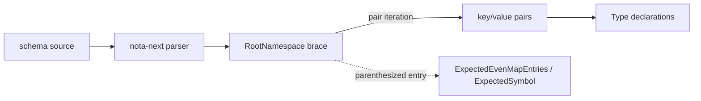
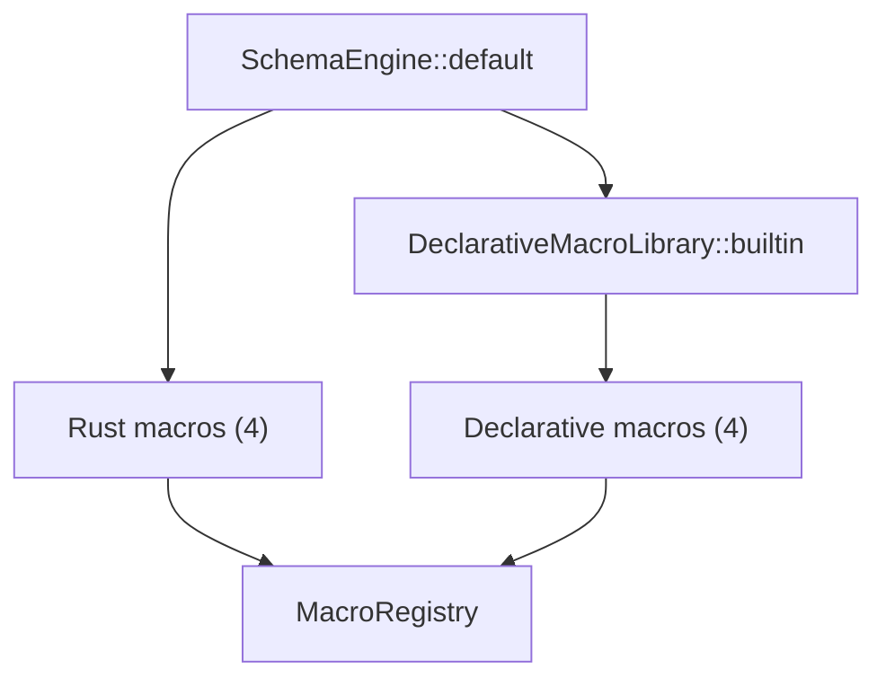
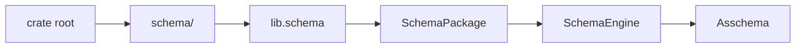
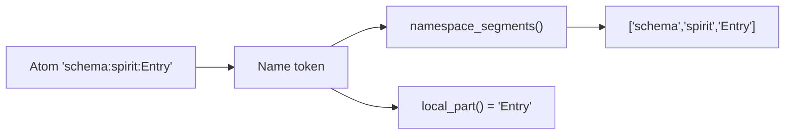
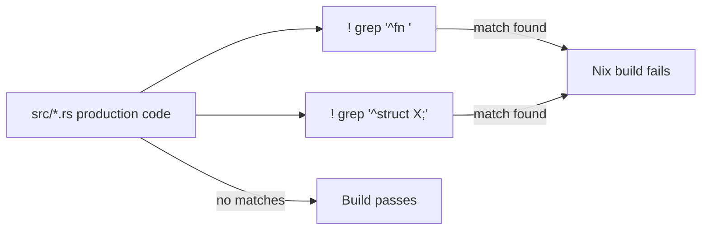

# 385 — Design document: NOTA / schema-next stack via Nix tests

*Design document for the NOTA / schema-next stack as it exists
on `schema-next/main` today. Five focused scenarios. Each
scenario: ONE short mermaid graph (≤7 nodes), the relevant
production code, and a walk-through grounded in a real Nix
check from `schema-next/flake.nix` and its backing Rust test.
Per intent record 912 (Maximum): graphs stay short and focused
— this document factors the architecture into five separate
diagrams rather than one big system map.*

## Frame

The schema-derived NOTA stack has three repos in the layer
described by this document: `nota-next` (structural reader),
`schema-next` (macro engine + Asschema lowering), and
`schema-rust-next` (Rust code emitter). This document covers
the SECOND repo and the layer it implements: how a `.schema`
file becomes a typed `Asschema`.

Each Nix check in `schema-next/flake.nix` is a structural
invariant the workspace REFUSES to lose. The checks are the
canonical "the architecture says X" statements. This document
walks the architecture by walking the checks.

The five scenarios:

| Nix check | Rust test | What it proves |
|---|---|---|
| `namespace-braces-are-key-value` | `brace_namespace_rejects_parenthesized_named_objects` | Braces are key/value maps; named-object form is rejected |
| `macro-registry-used` + `declarative-schema-macros` | `default_engine_dispatches_through_registered_macros` | Two-layer macro registry (4 Rust + 4 declarative) handles all lowering |
| `schema-module-entrypoint` | `package_loader_reads_schema_lib_entrypoint` | Each crate has a `schema/lib.schema` entry point loaded as a SchemaPackage |
| (within the same check) | `colon_qualified_names_lower_as_schema_names` | Colon-qualified names (`crate:module:Type`) lower as schema names with decomposable segments |
| `no-production-free-functions` + `no-production-unit-structs` | (Nix grep) | Methods-on-non-ZST-types Rust discipline |

## Scenario 1 — Braces are key/value maps

### Diagram



### Code — the rejection path

`schema-next/tests/lowering.rs:60-83`:

```rust
#[test]
fn brace_namespace_rejects_parenthesized_named_objects() {
    let source = "{} (Input ()) (Output ()) { (Entry [Topic Kind]) }";
    let error = SchemaEngine::default()
        .lower_source(source, SchemaIdentity::new("example", "0.1.0"))
        .expect_err("brace namespaces are key-value maps only");
    assert_eq!(
        error,
        SchemaError::ExpectedEvenMapEntries { found: 1 }
    );
}

#[test]
fn brace_namespace_rejects_parenthesized_named_objects_even_when_count_is_even() {
    let source = "{} (Input ()) (Output ()) { (Entry [Topic Kind]) (Kind (Decision Constraint)) }";
    let error = SchemaEngine::default()
        .lower_source(source, SchemaIdentity::new("example", "0.1.0"))
        .expect_err("brace namespace keys must be symbols");
    assert!(matches!(error, SchemaError::ExpectedSymbol { .. }));
}
```

### Nix check that enforces it

`schema-next/flake.nix:84-90`:

```nix
namespace-braces-are-key-value = pkgs.runCommand "..." { } ''
  grep -R "brace_namespace_rejects_parenthesized_named_objects" ${src}/tests/lowering.rs >/dev/null
  grep -R "brace_namespace_rejects_parenthesized_named_objects_even_when_count_is_even" ${src}/tests/lowering.rs >/dev/null
  ! grep -R "NamedTypeDefinition" ${src}/src ${src}/schemas ${src}/tests
  ! grep -R -n -E '^  \([A-Z][A-Za-z0-9]* [\[\(]' ${src}/schemas/root.schema ${src}/schemas/core.schema ${src}/schemas/spirit-min.schema
  touch $out
'';
```

### Scenario walk-through

The schema-next engine on main hard-removes named-object form.
Two backstops: the rejection tests (showing the engine actually
errors), and `! grep` clauses in the Nix check that fail the
build if anyone reintroduces the obsolete shape.

Test 1 feeds `{ (Entry [Topic Kind]) }` — one parenthesized
object inside the namespace brace. The brace's children count
is 1 (odd). The engine's pair-iteration step (`engine.rs:407`)
returns `ExpectedEvenMapEntries { found: 1 }`. Brace maps need
an even number of children — key, value, key, value, …

Test 2 feeds `{ (Entry [Topic Kind]) (Kind (Decision Constraint)) }`
— two parenthesized objects. Even count, so the parity check
passes. The next check (line 469-475 in engine.rs) attempts to
read the first child as a SYMBOL (the map key). `(Entry [Topic
Kind])` is a parenthesis, not a symbol — `ExpectedSymbol` error.

Together: a brace map ALWAYS reads as `Name Body Name Body …`.
The named-object form `(Name Body)` packs key + value into a
single paren that the brace parser refuses to unpack. Per
intent record 894 (Maximum): brace IS the key/value declaration
at the NOTA layer; named-object form was redundant sugar that
the engine refuses to accept.

## Scenario 2 — Two-layer macro registry

### Diagram



### Code — the two layers

`schema-next/src/engine.rs:231-244`:

```rust
impl MacroRegistry {
    pub(crate) fn with_schema_defaults() -> Self {
        let mut registry = Self::new();
        // Layer 1 — Rust hand-coded macros (4)
        registry.register(RootImportsMacro::new());
        registry.register(RootEnumMacro::new("RootInput", MacroPosition::RootInput));
        registry.register(RootEnumMacro::new("RootOutput", MacroPosition::RootOutput));
        registry.register(RootNamespaceMacro::new());
        // Layer 2 — Declarative macros loaded from builtin-macros.schema (4)
        let library = DeclarativeMacroLibrary::builtin()
            .expect("builtin declarative macro library lowers");
        for schema_macro in library.into_macros() {
            registry.register_box(schema_macro);
        }
        registry
    }
}
```

`schema-next/schemas/builtin-macros.schema`:

```nota
(SchemaMacro SchemaStructDefinition NamespaceDeclaration
  ($Name [$*Fields])
  (Type (Struct $Name [$*Fields])))

(SchemaMacro SchemaEnumDefinition NamespaceDeclaration
  ($Name ($*Variants))
  (Type (Enum $Name ($*Variants))))

(SchemaMacro SchemaStructFields StructFields
  [$*Fields]
  (Fields $*Fields))

(SchemaMacro SchemaEnumVariants EnumVariants
  ($*Variants)
  (Variants $*Variants))
```

### Nix checks that enforce it

`schema-next/flake.nix:61-83`:

```nix
macro-registry-used = pkgs.runCommand "..." { } ''
  grep -R "pub struct MacroRegistry" ${src}/src/macros.rs >/dev/null
  grep -R '"SchemaStructFields"' ${src}/tests/lowering.rs >/dev/null
  grep -R '"SchemaEnumVariants"' ${src}/tests/lowering.rs >/dev/null
  ! grep -R "struct TypeDeclarationMacro" ${src}/src   # deleted in d340433
  ! grep -R "struct StructFieldsMacro" ${src}/src
  ! grep -R "struct EnumVariantsMacro" ${src}/src
  touch $out
'';
declarative-schema-macros = pkgs.runCommand "..." { } ''
  grep -R "DeclarativeMacroLibrary::builtin" ${src}/src/engine.rs >/dev/null
  grep -R "SchemaStructDefinition" ${src}/schemas/builtin-macros.schema >/dev/null
  grep -R '\$Name' ${src}/schemas/builtin-macros.schema >/dev/null
  grep -R '\$\*Fields' ${src}/schemas/builtin-macros.schema >/dev/null
  touch $out
'';
```

### Scenario walk-through

The engine registers two macro layers at startup. Layer 1 is
hand-coded Rust because it handles the FOUR root positions
(`RootImports`, `RootInput`, `RootOutput`, `RootNamespace`) the
engine must process to recognize what document it's reading.
Layer 2 is declarative because the inner positions —
`NamespaceDeclaration`, `StructFields`, `EnumVariants` — are
WHERE EXTENSIBILITY LIVES, and pattern/template declarations in
NOTA are easier to author + maintain than Rust code.

The Nix check `macro-registry-used` enforces that the THREE
hand-coded Rust macros for the inner positions — which used to
exist as `TypeDeclarationMacro`, `StructFieldsMacro`,
`EnumVariantsMacro` — are gone. The `!grep` clauses make the
build fail if they're ever reintroduced. The check
`declarative-schema-macros` enforces that the declarative file
actually contains the four macros with `$Name` and `$*Fields`
capture sigils.

The dispatch test `default_engine_dispatches_through_registered_macros`
(line 334) feeds `spirit-min.schema` through the engine and
asserts the EXACT sequence of macro names + positions visited —
24 entries showing `SchemaStructDefinition`,
`SchemaStructFields`, `SchemaEnumDefinition`, `SchemaEnumVariants`
fire by name. Together: the test PROVES the architecture; the
Nix grep PROVES the architecture can't drift back.

## Scenario 3 — Schema module loading via lib.schema

### Diagram



### Code — the package loader

`schema-next/tests/lowering.rs:115-130`:

```rust
#[test]
fn package_loader_reads_schema_lib_entrypoint() {
    let root = std::path::Path::new(env!("CARGO_MANIFEST_DIR"))
        .join("tests")
        .join("fixtures")
        .join("spirit-crate");
    let package = SchemaPackage::new(root, "spirit-next", "0.1.0");
    let source = package.load_lib().expect("load lib.schema");
    let asschema = source
        .lower(&SchemaEngine::default())
        .expect("schema lowers");

    assert_eq!(source.path(), package.lib_schema_path());
    assert_eq!(asschema.identity().component().as_str(), "spirit-next:lib");
    assert!(asschema.type_named("Entry").is_some());
}
```

Fixture at `schema-next/tests/fixtures/spirit-crate/schema/lib.schema`:

```nota
{}
(Input ((Record Entry) (Observe Query)))
(Output ((RecordAccepted RecordIdentifier) (RecordsObserved RecordSet)))
{
  Topic [Text]
  Topics [Topic]
  Description [Text]
  RecordIdentifier [Integer]
  Entry [Topics Kind Description Magnitude]
  Query [Topic Kind]
  RecordSet [Entry]
  Kind (Decision Principle Correction Clarification Constraint)
  Magnitude (Minimum VeryLow Low Medium High VeryHigh Maximum)
}
```

### Nix check that enforces it

`schema-next/flake.nix:91-98`:

```nix
schema-module-entrypoint = pkgs.runCommand "..." { } ''
  grep -R "pub struct SchemaPackage" ${src}/src/module.rs >/dev/null
  grep -R "lib.schema" ${src}/src/module.rs >/dev/null
  grep -R "package_loader_reads_schema_lib_entrypoint" ${src}/tests/lowering.rs >/dev/null
  test -f ${src}/tests/fixtures/spirit-crate/schema/lib.schema
  grep -R "colon_qualified_names_lower_as_schema_names" ${src}/tests/lowering.rs >/dev/null
  touch $out
'';
```

### Scenario walk-through

A Rust crate using schema-next places a `schema/` directory at
the crate root containing `lib.schema` as the entry point —
mirroring Cargo's `src/lib.rs` convention. The fixture
`tests/fixtures/spirit-crate/` IS a worked example: a directory
named `spirit-crate` with `schema/lib.schema` inside.

`SchemaPackage::new(root, name, version)` constructs the package
descriptor. `package.load_lib()` reads `<root>/schema/lib.schema`
into a `LowerableSource`. `source.lower(&engine)` walks the
content through the 4 Rust + 4 declarative macros (Scenario 2) to
produce an `Asschema`.

The Nix check's `test -f` clause makes the build fail if anyone
deletes the fixture. The `grep` clauses fail the build if
`SchemaPackage` disappears, if the `lib.schema` filename gets
renamed, or if the test gets deleted. Together: the
schema/lib.schema convention is structural, not aspirational.

The `asschema.identity().component()` reading `"spirit-next:lib"`
shows colon-qualified naming in the identity field — `spirit-next`
is the crate name (from the `SchemaPackage::new` argument); `lib`
is the module name (the `lib.schema` entry point). This is the
beginning of Scenario 4.

## Scenario 4 — Colon-qualified namespace paths

### Diagram



### Code — the colon-path test

`schema-next/tests/lowering.rs:85-113`:

```rust
#[test]
fn colon_qualified_names_lower_as_schema_names() {
    let source = "{} (Input ((Record schema:spirit:Entry))) (Output ()) \
                  { schema:spirit:Topic [Text] schema:spirit:Entry [schema:spirit:Topic] }";
    let asschema = SchemaEngine::default()
        .lower_source(source, SchemaIdentity::new("schema:spirit:lib", "0.1.0"))
        .expect("schema lowers");

    assert_eq!(
        asschema.input().variants[0]
            .payload.as_ref().expect("record payload")
            .name.as_str(),
        "schema:spirit:Entry"
    );
    assert_eq!(
        asschema.namespace()[1].name().namespace_segments(),
        vec!["schema", "spirit", "Entry"]
    );
    let TypeDeclaration::Newtype(entry) = &asschema.namespace()[1] else {
        panic!("single-field entry should be a newtype");
    };
    assert_eq!(entry.fields[0].name, Name::new("topic"));
}
```

### What's load-bearing about this scenario

The test feeds NOTA where atoms contain colons — `schema:spirit:Entry`
appears both as a payload reference in the Input enum AND as a
key in the namespace map AND as a field reference inside another
struct. The engine accepts the colon-bearing atoms as `Name`
values (record 902's "single colon as namespace separator" is
honored). `namespace_segments()` decomposes the path; `local_part()`
extracts just the final segment.

The colon path mirrors Rust's module structure with single
colons instead of double. `schema:spirit:Entry` says "the Entry
type in the spirit module of the schema crate." The colon path
is also what `package.load_lib()` (Scenario 3) returns when
asked for the identity — `spirit-next:lib`.

### Nix check enforcement

The `schema-module-entrypoint` Nix check (Scenario 3) also greps
for `colon_qualified_names_lower_as_schema_names` — the test
deletion would fail the build. Colon-path support is structural.

### Scenario walk-through

For NOTA's atom lexer to accept `schema:spirit:Entry` as a bare
atom, the lexer must allow `:` as an atom character. That's a
nota-next change operator landed in commit `1c11876b`. Once the
atom parses, the schema layer accepts it at any `Name` position
— payload references, namespace keys, field type references.
The `Name::namespace_segments()` and `Name::local_part()`
methods decompose the colon path when consumers need the parts.

Note the test deliberately uses `Entry [schema:spirit:Topic]` —
a struct with a single field of type `schema:spirit:Topic`.
Single-field struct = Newtype. The field name comes from
snake_case-lowering the LAST segment of the type path:
`schema:spirit:Topic` → `topic`. The field-name derivation rule
is unchanged by colon paths — only the LOCAL part of the name
contributes.

## Scenario 5 — Rust discipline enforced at the repo level

### Diagram



### Code — the two checks

`schema-next/flake.nix:99-112`:

```nix
no-production-free-functions = pkgs.runCommand "..." { } ''
  if grep -R -n -E '^(pub(\([^)]*\))? )?fn ' ${src}/src; then
    echo "production Rust must not use module-level free functions" >&2
    exit 1
  fi
  touch $out
'';
no-production-unit-structs = pkgs.runCommand "..." { } ''
  if grep -R -n -E '^struct [A-Za-z][A-Za-z0-9_]*;' ${src}/src; then
    echo "production Rust must not use unit structs as namespace/method holders" >&2
    exit 1
  fi
  touch $out
'';
```

### Scenario walk-through

Two grep checks at the workspace boundary. The first refuses any
module-level `fn ` declaration in `src/` (production Rust);
`fn main()` would be allowed if there were one, but schema-next
has none. The second refuses any `struct X;` unit-struct
declaration; every type must have at least one field.

Tests in `tests/` are exempt from the first check (the grep is
scoped to `src/`). Per AGENTS.md hard override + intent records
712 + 882: production Rust functions are methods on non-zero-
sized data-bearing types, never free functions, never on ZST
placeholders used as namespaces.

The discipline is repo-enforced. A pull request that adds a
free function or a unit-struct namespace breaks the Nix check;
the developer's branch fails to merge until the violation moves
to a data-bearing type. The rule lives in skills/AGENTS.md as
prose; the Nix check makes the rule operational.

### What the discipline forced (concrete example)

When the workspace had `pub(crate) fn atom_name(object: &Block)
-> Result<Name, SchemaError>` as a free helper, the methods-on-
types audit (`/379`) reshaped it as `Name::try_from_symbol_block`
— a constructor method on the actual `Name` type. The owning
noun was `Name`; the verb (parse a symbol block into one) moved
onto it. The free-helper-soup pattern is structurally impossible
here because the Nix check sees the violation before review can
miss it.

Same for the ZST namespace check: when the old shape had
`TypeDeclarationMacro;` `StructFieldsMacro;` `EnumVariantsMacro;`
unit structs holding only methods, the macro engine refactor
(commit `d340433`) replaced them with the declarative macros
(Scenario 2). The unit structs vanished; the Nix check enforces
they don't return.

## Cross-cutting — how the scenarios compose

Together the five scenarios describe the full lowering path:

1. A schema source file gets parsed by `nota-next` into an AST
   (Scenario 1's brace rejection happens here).
2. `SchemaPackage::load_lib` reads the file (Scenario 3).
3. The two-layer macro registry walks the AST, dispatching by
   position + shape (Scenario 2).
4. Type references use colon-qualified names that decompose
   into segments (Scenario 4).
5. All production code follows methods-on-non-ZST discipline,
   enforced by Nix at every commit (Scenario 5).

The output is a typed `Asschema` — the input to `schema-rust-next`,
which emits Rust code (out of scope for this document; see
Layer 3 of the bottom-up tour when it lands).

## Verification anchors

| Claim | Source |
|---|---|
| 7 Nix checks in schema-next | `schema-next/flake.nix:44-112` |
| Pair-only namespace + named-object rejection | `tests/lowering.rs:60-83`, intent record 894 |
| 4 Rust + 4 declarative macros | `engine.rs:233-244`, `schemas/builtin-macros.schema` |
| Schema package + lib.schema entry | `tests/lowering.rs:115-130`, fixture at `tests/fixtures/spirit-crate/schema/lib.schema` |
| Colon-qualified names | `tests/lowering.rs:85-113`, intent record 902 |
| Methods-on-non-ZST discipline | intent records 712 + 882, enforced by Nix grep checks |
| Short-focused-graphs principle | intent record 912 + `skills/mermaid.md` §"Total graph size" |

## What's NOT in this document

- The Rust emission layer (`schema-rust-next`) — separate
  flake, separate Nix checks, separate document.
- The `nota-next` structural reader — covered in `/376` (Layer 1
  of the bottom-up tour).
- The runtime triad (Signal / Executor / SEMA inside the
  daemon) — covered in `/371`.
- The `(Macro …)` declaration form expansion in detail — covered
  in `/380` Part I.
- Hot-reload watch hooks — design direction per record 902;
  not yet implemented.

These belong in sibling documents.
