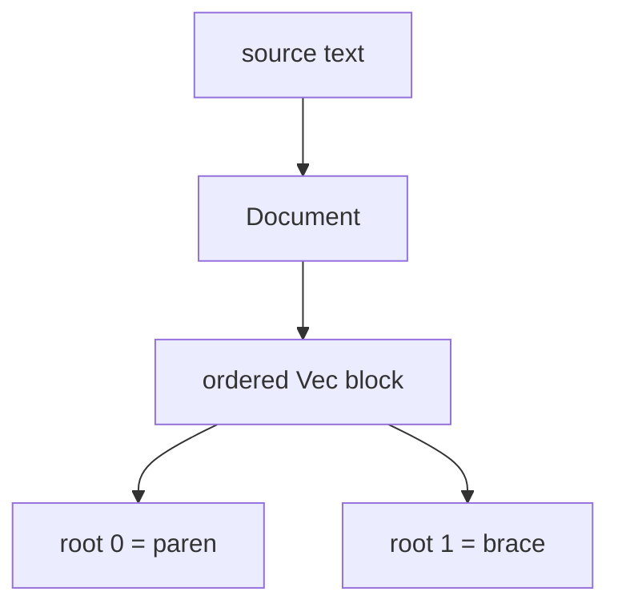
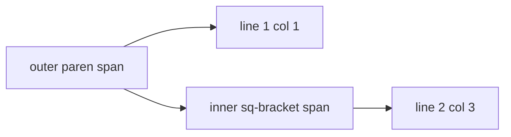
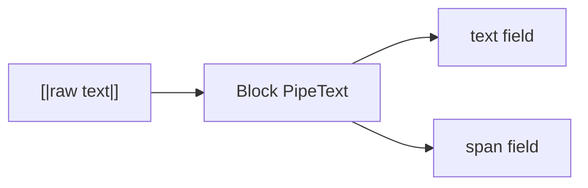
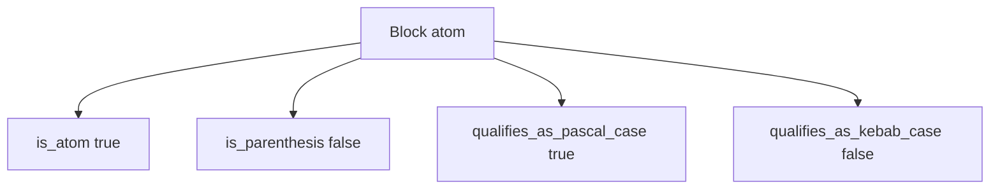
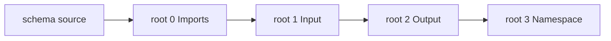
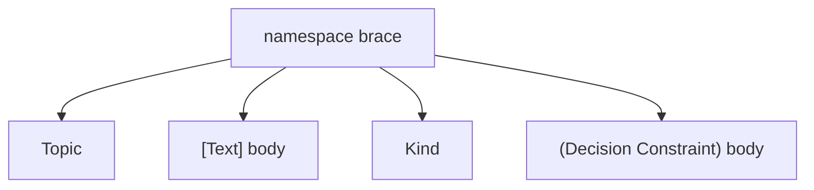
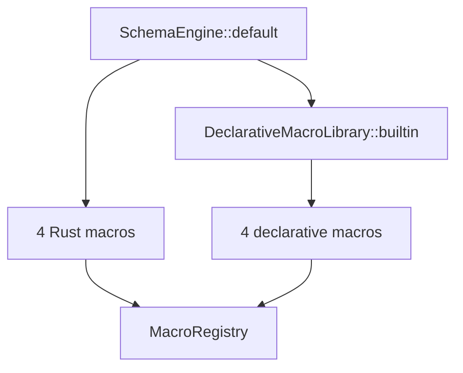
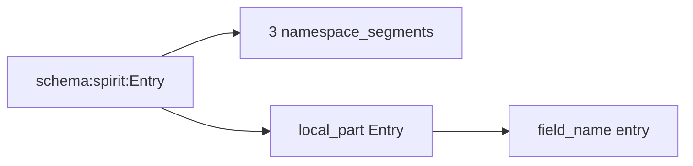

# 387 — NOTA + schema design representation

*Kind: Design · Topic: nota-schema-design-representation · 2026-05-27*

*Side-by-side visual + test representation of the nota-next /
schema-next stack as it lives on `main` today. Eight focused
sections covering BOTH layers: NOTA (the structural reader) and
SCHEMA (the macro engine + Asschema lowering). Each section pairs
ONE short mermaid diagram (4-7 nodes) with the Rust test that
proves the design invariant, plus a walk-through paragraph
grounding the visual in working code. Per intent record 911
(Maximum) — "use short focused graphs, pair each graph with the
relevant code surface, and ground each scenario explanation
directly in Nix tests." Per record 912 (Maximum) — graphs are
4-8 nodes per diagram.*

## What this report supersedes

Replaces `reports/designer/385-nota-schema-next-stack-design-via-nix-tests-2026-05-27.md`
(five schema-only scenarios; missed the NOTA layer entirely per
the psyche directive that asked for "the nota + schema design").
This report covers both layers, uses new design-illustrating tests
where the existing fixtures mixed multiple concepts, and shortens
diagrams further (4-7 nodes apiece) per record 912's
short-and-focused discipline.

## Frame

Three repos in the schema-derived stack:

- **`nota-next`** — structural reader (atoms, blocks, spans,
  delimiters). 7 tests now (5 original + 2 design examples).
- **`schema-next`** — macro engine + Asschema lowering. 18 tests
  now (13 original + 5 design examples).
- **`schema-rust-next`** — Rust emitter. Out of scope; covered in
  a separate document when the emission target stabilises (per
  record 909, Maximum, src/schema/ in-tree).

Both repos are guarded by Nix checks in their respective
`flake.nix` files. The Nix check IS the structural invariant the
workspace refuses to lose; the Rust test PROVES the invariant
holds; the diagram VISUALISES the topology the test proves. The
three together — Nix + test + diagram — are how each load-bearing
design decision lives durably.

The new tests in `tests/design_examples.rs` (both repos) carry
the design representation forward. Each test illustrates ONE
load-bearing point with a short fixture and a focused assertion.
A future agent reading the report sees the test name in the
diagram caption; opening the file shows the canonical example
without a 50-line fixture.

## Section 1 — NOTA Document = ordered list of root blocks

The NOTA reader's top type is `Document` — an ordered list of
root-level `Block`s plus the original source string. Root blocks
are sibling positional objects; the schema layer above interprets
position (Imports / Input / Output / Namespace) but the reader
itself just hands back an ordered sequence.



Test — `nota-next/tests/block_queries.rs:4-16`,
`parses_ordered_root_objects_and_reemits_from_spans`:

```rust
let source = "(State [Statement]) { Topic [Text] }";
let document = Document::parse(source).expect("valid nota");

assert_eq!(document.holds_root_objects(), 2);
let first = document.root_object_at(0).expect("first root");
let second = document.root_object_at(1).expect("second root");

assert!(first.is_parenthesis());
assert!(second.is_brace());
assert_eq!(first.reemit(document.source()), "(State [Statement])");
assert_eq!(second.reemit(document.source()), "{ Topic [Text] }");
```

The test feeds two root objects — a parenthesis followed by a
brace, separated by ordinary whitespace. The reader returns both
in order through `root_object_at(0)` / `root_object_at(1)`. Each carries
its `Delimiter` (the `is_parenthesis()` / `is_brace()` predicates)
and its source span (the `reemit` returns the original text
substring without rebuilding from the AST). Two complementary
properties: position is preserved (root index 0 is the first
authored object) and source fidelity is preserved (reemit gives
back the exact bytes including spacing inside the brace).

## Section 2 — Spans propagate through nested blocks

Every `Block` carries a `SourceSpan` with line/column AND byte
offset. Spans propagate through arbitrary nesting — a deeply
nested block's span points at its EXACT region of the source.
This is design-load-bearing per records 770 + 771 (Maximum / High):
the object-block pass tracks line/column directly rather than
normalize root objects onto one line.



Test — `nota-next/tests/design_examples.rs`,
`design_example_source_spans_propagate_through_nested_blocks`:

```rust
let source = r#"(Record
  [Entry])"#;
let document = Document::parse(source).expect("nota parses");
let outer = document.root_object_at(0).expect("outer parenthesis");

let outer_span = outer.source_span();
assert_eq!(outer_span.start.line, 1);
assert_eq!(outer_span.start.column, 1);
assert_eq!(outer_span.end.line, 2);
assert_eq!(outer_span.end.column, 11);

let inner = outer.root_object_at(1).expect("inner square-bracket");
let inner_span = inner.source_span();
assert_eq!(inner_span.start.line, 2);
assert_eq!(inner_span.start.column, 3);
```

Two-line fixture; outer paren starts at line 1 column 1, ends at
line 2 column 11 (the closing `)` after `[Entry]`). The nested
square-bracket starts at line 2 column 3 — past the indentation
and past the closing token of the previous line. The reader
walks the source character by character tracking lines and
columns; nested children inherit the cursor position at their
opening delimiter. Without this, a schema-layer error like
"`ExpectedSymbol` at line 2 col 3" couldn't point at the actual
offending byte; spans are how the diagnostic layer earns the
right to be useful.

## Section 3 — Pipe-text is bracket-safe and not recursively parsed

The `[|...|]` block-string form is the escape-free zone of NOTA.
It can contain `]`, `"`, apostrophes, newlines — anything but the
closing `|]` pair. AND the reader does NOT recurse into pipe-text
content; it stays opaque until the macro engine wants to re-parse
it. This is what lets a macro body carry its own NOTA without
collision with the host parser.



Test — `nota-next/tests/block_queries.rs:54-66`,
`pipe_text_is_square_bracket_safe_and_not_recursively_parsed`:

```rust
let source = "[|macro body with ] and \" and apostrophe's text|]";
let document = Document::parse(source).expect("valid nota");
let root = document.root_object_at(0).expect("root");

assert!(root.is_pipe_text());
assert_eq!(
    root.demote_to_string(),
    Some("macro body with ] and \" and apostrophe's text")
);
assert_eq!(root.reemit(document.source()), source);
```

The fixture carries the three dangerous characters — `]`, `"`,
and `'` — and the reader returns them intact through
`demote_to_string()`. The `reemit` returns the source unchanged,
including the surrounding `[|` and `|]`. This property is what
lets schema macro bodies live inline in a NOTA source file — a
macro can say "carry this body of text opaquely, and let the
schema layer interpret it later." Per intent record 705
(Maximum): NOTA-in-anything-with-double-quote-strings is
escape-free; pipe-text is the in-NOTA version of that same
property (an inner NOTA payload survives inside a `[|...|]`
without internal escaping).

## Section 4 — Reader exposes candidates, not schema semantics

The reader uses two verb shapes:

- **`is_*`** — factual structural query (delimiter shape).
- **`qualifies_as_*`** — candidate query (case shape).

There is no `is_pascal_case_symbol` method because PascalCase IS
NOT a structural fact at the NOTA layer — it's a *shape candidate*
that the schema layer either accepts or rejects per position.
Per intent record 800 (Maximum): the distinction is "qualifies
as" not "is"; type-level questions move out of NOTA into the
macro/schema layer.



Test — `nota-next/tests/design_examples.rs`,
`design_example_reader_exposes_candidates_not_schema_semantics`:

```rust
let document = Document::parse("Decision").expect("nota parses");
let block = document.root_object_at(0).expect("first root");

assert!(block.is_atom());
assert!(!block.is_parenthesis());

assert!(block.qualifies_as_pascal_case_symbol());
assert!(block.qualifies_as_symbol());
assert!(!block.qualifies_as_camel_case_symbol());
assert!(!block.qualifies_as_kebab_case_symbol());

assert_eq!(block.demote_to_string(), Some("Decision"));
```

The atom `Decision` is structurally an `Atom` (not a delimited
block). It QUALIFIES as a PascalCase symbol (the schema layer
could read this as a `Kind` variant, or a type name, or a struct
head). It does NOT qualify as camelCase or kebab-case. The
reader doesn't decide what `Decision` MEANS — it just tells you
the shape. A schema position that needs a PascalCase symbol calls
`qualifies_as_pascal_case_symbol()` to discriminate; one that
needs a kebab-case identifier (like a topic) calls
`qualifies_as_kebab_case_symbol()`. The split keeps the layer
boundary visible at every call site.

## Section 5 — Schema document = exactly 4 positional roots

A `.schema` file lowers as exactly 4 root NOTA objects, in order:

1. **Imports** brace (`{...}`)
2. **Input** parenthesis (`(...)`)
3. **Output** parenthesis (`(...)`)
4. **Namespace** brace (`{...}`)

Any other count is a typed error, not silent truncation. Per
intent record 805 (Maximum): the four-position root.



Test — `schema-next/tests/design_examples.rs`,
`design_example_schema_document_has_exactly_four_root_objects`:

```rust
let too_few = "{} (Input ()) (Output ())";
let error = SchemaEngine::default()
    .lower_source(too_few, SchemaIdentity::new("example", "0.1.0"))
    .expect_err("three root objects should fail");
assert_eq!(
    error,
    SchemaError::ExpectedRootObjectCount { expected: 4, found: 3 }
);

let too_many = "{} (Input ()) (Output ()) {} {}";
let error = SchemaEngine::default()
    .lower_source(too_many, SchemaIdentity::new("example", "0.1.0"))
    .expect_err("five root objects should fail");
assert_eq!(
    error,
    SchemaError::ExpectedRootObjectCount { expected: 4, found: 5 }
);
```

Two cases bracket the invariant. 3 roots fails with
`ExpectedRootObjectCount { expected: 4, found: 3 }`; 5 roots fails
with `expected: 4, found: 5`. The engine doesn't try to fill a
missing position with `None` or absorb extra positions into
namespace — it errors loud. The shape comes from the engine's
`lower_document_with_context` (`engine.rs:150-154`); the schema
file's position-to-meaning binding is enforced at this boundary.

## Section 6 — Namespace brace is pair-style key/value

The 4th position (Namespace) is a brace `{...}` with an even
number of children, read as key/value pairs. Keys are PascalCase
type names; values are bodies (square-bracket for struct fields,
parenthesis for enum variants). The named-object form `(Name body)`
is rejected — brace IS the key/value declaration; wrapping each
entry in parens is redundant sugar.

Per intent record 894 (Maximum): brace is ALWAYS a key value map
at the NOTA layer; the schema namespace at position 3 uses
pair-style not named-object form.



Test — `schema-next/tests/design_examples.rs`,
`design_example_namespace_brace_is_pair_style_key_value_map`:

```rust
let source = "{} (Input ()) (Output ()) { Topic [Text] Kind (Decision Constraint) }";
let asschema = SchemaEngine::default()
    .lower_source(source, SchemaIdentity::new("example", "0.1.0"))
    .expect("pair-style namespace lowers");

let names: Vec<&str> = asschema.namespace()
    .iter()
    .map(|declaration| declaration.name().as_str())
    .collect();
assert_eq!(names, vec!["Topic", "Kind"]);

let TypeDeclaration::Newtype(topic) = &asschema.namespace()[0] else {
    panic!("Topic [Text] should lower as a newtype (single-field struct)");
};
assert_eq!(topic.fields.len(), 1);
let TypeDeclaration::Enum(kind) = &asschema.namespace()[1] else {
    panic!("Kind (Decision Constraint) should lower as an enum");
};
```

The fixture's namespace is `{ Topic [Text] Kind (Decision Constraint) }`
— four children in pair sequence. The engine reads them as
`(Topic → [Text])` and `(Kind → (Decision Constraint))`. The
square-bracket body lowers to a struct (newtype here because of
the single field); the parenthesis body lowers to an enum. The
companion negative tests in `lowering.rs:60-83` reject the
named-object form `{ (Topic [Text]) }`; together the pair PROVE
that pair-style is the canonical and only accepted shape.

## Section 7 — Two-layer macro registry

The default `SchemaEngine` registers two macro layers at startup:

- **Layer 1 — 4 Rust hand-coded macros** for the four ROOT
  positions (`RootImports`, `RootInput`, `RootOutput`,
  `RootNamespace`). These bootstrap the engine's recognition of
  what document it's reading.
- **Layer 2 — 4 declarative macros** loaded from
  `schemas/builtin-macros.schema` for the three INNER positions
  (`NamespaceDeclaration` ×2, `StructFields`, `EnumVariants`).
  Declarative macros use NOTA-authored pattern + template with
  `$Name` (single capture) and `$*Fields` (rest capture) sigils.

Per intent record 864 (Maximum): real macro registry /
macro-dispatch design.



Test — `schema-next/tests/design_examples.rs`,
`design_example_default_engine_has_two_macro_layers`:

```rust
let library = DeclarativeMacroLibrary::builtin().expect("builtin macros parse");
let declarative_names: Vec<&str> = library.definitions().iter()
    .map(|definition| definition.name().as_str()).collect();
assert_eq!(declarative_names, vec![
    "SchemaStructDefinition", "SchemaEnumDefinition",
    "SchemaStructFields", "SchemaEnumVariants",
]);

let positions: Vec<MacroPosition> = library.definitions().iter()
    .map(|definition| definition.position()).collect();
assert_eq!(positions, vec![
    MacroPosition::NamespaceDeclaration,
    MacroPosition::NamespaceDeclaration,
    MacroPosition::StructFields,
    MacroPosition::EnumVariants,
]);

let mut context = MacroContext::default();
SchemaEngine::default().lower_source_with_context(
    "{} (Input ()) (Output ()) {}",
    SchemaIdentity::new("example", "0.1.0"),
    &mut context,
).expect("schema lowers");
let applied: Vec<&str> = context.macros_applied().iter()
    .map(String::as_str).collect();
for root_macro in ["RootImports", "RootInput", "RootOutput", "RootNamespace"] {
    assert!(applied.contains(&root_macro));
}
```

Three assertions in one focused test. The declarative LIBRARY
holds exactly 4 macro definitions, named and positioned per the
inner-position registry. The same definitions' positions show
they target the three inner positions (NamespaceDeclaration
appears twice — once for struct macros, once for enum macros).
The engine's macros-applied trace on a minimal schema includes
all four ROOT macro names — proving they're registered alongside
the declarative ones. Layer 1 + Layer 2 = 8 macros total; this
test asserts both layers exist and fire as expected.

## Section 8 — Colon-qualified names decompose

A schema name like `schema:spirit:Entry` mirrors Rust's
`crate::module::Type` with single colons instead of double. The
`Name::namespace_segments()` method decomposes the path into
ordered segments; `local_part()` returns the final segment;
`field_name()` returns the snake_case version of the local part.

Per intent records 895 + 902 (Maximum / High): namespace
separator is a SINGLE colon, mirroring Rust crate-then-module-then-type.



Test — `schema-next/tests/design_examples.rs`,
`design_example_colon_qualified_name_decomposes_into_segments`:

```rust
let qualified = Name::new("schema:spirit:Entry");

assert_eq!(qualified.namespace_segments(), vec!["schema", "spirit", "Entry"]);
assert_eq!(qualified.local_part(), "Entry");
assert_eq!(qualified.field_name(), "entry");

let bare = Name::new("Topic");
assert_eq!(bare.namespace_segments(), vec!["Topic"]);
assert_eq!(bare.local_part(), "Topic");
assert_eq!(bare.field_name(), "topic");
```

Two cases. A qualified name with three segments decomposes by
single colon and exposes the tail as `local_part`. A bare
PascalCase name decomposes to a single-element vector with itself
as the local part. The `field_name` always derives from the local
part — `schema:spirit:Entry → entry`, `Topic → topic`. This
matters because schema-emitted Rust uses snake_case field names
on structs, derived from the type name in field position; the
colon path adds qualification at the type level without changing
the field-naming rule.

The complementary test `colon_qualified_names_lower_as_schema_names`
in `lowering.rs` exercises this through a full schema lowering;
this focused test isolates the `Name` decomposition methods so the
design contract shows in code without a 12-line fixture.

## Cross-cutting — how the layers compose

The 8 sections compose top-down through these stages of a schema's
lowering:

| Stage | Sections | Outcome |
|---|---|---|
| Parse text | 1, 2, 3, 4 | NOTA `Document` with spans + atom candidates |
| Recognize document | 5 | 4-position root validated |
| Dispatch macros | 7 | Two-layer registry fires by position + shape |
| Lower namespace | 6 | Pair-style key/value → typed declarations |
| Resolve names | 8 | Colon-qualified names with segment decomposition |

The output is a typed `Asschema` — the input to `schema-rust-next`
(out of scope for this report; covered in a separate document
when the Rust emission target lands per record 909).

## Test inventory — what's reused vs added

The design representation pulls from BOTH existing tests and
newly-added design example tests. The split:

| Section | Test source | Repo + file |
|---|---|---|
| 1 — Document = root blocks | reused `parses_ordered_root_objects_and_reemits_from_spans` | `nota-next/tests/block_queries.rs:4-16` |
| 2 — Spans propagate | NEW `design_example_source_spans_propagate_through_nested_blocks` | `nota-next/tests/design_examples.rs` |
| 3 — Pipe-text safe | reused `pipe_text_is_square_bracket_safe_and_not_recursively_parsed` | `nota-next/tests/block_queries.rs:54-66` |
| 4 — Candidates not semantics | NEW `design_example_reader_exposes_candidates_not_schema_semantics` | `nota-next/tests/design_examples.rs` |
| 5 — 4-position document | NEW `design_example_schema_document_has_exactly_four_root_objects` | `schema-next/tests/design_examples.rs` |
| 6 — Namespace pair-style | NEW `design_example_namespace_brace_is_pair_style_key_value_map` | `schema-next/tests/design_examples.rs` |
| 7 — Two macro layers | NEW `design_example_default_engine_has_two_macro_layers` | `schema-next/tests/design_examples.rs` |
| 8 — Colon-qualified names | NEW `design_example_colon_qualified_name_decomposes_into_segments` | `schema-next/tests/design_examples.rs` |

The new test files keep `design_example_` as a naming prefix so a
future agent scanning the file knows which tests are for design
representation vs broader coverage. Existing tests in
`lowering.rs` and `block_queries.rs` aren't replaced; the new
file is additive.

## Verification anchors

| Claim | Source |
|---|---|
| 7 nota-next tests (5 + 2 design) | `nota-next/tests/block_queries.rs` + `tests/design_examples.rs` |
| 18 schema-next tests (13 + 5 design) | `schema-next/tests/lowering.rs` + `tests/design_examples.rs` |
| 7 nota-next Nix checks, including escaped-newline fixture guard | `nota-next/flake.nix` |
| 14 schema-next Nix checks | `schema-next/flake.nix` |
| 4 Rust + 4 declarative macros | `schema-next/src/engine.rs:235-248`, `schemas/builtin-macros.schema` |
| Methods-on-non-ZST discipline | intent records 712 + 882 + 884, enforced by Nix grep |
| Short-focused diagrams (4-8 nodes) | intent record 912 + `skills/mermaid.md` §"Total graph size" |
| Both layers covered | intent records 911 + 920 |

## Designer feature branches

The new design-illustrating tests land on these designer branches.
After operator integration, main contains the same test surface
under a slightly different commit description:

| Repo | Designer branch | Pushed commit | Operator main commit |
|---|---|---|---|
| `nota-next` | `designer-design-examples-2026-05-27` | `52b395bd` | `de4b627a` (`tests: add nota design example witnesses`) |
| `schema-next` | `designer-design-examples-2026-05-27` | `0e23555a` | `d80767e9` (`tests: add schema design example witnesses`) |

Both branches passed `cargo test`, `cargo fmt --check`, and
`cargo clippy --all-targets -- -D warnings` at push time. The
operator integrated onto main per workspace discipline (intent
record 515).
