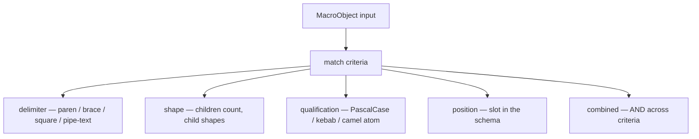

# 388 — Macro system exploration + brace-enum sugar

*Kind: Design + Implementation · Topic: schema macros · 2026-05-27*

*Plays with the schema-next macro engine. Eight focused match-criteria
scenarios land as integration tests; the brace-form enum sugar from
records 894 / 932 lands as a working implementation. The report covers
the test taxonomy, the implementation choice, and the open questions
that surfaced.*

## Frame — what records 932-935 add to the macro system

`schema-next/main` (at commit `d80767e9`) already carries a working
macro engine — two layers (4 Rust macros for root positions, 4
declarative macros for inner positions), `$Name` / `$*Fields` capture
sigils, pair-style namespace dispatch. Report 387 §"Two-layer macro
registry" pins the current shape.

Records 932-935 (2026-05-27, Maximum/High) extend the picture in four
ways. **Record 932** (Maximum) names macros as the universal sugar
mechanism: multiple match criteria (delimiter, shape, count, symbol
qualification, combinations) dispatch on the most-specific match;
brace-enum syntax IS a macro that expands to the canonical paren form.
**Record 933** (the structural-fingerprint observation) names the first
two levels of structure as the 64-bit header. **Record 934** (the
input/output partition) maps the ~240-slot tag space across input and
output verbs. **Record 935** (the architectural sweep) names the
Communicate trait, signal-frame internals, mail state manager, and
database marker — these are out of scope for THIS dispatch (deferred
section at the end) and live in their own repos.

This report attends to the **macro-system half of 932**: documenting
the match-criteria taxonomy in working tests + implementing the
brace-enum sugar. The current first-match-wins dispatch is the
starting point; the most-specific-match dispatch is a future change
(see "Open questions").

## Match criteria taxonomy

Per record 932, the macro engine supports six criterion-kinds —
delimiter, internal shape, object count, symbol qualification, position
binding, and any combination. The current engine implements the first
five; the dispatch combinator is first-match-wins by registration order.



The diagram has 7 nodes. The full mapping to live tests is the section
below; each criterion gets exactly one isolated test plus one
combined-criteria test that exercises three at once (delimiter +
count + qualification).

## Test exploration — eight scenarios in
`tests/macro_exploration.rs`

Each test defines a small custom `SchemaMacro` impl carrying one
piece of state plus an `impl SchemaMacro for ...` block. Behaviour
attaches to a data-bearing struct — `DelimiterOnlyMacro`,
`NamedPayloadShapeMacro`, `FiveObjectMacro`, `SymbolCaseMacro`,
`BraceNamedPairsMacro`, `AnyBraceMacro`, `PositionPinnedMacro`,
`PairOnlyMacro`. Eight tests total; one criterion per test.

**Scenario 1 — Delimiter-only match.**
`delimiter_only_match_fires_on_outer_delimiter_regardless_of_contents`
proves a macro can fire on brace inputs OR square-bracket OR parens
just by checking the outer delimiter. Empty `{}` matches the brace
macro; `[Alpha Beta]` matches the square-bracket macro. The
`DelimiterOnlyMacro` carries the `expected_delimiter` and dispatches
via `delimiter_matches`. The simplest match shape. Cite:
`tests/macro_exploration.rs::delimiter_only_match_fires_on_outer_delimiter_regardless_of_contents`.

**Scenario 2 — Shape-match (exactly 2 children, first PascalCase).**
`shape_match_requires_exact_inner_structure` proves a macro can pin to
a specific structural shape — paren with exactly 2 children where the
first child qualifies as PascalCase. `(Foo Bar)` matches; `(Foo Bar
Baz)` fails the count; `(foo-bar Baz)` fails the qualification. The
`NamedPayloadShapeMacro` packs all three constraints into its
`matches` method.

**Scenario 3 — Object-count match.** `object_count_match_distinguishes_by_root_object_count`
proves a macro can match on EXACT child count — the `FiveObjectMacro`
fires on parens with 5 root objects (the shape of `(SchemaMacro Name
Position Pattern Template)`) but rejects 4-child or 6-child variants.
Records 882 / 932 name this as one of the criteria; the 5-element
SchemaMacro declaration uses it implicitly through `MacroDefinitionRecord::new`'s `holds_root_objects() != 5` check.

**Scenario 4 — Qualified-as-symbol match.**
`qualified_as_symbol_match_splits_pascal_kebab_camel` proves three
macros (one per case shape) fire only on atoms that qualify as their
shape. `Decision` → PascalCase only; `schema-spirit` → kebab only;
`recordIdentifier` → camelCase only. The `SymbolCaseMacro` carries a
`case: SymbolCase` field; the dispatch is a method on the struct, not
a free function.

**Scenario 5 — Combined criteria.**
`combined_criteria_brace_and_even_count_and_pascal_keys` shows three
criteria AND'd: brace delimiter, even count, all odd-positioned
children qualify as PascalCase. `{ToInbox Address ToOutbox Address}`
satisfies all three; `(ToInbox Address ToOutbox Address)` fails brace;
`{ToInbox Address Extra}` fails even-count; `{to-inbox Address ToOutbox
Address}` fails PascalCase. This IS the structural shape the
brace-enum-sugar implementation accepts.

**Scenario 6 — First-match-wins by registration order.**
`first_match_wins_by_registration_order_on_overlapping_macros` proves
the current dispatch shape: when two `AnyBraceMacro` instances would
both accept the same brace input, the FIRST registered wins. Swapping
registration order swaps the winner. This is observable through
`context.macros_applied()` — only the winner appears in the trace.
Record 932 names "most specific match" as the intended dispatch —
that's an open question (see below).

**Scenario 7 — Position-aware dispatch.**
`position_aware_dispatch_picks_macro_by_position_slot` proves the same
input shape (a paren) dispatches differently when the engine asks at
two different `MacroPosition` slots. `PositionPinnedMacro` carries
which position it accepts; one registry has two of them at
RootInput and EnumVariants. The same `(Foo Bar)` block fires
`InputOnly` at RootInput and `VariantsOnly` at EnumVariants.

**Scenario 8 — MacroObject::Pair vs MacroObject::Block.** (Bonus, not
in the dispatch's required list but surfaced naturally.)
`macro_object_pair_versus_block_dispatch_shapes` proves the
`MacroObject` enum has two shapes — `Block(&Block)` for normal
position dispatch, `Pair(MacroPair { name, definition })` for
namespace-declaration dispatch. A `PairOnlyMacro` matches Pair inputs
but rejects Block inputs. This is what makes the namespace
key/value-pair lowering type-safe.

## Brace-enum sugar — design + implementation

### The two equivalent forms

Per record 894 + record 932 + the prior turn's psyche acknowledgment:
payload-carrying enum declarations have two equivalent surface forms.

**Paren form (canonical):**

```nota
(Input ((Record Entry) (Observe Query)))
```

Each variant is a `(Name Payload)` 2-child paren; the wrapping paren
holds the list.

**Brace form (sugar — new):**

```nota
(Input {Record Entry Observe Query})
```

The brace body flattens the variant pairs — `{Name Payload Name
Payload ...}` — with the macro engine pairing them up.

**Unit-variant enums STAY paren-form**: `Kind (Decision Principle
Correction Clarification Constraint)` has no payload to pair with, so
the brace sugar doesn't apply. An attempt at `Kind {Decision Principle
Correction}` (odd count) errors loud with
`ExpectedEvenBraceEnumPairs { found: 3 }`.

### Implementation choice — hybrid Rust + declarative

Three options surfaced. **Option (a)** — declarative macro alone:
limited by the current template engine which doesn't have "pair up by
2" — would require extending the template syntax.
**Option (b)** — extend `MacroPattern` to allow brace delimiter: the
pattern engine already does this generically through
`PatternObject::from_block`; brace patterns work syntactically.
**Option (c)** — Rust macro at `EnumVariants`: handles the pair-up
semantically, keeping declarative templates simple.

**Chose hybrid: a + c.** A new declarative macro
`SchemaEnumDefinitionBrace` matches `($Name {$*Variants})` at
`NamespaceDeclaration` and emits `(Type (Enum $Name {$*Variants}))`.
A new Rust macro `BraceEnumVariantsMacro` registers at `EnumVariants`,
matches brace inputs, and pairs up children into `EnumVariant`s. The
flow is "declarative recognises the namespace pair → Rust pairs the
variant list". Both pieces are data-bearing structs (no ZSTs); the
declarative one is a 4-line entry in `builtin-macros.schema`.

**Why hybrid:** the declarative macro is genuinely declarative
(pattern-matching the brace shape, no pair-up logic in templates).
The Rust macro carries the small semantic step (pair adjacent
children) without bloating the template language. The split mirrors
the existing Rust-vs-declarative discipline at the registry: 4 Rust
root + 1 Rust BraceEnumVariants + 5 declarative inner.

### The root-level dispatch change

`RootEnumBlock::variants` in `engine.rs` previously dispatched to the
`EnumVariants` registry only when the second child was a parenthesis.
The brace-sugar at root needs the same dispatch path for brace.
One-line change:

```rust
// before
.is_some_and(Block::is_parenthesis)
// after
.is_some_and(|object| object.is_parenthesis() || object.is_brace())
```

This lets `(Input {Record Entry Observe Query})` route the brace
body to the `BraceEnumVariantsMacro`.

### Before/after example

Both forms below produce the exact same `Asschema` — the
`brace_enum_namespace_lowers_to_same_asschema_as_paren_form` test
asserts `paren.namespace() == brace.namespace()`.

```nota
# Before (paren) — verbose
{}
(Input ())
(Output ())
{ Routing ((ToInbox Address) (ToOutbox Address)) }

# After (brace sugar) — compact
{}
(Input ())
(Output ())
{ Routing {ToInbox Address ToOutbox Address} }
```

### Test coverage for the brace-enum sugar

Four new tests in `tests/lowering.rs`:

1. `brace_enum_namespace_lowers_to_same_asschema_as_paren_form` — equivalence at namespace position.
2. `brace_enum_at_root_position_lowers_to_same_asschema_as_paren_form` — equivalence at root Input position.
3. `brace_enum_rejects_odd_count_as_unit_variant_ambiguity` — odd count fails with `ExpectedEvenBraceEnumPairs`.
4. `brace_enum_definition_macro_captures_pair_payload_names` — `macros_applied` trace shows both `SchemaEnumDefinitionBrace` and `BraceEnumVariants` fire.

Plus updates to two existing assertions that count declarative macros
(now 5, not 4) and the assertion for declarative-macro positions (now
includes the third NamespaceDeclaration entry).

### File-level diff summary

| File | Change |
|---|---|
| `src/engine.rs` | `RootEnumBlock::variants` accepts brace; new `BraceEnumVariantsMacro` + `BraceEnumVariantsBody`; new `SchemaError::ExpectedEvenBraceEnumPairs`; register `BraceEnumVariantsMacro` in `with_schema_defaults`. |
| `schemas/builtin-macros.schema` | Add `SchemaEnumDefinitionBrace` declarative macro (4 lines). |
| `tests/lowering.rs` | Add 4 brace-sugar tests; update existing `builtin_macro_file_defines_visible_dollar_captures` declarative-name count. |
| `tests/design_examples.rs` | Update `design_example_default_engine_has_two_macro_layers` for the new 5/3-position declarative library. |
| `tests/macro_exploration.rs` | NEW — 8 match-criteria tests. |

## Open questions

The dispatch surfaced two questions the psyche should resolve before
the macro system's next layer of work lands.

1. **Most-specific match vs first-match-wins.** Record 932 says
   "multiple matches dispatch on the most specific match." The current
   `MacroRegistry::lower` iterates in registration order and takes the
   first `matches() == true`. Implementing "most specific" requires a
   specificity ranking — how do we order
   delimiter+shape+count+qualification combinations? Lexicographic on
   the criterion set? Count of criteria (fewer-matched = more
   specific)? Position-pinned beats delimiter-only?
   The brace-enum sugar happens to work under first-match-wins because
   `BraceEnumVariantsMacro` is registered before any wider-matching
   macro at EnumVariants. If a future macro accepts brace input MORE
   loosely (e.g. matches any brace at EnumVariants without
   pair-counting), the registration order would matter — fragile.

2. **Should the brace-sugar macro accept brace at NamespaceDeclaration
   too?** Currently the namespace dispatch builds a `MacroPair { name,
   definition }` and the declarative `SchemaEnumDefinitionBrace`
   matches `($Name {$*Variants})`. But brace as a TOP-LEVEL
   `MacroObject::Block` at NamespaceDeclaration would also be valid if
   the namespace block ever shifted to "brace map of brace-bodied
   declarations" — that's not a current case but worth flagging.
   Defer until psyche asks for it.

3. **Cross-cutting capture sigil for pair-aligned captures.** The
   current capture sigils are `$Name` (single) and `$*Fields` (rest).
   Adding a `$**PairCapture` to mean "capture rest as pairs of two"
   would let the brace-enum sugar be EXPRESSED PURELY DECLARATIVELY —
   no Rust `BraceEnumVariantsMacro` needed. Future work, low priority.

## Deferred — record 935's architectural sweep

Per record 935 (2026-05-27, Maximum), the schema layer's next big
substrate work spans multiple repos. NOT implemented this dispatch —
they require operator coordination across multiple repos and designer
feature branches IN those repos.

| Item | Repo | Status |
|---|---|---|
| Communicate trait | signal contracts / new signal- crate | deferred — needs psyche signoff on signal-vs-actor split |
| Signal-frame internals | `signal-frame` | deferred — internal to signal-frame; not schema-next's concern |
| Mail state manager | persona-message? new component? | deferred — actor-system design needed first |
| Database marker | sema / persona-spirit | deferred — sema-layer choice |

This report scopes ONLY the schema-next macro additions. The
brace-enum sugar IS the production-ready piece of record 932 that
fits in schema-next; the rest of records 933-935 land elsewhere.

## Test inventory

| Test file | Test count | New / changed |
|---|---|---|
| `tests/design_examples.rs` | 5 | 1 assertion updated (5 declarative names, 3 NamespaceDeclaration positions) |
| `tests/lowering.rs` | 17 | 4 new brace-sugar tests; 1 assertion updated (5 declarative names) |
| `tests/macro_exploration.rs` | 8 | NEW file — 8 match-criteria scenarios |
| **Total** | **30** | **+12 new tests** |

Net change from main: +12 tests (5 design + 17 lowering before = 22;
now 30). `cargo fmt --check`, `cargo clippy --all-targets -- -D
warnings`, and `cargo test --tests` all clean.

## Designer feature branch

| Repo | Branch | Commits |
|---|---|---|
| `schema-next` | `designer-macro-system-exploration-2026-05-27` | `a468bfaa` (brace-enum sugar), `28df29ce` (macro exploration tests) |

Branch pushed to origin. Operator integrates onto main per workspace
discipline (intent record 515). Not modified: `nota-next`,
`signal-frame`, `spirit-next`, any other repo.

## Cross-references

- Report 387 (current design representation) — section 7 covers the
  pre-brace-sugar two-macro-layer shape; this report extends it.
- Intent records 888, 889, 890, 893 (Aug-prior) — macro foundations.
- Intent records 894 + 932 (Maximum) — brace-enum sugar mandate.
- Intent records 933, 934 (Maximum) — structural fingerprint +
  input/output partition (out of scope here; surfaced for context).
- Intent record 935 (Maximum) — architectural sweep (deferred).
- `skills/abstractions.md` — verb-belongs-to-noun rule observed
  throughout the new code.
