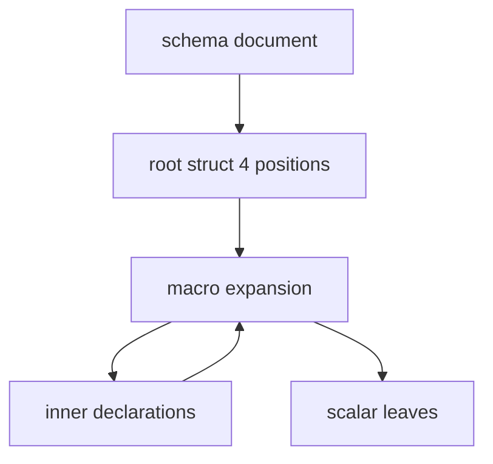
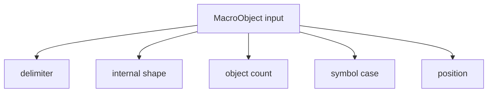

# 389 — Schema + macros canonical direction

*Kind: Design · Topic: schema, macros · 2026-05-27*

*Implementation-facing synthesis of the schema language as it stands
on operator main + the intent direction in records 894-942. The
schema is ONE recursive struct from root through macro-expanded
fields down to scalar leaves; the 4-position document IS a struct
with positional fields; macros are sugar with multiple match
criteria and a two-form enum body; scalars are the recursion floor.
Carries the load-bearing substance from reports 380, 387, 388
forward — those become candidates for retirement once their unique
detail has migrated.*

## What this report supersedes

Forward-only carries-substance from:

- `reports/designer/387-nota-schema-design-representation-2026-05-27.md`
  — 8 sections of side-by-side mermaid + tests. The substance about
  the 4-position document, pair-style namespace, two-layer macro
  registry, and colon-qualified names is the canonical reference for
  the schema language SHAPE; this report extends it with the
  *recursive struct* framing from record 940 and the *macros-as-sugar*
  framing from record 932.
- `reports/designer/388-macro-system-exploration-and-brace-enum-sugar-2026-05-27.md`
  — 8 match-criteria scenarios + brace-enum sugar impl on
  `designer-macro-system-exploration-2026-05-27`. The substance about
  match-criteria taxonomy and the brace-enum sugar shape is
  load-bearing; this report cites that branch as the
  implementation-ready piece.
- `reports/designer/380-bottom-up-tour-02-schema-macros-2026-05-27.md`
  — Layer-2 tour. The brace-as-key/value-map + dynamic-enum framing
  is now first-class in records 894/932/940; this report's framing
  carries it forward without the legacy "tour" framing.

The three predecessors can retire once their substance lands as
ARCHITECTURE.md edits in schema-next and the implementation
recommendations in this report play out. They stay until then because
they hold unique fixture detail (387's 8-section coding tour, 388's
match-criteria taxonomy in working tests, 380's layer-2 walk-through).

## Frame — the recursive struct

Per intent record 940 (Maximum, 2026-05-27): **the schema language
is ONE recursive shape**. A root-layer struct with macro-expanded
fields all the way down to scalar leaves. The same expansion
mechanism applies at every depth; nothing in the schema is
hand-wired beyond the root struct's positional fields and the
scalar floor.

The recursion has three layers:

1. **Root struct** (4 positional fields per record 933) — the
   document IS a struct. Position 0 is Imports, 1 is Input, 2 is
   Output, 3 is Namespace. Each field has a known type by position
   convention; the macro engine dispatches by position.
2. **Inner macro objects** — at each declarable position, NOTA
   objects (paren / brace / square / atom) match macro patterns and
   lower through expansion to either another macro object (recursion
   continues) or to a typed declaration.
3. **Scalar leaves** — the recursion floor. Per record 938: unit
   enums, booleans, integers, strings, vectors, typed-string
   newtypes. Strings are conceptually vectors of characters behind
   boxed string storage; domain concepts are typed beyond raw
   `String`.

The recursive shape is what makes the language extensible without
core changes — adding a new declaration shape adds a macro, not a
new lowering branch.

The cycle (macro_expansion → inner_objects → macro_expansion) is
the recursion. Each pass of macro expansion either continues with
new inner objects or terminates at a scalar leaf.

## The root struct — 4 positional fields

Per intent record 933 (Maximum): the schema document IS a struct.
The 4 root NOTA objects are positional fields with implicit names
from position:

| Position | Field | NOTA delimiter | Macro that dispatches |
|---|---|---|---|
| 0 | Imports | `{}` brace | `RootImportsMacro` |
| 1 | Input | `(Name (variants))` or struct | `RootEnumMacro::RootInput` |
| 2 | Output | `(Name (variants))` or struct | `RootEnumMacro::RootOutput` |
| 3 | Namespace | `{...}` brace | `RootNamespaceMacro` |

The macro engine doesn't care what the position is named — it
dispatches by the `MacroPosition` enum value passed alongside the
object. The name "Imports" lives in ARCHITECTURE.md prose and in
the schema's self-description (`schemas/root.schema`); the engine
sees only the position tag.

**Record 933's clarification**: Input and Output don't have to be
enums. If a component only receives one message kind, Input can be a
struct (`(Input [Field1 Field2])`). The macro engine dispatches on
shape. The author picks; the engine routes.

The current implementation in `src/engine.rs` only registers enum
dispatch at the Input/Output positions
(`RootEnumMacro::new("RootInput", ...)`). Extending to struct dispatch
requires a sibling Rust macro that matches struct-shaped input at the
same position — implementation pending.

Code anchor: `schema-next/src/engine.rs:236-253`
(`MacroRegistry::with_schema_defaults`).

## Macros are sugar — multiple match criteria

Per intent records 932 + 925: macros ARE the universal sugar
mechanism. Macros run on their objects at the positions they are
specified to fire. The engine supports MULTIPLE MATCH CRITERIA:

- **Delimiter** — paren / brace / square / pipe-text.
- **Internal shape** — what the contents look like.
- **Object count** — exact number of root objects.
- **Qualified-as-symbol** — PascalCase / kebab / camel atom.
- **Position binding** — slot in the schema.
- **Combinations** — AND across criteria.

The dispatch picks the most-specific match. The current
implementation (`MacroRegistry::lower` in `src/engine.rs`) uses
first-match-wins by registration order; the most-specific dispatch
is an open question — see §"Open questions" below.

The 8 match-criteria scenarios proved as working tests live in
`schema-next/tests/macro_exploration.rs` on
`designer-macro-system-exploration-2026-05-27`. Each test defines
a small `SchemaMacro` impl carrying one piece of state. The
canonical reference:
`reports/designer/388-macro-system-exploration-and-brace-enum-sugar-2026-05-27.md`
§"Test exploration — eight scenarios" — each scenario named with the
test it lives in.

## The two enum body forms

Per intent records 894 + 932 + 926: payload-carrying enum
declarations have two equivalent surface forms.

| Form | Surface | Example |
|---|---|---|
| Paren (canonical) | `((Name Payload) (Name Payload) ...)` | `(Input ((Record Entry) (Observe Query)))` |
| Brace (sugar) | `{Name Payload Name Payload ...}` | `(Input {Record Entry Observe Query})` |

The brace form is implemented as a macro — `SchemaEnumDefinitionBrace`
(declarative) + `BraceEnumVariantsMacro` (Rust pair-up). It
expands to the canonical paren form. Per record 926: positional brace
can omit explicit name when the surrounding schema position already
supplies the data type name and field name.

**Unit-variant enums stay paren-form** — no payload to pair with, so
brace sugar doesn't apply. `Kind (Decision Principle Correction)` has
no payload pairs; attempting `Kind {Decision Principle Correction}`
(odd count) errors loud with `ExpectedEvenBraceEnumPairs`.

The brace form is the dynamic-enum-as-key-value-map model from
record 894 made concrete: brace IS key/value at the NOTA layer; an
enum's variants are conceptually a key/value map (variant → payload).
The brace form makes that conceptual model the authored form.

The Asschema lowering is identical for both forms. The
`brace_enum_namespace_lowers_to_same_asschema_as_paren_form` test
on the designer branch asserts
`paren.namespace() == brace.namespace()`.

Code anchor: `schema-next/src/engine.rs:588-666`
(`BraceEnumVariantsMacro` + `BraceEnumVariantsBody`)
on `designer-macro-system-exploration-2026-05-27`.

## Scalar leaves — the recursion floor

Per intent record 938: schema scalars include:

| Scalar | NOTA form | Rust target |
|---|---|---|
| Unit enums | `(Variant1 Variant2)` | `enum { Variant1, Variant2 }` |
| Booleans | tba | `bool` |
| Integers | tba | `u64` (current); typed newtypes later |
| Strings | text atom or `[Text]` | `String` (current); typed string newtypes later |
| Vectors | `[Element]` | `Vec<T>` |
| Typed-string newtypes | `(Topic [Text])` | `pub struct Topic(pub String)` |

Strings are conceptually vectors of characters behind boxed string
storage. Domain concepts are typed beyond raw `String` — the current
emitter aliases `Text = String` and `Integer = u64` at the head of
every generated module; the schema-language move is to declare these
as typed scalars in the schema itself rather than emit aliases.

The recursion terminates here. A struct field whose reference is
`Text` doesn't expand further — the emission walks straight to the
scalar codec.

## What's on operator main vs designer-side

| Item | Operator main | Designer branch | Status |
|---|---|---|---|
| 4-position root struct (record 933) | landed (`cc05ecc`) | absorbed | done |
| Pair-style brace namespace (record 894) | landed (`8c821cb`) | branch carries ARCH prose only | rebased onto main as `designer-pair-style-namespace-2026-05-27` (7df5fa49); ARCH addition meaningful |
| Declarative macro engine + 4 declarative + 4 Rust macros (records 888-890) | landed (`d340433`) | absorbed | done |
| Single-colon namespace separator (records 895/902) | landed (`807c525`) | absorbed | done |
| `SchemaPackage::load_lib` (records 896-898/902) | landed (`807c525`) | absorbed | done |
| Schemas folder rename `schemas/` → `schema/` (record 902) | NOT landed | rebased on `designer-schema-namespace-and-folder-2026-05-27` (45693cac) | divergence — operator integration pending |
| Brace-enum sugar (records 894/932) | NOT landed | on `designer-macro-system-exploration-2026-05-27` (28df29ce) | divergence — operator integration pending |
| Match-criteria taxonomy as tests (record 932) | NOT landed | on `designer-macro-system-exploration-2026-05-27` (28df29ce) | divergence — operator integration pending |
| Methods-on-non-ZST + no-free-fns (records 712/882/884) | landed (Nix-enforced) | older `designer-no-free-fns` branch subsumed | retire branch |
| Design-illustrating tests (record 911/912) | landed (`d80767e`) | absorbed | done |
| StructureHeader in nota-next (records 927/933) | landed (nota-next `5e06304`) | not designer-side | operator's own move |

## What operator does next

Per record 942 (Constraint, 2026-05-27, High): before implementing
schema stack changes, the operator should inspect current designer
work for better design patterns and prefer elegant
logic-on-objects. The next operator steps follow that discipline:

1. **Integrate `designer-pair-style-namespace-2026-05-27`
   (7df5fa49).** The ARCHITECTURE.md prose update lands cleanly on
   main. The rebase is complete; the diff is 16+/4- on
   ARCHITECTURE.md. Brace-as-key/value-map and dynamic-enum framing
   become first-class in the architecture doc.
2. **Integrate `designer-schema-namespace-and-folder-2026-05-27`
   (45693cac).** Renames `schemas/` → `schema/`,
   `schemas/root.schema` → `schema/lib.schema`. Updates
   `include_str!` paths in `src/declarative.rs` + `tests/lowering.rs`.
   Adds a Nix `schema-folder-convention` check that asserts the new
   layout. This brings schema-next's own self-description into the
   crate-standard convention `SchemaPackage::load_lib` already
   expects.
3. **Integrate
   `designer-macro-system-exploration-2026-05-27` (28df29ce).**
   Adds `BraceEnumVariantsMacro` + `BraceEnumVariantsBody` to
   `src/engine.rs`, adds `SchemaEnumDefinitionBrace` to
   `schemas/builtin-macros.schema`, adds 8 match-criteria scenarios
   in `tests/macro_exploration.rs`, adds 4 brace-sugar equivalence
   tests in `tests/lowering.rs`. Net: +12 tests, +95 lines in
   engine.rs, +4 lines in builtin-macros.schema. Brings record 932's
   two-enum-form sugar to operator main.
4. **Retire the spent branches** —
   `designer-design-examples-2026-05-27`,
   `designer-emit-to-src-schema-2026-05-27` (both repos),
   `designer-no-free-fns-2026-05-27` (both repos). Substance is on
   main (sometimes via a different code path with the same outcome).

After (2) and (3) land, schema-next gets the canonical schema-folder
convention + brace-enum sugar that records 894/902/932 mandate.

## Open questions

1. **Most-specific match vs first-match-wins.** Record 932 says
   multiple matches dispatch on the most-specific match. The current
   `MacroRegistry::lower` returns the first match. Implementing
   most-specific requires a specificity ranking — how do we order
   delimiter+shape+count+qualification combinations? Lexicographic on
   the criterion set? Count of criteria (more-matched = more
   specific)? Position-pinned beats delimiter-only? Brace-enum sugar
   happens to work under first-match-wins because
   `BraceEnumVariantsMacro` is registered before any wider-matching
   macro at EnumVariants. If a future macro accepts brace input MORE
   loosely, registration order matters — fragile.

2. **Schema-authored self-description as load-bearing.** Per record
   886 (Maximum): the schema file that defines how to read schema
   files is required as a tested artifact — it does not have to be
   load-bearing for the reader yet. After the schema-folder rename
   (step 2 above), `schema/lib.schema` IS the schema's
   self-description; the lowering test asserts the root Schema fields
   and nested declaration types. Future move: make the engine
   actually read this file at bootstrap, not just test that it
   lowers.

3. **Built-in core schema before full self-description (record
   887, Medium).** The core schema is not the full communication
   schema; it defines the minimal built-in macro positions and
   shapes. `schema/core.schema` (post-rename) exists but is not
   load-bearing. Open: when does the engine start reading core.schema
   at startup vs hard-coding the 7 positions?

4. **Cross-cutting capture sigil for pair-aligned captures.** The
   current capture sigils are `$Name` (single) and `$*Fields` (rest).
   Adding a `$**PairCapture` to mean "capture rest as pairs of two"
   would let the brace-enum sugar be EXPRESSED PURELY DECLARATIVELY
   — no Rust `BraceEnumVariantsMacro` needed. Per report 388
   §"Open questions" — future work, low priority.

5. **Built-in scalar types vs declared scalar types.** The emitter
   aliases `Text = String` and `Integer = u64` at the head of every
   module. Record 938 says strings are conceptually vectors of
   characters; record 942 says behavior should live on schema-created
   types. Open: should `Text` and `Integer` be schema declarations
   in `schema/core.schema` rather than emission-time aliases?

## Verification anchors

| Claim | Source |
|---|---|
| 4-position document | `schema-next/src/engine.rs:140-180` (`lower_document_with_context`) |
| Recursive macro expansion | `schema-next/src/declarative.rs:587-606` (`ExpandedTemplate::lower_to_output`) |
| Pair-style namespace | `schema-next/src/engine.rs:396-462` (`NamespaceBlock`) |
| Brace-enum sugar (designer branch) | `schema-next/src/engine.rs:588-666` (`BraceEnumVariantsMacro`) on `designer-macro-system-exploration-2026-05-27` |
| Two-layer macro registry | `schema-next/src/engine.rs:236-253` (`MacroRegistry::with_schema_defaults`) |
| Match-criteria scenarios | `schema-next/tests/macro_exploration.rs` on `designer-macro-system-exploration-2026-05-27` |
| Schema-folder convention pending | `~/wt/.../designer-schema-namespace-and-folder-2026-05-27` (45693cac) |
| ARCHITECTURE.md prose update pending | `~/wt/.../designer-pair-style-namespace-2026-05-27` (7df5fa49) |

## Cross-references

- Report 387 (8-section side-by-side mermaid + tests) — canonical
  reference for the schema language SHAPE.
- Report 388 (macro-system exploration + brace-enum sugar) —
  canonical reference for match-criteria taxonomy and the brace-enum
  sugar implementation.
- Report 380 (Layer-2 schema-macros tour) — earlier framing, now
  carried forward.
- Operator/217 (design improvement research) — names the same
  next refactor targets (schemas/ rename, package loader, macro
  specificity dispatch).
- Intent records 894, 925-927, 932-933, 936-938, 940, 942 — the
  source of truth for this report's framing.
