# Session handover — 2026-05-08

Status: handover for context compaction
Author: Claude (designer)

End-of-session snapshot. The design arc settled enough that
the next move is operator implementation. This handover
captures what's load-bearing for the next session (mine or
another agent's) without re-litigating settled decisions.

---

## 0 · One-paragraph state

The Tier 0 nexus grammar is locked at 12 token variants
(`( ) [ ] @ : ident bool int uint float str bytes`). The 12
canonical Request verbs are settled (Assert / Mutate /
Retract / Match / Subscribe / Validate / Aggregate / Project
/ Constrain / Recurse / Infer / Atomic). The repo split is
agreed (`signal-core` kernel + `signal` Criome contract +
`signal-persona` Persona contract + `signal-forge` layered;
`sema` reusable substrate; `persona-store` instance). The
8-step execution sequence is in operator/37. Operator has
already created `signal-core`, indexed it, and started on
the Tier 0 example file (which has corrections per
designer/38). Six open questions remain (designer/38 §9) —
implicit-assert shorthand, slot-binding reply shape, etc.
None block the next code commit; all are user's call when
encountered.

---

## 1 · The settled arc, in one chain

```mermaid
flowchart LR
    pivot["21 — Persona on nexus<br/>(drop invented protocol)"]
    state["22 — state of nexus"]
    min["23 — Tier 0 structural minimum"]
    survey["24 — vs SQL / Datalog / Cypher / SPARQL / GraphQL / MongoDB"]
    deep["25 — what database languages are really for"]
    verbs["26 — 12 verbs as zodiac"]
    grammar_lock["31 — { } dropped permanently"]
    explain["38 — Tier 0 grammar explained (current reference)"]

    pivot --> state --> min --> survey --> deep --> verbs --> grammar_lock --> explain
```

Each report is ~400–900 lines; together they trace the
design from "Persona invents its own protocol" to "Persona is
a typed-record domain over the nexus protocol" to "the
nexus grammar is just records + sequences + `@`."

---

## 2 · Designer reports — what's kept, what they're for

After the cleanup pass in this session (11 stale reports
deleted), 12 designer reports remain — at the soft cap per
`skills/reporting.md` §"Hygiene":

| # | Report | Why it stays |
|---|---|---|
| 4 | persona-messaging-design | Foundational destination architecture — reducer + planes shape |
| 12 | no-polling-delivery-design | Push-not-pull substrate; subscription-contract foundation |
| 14 | persona-orchestrate-design | Workspace-coordination component (different from intra-daemon DB owner); maps to bead `primary-jwi` |
| 19 | persona-parallel-development | Per-component repos + CLIs + stores → unified Sema; testing pyramid |
| 21 | persona-on-nexus | The pivot decision — Persona uses nexus rather than inventing a custom protocol |
| 22 | nexus-state-of-the-language | Audit that started the nexus arc |
| 23 | nexus-structural-minimum | Tier 0 picked over Tier 1 |
| 24 | nexus-among-database-languages | Comparative survey (SQL / Datalog / Cypher / SPARQL / GraphQL / MongoDB) |
| 25 | what-database-languages-are-really-for | Sowa + Spivak synthesis; intension/extension framework |
| 26 | twelve-verbs-as-zodiac | The 12-verb closed Request enum scaffold |
| 31 | curly-brackets-drop-permanently | Final grammar lock at 12 tokens; "delimiters earn their place" |
| 38 | nexus-tier-0-grammar-explained | Current canonical grammar reference (operator-facing) |

Deleted in this session's cleanup (11 reports — substance
absorbed by successors or migrated to skills/ESSENCE):
9, 13, 15, 16, 17, 18, 20, 27, 28, 32, 35.

---

## 3 · Workspace skill substance landed this session

| Skill | Section added | Source |
|---|---|---|
| `ESSENCE.md` | §"Rules find their level" — every observation belongs at a specific level | early in session |
| `ESSENCE.md` | §"Report state truthfully" — when asked about prior actions, answer about prior, not just-now | mid-session correction |
| `skills/architecture-editor.md` | (created) parallel to skill-editor; how to write per-repo and meta `ARCHITECTURE.md` | early in session |
| `skills/library.md` | (created) workspace research library + `annas` CLI; when to consult vs. when not | mid-session |
| `skills/contract-repo.md` | (created) contract-repo pattern; signal as worked example; layered effect crates; naming hierarchy `signal-<consumer>` (layered prefix) vs. `<project>-signal` (independent) |
| `skills/contract-repo.md` | §"Kernel extraction trigger" — extract when 2+ domain consumers share a kernel |
| `skills/contract-repo.md` | §"Examples-first round-trip discipline" — text example before Rust definition; round-trip test before any other test |
| `skills/language-design.md` | §18 "Delimiters earn their place" — cosmetic distinctions and verb-shaped uses don't qualify |
| `skills/rust-discipline.md` | §"redb + rkyv — durable state and binary wire" + "signaling" verb terminology; rkyv discipline |
| `skills/rust-discipline.md` | New §"Persistent state — redb + rkyv" |
| `skills/jj.md` | §"`jj describe @` is forbidden" — canonical commit form is `jj commit -m`; describe @- is for editing already-committed messages |
| `skills/jj.md` | §"Before you commit" — read jj st output when it appears; pragmatic note that occasional bundling isn't catastrophic |
| `skills/reporting.md` | §"Inline-summary rule" — every external section reference carries a one-line summary so the reader can follow without chasing |
| `skills/reporting.md` | Workspace-wide numbering rule — N is one above the highest across every role subdirectory (not per-role) |
| `skills/skill-editor.md` | §"What goes in a workspace skill" — component-specific patterns belong in repo skills.md, not primary |
| `skills/autonomous-agent.md` | §"Required reading before applying this skill" — checkpoint reads of orchestration / jj / repository-management / reporting / skill-editor |
| `AGENTS.md` | Required-reading list expanded with jj + repository-management |

The `~/primary/.gitignore` got the four role lock files
added; the locks are runtime coordination state, not history.

---

## 4 · Operator's current state

| Repo | Status |
|---|---|
| `signal-core` | Created and pushed; Frame + handshake + auth scaffold; needs `Slot<T>` + `Revision` typed identity records before domain rebases |
| `signal` (criome contract) | Existing; awaits rebase on `signal-core` — drop duplicated frame/handshake/auth |
| `signal-persona` | Existing scaffold with discipline gaps per old bead `primary-tss`; awaits rebase on `signal-core` and rewrite as record-vocabulary-only (no custom verbs) |
| `signal-forge` | Existing layered crate; needs to add direct dependency on `signal-core` |
| `sema` | Existing repo; needs reorientation as reusable substrate (per operator/37 §8: ARCHITECTURE rewrite + skills.md + public substrate API) |
| `persona-store` | Persona's Sema instance (renamed from `persona-orchestrate` per audit lineage); awaits implementation after signal-persona rebases |
| `nexus` | Spec stays; current daemon stays Criome-specific in M0 (per operator/37 §6); first work: lock Tier 0 examples per designer/38 |
| `nota-codec` | Existing `@` token + `PatternField<T>` work to validate and finish (per operator/37 step C) |
| `persona-message` | Held; rebase as Nexus/Sema client only after `signal-persona` is right |
| `chroma` | New repo created by system-specialist (unified visual daemon, supersedes ignis report 3) |
| `persona-orchestrate` | Reserved for the workspace-coordination component (bead `primary-jwi`); not yet built |

The 8-step operator execution sequence is in operator/37 §5
(A: signal-core identity types → B: Nexus Tier 0 examples →
C: nota-codec audit → D/E/F: rebase signal/signal-persona/
signal-forge → G: sema architecture → H: sema substrate
skeleton → I: implementation report).

---

## 5 · Open questions on operator's plate

From designer/38 §9 — answers will lock the Tier 0 spec text
when operator updates `nexus/spec/grammar.md`:

1. **Implicit-assert shorthand?** Does bare `(Node User)` at
   top-level mean `(Assert (Node User))`, or must the
   wrapper be explicit? Designer's lean: explicit wrapping;
   user's call.
2. **Reply slot-binding shape?** When `Match` returns
   records, do they carry their slots? Designer's lean:
   typed `SlotBinding<T>` pair record.
3. **`(Slot 100)` vs bare `100` in Mutate/Retract?**
   Designer's lean: bare integer (matching signal's existing
   `NotaTransparent` newtype).
4. **`*Query` naming convention.** Confirm.
5. **`_` wildcard pattern-only.** Confirm.
6. **Top-level dispatch under Option B.** Only relevant if
   user picks implicit-assert.

None block the next commit; all surface naturally when
operator writes example-record tests.

---

## 6 · Open beads at handover

| Bead | Owner | Priority | What |
|---|---|---|---|
| `primary-77l` | system-specialist | P1 | Migrate `~/git` to ghq `/git/...` layout |
| `primary-l06` | (any) | P2 | Skill rule: don't prefix type names with crate name |
| `primary-tss` | operator | P2 | Strengthen / rebase `signal-persona` per the design arc |
| `primary-byz` | (any agent, incremental) | P2 | Add `ARCHITECTURE.md` to every repo missing one |
| `primary-8b6` | system-specialist | P2 | Decouple dark theme + warm screen |
| `primary-bmy` | (any agent, incremental) | P2 | Add `skills.md` to every repo missing one |
| `primary-uea` | (any) | P3 | Design `signal-network` for cross-machine signaling |
| `primary-jwi` | operator | P3 | Harden orchestration helper into `persona-orchestrate` typed component (per designer/14) |

No designer-actionable beads remain blocking — the design arc
is in implementation territory. Designer's natural next role
is critique of operator's implementation reports as they
land.

---

## 7 · Things to know going forward

1. **Tier 0 grammar is locked.** 12 tokens. No `{ }`, no
   piped delimiters, no verb sigils. Three full reports
   (designer/22, 23, 31) and one explainer (38) cover the
   reasoning.
2. **`jj describe @` is forbidden.** Use `jj commit -m`.
   `jj describe @-` is OK for editing already-committed
   descriptions. (skills/jj.md §"`jj describe @` is forbidden")
3. **Skills in primary are workspace-general.** Component-
   specific patterns belong in repo skills.md. (skill-editor.md
   §"What goes in a workspace skill")
4. **Reports cite with inline summary.** Naming a path is
   not enough; one-line summary of the substance must
   accompany every external reference. (reporting.md
   §"Inline-summary rule")
5. **State questions get state answers.** "Have you read X?"
   means "before now." (ESSENCE §"Report state truthfully")
6. **Workspace numbering is unified.** Reports across all
   role subdirs share one ascending sequence. (reporting.md
   §"Filename convention")
7. **Operator has integrated every refinement** through
   operator/37. The plan is concrete; the next move is code.
8. **The chain of critiques (designer/27, 28, 32, 35) is
   now history.** Substance migrated; reports deleted in
   this session's cleanup. Future critiques follow the same
   pattern: critique operator's report, operator integrates,
   critique gets retired.
9. **`jj describe @` = bundled-peer-files mistake.** I made
   this error multiple times this session. The skill update
   should make the canonical `jj commit` flow harder to
   skip.
10. **Library is at `~/Criopolis/library/`** with `annas`
    CLI for adding books. `skills/library.md` documents.

---

## 8 · Where each piece of substance now lives

For an agent picking up cold:

| If you want to know… | Read |
|---|---|
| Workspace intent | `~/primary/ESSENCE.md` |
| Apex agent contract | `~/primary/AGENTS.md` |
| Role coordination | `~/primary/protocols/orchestration.md` |
| How to act autonomously | `~/primary/skills/autonomous-agent.md` |
| How to write reports | `~/primary/skills/reporting.md` |
| How to commit / push | `~/primary/skills/jj.md` |
| Rust discipline (incl. redb + rkyv) | `~/primary/skills/rust-discipline.md` |
| Contract repos | `~/primary/skills/contract-repo.md` |
| Language design | `~/primary/skills/language-design.md` |
| Library use | `~/primary/skills/library.md` |
| Architecture docs | `~/primary/skills/architecture-editor.md` |
| Skill writing | `~/primary/skills/skill-editor.md` |
| Push-not-pull | `~/primary/skills/push-not-pull.md` (with §"Subscription contract") |
| Repo creation / gh | `~/primary/skills/repository-management.md` |
| Open beads | `bd list --status open --flat --no-pager` |
| Lock state | `~/primary/tools/orchestrate status` |
| Persona stack design | designer/4 + designer/19 + designer/21 |
| Nexus grammar (current) | designer/38 (canonical reference) |
| Verb scaffold | designer/26 §8 |
| Tier 0 token vocabulary | designer/31 §5 |
| Why each construct exists / was dropped | designer/22 + designer/24 + designer/25 + designer/31 |

---

## 9 · The pattern of failures this session worth remembering

1. **Bundling peer commits via `jj describe @`** — happened
   multiple times. Now forbidden in jj.md.
2. **Treating "have you read X" as "go read X"** — caught
   by user once; now in ESSENCE.
3. **Slipping into "design as programming language"** —
   caught when I proposed `(| ... |) { @h }` projection,
   then again when proposing `{ }` as schema-declaration
   syntax. Resolved as principle: delimiters define
   structure; head idents define meaning.
4. **Adding workspace skills for component-specific
   patterns** — `llm-resilience.md` was deleted; lesson
   landed in skill-editor.md.
5. **Citing report sections without inline summary** —
   user noted; rule landed in reporting.md.
6. **Reaching to use empty things** (delimiters, sigils,
   skill files) instead of asking whether they earn their
   place — captured implicitly in §"Delimiters earn their
   place" and §"What goes in a workspace skill."

---

## 10 · Closing

The design arc 4 → 38 traces a substantial intellectual
exploration: from inventing a Persona protocol to recognizing
nexus as the universal answer; from set literals to dropping
the curly bracket entirely; from sigil-laden verbs to
record-shaped verbs. Operator is implementing; the bottleneck
is no longer architecture.

Designer state at handover: idle. No outstanding designer
work. Reports trimmed to 12. Skill discipline updated. Open
questions handed to operator (designer/38 §9). Critique
chain retired.

Designer releasing.

---

## 11 · See also

- `~/primary/AGENTS.md` — required-reading list
- `~/primary/protocols/orchestration.md` — coordination
- `~/primary/skills/reporting.md` — reporting discipline
  (numbering, inline summaries, hygiene)
- `~/primary/reports/operator/37-sema-signal-nexus-execution-plan.md`
  — operator's current 8-step plan; the implementation
  contract for the next pass
- designer/4, 12, 14, 19, 21, 22, 23, 24, 25, 26, 31, 38 —
  the surviving design arc

---

*End report.*
