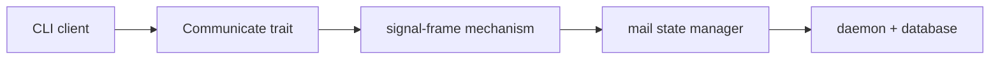
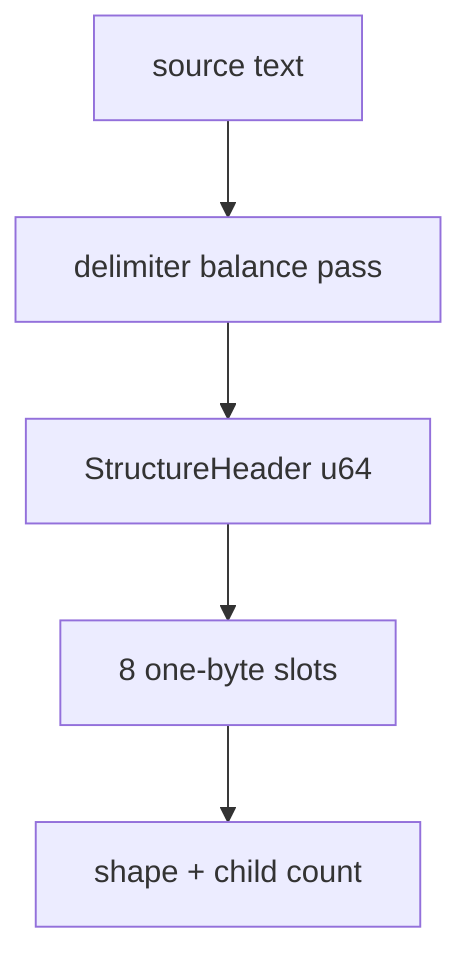
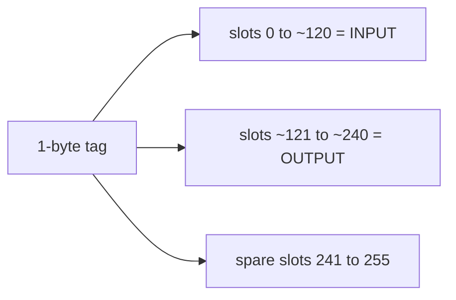
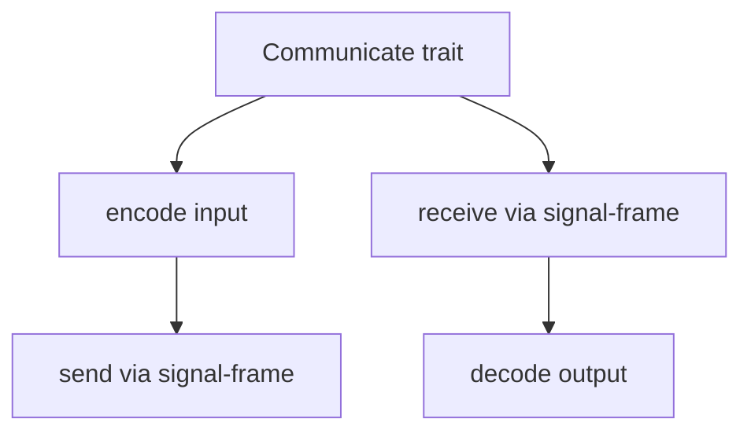
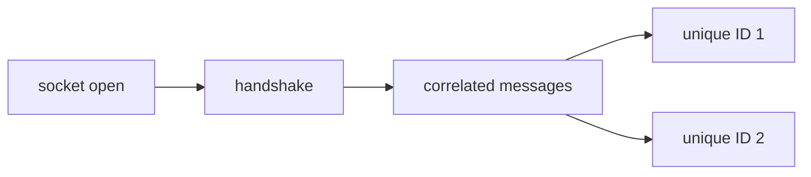
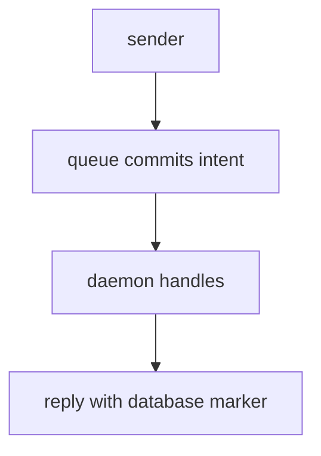
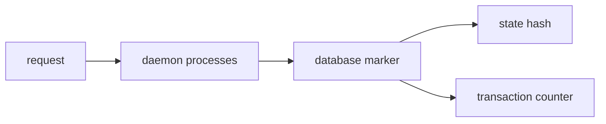

# 390 — Wire + runtime canonical direction

*Kind: Design · Topic: wire, runtime · 2026-05-27*

*Implementation-facing design for the wire layer + component-runtime
substrate per intent records 927-936. The 2-level structural
fingerprint IS the 64-bit textual header; input + output are
PARTITIONS of one 1-byte tag space; the Communicate trait + signal-
frame mechanism + mail state manager + database marker reply
together support full async messaging with provable state evolution.
Nothing in this report exists in operator code yet — it's the
design direction for the next implementation slice.*

## What this report supersedes

No predecessor. The wire + runtime substrate is new design ground;
prior reports touched adjacent concerns (e.g. 387 covered the
Asschema lowering output, 388 deferred record 935 as "out of
scope"). This report carries forward the deferred substance from
388 §"Deferred — record 935's architectural sweep" and adds the
structural-fingerprint framing from record 933 and the tag-space
partition from record 934.

The implementation in `schema-rust-next/src/lib.rs` currently emits
a `SignalFrameError`, route enums, short headers, encode/decode
methods — operator's `5ca1c96` lands these as schema-derived. That's
the EXISTING wire surface; this report describes the NEXT design
layer underneath it.

## Frame — three coupled mechanisms

The wire + runtime work involves three coupled mechanisms that
together carry async messaging from CLI through daemon to durable
state:

- **Communicate trait** — the abstract wire interface between any
  two components. The CLI and daemon both implement it; it's their
  shared protocol surface.
- **Signal-frame mechanism** — provides connection setup, async
  unique IDs for request-reply correlation, and connection handshake
  for initialization. The implementation lives in the `signal-frame`
  repo.
- **Mail state manager** — queues messages between sender and
  daemon receiver. Mail accepted into the queue is as-good-as-fed-in
  because the queue commits intent to process. The reply confirms
  processing has occurred AND carries the database marker.

Per record 935 (High): together these support full async messaging
with provable state evolution.

## The 2-level structural fingerprint = 64-bit header

Per intent records 927 + 933 (High / Maximum): NOTA + schema
parsing begins with a delimiter-balance and object-block pass that
marks delimiter spans and exposes enough first and second level
structure to act like a TEXTUAL 64-bit header for fast structural
triage.

The same concept as runtime message headers, but applied to text
objects. Operator's `nota-next/5e06304` lands this on main:

| Layer | Type | Storage |
|---|---|---|
| Header | `StructureHeader` | 8 one-byte slots packed in a `u64` |
| Slot | `StructureSlot` | shape code (4 bits) + child count (4 bits) |
| Shape | `StructureShape` | Document / Atom / Paren / Square / Brace / PipeText / Unknown |

The header is computed once during parsing — no extra walk. The
schema engine can record it in `MacroContext` and tests can assert
the schema layer consumes the first-pass structural shape. Operator's
ARCHITECTURE.md addition (uncommitted on main as of audit) names
this:
> `SchemaEngine` records the document's `StructureHeader`: a compact
> first-two-level witness emitted by the NOTA delimiter pass.

Code anchor: `nota-next/src/parser.rs:243-409` (`StructureHeader` +
`StructureHeaderBuilder`).

**Design question**: the header currently caps at 8 slots, child
count at 15. The 8-slot cap matches a u64; the 15 cap matches a
4-bit child count. Document root + 2 child levels typically fit; a
deeply nested or wide structure exceeds both. The header is for
FAST TRIAGE — full structural inspection still walks the AST. The
cap is fit-for-purpose.

## Input + Output = partition of one tag space

Per intent record 934 (Maximum): Input and Output are PARTITIONS
of a single enum tag space. At the wire level they share one byte
of tag namespace, with ranges reserved for each direction.

A 1-byte enum carrying ~240 usable slots splits approximately
two-thirds: first ~120 reserved for INPUT variants, slots ~121-240
reserved for OUTPUT variants. The specific 120/120 split is
illustrative not locked — larger enums get larger spaces.

The schema author declares Input and Output separately at the
schema level; the rkyv-compiled binary form merges them into one
tag space. The first byte at the wire layer tells you immediately
whether to dispatch on input handlers or output handlers based on
which range the tag falls in.

**Concrete layout proposal** (illustrative; the schema engine emits
the canonical assignment per crate):

| Byte range | Direction | Use |
|---|---|---|
| `0x00`-`0x77` (120 slots) | Input | Request-like variants (Record, Observe, etc.) |
| `0x78`-`0xEF` (120 slots) | Output | Response-like variants (RecordAccepted, RecordsObserved, etc.) |
| `0xF0`-`0xFF` (16 slots) | Reserved | Future signaling, control codes |

The current emitter packs the route via `((root_index as u64) <<
56) | ((variant_index as u64) << 48)` — that's 16 bits for the
route (8 bits root + 8 bits variant), not the 1-byte partition.
**Implementation gap**: the emitter is NOT yet using the
tag-space-partition layout from record 934. The next emission pass
needs to:

1. Merge Input + Output variants into one numbering space across
   the two root enums.
2. Reserve the range split at emission time.
3. Emit the wire-byte assignment as a constant table.
4. The runtime can dispatch from one byte to either handler set.

Code anchor: `schema-rust-next/src/lib.rs:475-489`
(`emit_short_headers`) — the current 16-bit short header form, not
yet the 1-byte partition.

## The Communicate trait

Per intent record 935 (High): Communicate is its own TRAIT — the
wire interface used between any two components like CLI and daemon.
Implementations use binary rkyv format with the signal-frame
mechanism. The trait is abstract; concrete implementations carry
the transport (Unix socket, TCP, in-process).

**Design sketch** (not yet implemented):

The schema-emitted Input/Output types carry their own
encode/decode methods (the current `encode_signal_frame` /
`decode_signal_frame` on root enums); the Communicate trait
abstracts the round-trip pattern that CLI and daemon both use:

- **Client side**: encode Input → send → wait for Output → decode → return.
- **Daemon side**: receive → decode Input → handle → encode Output → send.

Per record 929 (High): component communication SHOULD use the
schema-defined binary RKYV signal-frame representation between CLI
client and daemon, NOT treat NOTA as the inter-component wire
format. NOTA is the AUTHORING layer (what humans type); the wire
is the COMPILED layer (what bytes travel).

Implementation status: nothing yet. The Communicate trait does not
exist in `schema-rust-next` or `signal-frame` repos. Operator's
schema-rust-next emits per-enum encode/decode but no abstract trait.

## Signal-frame mechanism

Per intent record 935 (High): the signal-frame mechanism provides:

| Concern | Mechanism |
|---|---|
| Connection setup | initial handshake at socket open |
| Async unique IDs | request-reply correlation across pipelined messages |
| Connection handshake | initialization to confirm protocol version + identity |

The signal-frame repo (currently has its own legacy macro
infrastructure per the schema-derived migration) is the natural
home. Per intent record 860 (Maximum, prior): signal-frame protocol
belongs in the existing `signal-frame` repository as schema-derived
substrate.

Implementation status: the legacy `signal-frame` infrastructure
exists; the schema-derived rewrite is pending. The current
schema-rust-next emits frame primitives LOCALLY in every generated
module. The migration path:

1. Define `signal-frame/schema/lib.schema` with the frame primitive
   types (FrameHeader, MessageId, HandshakeRequest, HandshakeReply).
2. Make consumer crates import via the same colon-path mechanism
   the schema language uses.
3. Remove the locally-emitted frame support from each generated
   module.

Per operator/217 §"Highest-value Nix tests": a
`signal-frame-schema-imported-by-spirit` test should reject local
duplicate frame primitive declarations once the import exists.

## Mail state manager

Per intent records 930 + 935 (High): persona components need a
reusable ASYNCHRONOUS mail state manager with:

- Unique message identifiers.
- Handshake semantics.
- Response correlation.
- Database state markers in replies.

The mail-queue contract: **mail accepted into the queue is
as-good-as-fed-in because the queue commits intent to process**.
The reply confirms processing has occurred. The asynchronous
nature means callers don't block on each message; the unique ID
lets them correlate replies to original requests.

**Crucial invariant**: the sender knows the message will be
processed once it's in the queue. The reply doesn't say "I
received it" — it says "I processed it; here's what changed".

Implementation status: nothing yet. Operator's spirit-next uses a
synchronous in-process Engine with `Vec<StoredRecord>` behind a
`Mutex`. The async mail-state manager is a substantial new
component — likely a new repo (`persona-mail` or similar) per
record 935.

## Database marker reply

Per intent record 935 (High): the reply carries a DATABASE MARKER —
hash plus counter — so the client can verify which transaction the
response corresponds to and guarantee local state consistency.

The hash plus counter pair gives clients a strong local-state
guarantee tied to the daemon's authoritative database state. The
async unique ID system plus database marker reply together support
full async messaging with provable state evolution.

**Concrete layout proposal** (illustrative):

| Field | Type | Use |
|---|---|---|
| `transaction_counter` | `u64` | Monotonic counter; client compares to last-seen |
| `state_hash` | `[u8; 32]` | Blake3 hash of the database content at this transaction |

Per intent record 942: behavior should live on schema-created
types. So `DatabaseMarker` is itself a schema declaration with
methods on the generated struct — not free helper functions.

Implementation status: nothing yet. Spirit's current store has no
counter or hash; transactions just append.

## Implementation status — nothing operator built yet vs design direction

| Item | Operator status | Design direction |
|---|---|---|
| StructureHeader (2-level fingerprint) | landed in nota-next `5e06304` | record 933 — 64-bit text header |
| `SignalFrameError` + route enums + encode/decode | landed in schema-rust-next `9984703` (`emit schema-derived signal frame surface`) | record 935 — but as schema-derived per-enum, not abstract trait |
| Short header constants | landed in schema-rust-next | NOT yet the 1-byte partition (record 934); current is 16-bit |
| Communicate trait | NOT landed | record 935 — abstract trait used by CLI and daemon |
| Signal-frame mechanism (schema-derived rewrite) | NOT landed | record 860/935 — schema-derived in `signal-frame` repo |
| Mail state manager | NOT landed | record 930/935 — async queue + unique IDs |
| Database marker reply (hash + counter) | NOT landed | record 935 — state-evolution proof |
| Spirit redb persistence | NOT landed (in-memory) | operator/217 §6 — required for production |

## What operator does next

The wire/runtime layer doesn't fit into a single integrate-this-branch
move because most of it doesn't exist as code anywhere yet. The
implementation sequence:

1. **Land the 1-byte partition emission** (record 934).
   `schema-rust-next/src/lib.rs:475-489` emits 16-bit short headers
   today; the next pass merges Input + Output variants into one
   numbering space and emits the byte assignments as a constant
   table. Validates against decode: decoding a frame whose first
   byte falls in the Input range routes to InputRoute; output range
   routes to OutputRoute.
2. **Define the Communicate trait** (record 935). A small abstract
   trait in `schema-rust-next` or `signal-frame` with the round-trip
   shape. The trait is method signatures only; concrete impls live
   per-transport (Unix socket, TCP).
3. **Begin the signal-frame schema-derived rewrite** (records 860 +
   935). Add `signal-frame/schema/lib.schema` with FrameHeader,
   MessageId, HandshakeRequest, HandshakeReply types. Generate the
   Rust via the schema-rust-next emitter. Migrate the existing
   signal-frame macro consumers to use the new types.
4. **Spec the mail state manager** as a new component (record 930).
   Likely lands in its own repo. Carries the async queue + unique
   IDs + handshake.
5. **Add database marker reply** to the schema declarations (record
   935). Define `DatabaseMarker` in schema-next's bootstrap (or
   per-component); include it as a payload field in every reply
   enum variant.

These are operator-scoped work; designer's role is the
boundary-shape ARCHITECTURE.md edits + the typed contract shapes,
which are now captured in this report.

## Open questions

1. **Trait location.** Communicate as a schema-emitted trait per
   Input/Output enum vs a hand-written trait in `signal-frame` that
   the generated types implement? The former is more uniform; the
   latter is more flexible (transports can implement Communicate
   for arbitrary types, not just schema-emitted).

2. **Partition split granularity.** Is the 120/120 split fixed per
   enum, or per crate, or schema-author-configurable? Larger Inputs
   could starve Outputs of byte slots; smaller Inputs leave slots
   stranded.

3. **Database marker carrier.** Every reply carries the marker, or
   only specific replies? Hash-only on read-only, hash+counter on
   write?

4. **Mail-queue durability.** In-process queue (lose on daemon
   restart) vs disk-backed (durable across restarts)? Either way,
   the `accepted = will-be-processed` invariant holds, but the
   recovery story differs.

5. **Signal-frame backward compatibility.** The existing
   signal-frame macro infrastructure has live consumers in
   persona-* repos. The schema-derived rewrite is a wholesale
   replacement — what's the cutover sequence?

## Verification anchors

| Claim | Source |
|---|---|
| StructureHeader is on nota-next main | `nota-next/src/parser.rs:243-409` (`5e06304`) |
| Current emitter emits 16-bit short headers (not 1-byte partition) | `schema-rust-next/src/lib.rs:475-489` (`5ca1c96`) |
| Current emitter emits SignalFrameError + encode/decode | `schema-rust-next/src/lib.rs:491-637` |
| Spirit transport is in-memory | `spirit-next/src/store.rs` (no redb yet) |
| Communicate trait not yet implemented | grep `Communicate` in operator main returns nothing |
| Mail state manager not yet implemented | no `persona-mail` repo exists |
| Database marker not yet implemented | no `DatabaseMarker` type in any schema |

## Cross-references

- Report 388 §"Deferred — record 935's architectural sweep" —
  earlier flagging of these items as deferred.
- Report 389 (schema + macros canonical direction) — the upstream
  language layer feeding wire concerns.
- Operator/217 §"Gaps and wrong turns to correct" items 5-9 — the
  same gap-list from the operator side.
- Intent records 927, 929-931, 934-935 — the source of truth for
  this report's framing.
