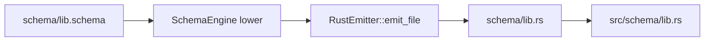
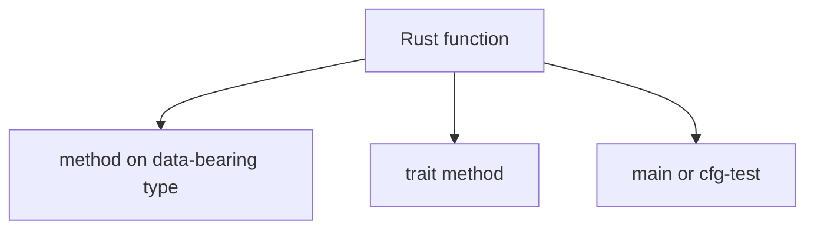
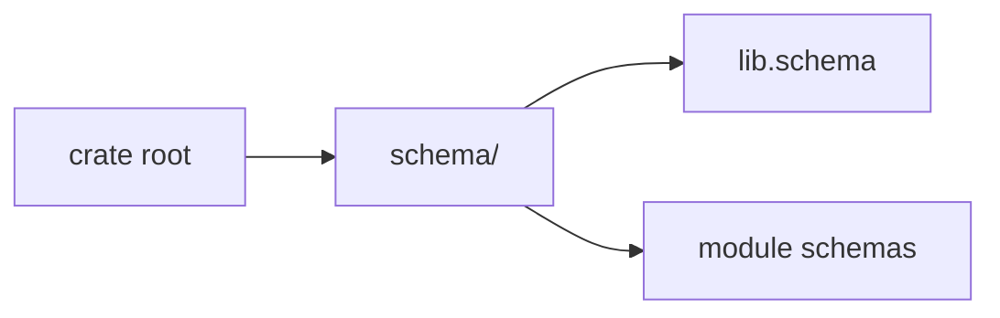

# 391 — Emission + discipline direction

*Kind: Design · Topic: emission, discipline · 2026-05-27*

*Emission target + Rust-discipline status for the schema-derived
stack as it stands on operator main. `src/schema/` is locked; the
no-free-fns + methods-on-non-ZST discipline is Nix-enforced; report
visuals follow short-focused-graphs per record 912. This is a
smaller companion to reports 389 (schema/macros) and 390
(wire/runtime).*

## What this report supersedes

Forward-only carries-substance from:

- `reports/designer/384-emit-to-src-schema-2026-05-27.md` — names
  the src/schema target. Substance has landed on operator main
  (`spirit-next` `0296be2` materializes generated schema source);
  predecessor retires once this report serves as the canonical
  reference.
- `reports/designer/379-rust-method-rule-audit-and-fix-2026-05-27.md`
  — audits the methods-on-non-ZST rule landing. The Nix-enforced
  checks are now in place across `schema-next`, `schema-rust-next`,
  and `nota-next`; the audit substance is durable in the Nix checks
  themselves; predecessor retires.

## The src/schema target — locked

Per intent records 909 + 910 (Maximum, 2026-05-27): schema-derived
Rust code emits to `src/schema/lib.rs` and `src/schema/[module].rs`
in the crate source tree — NOT to `OUT_DIR/schema`. This is the
load-bearing choice for visibility and grep-ability: schema-derived
Rust lives alongside hand-written Rust in the same `src` directory.



The emitter computes a `GeneratedFile { path: "schema/lib.rs" }`;
the spirit-next `build.rs` joins it to `src/` to produce the
checked-in target `src/schema/lib.rs`. Operator's `5ca1c96` lands
the path mechanism; `0296be2` materializes the generated file in
spirit-next's tree.

**Build invariants**:

1. `build.rs` parses `schema/lib.schema` and runs it through
   `SchemaEngine::default().lower_source_with_context`.
2. The lowered Asschema goes through `RustEmitter::emit_file` to
   produce a `GeneratedFile { path, code }`.
3. The generated path MUST be `schema/lib.rs` (asserted via
   `assert_generated_schema_path`).
4. The checked-in `src/schema/lib.rs` MUST match the emitted code
   byte-for-byte (asserted via `assert_checked_in_schema_is_fresh`).
5. If the schema file changes but the checked-in source isn't
   regenerated, the build fails loud with "regenerate it from
   schema/lib.schema".

Operator's main has this as standing discipline; CI and local
builds both run the freshness check.

Code anchor: `spirit-next/build.rs`, `schema-rust-next/src/lib.rs:78-110`
(`RustModulePath`).

## Methods-on-non-ZST + no-free-fns — Nix-enforced

Per intent records 712 + 882 + 884 (Maximum): every Rust function
is a method or an associated function on an `impl` block; free
functions are forbidden except in `#[cfg(test)]` modules and
`fn main()`. Zero-sized placeholder structs used only as namespaces
are not acceptable — a unit-struct or marker-type impl block is a
free function in disguise.

The enforcement lives in `flake.nix` Nix checks per repo:

| Repo | Check name | Test |
|---|---|---|
| `schema-next` | `no-production-free-functions` | grep `^(pub(\([^)]*\))? )?fn ` returns nothing in `src/` |
| `schema-next` | `no-production-unit-structs` | grep `^struct [A-Za-z][A-Za-z0-9_]*;` returns nothing in `src/` |
| `schema-rust-next` | `no-production-free-functions` | same shape |
| `nota-next` | (added recently) | same shape |

Operator's `0a777dd` lands the schema-next checks; the no-free-fns
discipline is the framing for `0a777dd add root schema and remove
free-function helpers`. Subsequent commits (`19591a7`, `2558aaf`,
`e2e8617`, `cc05ecc`, `73a3ccc`) further refactor toward
methods-on-data-bearing types.

Per record 942 (Constraint, High): before implementing schema stack
changes, the operator should inspect current designer work for
better design patterns and prefer elegant logic-on-objects.
Behavior lives on schema-created data types with NOTA and binary
signal representations, not on free functions or legacy macro
helper surfaces.



The verb belongs to the noun. When a free function exists, the
noun is missing; the refactor invents the noun (a struct or enum
the data lives on) and moves the verb there.

Code anchor: `schema-next/flake.nix:73-86`
(`no-production-free-functions` + `no-production-unit-structs`).

## Schema folder convention — per-crate

Per intent records 896-898 + 902 (Maximum/High): each Rust crate
that participates in schema generation carries a standard schema
folder with `lib.schema` as the entry point.



Conventions:

- `schema/lib.schema` is the entry point (analogous to `src/lib.rs`).
- `schema/<module>.schema` are module schemas loaded through
  `lib.schema`'s imports.
- Colon-qualified module names map to nested paths: `lib:signal`
  becomes `schema/signal.schema`; `lib:signal:public` becomes
  `schema/signal/public.schema`.
- Crate name is the top namespace level (Cargo crate names are
  already non-conflicting; read from there).
- Fully qualified schema names use single colon:
  `crate-name:module:TypeName`.

**Current state on operator main**:

| Repo | schema folder | lib.schema entrypoint |
|---|---|---|
| `schema-next` | NOT yet (still `schemas/`) | NOT yet |
| `spirit-next` | yes | yes (operator's `0296be2`) |
| `schema-rust-next` | N/A (Rust emitter, no schema input) | N/A |
| `nota-next` | N/A (no schema) | N/A |

The schema-next migration is queued on
`designer-schema-namespace-and-folder-2026-05-27` (rebased onto
operator main as commit `45693cac`). Operator integrates that
branch to bring schema-next into convention.

Code anchor: `schema-next/src/module.rs` (`SchemaPackage::load_lib`).

## Short focused mermaid — already disciplined

Per intent record 912 (Maximum): mermaid graphs are SHORT AND
FOCUSED — aim 4-8 nodes per diagram, hard cap around 10. Bigger
graphs are unreadable.

The discipline is now in `skills/mermaid.md` §"Total graph size".
Recent reports (380, 387, 388, 389, 390, this one) all follow it;
each graph answers ONE question and the substance composes via
surrounding prose.

```mermaid
flowchart TB
    graph["mermaid graph"]
    four_to_eight["4-8 nodes"]
    one_question["answers ONE question"]
    paired_text["paired with prose"]
    graph --> four_to_eight
    graph --> one_question
    graph --> paired_text
```

The test: can the reader take in the topology in one glance,
without scrolling? If no, factor.

## Report filename topic-prefix convention

Per intent record 941 (Maximum, 2026-05-27): report filenames now
use the form `N-topic-title.md` or `N-topic1-topic2-title.md`. The
topic labels are prefixed BETWEEN the report number and the title;
the topic vocabulary maintains per workspace through use.

Topics for this session's reports:

| Report | Topics | Title |
|---|---|---|
| 389 | schema, macros | canonical-direction |
| 390 | wire, runtime | canonical-direction |
| 391 | emission, discipline | direction |
| 387 | nota, schema | design-representation (pre-941; would now be `387-nota-schema-design-representation`) |
| 388 | macros, schema | macro-system-exploration-and-brace-enum-sugar (pre-941) |

Going forward every new report carries one or more topic labels.
The agglomeration discipline (§"Topic agglomeration" in
`skills/reporting.md`) names: when many reports accumulate on a
topic, produce ONE primary report carrying load-bearing substance;
older reports retire as their substance migrates.

This session's three reports (389/390/391) ARE the primary reports
per topic for the schema-derived stack. Reports 380/387/388 become
candidates for retirement once their substance is fully captured
in ARCHITECTURE.md edits and the operator-integrated work.

## What operator does next

Emission + discipline is mostly already in place. The remaining
operator moves:

1. **Integrate
   `designer-schema-namespace-and-folder-2026-05-27`
   (45693cac).** Brings the schemas/ → schema/ rename to
   schema-next, matching the convention every other crate follows.
2. **Add the Nix `schema-folder-convention` check on schema-next**
   (the rebased branch already includes this). Asserts `schema/lib.schema`
   present, `schemas/` absent, `include_str!` paths point at the
   new locations.
3. **Verify the Nix freshness check** in spirit-next's `build.rs`
   stays green after schema-next changes. The
   `assert_checked_in_schema_is_fresh` check covers it.
4. **Retire predecessor designer reports** — 384, 379 (and 380,
   387, 388 once their substance migrates further into
   ARCHITECTURE.md).

## Open questions

1. **Committed vs gitignored generated source.** The current spirit-next
   commits `src/schema/lib.rs`. Operator/217 §"Open intent questions"
   flags this as not-yet-settled. Pro-commit: source visibility
   without rebuild, easy review of generated output. Pro-gitignore:
   no merge conflicts on regeneration, single source of truth in the
   schema file. Default for now is committed; can revisit when CI
   builds the schema stack on every push.

2. **Hot-reload workflow.** Per record 902: development hot-reload via
   a watch hook on schema files. Not yet implemented; agents currently
   run `cargo build` to trigger `build.rs`. A `cargo schema regenerate`
   one-shot command + a `cargo watch` workflow would close the loop.

3. **Generated-source linting.** The emitter formats output ad hoc;
   `cargo fmt` runs on the result. Should the emitter produce
   already-rustfmt-clean output, or is the post-emission fmt step the
   right boundary?

## Verification anchors

| Claim | Source |
|---|---|
| `src/schema/lib.rs` emission target | `spirit-next/build.rs`, `schema-rust-next/src/lib.rs:78-110` |
| Freshness check on build | `spirit-next/build.rs::assert_checked_in_schema_is_fresh` |
| Nix no-free-fns check (schema-next) | `schema-next/flake.nix:73-86` |
| Nix no-unit-structs check (schema-next) | `schema-next/flake.nix:80-86` |
| Schema folder convention pending on schema-next | `~/wt/.../designer-schema-namespace-and-folder-2026-05-27` (45693cac) |
| Short-focused-graph discipline | `skills/mermaid.md` §"Total graph size" |
| Topic-prefix filename convention | `skills/reporting.md` §"Filename convention" |

## Cross-references

- Report 389 (schema + macros canonical direction) — upstream
  language layer.
- Report 390 (wire + runtime canonical direction) — what the
  emitter produces consumed by the wire layer.
- Operator/217 (design improvement research) — names the same
  invariants from the operator side.
- Intent records 712, 882, 884, 902, 909-912, 941-942 — the source
  of truth for this report's framing.
