# 392 — Vision: the schema-driven stack, canonical

*Kind: Design · Topics: vision, schema, nota, runtime, signal, nexus, sema, wire, emission · 2026-05-27*

*The landing-page synthesis of records 894-965. Schema is the source
of truth for every data type in the system; everything else is
implementation of traits on schema-emitted nouns. The schema layer
has THREE schema types — Signal, Nexus, Sema — corresponding to the
three runtime planes (records 964-965). Macros are sugar. The schema
language is one recursive shape from a root struct down to scalar
leaves. Schema-emitted types are REST resources at the wire layer.
The runtime is one byte's worth of tag-space partitioned into input
and output halves. Components communicate through the SIGNAL
PROTOCOL via a `Communicate` trait carrying rkyv-encoded signal
frames, correlated through a universal mail mechanism with hookable
lifecycle events (record 963), replied with database markers that
prove which transaction the response corresponds to. Schema
evolution is append-only namespaces with hand-written upgrade
methods per changed type. This is the canonical vision; reports 389
(schema/macros), 390 (wire/runtime), 391 (emission/discipline) are
its chapters.*

## What this report is

The psyche directive: *"create a brand new vision report of
everything. The newest version that's not even yet written of all
of this and how it works and actual the most important components,
which is that the data type rest is actually emitted by this schema
system. And everything is really driven by implementation of traits
that these objects have to have, right? That are implemented by the
agents."*

This is THAT report. The unifying frame for the workspace's
design — what the NOTA / schema / runtime / wire stack IS and HOW
IT WORKS, synthesised from the full session of intent records
894-952. Reports 389/390/391 are the chapters; this is the cover.
Reports 376 (NOTA layer) and 380/387/388 (earlier schema-macros
tours) are the prior framings carried forward.

The report describes what IS, not what was. The path that led here
lives in version-control history.

## The unifying frame — schema is the source of truth

The single sentence: **schema declares every data type in the
system; everything else implements traits on those types.**

Per record 947 (High): *"Rust implementation should use
schema-created data types as the nouns of the system: schema
defines actions and payload structs, and hand-written Rust
implements methods and traits on those schema objects."* The
load-bearing word is *nouns*. The schema-emitted struct or enum is
the noun; the hand-written Rust attaches verbs. Per record 882
(Maximum): every Rust function is a method or trait impl on a
non-ZST data-bearing type. The two rules compose: schema produces
the data-bearing nouns; agents implement the trait methods.

This inverts the usual code-shape question. The author of
hand-written Rust doesn't ask *"what should this function take?"*
or *"where should this helper live?"* — the schema-emitted types
ARE the type vocabulary. The author asks *"what trait does this
method belong to?"* and *"what schema-defined noun does it attach
to?"*. Free functions are forbidden; ZST namespace markers are
forbidden; the schema's nouns are the only place verbs can live.

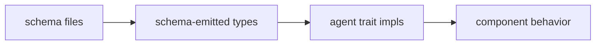

The diagram is also the build order. Schema files come first;
emission produces the type vocabulary; agents fill in trait
methods; the assembled behavior IS the component.

This frame propagates through every layer below: the wire layer
sends schema-emitted types; the runtime dispatches on schema-emitted
enum tags; the database stores schema-emitted records; the upgrade
path lives on schema-diff trait requirements.

## Schema is a recursive struct

Per record 940 (Decision, High, 2026-05-27): *"the schema language
is ONE recursive shape: a root-layer struct with macro-expanded
fields all the way down to scalar leaves."*

Per record 933 (Decision, Maximum): *"the schema file IS
conceptually a struct — the 4-position document has positional
fields with IMPLICIT names from position."*

The recursion has three layers:

| Layer | Substance |
|---|---|
| Root struct | 4 positional NOTA objects: Imports, Input, Output, Namespace. Each position has a known type by convention; macros dispatch by position. |
| Macro expansion | Inner NOTA objects match macro patterns (delimiter / shape / count / qualification / position) and lower through expansion. Output is either another inner object (recursion continues) or a typed declaration. |
| Scalar leaves | Recursion floor per record 938: unit enums, booleans, integers, strings, vectors, typed-string newtypes. Strings are conceptually vectors of characters behind boxed string storage. |

The recursive shape is what makes the language extensible without
core changes — a new declaration shape adds a macro, not a new
lowering branch in the engine.

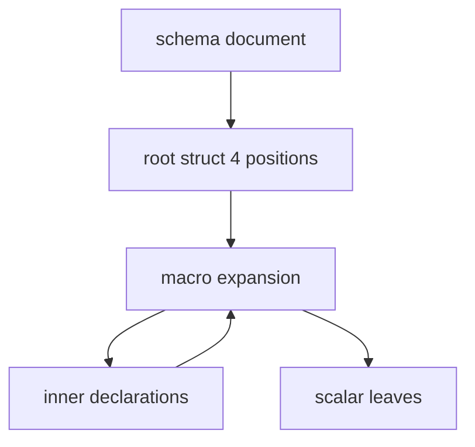

The cycle (macros to inner to macros) is the recursion. Each pass
of macro expansion either continues with new inner objects or
terminates at a scalar leaf.

Per record 933's clarification: Input and Output do not have to
be enums. If a component only receives one kind of message, Input
can be a struct. The macro engine dispatches by shape; the author
picks; the engine routes.

## The 4-position document and the structural fingerprint

Per record 933: the schema document's 4 root NOTA objects are
positional fields with implicit names from position.

| Position | Field | NOTA delimiter | Dispatch |
|---|---|---|---|
| 0 | Imports | `{...}` brace | `RootImportsMacro` |
| 1 | Input | `(Name (variants))` or struct | `RootEnumMacro::RootInput` |
| 2 | Output | `(Name (variants))` or struct | `RootEnumMacro::RootOutput` |
| 3 | Namespace | `{...}` brace | `RootNamespaceMacro` |

Per record 927 (High): NOTA and schema parsing begins with a
delimiter-balance pass that marks delimiter spans and exposes
first and second level structure as a textual 64-bit header. The
same concept as runtime message headers, but applied to text.

The `StructureHeader` lives in `nota-next` as 8 one-byte slots
packed in a `u64`. Each slot carries a shape code and a child
count. Document root plus two child levels typically fit; the
header is for fast triage, not full inspection.

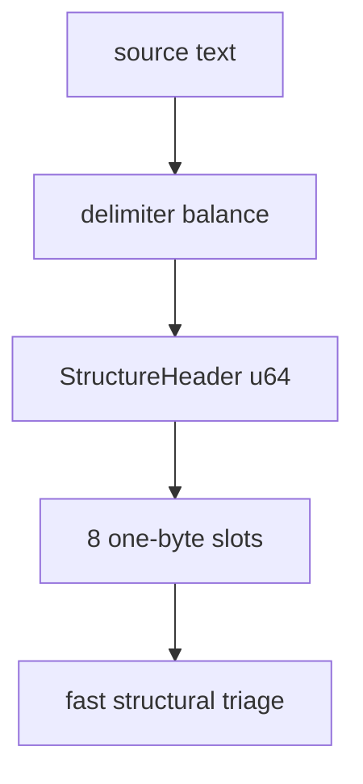

The 2-level structural fingerprint is computed once during
parsing; the schema engine records it in `MacroContext`; tests
assert the schema layer consumes the first-pass structural shape.

Code anchor: `nota-next/src/parser.rs:243-409` on operator main
(commit `5e06304`).

## Namespace is a dynamic enum, key/value at the NOTA layer

Per record 894 (Correction, Maximum): the brace delimiter `{}` is
*always* a key/value map — that is its structural meaning at the
NOTA layer. The schema namespace at position 3 uses pair-style,
not the named-object form. Named-object form (which parenthesises
each entry) is redundant — the brace already declares key/value
structure. Brace IS the key/value sugar that saves the
repetitive outer parens.

Conceptually, a namespace is a **dynamic enum**: each type name is
a variant tag; each type definition is the variant payload.
Structurally it is an enum, stored as a key/value map for
composition convenience.

The dynamic enum is **append-only in the Cap'n Proto style**: new
declarations concatenate at the end of the namespace so existing
type positions stay stable. The schema could eventually compile to
a single-byte enum tag space with an enum-upgrading facility.

Per record 902: the namespace separator is a SINGLE colon (not
double), mirroring Rust crate-then-module-then-type structure
while avoiding Rust's `::` syntax in schema text.

| Schema fully qualified name | Mirrored Rust path |
|---|---|
| `spirit-next:signal:Frame` | `spirit_next::signal::Frame` |
| `nota-next:parser:StructureHeader` | `nota_next::parser::StructureHeader` |

Per record 952 (Clarification, gap-fill on the directive operator
received): the naming system between schema-emitted code and
Rust source MIRRORS each other. The colon-path namespace in
schema and the double-colon module path in Rust are
isomorphic — you can use one to navigate the other.

## Brace vs paren — disambiguation

NOTA has three structural delimiters; brace and paren mean
different things, and the difference is load-bearing across the
schema language.

| Delimiter | Meaning | Use |
|---|---|---|
| `(...)` paren | Positional record / tuple | Type declarations, enum variants with payloads |
| `{...}` brace | Key/value map | Namespaces, key/value-shaped enum variants (sugar) |
| `[...]` square | Vector | Lists of homogeneous items |

Per record 926 (Clarification, High): the brace namespace form is
itself sugar syntax implemented as a macro. A positional brace
can omit its explicit name when the surrounding schema position
already supplies the data type name and field name.

Per records 894 + 932: payload-carrying enum declarations have
two equivalent surface forms.

| Form | Surface | Example |
|---|---|---|
| Paren (canonical) | `((Name Payload) (Name Payload) ...)` | `(Input ((Record Entry) (Observe Query)))` |
| Brace (sugar) | `{Name Payload Name Payload ...}` | `(Input {Record Entry Observe Query})` |

The brace form expands to the canonical paren form through
`BraceEnumVariantsMacro`. Per record 932: the brace-enum form
**IS** sugar — implemented as a macro that expands to canonical
paren-list form.

Unit-variant enums stay paren-form: no payload to pair with, so
brace sugar doesn't apply. An attempt to write
`Kind {Decision Principle Correction}` (odd count) errors loud
with `ExpectedEvenBraceEnumPairs`.

## Macros are sugar with multiple match criteria

Per record 932 (Decision, High): *"macros ARE sugar syntax in the
schema layer — the brace-enum form is implemented as a macro that
expands to the canonical paren-list form."* Per record 925
(Principle, High): schema macro expansion is structural matching
over NOTA objects at positions where the schema expects macros.

The macro engine supports MULTIPLE MATCH CRITERIA:

| Criterion | Examples |
|---|---|
| Delimiter | paren / brace / square / pipe-text |
| Internal shape | what the contents look like |
| Object count | exact number of root objects |
| Qualified-as-symbol | PascalCase / kebab / camel atom |
| Position binding | slot in the schema |
| Combinations | AND across criteria |

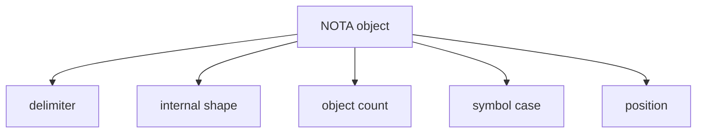

The dispatch picks the most-specific match. The current
implementation in `schema-next/src/engine.rs::MacroRegistry::lower`
uses first-match-wins by registration order; record 932 says the
target is most-specific dispatch — implementation pending (see
report 389 §"Open questions").

There are two macro layers in the registry:

| Layer | Purpose | Examples |
|---|---|---|
| Rust macros | Engine bootstrap and shape-pairing | `BraceEnumVariantsMacro`, `RootEnumMacro`, `RootImportsMacro`, `RootNamespaceMacro` |
| Declarative macros | Schema-authored declarations | `SchemaEnumDefinitionBrace`, `SchemaEnumDefinitionParen`, struct/enum declarations |

Code anchor: `schema-next/src/engine.rs:236-253`
(`MacroRegistry::with_schema_defaults`). The brace-enum sugar is
on `designer-macro-system-exploration-2026-05-27` pending
operator integration.

## Schema-emitted Rust lives in src/schema

Per records 909 + 910 (Maximum, 2026-05-27): schema-derived Rust
code emits to `src/schema/lib.rs` and `src/schema/<module>.rs` in
the crate source tree — NOT to `OUT_DIR/schema`. The load-bearing
choice: schema-derived Rust lives alongside hand-written Rust in
the same `src` directory, visible and greppable without
rebuilding.

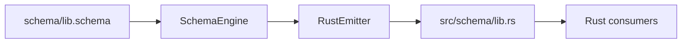

Per records 896-898 + 902: each Rust crate that participates in
schema generation carries a standard `schema/` folder with
`lib.schema` as the entry point, analogous to `src/lib.rs`.
Module schemas (`schema/<module>.schema`) load through
`lib.schema`'s imports.

Build invariants (per spirit-next's `build.rs`):

1. `build.rs` parses `schema/lib.schema` through
   `SchemaEngine::default().lower_source_with_context`.
2. The lowered Asschema goes through `RustEmitter::emit_file`.
3. The emitted path MUST be `schema/lib.rs`
   (asserted via `assert_generated_schema_path`).
4. The checked-in `src/schema/lib.rs` MUST match the emitted code
   byte-for-byte (asserted via `assert_checked_in_schema_is_fresh`).
5. If the schema changes without regeneration, the build fails
   loud.

Operator's `5ca1c96` lands the path mechanism in
schema-rust-next; `0296be2` materializes the generated file in
spirit-next.

## Methods attach to schema nouns

Per record 947 + 945 (High): *"schema design creates base input
and output enums for actor reaction types; execution logic
matches these schema-created variants to choose the right reply
and state action."* Per record 942 (Constraint, High): behavior
lives on schema-created data types with NOTA and binary signal
representations, not on free functions or legacy macro helper
surfaces.

Per record 882 (Maximum) + the Nix-enforced check in every
schema-stack crate's `flake.nix`:

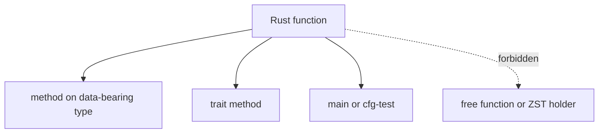

The discipline is operationalised by the
`no-production-free-functions` and `no-production-unit-structs`
Nix checks in `schema-next`, `schema-rust-next`, and `nota-next`.
A unit struct used as a namespace is a free function in disguise;
both are caught.

Per record 952's mirroring property: when the schema declares
`spirit-next:signal:Frame`, the agent attaches Rust methods to
`spirit_next::signal::Frame` — same noun, same vocabulary, same
namespace tree. The Rust author thinks in schema names; the
emitter handles the translation.

## REST is the wire architecture

Per record 951 (Clarification, High; gap-fill on operator's
capture): *"the schema-emitted data types are positioned as
REST-shaped at the wire layer."* The psyche framing: *"the data
type REST is emitted by this schema system."*

The point is architectural, not protocol-shaped: schema-emitted
types ARE REST resources / messages. The component model mirrors
REST's stateless-server-with-canonical-state property:

| REST concept | Stack equivalent |
|---|---|
| Resource | Schema-emitted type (struct or enum variant) |
| Stateless server with canonical state | Single-owner daemon with authoritative database |
| Resource method | Trait method on the schema-emitted type |
| Representation in transit | rkyv-encoded signal frame |
| Idempotent identity | Database marker (hash + counter) |

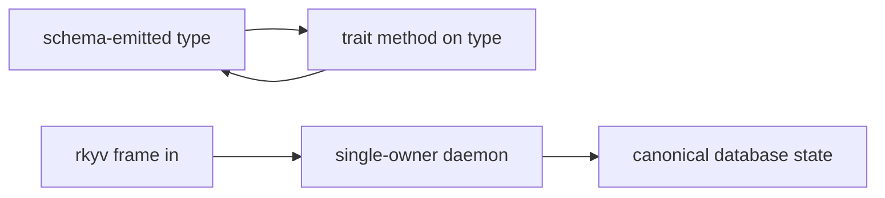

The single-owner system (record 949) mirrors REST's stateless-
server: there is exactly one writer per database; state mutation
cannot race across competing writers; permission and authority
messages route through that single owner. Multiple readers are
fine; the writer is one.

Per record 949 (Principle, High): *"execution uses current state
and permission or owner message types to authorize work,
preserving a single-owner system so state mutation cannot race
across competing writers."*

## The runtime triad — Signal / Nexus / SEMA (three schema-driven planes)

Per intent record 964 (Maximum, 2026-05-27), the schema layer has
THREE SCHEMA TYPES corresponding to three runtime planes. The
runtime triad from record 371's framing is **refined**: Executor is
renamed to **Nexus**, and all three planes are schema-driven. Each
plane has its own engine with its own traits, but all three engines
share the pattern of *running code based on input message and
returning output message with populated data*.

| Plane | Schema type | Role | What it owns |
|---|---|---|---|
| **Signal** | `Signal` schemas | Wire and communication layer | Decoding inbound frames; routing to Nexus; mail-event emission |
| **Nexus** | `Nexus` schemas | Execution layer — IO, external calls, UI | Routing forward-only vs state-involving operations; external CLI calls; all user interfaces |
| **SEMA** | `Sema` schemas | Durable state layer | Single-writer storage; serialized writes; multiple readers |

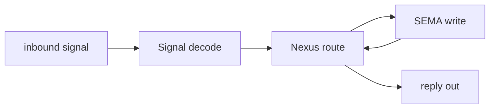

Per record 965 (Maximum): NEXUS specifically covers ANY layer where
code runs in response to typed input and returns typed output —
internal IO, external calls (e.g. cloud component starting
Cloudflare CLI to change DNS), AND all user interfaces. **Mencie**
(the persona's multi-modal UI with mencie-audio / mencie-introspect
etc. as panels) is implemented as nexus schemas — each UI panel has
its own nexus schema describing data flow and return types. This
unifies the previously-separate concerns of IO, external execution,
and UI under one schema-driven plane. Record 965 SUPERSEDES record
880's scope-restriction on Nexus terminology — Nexus is now PART OF
the schema-derived stack as the execution-layer schema type.

Per record 948 (Principle, High): *"internal database logic should
use the same schema-defined message language as component signals:
the daemon may keep the database engine internal for now, but a
growing database component can split into its own daemon without
changing the language pattern."*

The decomposability is structural: SEMA is talked to in the same
schema-defined message types as external signals. The single-daemon
shape is the starting point; if SEMA grows, it splits into its own
daemon and the language pattern carries unchanged.

Per record 964: file extensions remain **open** — candidates include
`.signal.schema` / `.nexus.schema` / `.sema.schema`, OR the schema
type as the first record of the schema content (`Signal …`,
`Nexus …`, `Sema …` in parens). The schema author declares the
variant; the engine routes.

## Input and output partition one tag space

Per record 934 (Decision, Maximum): Input and Output are
PARTITIONS of a single enum tag space. At the wire level they
share one byte of tag namespace, with ranges reserved for each
direction.

The conceptual split for a 1-byte enum carrying ~240 usable slots
is approximately two-thirds: first ~120 slots reserved for INPUT
variants; slots ~121-240 reserved for OUTPUT variants. The
specific 120/120 split is illustrative — larger enums get larger
spaces.

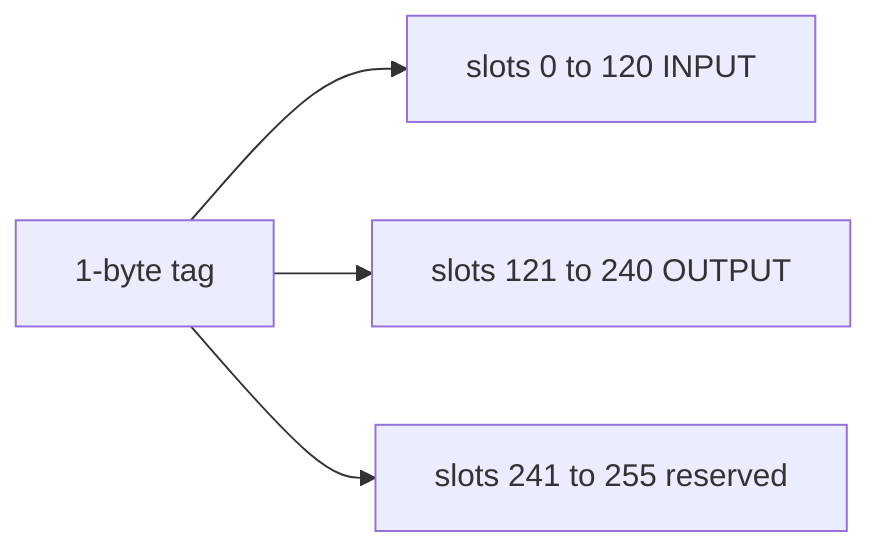

The schema author declares Input and Output separately at the
schema level. The rkyv-compiled binary form merges them into one
tag space. The first byte at the wire layer tells you immediately
whether to dispatch on input handlers or output handlers based on
which range the tag falls in.

Per record 931 (Clarification, Medium): the input-output split
can be represented in the root enum namespace by reserving
variant number ranges, so one first-byte header can distinguish
request-like input variants from response-like output variants
for the same actor mechanism.

Per record 928 (Principle, High): schema entry points should
usually begin with an enum-like variant decision because the
first structural match creates the namespace for routing,
mirroring the binary signal header mechanism.

The structural fingerprint at the text layer (record 933) and the
tag-byte partition at the binary layer (record 934) are the same
mechanism at different layers: a small header that lets the
reader triage what comes next before paying for full decode.

## The signal protocol — Communicate, signal-frame, mail, marker

Per record 935 (Decision, High) + record 963 (Decision, High,
2026-05-27): the wire protocol is named the **SIGNAL PROTOCOL**.
Four coupled mechanisms carry async messaging from CLI through
daemon to durable state, and the mail mechanism is a universal
push system with hookable lifecycle events.

| Mechanism | Role |
|---|---|
| Communicate trait | The wire interface between any two components |
| signal-frame | Connection setup, async unique IDs, handshake |
| Mail mechanism | Universal mailer/dispatcher/push system between sender and daemon; `accepted = will-be-processed`; hookable lifecycle events |
| Database marker | Reply payload: hash + counter proves which transaction |

Per record 963: the **mail mechanism** is the same lifecycle
infrastructure every component shares. Message lifecycle has
**hookable events** including a method-on-message-sent that fires as
soon as the message is sent and commits an action through the mail
dispatching system. The hook point allows UI consequences,
observers, and other components to react when a message is sent.
Async representation lives at the data-type level — the message
types themselves carry the correlation identifiers and lifecycle
state needed to track sent / queued / processing / replied
transitions. Per record 962: the mail mechanism is a **push system**,
not poll-based — observers attach hooks at the message-sent boundary.

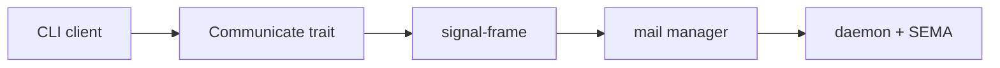

Per record 929 (Principle, High): component communication uses
the schema-defined binary rkyv signal-frame representation
between CLI client and daemon — NOT NOTA as the inter-component
wire format. NOTA is the AUTHORING layer (what humans type); the
wire is the COMPILED layer (what bytes travel).

The Communicate trait is abstract; concrete implementations carry
the transport (Unix socket, TCP, in-process). The
schema-emitted Input/Output types carry their own encode/decode
methods; Communicate abstracts the round-trip pattern that both
sides use:

- Client side: encode Input, send, wait for Output, decode, return.
- Daemon side: receive, decode Input, handle, encode Output, send.

Per record 930 + 935: the mail manager provides:

- Unique message identifiers.
- Handshake semantics.
- Response correlation.
- Database state markers in replies.

The mail-queue invariant: **mail accepted into the queue is
as-good-as-fed-in because the queue commits intent to process**.
The reply does not say "I received it" — it says "I processed it;
here is what changed".

The database marker is hash + counter:

| Field | Type | Use |
|---|---|---|
| `transaction_counter` | `u64` | Monotonic; client compares to last-seen |
| `state_hash` | `[u8; 32]` | Blake3 hash of database content at this transaction |

Together they give clients a strong local-state guarantee tied
to the daemon's authoritative database state. The async unique
ID system plus database marker reply support full async messaging
with provable state evolution.

Per record 942: behavior lives on schema-created types — so
`DatabaseMarker` is itself a schema declaration with methods on
the generated struct, not free helper functions.

## Schema evolution — append-only with upgrade traits

Per record 894: the dynamic-enum-as-namespace is **append-only**
in the Cap'n Proto style. New type declarations concatenate at
the end of the available namespace so existing type positions
stay stable. The schema eventually compiles to a single-byte
enum tag space with an enum-upgrading facility.

Per record 950 (Principle, High): *"schema diffs should drive
upgrade trait requirements: unchanged types emit no upgrade code,
changed types require hand-written upgrade and accept behavior
on the schema object, database load runs needed upgrades, and
old-version incoming messages can be upgraded, accepted, and
logged for introspection or routing."*

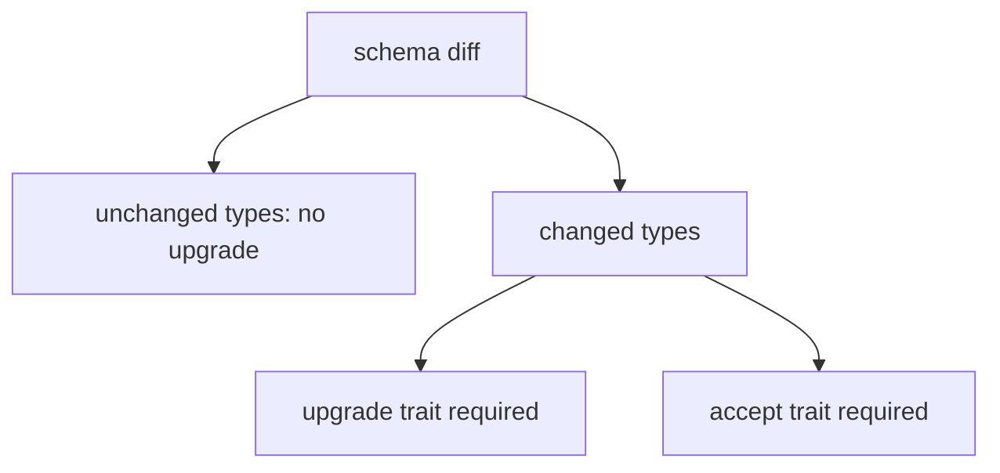

The upgrade discipline propagates through three load points:

| Load point | Behavior |
|---|---|
| Compile time | Schema-diff check fails if a changed type lacks the upgrade trait impl |
| Database load | Upgrade method runs on old records; transaction migrates state |
| Live message | Old-version incoming message gets upgrade-and-accept; introspection log captures the transition |

The append-only namespace guarantees that the tag for an old
type stays at the same position; the upgrade method transforms
the payload while the tag stays stable. Old clients can still
send messages with old tags; the daemon upgrades on receipt and
processes against current state.

## Where the work actually lives

A quick map of which repo owns which slice:

| Repo | What it owns |
|---|---|
| `nota-next` | NOTA grammar and structural reader. The `StructureHeader` + structural fingerprint. No schema knowledge. |
| `schema-next` | Schema language: 4-position document, macro engine, declarative + Rust macro registry, scalars, namespace. Lowers schema to Asschema. |
| `schema-rust-next` | Rust emitter. Takes Asschema, produces `src/schema/<module>.rs` files. |
| `signal-frame` | Wire protocol substrate. Connection setup, async unique IDs, handshake. Migrating to schema-derived per record 860 + 935. |
| `spirit-next` | First full consumer. Has `schema/lib.schema`; `build.rs` runs the full pipeline; `src/schema/` is the materialised output. |
| (future) `persona-mail` | Mail state manager. Async queue + unique IDs + handshake. Not yet built. |

Per the operator's main snapshot:

| Item | Status |
|---|---|
| 4-position root struct (record 933) | Landed on schema-next main |
| Pair-style brace namespace (record 894) | Landed on schema-next main |
| Single-colon namespace separator | Landed on schema-next main |
| `SchemaPackage::load_lib` | Landed on schema-next main |
| `src/schema/` emission target (records 909/910) | Landed on schema-rust-next + spirit-next |
| Schema folder rename `schemas/` to `schema/` | Pending; designer branch ready |
| Brace-enum sugar (records 894/932) | Pending; designer branch ready |
| 1-byte tag-space partition (record 934) | Not yet emitted; currently 16-bit |
| Communicate trait (record 935) | Not yet implemented |
| signal-frame schema-derived rewrite | Not yet started |
| Mail state manager (records 930/935) | Not yet built |
| Database marker (record 935) | Not yet defined |
| Schema upgrade traits (record 950) | Not yet defined |

The first column of this table is the work-already-done; the
second is the work-to-do per the new direction.

## How the layers compose end-to-end

The full pipeline from a CLI keystroke to a durable state change:

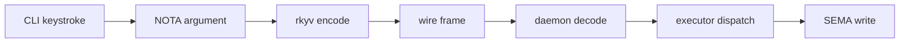

The same schema-emitted types appear at every link: the CLI
constructs an `Input` value from NOTA; encodes it via the type's
schema-derived rkyv codec; the daemon decodes back to the same
type; the executor matches on the variant tag to choose the
handler; SEMA's writes are typed against the same schema's record
shapes.

Reply path mirror:

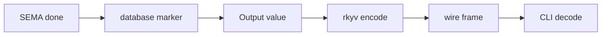

The Output type's encode/decode methods are schema-emitted; the
database marker is a schema-defined type; the wire frame is
schema-derived. The agent's hand-written code lives only in the
trait method bodies — the type vocabulary is uniform.

## Workspace discipline that supports the vision

The vision relies on workspace discipline that records 911, 912,
920, 921, 922, 939, 941, 944 lock in:

| Discipline | Substance | Recent intent |
|---|---|---|
| Short focused mermaid | 4-8 nodes per diagram, hard cap 10; multiple focused diagrams over one big map | 912 |
| Topic-prefix filenames | `N-topic-title.md` format; agglomerate by topic | 939, 941 |
| Per-repo intent manifestation | `INTENT.md` + `ARCHITECTURE.md` in every active-design repo | 943, 944 |
| Subagent inheritance | Subagents inherit dispatcher's lane, lock, and report slot | 920 |
| Cross-lane topic-recency | Context maintenance ranks by recency across lanes | 921 |
| No `\n` escapes in inline NOTA | Whitespace-insensitive NOTA never needs escape-newline | 922 |
| Design docs with code anchors | Each graph paired with the relevant code surface | 911 |

These are not separate concerns from the vision — they are the
workspace's operating substrate. Without short focused graphs,
the vision becomes unreadable. Without topic-prefix filenames, the
chapter reports can't be found by `ls | grep`. Without per-repo
manifestation, intent stays workspace-level and the repo work
diverges. The discipline is the medium through which the vision
travels.

## Where the vision differs from the prior framings

Three places this report's framing departs from the existing
canon:

### 1. The "data type REST" framing is now explicit

Reports 389-391 capture the schema-emitted types, the wire mechanisms,
and the emission discipline — but none of them name the REST
architectural framing per record 951's gap-fill. This report makes
the framing explicit: schema-emitted types are REST resources; the
single-owner daemon mirrors REST's stateless-server-with-canonical-
state property; the database marker is the idempotent identity.
Future agents see REST as the wire architecture pattern, not just
as data-type-emission.

### 2. The mirror-naming property is named

Per record 952's gap-fill: schema's colon-path namespace and Rust's
double-colon module path are isomorphic. Report 389 mentions the
single-colon decision (record 902) but does not frame it as a
mirror. This report names the mirror — `spirit-next:signal:Frame`
in schema corresponds to `spirit_next::signal::Frame` in Rust, and
agents navigate one through the other.

### 3. The recursive struct frame names the whole language

Reports 380 and 387 frame the schema language as a "4-position
document plus a macro registry plus scalar leaves" — three things.
Per record 940, it is ONE thing: a recursive struct from root to
scalars, with macro expansion as the mechanism. Report 389 carries
this framing forward; this report makes it the headline frame for
the vision.

## Chapter cross-references

The vision is the cover; the chapters carry the implementation
detail. When reading this report and you need more depth on a
specific layer, follow the chapter pointer.

| Vision section | Chapter report | What it adds |
|---|---|---|
| Schema is a recursive struct + The 4-position document | `reports/designer/389-schema-macros-canonical-direction.md` | Root struct table with code anchors, scalar leaf table, two enum body forms with `BraceEnumVariantsMacro` worked example |
| Macros are sugar with multiple match criteria | Report 389 §"Macros are sugar — multiple match criteria" | 8 match-criteria scenarios as working tests on `designer-macro-system-exploration-2026-05-27` |
| The wire stack — Communicate, signal-frame, mail, marker | `reports/designer/390-wire-runtime-canonical-direction.md` | Per-mechanism design sketch + implementation status |
| Input and output partition one tag space | Report 390 §"Input + Output = partition of one tag space" | Byte-range table + emission gap (currently 16-bit, target 1-byte) |
| Schema-emitted Rust lives in src/schema | `reports/designer/391-emission-discipline-direction.md` | Build invariants + freshness check + Nix discipline |
| Methods attach to schema nouns | Report 391 §"Methods-on-non-ZST + no-free-fns — Nix-enforced" | Per-repo Nix check table |

Earlier reports kept as background material:

| Report | Topic |
|---|---|
| `reports/designer/376-bottom-up-tour-01-nota-2026-05-27.md` | NOTA grammar layer + nota-next implementation |
| `reports/designer/380-bottom-up-tour-02-schema-macros-2026-05-27.md` | Layer-2 schema-macros tour (earlier framing) |
| `reports/designer/387-nota-schema-design-representation-2026-05-27.md` | 8-section side-by-side mermaid + tests |
| `reports/designer/388-macro-system-exploration-and-brace-enum-sugar-2026-05-27.md` | Match-criteria taxonomy + brace-enum sugar implementation |
| `reports/designer/371-signal-executor-sema-runtime-triad-and-federation-2026-05-26.md` | Signal/Executor/SEMA runtime triad framing |

## Open questions surfaced to the psyche

These are the questions the vision raises that the current intent
record set does not settle. The chapter reports name additional
implementation-level questions; these are the architectural ones.

### 1. Communicate trait location

Communicate as a schema-emitted trait per Input/Output enum, or a
hand-written trait in `signal-frame` that the generated types
implement?

- Schema-emitted: more uniform, every schema-emitted enum gets
  Communicate for free, mirror-naming carries.
- Hand-written: more flexible, transports can implement
  Communicate for arbitrary types (not just schema-emitted).

The vision pulls toward schema-emitted (everything else is) but
the practical case for hand-written is the transport-layer
non-schema types (raw socket, in-memory channel) that also want
Communicate.

### 2. Database marker per-reply vs per-some-reply

Every reply carries the marker, or only write-replies? Hash-only
on read-only, hash + counter on write?

The vision pulls toward every-reply for uniformity; the cost is
8 + 32 bytes per reply. Read-only replies don't change state, but
the client may still want to know which read-state the reply
corresponds to (to detect a stale snapshot).

### 3. Schema-authored core scalars

Per record 938: strings are conceptually vectors of characters;
domain concepts are typed beyond raw String. The current emitter
aliases `Text = String` and `Integer = u64` at the head of every
module.

Should `Text` and `Integer` be schema declarations in
`schema/core.schema` rather than emission-time aliases? Pro: the
schema is more self-describing; the core types are first-class.
Con: every consumer crate now depends on schema-core; the
bootstrap chain gets longer.

### 4. Tag-space partition granularity

The 120/120 split per record 934 is illustrative. Is the split:

- Fixed per enum (every Input + Output pair uses the same split)?
- Per crate (the crate's biggest Input determines the partition)?
- Schema-author configurable (a `tag-partition` schema declaration)?

Larger Inputs could starve Outputs; smaller Inputs leave slots
stranded. The vision does not yet settle this.

### 5. Schema-diff upgrade trait surface

Per record 950: schema diffs drive upgrade trait requirements.
What does a typical "schema diff" look like as a compile-time
artifact? Is it a separate `schema-diff` tool? A Nix check that
runs on every schema edit? A trait the schema author implements
on each migration boundary?

The vision names the discipline; the mechanism is open.

## Verification anchors

| Claim | Source |
|---|---|
| 4-position document is a struct | `schema-next/src/engine.rs:140-180` |
| Pair-style brace namespace | `schema-next/src/engine.rs:396-462` |
| Brace as key/value at NOTA layer | `nota-next/src/parser.rs:243-409` + records 894, 932 |
| Single-colon namespace separator | `schema-next/src/engine.rs` (after rename); record 902 |
| `SchemaPackage::load_lib` entry point | `schema-next/src/module.rs` |
| `src/schema/` emission target | `spirit-next/build.rs` + `schema-rust-next/src/lib.rs:78-110` |
| StructureHeader as 64-bit fingerprint | `nota-next/src/parser.rs:243-409` (operator main `5e06304`) |
| 16-bit short headers (not yet 1-byte partition) | `schema-rust-next/src/lib.rs:475-489` |
| Nix-enforced no-free-fns | `schema-next/flake.nix:73-86` |
| Schema-folder convention pending | `~/wt/.../designer-schema-namespace-and-folder-2026-05-27` (45693cac) |
| Brace-enum sugar pending | `~/wt/.../designer-macro-system-exploration-2026-05-27` (28df29ce) |
| Communicate trait not yet implemented | grep `Communicate` in operator main returns nothing |
| Mail state manager not yet implemented | no `persona-mail` repo exists |
| Database marker not yet implemented | no `DatabaseMarker` type in any schema |

## Source intent records

The vision draws on records 894-965. The load-bearing ones:

| Record | Substance |
|---|---|
| 894 | Brace IS key/value map; namespace is dynamic enum; Cap'n Proto append-only |
| 902 | Single-colon separator; `schema/` folder; `lib.schema` entry; `src/schema/` emission |
| 909, 910 | `src/schema/` emission target locked |
| 912 | Short focused mermaid 4-8 nodes per diagram |
| 920 | Subagent lane inheritance |
| 921 | Cross-lane topic-recency context maintenance |
| 922 | No `\n` escapes in inline NOTA |
| 925, 926, 932 | Macros are sugar with multiple match criteria + two enum forms |
| 927, 933 | Schema document is a struct; 2-level structural fingerprint as 64-bit header |
| 928, 931 | Schema entry begins with enum-variant decision; input/output partition |
| 929, 930, 935 | Communicate trait + signal-frame + mail + database marker |
| 934 | Input/output partition one tag space (~120/120 in a byte) |
| 936, 937, 940 | Schema as recursive struct with macro expansion to scalars |
| 938 | Scalar leaves; typed-string newtypes |
| 939, 941 | Topic-prefix filenames + per-topic agglomeration |
| 942 | Behavior on schema-created types, not free functions |
| 944 | Per-repo continuous intent manifestation |
| 945-950 | Schema creates actor enums; methods on schema objects; database-as-schema-messaging; permission messages; schema-diff upgrade traits |
| 951 | REST as the wire architecture (gap-fill) |
| 952 | Mirror-naming between schema and Rust source (gap-fill) |
| 963 | Signal protocol named; universal mail mechanism; method-on-message-sent hooks; async at the data-type level |
| 964 | Three schema types — Signal/Nexus/Sema — corresponding to three runtime planes; Executor renamed to Nexus; file extensions remain open |
| 965 | Nexus covers IO + external calls + ALL user interfaces; Mencie implemented as nexus schemas; supersedes record 880's scope-restriction |
