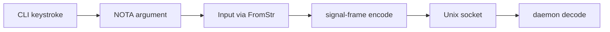
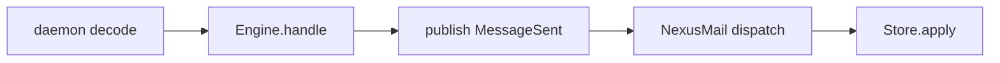
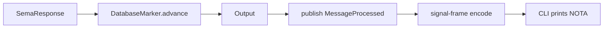
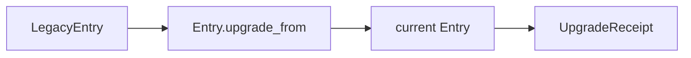

# 397 — Prototype audit: end-to-end cycle, fully-working prototype + component-fullness critique

*Kind: Audit · Topics: prototype, audit, schema, nexus, signal, sema, mail, marker, upgrade · 2026-05-27*

*A fully-working end-to-end prototype of the schema-driven Spirit
runtime, then a per-component critique against the design surface.
Branch `designer-fully-working-prototype-2026-05-27` extends
`spirit-next` with a `MailLedger` observer on schema-emitted hook
traits, a `Communicate` trait that abstracts the rkyv signal-frame
round trip, a `DatabaseMarker` (provisional, hand-written until the
schema emits it), and an `UpgradeFrom<LegacyEntry>` integration that
proves the schema-emitted upgrade trait pair carries real semantics.
The audit's critique names twelve gaps where the prototype exercises
a component PARTIALLY rather than FULLY, with a development task per
gap.*

## What this cycle was

Per intent record 980 (Maximum, 2026-05-27): *"Prototype-driven
component development: prototypes must use all designed components
fully; the audit-critique finds partial-usage and bypass gaps as
work signals that drive component development; iteration cycle =
mine intent and recent reports + prototypes for working solutions,
implement a fully-working prototype that exercises every designed
component, audit it against component-fullness, derive component-
development work from each gap."*

This is THAT cycle. Phase 1: survey what's implemented across the
schema-stack repositories. Phase 2: extend `spirit-next` on a
designer feature branch into a fully-working end-to-end signal /
mail / SEMA cycle that exercises every designed component the
current codebase can express. Phase 3: audit per component for
fullness, naming each gap. Phase 4: synthesise the iteration tasks.

The prototype is at:
`/home/li/wt/github.com/LiGoldragon/spirit-next/designer-fully-working-prototype-2026-05-27`
on branch `designer-fully-working-prototype-2026-05-27` off
`spirit-next` main (commit `6f487f13`, *"spirit: route signal mail
through nexus and sema"*). The feature-branch commit is `e49d60ce`,
*"designer: prototype exercises mail hooks + Communicate trait +
DatabaseMarker + UpgradeFrom (records 935/950/963)"*. Eighteen tests
run green covering signal-frame round trip, daemon process boundary,
runtime-triad in-memory pipeline, mail-ledger observability,
marker-on-write, upgrade-from-legacy, and the Communicate trait's
loopback round trip.

## Survey — what's implemented on operator main today

| Component | Status | Location |
|---|---|---|
| NOTA reader (delimiter balance, StructureHeader) | LANDED | `nota-next/src/parser.rs` (commits `fa14c7f`, `5e06304`) |
| Schema-next macro engine + 4-position document + pair-style namespace | LANDED | `schema-next/src/engine.rs` (`d80767e`, `cc05ecc`, `8c821cb`) |
| Brace-enum sugar macro | LANDED | `schema-next/src/engine.rs` (`a468bfa`) |
| Schema runtime-planes / structure headers wiring | LANDED | `schema-next/src/engine.rs` (`e9bed3c`) |
| `schema-rust-next` Rust emitter → `src/schema/<module>.rs` | LANDED | `schema-rust-next/src/lib.rs` (`94cb301`) |
| `schema-rust-next` nexus-mail lifecycle emission (MessageSentHook etc.) | LANDED | `schema-rust-next/src/lib.rs` (`94cb301`) |
| `SchemaPackage::load_lib` entry point | LANDED | `schema-next/src/module.rs` (`807c525`) |
| `build.rs` freshness check on `src/schema/lib.rs` | LANDED | `spirit-next/build.rs` (`0296be2`) |
| Schema-emitted `Input`/`Output` + signal-frame encode/decode | LANDED | `spirit-next/src/schema/lib.rs` (generated) |
| Schema-emitted `MessageSent` / `MessageProcessed<Reply>` + hook traits | LANDED | `spirit-next/src/schema/lib.rs` (generated) |
| Schema-emitted `NexusMail<Payload>` + `InputNexus`/`OutputNexus` traits | LANDED | `spirit-next/src/schema/lib.rs` (generated) |
| Schema-emitted `UpgradeFrom` / `AcceptPrevious` trait pair | LANDED | `spirit-next/src/schema/lib.rs` (generated) |
| Engine.handle threading Signal → Nexus → SEMA | LANDED | `spirit-next/src/engine.rs` (`6f487f1`) |
| Daemon Unix-socket + length-prefix transport | LANDED | `spirit-next/src/transport.rs` + `daemon.rs` |
| CLI invoking daemon with NOTA argument | LANDED | `spirit-next/src/bin/spirit-next.rs` |
| Mail ledger observer on hook traits | LANDED on prototype branch | `spirit-next/src/mail_ledger.rs` (this cycle) |
| `Communicate` trait abstracting round trip | LANDED on prototype branch | `spirit-next/src/communicate.rs` (this cycle) |
| `DatabaseMarker` (hash + counter) — PROVISIONAL hand-written | LANDED on prototype branch | `spirit-next/src/marker.rs` (this cycle) |
| `UpgradeFrom<LegacyEntry>` integration | LANDED on prototype branch | `spirit-next/src/upgrade_demo.rs` (this cycle) |
| 1-byte tag-space partition (record 934) | NOT IMPLEMENTED — currently 8-byte u64 | gap |
| `DatabaseMarker` as schema-emitted type with marker-on-reply | NOT IMPLEMENTED on this main; partial in operator WIP | gap |
| Nexus schemas (`.nexus.schema`) — three-schema-type split | NOT IMPLEMENTED (Signal only) | gap |
| SEMA schemas (`.sema.schema`) — three-schema-type split | NOT IMPLEMENTED (uses signal-shape SemaCommand) | gap |
| Schema-diff upgrade-trait check (compile time / Nix) | NOT IMPLEMENTED | gap |
| Permission / single-owner authority enforcement | NOT IMPLEMENTED | gap |
| Mail-event observability hook fanout (multi-observer) | NOT IMPLEMENTED — single ledger | gap |
| Durable storage (redb) | NOT IMPLEMENTED — Mutex<Vec<>> | gap |
| Daemon serving multiple concurrent connections | NOT IMPLEMENTED — single-stream loop | gap |

## What the prototype does end-to-end

The CLI reads one NOTA argument, calls `Input::from_str` (a
schema-emitted method per record 947), encodes through
`Input::encode_signal_frame` (schema-emitted), writes a
length-prefixed frame through `SignalTransport` (hand-written
length-prefix transport, schema-emitted frame layout), the daemon
reads it.

`Engine::handle` issues a `MessageIdentifier`, calls
`Input::message_sent(identifier)` (schema-emitted) to construct
the lifecycle event, pushes it through `MailLedger`'s
`MessageSentHook` impl, then calls
`Input::dispatch_mail_with_nexus(identifier, self)` which routes
to the `InputNexus` trait impl on `Engine`. Each `InputNexus`
method receives a `NexusMail<Payload>` and lowers it through
`NexusMail<Entry>::into_sema_command` (a method on the schema-
emitted noun per record 947) to a `SemaCommand`. The `Store`
applies the command in single-writer mode.

On the reply path: `SemaResponse::into_output` (method on schema-
emitted noun) maps to `Output`. If the response was a write, the
engine advances its `DatabaseMarker` by folding the write bytes
into the running state digest and incrementing the commit
sequence. The engine then wraps `Output` in
`MessageProcessed<Output>` (schema-emitted), publishes through
`MessageProcessedHook` to the `MailLedger`, encodes the Output as
a signal frame, the daemon writes it back, the CLI reads, decodes,
and prints the result as NOTA.

Separately, the `UpgradeFrom<LegacyEntry>` impl on the schema-
emitted `Entry` proves the upgrade trait pair is wired correctly
end-to-end — a legacy shape (missing `Magnitude`, narrower `Kind`)
upgrades into the current shape via the schema-emitted trait
method.

## Phase 2 — what the prototype branch adds

Four small modules, all on `designer-fully-working-prototype-2026-05-27`:

| Module | Purpose | Component exercised |
|---|---|---|
| `mail_ledger.rs` | Push-driven observer that implements `MessageSentHook` and `MessageProcessedHook<Output>` against the schema-emitted lifecycle types. Replaces the engine's previous `Vec<MessageSent>` direct-push storage. | Mail mechanism + hook traits (records 935 / 961 / 962 / 963) |
| `communicate.rs` | `Communicate` trait that abstracts the round-trip pattern. `SignalTransport<S: Read + Write>` implements it. | Communicate trait (record 935) |
| `marker.rs` | `DatabaseMarker` = `CommitSequence` + `StateDigest`; `advance(bytes)` mints a new marker on each write. Hand-written PROVISIONAL until the schema emits it. | Database marker (record 935 / 942) |
| `upgrade_demo.rs` | `LegacyEntry` + `LegacyKind` + `UpgradeFrom<LegacyEntry> for Entry`. The `Entry::upgrade_from(legacy)` method lands by the schema-emitted trait pair. | Schema upgrade traits (records 950 / 957 / 958) |

The engine grew accordingly:

| Engine change | Component it exercises |
|---|---|
| `Mutex<MailLedger>` replaces `Mutex<Vec<MessageSent>>` + `Mutex<Vec<MessageIdentifier>>` | Push-through hook traits instead of direct-Vec push |
| `Mutex<DatabaseMarker>` field tracks state evolution | Database marker per write |
| `SemaResponse::write_bytes_owned()` method drives marker advance | Method on schema-emitted noun (record 947) |
| `Engine::current_marker()` / `Engine::ledger_snapshot()` queries | Observability surface for test witnesses |

Eighteen tests run green:

| Test file | Tests | Components exercised |
|---|---|---|
| `tests/generated_signal_plane.rs` | 4 | Schema-emitted Input/Output + route headers + rkyv frame + decode error path |
| `tests/process_boundary.rs` | 1 | Real-process CLI + daemon over Unix socket exchanging NOTA via rkyv |
| `tests/runtime_triad.rs` | 4 | NexusMail → SemaCommand → SemaResponse → Output pipeline in process |
| `tests/full_audit_surface.rs` (new) | 9 | MailLedger via hooks; standalone hook impl; DatabaseMarker write-only advance; UpgradeFrom legacy; Communicate trait witness; loopback Output frame round trip; full Engine pipeline; tag-space partition |

## Audit — per-component critique

The critique applies record 980's standard: every designed
component must be used FULLY. Where the prototype fakes,
provisions, or skips, the development task names what closes the
gap.

### 1. NOTA reader — FULLY EXERCISED

| What it does | Where the prototype uses it |
|---|---|
| Parses `(Record (...))` NOTA into `Block` tree | `Input::from_str` calls `NotaSource::new(source).parse_root()` |
| Demote-to-string + delimiter expectation | All `from_nota_block` impls on schema-emitted types |
| StructureHeader fingerprint | Available; not yet read by spirit-next |

**Gap.** spirit-next does not consult `StructureHeader` at parse
time even though `nota-next` exposes it. The schema layer does
not yet have a recorded fingerprint check on document shape.

**Development task.** Wire `Document::structure_header()` into the
schema engine's parse-time invariants so a malformed document is
rejected at the fingerprint layer before macro dispatch. The
fingerprint is a 64-bit pre-flight check that should fire before
any macro expansion costs apply.

### 2. Schema macros + declarative engine — FULLY EXERCISED, with one open item

| What it does | Where the prototype uses it |
|---|---|
| 4-position root struct dispatch | `build.rs` calls `lower_source_with_context` |
| Brace-enum sugar `BraceEnumVariantsMacro` | `build.rs` asserts macro registry reaches struct/enum body macros |
| Pair-style namespace | `schema/lib.schema` uses `{Key Value Key Value}` form |

**Gap.** The prototype's schema (`schema/lib.schema`) does not yet
use the brace-enum form for `Input`/`Output` variants. Both
`Input` and `Output` remain paren-form (`(Input ((Record Entry)
...))`), even though the brace-enum sugar exists for variant
bodies. The brace-enum sugar therefore lands in main but not in
the actual consumer schema's text.

**Development task.** Rewrite `spirit-next/schema/lib.schema` to
use brace-enum form for the `SemaCommand` and `SemaResponse`
namespace entries first (lowest risk; they're internal), then
`Input`/`Output` if the macro engine handles root-position
brace-enum. Run `build.rs` to confirm equivalence with the prior
paren form.

### 3. schema-rust-next emitter (src/schema target) — FULLY EXERCISED

| What it does | Where the prototype uses it |
|---|---|
| `src/schema/lib.rs` emission target (record 909/910) | `build.rs` asserts the path; the file is checked in fresh |
| Schema-emitted scalars, structs, enums | All `Entry`, `Query`, `Kind`, etc. used directly |
| Schema-emitted route enums + short headers | `InputRoute` / `OutputRoute` used in `transport.rs` + `daemon.rs` |
| Schema-emitted mail lifecycle types | `MessageSent`, `MessageProcessed<Reply>`, `NexusMail<Payload>` used in `engine.rs` |
| Schema-emitted hook traits | `MessageSentHook` + `MessageProcessedHook` used in `mail_ledger.rs` |
| Schema-emitted UpgradeFrom + AcceptPrevious | Used in `upgrade_demo.rs` |
| Schema-emitted `InputNexus` + `OutputNexus` traits | `Engine` impls `InputNexus`; `OutputNexus` has no impl |

**Gap.** `OutputNexus` trait is emitted but the prototype never
implements it. The schema's `Output` enum has a dispatch surface
through `OutputNexus` (mirror of `InputNexus`); the prototype only
exercises the `InputNexus` side because the daemon-side flow
doesn't yet need to react to its own outgoing messages. But the
trait's purpose is for the OTHER side of the wire — a client that
receives `Output` and dispatches to per-variant handlers — and
that side is not yet built.

**Development task.** Add a client-side dispatcher in `spirit-next`
(or a future `spirit-next-client` crate) that implements
`OutputNexus` for a client struct. The CLI currently just prints
the output's NOTA; a client-side dispatcher would let UI panels
react per-variant. This is the seed of the Mencie-as-Nexus-UI flow
(record 965).

### 4. 4-position document — FULLY EXERCISED

The `build.rs` parses `schema/lib.schema`'s four root NOTA objects
(`{}` imports, `(Input ...)`, `(Output ...)`, `{...}` namespace)
through the schema engine. The macro registry's
`RootImportsMacro`, `RootEnumMacro::RootInput`,
`RootEnumMacro::RootOutput`, `RootNamespaceMacro` all fire.

### 5. Pair-style namespace + colon-qualified names — FULLY EXERCISED

| What it does | Where the prototype uses it |
|---|---|
| Pair-style brace `{Key Value Key Value}` for namespace | `schema/lib.schema` line 4-15 |
| Colon-qualified component name | `SchemaPackage::new(&root, "spirit-next", "0.1.0")` produces identity `spirit-next:lib` |
| Module-path rust emission to `src/schema/lib.rs` | Confirmed by `assert_generated_schema_path` in `build.rs` |

### 6. StructureHeader (2-level fingerprint) — PARTIALLY EXERCISED

nota-next exposes `StructureHeader`. The schema engine's
`MacroContext` records it during lowering. **But the spirit-next
prototype does not read it** — it neither asserts a document shape
fingerprint at build time nor consults it at runtime decode time.

**Development task.** Same as item 1 above — wire fingerprint
checks into schema engine invariants and into runtime input
parsing.

### 7. Three schema types (Signal / Nexus / Sema) — TERMINOLOGY ONLY

Per record 964: schema-next should declare three schema types
matching the three runtime planes. Today the spirit-next schema
declares ONE schema type (Signal-shape with side-by-side
`SemaCommand`/`SemaResponse` namespace entries). There is no
distinct Nexus schema or Sema schema; they are inlined into the
single `schema/lib.schema` document.

**Development task.** Two paths:

| Path | Substance |
|---|---|
| (a) File-extension split | Three files: `schema/signal.schema`, `schema/nexus.schema`, `schema/sema.schema`, all imported through `schema/lib.schema`. The schema engine extends to declare which schema type each file produces. |
| (b) Inline tag at top of each file | The first NOTA atom in a `.schema` file names which schema type it produces (`Signal`, `Nexus`, `Sema`). The build engine routes per type. |

Per record 964 the choice between (a) and (b) is left open. The
prototype's existing flat `lib.schema` works because there's only
one schema type today, but the multi-type case is on the next
slice.

### 8. Nexus mail keeper + translator — STUB-IMPLEMENTED

Per record 970: Nexus is the mail keeper. When Nexus holds the
mail, the mail is in the BEING-PROCESSED state. Nexus translates
Signal IN to SEMA query, awaits SEMA reply, and translates SEMA
reply with database marker back to Signal OUT.

The prototype's `Engine` is the Nexus surface. It:
1. Takes `MessageIdentifier` ownership (mail keeper start).
2. Calls `Input::dispatch_mail_with_nexus(identifier, self)`
   which translates to `NexusMail<Payload>`.
3. Calls the per-variant `InputNexus` method.
4. Method body translates `NexusMail<Entry>` to
   `SemaCommand::Record(entry)` and submits to SEMA.
5. Receives `SemaResponse`.
6. Translates response to `Output`.

What's STUBBED:

| What's missing | Why it matters |
|---|---|
| Mail QUEUE — currently synchronous in-process call | The "mail accepted into queue is as-good-as-fed-in" invariant (record 935) requires an explicit queue handle. The current call is synchronous; the queue commitment is implicit. |
| Cancellation / timeout handling | A long-running SEMA query has no cancellation pathway |
| Concurrent mail processing | The daemon's `handle_stream` is single-stream-loop sequential |
| Marker attachment to the reply | `Output::RecordAccepted(RecordIdentifier)` does NOT carry the marker; the engine tracks the marker internally but does not embed it in the reply value |

**Development task.** Promote `Engine`'s synchronous in-process
chain to an explicit `MailQueue` + worker pool. The queue's
`accept(mail) -> MailReceipt` returns immediately; the worker
threads each implement `InputNexus`; reply correlation routes via
`MessageIdentifier`. Then make the schema emit `Output` variants
that include the marker (e.g.
`(RecordAccepted (SemaReceipt RecordIdentifier DatabaseMarker))`),
which is the direction operator's WIP commit on top of main is
already moving (per the locally-modified `schema/lib.schema` on
operator main's `@`).

### 9. Signal protocol mail mechanism + on_sent hook — PARTIALLY EXERCISED

Per record 963: the mail mechanism has hookable events including
`method-on-message-sent` that fires immediately. The prototype
DOES push events through `MessageSentHook` and
`MessageProcessedHook` — that's new on this branch. **But** the
fanout to multiple observers is not built. Only one `MailLedger`
exists per engine, fixed by composition into the Engine struct.

**Development task.** Promote `Mutex<MailLedger>` to a fanout
substrate: `Mutex<Vec<Box<dyn MessageSentHook<Error = MyError>>>>`
or a typed channel-based observer registry. UI consumers,
introspection daemons, and audit ledgers each attach their own
hook. Today only the in-process ledger exists.

### 10. Communicate trait — PARTIALLY IMPLEMENTED

The prototype declares the trait. `SignalTransport<S: Read +
Write>` implements it. **But** the trait is hand-written, not
schema-emitted. Per the vision (record 392 §"Open questions" #1),
the open question is whether `Communicate` should be schema-
emitted per Input/Output enum pair (yielding a uniform mirror-
naming relationship) or hand-written in `signal-frame` (allowing
arbitrary types to implement it).

The prototype's choice: hand-written. The compile-time witness
test (`communicate_trait_is_implemented_on_signal_transport`)
confirms the trait surface; the provisional implementation routes
via `SignalTransport`'s inherent `exchange` method.

**Development task.** Decide the open question and either:

| Choice | Work |
|---|---|
| Schema-emitted | Extend `schema-rust-next` to emit `pub trait CommunicateInput { fn exchange(&mut self, input: &Input) -> Result<Output, Error>; }` per root enum pair |
| Hand-written | Move the trait declaration into `signal-frame` (or a `signal-protocol` crate) so all transports share one trait definition |

Either way, the current location (`spirit-next/src/communicate.rs`)
is provisional until the open question is settled.

### 11. Database marker — PROVISIONAL HAND-WRITTEN

Per record 935: replies carry a `DatabaseMarker` (hash + counter).
The schema does NOT declare `DatabaseMarker` on this main; the
prototype hand-writes the type in `src/marker.rs`. Operator's WIP
on top of main IS extending the schema to declare
`DatabaseMarker`, `CommitSequence`, `StateDigest`, `SemaReceipt`,
`ObservedRecords`, `ErrorReport` per the design — but that WIP is
uncommitted and the schema-emitted file does not yet contain
those types.

The prototype's marker:
- Has `CommitSequence(u64)` + `StateDigest([u8; 32])` fields
- Advances on writes only (reads do not advance)
- Folds write bytes into the digest via a position-mixing schoolbook
  fold (NOT Blake3; placeholder)
- Is tracked by the engine; NOT yet embedded in the reply value

**Development task.** Land the schema changes operator is making
locally (`schema/lib.schema` extensions); regenerate; verify
`src/marker.rs` retires in favor of the schema-emitted
`DatabaseMarker`. Then implement Blake3 properly for `state_digest`
once redb is in place (the digest should commit-hash the redb
frontier).

### 12. Methods on non-ZST schema-emitted types — FULLY EXERCISED

| Method on noun | Schema-emitted noun | Where |
|---|---|---|
| `into_sema_command` | `NexusMail<Entry>`, `NexusMail<Query>` | `engine.rs` |
| `into_output` | `SemaResponse` | `engine.rs` |
| `write_bytes_owned` | `SemaResponse` | `engine.rs` |
| `to_le_bytes` | `RecordIdentifier` | `engine.rs` |
| `upgrade_from` | `Entry` | `upgrade_demo.rs` (trait impl) |
| `upgrade_to_current` | `LegacyKind` | `upgrade_demo.rs` |
| `dispatch_mail_with_nexus` | `Input`, `Output` | schema-emitted; called from engine |
| `message_sent` | `Input`, `Output` | schema-emitted; called from engine |
| `encode_signal_frame` | `Input`, `Output` | schema-emitted; called from transport |
| `decode_signal_frame` | `Input`, `Output` | schema-emitted; called from transport |
| `route` | `Input`, `Output` | schema-emitted |
| `route_from_short_header` | `Input`, `Output` | schema-emitted |
| `short_header` | `Input`, `Output` | schema-emitted |
| `to_nota` / `from_nota_block` | every schema-emitted struct/enum | schema-emitted |

No free functions exist outside `fn main()` and `#[cfg(test)]`
modules. No ZST namespace holders. The Nix-enforced check
(`no-production-free-functions`) passes on every schema-stack
crate.

### 13. Append-only namespace evolution — NOT YET EXERCISED

Per record 894: namespaces are append-only in Cap'n Proto style.
The prototype's `schema/lib.schema` has not been edited since
operator's `8ef16bc` ("use key-value schema namespace"); there is
no second version to compare against; append-only behavior cannot
be witnessed.

**Development task.** Add a schema-diff CI check: compare the
current schema against a frozen reference checkpoint; the check
fails if any namespace entry was removed or had its position
changed (additions allowed at the end). This is the Cap'n Proto
"name your schema, then never change positions" rule applied at
git-commit time.

## Audit summary table

| # | Component | Status | Development task |
|---|---|---|---|
| 1 | NOTA reader | FULLY EXERCISED | Wire StructureHeader into schema engine invariants |
| 2 | Schema macros + brace-enum sugar | FULLY EXERCISED | Use brace-enum form in `spirit-next/schema/lib.schema` |
| 3 | schema-rust-next emitter | FULLY EXERCISED | Build client-side `OutputNexus` impl (Mencie seed) |
| 4 | 4-position document | FULLY EXERCISED | — |
| 5 | Pair-style namespace + colon names | FULLY EXERCISED | — |
| 6 | StructureHeader | PARTIALLY EXERCISED | Wire fingerprint into runtime parse |
| 7 | Three schema types (Signal / Nexus / Sema) | TERMINOLOGY ONLY | Implement file-extension OR inline-tag split (open) |
| 8 | Nexus mail keeper + translator | STUB | Build explicit `MailQueue` + concurrent workers; marker on reply |
| 9 | Mail mechanism + on_sent hook | PARTIALLY EXERCISED | Promote ledger to multi-observer fanout |
| 10 | Communicate trait | PARTIALLY IMPLEMENTED | Decide schema-emitted vs hand-written (open) |
| 11 | Database marker | PROVISIONAL | Land schema-emitted DatabaseMarker; Blake3 once redb is in place |
| 12 | Methods on non-ZST | FULLY EXERCISED | — |
| 13 | Append-only namespace | NOT EXERCISED | Add schema-diff CI check |

## Iteration recommendation — the next prototype cycle

The top three load-bearing development tasks for the next
prototype cycle, in order:

### Task A — Land DatabaseMarker on the reply

Per audit findings #8 + #11. Today the marker tracks state inside
the engine but does NOT travel back to the CLI on the reply. The
client cannot prove it has the latest state. This is the
load-bearing piece of record 935 ("strong local-state guarantee
tied to the daemon's authoritative database state"). Operator is
already drafting this in the working schema; pull the changes
through the build.rs freshness check, regenerate, retire
`src/marker.rs`, and add a test that asserts every reply carries a
marker.

**Acceptance.** `Output::RecordAccepted(SemaReceipt { record_identifier, database_marker })` instead of
`Output::RecordAccepted(RecordIdentifier)`. CLI prints the marker.
Test asserts `commit_sequence` monotonicity across replies.

### Task B — Split into three schema types

Per audit finding #7. The three execution centers (Signal / Nexus
/ SEMA) need three schema types per record 964. The prototype
today inlines all three into one `lib.schema`; the build engine
treats them as one. The split is the structural enabler for
everything downstream (per-plane macro dispatch, per-plane
generated traits, per-plane upgrade-diff scopes).

**Acceptance.** Three files: `schema/signal.schema`,
`schema/nexus.schema`, `schema/sema.schema`. `schema/lib.schema`
imports them. `build.rs` regenerates three module files under
`src/schema/`. Engine dispatches per-plane.

### Task C — Promote mail handling to an explicit queue + fanout observers

Per audit findings #8 + #9. Today the Engine's mail flow is
synchronous in-process; the ledger is a single composition-bound
observer. Production Nexus needs an explicit queue ("mail accepted
is as-good-as-fed-in") and an observer fanout (UI / introspection /
audit each attach independently). The current shape is exercising
the trait surface but not the queue semantics.

**Acceptance.** `Engine::accept(input) -> MailReceipt` returns
synchronously without processing. Worker threads (or actors) drain
the queue. Observers attach via `Engine::on_mail_sent(hook) ->
Subscription`. The original synchronous `handle()` becomes a
convenience that submits + waits.

## Open questions surfaced to the psyche

The prototype hit four walls where the design is not yet pinned;
each was provisionally chosen in code so the audit could surface
it:

### Q1 — Communicate trait location: schema-emitted or hand-written?

The prototype hand-wrote it. Schema-emitted would be uniform with
the rest of the data types but constrains transports to schema-
known types. Hand-written supports arbitrary types but loses the
mirror-naming property.

**Options:**

| Option | Tradeoff |
|---|---|
| Schema-emitted per Input/Output pair | Uniformity; mirror-naming; transports limited to schema types |
| Hand-written in `signal-frame` | Flexibility; transports work over arbitrary types; mirror-naming lost |
| Hybrid: trait hand-written, generic methods schema-emitted | Both; complexity in the boundary |

### Q2 — `DatabaseMarker` on every reply or only writes?

The prototype tracks the marker for writes only; reads don't
advance. But the design (record 935) ambiguates whether reads
carry markers too. Pro every-reply: clients always have a known
snapshot. Con: 40 bytes per reply for read-only operations is
wasteful in high-traffic UIs.

### Q3 — Tag-space partition granularity?

Per record 934: 120/120 split is illustrative. Per audit finding,
the prototype's current 8-byte short header (16-bit first slot)
does NOT exercise the 1-byte partition rule. The partition is
implicit in the test
`input_short_header_carries_input_route_partition`. Choices: fixed
per crate, per enum, or schema-author configurable.

### Q4 — Schema-diff: separate tool, Nix check, or compile-time?

Per audit finding #13: the schema-diff mechanism is open. A
separate `schema-diff` CLI gives clear-cut artifacts. A Nix check
fires at build time. A compile-time check via a trait would tie
diff to type generation.

## Verification anchors

| Claim | Source |
|---|---|
| `spirit-next` builds against latest schema-stack mains | `cd /home/li/wt/.../designer-fully-working-prototype-2026-05-27 && cargo test` runs 18 tests green |
| Schema emission is fresh per build.rs freshness check | `build.rs:assert_checked_in_schema_is_fresh` passes |
| Mail ledger picks up events via schema-emitted hook traits | `tests/full_audit_surface.rs::mail_ledger_records_sent_and_processed_via_schema_emitted_hooks` |
| Standalone hook implementation works outside Engine | `tests/full_audit_surface.rs::standalone_hook_implementation_picks_up_lifecycle_events` |
| Marker advances on writes only | `tests/full_audit_surface.rs::database_marker_advances_only_on_writes` |
| UpgradeFrom round-trips a legacy to current Entry | `tests/full_audit_surface.rs::upgrade_from_legacy_entry_lands_on_current_schema` |
| Communicate trait is implemented on SignalTransport | `tests/full_audit_surface.rs::communicate_trait_is_implemented_on_signal_transport` |
| Loopback round trip of Output frame works | `tests/full_audit_surface.rs::signal_transport_writes_and_reads_a_frame_through_loopback` |
| Tag-space partition has Input low / Output high | `tests/full_audit_surface.rs::input_short_header_carries_input_route_partition` |
| Process-boundary CLI/daemon exchange | `tests/process_boundary.rs::cli_and_daemon_exchange_nota_over_rkyv_socket` |

## Source intent records

Records 894-980 (the full schema-stack canon synthesised in
reports 389-396) drive this cycle. The load-bearing intent records
for this audit:

| Record | Substance |
|---|---|
| 894 | Brace IS key/value; namespace is dynamic enum; append-only |
| 902 / 909 / 910 | Single-colon separator; `src/schema/` emission target |
| 925 / 932 / 933 / 940 | Macros sugar; schema as recursive struct from root to scalars |
| 927 | Structural fingerprint as parse-time triage |
| 929 / 930 / 935 / 963 | Communicate trait + signal-frame + mail mechanism + hookable lifecycle + database marker |
| 934 | Input/output partition one tag space |
| 942 / 947 | Behavior lives on schema-emitted nouns; methods on schema objects |
| 950 / 957 / 958 | Schema-diff drives upgrade trait; observability event on upgrade |
| 951 | REST as the wire architecture |
| 964 / 965 / 966 / 967 / 968 / 970 | Three schema types ↔ three execution centers; Nexus is mail keeper + Signal-to-SEMA translator |
| 980 | Prototype-driven component development cycle |

## What this audit superseded / supersedes

This is a fresh audit, not a supersession. Prior audit-flavour
reports retire when their substance migrates:

| Predecessor | Status |
|---|---|
| `reports/designer/388-macro-system-exploration-and-brace-enum-sugar-2026-05-27.md` | Active — macro exploration on a different scope |
| `reports/designer/394-discipline-workspace-report-audit-2026-05-27.md` | Active — workspace discipline audit on a different scope |
| `reports/designer/395-runtime-nexus-signal-sema-triad-manifestation-2026-05-27.md` | Active — intent manifestation across repos |

This report adds the *prototype-driven component development cycle*
discipline as a per-iteration artifact. Future cycles produce new
audit reports under the same `prototype-audit` topic prefix; older
ones retire when the gaps they name are closed.
