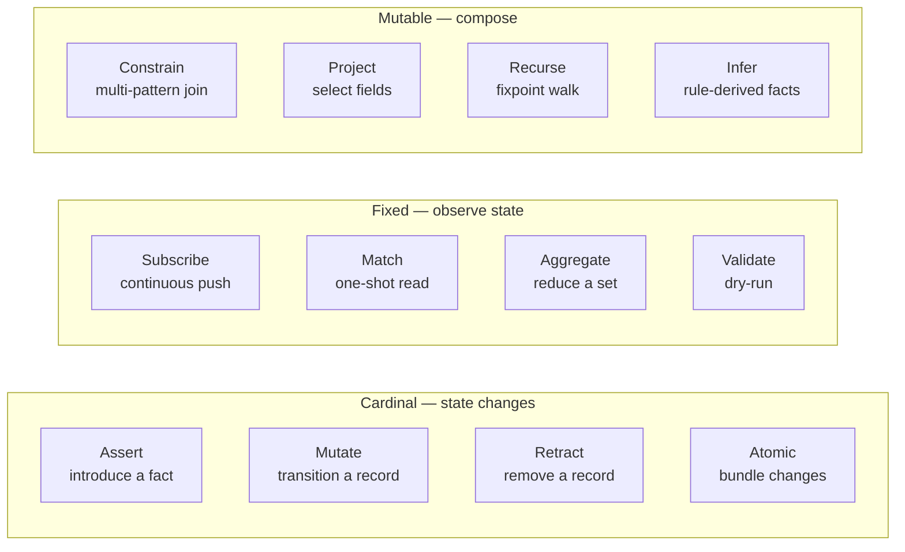
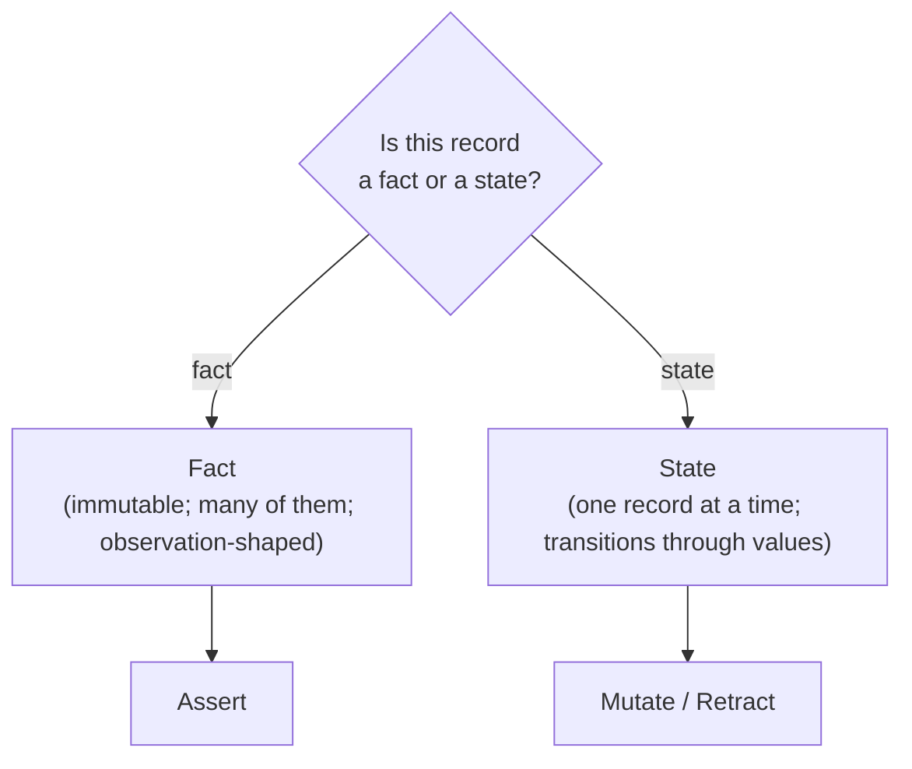
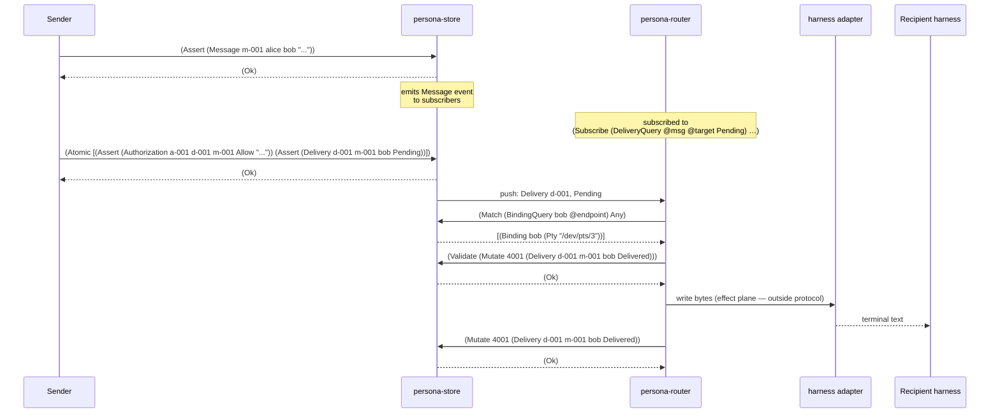
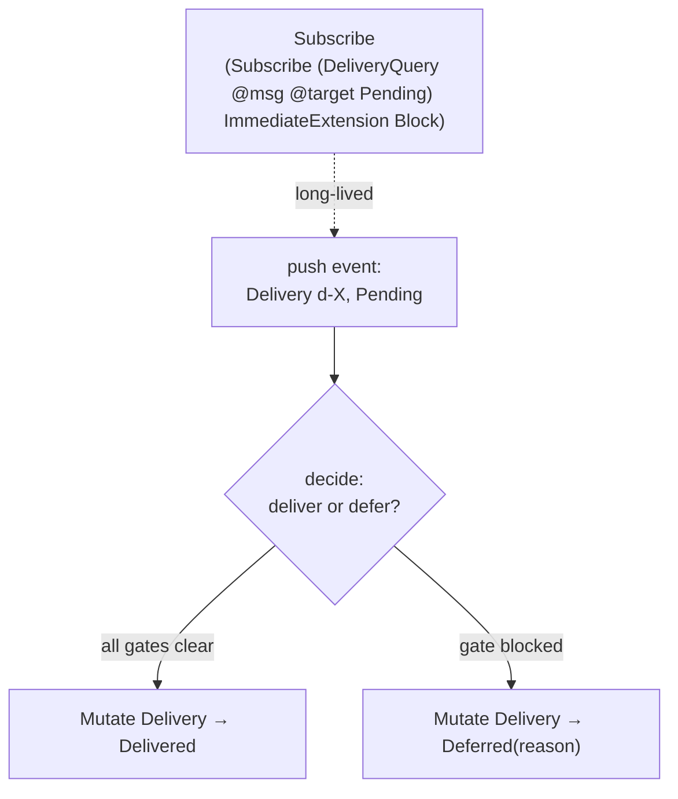

# The 12 verbs in Persona — every operation as a typed record-graph move

Status: design synthesis (answers user's question)
Author: Claude (designer)

User's question: *"how the 12 verbs can cover the specific
usage of persona (like inter-agent messaging — should be a
type of Assert right?)"*

Short answer: **yes, sending a message is Assert.** Long
answer: every Persona operation lands as exactly one of the
12 verbs, and the mapping is exhaustive — Persona doesn't
need a single custom verb. This report names which Persona
operation goes to which verb, with concrete examples in
post-Tier-0 nexus.

This report assumes report 21 (Persona on nexus) — that
Persona is record-graph-shaped and the protocol is signal's
universal verbs over Persona's typed records. Report 21
made the architectural call. **This report is the operational
table.**

---

## 0 · TL;DR



| Persona operation | Verb | Why this verb |
|---|---|---|
| Send a message | **Assert** | Introduce the `Message` record. The store assigns the slot. |
| Authorize a delivery | **Assert** | Introduce the `Authorization` record (Allow / Deny / Hold). |
| Start a delivery | **Assert** | Introduce the `Delivery` record (state = Pending). |
| Observe focus / window / input buffer | **Assert** | Each observation is a new immutable fact: `FocusObservation`, `WindowClosed`, `InputBufferObservation`. |
| Declare a harness | **Assert** | Introduce the `Harness` record (lifecycle = Declared). |
| Claim a workspace scope | **Assert** | Introduce a `Lock` record (status = Active). |
| Deliver a message (success) | **Mutate** | Delivery state Pending → Delivered. |
| Defer a delivery | **Mutate** | Delivery state Pending → Deferred(reason). |
| Expire a delivery | **Mutate** | Delivery state → Expired (TTL fired). |
| Move a binding | **Mutate** | Update `Binding.endpoint` to new transport. |
| Advance a harness lifecycle | **Mutate** | Driven by an `Observation` Assert. |
| Discharge a stuck delivery | **Retract** | Remove the `Delivery` record. |
| Lose a binding | **Retract** | Remove the `Binding` (typically driven by `WindowClosed` Assert). |
| Release a workspace scope | **Retract** | Remove (or zero out) the `Lock` record. |
| Authorize-and-deliver as one transaction | **Atomic** | Bundle `Assert Authorization` + `Assert Delivery`. |
| Hand a binding off across machines | **Atomic** | Bundle the binding swap so neither side observes a torn state. |
| Router's main loop | **Subscribe** | Push events for `(Delivery @msg @target Pending)`. |
| Live inbox / tail | **Subscribe** | Push events for `(Message @id @from <recipient> @body)`. |
| Viewer follows transcript | **Subscribe** | Push events for `(StreamFrame @harness @bytes)`. |
| Inbox listing (point-in-time) | **Match** | One-shot read for messages addressed to <recipient>. |
| Status command | **Match** | One-shot read for current `Lock` records. |
| Count pending by recipient | **Aggregate** | `(GroupBy target Count)` over `DeliveryQuery`. |
| Transcript size summary | **Aggregate** | `Sum` of byte counts over `StreamFrame` records. |
| Pre-flight a delivery | **Validate** | Dry-run the planned `Mutate` against the current state. |
| Find unbound deliveries | **Constrain** | `Delivery + Binding` joined on target with no Binding. |
| Tail with body only | **Project** | Select `body` field from the `MessageQuery` stream. |
| Reconstruct a thread | **Recurse** | Walk reply chains from a root message. |
| Propose a recovery | **Infer** | LLM-resilience rules generate `RecoveryProposal` records. |

**The verb is the protocol move; the record kind is what's
moved. Persona's contribution is the record kinds (Message,
Delivery, Authorization, Harness, Binding, observations,
…) — not the protocol.**

---

## 1 · Yes — send a message is Assert

The user's hypothesis was exactly right. Concretely:

```nexus
;; Sender CLI
(Assert (Message m-2026-05-08-001 alice bob "send me status"))
```

What happens server-side:

1. `nexus-daemon` decodes the text into `Request::Assert(AssertOperation::Message(Message { ... }))`.
2. `persona-store` validates the record (well-formed; sender principal exists; recipient principal exists).
3. The store assigns a slot, persists the record (rkyv inside redb), appends a transition log entry.
4. The store emits the Assert as an event to every subscriber whose pattern matches.
5. The store replies `(Ok)` to the sender at the same connection position.

The message **exists** as a durable, slotted record. **Send
= Assert.** No custom verb. No "send command" enum variant
in some Persona-specific request type. The unifying insight
of report 21: **Persona's verbs aren't custom verbs; they're
patterns of the universal verbs over typed records.**

---

## 2 · The deeper insight: fact vs. state

The choice between Assert / Mutate / Retract is a domain
modelling question:



- **Facts are Assert.** Each fact is a separate record;
  asserting it adds it to the graph. Examples: every
  Message, every FocusObservation, every Authorization
  decision, every Transition.
- **State is Mutate (and Retract).** The record represents a
  thing whose value changes over time. Examples: the
  Delivery's progress through its state machine; the
  Harness's lifecycle; the Binding's endpoint.

The same domain concept can split into both shapes:

| Concept | Fact half (Assert) | State half (Mutate / Retract) |
|---|---|---|
| Messaging | `Message` (the message exists) | `Delivery` (the delivery's progress) |
| Harness | `HarnessObservation` (the observation happened) | `Harness` (the lifecycle) |
| System | `FocusObservation`, `WindowClosed` | `Binding` (which endpoint a target points to) |
| Coordination | `Transition` (the claim/release happened) | `Lock` (the current claim) |

This is the non-obvious design move: **don't collapse facts
into state-mutations.** A focus event is a *fact* (Asserted
once); the binding's reaction to it is a *state change*
(Mutate of Binding, or Retract on WindowClosed). Two records,
two verbs. The runtime is built on the wedge between them.

---

## 3 · Worked example — message lifecycle, end to end

One message from sender to delivered, every wire move named.



Eight protocol moves. Every one is one of the 12 verbs:
Assert × 3, Atomic × 1, Match × 1, Validate × 1, Mutate × 1.
Plus the long-lived Subscribe the router holds.

The **only thing outside the protocol** is the adapter's
"write bytes to the PTY" — that's the effect plane (per
report 21 §9). The reducer *decides* via Mutate; the
adapter *acts* on the decision. The verb names the decision;
the effect is the mechanism.

---

## 4 · Worked example — harness lifecycle

The harness lifecycle is the case where Assert and Mutate
combine cleanly:

```nexus
;; 1. Caller declares the harness
(Assert (Harness h-001 operator Terminal "claude" None Declared))

;; 2. Caller requests start
(Mutate 5001 (Harness h-001 operator Terminal "claude" None Starting))

;; 3. Adapter observes the process is running
;;    — this is a NEW FACT (separate Assert), not a Harness mutation
(Assert (HarnessObservation h-001 Running "2026-05-08T14:00:00Z"))

;; 4. Reducer wakes (subscribed to HarnessObservation),
;;    advances the Harness state in response
(Mutate 5001 (Harness h-001 operator Terminal "claude" None Running))

;; 5. Later, observation says it's idle
(Assert (HarnessObservation h-001 Idle "2026-05-08T14:00:30Z"))

;; 6. Reducer mutates Harness in response
(Mutate 5001 (Harness h-001 operator Terminal "claude" None Idle))
```

Two record kinds: `Harness` (state) and `HarnessObservation`
(facts). The observations Assert; the Harness state Mutates.
The reducer is the bridge.

The non-obvious move (operator/9 didn't quite make this
explicit): **the Harness is mutated, not the observation.**
Observations are immutable facts; an observation that turns
out to be wrong is **superseded** by a later observation,
not corrected. The state record (Harness) interprets the
observation stream into a current value.

This is the same shape as the Binding ↔ WindowClosed
relationship: WindowClosed is an Assert (the fact that the
window closed); the Binding's Retract is the *consequence*
the reducer derives.

---

## 5 · The router's whole loop is two verbs

The router from report 21 §6, expressed in verb terms:



That's the entire router. Subscribe (long-lived) + Mutate
(per event). Optionally Match for context, Validate for
dry-run before commit, Atomic when bundling related changes.

**No router-specific verbs.** No Send / Deliver / Defer /
Discharge enum. Just nexus over Persona's record kinds.

---

## 6 · The orchestrate verbs collapse

Report 14 (persona-orchestrate) proposed three commands:
ClaimScope / ReleaseScope / Status. In universal-verb terms:

| orchestrate command | Universal verb form |
|---|---|
| `(ClaimScope designer Claude [(Scope ...) ...] "reason")` | `(Assert (Lock designer Claude Active "..." [(Scope ...) ...]))` |
| `(ReleaseScope designer)` | `(Retract Lock 6001)` (or `(Mutate 6001 (Lock designer (unspecified) Idle "..." []))` if idle is preserved as a record) |
| `(Status)` | `(Match (LockQuery @role @agent @status @at @scopes) Any)` |
| (subscription on lock changes — phase 4) | `(Subscribe (LockQuery @role @agent @status @at @scopes) ImmediateExtension Block)` |

Once Persona absorbs persona-orchestrate (per report 14
phase 6), the CLI keeps `orchestrate '(ClaimScope ...)'` as
a sugar surface, but the wire move is `(Assert (Lock ...))`
through the Persona daemon. **One reducer; one verb set;
unified state.**

---

## 7 · The LLM-resilience plane stays inside the verbs

From report 26 §5, the resilience plane handles:
- Bind-resolution recovery (when a referenced principal /
  binding doesn't resolve).
- Type-expansion proposals (when several queries reference
  unknown kinds and the LLM proposes adding them).
- NL-to-typed translation (the outermost layer).

All three are **more record kinds, not more verbs**:

```nexus
;; Strict path failed: Binding for "bob" doesn't exist.
;; Resilience plane Asserts a proposal:
(Assert (BindingResolutionProposal
  p-001
  m-001                              ;; the message that failed
  bob                                ;; the unresolved name
  [(NearMatch bobby 0.92)            ;; LLM's nearest matches
   (NearMatch robert 0.71)]
  "fuzzy match across active principals"))

;; A human or designated approver Asserts the choice:
(Assert (BindingResolutionApproval
  ap-001
  p-001
  bobby))                            ;; chosen match

;; The original message is then Mutated to use the resolved binding
;; (or a new Authorization+Delivery is Asserted against the resolved target).
```

The verbs are the same 12. The **kinds** for the resilience
plane (Proposal, Approval, NearMatch, etc.) live inside
signal-persona alongside Message / Delivery / Binding. Or in
a separate signal-persona-resilient effect crate, depending
on how the layering grows.

---

## 8 · What's outside the verbs (and rightly so)

Three things Persona has that are *not* verbs:

| Concern | Where it lives | Why not a verb |
|---|---|---|
| **Effects** — writing bytes to a PTY, sending bytes over a network transport | Effect plane (adapters), per report 21 §9 | The verb is the *decision* (`Mutate Delivery → Delivered`); the effect is what the adapter does on behalf of the decision. Two different layers; only the decision is in the protocol. |
| **Replies** — `Ok`, `Diagnostic`, `Records<T>`, `Outcome` | signal's reply enum (closed) | Replies are the response side of every verb, not verbs themselves. Every Assert / Mutate / Retract / Match / etc. has a typed reply at the same connection position. |
| **Connection-level** — handshake, auth, version | Upstream of all 12 (per `signal-persona/ARCHITECTURE.md` — owned by signal, not signal-persona) | Once a connection is up, every frame is one of the 12 verbs. Handshake / auth / version negotiation are pre-protocol. |

Worth naming explicitly because operator / future readers
might wonder *"what about ack? what about heartbeat? what
about the schema-version check?"* — none of those are
verbs. Ack is the Ok reply; heartbeat is signal's
connection-level ping; schema-version is a record at the
known-slot apex (read via Match on first connect).

---

## 9 · Concrete examples per verb (Persona-flavoured)

### Cardinal — state changes

```nexus
;; Assert — every "this happened" record
(Assert (Message m-001 alice bob "hello"))
(Assert (FocusObservation responder true "2026-05-08T14:00:00Z"))
(Assert (Authorization a-001 d-001 m-001 Allow "thread member"))
(Assert (Harness h-001 operator Terminal "claude" None Declared))
(Assert (Lock designer Claude Active "2026-05-08T14:00:00Z" [(Scope "/home/li/primary/skills/jj.md" "edit")]))

;; Mutate — every state-machine transition
(Mutate 4001 (Delivery d-001 m-001 bob Delivered))
(Mutate 5001 (Harness h-001 operator Terminal "claude" None Running))
(Mutate 7001 (Binding bob (Pty "/dev/pts/4")))     ;; endpoint moved

;; Retract — every "this is gone"
(Retract Delivery 4001)                             ;; manual discharge
(Retract Binding 7001)                              ;; window closed
(Retract Lock 6001)                                 ;; scope released

;; Atomic — bundled commits
(Atomic [(Assert (Authorization a-001 d-001 m-001 Allow "..."))
         (Assert (Delivery d-001 m-001 bob Pending))])

(Atomic [(Retract Binding 7001)
         (Mutate 4001 (Delivery d-001 m-001 bob (Deferred BindingLost)))])
```

### Fixed — observation

```nexus
;; Subscribe — long-lived push
(Subscribe (DeliveryQuery @msg @target Pending) ImmediateExtension Block)
(Subscribe (MessageQuery @id @from bob @body) ImmediateExtension Block)
(Subscribe (FocusObservationQuery @target @focused @at) ImmediateExtension Block)

;; Match — one-shot
(Match (LockQuery @role @agent @status @at @scopes) Any)
(Match (MessageQuery @id @from bob @body) (Limit 50))
(Match (BindingQuery bob @endpoint) Any)

;; Aggregate — reduce
(Aggregate (DeliveryQuery @msg @target Pending) (GroupBy target Count))
(Aggregate (StreamFrameQuery h-001 @bytes @at) (Sum bytes))

;; Validate — dry-run
(Validate (Mutate 4001 (Delivery d-001 m-001 bob Delivered)))
(Validate (Atomic [(Assert (Authorization a-001 d-001 m-001 Allow "..."))
                   (Assert (Delivery d-001 m-001 bob Pending))]))
```

### Mutable — composition

```nexus
;; Constrain — multi-pattern join
;; "Find pending deliveries to targets that have no binding"
(Constrain
  [(DeliveryQuery @msg @target Pending)
   (BindingQuery @target @endpoint)]
  (Unify [target])
  Any)

;; Project — field selection
(Project (MessageQuery @id @from @to @body) (Fields [body]) Any)

;; Recurse — fixpoint walks
;; "Walk a thread from this root message through all replies"
(Recurse
  (MessageQuery m-001 @from @to @body)
  (ReplyQuery @reply @parent @body)
  Fixpoint)

;; Infer — rule-derived facts
;; "Apply recovery rules to blocked harnesses; emit RecoveryProposal records"
(Infer (HarnessQuery @id @principal @kind @cmd @node Blocked) RecoveryRules)
```

These compile to the same closed Request enum signal-persona
will own. The grammar is fixed at 12 verbs; Persona's
contribution is **which records** appear inside the verb
arguments.

---

## 10 · What this means for signal-persona's scope

Per report 21 §7, `signal-persona` owns *record kinds*, not
verbs. This report reaffirms: the 12 verbs from signal-core
suffice. signal-persona's surface is:

```rust
// signal-persona/src/lib.rs

// Re-exports from signal:
pub use signal::{Frame, FrameBody, Request, Reply, AuthProof, ...};

// Persona's record kinds — one module per concept:
pub mod message;        // Message + MessageQuery
pub mod delivery;       // Delivery, DeliveryState, BlockReason + DeliveryQuery
pub mod authorization;  // Authorization, Decision + AuthorizationQuery
pub mod binding;        // Binding, HarnessEndpoint + BindingQuery
pub mod harness;        // Harness, LifecycleState + HarnessQuery
pub mod observation;    // FocusObservation, InputBufferObservation, WindowClosed,
                        //   HarnessObservation + queries
pub mod lock;           // Lock, Scope, RoleName, LockStatus + LockQuery
pub mod transition;     // Transition + TransitionQuery
pub mod stream;         // StreamFrame + StreamFrameQuery
pub mod deadline;       // Deadline, DeadlineExpired + queries

// Per-verb payload enums extending signal's verb surface:
pub enum PersonaAssert { Message(Message), Delivery(Delivery), ... }
pub enum PersonaMutate { Delivery { slot, new, expected_rev }, Harness { ... }, ... }
pub enum PersonaRetract { Delivery(Slot<Delivery>), Binding(Slot<Binding>), ... }
pub enum PersonaQuery { Message(MessageQuery), Delivery(DeliveryQuery), ... }
pub enum PersonaRecords { Message(Vec<Message>), Delivery(Vec<Delivery>), ... }
```

**No `PersonaRequest` enum with Send / Deliver / Defer /
Discharge variants.** Those collapsed in report 21. This
report ratifies the collapse with the operational
walkthrough — the pattern holds end to end, not just in the
top-level architecture.

What changes for the operator from this report:

1. **Bead `primary-tss`** (signal-persona type strengthening,
   per report 26 §10 recommendation 5) takes the **kinds-not-
   verbs** scope confirmed here. The work is filling in
   `message.rs` / `delivery.rs` / etc. with the typed
   records and their `*Query` siblings. Not designing a new
   verb enum.
2. **Operator/9's component split** (persona-message /
   persona-router / persona-system / persona-harness) stays
   intact. Each component is a signal-persona client that
   speaks the 12 universal verbs over the record kinds it
   produces / consumes.
3. **The orchestration repo (persona-orchestrate, report 14)**
   uses `Lock` / `Scope` / `Transition` records and the same
   12 verbs. No `ClaimScope` / `ReleaseScope` / `Status`
   custom command enum on the wire — those become the CLI's
   shorthand for `Assert Lock` / `Retract Lock` / `Match
   LockQuery`.

---

## 11 · Open follow-ups

Two threads worth picking up next, deferred from this report:

1. **Predicate sub-language for Persona's `Pattern`.** The
   12 verbs handle every operation; some queries want
   predicates inside patterns (`age > 21`, `at >
   "2026-05-08T00:00:00Z"`). Per report 26 §11, predicates
   land as typed records (e.g. `(Adult @age)`,
   `(After @at "2026-05-08T00:00:00Z")`). The closed set of
   predicate kinds Persona needs is unsettled — message
   filtering, transcript date ranges, byte-count thresholds.
   Worth a focused report when the first predicate-shaped
   feature is asked for.
2. **Reply shape for `Records<T>` over heterogeneous kinds.**
   When a `Match` returns mixed records (e.g. a Status reply
   carrying `Lock`s + `Bead`s), the reply shape is currently
   one `Records::Lock` + one `Records::Bead`. The cleaner
   alternative is a typed `StatusReply` record carrying
   both. Per `~/primary/skills/rust-discipline.md` §"One
   object in, one object out" — typed records, not anonymous
   tuples. Worth a sub-section in signal-persona's
   `ARCHITECTURE.md` once Status is implemented.

---

## 12 · See also

- `~/primary/reports/designer/4-persona-messaging-design.md`
  — the messaging fabric design; the records named here come
  from §5.3 and §5.4 of that report.
- `~/primary/reports/designer/12-no-polling-delivery-design.md`
  — Subscribe is the runtime; this report names where the
  Subscribes are held.
- `~/primary/reports/designer/14-persona-orchestrate-design.md`
  — orchestration component; §6 of this report shows the
  collapse to universal verbs.
- `~/primary/reports/designer/21-persona-on-nexus.md`
  — the architectural call this report operationalises.
- `~/primary/reports/designer/26-twelve-verbs-as-zodiac.md`
  — the verb scaffold + zodiac structure; reads naturally
  alongside §0 of this report.
- `~/primary/repos/persona/ARCHITECTURE.md`
  — the apex; this report's mapping fills in what crosses
  the signal-persona seam.
- `~/primary/repos/signal-persona/ARCHITECTURE.md`
  — confirms scope: contract owns *types*, not verbs.
- `~/primary/repos/persona-message/ARCHITECTURE.md`
  — Message is the concrete kind §1's worked example asserts.

### Beads
- `primary-tss` — signal-persona type strengthening. Now
  scoped to *kinds, not verbs* per §10 of this report.

---

*End report.*
