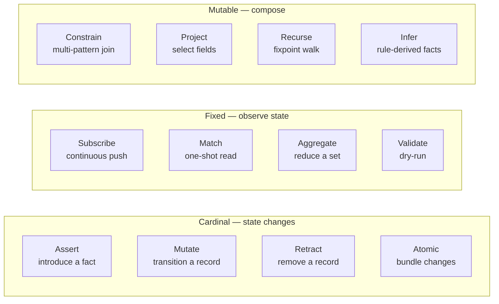
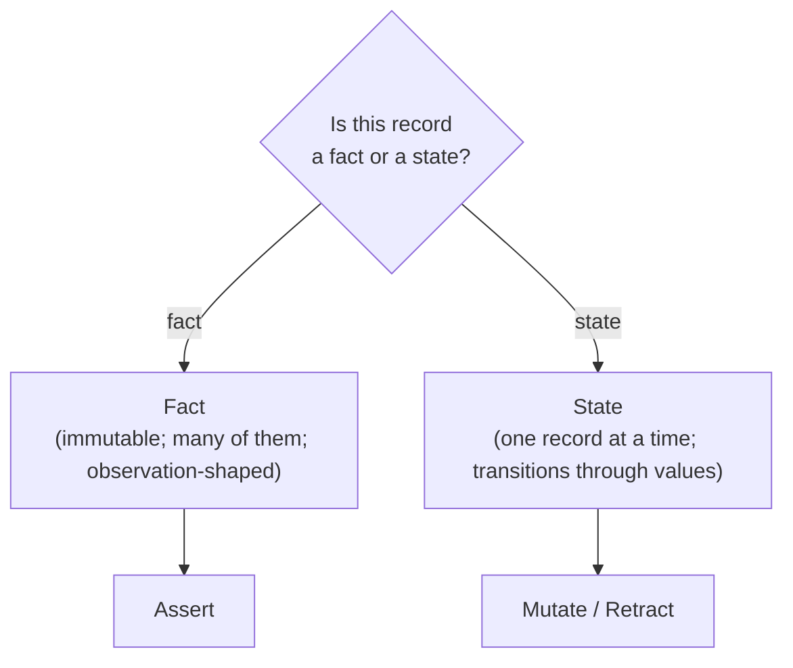
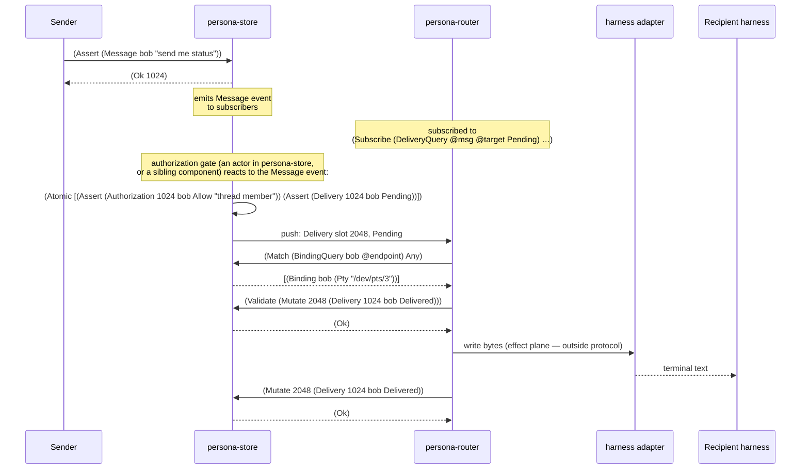
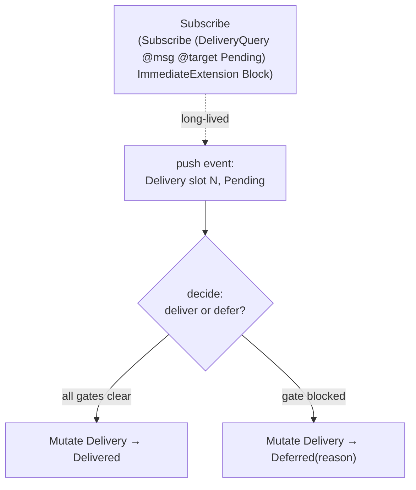

# The 12 verbs in Persona — every operation as a typed record-graph move

Status: design synthesis (answers user's question + destroys
three bad patterns this report originally committed)
Author: Claude (designer)

User's question: *"how the 12 verbs can cover the specific
usage of persona (like inter-agent messaging — should be a
type of Assert right?)"*

Short answer: **yes, sending a message is Assert.** Long
answer: every Persona operation lands as exactly one of the
12 verbs, and the mapping is exhaustive.

This report assumes report 21 (Persona on nexus) — that
Persona is record-graph-shaped and the protocol is signal's
universal verbs over Persona's typed records. Report 21
made the architectural call. **This report is the operational
table.**

The first version of this report (commit `09f67dd9`)
embedded three bad patterns in its examples:
agent-minted string IDs, sender names on the wire, and
agent-minted timestamps. **§1 destroys those patterns**
before the operational mapping starts; the principle has
been lifted to ESSENCE §"Infrastructure mints identity,
time, and sender."

---

## 0 · TL;DR



| Persona operation | Verb | Why this verb |
|---|---|---|
| Send a message | **Assert** | Introduce the `Message` record. The store assigns the slot. |
| Authorize a delivery | **Assert** | Introduce the `Authorization` record (Allow / Deny / Hold). |
| Start a delivery | **Assert** | Introduce the `Delivery` record (state = Pending). |
| Observe focus / window / input buffer | **Assert** | Each observation is a new immutable fact: `FocusObservation`, `WindowClosed`, `InputBufferObservation`. |
| Declare a harness | **Assert** | Introduce the `Harness` record (lifecycle = Declared). |
| Claim a workspace scope | **Assert** | Introduce a `Lock` record (status = Active). |
| Deliver a message (success) | **Mutate** | Delivery state Pending → Delivered. |
| Defer a delivery | **Mutate** | Delivery state Pending → Deferred(reason). |
| Expire a delivery | **Mutate** | Delivery state → Expired (TTL fired). |
| Move a binding | **Mutate** | Update `Binding.endpoint` to new transport. |
| Advance a harness lifecycle | **Mutate** | Driven by an `Observation` Assert. |
| Discharge a stuck delivery | **Retract** | Remove the `Delivery` record. |
| Lose a binding | **Retract** | Remove the `Binding` (typically driven by `WindowClosed` Assert). |
| Release a workspace scope | **Retract** | Remove (or zero out) the `Lock` record. |
| Authorize-and-deliver as one transaction | **Atomic** | Bundle `Assert Authorization` + `Assert Delivery`. |
| Hand a binding off across machines | **Atomic** | Bundle the binding swap so neither side observes a torn state. |
| Router's main loop | **Subscribe** | Push events for `(Delivery @msg @target Pending)`. |
| Live inbox / tail | **Subscribe** | Push events for `(Message @recipient @body)` filtered by recipient. |
| Viewer follows transcript | **Subscribe** | Push events for `(StreamFrame @harness @bytes)`. |
| Inbox listing (point-in-time) | **Match** | One-shot read for messages addressed to <recipient>. |
| Status command | **Match** | One-shot read for current `Lock` records. |
| Count pending by recipient | **Aggregate** | `(GroupBy target Count)` over `DeliveryQuery`. |
| Transcript size summary | **Aggregate** | `Sum` of byte counts over `StreamFrame` records. |
| Pre-flight a delivery | **Validate** | Dry-run the planned `Mutate` against the current state. |
| Find unbound deliveries | **Constrain** | `Delivery + Binding` joined on target with no Binding. |
| Tail with body only | **Project** | Select `body` field from the `MessageQuery` stream. |
| Reconstruct a thread | **Recurse** | Walk reply chains from a root message. |
| Propose a recovery | **Infer** | LLM-resilience rules generate `RecoveryProposal` records. |

**The verb is the protocol move; the record kind is what's
moved. Persona's contribution is the record kinds — not
the protocol.**

---

## 1 · Bad patterns destroyed

Three bad patterns from this report's first version. Each
is an instance of *the agent doing infrastructure's work*
— minting values the system would supply anyway, hiding
typed values inside strings, and stuffing what's already
on the connection back into the record body. They appear
together because they all collapse to one rule (now in
ESSENCE §"Infrastructure mints identity, time, and sender"):
**the wire carries only what the sender knows.**

### Bad pattern: agent-minted opaque string IDs

The first version wrote:

```
(Assert (Message m-2026-05-08-001 alice bob "send me status"))
```

`m-2026-05-08-001` is wrong four ways:

1. **The agent does the clock's work.** It computes
   `2026-05-08`, formats it ISO-8601-ish, splices it into
   the ID. None of that work is the agent's job.
2. **The agent maintains counter state** (`-001`).
   Counters are the worst kind of durable state for an
   agent — bad at it, no system support, easy to collide.
3. **A typed identity is hidden inside a string.** The
   record kind is `Message`, the identity is a `Slot<Message>`
   — both already typed. Stuffing date+counter into one
   opaque string adds a *parallel* identity scheme that the
   type system can't help with and the rest of the code
   has to ignore.
4. **The store is going to assign a slot anyway.** The
   agent's invented string is parallel-tracked alongside
   the real slot — overhead with no purpose.

**The fix.** The store mints `Slot<T>` on commit; the agent
receives it in the reply.

```nexus
;; Wire form the agent writes:
(Assert (Message bob "send me status"))

;; Reply carries the assigned slot:
(Ok 1024)

;; Future references use the slot:
(Mutate 1024 (Message bob "send me status edited"))
(Retract Message 1024)
```

Wire form on the read path: the surrounding record kind
(`Message`) is visible at the head identifier; the slot
`1024` is the identity. Humans reading the log see *what
kind of thing this is and which one it is* — without any
agent-minted prefix.

### Bad pattern: sender principal on the wire

The first version wrote:

```
(Assert (Message m-... alice bob "send me status"))
                  ^^^^^
                  sender named in the record body
```

`alice` as a field of `Message` is wrong:

1. **The connection is already authenticated.** Per
   `signal-persona/ARCHITECTURE.md` §1, every Frame
   carries an optional auth proof. The connection is
   authenticated *for* a principal before the assert
   crosses the wire.
2. **Self-naming is untrustworthy.** A model could write
   any name in the field. If the receiving side trusts
   that name, the model has just spoofed itself. If it
   doesn't, the field is dead weight.
3. **It duplicates what the auth layer already supplies.**
   The store knows who's connected; if the store stamps
   the sender on the durable record, it stamps it from
   auth, not from the agent's input.

The principle this enforces is in `persona-message`'s own
ARCHITECTURE.md §4 invariants: *"Sender identity is trusted
from process ancestry, not model text."* The first version
of this report violated that invariant by embedding the
sender in the model-supplied text.

**The fix.** Recipient stays — *addressing is content* —
but sender is from auth, not from the body.

```nexus
;; Sender comes from the connection's auth proof,
;; never from the wire form:
(Assert (Message bob "send me status"))
```

If a receiver wants the sender on the durable record, the
store stamps it from auth at commit time — same place the
slot is assigned. The agent's wire form has no sender
field at all.

### Bad pattern: agent-minted timestamps

The first version wrote:

```
(Assert (FocusObservation responder true "2026-05-08T14:00:00Z"))
(Assert (HarnessObservation h-001 Running "2026-05-08T14:00:00Z"))
(Lock designer Claude Active "2026-05-08T14:00:00Z" [...])
```

ISO-8601 strings as fields are wrong three ways:

1. **The agent does the clock's work.** The store knows
   when each commit happened to nanosecond precision; the
   agent doesn't need to tell it.
2. **A typed value is stuffed into a string.** A
   `Timestamp` is a typed thing; the string `"2026-05-08T14:00:00Z"`
   is its presentation form. Putting the presentation
   form on the wire skips the type.
3. **Commit time doesn't belong on the record.** The
   transition log entry the store appends carries the
   commit time. Putting a `commitedAt` field on every
   data record duplicates that information and pulls
   commit-time discipline out of where it belongs.

**The fix.** Observations carry only what the agent
observes. The transition log entry is where commit time
lives. Queries by time range read the log, not a timestamp
field on the record.

```nexus
;; Agent wire form — no timestamp:
(Assert (FocusObservation responder true))
(Assert (HarnessObservation 5001 Running))
(Assert (Lock designer Claude Active [(Scope "/home/li/primary/skills/jj.md" "edit")]))
```

The exception — *content* timestamps. A `Deadline`
expiration, a scheduled-message send-at, a TTL — these
are values the agent genuinely supplies. Wire form is the
typed `Timestamp` (a bare integer in `Slot<T>`-style
NotaTransparent shape — nanos since epoch — not a
string).

```nexus
;; Content timestamp — agent really does supply this:
(Assert (Deadline 4001 1715169600000000000))   ;; nanos since epoch
```

### The principle

The unifying test: ***could the system supply this value
without asking the agent?*** If yes, the agent must not
supply it.

| Value | Source | Wire form | Agent's job? |
|---|---|---|---|
| Record identity | Store assigns `Slot<T>` on commit | bare integer | **No.** |
| Commit time | Transition log entry stamped at commit | not on the record | **No.** |
| Sender principal | Connection auth proof | not on the record | **No.** |
| Recipient | Agent supplies (addressing) | typed `PrincipalName` | **Yes.** |
| Body | Agent supplies (content) | string | **Yes.** |
| State enum value | Agent supplies (which state to transition to) | typed enum variant | **Yes.** |
| Content timestamp (deadline, scheduled-at) | Agent supplies (real choice) | bare integer (typed `Timestamp`) | **Yes.** |

This rule lives at three levels — apex, skill, repo:

- **ESSENCE §"Infrastructure mints identity, time, and sender"** — the principle.
- **`~/primary/skills/rust-discipline.md` §"Don't hide typification in strings"** — the Rust enforcement, with concrete `format!("m-{}-...")` anti-patterns.
- **`~/primary/repos/persona-message/ARCHITECTURE.md` §4** — repo-level invariant on sender provenance. (Already present; this report cites it as canonical.)

The rest of this report's examples obey the rule.

---

## 2 · Yes — send a message is Assert

The user's hypothesis was exactly right. Concretely:

```nexus
;; Sender CLI (sender resolved from connection auth):
(Assert (Message bob "send me status"))
```

What happens server-side:

1. `nexus-daemon` decodes the text into `Request::Assert(AssertOperation::Message(Message { ... }))`.
2. `persona-store` validates the record (well-formed; recipient principal exists; sender is an authenticated principal able to send).
3. The store assigns a `Slot<Message>`, persists the record (rkyv inside redb), appends a transition log entry stamping commit time and the auth-proven sender.
4. The store emits the Assert as an event to every subscriber whose pattern matches.
5. The store replies with the assigned slot at the same connection position.

```nexus
;; Reply at same connection position:
(Ok 1024)
```

The message **exists** as a durable, slotted record. The
agent now has slot `1024` to reference it for any future
Mutate, Retract, or query. **Send = Assert.** No custom
verb. No "send command" enum variant in some Persona-
specific request type. The unifying insight of report 21:
**Persona's verbs aren't custom verbs; they're patterns of
the universal verbs over typed records.**

---

## 3 · The deeper insight: fact vs. state

The choice between Assert / Mutate / Retract is a domain
modelling question:



- **Facts are Assert.** Each fact is a separate record;
  asserting it adds it to the graph. Examples: every
  Message, every FocusObservation, every Authorization
  decision, every Transition.
- **State is Mutate (and Retract).** The record represents a
  thing whose value changes over time. Examples: the
  Delivery's progress through its state machine; the
  Harness's lifecycle; the Binding's endpoint.

The same domain concept can split into both shapes:

| Concept | Fact half (Assert) | State half (Mutate / Retract) |
|---|---|---|
| Messaging | `Message` (the message exists) | `Delivery` (the delivery's progress) |
| Harness | `HarnessObservation` (the observation happened) | `Harness` (the lifecycle) |
| System | `FocusObservation`, `WindowClosed` | `Binding` (which endpoint a target points to) |
| Coordination | `Transition` (the claim/release happened) | `Lock` (the current claim) |

This is the non-obvious design move: **don't collapse facts
into state-mutations.** A focus event is a *fact* (Asserted
once); the binding's reaction to it is a *state change*
(Mutate of Binding, or Retract on WindowClosed). Two records,
two verbs. The runtime is built on the wedge between them.

---

## 4 · Worked example — message lifecycle, end to end

One message from sender to delivered, every wire move named.
All slots come from the store; no agent-minted IDs; no
timestamps in record bodies; no sender on the wire.



Seven protocol moves. Every one is one of the 12 verbs:
Assert × 1 (the Message), Atomic × 1 (Authorization +
Delivery, bundled by the gate), Match × 1, Validate × 1,
Mutate × 1. Plus the long-lived Subscribe the router holds.

Every reference between records is by slot. The Authorization
references the Message at slot `1024` and the recipient
`bob`. The Delivery references the same Message slot and
recipient. The Mutate addresses the Delivery at its assigned
slot `2048`. There is no parallel string-ID space.

The **only thing outside the protocol** is the adapter's
"write bytes to the PTY" — that's the effect plane (per
report 21 §9). The reducer *decides* via Mutate; the
adapter *acts* on the decision. The verb names the decision;
the effect is the mechanism.

---

## 5 · Worked example — harness lifecycle

The harness lifecycle is the case where Assert and Mutate
combine cleanly. Note: no `h-001` agent-minted IDs; no
`"2026-05-08T..."` timestamps; the slot is the identity.

```nexus
;; 1. Caller declares the harness — no slot to put on the wire,
;;    the agent supplies content (principal, kind, command, node, lifecycle):
(Assert (Harness operator Terminal "claude" None Declared))

;; Reply carries the assigned slot:
(Ok 5001)

;; 2. Caller requests start — addresses the Harness by its slot:
(Mutate 5001 (Harness operator Terminal "claude" None Starting))

;; 3. Adapter observes the process is running.
;;    HarnessObservation is a NEW FACT (separate Assert), not a Harness mutation.
;;    No timestamp on the agent's wire — the transition log stamps commit time:
(Assert (HarnessObservation 5001 Running))

;; Reply carries the observation's slot:
(Ok 9001)

;; 4. Reducer wakes (subscribed to HarnessObservation),
;;    advances the Harness state in response:
(Mutate 5001 (Harness operator Terminal "claude" None Running))

;; 5. Later, observation says it's idle:
(Assert (HarnessObservation 5001 Idle))

;; 6. Reducer mutates Harness in response:
(Mutate 5001 (Harness operator Terminal "claude" None Idle))
```

Two record kinds: `Harness` (state) and `HarnessObservation`
(facts). The observations Assert; the Harness state Mutates.
The reducer is the bridge.

The non-obvious move (operator/9 didn't quite make this
explicit): **the Harness is mutated, not the observation.**
Observations are immutable facts; an observation that turns
out to be wrong is **superseded** by a later observation,
not corrected. The state record (Harness) interprets the
observation stream into a current value.

This is the same shape as the Binding ↔ WindowClosed
relationship: WindowClosed is an Assert (the fact that the
window closed); the Binding's Retract is the *consequence*
the reducer derives.

---

## 6 · The router's whole loop is two verbs

The router from report 21 §6, expressed in verb terms:



That's the entire router. Subscribe (long-lived) + Mutate
(per event). Optionally Match for context, Validate for
dry-run before commit, Atomic when bundling related changes.

**No router-specific verbs.** No Send / Deliver / Defer /
Discharge enum. Just nexus over Persona's record kinds.

---

## 7 · The orchestrate verbs collapse

Report 14 (persona-orchestrate) proposed three commands:
ClaimScope / ReleaseScope / Status. In universal-verb terms,
with slots not strings, and no agent-minted timestamps:

| orchestrate command | Universal verb form |
|---|---|
| `(ClaimScope designer Claude [(Scope ...) ...] "reason")` | `(Assert (Lock designer Claude Active [(Scope ...) ...]))` |
| `(ReleaseScope designer)` | `(Retract Lock <slot>)` (or `Mutate` to Idle if the record is preserved) |
| `(Status)` | `(Match (LockQuery @role @agent @status @scopes) Any)` |
| (subscription on lock changes — phase 4) | `(Subscribe (LockQuery @role @agent @status @scopes) ImmediateExtension Block)` |

The Lock record's `updated_at` field is gone — it lives on
the Transition log entry the store appends, not on the
durable Lock record. Per ESSENCE §"Infrastructure mints
identity, time, and sender," a record's commit time is not
the agent's job.

The Lock's reason is genuine prose content (the human
reasoning behind the claim), so it stays on the wire when
the agent supplies it; it would naturally live as an
optional field, omitted when the agent doesn't have one.

Once Persona absorbs persona-orchestrate (per report 14
phase 6), the CLI keeps `orchestrate '(ClaimScope ...)'` as
a sugar surface, but the wire move is `(Assert (Lock ...))`
through the Persona daemon. **One reducer; one verb set;
unified state.**

---

## 8 · The LLM-resilience plane stays inside the verbs

From report 26 §5, the resilience plane handles:
- Bind-resolution recovery (when a referenced principal /
  binding doesn't resolve).
- Type-expansion proposals (when several queries reference
  unknown kinds and the LLM proposes adding them).
- NL-to-typed translation (the outermost layer).

All three are **more record kinds, not more verbs**:

```nexus
;; Strict path failed: Binding for "bob" doesn't exist.
;; Resilience plane Asserts a proposal — slots are store-minted,
;; not agent-minted; the proposal references the failed Message slot:
(Assert (BindingResolutionProposal
  1024                               ;; the Message slot that failed to deliver
  bob                                ;; the unresolved name
  [(NearMatch bobby 0.92)            ;; LLM's nearest matches
   (NearMatch robert 0.71)]
  "fuzzy match across active principals"))

;; Reply: (Ok 7001)   ;; the Proposal's slot

;; A human or designated approver Asserts the choice,
;; referencing the proposal at slot 7001:
(Assert (BindingResolutionApproval 7001 bobby))

;; Reply: (Ok 7002)   ;; the Approval's slot

;; The original message is then Mutated to use the resolved binding
;; (or a new Authorization+Delivery is Asserted against the resolved target).
```

The verbs are the same 12. The **kinds** for the resilience
plane (Proposal, Approval, NearMatch, etc.) live inside
signal-persona alongside Message / Delivery / Binding. Or in
a separate signal-persona-resilient effect crate, depending
on how the layering grows.

---

## 9 · What's outside the verbs (and rightly so)

Three things Persona has that are *not* verbs:

| Concern | Where it lives | Why not a verb |
|---|---|---|
| **Effects** — writing bytes to a PTY, sending bytes over a network transport | Effect plane (adapters), per report 21 §9 | The verb is the *decision* (`Mutate Delivery → Delivered`); the effect is what the adapter does on behalf of the decision. Two different layers; only the decision is in the protocol. |
| **Replies** — `Ok <slot>`, `Diagnostic`, `Records<T>`, `Outcome` | signal's reply enum (closed) | Replies are the response side of every verb, not verbs themselves. Every Assert / Mutate / Retract / Match / etc. has a typed reply at the same connection position. |
| **Connection-level** — handshake, auth, version, sender-principal binding | Upstream of all 12 (per `signal-persona/ARCHITECTURE.md` — owned by signal, not signal-persona) | Once a connection is up, every frame is one of the 12 verbs. Handshake / auth / version negotiation are pre-protocol; the *who* of the sender is established here, not in the record body. |

Worth naming explicitly because operator / future readers
might wonder *"what about ack? what about heartbeat? what
about the schema-version check? where does the sender go?"*
— none of those are verbs. Ack is the Ok reply; heartbeat
is signal's connection-level ping; schema-version is a
record at the known-slot apex (read via Match on first
connect); sender is established by auth.

---

## 10 · Concrete examples per verb (Persona-flavoured)

All examples obey the rule from §1: no agent-minted IDs, no
sender on the wire, no agent-minted timestamps in record
bodies.

### Cardinal — state changes

```nexus
;; Assert — every "this happened" record.
;; Slot is store-assigned and returned in (Ok <slot>).
;; Sender is from the connection's auth proof.
(Assert (Message bob "hello"))
(Assert (FocusObservation responder true))
(Assert (Authorization 1024 bob Allow "thread member"))      ;; refs Message slot
(Assert (Harness operator Terminal "claude" None Declared))
(Assert (Lock designer Claude Active [(Scope "/home/li/primary/skills/jj.md" "edit")]))

;; Content timestamp — the agent really does supply this:
(Assert (Deadline 4001 1715169600000000000))                 ;; nanos since epoch

;; Mutate — every state-machine transition.
;; The leading slot identifies the record being mutated.
(Mutate 4001 (Delivery 1024 bob Delivered))                  ;; refs Message slot 1024
(Mutate 5001 (Harness operator Terminal "claude" None Running))
(Mutate 7001 (Binding bob (Pty "/dev/pts/4")))               ;; endpoint moved

;; Retract — every "this is gone"
(Retract Delivery 4001)                                      ;; manual discharge
(Retract Binding 7001)                                       ;; window closed
(Retract Lock 6001)                                          ;; scope released

;; Atomic — bundled commits.
;; Authorization references the Message slot (1024) directly;
;; Delivery references the same Message slot.
(Atomic [(Assert (Authorization 1024 bob Allow "thread member"))
         (Assert (Delivery 1024 bob Pending))])

;; Atomic — binding lost cascades:
(Atomic [(Retract Binding 7001)
         (Mutate 4001 (Delivery 1024 bob (Deferred BindingLost)))])
```

### Fixed — observation

```nexus
;; Subscribe — long-lived push
(Subscribe (DeliveryQuery @msg @target Pending) ImmediateExtension Block)
(Subscribe (MessageQuery bob @body) ImmediateExtension Block)        ;; tail bob's inbox
(Subscribe (FocusObservationQuery @target @focused) ImmediateExtension Block)

;; Match — one-shot
(Match (LockQuery @role @agent @status @scopes) Any)
(Match (MessageQuery bob @body) (Limit 50))
(Match (BindingQuery bob @endpoint) Any)

;; Aggregate — reduce
(Aggregate (DeliveryQuery @msg @target Pending) (GroupBy target Count))
(Aggregate (StreamFrameQuery 5001 @bytes) (Sum bytes))               ;; harness slot 5001

;; Validate — dry-run
(Validate (Mutate 4001 (Delivery 1024 bob Delivered)))
(Validate (Atomic [(Assert (Authorization 1024 bob Allow "..."))
                   (Assert (Delivery 1024 bob Pending))]))
```

### Mutable — composition

```nexus
;; Constrain — multi-pattern join.
;; "Find pending deliveries to targets that have no binding"
(Constrain
  [(DeliveryQuery @msg @target Pending)
   (BindingQuery @target @endpoint)]
  (Unify [target])
  Any)

;; Project — field selection
(Project (MessageQuery @recipient @body) (Fields [body]) Any)

;; Recurse — fixpoint walks.
;; "Walk a thread from this root message through all replies"
(Recurse
  (MessageQuery bob @body)                                           ;; start: messages to bob
  (ReplyQuery @reply @parent @body)
  Fixpoint)

;; Infer — rule-derived facts.
;; "Apply recovery rules to blocked harnesses; emit RecoveryProposal records"
(Infer (HarnessQuery @principal @kind @cmd @node Blocked) RecoveryRules)
```

These compile to the same closed Request enum signal-persona
will own. The grammar is fixed at 12 verbs; Persona's
contribution is **which records** appear inside the verb
arguments — and obeys ESSENCE §"Infrastructure mints
identity, time, and sender" everywhere.

---

## 11 · What this means for signal-persona's scope

Per report 21 §7, `signal-persona` owns *record kinds*, not
verbs. This report reaffirms: the 12 verbs from signal-core
suffice. signal-persona's surface is:

```rust
// signal-persona/src/lib.rs

// Re-exports from signal:
pub use signal::{Frame, FrameBody, Request, Reply, AuthProof, ...};

// Persona's record kinds — one module per concept:
pub mod message;        // Message + MessageQuery
pub mod delivery;       // Delivery, DeliveryState, BlockReason + DeliveryQuery
pub mod authorization;  // Authorization, Decision + AuthorizationQuery
pub mod binding;        // Binding, HarnessEndpoint + BindingQuery
pub mod harness;        // Harness, LifecycleState + HarnessQuery
pub mod observation;    // FocusObservation, InputBufferObservation, WindowClosed,
                        //   HarnessObservation + queries
pub mod lock;           // Lock, Scope, RoleName, LockStatus + LockQuery
pub mod transition;     // Transition + TransitionQuery
pub mod stream;         // StreamFrame + StreamFrameQuery
pub mod deadline;       // Deadline, DeadlineExpired + queries

// Per-verb payload enums extending signal's verb surface:
pub enum PersonaAssert { Message(Message), Delivery(Delivery), ... }
pub enum PersonaMutate { Delivery { slot, new, expected_rev }, Harness { ... }, ... }
pub enum PersonaRetract { Delivery(Slot<Delivery>), Binding(Slot<Binding>), ... }
pub enum PersonaQuery { Message(MessageQuery), Delivery(DeliveryQuery), ... }
pub enum PersonaRecords { Message(Vec<Message>), Delivery(Vec<Delivery>), ... }
```

**Every record in this list obeys the §1 rule.** No
agent-supplied identity field; no sender field; no
commit-time timestamp field. Identity is the slot the store
assigns. Sender is on the auth proof. Commit time is on the
Transition.

Concrete shape sketches (Rust, with the rule applied):

```rust
// Wrong — first-version sketch from this report
pub struct Message {
    pub id: MessageId,           // agent-minted opaque string — wrong
    pub sender: PrincipalName,   // already on auth — wrong
    pub recipient: PrincipalName,
    pub body: String,
    pub created_at: Timestamp,   // commit time — wrong
}

// Right — the agent's record carries only what the agent supplies
pub struct Message {
    pub recipient: PrincipalName,
    pub body: String,
}
```

The store's view of a committed Message can carry the
slot-and-sender-and-time, but those are accessed through
the *transition log* and the *slot mapping*, not through
fields the agent wrote.

What changes for the operator from this report:

1. **Bead `primary-tss`** (signal-persona type strengthening,
   per report 26 §10 recommendation 5) takes the **kinds-not-
   verbs** scope confirmed in report 21, and now **add the
   §1 discipline:** every record kind is reviewed against
   the rule before it's typed. ID fields, sender fields,
   commit-time fields are deleted.
2. **Operator/9's component split** (persona-message /
   persona-router / persona-system / persona-harness) stays
   intact. Each component is a signal-persona client that
   speaks the 12 universal verbs over the record kinds it
   produces / consumes — with the agent-supplies-only-content
   discipline applied.
3. **Report 4 (persona-messaging-design) §5.3 record
   sketches violate §1.** It uses `m-2026-05-06-001`,
   `from PrincipalName`, etc. across the Harness, Message,
   Authorization, Delivery sketches. Those sketches
   predate this principle; treat them as superseded. The
   record-kind table in §0 of this report is the new
   reference. Report 4's *architectural* content (one
   reducer, one state, push subscriptions, four planes,
   etc.) stands; only the literal record-field sketches
   need re-reading through the §1 rule.

---

## 12 · Open follow-ups

Two threads worth picking up next, deferred from this report:

1. **Predicate sub-language for Persona's `Pattern`.** The
   12 verbs handle every operation; some queries want
   predicates inside patterns (`bytesUsed > 1024`, `at >
   <nanos>`). Per report 26 §11, predicates land as typed
   records (e.g. `(LargerThan bytesUsed 1024)`,
   `(After at 1715169600000000000)`). The closed set of
   predicate kinds Persona needs is unsettled — message
   filtering, transition-log date ranges, byte-count
   thresholds. Worth a focused report when the first
   predicate-shaped feature is asked for.
2. **Reply shape for `Records<T>` over heterogeneous kinds.**
   When a `Match` returns mixed records (e.g. a Status reply
   carrying `Lock`s + `Bead`s), the reply shape is currently
   one `Records::Lock` + one `Records::Bead`. The cleaner
   alternative is a typed `StatusReply` record carrying
   both. Per `~/primary/skills/rust-discipline.md` §"One
   object in, one object out" — typed records, not anonymous
   tuples. Worth a sub-section in signal-persona's
   `ARCHITECTURE.md` once Status is implemented.

---

## 13 · See also

- `~/primary/ESSENCE.md` §"Infrastructure mints identity,
  time, and sender" — the principle §1 lifts to apex level.
- `~/primary/skills/rust-discipline.md` §"Don't hide
  typification in strings" — the Rust enforcement, with
  concrete `format!("m-{}-...")` anti-patterns and the
  store-mints-the-slot fix.
- `~/primary/repos/persona-message/ARCHITECTURE.md` §4
  invariants — *"Sender identity is trusted from process
  ancestry, not model text."* The repo-level statement of
  the sender-from-auth rule §1's second pattern enforces.
- `~/primary/reports/designer/4-persona-messaging-design.md`
  — the messaging fabric design; §5.3 record sketches predate
  the §1 discipline and are superseded.
- `~/primary/reports/designer/12-no-polling-delivery-design.md`
  — Subscribe is the runtime; this report names where the
  Subscribes are held.
- `~/primary/reports/designer/14-persona-orchestrate-design.md`
  — orchestration component; §7 of this report shows the
  collapse to universal verbs.
- `~/primary/reports/designer/21-persona-on-nexus.md`
  — the architectural call this report operationalises.
- `~/primary/reports/designer/26-twelve-verbs-as-zodiac.md`
  — the verb scaffold + zodiac structure; reads naturally
  alongside §0 of this report.
- `~/primary/repos/persona/ARCHITECTURE.md`
  — the apex; this report's mapping fills in what crosses
  the signal-persona seam.
- `~/primary/repos/signal-persona/ARCHITECTURE.md`
  — confirms scope: contract owns *types*, not verbs.

### Beads
- `primary-tss` — signal-persona type strengthening. Now
  scoped to *kinds, not verbs* per report 21 §7, with the
  §1 discipline applied to every kind: no agent-supplied
  identity, no sender field, no commit-time timestamp
  field.

---

*End report.*
