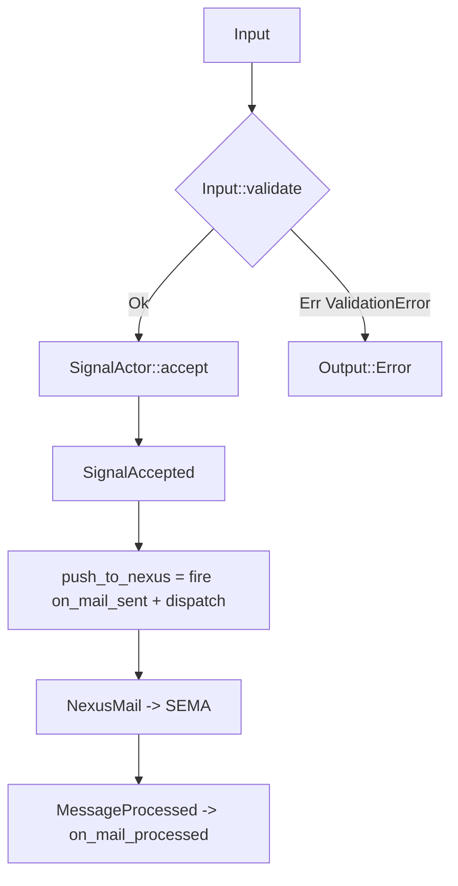
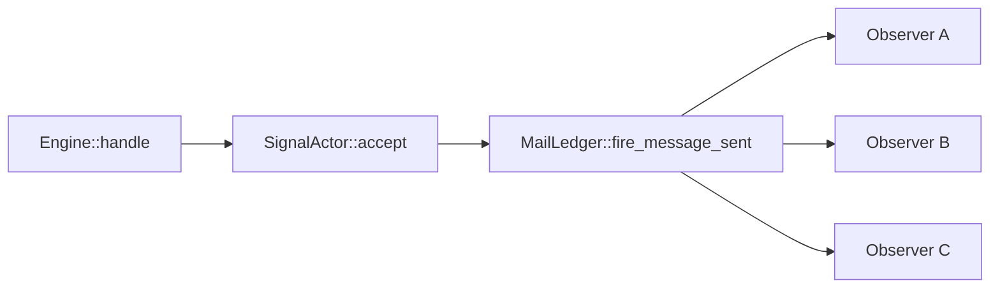

# 400 — Async mail on_sent pilot implementation

*Kind: Implementation · Topics: async-mail, on-sent, pattern-a, pilot, signal-actor · 2026-05-27*

*Per psyche directive: "Pattern A. Hookable lifecycle events. On sent.
Yeah, this is cool. Let's implement that and let's look at it in
implementation in our pilot project." Companion to /399 (Pattern A
synthesis), /397 (audit naming the multi-observer-fanout gap), and
operator's `spirit-next` main at 71618c6 which already had the
`MailLedgerEvent::Sent` / `MailLedgerEvent::Processed` shapes.*

## 1. What landed

**Branch:** `designer-on-sent-hookable-pilot-2026-05-27` in
`/git/github.com/LiGoldragon/spirit-next` (worktree at
`~/wt/github.com/LiGoldragon/spirit-next/designer-on-sent-hookable-pilot-2026-05-27`).

**Base:** operator's `main` at `71618c6` ("spirit: document async mail
actor flow").

**Commit:** `d2ccde92` — designer: SignalActor validation gate +
MailLedger multi-observer on_mail_sent / on_mail_processed fanout.

**Files changed (4):**

- `src/engine.rs` — added `SignalActor`, `SignalAccepted`,
  `ValidationError`, `MailLedger` (now pub/sub), `Subscription`,
  `SubscriptionId`; `Engine` rewired to dispatch through them.
- `src/lib.rs` — public exports for the new types.
- `ARCHITECTURE.md` — documented the validation gate + fanout
  mechanism under "Signal actor" and "Nexus — push and fanout".
- `tests/on_sent_hookable_pilot.rs` (new, 10 tests) — the visible
  proof of Pattern A in motion.

**Tests:** 21 pass total (up from 11) — 10 new in
`on_sent_hookable_pilot`, plus the 6 in `runtime_triad`, 4 in
`generated_signal_plane`, and 1 in `process_boundary`. Nix flake check
passes via `scripts/check-local-schema-stack --print-build-logs`.

## 2. The validation step — Signal actor as the gate

Per Pattern A (records 989 + 991): the Signal actor validates the
typed signal IN before pushing to Nexus. Validation is a method on
the **schema-emitted nouns** themselves (Pattern C — methods on
schema-generated types).

### Validation lives on the schema-emitted Signal nouns

```rust
impl Input {
    /// Validate this Signal input. The Signal actor calls this before
    /// pushing to Nexus; a failed validation means no `on_mail_sent`
    /// event fires and no Nexus dispatch happens.
    pub fn validate(&self) -> Result<(), ValidationError> {
        match self {
            Self::Record(entry) => entry.validate(),
            Self::Observe(query) => query.validate(),
        }
    }
}

impl Entry {
    pub fn validate(&self) -> Result<(), ValidationError> {
        if self.topic.0.trim().is_empty() {
            return Err(ValidationError::EmptyTopic);
        }
        if self.description.0.trim().is_empty() {
            return Err(ValidationError::EmptyDescription);
        }
        Ok(())
    }
}
```

`ValidationError` is a typed enum (no String typification):

```rust
#[derive(Clone, Debug, PartialEq, Eq)]
pub enum ValidationError {
    EmptyTopic,
    EmptyDescription,
    EmptyQueryTopic,
}
```

### The Signal actor calls validate() before minting an identifier

```rust
impl SignalActor {
    pub fn accept(&self, input: Input) -> Result<SignalAccepted, ValidationError> {
        input.validate()?;
        let identifier = self.issue_message_identifier();
        Ok(SignalAccepted {
            sent: input.message_sent(identifier),
            input,
        })
    }
}
```

The rejection path: when `accept` returns `Err`, the engine answers
with `Output::Error(...)` and the `MessageIdentifier` is never minted —
the message never existed in the protocol. The test
`rejected_input_does_not_fire_on_mail_sent_and_does_not_touch_sema`
witnesses all four properties: error output, empty observer log,
zero records, zero sent/processed events.

### The validate-then-push flow



The gate is `Input::validate`: only validated inputs become
`SignalAccepted`, which is the **only** way to call `push_to_nexus`.
The type system enforces that the validation step happens before any
push side-effect.

## 3. Multi-observer fanout — MailLedger as pub/sub

`MailLedger` is no longer a flat log; it's a publish/subscribe channel
that ALSO maintains an append-only log of every fired event.

### The Subscription API

```rust
impl MailLedger {
    pub fn on_mail_sent<Hook>(self: &Arc<Self>, hook: Hook) -> Subscription
    where
        Hook: MessageSentHook<Error = Infallible> + Send + 'static,
    { /* ... */ }

    pub fn on_mail_processed<Hook>(self: &Arc<Self>, hook: Hook) -> Subscription
    where
        Hook: MessageProcessedHook<Output, Error = Infallible> + Send + 'static,
    { /* ... */ }
}
```

Observers are typed `MessageSentHook` / `MessageProcessedHook<Output>`
implementations — the **schema-emitted hook traits** (Pattern C
again). The `Subscription` handle uses RAII: dropping it un-registers
the observer. The signature is `Arc<Self>` because the `Subscription`
must hold a back-reference to the ledger to clean up on drop.

### The keystone test — multi-observer fanout

```rust
#[test]
fn multiple_observers_all_receive_each_on_mail_sent_event() {
    let engine = Engine::default();
    let ledger = engine.mail_ledger_handle();

    let log_a: Arc<Mutex<Vec<String>>> = Arc::default();
    let _sub_a = ledger.on_mail_sent(LoggingObserver::new("alpha", Arc::clone(&log_a)));

    let counter_b = Arc::new(Mutex::new(CountingObserver::default()));
    let _sub_b = ledger.on_mail_sent_shared(Arc::clone(&counter_b));

    let log_c: Arc<Mutex<Vec<String>>> = Arc::default();
    let _sub_c = ledger.on_mail_sent(LoggingObserver::new("gamma", Arc::clone(&log_c)));

    assert_eq!(ledger.sent_subscriber_count(), 3);

    engine.handle(Input::Record(entry("first")));
    engine.handle(Input::Record(entry("second")));
    engine.handle(Input::Record(entry("third")));

    assert_eq!(log_a.lock().expect("log_a").len(), 3);
    assert_eq!(counter_b.lock().expect("counter_b").seen(), 3);
    assert_eq!(log_c.lock().expect("log_c").len(), 3);

    assert_eq!(log_a.lock().unwrap().clone(),
        vec!["alpha:sent:1", "alpha:sent:2", "alpha:sent:3"]);
    assert_eq!(log_c.lock().unwrap().clone(),
        vec!["gamma:sent:1", "gamma:sent:2", "gamma:sent:3"]);
}
```

Three independent observers, each implementing the schema-emitted
`MessageSentHook` trait, all attached to one `MailLedger`, all
receive every push. The `Subscription` handles are held in
underscored bindings so they live for the duration of the test;
dropping them would unsubscribe.

### Subscription RAII — drop unregisters

```rust
#[test]
fn subscription_drop_unregisters_the_observer() {
    let engine = Engine::default();
    let ledger = engine.mail_ledger_handle();

    let counter = Arc::new(Mutex::new(CountingObserver::default()));
    let subscription = ledger.on_mail_sent_shared(Arc::clone(&counter));
    assert_eq!(ledger.sent_subscriber_count(), 1);

    engine.handle(Input::Record(entry("before drop")));
    assert_eq!(counter.lock().unwrap().seen(), 1);

    drop(subscription);
    assert_eq!(ledger.sent_subscriber_count(), 0);

    engine.handle(Input::Record(entry("after drop")));
    assert_eq!(counter.lock().unwrap().seen(), 1); // unchanged
}
```

### The fanout topology



One push, N typed observers. The `MailLedger` holds
`Mutex<Vec<SentSubscription>>`; each subscription carries an
`Arc<Mutex<dyn MessageSentHook<Error = Infallible> + Send>>`. Fanout
iterates and dispatches the cloned `MessageSent` event into every
hook.

## 4. Test results

```
running 10 tests   [on_sent_hookable_pilot]
test signal_actor_validates_input_before_pushing_to_nexus               ok
test validation_rejects_empty_topic_with_typed_error                    ok
test validation_rejects_empty_description_with_typed_error              ok
test validation_rejects_observe_with_empty_topic                        ok
test rejected_input_does_not_fire_on_mail_sent_and_does_not_touch_sema  ok
test single_observer_receives_on_mail_sent_for_valid_push               ok
test multiple_observers_all_receive_each_on_mail_sent_event             ok
test subscription_drop_unregisters_the_observer                         ok
test on_mail_processed_fanout_fires_after_sema_reply                    ok
test full_pattern_a_walk_validates_then_pushes_then_processes_with_observers ok

test result: ok. 10 passed; 0 failed; 0 ignored; 0 measured

Total across all test crates: 21 passed; 0 failed
(generated_signal_plane: 4, on_sent_hookable_pilot: 10,
 process_boundary: 1, runtime_triad: 6)

Nix: scripts/check-local-schema-stack --print-build-logs -> all checks passed!
```

## 5. Bead update — primary-lrf8 progress

Bead `primary-lrf8` ("Promote mail handling to explicit queue + fanout
observers") was at PARTIAL — Signal->Nexus->SEMA was wired and
`MailLedgerEvent` was being recorded, but observers couldn't attach,
the validation gate didn't exist, and the API was the internal hook
trait only.

This implementation advances the bead on its SUBSCRIBE/FANOUT face:

| Capability | Before | After |
|---|---|---|
| Signal validation gate | absent | `Input::validate` + `SignalActor::accept` |
| Typed validation errors | absent | `ValidationError` (3 variants) |
| External hook attachment | not possible | `MailLedger::on_mail_sent` returns `Subscription` |
| Multi-observer fanout | single internal hook | unbounded; demonstrated with 3-observer test |
| Subscription lifecycle | n/a | RAII: drop unregisters |
| Processed-event fanout | absent | `on_mail_processed` returns `Subscription` |

Pattern A is now visible in the pilot's code AND in tests that assert
the validate-then-push discipline, the multi-observer broadcast, and
the subscription lifecycle.

## 6. What's still open from primary-lrf8

Per the directive's "What to AVOID" — the async queue + worker drain
piece is NOT in this dispatch. The current implementation is
synchronous: `Engine::handle` blocks through validation, push, SEMA,
and processed-fanout all on the caller's thread. The remaining
primary-lrf8 work (a separate dispatch, separate bead-segment):

- **Bounded mail queue.** `Engine::submit(input)` returns immediately
  with a `MailIdentifier`; the queue accepts the validated mail item.
- **Worker thread that drains the queue.** SEMA application runs on
  the worker, not on the caller's thread.
- **Async reply.** The caller's `MessageIdentifier` correlates with
  the eventual processed event arriving through `on_mail_processed`.
- **Backpressure when the queue is full.** A `SubmitError::QueueFull`
  return path; consider whether `SignalActor::accept` should observe
  backpressure as part of admission.
- **Graceful shutdown.** Worker drains in-flight mail before exit.

The SUBSCRIBE/FANOUT side landed; the QUEUE/WORKER side is the
companion slice.

## 7. Adjacent work — schema-emission for ValidationError

For this dispatch I kept `ValidationError` as a hand-written enum in
`engine.rs`. A future slice could promote it into `schema/lib.schema`
so it becomes a schema-emitted noun (and naturally participates in
the wire `Output::Error` shape). That requires extending the schema
language with a sibling-of-Output union or a separate
`SignalValidationOutput` plane. Not in scope for this dispatch; the
directive explicitly said "the point is to DEMONSTRATE the gate
exists and works, not to enumerate every real validation."

The current shape is good prototype substance: the validate-then-push
discipline is in place, the typed error propagates to `Output::Error`,
and the test
`rejected_input_does_not_fire_on_mail_sent_and_does_not_touch_sema`
proves the gate has all four downstream-suppression properties.

## 8. Chat-side substance

The branch is `designer-on-sent-hookable-pilot-2026-05-27` at commit
`d2ccde92`. The visible end-to-end witness lives in
`full_pattern_a_walk_validates_then_pushes_then_processes_with_observers`
— a single test that fires one valid record, one invalid record, one
valid observe through a single engine with two observers attached
(one for sent, one for processed) and asserts the log sees
`[flow:sent:1, flow:processed:1, flow:sent:2, flow:processed:2]` —
the rejected message produced no events at all.

The Pattern A discipline is now realised in the pilot's code: the
type system makes the validation gate non-bypassable
(`SignalAccepted` cannot be constructed without going through
`SignalActor::accept`, and `push_to_nexus` takes `SignalAccepted`
by value), the schema-emitted Signal nouns own their validation
method, and the `MailLedger` is a real publish/subscribe channel with
RAII subscription lifecycle.
