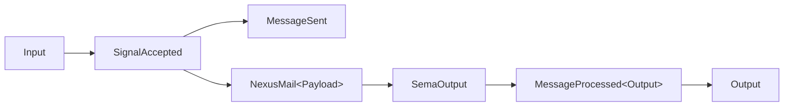
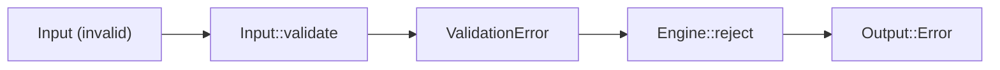
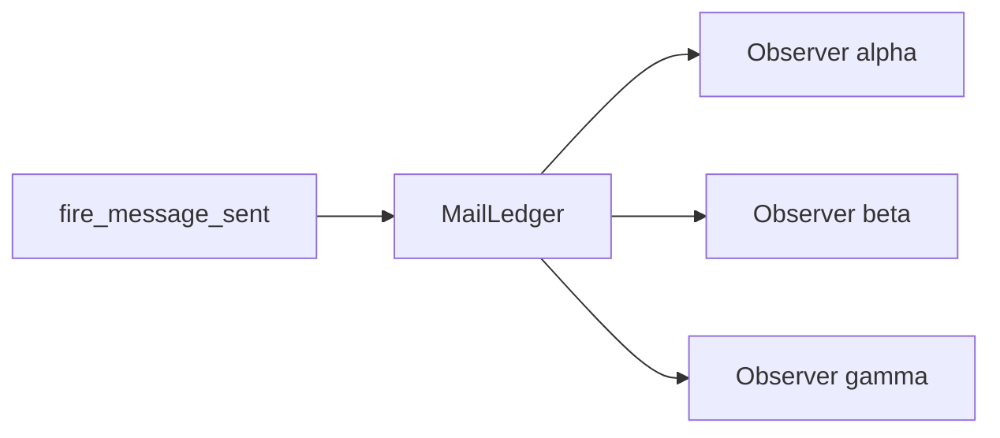
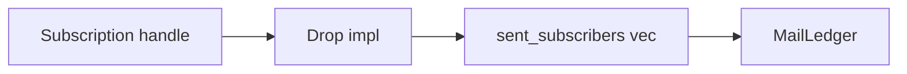
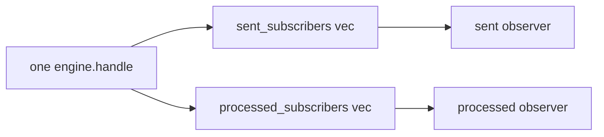
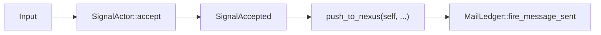
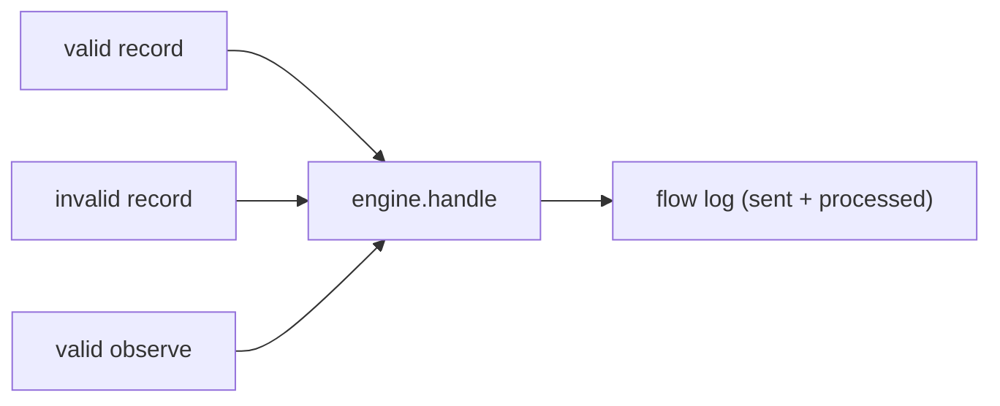

# 401 — Async mail Pattern A walkthrough

*Kind: Design · Topics: async-mail, pattern-a, walkthrough, signal-actor, pilot · 2026-05-27*

*Per psyche directive 2026-05-27: "show me how it works with visuals
and code of real tests. improve the tests first." Companion to /399
(Pattern A synthesis, all six recurring patterns), /400 (implementation
report for the pilot landing). Intent anchors: 935, 962, 963, 970, 989,
991, 993, 994.*

## Frame

**Pattern A** — *async lives at the data-type level* — is the
workspace-wide commitment that async correlation, message lifecycle,
and observer notification are CARRIED BY THE TYPED MESSAGE OBJECTS
THEMSELVES, not imposed externally by polling or hidden state machinery.
Messages move through a universal MAIL MECHANISM (Signal → Nexus →
SEMA) with hookable lifecycle events (`on_mail_sent`,
`on_mail_processed`); observers attach methods on typed mail-event
objects via a publish/subscribe channel; the type system makes the
validation gate non-bypassable.

This report illustrates Pattern A through the pilot landing at
`spirit-next` branch `designer-on-sent-hookable-pilot-2026-05-27`
(commit `ea0b98fb`). Each invariant gets a focused mermaid diagram
(4-7 nodes per record 912) and a real test-code excerpt from the
improved test surface.

The pilot's exported surface — the nouns the diagrams will reference:

| Type | Role in Pattern A |
|---|---|
| `Input`, `Entry`, `Query` | Schema-emitted Signal-plane nouns; carry `validate()` methods |
| `ValidationError` | Typed admission-control error (3 variants) |
| `SignalActor` | The validation/admission gate at the wire boundary |
| `SignalAccepted` | Typed witness that validation ran and passed |
| `MailLedger` | Publish/subscribe channel + append-only event log |
| `Subscription` | RAII handle; drop unsubscribes |
| `MessageSent`, `MessageProcessed<Output>` | Schema-emitted lifecycle events fanned out by the ledger |
| `MessageSentHook`, `MessageProcessedHook<Output>` | Schema-emitted hook traits observers implement |

## Test improvements applied

Phase 1 of the directive: improve the 10 tests added in commit
`d2ccde92` so they read as **design examples** — one concept per test,
short inline fixtures, assertion exposing the key design point, named
after the invariant they prove, and a `// PATTERN:` comment at the top
naming the invariant. Improvements landed in commit
`ea0b98fb` (`refine pattern-a tests as design examples + add 3
invariant-witnesses`).

The header comment block of the test file now enumerates the 8
invariants the file proves. Per-test changes:

| Old name | New name | What changed |
|---|---|---|
| `signal_actor_validates_input_before_pushing_to_nexus` | `signal_actor_accept_returns_signal_accepted_for_valid_input` | Name now reads as the invariant (typed-witness production), not as activity ("validates… before pushing"). Body unchanged. |
| (n/a — new) | `signal_actor_mints_message_identifiers_strictly_in_order` | **NEW.** Witnesses identifier monotonicity AND that rejected accepts do not consume identifiers. Pattern A invariant: rejected messages never existed in the protocol. |
| `validation_rejects_empty_topic_with_typed_error` | `empty_topic_in_record_returns_typed_validation_error` | Name now leads with the cause (empty topic) and ends with the invariant (typed error). |
| `validation_rejects_empty_description_with_typed_error` | `empty_description_in_record_returns_typed_validation_error` | Same shape: cause → typed-error invariant. |
| `validation_rejects_observe_with_empty_topic` | `empty_topic_in_observe_returns_typed_query_topic_error` | Names the SPECIFIC variant (`EmptyQueryTopic`) — schema variants own their error vocabulary. |
| `rejected_input_does_not_fire_on_mail_sent_and_does_not_touch_sema` | `rejected_input_suppresses_all_four_downstream_side_effects` | Now also subscribes to `on_mail_processed` (previously only `on_mail_sent`); asserts neither channel fires. Name shortened. |
| `single_observer_receives_on_mail_sent_for_valid_push` | (removed — folded into the type-level witness test below) | The verbose `InfallibleNexus` definition was scaffolding noise. Same proof now lives in `signal_accepted_can_only_be_produced_by_signal_actor_accept` which uses the witness AND exercises `push_to_nexus`. |
| `multiple_observers_all_receive_each_on_mail_sent_event` | `one_push_fans_out_to_every_attached_on_mail_sent_observer` | Name reframed as the invariant (one push → N observers), not the activity ("multiple observers receive"). |
| (n/a — new) | `observer_registration_order_does_not_change_the_event_stream` | **NEW.** Witnesses that attach-order doesn't influence what observers see. Uses a `capture_stream` helper to make the symmetry obvious. |
| `subscription_drop_unregisters_the_observer` | (unchanged) | Already names the RAII invariant cleanly. |
| (n/a — new) | `on_mail_sent_and_on_mail_processed_are_separate_channels` | **NEW.** Witnesses channel-isolation: one observer on `on_mail_sent` does NOT receive `on_mail_processed` events. |
| `on_mail_processed_fanout_fires_after_sema_reply` | (unchanged) | Names the lifecycle ordering invariant. |
| (n/a — new) | `signal_accepted_can_only_be_produced_by_signal_actor_accept` | **NEW.** Witnesses type-level non-bypassability — the `?` in the body would not type-check if any other constructor existed for `SignalAccepted`. Replaces the deleted single-observer test. |
| `full_pattern_a_walk_validates_then_pushes_then_processes_with_observers` | `full_pattern_a_walk_validates_pushes_processes_with_observers` | Name trimmed; body unchanged. |

**Net test count:** 10 → 13 (three new invariant-witnesses). One test
(`single_observer_receives_on_mail_sent_for_valid_push`) was folded
into `signal_accepted_can_only_be_produced_by_signal_actor_accept`,
which proves more.

**Full test run:** all 13 in `on_sent_hookable_pilot` pass, plus 4 in
`generated_signal_plane`, 1 in `process_boundary`, and 6 in
`runtime_triad` — 24 tests total across the crate, 0 failures.

## Walkthrough

Six focused diagrams, each answering one question.

### 1. The validate-then-push flow

**Question.** What sequence of typed objects flows from `Input` to
the `Output` reply along the happy path?



The happy-path flow is a chain of TYPED objects — each step is a
schema-emitted noun with methods on it. `Input::validate` runs first
(on the schema-emitted Signal noun); on success, `SignalActor::accept`
mints a `MessageIdentifier` and returns a `SignalAccepted` witness.
`push_to_nexus` fires the `MessageSent` event into `MailLedger` and
dispatches the `NexusMail<Payload>` through Nexus to SEMA. SEMA returns
a `SemaOutput`, which maps back to a Signal `Output`, which `MailLedger`
broadcasts as `MessageProcessed<Output>`.

The witnessing test:

```rust
#[test]
fn signal_actor_accept_returns_signal_accepted_for_valid_input() {
    // PATTERN: validated input becomes a typed SignalAccepted witness.
    let actor = SignalActor::default();
    let accepted = actor
        .accept(Input::Record(entry("valid input")))
        .expect("valid input accepts");
    assert_eq!(accepted.identifier(), MessageIdentifier(1));
}
```

The `SignalAccepted` returned from `accept` IS the type-level proof
that validation ran and passed. Nothing further can happen without
this witness in hand.

### 2. The validation rejection path

**Question.** What topology does a rejected input traverse?



A failed validation short-circuits the entire downstream chain. No
`SignalAccepted` is constructed, so `push_to_nexus` cannot be called
— the type system enforces this. No `MessageSent` event is created,
so `MailLedger` has nothing to fan out. No `NexusMail` is built, so
Nexus and SEMA never see the input. `Output::Error` is the only
visible result.

The keystone witness:

```rust
#[test]
fn rejected_input_suppresses_all_four_downstream_side_effects() {
    // PATTERN: a failed validation suppresses EVERY downstream effect.
    let engine = Engine::default();
    let ledger = engine.mail_ledger_handle();
    let log: Arc<Mutex<Vec<String>>> = Arc::default();
    let _sent_watcher = ledger.on_mail_sent(LoggingObserver::new("watcher", Arc::clone(&log)));
    let _processed_watcher =
        ledger.on_mail_processed(LoggingObserver::new("watcher", Arc::clone(&log)));

    let mut bad = entry("placeholder description");
    bad.topic = Topic(String::new());
    let response = engine.handle(Input::Record(bad));

    assert!(matches!(response, Output::Error(_)));
    assert!(log.lock().expect("log").is_empty());
    assert_eq!(engine.record_count(), 0);
    assert_eq!(engine.sent_message_count(), 0);
    assert_eq!(engine.processed_message_count(), 0);
}
```

Five assertions, one invariant: **the validation gate has no
downstream leak**. The empty log proves neither channel fired; the
zero counts prove neither SEMA nor the ledger's append-only log
recorded anything.

### 3. Multi-observer fanout topology

**Question.** What does one `MessageSent` push look like at the
`MailLedger` boundary when N observers are attached?



`MailLedger` holds a `Mutex<Vec<SentSubscription>>`. `fire_message_sent`
appends the event to the ledger's own log AND iterates the subscriber
list, dispatching the cloned `MessageSent` event into every hook's
`message_sent` method. The fanout is by-broadcast — every observer
sees every event, in the same identifier sequence.

```rust
#[test]
fn one_push_fans_out_to_every_attached_on_mail_sent_observer() {
    // PATTERN: the MailLedger is a publish/subscribe channel.
    let engine = Engine::default();
    let ledger = engine.mail_ledger_handle();
    let log_a: Arc<Mutex<Vec<String>>> = Arc::default();
    let _sub_a = ledger.on_mail_sent(LoggingObserver::new("alpha", Arc::clone(&log_a)));
    let counter_b = Arc::new(Mutex::new(CountingObserver::default()));
    let _sub_b = ledger.on_mail_sent_shared(Arc::clone(&counter_b));
    let log_c: Arc<Mutex<Vec<String>>> = Arc::default();
    let _sub_c = ledger.on_mail_sent(LoggingObserver::new("gamma", Arc::clone(&log_c)));

    engine.handle(Input::Record(entry("first")));
    engine.handle(Input::Record(entry("second")));
    engine.handle(Input::Record(entry("third")));

    assert_eq!(log_a.lock().expect("log_a").len(), 3);
    assert_eq!(counter_b.lock().expect("counter_b").seen(), 3);
    assert_eq!(log_c.lock().expect("log_c").len(), 3);
}
```

Three independent observers (two `LoggingObserver`s with distinct
labels + one `CountingObserver`); three pushes; each observer's local
state shows all three events. The fanout is unbounded — adding more
observers requires no engine change.

### 4. RAII subscription lifecycle

**Question.** How does an observer detach from the fanout?



`Subscription` carries an `Arc<MailLedger>` back-reference plus the
`SubscriptionId` and `SubscriptionKind` (Sent or Processed). Its
`Drop` impl walks the matching subscriber vec and removes the entry
with the matching `id`. No explicit `unsubscribe` call; binding the
returned `Subscription` to a variable keeps the registration alive
for its scope.

```rust
#[test]
fn subscription_drop_unregisters_the_observer() {
    // PATTERN: Subscription is RAII. Drop removes the observer.
    let engine = Engine::default();
    let ledger = engine.mail_ledger_handle();
    let counter = Arc::new(Mutex::new(CountingObserver::default()));
    let subscription = ledger.on_mail_sent_shared(Arc::clone(&counter));

    engine.handle(Input::Record(entry("before drop")));
    assert_eq!(counter.lock().expect("counter").seen(), 1);

    drop(subscription);
    assert_eq!(ledger.sent_subscriber_count(), 0);

    engine.handle(Input::Record(entry("after drop")));
    assert_eq!(counter.lock().expect("counter").seen(), 1);
}
```

The before-drop push reaches the observer; the after-drop push does
not. The `counter`'s `Arc` is still live (the test still holds it),
but the `Subscription` is gone — the observer is detached from the
fanout. The `#[must_use]` attribute on `Subscription` prevents
accidental drops at the call site.

### 5. Two separate fanout channels

**Question.** Do `on_mail_sent` and `on_mail_processed` share a
subscriber list, or are they independent?



`MailLedger` holds two independent subscriber vectors. One full
`engine.handle` cycle fires `fire_message_sent` (broadcasting to
`sent_subscribers`) and later `fire_message_processed` (broadcasting
to `processed_subscribers`). An observer attached only to `on_mail_sent`
sees only sent events; an observer attached only to `on_mail_processed`
sees only processed events. The same `LoggingObserver` type implements
both hook traits, so a single observer CAN attach to both channels
separately — but each attachment is its own subscription.

```rust
#[test]
fn on_mail_sent_and_on_mail_processed_are_separate_channels() {
    // PATTERN: on_mail_sent and on_mail_processed are SEPARATE channels.
    let engine = Engine::default();
    let ledger = engine.mail_ledger_handle();
    let sent_log: Arc<Mutex<Vec<String>>> = Arc::default();
    let _sent_sub = ledger.on_mail_sent(LoggingObserver::new("sent", Arc::clone(&sent_log)));
    let processed_log: Arc<Mutex<Vec<String>>> = Arc::default();
    let _processed_sub =
        ledger.on_mail_processed(LoggingObserver::new("processed", Arc::clone(&processed_log)));

    engine.handle(Input::Record(entry("crosses both channels")));

    assert_eq!(*sent_log.lock().expect("sent_log"), vec!["sent:sent:1"]);
    assert_eq!(*processed_log.lock().expect("processed_log"), vec!["processed:processed:1"]);
}
```

Each log holds exactly one entry — the entry from its own channel.
Channel-A's observer did not receive Channel-B's event, and vice
versa.

### 6. Type-level non-bypassability of SignalAccepted

**Question.** How does the type system prevent a caller from
constructing `SignalAccepted` outside `SignalActor::accept`?



`SignalAccepted` has private fields (`input: Input`, `sent:
MessageSent`) and the struct itself is `pub` but not constructible
from outside `engine.rs` — there is no `pub fn new`. The only call
site is `SignalActor::accept`, which forces `input.validate()?`
first. `push_to_nexus` takes `self` BY VALUE, so calling it requires
*owning* a `SignalAccepted`, which requires a successful `accept`
call. The whole sequence is type-enforced at the call site.

The witness test exercises the contract through the only available
public path:

```rust
#[test]
fn signal_accepted_can_only_be_produced_by_signal_actor_accept() {
    // PATTERN: the only constructor for SignalAccepted is SignalActor::accept.
    let actor = SignalActor::default();
    let ledger = Arc::new(MailLedger::new());

    let accepted = actor
        .accept(Input::Record(entry("witness")))
        .expect("valid input");
    accepted
        .push_to_nexus(&InfallibleNexus, &ledger)
        .expect("infallible nexus");

    assert_eq!(ledger.sent_message_count(), 1);
}
```

The `?`/`expect` on `accept` is the only handle producing a
`SignalAccepted`; if any other constructor existed, the test would
not need to go through it. Removing `accept` from the public API
would break this test (and every caller of `push_to_nexus`) — the
type system carries the discipline, not a runtime check.

### 7. End-to-end Pattern A in motion

**Question.** What does the full Pattern A walk look like with both
channels live?



The end-to-end witness fires three inputs through one engine with
ONE observer (the `LoggingObserver` labeled "flow") attached to BOTH
channels. The log shape encodes the entire Pattern A invariant:
valid inputs produce `sent` then `processed` events, the rejected
input produces neither.

```rust
#[test]
fn full_pattern_a_walk_validates_pushes_processes_with_observers() {
    let engine = Engine::default();
    let ledger = engine.mail_ledger_handle();
    let log: Arc<Mutex<Vec<String>>> = Arc::default();
    let _sent = ledger.on_mail_sent(LoggingObserver::new("flow", Arc::clone(&log)));
    let _processed = ledger.on_mail_processed(LoggingObserver::new("flow", Arc::clone(&log)));

    engine.handle(Input::Record(entry("first valid")));
    let mut bad = entry("placeholder");
    bad.description = Description(String::new());
    engine.handle(Input::Record(bad));
    engine.handle(observe());

    assert_eq!(
        *log.lock().expect("log"),
        vec![
            "flow:sent:1",
            "flow:processed:1",
            "flow:sent:2",
            "flow:processed:2",
        ],
    );
}
```

The log says it all: identifier 1 (first valid record) produces
`sent:1` then `processed:1`; the invalid record produces nothing;
identifier 2 (the observe — note: identifier 2, not 3, because the
rejected accept never minted an identifier) produces `sent:2` then
`processed:2`. Four log lines for three inputs — that gap is
Pattern A's gate in action.

## Coverage check

Pattern A invariants now visible from the test surface:

| Invariant | Witnessed by |
|---|---|
| Validation lives on schema-emitted Signal nouns | `signal_actor_accept_returns_signal_accepted_for_valid_input` |
| Identifier minting is monotonic; rejected accepts skip identifiers | `signal_actor_mints_message_identifiers_strictly_in_order` |
| Each validation failure mode has a distinct typed error variant | `empty_topic_in_record_…`, `empty_description_in_record_…`, `empty_topic_in_observe_…` |
| A failed validation has no downstream side-effects (4 properties) | `rejected_input_suppresses_all_four_downstream_side_effects` |
| MailLedger is a publish/subscribe channel | `one_push_fans_out_to_every_attached_on_mail_sent_observer` |
| Observer attach-order does not change events received | `observer_registration_order_does_not_change_the_event_stream` |
| Subscription is RAII; drop unregisters | `subscription_drop_unregisters_the_observer` |
| on_mail_sent and on_mail_processed are separate channels | `on_mail_sent_and_on_mail_processed_are_separate_channels` |
| on_mail_processed fires AFTER SEMA reply | `on_mail_processed_fanout_fires_after_sema_reply` |
| SignalAccepted is non-bypassable (type-level) | `signal_accepted_can_only_be_produced_by_signal_actor_accept` |
| Full Pattern A walk end-to-end | `full_pattern_a_walk_validates_pushes_processes_with_observers` |

11 invariants → 13 tests (the typed-error invariant has three witnesses,
one per failure mode).

## Open — Pattern A invariants the tests do not yet expose

1. **Async queue + worker drain** — Pattern A's full shape includes
   the async behaviour where `Engine::submit(input)` returns
   immediately with a `MailIdentifier` and a worker drains the
   queue. The current implementation is synchronous (`Engine::handle`
   blocks through validation, push, SEMA, and processed-fanout). No
   test exercises an async submit/drain split because the
   implementation does not yet have it. Carry-forward in
   `primary-lrf8` QUEUE/WORKER slice.

2. **Backpressure** — if the queue is bounded and fills, what happens
   at `SignalActor::accept` admission time? Not yet a question the
   pilot can answer; depends on (1).

3. **Hook error propagation** — observers currently are typed with
   `Error = Infallible`, so the `.ok()` after `hook.message_sent(…)`
   in `MailLedger::fire_message_sent` is structurally unreachable. A
   future iteration could allow fallible hooks; the test surface
   would gain a witness for hook-error isolation (one hook's failure
   doesn't suppress fanout to the rest).

4. **Compile-fail proof for SignalAccepted bypass** — test #6
   witnesses the type-level constraint by exercising the only valid
   path, but does not assert *via the compiler* that an alternative
   path fails. A `trybuild` test that tries to construct
   `SignalAccepted { input, sent }` directly and confirms the
   compiler rejects it would make the non-bypassability invariant
   directly testable. Not blocking; the runtime witness is
   sufficient for the pilot.

5. **Multi-thread fanout** — the current tests are single-threaded.
   Pattern A's intent (record 970, Nexus is the mail keeper) carries
   no explicit threading constraint, but the `Mutex<Vec<...>>`
   subscriber lists are compatible with multi-threaded push. A
   future test could spawn N threads pushing concurrently and prove
   each observer sees N×M events in some valid interleaving.
