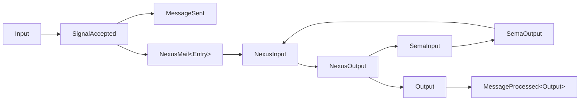

# 402 — Typed observer state + per-plane chain typing

*Kind: Implementation + Design · Topics: testing, schema-emitted-types, per-plane, execution-chain, schema-type-traits, on-sent-hookable · 2026-05-27*

*Per psyche directives (Maximum): record 995 (tests use schema-emitted
data types, not strings), record 996 (concrete shapes — typed assertion
OR NOTA round-trip), record 997 (per-plane chain typing through engine
trait surfaces), record 998 (constraint reiteration). Companion to /399
(Pattern A synthesis), /400 (pilot implementation), /401 (Pattern A
walkthrough). Operator's `main` `8cd5dcf7` ("spirit: require schema
object runtime witnesses") landed the same discipline in
`runtime_triad.rs` and ARCHITECTURE.md in parallel.*

## Frame

Records 995 and 997 together sharpen what a "test" means in the
schema-derived runtime. **The schema-emitted types ARE the test
vocabulary** — observer state stays typed, the execution chain
passes typed values through the engine trait surfaces at every
plane crossing, and assertions compare typed values to typed values
(or, for readable multi-event sequences, against a NOTA fixture
produced by the schema-emitted `to_nota()`).

The keystone in-flight target was `tests/on_sent_hookable_pilot.rs`
in `spirit-next` — the Pattern A pilot. Before this dispatch, the
test file held a `LoggingObserver` whose state was `Vec<String>`
with formatted tokens like `flow:sent:1`. The engine was typed; the
observer was stringly-typed; the assertion compared text. That's
the exact anti-pattern record 995 names.

## What landed

**Branch:** `designer-on-sent-hookable-pilot-2026-05-27` in
`/git/github.com/LiGoldragon/spirit-next` (worktree at
`~/wt/github.com/LiGoldragon/spirit-next/designer-on-sent-hookable-pilot-2026-05-27`).

**Commit:** `0cccbf6b` — designer: typed observer state + per-plane
chain typing in `on_sent_hookable_pilot` tests.

**Workspace skill update:** `skills/testing.md` gains a "Schema-typed
observer state and per-plane chain typing" section, three anti-pattern
entries, and a review-checklist bullet. See section §5 below.

**Test count:** 17 in `on_sent_hookable_pilot` (was 13), four new
chain-typing tests added. Full crate: 28 tests pass
(`on_sent_hookable_pilot` 17 + `generated_signal_plane` 4 +
`process_boundary` 1 + `runtime_triad` 6).

## 1. The stringly-typed anti-pattern, removed

The legacy `LoggingObserver` lowered each event to a formatted
string:

```rust
// BEFORE — stringly-typed observer state
struct LoggingObserver {
    log: Arc<Mutex<Vec<String>>>,
    label: String,
}

impl MessageSentHook for LoggingObserver {
    type Error = Infallible;
    fn message_sent(&mut self, event: MessageSent) -> Result<(), Self::Error> {
        self.log
            .lock()
            .expect("log lock")
            .push(format!("{}:sent:{}", self.label, event.identifier.0));
        Ok(())
    }
}
```

The assertion then compared text:

```rust
assert_eq!(
    *log.lock().expect("log"),
    vec!["flow:sent:1", "flow:processed:1", "flow:sent:2", "flow:processed:2"],
);
```

The engine produced a typed `MessageSent` event; the observer
collapsed it to a token; the assertion ran on strings. The
type-system the design relies on was bypassed at the test layer.

The replacement observer holds the schema-emitted enum directly:

```rust
// AFTER — typed observer state, schema-emitted enum
#[derive(Default)]
struct TypedSentObserver {
    events: Vec<MailLedgerEvent>,
}

impl MessageSentHook for TypedSentObserver {
    type Error = Infallible;
    fn message_sent(&mut self, event: MessageSent) -> Result<(), Self::Error> {
        self.events.push(event.into_mail_ledger_event());
        Ok(())
    }
}
```

The assertion is typed end-to-end:

```rust
let expected: Vec<MailLedgerEvent> = (1..=3)
    .map(|identifier| MailLedgerEvent::Sent(SentMail {
        mail_identifier: MailIdentifier(identifier),
        short_header: ShortHeader(0),
    }))
    .collect();
assert_eq!(observer.lock().expect("observer").events(), &expected[..]);
```

`MailLedgerEvent::Sent(SentMail { mail_identifier, short_header })`
is the same enum the engine's internal log records — the test
asserts what the runtime actually emits, not a string projection
of it.

## 2. Per-plane chain typing — record 997's sharpening

Record 997 (Maximum) extends record 995 by demanding that tests
exercise the ACTUAL EXECUTION CHAIN with the right schema-emitted
type at each plane crossing. The triad is:

| Engine | Trait surface | Input type | Output type |
|---|---|---|---|
| Signal | `SignalActor::accept`, `Engine::handle` | `Input` (Signal-plane) | `Output` (Signal-plane) |
| Nexus | `InputNexus::record`, `InputNexus::observe` | `NexusMail<Payload>` (Nexus-plane) | `NexusOutput` (Nexus-plane) |
| SEMA | `Store::apply` | `SemaInput` (SEMA-plane) | `SemaOutput` (SEMA-plane) |

The Nexus engine ALSO performs plane translations — `Signal→Nexus`
via `NexusMail<Payload>::into_nexus_input()` and `Nexus→SEMA` via
`NexusOutput::into_sema_input()` (and the inverse on the reply
direction). Tests make those crossings VISIBLE in the test code.

### The full chain in one test

```rust
#[test]
fn full_per_plane_chain_is_exercised_through_engine_trait_surfaces() {
    let engine = Engine::default();
    let actor = SignalActor::default();
    let ledger = engine.mail_ledger_handle();

    let sent_observer = Arc::new(Mutex::new(TypedSentObserver::default()));
    let _sent_sub = ledger.on_mail_sent_shared(Arc::clone(&sent_observer));

    // Step 1+2: Signal-plane admission.
    let input: Input = Input::Record(entry("end-to-end through trait surfaces"));
    let accepted = actor.accept(input.clone()).expect("valid input");

    // Step 3: push_to_nexus — Engine acts as the InputNexus.
    let nexus_step: MessageProcessed<NexusOutput> = accepted
        .push_to_nexus(&engine, &ledger)
        .expect("engine nexus is infallible");

    // Step 4: typed Sent event in the observer (Nexus side-effect).
    let observer_events = sent_observer.lock().expect("sent").events().to_vec();
    assert!(matches!(observer_events[0], MailLedgerEvent::Sent(_)));

    // Step 5: NexusOutput carries the SemaInput for the next plane.
    let nexus_reply: NexusOutput = nexus_step.into_reply();
    let sema_input: SemaInput = nexus_reply.into_sema_input();
    assert!(matches!(sema_input, SemaInput::Record(_)));

    // Step 6: SEMA-plane execution via Store::apply.
    let mut sema_engine = Store::default();
    let sema_output: SemaOutput = sema_engine.apply(sema_input);
    assert!(matches!(sema_output, SemaOutput::Recorded(_)));

    // Step 7: Nexus translates SEMA output back to Signal Output.
    let final_nexus: NexusOutput = NexusInput::Sema(sema_output).into_nexus_output();
    let output: Output = final_nexus.into_signal_output();
    assert!(matches!(output, Output::RecordAccepted(_)));
}
```

The typed chain `Input → SignalAccepted → MessageSent → NexusMail<Entry>
→ NexusInput → NexusOutput → SemaInput → SemaOutput → NexusOutput → Output`
is visible in the test source. Every variable is typed; every
boundary crossing happens through a schema-emitted method
(`into_nexus_input`, `into_sema_input`, `into_signal_output`); every
engine call goes through its trait surface.

### Per-plane focused tests — closed plane vocabulary

Three companion tests each focus on ONE plane crossing:

```rust
#[test]
fn sema_engine_takes_sema_input_and_emits_sema_output() {
    let mut store = Store::default();
    let sema_input: SemaInput = SemaInput::Record(entry("sema is a closed plane"));
    let sema_output: SemaOutput = store.apply(sema_input);
    match sema_output {
        SemaOutput::Recorded(receipt) => {
            assert_eq!(receipt.record_identifier.0, 1);
            assert_eq!(receipt.database_marker, marker(1, 39));
        }
        other => panic!("Record SemaInput must produce Recorded SemaOutput; got {other:?}"),
    }
}
```

```rust
#[test]
fn nexus_engine_translates_signal_input_to_nexus_then_sema() {
    let engine = Engine::default();
    let nexus_mail: NexusMail<Entry> =
        NexusMail::new(MessageIdentifier(42), entry("typed chain through nexus"));
    let nexus_reply: NexusOutput = engine
        .record(nexus_mail.clone())
        .expect("engine record is infallible");
    let sema_input: SemaInput = nexus_reply.into_sema_input();
    match sema_input {
        SemaInput::Record(carried_entry) => {
            assert_eq!(carried_entry, nexus_mail.into_payload());
        }
        SemaInput::Observe(_) => panic!("Record path must produce SemaInput::Record"),
    }
}
```

```rust
#[test]
fn nexus_engine_translates_sema_output_back_to_signal_output() {
    let sema_output: SemaOutput = SemaOutput::Recorded(SemaReceipt {
        record_identifier: RecordIdentifier(7),
        database_marker: marker(3, 97),
    });
    let nexus_input: NexusInput = NexusInput::Sema(sema_output);
    let nexus_output: NexusOutput = nexus_input.into_nexus_output();
    let output: Output = nexus_output.into_signal_output();
    match output {
        Output::RecordAccepted(receipt) => {
            assert_eq!(receipt.record_identifier.0, 7);
            assert_eq!(receipt.database_marker, marker(3, 97));
        }
        other => panic!("Recorded SemaOutput must lower to RecordAccepted Output; got {other:?}"),
    }
}
```

Each test uses that plane's schema-emitted types throughout. The
SEMA test never constructs an `Input`; the Nexus test never reaches
into `Store`. The plane is closed in the test surface.

## 3. NOTA round-trip — record 996 shape (b)

For multi-event sequences where a typed vec literal is dense but
visually noisy, the end-to-end witness uses BOTH the typed
comparison AND a NOTA round-trip:

```rust
let recorded_events = events.lock().expect("flow events").clone();
assert_eq!(recorded_events, expected_events);  // shape (a) — typed assertion

let expected_nota = String::from(
    "(Sent (1 0))\n\
     (Processed (1 (1 39)))\n\
     (Sent (2 281474976710656))\n\
     (Processed (2 (1 39)))",
);
assert_eq!(nota_of(&recorded_events), expected_nota);  // shape (b) — NOTA fixture
```

`nota_of(&recorded_events)` iterates the typed `Vec<MailLedgerEvent>`
and calls the schema-emitted `MailLedgerEvent::to_nota()` on each.
The fixture string is readable; the observer state stays typed; both
assertion shapes pass for the same data.

The NOTA fixture also exposes the **short_header value**
(`281474976710656` = `0x0001_0000_0000_0000` = `INPUT_OBSERVE`) —
which means the test ALSO witnesses that the second `Sent` event
carries the Observe route header. The string fixture isn't lossy
about the schema types — it's the canonical encoding of them.

## 4. Per-plane chain typing — diagram



Each arrow is either an engine trait surface call (Signal:
`accept`/`push_to_nexus`; Nexus: `record`/`observe`; SEMA: `apply`)
or a schema-emitted projection method (`into_nexus_input`,
`into_sema_input`, `into_signal_output`). Every node IS a
schema-emitted type. The chain has no string segment.

The `Sent` and `Processed` lifecycle events are themselves typed
schema nouns; the observer captures `MailLedgerEvent::Sent(SentMail)`
and `MailLedgerEvent::Processed(ProcessedMail)` values — typed
projections of `MessageSent` and `MessageProcessed<Output>`.

## 5. Skill update — `skills/testing.md`

A new section "Schema-typed observer state and per-plane chain
typing" was added before the Anti-patterns section, covering:

- **Observer state stays typed** (record 995, 996) — typed `Vec`,
  two acceptable shapes: direct typed assertion OR NOTA round-trip.
- **Per-plane chain typing** (record 997) — Signal / Nexus / SEMA
  trait surfaces, plane closure, visible crossings.
- Example code mirroring the patterns in this report.
- Cross-references back to records 995, 996, 997, 998.

Three new anti-pattern entries:

- Stringly-typed observer state when the schema emits a typed enum.
- Tests that collapse multiple plane crossings into one
  `engine.handle()` call when the invariant under test IS the
  per-plane chain typing.
- Tests that construct intermediate per-plane values WITHOUT going
  through the engine trait surface.

One new review-checklist bullet, asking the per-plane chain-typing
questions explicitly.

## 6. Phase 2 audit — adjacent test files

The audit looked at every test file referenced as an adjacent
target (`macro_exploration`, `design_examples`, `lowering`) plus
the spirit-next siblings (`runtime_triad`, `process_boundary`,
`generated_signal_plane`).

### spirit-next sibling tests

| File | Stringly-typed observer? | Per-plane chain visible? | Status |
|---|---|---|---|
| `on_sent_hookable_pilot.rs` | was YES → now NO | now YES | refactored this dispatch |
| `runtime_triad.rs` | NO | YES — already typed end-to-end | operator landed parallel refactor at `8cd5dcf7` |
| `generated_signal_plane.rs` | NO (no observers) | YES — typed Input/Output through encode/decode | clean |
| `process_boundary.rs` | uses CLI text output | N/A (string is the wire surface) | exempt — process-boundary IS the wire boundary |

The `process_boundary.rs` test asserts on CLI stdout text — but
that string IS the wire-boundary surface (NOTA), not a stringly-
typed shortcut. The CLI's stdout output is part of the contract
under test; the typed value lives on the other side of the
process. No anti-pattern.

### Adjacent worktrees — design_examples, lowering, macro_engine

| Worktree | File | Concern | Status |
|---|---|---|---|
| `schema-next/designer-pair-style-namespace-2026-05-27` | `tests/lowering.rs` | tests schema language lowering, not engine chain | not applicable — pre-runtime |
| `schema-next/designer-pair-style-namespace-2026-05-27` | `tests/design_examples.rs` | typed assertions on lowered schema model | clean |
| `schema-next/designer-finish-macro-engine-2026-05-26` | `tests/macro_engine.rs` | macro-engine tests | not applicable — pre-runtime |
| `schema-next/designer-finish-macro-engine-2026-05-26` | `tests/lowering.rs` | same as above | not applicable |
| `nota-codec/*/tests/*round_trip*.rs` | NOTA codec round-trip witnesses | typed NOTA structures | clean |

Per-plane chain typing applies to **runtime tests** that exercise
the Signal/Nexus/SEMA engines through their trait surfaces — i.e.
component-runtime crates like `spirit-next`. Schema-language tests
(macro lowering, schema lowering) and codec round-trip tests live
at a different layer of the stack; record 997 doesn't bind them.

No discoverable shortcuts in the audited files. Note for follow-up:
when the schema engine grows runtime semantics (currently it just
lowers schema into a model), the same discipline applies there too.

## 7. Per-plane chain typing — what stays open

1. **Compile-fail trybuild witness for SignalAccepted bypass.** A
   `trybuild` test that tries to construct `SignalAccepted { input,
   sent }` directly and confirms the compiler rejects it. Not
   blocking; the runtime witness `signal_accepted_can_only_be_produced_by_signal_actor_accept`
   exercises the constraint through the only valid path.

2. **Multi-thread fanout typed witnesses.** The current tests are
   single-threaded. A future test could spawn N threads pushing
   concurrently and assert each typed observer sees N×M
   `MailLedgerEvent::Sent` values in some valid interleaving. The
   `Mutex<Vec<_>>` subscriber lists are compatible.

3. **Hook error propagation typed witnesses.** Observers currently
   typed with `Error = Infallible`; the `.ok()` in
   `fire_message_sent` is structurally unreachable. A future
   iteration could allow fallible hooks; the per-hook error
   isolation invariant gets a typed witness.

4. **Backpressure typed witnesses for the async submit slice.** The
   QUEUE/WORKER half of primary-lrf8 hasn't landed yet; when it
   does, `SubmitError::QueueFull` becomes a typed witness for the
   per-plane chain at the admission boundary.

## 8. Chat-side substance

The branch is `designer-on-sent-hookable-pilot-2026-05-27` at
commit `0cccbf6b`. The four new chain-typing tests
(`sema_engine_takes_sema_input_and_emits_sema_output`,
`nexus_engine_translates_signal_input_to_nexus_then_sema`,
`nexus_engine_translates_sema_output_back_to_signal_output`,
`full_per_plane_chain_is_exercised_through_engine_trait_surfaces`)
make every Signal→Nexus and Nexus→SEMA crossing visible in the
test source.

Operator's `main` `8cd5dcf7` landed the same per-plane discipline
in `runtime_triad.rs` in parallel — both teams converged on the
same shape from the same intent records without coordination,
which is the discipline-from-intent signal working as designed.

Records 995, 996, 997, 998 are now manifest in BOTH the test
file AND the workspace skill. Future tests pick up the discipline
from `skills/testing.md`; the test file itself reads as a design
example of records 995 + 997 in motion.
